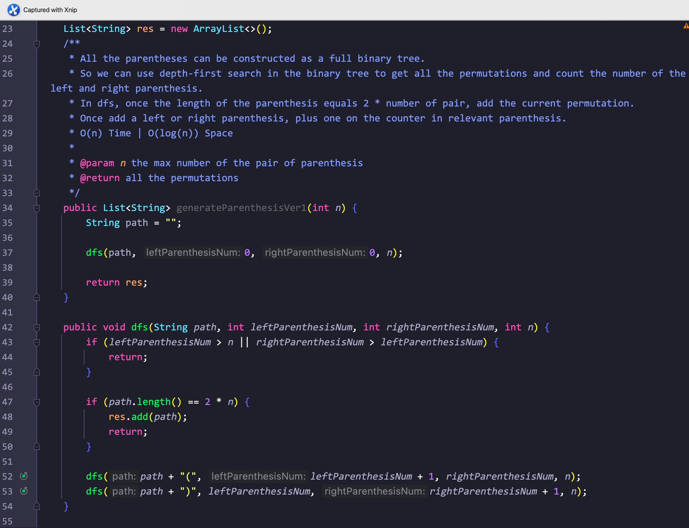
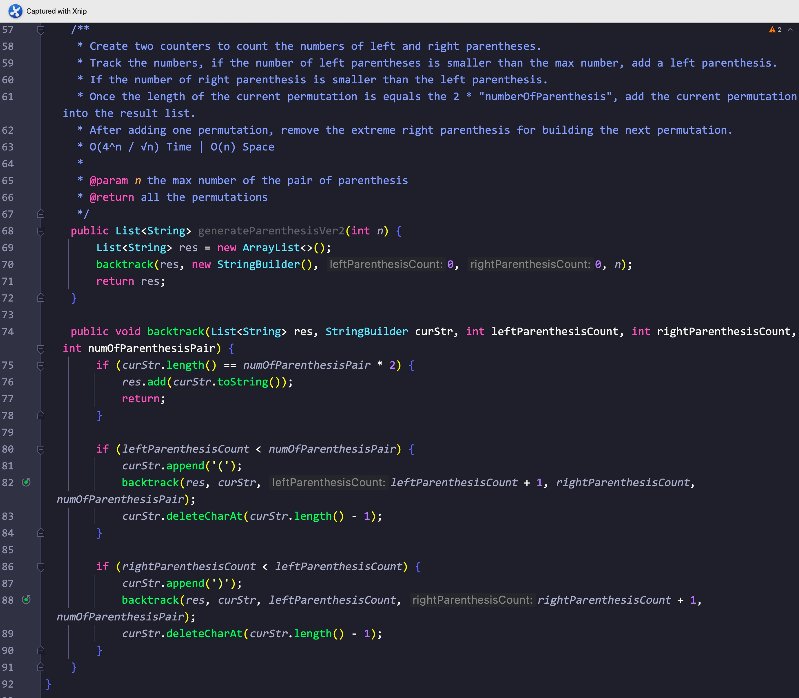

# Day91

## Tag: Back Track, DFS

题意:

给你一个数字n，代表生成括号的对数，请你找出能生成的所有有效对数的组合

思路1:

- 由于有效的括号都是成对的，所以这些括号可以形成一颗全二叉树，那么我们对该二叉树进行深度遍历后就能获取全部的组合方式
- 遍历二叉树自然能使用dfs递归，一旦获取的括号数量等于2 * n，则添加该组合方式到集合中
- 其中使用两个变量来记录左右括号的数量
- 最后返回该集合即可

复杂度1:

- 我们遍历了一次该二叉树，所以时间复杂度为O(n)
- 我们递归调用的栈空间取决于二叉树的高度，所以空间复杂度为O(log(n))

思路2:

- 使用回溯的方法，首先判断左括号的数量与n比较，如果小于则添加左括号
- 之后判断右括号是否小于左括号的数量(确保括号成对)，小于则添加右括号
- 一旦当前排列的长度等于2 * n，则添加当前排列并回溯
- 回溯后删除最后一个括号，从而获取另外的排列

复杂度2:

- 与卡特兰数有关，时间复杂度为O(4^n / √n)
- 我们递归调用的栈空间共2n层，所以空间复杂度为O(n)

