# Day91

## Tag: Back Track, DFS

题意:

给你一个数字n，代表生成括号的对数，请你找出能生成的所有有效对数的组合

思路1:

- 由于有效的括号都是成对的，所以这些括号可以形成一颗全二叉树，那么我们对该二叉树进行深度遍历后就能获取全部的组合方式
- 遍历二叉树自然能使用dfs递归，一旦获取的括号数量等于2 * n，则添加该组合方式到集合中
- 其中使用两个变量来记录左右括号的数量
- 最后返回该集合即可

复杂度1:

- 我们遍历了一次该二叉树，所以时间复杂度为O(n)
- 我们递归调用的栈空间取决于二叉树的高度，所以空间复杂度为O(log(n))

思路2:

- 使用回溯的方法，首先判断左括号的数量与n比较，如果小于则添加左括号
- 之后判断右括号是否小于左括号的数量(确保括号成对)，小于则添加右括号
- 一旦当前排列的长度等于2 * n，则添加当前排列并回溯
- 回溯后删除最后一个括号，从而获取另外的排列

复杂度2:

- 与卡特兰数有关，时间复杂度为O(4^n / √n)
- 我们递归调用的栈空间共2n层，所以空间复杂度为O(n)

****

# Day92

## Tag: Dynamic Programming, Array, Minus

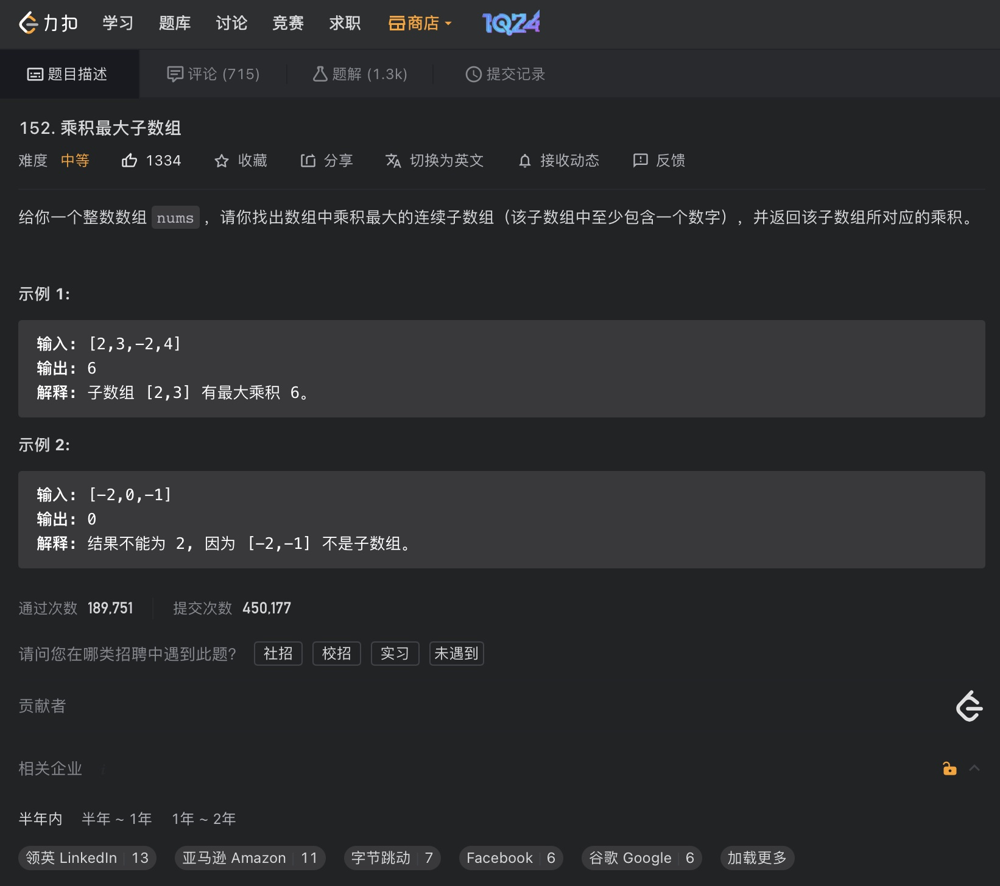

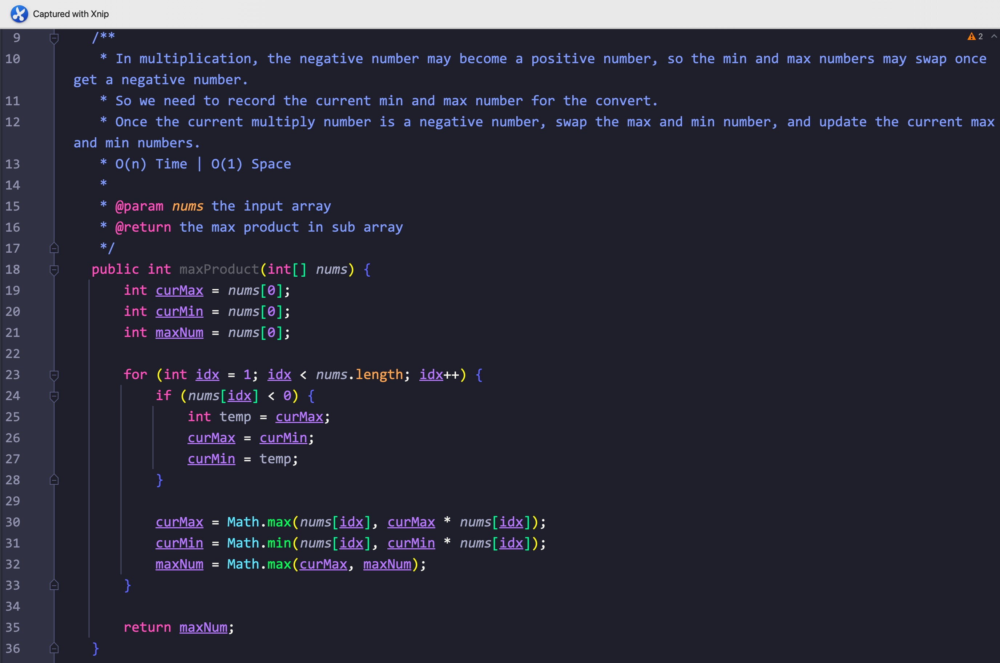

题意:

给你一个数组，请你计算出其中乘积最大的连续子数组

思路:

- 因为是连续的子数组，所以不能简单的通过比较当前值和当前值与前一位置记录值的乘积来获取当前范围内的最大乘积(其只适用于不连续的情况)
- 其中需要注意的是负数，如果我只记录最大值，那么该值乘以一个负数就会成为最小值，反之之前的最小值负数乘以负数则会成为最大值
- 所以我们需要同时记录当前的最大和最小值，一旦原数组当前位置的值为负数，则会交换最大最小值的位置
- 最后需要考虑0，我们只需要在更新最大最小值时使用如下formula即可:
- current max = max(current max, current max * current num)
- current min = min(current mix, current mix * current num)
- 更新的同时记录最大值，最后返回最大值即可

复杂度:

- 我们遍历了一次原数组，所以时间复杂度为O(n)
- 我们创建的变量个数为常量级，所以空间复杂度为O(1)

****

# Day93

## Tag: String, DP

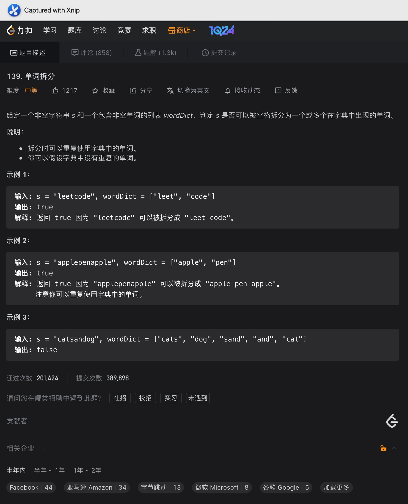

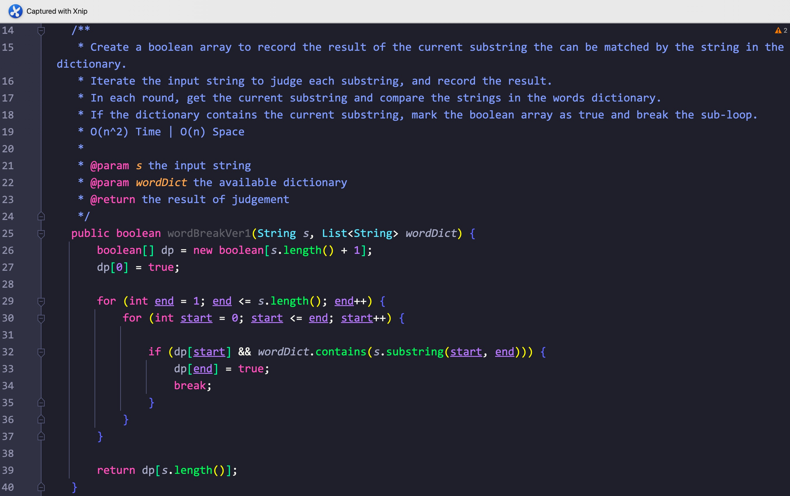

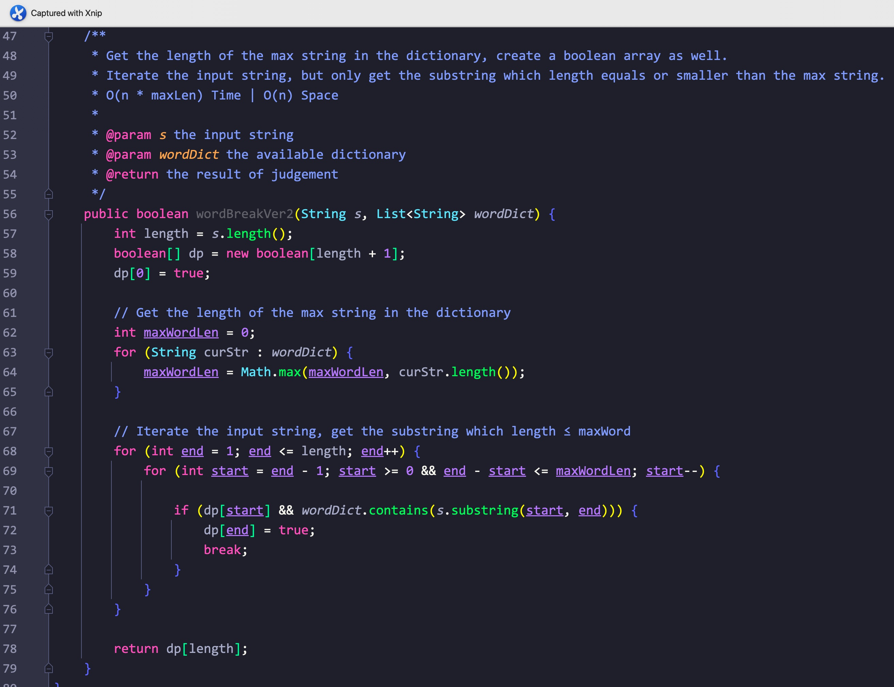

题意:

给你一个字符串和一个字符串集合，请你判断该字符串被拆分后能否完全匹配字符串集合中的元素(集合中的元素不限使用次数)

思路1:

- 从空字符开始，我们判断该字符串能够被拆分成字符串集合中的元素，并创建对应的数组来记录每个长度下字符串的匹配结果
- 遍历一次原字符串，每次循环又从0位置开始，在前面范围的字符能被匹配的前提下判断当前位置的子字串能否被匹配
- 能则将当前位置的记录数组设为true，并跳出当前子循环

复杂度1:

- 我们遍历了一次输入字符串，每次循环又从0位置开始取子字符串，所以时间复杂度为O(n^2)
- 我们创建了一个记录数组，所以空间复杂度为O(n)

思路2:

- 在思路1中，每次子循环我们都需要从0位置开始，所以时间复杂度为O(n^2)
- 但其实当我们每次取的子字符串与字典集合匹配时，对应的子字符串长度总是小于等于字段集合中的最长元素
- 所以我们将子循环进行一些修改，将循环条件限制为子字符串长度 ≤ 字典集合中最长元素即可

复杂度2:

- 由于修改了子循环条件，所以时间复杂度为O(n * maxLen)
- 我们创建了一个记录数组，所以空间复杂度为O(n)

****

# Day94

## Tag: Monotonic Stack

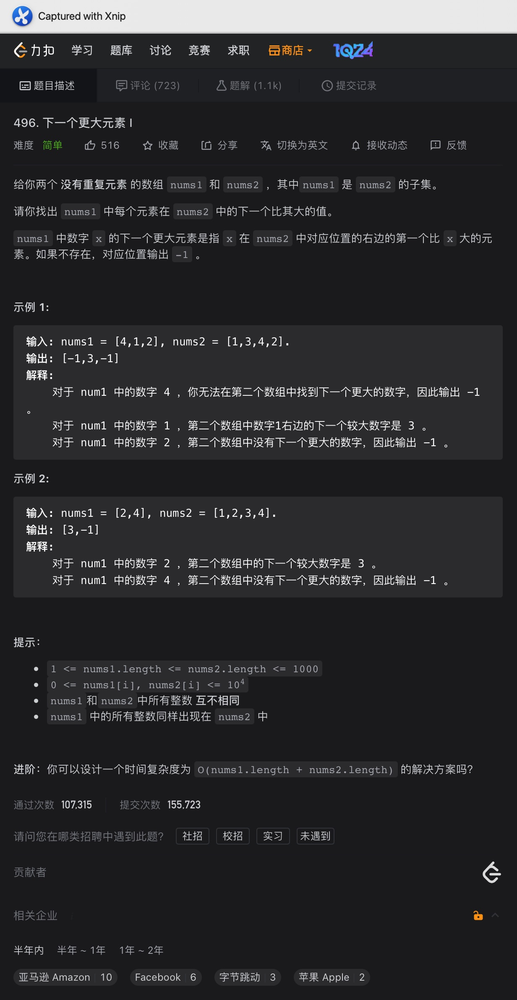

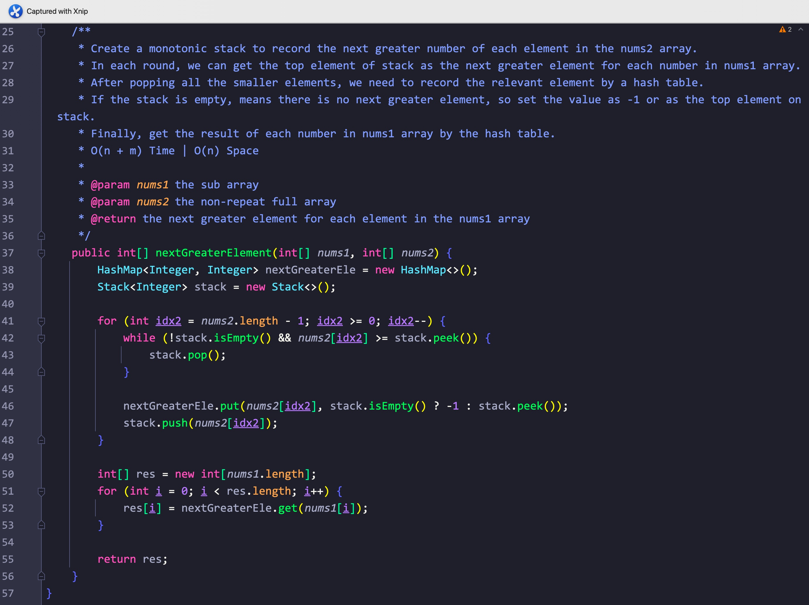

题意:

给你两个数组，其中nums1数组是nums2数组的子集，请你找出nums1中每个元素在nums2中的下一个更大元素(如果没有则记录为-1)

思路:

- 维护一个单调栈，遍历一次nums2中的元素，每次都将当前元素与栈顶元素对比
- 如果栈顶元素小于当前元素，则弹出栈顶元素(不是我们要的大于当前元素的数)
- 直到栈为空或者栈顶元素大于当前元素后，停止弹出
- 此时判断栈是否为空，为空则说明没有大于当前元素的值，则对应哈希映射中当前元素对应值为-1
- 不为空则将栈顶元素设为哈希映射中当前元素的对应值
- 之后将该元素如栈
- 最后我们遍历一次nums1数组，通过哈希表获取每个nums1元素对应的下一个更大值即可

复杂度:

- 我们遍历了一次nums2数组，又遍历了一次nums1数组，所以时间复杂度为O(n + m)
- 我们创建了一个单调栈，一个哈希表，一个结果数组，所以空间复杂度为O(m)

****

# Day95

## Tag: Binary Tree, Inorder Travesal, Morris

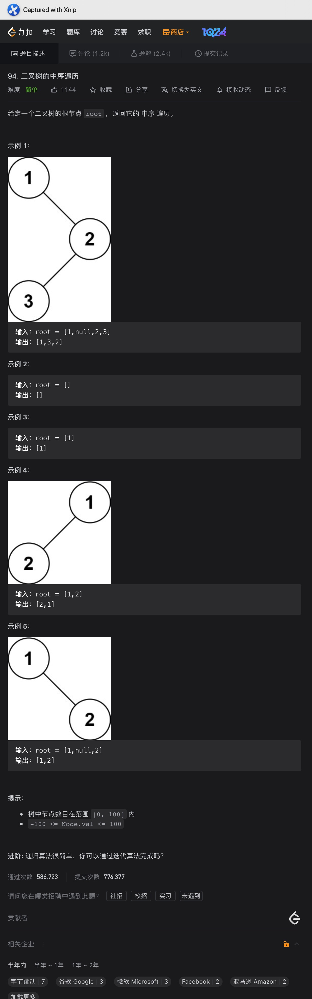

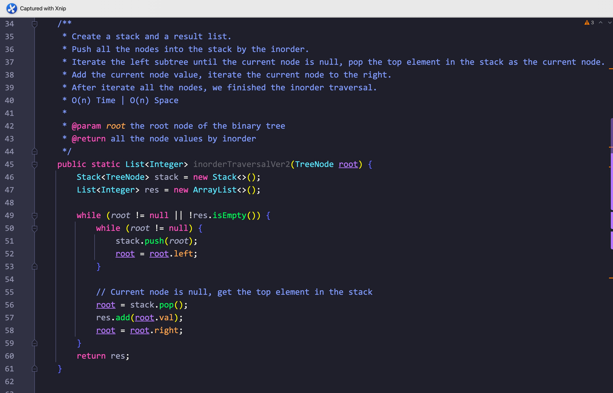

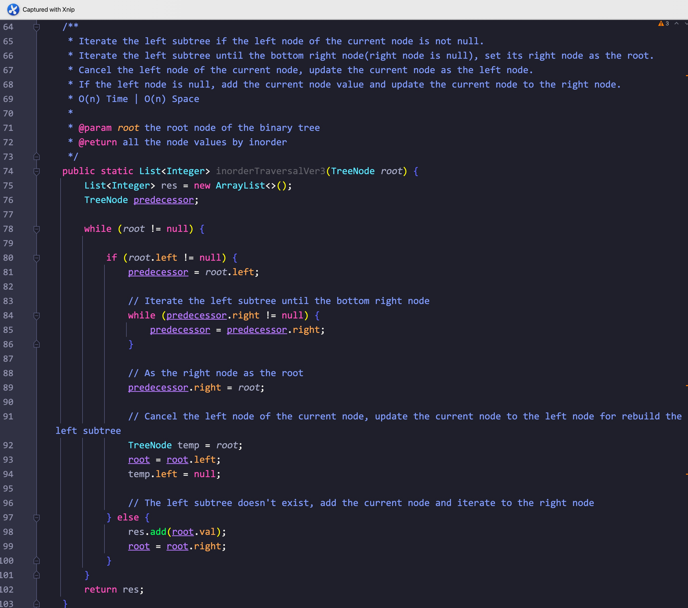

题意:

给你一颗二叉树，请你将其中的节点值以中序遍历的顺序添加到结果集合中，并返回该集合

思路1:

- 最简单的递归就不用说了，这里先说一下迭代
- 由于中序遍历的顺序就是左节点 - 操作 - 右节点，所以我们需要先获取每棵子树最底层的左节点
- 然后再依次返回上来，这里抽象一下: 最底层也是最后访问的节点反而最先没添加到结果集合中，先进后出，这不就是栈吗？
- 所以我们可以创建一个栈，只要当前节点不为null，则压入栈中，之后更新当前节点为左子节点
- 当前节点为null的话，则弹出栈顶元素作为当前节点，添加当前节点值到结果集合中(栈内元素从栈顶开始向下都是按照中序遍历的顺序的)
- 按照顺序，此时节点作为根节点，而我们已经遍历到了最左节点，所以下一步需要处理右子节点，因此我们更新到右子节点
- 在循环中判断当前节点和栈是否为空即可

复杂度1:

- 我们遍历了一遍该二叉树，所以时间复杂度为O(n)
- 我们创建了一个栈和一个结果集合，所以空间复杂度为O(n)

思路2:

- Morris遍历法不需要额外的空间，其会将二叉树转换为一个单向的链表，所以其会改变原二叉树的结构
- 其原理就是按照中序遍历的顺序将所有的节点都重新连接为一个单向的链表(只保留每个节点的右子节点)
- 按照其原理，我们首先获取左子树中中序遍历后的最后一个节点(即其中的最右子节点)
- 按照中序遍历的顺序，其后面是根节点，所以我们将这个最右子节点的右子节点设置为根节点，这样就连接了起来
- 处理完最大的树之后，我们还需要处理左子树:
- 将原根节点拷贝一下，更新根节点到左子树根节点以之后按照同样的步骤处理左子树，最后断开拷贝节点的左节点(我们最后只保留右子节点)

复杂度2:

- 我们通过Morris遍历将所有的节点都遍历了两次，所以时间复杂度为O(n)
- 我们本来只是修改了原二叉树的结构，本质上来说其实不会占用空间，空间复杂度应该为O(1)，但这道题目需要返回集合，所以在这道题目中空间复杂度依然为O(n)

****

# Day96

## Tag: Stack, Min Stack, Max Stack

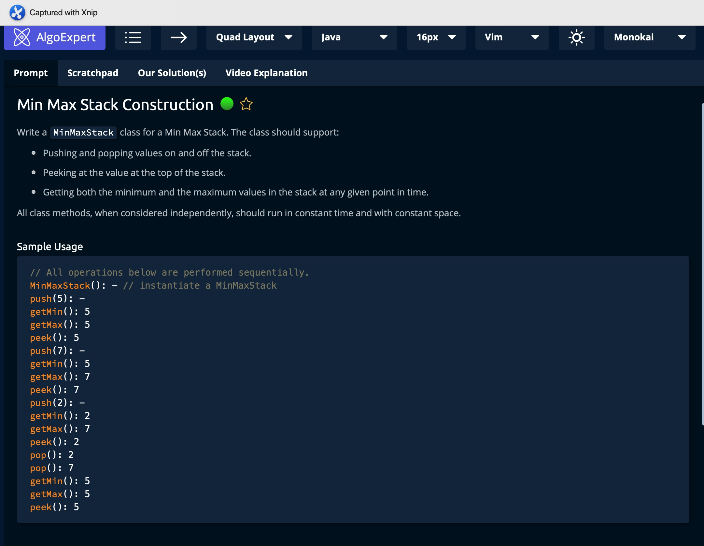

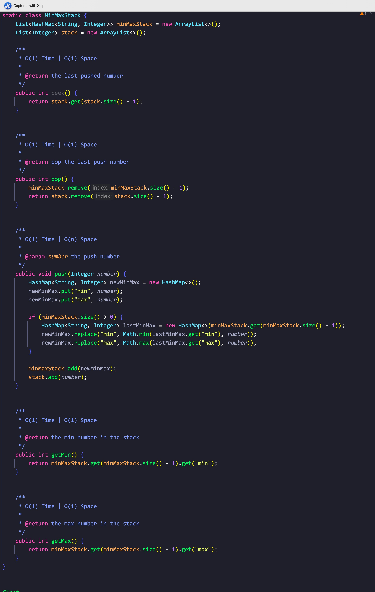

题意:

请你构建一个minMaxStack类，实现其中的pop(), push(), peek(), getMin(), getMax()方法

思路:

- 题目的要求其实就是在栈的基础上多实现了getMin()和getMax()方法
- 所以我们需要动态的维护栈中的最值，在维护过程中，push和pop方法会对这两个值产生影响(栈中元素发生了变化)，所以调用这两个方法后都需要维护最值
- 原本的栈结构不需要变化，我们需要空间来动态记录最值
- 其实我们在调用push方法的时候就能更新这两个值了，每压入一个新元素，我们都用另一个结构(这里是一个HashMap)将其与栈顶(集合末尾元素)进行比较，以获取当前栈中的最值，并将该元素放到栈顶(集合末尾即可)
- 这样hash集合中每个元素都对应剩余范围内的最值，每次调用push方法时就更新hash集合中的对象即可

****

# Day97

## Tag: Stack

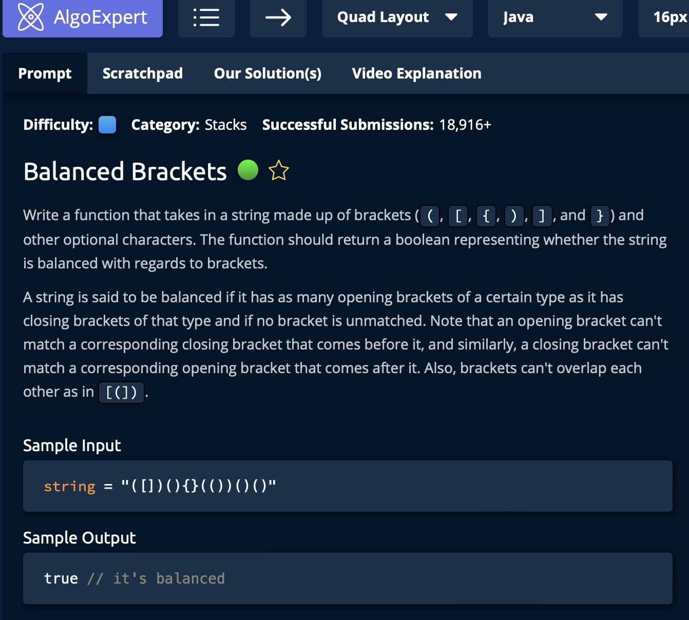

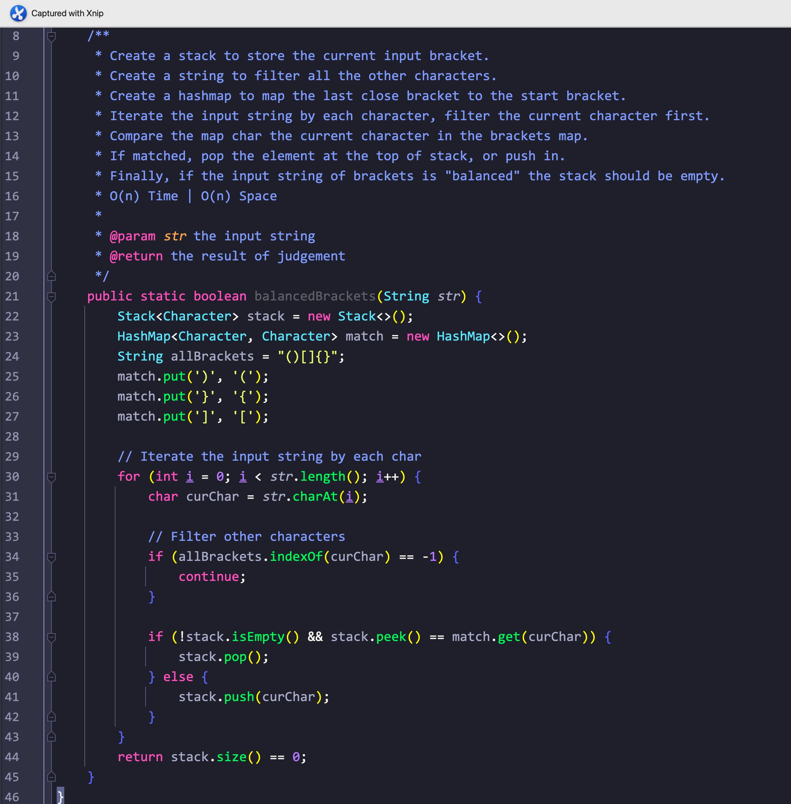

题意:

给你一个字符串，其中有一些括号和其他一些字符，请你判断其中的括号是否"平衡"

思路:

- 所谓的括号配对其实就是每对括号要在同一层级，其实这个结构和栈一样，一旦有配对的括号就弹出栈中的括号即可
- 但输入字符串中还有一些其他的字符，我们需要处理的只有括号字符，所以我们需要过滤掉其他字符
- 这里我们创建一个字符串，其中记录了所有的括号，每次都通过该字符串对当前输入的字符进行判断，如果当前字符不存在于括号字符串中，说明当前字符不是括号，我们则跳过该字符即可
- 过滤后我们判断栈顶元素和当前元素对应的括号，如果能匹配则弹出栈顶元素
- 最后判断栈是否为空，为空则说明每对括号都在同一层级，输入字符串中的括号是"平衡"的

复杂度:

- 我们遍历了一次输入字符，所以时间复杂度为O(n)
- 我们创建了一个hash表来记录闭合括号对应的左括号，我们还创建了一个栈来记录当前输入的括号，所以空间复杂度为O(n)

