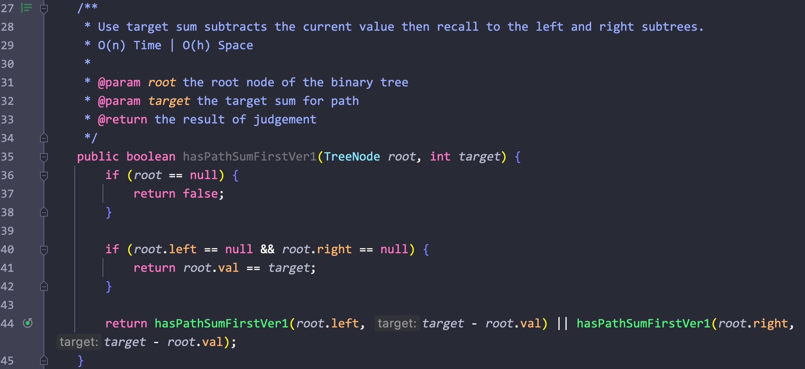

# Day91

## Tag: Back Track, DFS

题意:

给你一个数字n，代表生成括号的对数，请你找出能生成的所有有效对数的组合

思路1:

- 由于有效的括号都是成对的，所以这些括号可以形成一颗全二叉树，那么我们对该二叉树进行深度遍历后就能获取全部的组合方式
- 遍历二叉树自然能使用dfs递归，一旦获取的括号数量等于2 * n，则添加该组合方式到集合中
- 其中使用两个变量来记录左右括号的数量
- 最后返回该集合即可

复杂度1:

- 我们遍历了一次该二叉树，所以时间复杂度为O(n)
- 我们递归调用的栈空间取决于二叉树的高度，所以空间复杂度为O(log(n))

思路2:

- 使用回溯的方法，首先判断左括号的数量与n比较，如果小于则添加左括号
- 之后判断右括号是否小于左括号的数量(确保括号成对)，小于则添加右括号
- 一旦当前排列的长度等于2 * n，则添加当前排列并回溯
- 回溯后删除最后一个括号，从而获取另外的排列

复杂度2:

- 与卡特兰数有关，时间复杂度为O(4^n / √n)
- 我们递归调用的栈空间共2n层，所以空间复杂度为O(n)

****

# Day92

## Tag: Dynamic Programming, Array, Minus

题意:

给你一个数组，请你计算出其中乘积最大的连续子数组

思路:

- 因为是连续的子数组，所以不能简单的通过比较当前值和当前值与前一位置记录值的乘积来获取当前范围内的最大乘积(其只适用于不连续的情况)
- 其中需要注意的是负数，如果我只记录最大值，那么该值乘以一个负数就会成为最小值，反之之前的最小值负数乘以负数则会成为最大值
- 所以我们需要同时记录当前的最大和最小值，一旦原数组当前位置的值为负数，则会交换最大最小值的位置
- 最后需要考虑0，我们只需要在更新最大最小值时使用如下formula即可:
- current max = max(current max, current max * current num)
- current min = min(current mix, current mix * current num)
- 更新的同时记录最大值，最后返回最大值即可

复杂度:

- 我们遍历了一次原数组，所以时间复杂度为O(n)
- 我们创建的变量个数为常量级，所以空间复杂度为O(1)

****

# Day93

## Tag: String, DP

题意:

给你一个字符串和一个字符串集合，请你判断该字符串被拆分后能否完全匹配字符串集合中的元素(集合中的元素不限使用次数)

思路1:

- 从空字符开始，我们判断该字符串能够被拆分成字符串集合中的元素，并创建对应的数组来记录每个长度下字符串的匹配结果
- 遍历一次原字符串，每次循环又从0位置开始，在前面范围的字符能被匹配的前提下判断当前位置的子字串能否被匹配
- 能则将当前位置的记录数组设为true，并跳出当前子循环

复杂度1:

- 我们遍历了一次输入字符串，每次循环又从0位置开始取子字符串，所以时间复杂度为O(n^2)
- 我们创建了一个记录数组，所以空间复杂度为O(n)

思路2:

- 在思路1中，每次子循环我们都需要从0位置开始，所以时间复杂度为O(n^2)
- 但其实当我们每次取的子字符串与字典集合匹配时，对应的子字符串长度总是小于等于字段集合中的最长元素
- 所以我们将子循环进行一些修改，将循环条件限制为子字符串长度 ≤ 字典集合中最长元素即可

复杂度2:

- 由于修改了子循环条件，所以时间复杂度为O(n * maxLen)
- 我们创建了一个记录数组，所以空间复杂度为O(n)

****

# Day94

## Tag: Monotonic Stack

题意:

给你两个数组，其中nums1数组是nums2数组的子集，请你找出nums1中每个元素在nums2中的下一个更大元素(如果没有则记录为-1)

思路:

- 维护一个单调栈，遍历一次nums2中的元素，每次都将当前元素与栈顶元素对比
- 如果栈顶元素小于当前元素，则弹出栈顶元素(不是我们要的大于当前元素的数)
- 直到栈为空或者栈顶元素大于当前元素后，停止弹出
- 此时判断栈是否为空，为空则说明没有大于当前元素的值，则对应哈希映射中当前元素对应值为-1
- 不为空则将栈顶元素设为哈希映射中当前元素的对应值
- 之后将该元素如栈
- 最后我们遍历一次nums1数组，通过哈希表获取每个nums1元素对应的下一个更大值即可

复杂度:

- 我们遍历了一次nums2数组，又遍历了一次nums1数组，所以时间复杂度为O(n + m)
- 我们创建了一个单调栈，一个哈希表，一个结果数组，所以空间复杂度为O(m)

****

# Day95

## Tag: Binary Tree, Inorder Travesal, Morris

题意:

给你一颗二叉树，请你将其中的节点值以中序遍历的顺序添加到结果集合中，并返回该集合

思路1:

- 最简单的递归就不用说了，这里先说一下迭代
- 由于中序遍历的顺序就是左节点 - 操作 - 右节点，所以我们需要先获取每棵子树最底层的左节点
- 然后再依次返回上来，这里抽象一下: 最底层也是最后访问的节点反而最先没添加到结果集合中，先进后出，这不就是栈吗？
- 所以我们可以创建一个栈，只要当前节点不为null，则压入栈中，之后更新当前节点为左子节点
- 当前节点为null的话，则弹出栈顶元素作为当前节点，添加当前节点值到结果集合中(栈内元素从栈顶开始向下都是按照中序遍历的顺序的)
- 按照顺序，此时节点作为根节点，而我们已经遍历到了最左节点，所以下一步需要处理右子节点，因此我们更新到右子节点
- 在循环中判断当前节点和栈是否为空即可

复杂度1:

- 我们遍历了一遍该二叉树，所以时间复杂度为O(n)
- 我们创建了一个栈和一个结果集合，所以空间复杂度为O(n)

思路2:

- Morris遍历法不需要额外的空间，其会将二叉树转换为一个单向的链表，所以其会改变原二叉树的结构
- 其原理就是按照中序遍历的顺序将所有的节点都重新连接为一个单向的链表(只保留每个节点的右子节点)
- 按照其原理，我们首先获取左子树中中序遍历后的最后一个节点(即其中的最右子节点)
- 按照中序遍历的顺序，其后面是根节点，所以我们将这个最右子节点的右子节点设置为根节点，这样就连接了起来
- 处理完最大的树之后，我们还需要处理左子树:
- 将原根节点拷贝一下，更新根节点到左子树根节点以之后按照同样的步骤处理左子树，最后断开拷贝节点的左节点(我们最后只保留右子节点)

复杂度2:

- 我们通过Morris遍历将所有的节点都遍历了两次，所以时间复杂度为O(n)
- 我们本来只是修改了原二叉树的结构，本质上来说其实不会占用空间，空间复杂度应该为O(1)，但这道题目需要返回集合，所以在这道题目中空间复杂度依然为O(n)

****

# Day96

## Tag: Stack, Min Stack, Max Stack

题意:

请你构建一个minMaxStack类，实现其中的pop(), push(), peek(), getMin(), getMax()方法

思路:

- 题目的要求其实就是在栈的基础上多实现了getMin()和getMax()方法
- 所以我们需要动态的维护栈中的最值，在维护过程中，push和pop方法会对这两个值产生影响(栈中元素发生了变化)，所以调用这两个方法后都需要维护最值
- 原本的栈结构不需要变化，我们需要空间来动态记录最值
- 其实我们在调用push方法的时候就能更新这两个值了，每压入一个新元素，我们都用另一个结构(这里是一个HashMap)将其与栈顶(集合末尾元素)进行比较，以获取当前栈中的最值，并将该元素放到栈顶(集合末尾即可)
- 这样hash集合中每个元素都对应剩余范围内的最值，每次调用push方法时就更新hash集合中的对象即可

****

# Day97

## Tag: Stack

题意:

给你一个字符串，其中有一些括号和其他一些字符，请你判断其中的括号是否"平衡"

思路:

- 所谓的括号配对其实就是每对括号要在同一层级，其实这个结构和栈一样，一旦有配对的括号就弹出栈中的括号即可
- 但输入字符串中还有一些其他的字符，我们需要处理的只有括号字符，所以我们需要过滤掉其他字符
- 这里我们创建一个字符串，其中记录了所有的括号，每次都通过该字符串对当前输入的字符进行判断，如果当前字符不存在于括号字符串中，说明当前字符不是括号，我们则跳过该字符即可
- 过滤后我们判断栈顶元素和当前元素对应的括号，如果能匹配则弹出栈顶元素
- 最后判断栈是否为空，为空则说明每对括号都在同一层级，输入字符串中的括号是"平衡"的

复杂度:

- 我们遍历了一次输入字符，所以时间复杂度为O(n)
- 我们创建了一个hash表来记录闭合括号对应的左括号，我们还创建了一个栈来记录当前输入的括号，所以空间复杂度为O(n)

****

# Day98

## Tag: Bit Operator, Array

题目1:

给你一个数组，其中只有一个数出现了一次，其余数都出现了两次，请你找出那个只出现一次的数字

思路:

- 使用异或运算，出现两次的数组抵消后自然为0，出现一次的数字自然保留

复杂度:

- 我们遍历了一次原数组，所以时间复杂度为O(n)
- 我们创建的变量个数为常量级，所以空间复杂度为O(1)

题目2:

给你一个数组，其中只有一个数出现了一次，其余数都出现了三次，请你找出那个只出现一次的数字

思路:

- 由于里面的其他数字出现了三次，所以无法使用异或了
- 但这里有一个规律:
- 所有数字都出现了三次，那么将它们转换为二进制后，累加每一位上的1，再每一位关于3取余数，获取到的每一位二进制数累加即目标值
- 所以，我们需要先累加数组内所有数的二进制值(因为数组限制为int类型，所以最多有32个二进制位)
- 我们创建一个长度为32的数组，遍历输入数组，对其中的每一个数字中的每一个二进制位都进行统计，累加到数组对应的bit上
- 最后遍历这个长度为32的数组，获取每一位对3取余数的结果，累加到结果数字上，最后返回结果数字

复杂度:

- 我们遍历了一次原数组，每次循环又都遍历了32次，最后遍历了这个长度为32的记录数组，所以时间复杂度为O(n)
- 我们创建的变量个数为常量级，所以空间复杂度为O(1)

题目3:

- 给你一个数组，其中有两个数出现了一次，其余数都出现了两次，请你找出那两个只出现一次的数字

思路:

- 如果只有一个数字的话，和题目1一样使用异或就行，但这里有些不同
- 我们同样使用异或遍历原数组，此时遍历后的结果为我们所需两个数字进行异或的结果
- 两个不同的数字进行异或操作后，该结果二进制中一定有为1的数位(该位置上两数字的二进制位不同)
- 我们通过这个异或的结果可以获取两目标数字之间不同数位的位置
- 通过这个不同的数位，我们再对原数组中的每个数都在相同的数位进行异或操作，比较后的两种结果则对应两个目标数字，这样就还原了

复杂度:

- 我们遍历了两次原数组，又将异或结果遍历了一次，所以时间复杂度为O(n)
- 我们创建的变量个数为常量级，所以空间复杂度为O(1)

****

# Day99

## Tag: String, Array

题意:

给你一个字符串数组，请你判断其中有哪些字符串可以由同一行的键盘按键打印出来

思路:

- 利用String类里的indexOf方法，如果字符串中存在参数字符则返回索引，没有则返回-1
- 遍历一次输入数组，判断每个字符串中的第一个字符在哪个键盘行中(一共三行)，这里注意要处理为统一的小写或者大写(看你创建的字符表)，符合添加就暂时添加到一个集合中
- 最后创建一个和集合等长的字符串数组，将集合中的所有元素都添加到数组中，最后返回该数组

复杂度:

- 我们遍历了一次原数组，又遍历了一次集合，所以时间复杂度为O(n)
- 我们创建了三个字符表，一个集合和一个结果数组，所以空间复杂度为O(n)

****

# Day100

## Tag: Stack, Array

题意:

给你一个数组，其中每个数字代表当前位置建筑的高度，再给你一个字符串表示建筑延伸的方向，请你找出其中能够看到日出的所有建筑对应的索引值

思路:

- 因为这里有两种方向(WEST/EAST)，所以我们可以根据情况来写
- 如果方向为EAST，则说明太阳在数组右边升起，那么我们就从右边开始遍历数组(从最后一个索引位置开始)，设置一个当前最高建筑高度变量
- 如果当前建筑高度大于这个最值，则说明其前面没有遮挡，可以看到日出，因此将其添加到结果集合中，并将其更新为当前的最高值
- 最后，我们需要反转这个集合，因为此时的索引顺序是反的
- 如果方向为WEST，则说明太阳在数组左边升起，那么我们就从左边开始遍历数组(从第一个索引位置开始)，设置一个当前最高建筑高度变量
- 其余与之前一致，不过此时不再需要反转集合

复杂度:

- 我们遍历了一次输入数组，所以时间复杂度为O(n)
- 我们创建了一个集合，其记录了所有符合条件的建筑对应的索引值，所以空间复杂度为O(n)

****

# Day101

## Tag: Binary Tree, Path Sum, Recursive

题意:

给你一颗二叉树的根节点，一个目标和，请你判断该二叉树中是否存在从根节点到叶子节点值之和为目标值的路径

思路1:

- 我们可以选择累加直到根节点，但其实也可以选择没到一层就用当前目标值减去当前节点的值，最后在根节点判断根节点值是否等于目标值即可

复杂度1:

- 我们几乎遍历了所有的节点，所以时间复杂度为O(n)
- 我们递归调用的栈空间取决于树的高度，所以空间复杂度为O(h)

思路2:

- 这次我们使用累加的方式，保证同步更新每条路径的和，这就需要我们将每一层都遍历完之后再进行下一层，这不就是广度优先嘛
- 所以我们创建两个队列，每次取出其中的节点和值，累加到当前的节点值中，如果没到叶子结点，则将剩余节点添加到队列，如果已经到了叶子节点，再进行判断即可

复杂度2:

- 我们遍历了几乎所有的节点，所以时间复杂度为O(n)
- 我们创建了两个队列来记录数据，所以空间复杂度为O(n)

****

# Day102

## Tag: Binary Tree, Path Sum, DFS/BFS

题意:

给你一颗二叉树，一个目标数，请你找出所有从根节点到叶子结点的节点值之和等于该目标值的路径

思路:

- 从题目上来说，其实就是要计算每条路径的和，并记录路径中的节点值
- 要是按照每条路径来算的话，其实就是dfs，但这里在普通dfs的基础上，还需要进行"回溯"，因为当一条路径不符合条件时，我们需要删除这条路径的记录，转向另外的路径
- 具体在计算时，则需要累加路径和，并记录当前路径的节点值，如果当前节点为叶子结点，且路径和等于目标数，则添加当前的路径到结果集合中
- 最后需要删除当前路径中的最后一个节点值，意味着当前分支下的路径已经计算完毕，删除该节点后转而计算另外的路径(左子树到右子树)

复杂度:

- 最坏时，我们需要记录所有的路径，所以时间复杂度为O(n ^ 2)
- 除了记录结果集合外，我们递归调用的栈空间大小不会超过树中的节点数，所以空间复杂度为O(n)

