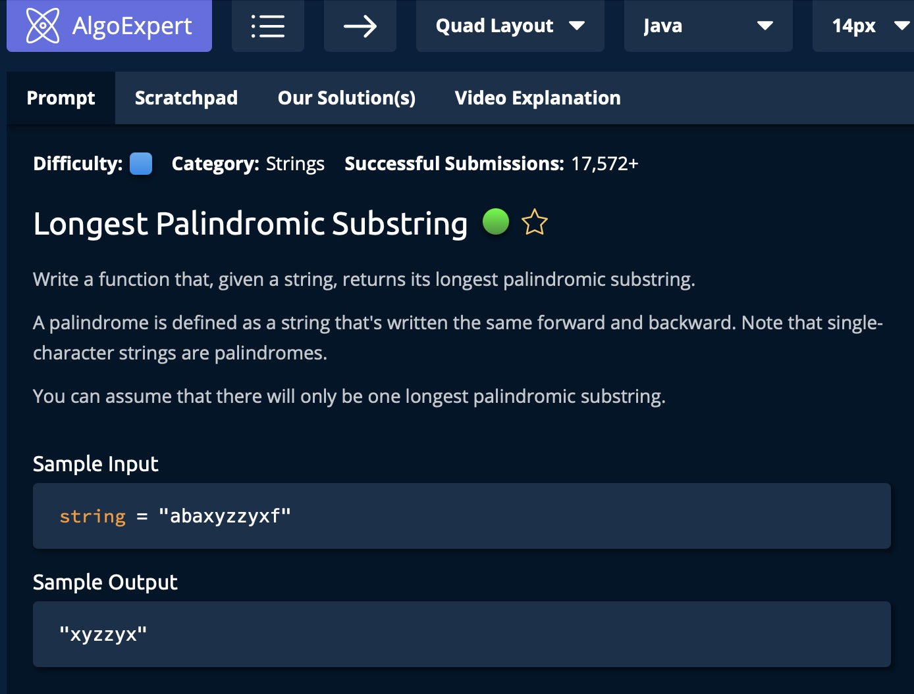
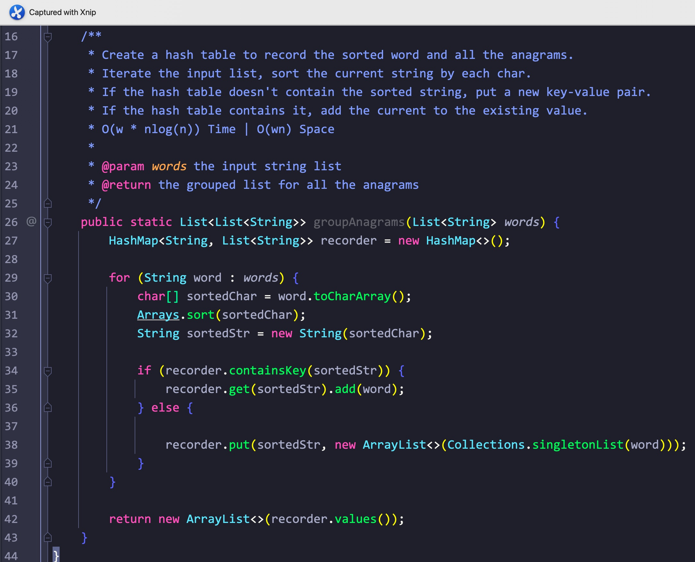

# Day4

## Tag: Linked List, Duplicate

题意:

给你一个链表，请你去除其中重复的链表节点，并只保留一个

思路:

- 将链表遍历一次，每次都将当前位置的节点与后一个节点做对比
- 如果两个节点相同，则将后一个节点更新为其后一个节点，直到后一个节点与当前节点不同为止后，更新当前节点为后一个节点

实现:

- 很简单，看code

复杂度:

- 我们将该链表中的所以节点都遍历了一次，所以消耗为n，n为链表中的节点数量，时间复杂度为O(n)
- 我们只创建了一个头节点的拷贝，所以创建的变量数为常数级，空间复杂度为O(1)

面试:

- 在处理链表和数组前都要记住: 一定要问清楚是否可以更改原数据(原数组的顺序，原头节点的指向)

****

# Day5

## Tag:

题意:

给你两个链表，请你从头节点开始，计算出它们两个加起来的结果，并返回结果链表的头节点

思路:

- 如果两个链表的长度相同，那么我们就只需要每次都获取两个节点之和，用10取余后就可以获取每个节点的值，但问题是如果不等长呢？
- 很简单，我们在计算当前的总和时，判断每个链表是否为空，为空则将其对应的值设置为0，不为空则添加其值
- 最后迭代也可以用这种方式
- 需要注意的是，如果两个链表都为空了，但进位不为0，那么意味着我们最后还需要添加一个节点，且值为1

实现:

- 创建两个参数链表头节点的拷贝，防止原链表被修改
- 创建一个结果链表，计划最后将其下一个节点作为结果返回，所以我们需要对结果链表的下一节点创建一个拷贝(operator)，之后的操作都针对这个拷贝
- 初始化进位为0，之后会多次使用
- 设立一个循环，只要有一个链表节点不为空，或者进位不为0，都要执行下列操作:
- 初始化两个链表的当前值，如果链表指针为空，则值为0
- 将当前值取余后，作为拷贝节点(operator)的一下个节点的值
- 更新拷贝节点到下一个节点(opeartor = operator.next)，更新进位carry和两个参数节点的拷贝
- 最后返回结果节点的下一个节点即可

复杂度:

- 我们遍历的次数最坏为最长的链表长度+1(最后还有进位的话)，所以时间复杂度为O(max(n, m))
- 我们创建了一个新的链表来记录和，所以空间复杂度为O(max(n, m))

面试:

- 注意问清楚是否可以修改原链表和原链表节点

****

# Day6

## Tag: Linked List, Slow/Fast Pointers, Two Pointers

题意:

给你一个链表，请你删除倒数第k个节点

思路:

- 既然要删除倒数第k个，那么就意味着要删除的节点距离最后一个节点为k，那么我们可以利用快慢指针来找到目标节点
- 通过将快指针先行迭代k次，再将快慢指针同步迭代，当快指针迭代到最后一个节点时，慢指针刚好指向目标节点的前一个位置，此时更新慢指针的下一个节点为后一个节点即可(即跳过目标节点)

实现:

- 通过循环将快指针更新k次，遍历后，如果快指针已经为null，那么意味着k大于链表长度，我们之间删除第一个节点即可
- 如果快指针不为null，我们通过更新快慢指针，直到快指针指向最后一个节点为止，最后更新慢指针的下一个节点即可

复杂度:

- 我们通过快指针将链表遍历了一次(慢指针与快指针是同步的)，所以时间复杂度为O(n)
- 我们创建的变量与链表长度无关，所以空间复杂度为O(1)

****

# Day7

## Tag: Linked List, Two Pointers, Hash

题意:

给你一个链表，其中存在一个环，请你找出其中的环的入口节点，并返回

思路1:

- 既然是环，那么我们在遍历时，环里的节点一定会重复被重复遍历，且入口节点是第一个被重复的
- 所以，我们只需要记录第一个重复的节点就行了

实现1:

- 遍历链表，创建一个HashSet集合来记录节点，如果当前节点不存在于集合中，则说明其未重复，将其添加
- 如果存在，则说明其已经被遍历过一次，第一次出现重复的节点就是入口节点，直接返回即可

复杂度1:

- 我们遍历了n+1个节点，n为链表的节点数，所以时间复杂度为O(n)
- 我们创建了一个hash表来记录节点，所以空间复杂度为O(n)

思路2:

- 我们先进行一些必要的推导:
- 假设有两个指针同时遍历该链表，一个一次走一步，一个一次走两步，它们必然会在环内相遇
- 设入口节点之前，开始节点之后有a个节点，环内有l个节点，一共就有a+l个节点
- 设慢指针进入环内走了m步后于快指针相遇，剩余步数则为l-m，我们设n = l - m
- 那么慢指针走了a + m步，快指针走了kl + m + a步，k为0到正无穷(即为快指针在环内走的圈数)
- 因为快指针每次走的步数是慢指针的两倍，所以有: kl + m + a = 2(a  + m)，化简得:
- a = kl - m
- 将l展开为n + m得: a = k(n + m) - m，再将m消去得
- a = (k-1) (n + m) + n 或者 a = (k - 1) l + n
- 注意最后这个表达式的条件: 快慢指针相遇后。所以可以得知，相遇后再走n步必然会走到入口节点，而n同时也等于a
- 所以我们只需要再从头开始遍历，且同时环内相遇点也开始遍历，两个一定相遇在入口处

实现2:

- 创建快慢指针
- 设立循环，直到两个相等位置
- 将其中一个指针重新指向头节点
- 同时更新环中的指针和重置的另一个指针，相等后直接返回即可

复杂度2:

- 我们将该链表遍历了k次，k为常数，所以时间复杂度为O(n)
- 我们只创建了两个指针，所以空间复杂度为O(1)

****

# Day8

## Tag: Linked List, Reverse Linked List

题意:

给你一个链表，请你将它反转，并返回反转后的头节点

思路:

- 这是一道经典得不能再经典的链表题目了，所以我这里只说最常用的方法:
- 创建一个为null的节点引用tail(var的名字任意)，进入循环，重复以下步骤直到头节点指向null:
- 创建一个临时节点temp，其保存指向head的下一个节点的引用
- 将head的下一个节点指向tail(这样从head开始到tail就是一个简短的反转链表)
- 更新tail的引用为head节点(在这里可以看作其移动到了前一个节点)
- 更新head到原链表的下一个节点temp

复杂度:

- 我们通过head将链表遍历了一次，所以时间复杂度为O(n)
- 创建的变量个数为常数，所以空间复杂度为O(1)

面试:

- 如果面试官要考你算法，且要考你链表的话，这道题几乎必考！

****

# Day9

## Tag: Linked List, Merge

题意:

给你两个链表，请你将它们按照节点值升序的方式重新融合为一个链表

思路1:

- 首先我们可以依次遍历两个链表，每次都比较两者中的节点值
- 获得一个最小值后，更新最小值所在链表的引用，并将最小值添加到结果链表的下一个节点中，更新结果节点引用
- 最后返回结果链表的头节点即可

实现1:

- 首先创建一个节点head，取值任意，再创建一个该节点的引用res，将其作为之后的操作对象
- 设立一个循环，只要两个参数链表引用都不指向null，则进行如下操作:
- 获取两个参数链表引用所指向的当前节点的值(如果引用为null，则取值为Integer.MAX_VALUE)
- 比较两个值，记录其中的最小值在变量"curMinVal"中，并更新最小值所在链表的引用
- 将记录的最小值添加到res的下一个位置处，并更新res
- 最后返回head的下一个节点即可(从next位置开始的值才有意义)

复杂度1:

- 我们将两个链表都遍历了一次，所以花费了n + m的时间，时间复杂度为O(n + m)
- 我们创建了一个新的链表来记录融合后的链表，所以空间复杂度为O(n + m)

思路2:

- 既然本质都是比较两个链表的当前值，那么能不能使用原来的两个链表直接构建融合链表呢？
- 当然可以！我们直接将较小值所在的链表链接到结果引用后就行了，其余操作都一样
- 但循环条件可以改为两个链表引用都不为null
- 循环后，判断是否有一个链表引用不为null，直接将不为null的引用链接到res后即可(另一个为null)

复杂度2:

- 我们仍然将两个链表都遍历了一次，所以时间复杂度为O(n + m)
- 但我们创建的变量为常数级的，空间复杂度降到了O(1)

****

# Day10

## Tag: Linked List

题意:

给你一个链表和一个数，请你根据这个数移动相应的节点，移动规则如下:

如果k大于0，如k=2，则移动最后两个节点到最前面

如果k小于0，如k=-2，则移动前面两个节点到最后面

思路:

- 首先需要注意的是: 如果k大于链表的长度后移动的距离是多少？如: k = 5，但链表长为4，那么其实只是移动了最后一个节点到最前面而已，其与k=1时等效
- 所以我们需要先获取链表的长度len，再通过取余的方式获取实际的移动位置offset
- 如果取余后的移动距离为0，则说明不需要移动，直接返回原有的head即可
- 如果k大于零，那么我们就需要从len-offset位置断开
- 如果小于零，则需要从offset位置断开
- 最后将原链表的尾部重新接在head之前即可
- 最后返回断开位置的头节点即可

实现:

- 创建一个head的引用拷贝listTail，通过它将链表遍历一遍，以计算链表的长度len，并使得该拷贝最终指向末尾节点
- 通过对k的绝对值取余的方式获取等效的偏移量offset
- 如果偏移量为0，则直接返回head
- 如果offset大于0，则将实际偏移量actualOffset赋值为len - offset，如果小于0则赋值为offset
- 再次创建一个head的引用拷贝newTail，将其遍历actualOffset-1次，遍历后其指向重构链表的尾部
- 将newTail的下一个节点保存为重构链表的头部newHead，之后断开newTail的下一个节点
- 将原链表的尾部listTail续接至head
- 最后返回newHead即可

复杂度:

- 我们将该链表遍历了n + actualOffset次，所以时间复杂度为O(n)
- 创建的变量数为常量级，所以空间复杂度为O(1)

****

# Day11

## Tag: Fibonacci, Recursion, HashMap, Sliding Window

题意:

给你一个参数n，请你找出第n个斐波那契数

斐波那契数: 从第三个数开始，每个数都等于其前两个位置的数之和，第一二个数为0和1

思路1:

- 首先是经典也最简单的递归解法，递归有两个基本条件: 截止条件和递归运算部分
- 由于第一二个数字是确认的，所以截止条件为n <= 2，对应大于2的情况则进行递归
- 递归的运算则为斐波那契数的规则: 前两个数的和

复杂度1:

- 最坏的情况下，我们需要将n逐次拆分，每次需要拆分为两个部分，所以时间复杂为O(2^n)
- 我们需要递归调用n次，所以递归所占用的空间为O(n)

思路2:

- 在思路一个中，我们将n进行了拆分，但拆分后的两个部分会出现重复计算的部分，所以我们不妨将每个结果都记录下来
- 使用一个hash表来记录每个位置对应的数值即可
- 如果该hash表中不存在n位置的数值，则使用递归的方式依次添加其前面位置的值到hash表中

实现2:

- 创建一个map映射，记录第n个位置的值
- 将1，2位置的放入其中
- 判断映射中是否有键为n的键值对，没有则递归放入，有则直接返回

复杂度2:

- 我们需要依次计算出到n位置处的所有值，所以时间复杂度为O(n)
- 我们创建了一个hash表来记录1到n位置处的所有值，所以空间复杂度为O(n)

思路3:

- 对于n无非两中情况: 大于2和其他，小于等于2时，结果无非是0或者1
- 所以我们最多只需要记录2个数字就好
- 当大于2时，我们依次更新这两个数字:
- 将较大值赋给较小值，更新较大值为之前两个值的和，同时记录其位置
- 当更新到n时，直接返回较大值即可

实现3:

- 创建一个长度为2的数组，初始元素为0, 1
- 创建一个counter=3用于与n进行判断
- 判断n是否大于counter，如果大于则更新数组中的值直到counter > n，此时第二数为n对应的斐波那契数
- 如果小于则判断n是否大于1，大于则返回1，否则返回0

复杂度3:

- 我们由counter更新到了n，所以时间复杂度为O(n)
- 我们只创建了一个长度为2的数组和一个counter变量，所以空间复杂度为O(1)

****

# Day12

## Tag: Recursive, ArrayList, instanceof

题意:

给你一个数组，其中每个元素可能为一个数，也可能为一个数组，请你返回它们的"产品和"，产品和遵从如下规律:

同一数组內的值相加，再乘以"深度"

例子:

array: [1, 2, [2, [2, 2]]]

计算和为: 1 * (1 + 2 + 2 * (2 + 3 * (2 + 2)))，其中最里面的[2, 2]深度为3，所以计算为3 * (2 + 2)

思路:

- 遍历该数组，判断每个元素是否为数组/集合，是则递归调用，不是则将其值累加到当前栈中的总和中
- 最后每一层都返回总和乘以深度

实现(Java):

- 编写一个同名方法的重载，其多一个参数为每一层的深度
- 遍历数组，适用instanceof判断每个元素是否为数组/集合，是则强制转换后进入递归，且深度+1
- 不是则将当前值添加到当前总和"curSum"中
- 最后返回当前总和curSum乘以深度depth

复杂度:

- 我们将数组遍历了一次，所以时间复杂度为O(n)
- 我们递归调用了d次方法，d为数组的深度，所以空间复杂度为O(d)

****

# Day13

## Tag: Permutation, Recursion

题意:

给你一个数组，请你重新组合该数组中的数字，并返回一个包含所有组合可能的数字

思路:

- 以一个含有三个元素的数组为例，我们构建出的所有结果无非遵从以下规律:
- 将三个数依次作为开头数字，再从剩下两个数字中选一个为第二个数字即可，直到选完所有数字
- 很明显，这里可以用到递归:
- 终止条件为选完所有的数字，递归部分则传递添加后的当前排列结果和选完一次数字后的输入数组

实现(Java):

- 我们首先需要对输入数组进行一次遍历，每次循环中先创建一个输入数组的拷贝
- 在拷贝中删除当前数字(意为选择了该数字)，之后将该数字添加到一个新的组合中
- 随后递归调用本方法直到拷贝数组中没有备选数字后，则将当前排列组合添加到结果集合中

复杂度:

- 我们遍历了一次输入数组，而每次获取一个排列组合都耗费了n!次，所以时间复杂度为O(n * n!)
- 我们创建了n!个排列，而每个排列在获取之前又有临时的记录，所以空间复杂度为O(n * n!)

****

# Day14

## Tag: Back tracking, Array

题意:

给你一个数组，请你返回其所有的子集

思路:

- 我们首先添加一个空集合到结果中
- 对参数数组进行遍历，每次循环中，我们都对结果集合进行遍历，通过将结果集合中的每个元素加上参数数组的当前元素来组合成新的子集，并添加到结果集合中即可

实现(Java):

- 首先创建一个集合(res)用来记录所有的子集并最后返回它
- 添加一个空集
- 遍历参数数组，获取结果集合的长度用于之后的遍历中(添加一个新的子集会使得集合长度增加，循环无法结束)
- 遍历结果集合，对其中的每个元素都创建一个副本，并将参数数组的当前元素添加到副本中以组合新的子集
- 将组合后的子集添加到结果集合中
- 最后返回结果数组即可

复杂度:

- 我们每次都对结果集合进行了遍历，而结果集合最终的元素数量为2^n个，所以时间复杂度为O(2^n * n)
- 我们最终返回了一个结果集合，其中的元素数量最终为2^n个，所以空间复杂度为O(2^n * n)

****

# Day15

## Tag: Queue, Backtracking, String, Form Drive

题意:

给你一串由数字组成的字符串，请你返回其中所有数字在手机按键上对应的所有字母排列结果的集合

思路:

- 又是排列组合的题目，其实沿用昨天题目中的方法就能解决即:
- 让集合中当前的元素与之后加入元素进行组合形成新排列，再将新排列添加到集合中即可
- 但这里我们只需要与输入字符串等长的结果，所以在组合后我们需要将之前集合中的老元素移除即可

实现:

- 创建一个结果集合用来记录所有的排列并最后返回
- 创建一个键盘表，记录从键盘1开始对应的字符串
- 遍历输入的数字字符串，通过每个字符在键盘表中获取相应的字符串并进行处理:
- 如果结果集合为空，遍历当前可能的输入字符串并将所有的字符添加到结果集合中
- 如果不为空，取出当前集合中的所有元素，并将其中的每个字符与当前可能的输入字符串中的字符进行组合
- 将组合后的字符串重新添加到结果集合中，最后返回

****

# Day16

## Tag: Divide and conquer

题意:

给你两个数字，一个是楼梯的高度，一个是你一次最多可以走的楼梯步数，请你计算出到达顶端的方法的总数并返回

思路1:

- 其实我们可以将这个问题看作是斐波那契的升级版
- 首先可以明确的是，到第0级和第1级台阶的方法一定只有一种
- 假如我们一次最多可以跨2步，那么到第2级台阶的方法一共有2种，到第3级台阶的方法有3种
- 也就是说，到达每一级台阶的方法总数=到达它前面n个台阶的方法数，n为一次最大可以跨的步数(如果当前的台阶级数小于最大的步数，则到达该台阶的方法=到达前面所有台阶的方法之后)
- 这样我们就获取了从0到目标台阶的所有方法

实现1:

- 创建一个数组，其长度为height + 1(记录从0级到height的所有台阶)
- 初始化索引为0和1的元素值为1，即到达第0/1级台阶的方法总数为1种
- 从2开始遍历到height，每次循环中都遍历curHeight或maxSteps次(取较小值)，将前面对应台阶的到达方法总数累加到当前台阶上
- 最后返回数组中height位置记录的方法总数即可

复杂度1:

- 我们从2到height遍历了一次，花费为n - 1，在每次循环中，我们又基本都遍历了maxSteps次(记为k)，所以时间复杂度为O(n*k)
- 我们创建了一个长度为n + 1的数组，所以空间复杂度为O(n)

思路2:

- 之前的方法是在每个位置都累加其对应的前几个元素，所以每次循环中都要再套一个循环来累加前面的元素
- 那么能不能直接累加，来获取每个位置的到达方法数呢？当然可以！
- 首先，如果一个台阶的级数小于一次最大的跨度"maxSteps"，那么它对应的到达方法数其实等于前面所有台阶的到达方法数
- 这不就是累加吗？但如果级数大于最大跨度了呢？
- 我们需要的就变成了前"maxSteps"个台阶，但由于之前一直是累加的，除了maxSteps范围前面的元素都要删除
- 这就是使用累加时对应的两种情况

实现2:

- 创建一个recorder，并添加一个元素1
- 创建一个var来记录当前的方法总数，记为curSumOfWays
- 从1开始遍历height次，如果当前的级数"curHeight"大于最大跨度即(int start curHeight - maxSteps - 1 >= 0)，则用curSumOfWays减去start对应位置的值，以确保累加值是在前"maxSteps"范围内的
- 累加下一级台阶对应的方法总数，将累加值curSumOfWays添加到recorder中，即记录下当前级数curHeight对应的到达方法总数
- 最后通过recorder返回级数为height的方法总数即可

复杂度2:

- 这次我们仅仅从1开始遍历了height次，所以时间复杂度为O(n)
- 我们依然创建了一个数组用来记录，所以空间复杂度为O(n)

扩展:

这道题的简化版其实就可以看作是斐波那契数列，有兴趣的可以去做leetcode上的"70.爬楼梯"这道经典题目

****

# Day17

## Tag: String, Character

题意:

给你一个由小写字母组成的字符串和一个数字key，请你将这个小写字符串向后移动key个字母顺序

注: 如果一个字母移动后超出了'a'到'z'的范围，则从'a'重新开始移动

例如: str = "xyz", key = "1"

newStr = "yza"

思路:

- 首先需要明确的是，偏移量key可能会大于26，所以需要先对key取余，让偏移量小于26
- 遍历输入字符串的每一个字符，将每个字符加上实际的偏移量(自动类型转换)
- 如果加上偏移量的字符对应的ASCII码/unicode大于'z'，则对其取余数后让其落在'a'到'z'的范围内
- 最后将处理后的字符添加到结果字符串中，最后返回结果字符串即可

复杂度:

- 我们将字符串遍历了一遍，所以时间复杂度为O(n)
- 我们创建了一个长度为n的字符串来记录结果，所以空间复杂度为O(n)

****

# Day18

## Tag: String

题意:

给你一串连续的非空字符，请你将它们进行无损压缩编码后返回可解码的字符串

例子: 

string = "aaabbbccc"

Output = "3a3b3c"

注意: 如下字符: "aaaaaaaaaaaa"不能简单的编码为"12a"，因为在解码时可能会被认为是"1aa"，应该编码为"9a3a"

思路:

- 因为编码的方式为重复的个数 + 重复的字符，所以我们需要计算每个字符重复的个数，也就需要比较相邻的字符才行
- 比较字符可以通过两个相邻的指针完成，相同则累加计数器，不同则重置计数器即可
- 不同的话就将计算后的字符数和重复字符添加到结果字符串中即可，注意如果计数器大于9，则需要进行分割
- 一次遍历后，我们并不能在循环中追加最后一个字符(因为索引越界，跳出了循环中的追加步骤)
- 所以在遍历之后，我们还需要追加最后一个字符

实现(Java)

- 创建一个结果字符串，用来记录并返回编码后的结果字符串
- 创建一个长度记录器，初始化为1(一个字符至少应该编码为1charater)
- 从1位置开始遍历参数字符串
- 比较前一个位置(index - 1)和当前位置(index)的字符
- 如果不相同或者计数器等于9，则将计数器数字和前一个字符添加到结果字符串中，并初始化计数器为0
- 自增计数器(如果被初始化后，这一步则将计数器重启设置为了0，如果没有上面一步则进行简单的记录)
- 在循环外，将最后一个字符添加到结果字符串中并返回结果字符串即可

复杂度:

- 我们遍历了一次参数字符串，所以时间复杂度为O(n)
- 我们创建了一个结果字符串用来了记录，最坏的情况下(所有字符均不重复)，我们需要记录n个字符，所以空间复杂度为O(n)

****

# Day19

## Tag: String, Hashmap

题意:

给你一个字符串characters，和一个文档字符串document，请你判断该文档字符串能否根据characters生成(每个字母只能用一次)

characters中对应字母的数量只能>=构建document所需字符串的数量

思路1:

- 判断文档字符串能否由characters生成无非看两点:
- 每个字符是否存在于characters中
- characters中对应document的字母是否有足够的数量
- 从简单的方式来做的话，我们可以遍历一次document中的每个字符，并计算每个字符在document中的数量和在characters中的数量/出现频次，如果数量相同则记录下这个字符以避免重复计算
- 如果不同则直接返回false即可

实现1(Java)

- 我们首先需要创建一个集合用来记录已经被验证的字符
- 遍历一次document字符串，如果集合中包含当前字符则直接跳过
- 遍历一次document字符串和characters字符串，计算在两者中当前字符串的出现频率
- 如果characters中的频率>=document中的频率则匹配成功，并将当前字符添加到集合中
- 如果小于则直接返回false

复杂度1:

- 看起来我们遍历了一次document字符串，且每次循环中都将document和characters遍历了一遍
- 但我们跳过了document中重复的字符，所以时间复杂度为O(c *(n+m))，c为不重复的字符数，n和m为document和characters的长度
- 我们创建了一个集合来记录已经验证的字符，所以空间复杂度为O(c)

思路2:

- 每次循环中我们都需要遍历两个字符串，其实重复步骤还是很多
- 为什么我们不能直接记录下characters中每个字符的频次，再通过document来匹配呢？
- 计算characters中每个字符的频次自然就会需要一个hash表，将字符与频次对应起来
- 计算之后，我们遍历一次document，如果hash表中没有document当前的字符则返回false，但字符数不够的情况怎么判断呢？
- 如果hash表中存在该字符，则将hash表中该字符的频次减1，意味着用掉了一次，之后再判断时如果频次为0，则说明字符数不够，也应该返回false

实现2(Java):

- 创建一个Hash映射表，遍历一次characters，用hash表记录下每个字符的出现频次
- 遍历一次document，如果存在则将hash表中该字符的频次-1
- 不存在或者对应频次为0，则返回false

复杂度2:

- 我们遍历了一次characters和document，所以时间复杂度为O(n+m)
- 我们创建了一个hash映射表，所以空间复杂度为O(c)

****

# Day20

## Tag: Hash, String

题意:

给你一个由小写字母组成的字符串，请你返回其中第一个非重复字符的索引

思路:

- 在昨天的题目中，我们使用hash表来记录了每个字符的频率，在这道题中同样可以这样做:
- 非重复字符即出现的频率为1，而要找到第一个则对字符串进行顺序遍历即可

实现(Java)

- 创建一个hash表并遍历string来记录每个字符对应的频率
- 再次遍历string，一旦当前字符在hash表中记录的频率为1，则返回其在string中的索引值

复杂度:

- 我们将string遍历了2次，所以时间复杂度为O(n)
- 我们创建的hash表一定不会大于26(全为小写字母)，所以空间复杂度为O(1)

****

# Day21

## Tag: String, Palindrome

题意:

给你一个字符串，请你找出其中最长的回文子字符串并返回

思路:

- 对于回文字符串，长度可以是奇数，也可以是偶数
- 那么从其中一个字符开始向两边拓展，我们可以获取一个奇数和偶数回文字符串
- 获取其中最长的字符串，更新最长的子字符串
- 最后返回即可

实现(Java):

- 创建一个数组来记录最长子字符串的起始和结束索引
- 遍历一次参数字符串，从当前字符开始向两边拓展以获取奇数和偶数字符串
- 更新最长的子字符串

获取奇偶子字符串:

- 从当前字符开始两边拓展，如果索引值对应的字符相同则继续拓展
- 最后返回一个数组，其中记录回文字符串的起始索引

复杂度:

- 我们遍历了一次参数字符串，每次循环中获取奇偶回文字符串也几乎遍历了一次，所以时间复杂度为O(n^2)
- 我们记录了所有的回文字符串，所以空间复杂度为O(n)

****

# Day22

## Tag: String, Hash

题意:

给你一个字符串集合，其中所有字符串之间互为异序词(字符组成相同但顺序不同)，请你将所有的相互为异序的字符串词都整合到一个集合中

思路:

- 既然互为异序词，那么我们对每个字符串进行排序后的结果一定都是相同的
- 所以可以通过它们排序后的统一结果作为分组的标准，将它们都添加到一个集合中
- 最后返回这个包含所有分组的大集合即可

实现(Java):

- 创建一个HashMap映射，其中键为string，即为异序词排序后的统一结果，值为一个存储所有异序词的集合
- 将参数集合遍历一次，每次循环中，首先对当前字符串进行字符排序，将排序后的字符串进行判断
- 如果映射中存在以这个排序后的字符串为键的键值对，则将当前字符串(排序前)添加到既存值集合中
- 如果不存在，则创建一个新的键值对添加到映射中，并将当前字符串添加到值集合中

复杂度:

- 我们将字符串集合遍历了一次，但实际的遍历次数是其中不重合的异序词数量
- 而每次循环中我们都对当前字符串进行了一次排序，所以耗时为nlog(n)，时间复杂度为O(w * nlog(n))，w为不重复的异序词数量
- 我们创建的键值对数量为异序词的数量，而记录的字符串最长为n，所以空间复杂度为O(w*n)

****

# Day23

## Tag: String, IP address

题意:

给你一个由数字组成的字符串，请你查找出所有能根据它进行组合而成的IP地址，并最终返回含有所有结果的集合

思路:

- 首先，IP地址由四个部分组成，每个部分的数值都在0～255之间，所以我们需要构造四个部分
- 而每个部分的构造结果都不能大于255，且只有成功构造一个部分后，才能继续构造剩余的部分
- 而剩余部分则只能从前面被使用的数字之后开始构造
- 每次构造最多进行三次
- 最后将四个部分组合起来形成完整的IP地址，再将其添加到结果集合中即可

实现(Java):

- 创建一个集合用来记录所有可能的IP地址，并最终返回
- 从索引1开始遍历一次参数数组，遍历次数为参数字符长度和4之间的较小值(string的长度可能不够)
- 从0到索引位置取string的子字符串，将其作为第一部分，判断其是否为有效的IP段，有效则进行下一步
- 从第一个索引的后一个位置开始遍历参数数组，遍历次数为(参数字符长度 - 第一个索引)与4之间的较小值
- 送第一个索引开始到第二个索引位置取string的子字符串，判断其是否有效，剩下两个部分获取的方法相同
- 成功获取四个ip段后，将它们重组为完整的IP地址，并添加到结果集合中
- 最后返回结果集合即可

复杂度:

- 我们每次遍历的次数都不会超过4^4次，所以时间复杂度为O(1)
- 我们获取的IP地址数是有上限的，与n无关，所以空间复杂度为O(1)

