# 一、并查集(Union-Find)

设计算法解决问题的步骤:

- 对问题建模
- 寻找对应的算法
- 判断运行时间和内存占用
- 如果不符合要求则找出原因
- 找到定位问题的方法
- 对程序迭代直到满足要求

<hr>


## 1. 动态连通性(dynamic-connectivity)

要求:

给你包含N对象的集合，要求首先两个方法:

- Union: 连接两个对象
- Find/Connected query: 判断两个对象是否连接(间接/直接)


连接是一种等价关系，其具有三个特性:

- 自反性(reflexive): p和p本身是连接的
- 对称性(symmetric): 如果p连接了q，那么q也连接了p
- 传递性(transitive): 如果p连接了q并且q连接了r，那么p连接了r


在一个集合里的所有对象都是相互连接的，这样的一个集合称为连通分量(connected component)

Eg:


我们的目标程序:

- 编写一个Union-Find类
- 实现一个构造方法和四个成员方法

```java
public class UF

// 构造函数，将N个对象传入一个数据结构中
UF(int N) 

// 连接p和q两个对象
void union(int p, int q)

// 判读这两个对象是否彼此连接
boolean connected(int p, int q)
  
// 查找对应对象连通分量的标识符
int find(int p)
  
// 返回当前连通分量的个数
int count()
```


Eg:


<hr>


## 2. 快速查找(quick find)


### 1) 分析


数据结构:

- 一个长度为N的整数数组用来存放对象
- 如果两个对象彼此连接，那么它们就有相同的元素值

Eg:


查找:

- 检查两个对象对应的数组元素是否相同


连接:

- 将两个分量合并在一起，将整个集合中id[p]改为id[q]


Eg:


<hr>


### 2) Java实现

Eg:

```java
public class QuickFindUF {
    private int[] id;

    public QuickFindUF(int n) {
        id = new int[n];

        for (int i = 0; i < n; i++) {
            id[i] = i;
        }
    }

    public boolean connected(int p, int q) {
        return id[p] == id[q];
    }

    public void union(int p, int q) {
        int pid = id[p];
        int qid = id[q];

        for (int i = 0; i < id.length; i++) {
            if (id[i] == pid) {
                id[i] = qid;
            }
        }
    }
}
```

<hr>


### 3) 消耗分析

复杂度分析:

| algorithm  | initialize | union | find/connected |
| :--------: | :--------: | :---: | :------------: |
| quick-find |     N      |   N   |       1        |


- 其中连接操作的用时消耗太大: 它通常是平方级别的(两个大小为N的集合彼此连接)

<hr>


## 3. 快速合并(quick union)

### 1) 分析

- 在调用union方法时，将第一个参数连接到第二个参数所在树的根节点上
- 通过修改对象所在数组中对应位置处对应的元素值即可将其模拟为在同一颗树上

Eg:


<hr>


### 2) Java实现

```java
public class QuickUnionUF {
  public int[] id;

  public QuickUnionUF(int n) {
    id = new int[n];

    for (int i = 0; i < id.length; i++) {
      id[i] = i;
    }
  }

  private int getRoot(int idx) {
    while (idx != id[idx]) {
      idx = id[idx];
    }

    return idx;
  }

  public void union(int p, int q) {
    int pRoot = getRoot(p);
    int qRoot = getRoot(q);

    id[pRoot] = qRoot;
  }

  public boolean connected(int p, int q) {
    int pRoot = getRoot(p);
    int qRoot = getRoot(q);

    return pRoot == qRoot;
  }
}
```


<hr>


### 3) 消耗

- 比起Quick Find，Quick Union在union操作上其实没好多少，只不过把遍历数组变为了回溯整棵树而已
- 对应的，其在connected上的用时反而上升到了N

|  algorithm  | initialize | union | find/connected |
| :---------: | :--------: | :---: | :------------: |
| quick-Union |     N      |   N   |       N        |

<hr>


## 4. 快速合并优化


### 1) 加权快速合并


#### 1. 理论

- 为了解决union操作后，树太高的问题，我们可以想办法在连接时让"矮"的树接在"高"的树的根节点上
- 这里我们只需要再多为每个位置上的节点维护一个数组代表其所在树对应的高度即可


#### 2. 设计/Java实现

- 额外维护一个size数组，其中每个元素代表其位置的对象作为根节点时树中节点的数量
- 在union操作时，首先判断两个相连节点对应的根节点的树的节点数量，确保将矮的树接在高的树上，并且更新连接后的树的高度


Code:

```java
public class WeightedQuickUnionUF {
    public int[] id;
    public int[] size;

    public WeightedQuickUnionUF(int n) {
        id = new int[n];
        size = new int[n];

        for (int i = 0; i < n; i++) {
            id[i] = i;
            size[i] = 1;
        }
    }

    private int root(int idx) {
        while (idx != id[idx]) {
            idx = id[idx];
        }

        return idx;
    }

    public boolean connected(int q, int p) {
        return root(q) == root(p);
    }

    public void union(int q, int p) {
        int qRoot = root(q);
        int pRoot = root(p);

        if (qRoot == pRoot) {
            return;
        }

        if (size[qRoot] > size[pRoot]) {
            id[pRoot] = qRoot;
            size[qRoot] += size[pRoot];
        } else {
            id[qRoot] = pRoot;
            size[pRoot] += size[qRoot];
        }
    }
```


Eg:


#### 3. 消耗分析

因为每次合并的时候，树中节点的数量至少翻倍(因为两个树合并时其中一颗树的节点数至少会≥它)，又因为节点一共有n个，所以当节点数翻倍logn次后，树的节点刚好为N，此时所有的节点都在一颗树中了

所以每次union的消耗为logn(以2为底的对数)，同样的，因为root操作也将为了logn，所以connected操作也降为了logn

|      algorithm      | initialize | union | find/connected |
| :-----------------: | :--------: | :---: | :------------: |
| weighted-quick-find |     N      | logn  |      logn      |

<hr>


### 2) 压缩路径


#### 1. 理论

- 在获取root的过程中，我们可以将每次检查过的节点直接连在根节点上从而进一步压缩树的高度

Eg:


#### 2. 实现

- 只需要在root方法中添加一行即可

Eg:


<hr>


#### 3. 消耗分析

|     algorithm      | initialize | union | find/connected |
| :----------------: | :--------: | :---: | :------------: |
| UF + Path Compress |     N      | logn  |      logn      |

<hr>


## 5. 消耗总结

|      algorithm      | initialize | union | find/connected |
| :-----------------: | :--------: | :---: | :------------: |
|     quick-find      |     N      |   N   |       1        |
|     quick-union     |     N      |   N   |       N        |
| weighted-quick-find |     N      | logn  |      logn      |
| UF + Path Compress  |     N      | logn  |      logn      |

Union-Find不可能设计出线性复杂度的算法，但在快速合并的基础上结合加权和路径压缩的话，其实很接近线性复杂度了

<hr>


## 6. 渗透问题以及衍生应用(Percolation)

物理系统模型:

- N * N的矩形方格
- 每个方格开启的概率为P
- 如果顶部到底部是能够通过方格连通的话，那么该系统就是渗透的


该问题的现实应用:

- 判断电路是否导通
- 流体分析
- 判断两人是否被连接在同一个社交网络中


### 1) 对应的数学问题

当N足够大的时候，如果随机开放矩形，最终开放矩形的百分比到达一个阈值P时，该系统几乎是导通的，问题是这个阈值是多少?


<hr>


### 2) 蒙特卡洛模拟

- 为了解决前面的数学问题，这里可以通过蒙特卡洛模拟来计算:
    - 初始化一个N * N的全封闭网格
    - 随机开放网格直到顶部和底部可以连通

**注意：网格有三种状态，即开放(连接顶部)、空(没有连接顶部但开放)和封闭**


<hr>


### 3) 利用动态连通性解决渗透问题

创建一个0到n^2^-1的数组，利用加权快速合并进行判断:

- 这种解法需要调用N^2^次Connected方法


优化:

- 将顶部和底部的节点都分别接入一个虚拟的头、尾节点
- 这样只需要判断头尾节点是否连通即可


- 模拟开启节点的操作:

开启节点后将其与四周的空节点进行连接即可

Eg:


<hr>


## 7. 练习


### 1) 渗透问题

实现如下类和其中的方法:


示意图:


说明:

- 该类的构造方法应该接收一个数字n，以此为基础模拟一个n * n的矩形网格，其中每个网格在初始化的时候都是关闭的
- open方法将参数对应网格变为开启状态
- isOpen方法判断参数对应的网格是否为开启状态
- isFull方法判断参数对应网格是否灌满水(与顶部相连)
- numberOfOpenSites方法返回处于开启状态的网格数
- percolates方法判断当前矩阵是否处于渗透状态(水能否从顶部流到底部)


思路:

- 因为网格大致来说只处于两种状态: 开启和关闭，所以每个网格的状态可以用一个boolean类的值表示
- 相应的，所有的网格则可以用个二维的boolean数组表示
- 那么如何表示网格相同的状态呢？这里我们可以利用之前加权快速合并的内容:
- 如果两个部分的网格相连，则将数量小的连接到数量大的根节点处(更新对应的数组元素为较大树的根节点值)，具体的实现其实只需要使用jar包中为我们提供的WeightedQuickUnionUF类即可
- 但观察这个类的源码我们会发现一个问题: 它是基于一维数组的呀，我们用来表示状态的boolean数组是个二维的呀
- 所以这里涉及到二维数组到一维数组索引的转换，这里我们将其抽象为一个方法: mapTwoDToOneD


- 有了上面的前提后，我们再看isFull方法，如果要判断是否灌满水的话就需要判断当前网格是否与顶部相连，但顶部有n个格子呀，难道要一一判断？
- 同样的，判断是否相通的时候，难道我们也要将底部的n个格子与顶部的n个格子一一对应？
- 其实之前的percolation优化里就提到了解决思路: 即创建一个虚拟头节点作为第一行节点的父节点，再创建一个虚拟尾节点作为最后一行的父节点
- 这样一来，在判断是否灌满时，只需要判断网格所在树的根节点是否与虚拟头节点相连即可，判断是否相通时也只需要判断头尾节点是否相连即可


- 至此，我们解决了isOpen，isFull和percolates方法，至于numberOfOpenSites方法，其实只需要在每次调用open方法打开一个网格时递增一个全局变量即可，最后让numberOfOpenSites返回这个变量
- 最后就是open方法了。对于每个二维坐标，首先需要判断当前坐标是否合法
- 之后再判断其是否已经打开了，如果在操作前就已经打开了，那么便不再需要之后的操作了
- 如果未打开，则将其对应的boolean元素设置为true，之后就需要考虑其与周围元素相连的问题了
- 如果周围有开启的元素，则两者在一维中的元素进行union操作即可(由WeightedQuickUnionUF类实现)


- 最后总结一下构造方法: 创建一个n * n的二维boolean数组代表每个网格对应的状态
- 创建一个WeightedQuickUnionUF实例，传入n * n + 2(多两个虚拟节点)
- 创建一个全局变量用于统计开启的网格数
- 实际操作中，因为要判断边界，所以我们还需要一个变量存储边界n，因为虚拟节点经常被使用，所以我们还需要存储头尾节点的索引值

Code:


<hr>


### 2) 蒙特卡洛模拟

实现如下类:


我们需要根据该类计算出渗透阈值


计算公式如图:


其中$\overline{x}$代表样本平均数，其所取的样本为每次计算的结果处以次数

S^2^代表标准差的平方

其中样本平均数还存在上下两个偏移量值

最终结果我们应该在main方法中输出样本平均数、标准差和渗透阈值的上下两个偏移量:


说明:

- 其中main方法接受两个参数，第一个是矩形的边界n，一个是实验的次数
- PercolationStats构造方法接收上述的两个参数
- mean方法返回我们所需的方差
- stddv方法返回标准差
- confidenceHi返回渗透阈值的上边界
- confidenceLo返回渗透阈值的下边界


思路:

- 其中每次的实验其实可以由前面一道题目的Percolation类来完成，只需要随机获取一个二维坐标并开放对应的网格直到上下相通为止
- 最后返回相通时开启网格的数量 / 网格总数，这就是一次实验的结果了
- 又因为有多次结果，所以我们需要创建一个对应长度的数组来存放每次的结果
- 其中mean和stddev其实在jar包里有对应的实现，我们直接使用即可
- 通过这两个值其实就能很轻松的在confidenceHi和confidenceLo方法中获取两个边界值了
- 最后在main方法中获取两个命令行参数，调用构造方法后输出我们需要的值即可


Code:


<hr>


# 二、栈与队列

栈拥有的方法:

- isEmpty: 栈是否为空
- push将元素压入栈
- pop弹出栈顶元素


## 1. 栈的简单实现


### 1) 使用链表实现字符串栈


1. isEmpty:

判断指向栈顶的节点是否为null

```java
public boolean isEmpty() {
  return topNode == null;
}
```


2. push:

将元素压入栈

- 这里我们将栈顶元素更新为新的链表头节点

```java
public void push(String item) {
  Node newNode = new Node();
  nextNode.item = item;
  
  newNode.next = topNode;
  topNode = newNode;
}
```


3. pop:

返回指向栈顶的节点对应的值

- 首先获取栈顶元素，再更新栈顶元素对应的节点

```java
public String pop() {
  String popString = topNode.item;
  topNode = topNode.next;
  
  return popString;
}
```


Code:

```java
public class LinkedStackOfStrings {
    Node topItem = null;

    private static class Node {
        String item;
        Node next;
    }

    public boolean isEmpty() {
        return topItem == null;
    }

    public void push(String item) {
        Node curTopItem = new Node();
        curTopItem.item = item;

        curTopItem.next = topItem;
        topItem = curTopItem;
    }

    public String pop() {
        String curTopItem = topItem.item;

        topItem = topItem.next;
        return curTopItem;
    }
}
```

<hr>


### 2) 使用数组实现字符串栈

缺陷：需要预先指定数组的长度


1. isEmpty:

- 判断索引是否指向0

```java
public boolean isEmpty() {
  return index == 0;
}
```


2. push:

- 将入栈元素添加到数组对应的位置中

```java
public void push(String item) {
  array[index] = item;
  index++;
}
```


3. pop:

- 首先递减index，然后返回index指向的数组元素

```java
public String pop() {
  index--;
  return array[index];
}
```


对pop的改进:

- 我们暂时只是更新了对应的索引值，但数组中的元素还依然存在且占用空间，所以我们需要手动地将弹出的元素设置为null才能节省空间:

```java
public String pop() {
  index--;
  String popString = array[index];
  array[index] = null;
  
  index--;
  return popString;
}
```


Code:

```java
public class FixedCapacityStackOfStrings {
    int idx = 0;
    String[] array;

    public FixedCapacityStackOfStrings(int capacity) {
        this.array = new String[capacity];
    }

    public void push(String item) {
        array[idx] = item;
        idx++;
    }

    public String pop() {
        idx--;
        String topItem = array[idx];
        array[idx] = null;

        return topItem;
    }

    public boolean isEmpty() {
        return idx == 0;
    }
}
```

<hr>


## 2. 修改数组大小


### 1) grow

- 在push上进行修改
- 如果当前索引值等于数组长度，则扩容为原来的两倍

Code:

```java
public void push(String item) {
  if (index == array.length) {
    resizeArray(array.length * 2);
  }
  
  array[index] = item;
  index++;
}
```


resize方法:

```java
private void resizeArray(int capacity) {
  String[] newArray = new String[capacity];

  for (int i = 0; i < idx; i++) {
    newArray[i] = strArray[i];
  }

  strArray = newArray;
}
```

<hr>


### 2) shrink

- 参照grow的思路，如果index为数组长度 / 2，则减少长度
- 但这样做的话，如果反复进行push和pop的话，就会反复调用resize方法:


- 为了避免这种情况，我们将阈值调整为length / 4

Code:

```java
public String pop() {
  idx--;
  String popString = strArray[idx];
  strArray[idx] = null;

  if (idx == strArray.length / 4) {
    resizeArray(strArray.length / 2);
  }

  return popString;
}
```


ResizingArrayOfStackStrings实现Code:

```java
public class ResizingArrayStackOfStrings {
    String[] strArray;
    int idx = 0;

    public ResizingArrayStackOfStrings() {
        this.strArray = new String[1];
    }

    public boolean isEmpty() {
        return idx == 0;
    }

    public void push(String item) {
        if (idx == strArray.length) {
            resizeArray(strArray.length * 2);
        }

        strArray[idx] = item;
        idx++;
    }

    public String pop() {
        idx--;
        String popString = strArray[idx];
        strArray[idx] = null;

        if (idx == strArray.length / 4) {
            resizeArray(strArray.length / 2);
        }

        return popString;
    }

    private void resizeArray(int capacity) {
        String[] newArray = new String[capacity];

        for (int i = 0; i < idx; i++) {
            newArray[i] = strArray[i];
        }

        strArray = newArray;
    }
}
```

<hr>


## 3. 队列


### 1) 用链表实现


- isEmpty

通过头节点判断

```java
public boolean isEmpty() {
  return this.first = null;
}
```


- enqueue

将元素入队，尾插法

```java
public void enqueue(String item) {
  Node oldLast = this.last;
  last = new Node();
  last.item = item;
  
  if (this.isEmpty()) {
    this.first = this.last;
  } else {
    oldLast.next = this.last;
  }
}
```


- dequeue

队头元素出队

```java
public String dequeue() {
  String item = first.item;
  first = first.next;
  
  if (this.isEmpty()) {
    this.last = null;
  }
  
  return item;
}
```


Code:

```java
public class LinkedQueueOfStrings {
    private static class Node {
        String item;
        Node next;
    }

    Node first;
    Node last;
    int size;

    public void enqueue(String item) {
        Node oldLast = this.last;

        this.last = new Node();
        this.last.item = item;

        if (this.isEmpty()) {
            this.first = this.last;
        } else {
            oldLast.next = this.last;
        }

        this.size++;
    }


    public String dequeue() {
        String removeItem = this.first.item;
        this.first = this.first.next;

        if (this.isEmpty()) {
            this.last = null;
        }

        return removeItem;
    }


    public boolean isEmpty() {
        return this.first == null;
    }

    public int size() {
        return this.size;
    }
}
```

<hr>


## 4. Generic泛型

- 如果还按照之前的方式实现栈/队列的话，我们一次只能针对一种类型设计
- 如果有多个类需要使用栈/队列呢？针对每个类型创建一个对应的实现类？


- 引入泛型就可以轻松解决该问题


### 1) 链表实现


Code:

```java
public class GenericStack<T> {
    private class Node {
        T item;
        Node next;
    }

    Node topNode;
    int size = 0;

    public boolean isEmpty() {
        return topNode == null;
    }

    public void push(T item) {
        Node curTopNode = new Node();
        curTopNode.item = item;

        curTopNode.next = topNode;
        topNode = curTopNode;

        this.size++;
    }

    public T pop() {
        T popItem = topNode.item;
        topNode = topNode.next;

        this.size--;

        return popItem;
    }

    public int getSize() {
        return this.size;
    }
}
```

- 因为范型的本质还是强制类型转换，所以不能使用基础类型，需要使用对应的包装类
- 注意：Java中不允许创建范型数组(所以数组实现中会出现强制类型转换)


### 2) 数组实现


Code:

```java
public class GenericFixedCapacityStack<T> {
    private T[] array;
    private int idx;

    public GenericFixedCapacityStack() {
        this.array = (T[]) new Object[1];
        this.idx = 0;
    }

    public boolean isEmpty() {
        return idx == 0;
    }

    public void push(T item) {
        if (idx == array.length) {
            resizeArray(idx * 2);
        }

        array[idx] = item;
        idx++;
    }

    public T pop() {
        idx--;
        T popItem = array[idx];
        array[idx] = null;

        if (idx == array.length / 4) {
            resizeArray(array.length / 2);
        }

        return popItem;
    }

    private void resizeArray(int capacity) {
        Object [] newArray = new Object[capacity];

        for (int i = 0; i < idx; i++) {
            newArray[i] = array[i];
        }

        array = (T[]) newArray;
    }

    public int size() {
        return this.array.length;
    }
}
```

<hr>


## 5. Iterator迭代器

- 对于不同的数据类型，遍历的方式不同
- 我们可以让对应的类实现Iterable接口中的方法:
- 其中的iterator方法可以返回一个Iterator实例


- 通过Iterator实例，我们可以调用hasNext和next方法来实现遍历


- 在之前的Generic类上实现Iterable<T>接口，在重写的方法中返回一个实现了Iterator<T>接口的迭代器实例即可


Code:

```java
public class GenericStack<T> implements Iterable<T> {
    @Override
    public Iterator<T> iterator() {
        return new ListNodeIterator();
    }

    private class ListNodeIterator implements Iterator<T> {
        private Node curNode = topNode;

        @Override
        public boolean hasNext() {
            return curNode != null;
        }

        @Override
        public T next() {
            T item = curNode.item;
            curNode = curNode.next;

            return item;
        }
    }

    private class Node {
        T item;
        Node next;
    }

    Node topNode;
    int size = 0;

    public boolean isEmpty() {
        return topNode == null;
    }

    public void push(T item) {
        Node curTopNode = new Node();
        curTopNode.item = item;

        curTopNode.next = topNode;
        topNode = curTopNode;

        this.size++;
    }

    public T pop() {
        T popItem = topNode.item;
        topNode = topNode.next;

        this.size--;

        return popItem;
    }

    public int getSize() {
        return this.size;
    }
}
```

<hr>


## 6. 应用


### 1)  Dijkstra(迪杰斯特拉) two-stack algorithm

利用两个栈，计算常规的算式:


- 创建两个栈，一个用来存放数字，一个存放运算符
- 遇到右括号则弹出两个数并进行与运算符对应的操作

Code:

```java
public static void plusAndMultiply(String input) {
  GenericStack<Character> signStack = new GenericStack<>();
  GenericStack<Integer> numStack = new GenericStack<>();

  for (char curChar : input.toCharArray()) {
    if (Character.isDigit(curChar)) {
      numStack.push(Integer.valueOf((String.valueOf(curChar))));
      //                System.out.println("number push, number is " + curChar);

    } else if (curChar == '+' || curChar == '*') {
      signStack.push(curChar);
      //                System.out.println("sign push, sign is " + curChar);

    } else if (curChar == ')') {
      int num1 = numStack.pop();
      int num2 = numStack.pop();

      char operator = signStack.pop();

      if (operator == '*') {
        numStack.push(num1 * num2);
        //                    System.out.println("Multiply: " + (num1 * num2));
      } else if (operator == '+') {
        numStack.push(num1 + num2);
        //                    System.out.println("Plus: " + (num1 + num2));
      }
    }
  }

  System.out.println("The result of input equation is: " + numStack.pop());
}
```

<hr>


### 2) 进制转换

- 利用栈的性质可将每次的余数存放在栈中，最后按照弹出顺序获取的组合就是转换后的数


Code:

```java
public static void decimalToBinary(int decimalInt) {
  GenericStack<Integer> stack = new GenericStack<>();

  while (decimalInt > 0) {
    stack.push(decimalInt % 2);
    decimalInt /= 2;
  }

  while (!stack.isEmpty()) {
    System.out.print(stack.pop());
  }
}
```

<hr>


## 7. 作业


### 1) 实现一个双端队列


要求:

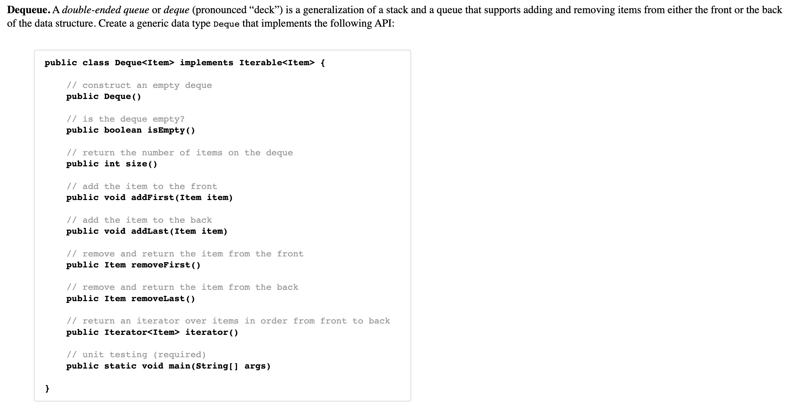


思路:

- 因为需要从队尾和队头出入队列，所以简单的单链表是不行的，需要一个双向链表
- 这里的code可以参照LRU


Code:

```java
import java.util.Iterator;
import java.util.NoSuchElementException;

public class Deque<Item> implements Iterable<Item> {

    private class Node {
        Item item;
        Node next;
        Node pre;
    }

    private final Node head;
    private final Node tail;
    private int size;

    public Deque() {
        this.head = new Node();
        this.tail = new Node();

        this.head.next = this.tail;
        this.tail.pre = this.head;

        this.size = 0;
    }

    // is the deque empty?
    public boolean isEmpty() {
        return this.size == 0;
    }

    // return the number of items on the deque
    public int size() {
        return this.size;
    }

    // add the item to the front
    public void addFirst(Item item) {
        if (item == null) {
            throw new IllegalArgumentException();
        }

        Node newHead = new Node();
        newHead.item = item;
        newHead.next = this.head.next;
        newHead.pre = this.head;

        this.head.next.pre = newHead;
        this.head.next = newHead;
        this.size++;
    }

    // add the item to the back
    public void addLast(Item item) {
        if (item == null) {
            throw new IllegalArgumentException();
        }

        Node newTail = new Node();
        newTail.item = item;
        newTail.pre = this.tail.pre;
        newTail.next = this.tail;

        this.tail.pre.next = newTail;
        this.tail.pre = newTail;

        this.size++;
    }

    // remove and return the item from the front
    public Item removeFirst() {
        if (this.isEmpty()) {
            throw new NoSuchElementException();
        }

        Item removeFirstItem = this.head.next.item;
        removeNode(this.head.next);

        return removeFirstItem;
    }

    // remove and return the item from the back
    public Item removeLast() {
        if (this.isEmpty()) {
            throw new NoSuchElementException();
        }

        Item removeLastItem = this.tail.pre.item;
        removeNode(this.tail.pre);

        return removeLastItem;
    }

    private void removeNode(Node curNode) {
        curNode.next.pre = curNode.pre;
        curNode.pre.next = curNode.next;

        this.size--;
    }

    // return an iterator over items in order from front to back
    public Iterator<Item> iterator() {
        return new DequeIterator();
    }

    private class DequeIterator implements Iterator<Item> {
        Node curNode = head.next;

        @Override
        public boolean hasNext() {
            return curNode.next != null;
        }

        @Override
        public Item next() {
            if (curNode.next == null) {
                throw new NoSuchElementException();
            }

            Item item = curNode.item;
            curNode = curNode.next;

            return item;
        }

        @Override
        public void remove() {
            throw new UnsupportedOperationException();
        }
    }

    /**
     * For test
     *
     * @param args
     */
    public static void main(String[] args) {
    }
}
```

<hr>


### 2) 实现一个随机队列


- 实现队列可以使用链表或者数组，但这里我们需要均摊操作时间，所以这里只有使用数组
- 使用数组的话，我们就需要考虑动态更新容量，即在enqueue和dequeue时实现resize
- 在使用迭代器遍历的时候，我们还需要以随机的顺序进行遍历，所以在创建迭代器的时候还需要打乱其中的元素顺序


- Iterator内部类方法:

```java
private class RandomizedQueueIterator implements Iterator<Item> {
  private Item[] randomQueue;
  private int curIdx;

  public RandomizedQueueIterator() {
    randomQueue = (Item[]) new Object[size];
    for (int i = 0; i < size; ++i) {
      randomQueue[i] = array[i];
    }

    shuffle(randomQueue);
    curIdx = 0;
  }

  public boolean hasNext() {
    return curIdx < randomQueue.length;
  }

  public void remove() {
    throw new UnsupportedOperationException();
  }

  public Item next() {
    if (!this.hasNext()) {
      throw new NoSuchElementException();
    }

    Item item = randomQueue[curIdx];
    curIdx++;
    return item;
  }

  // Shuffle all element to random
  private void shuffle(Item[] arr) {
    for (int i = 1; i < arr.length; i++) {
      int idx = StdRandom.uniform(i + 1);
      swap(arr, idx, i);
    }
  }
}
```


完整code:

```java
package part1.two.stackandqueue.work;

import edu.princeton.cs.algs4.StdRandom;

import java.util.Iterator;
import java.util.NoSuchElementException;
import java.lang.NullPointerException;
import java.lang.UnsupportedOperationException;

public class RandomizedQueue<Item> implements Iterable<Item> {
    private Item[] array;
    private int size;

    public RandomizedQueue() {
        array = (Item[]) new Object[1];
        size = 0;
    }

    public boolean isEmpty() {
        return size == 0;
    }

    public int size() {
        return size;
    }

    public void enqueue(Item item) {
        if (item == null) {
            throw new NullPointerException();
        }

        if (size == array.length) {
            resize(2 * array.length);
        }

        array[size] = item;
        size++;
    }

    public Item dequeue() {
        if (this.isEmpty()) {
            throw new NoSuchElementException();
        }

        int idx = StdRandom.uniform(size);
        Item item = array[idx];
        array[idx] = null;

        swap(array, idx, size - 1);

        size--;
        if (size > 0 && size == array.length / 4) {
            resize(array.length / 2);
        }
        return item;
    }

    public Item sample() {
        if (isEmpty()) {
            throw new NoSuchElementException();
        }

        int idx = StdRandom.uniform(size);
        return array[idx];
    }

    public Iterator<Item> iterator() {
        return new RandomizedQueueIterator();
    }

    private class RandomizedQueueIterator implements Iterator<Item> {
        private Item[] randomQueue;
        private int curIdx;

        public RandomizedQueueIterator() {
            randomQueue = (Item[]) new Object[size];
            for (int i = 0; i < size; ++i) {
                randomQueue[i] = array[i];
            }

            shuffle(randomQueue);
            curIdx = 0;
        }

        public boolean hasNext() {
            return curIdx < randomQueue.length;
        }

        public void remove() {
            throw new UnsupportedOperationException();
        }

        public Item next() {
            if (!this.hasNext()) {
                throw new NoSuchElementException();
            }

            Item item = randomQueue[curIdx];
            curIdx++;
            return item;
        }

        // Shuffle all element to random
        private void shuffle(Item[] arr) {
            for (int i = 1; i < arr.length; i++) {
                int idx = StdRandom.uniform(i + 1);
                swap(arr, idx, i);
            }
        }
    }

    private void resize(int capacity) {
        Item[] newArray = (Item[]) new Object[capacity];

        if (size >= 0) {
            System.arraycopy(array, 0, newArray, 0, size);
        }

        array = newArray;
    }

    private void swap(Item[] arr, int left, int right) {
        if (left == right) {
            return;
        }

        Item temp = arr[left];
        arr[left] = arr[right];
        arr[right] = temp;
    }

    /**
     * For test
     *
     * @param args
     */
    public static void main(String[] args) {

    }
}
```

<hr>


# 三、基础排序


## 1) 排序的规则

- 排序是根据实例的某个值进行的

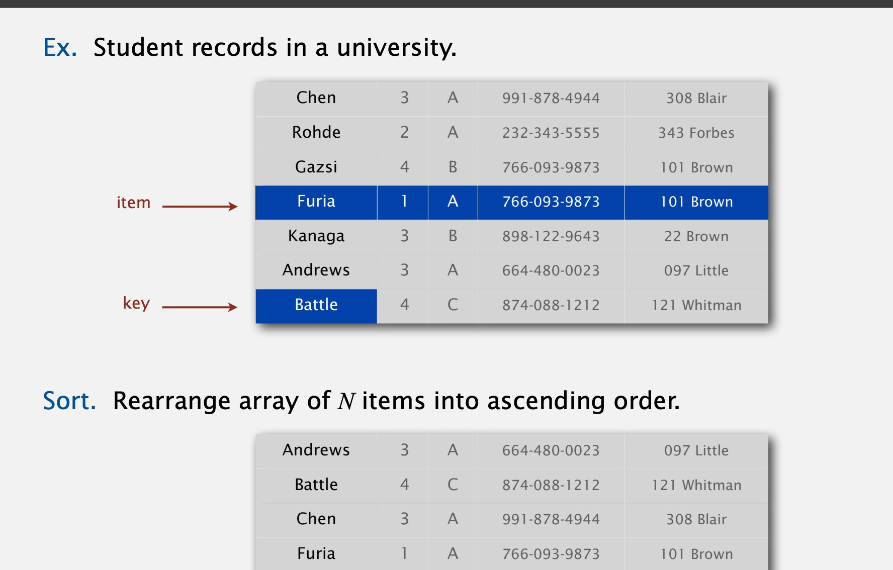


示例：

传入一个目录路径，将目录下所有的文件名进行排序


- 在sort方法中，我们需要知道在没给出类型的情况下，比较哪一个数据的类型
- 我们需要使用回调功能: 在sort方法中，回调了传入对象的compareTo()方法
- Java中对回调的实现是通过接口得到的


在需要排序的类上实现Comparable接口

Code:

```java
import java.io.File;

public class FileSorter implements Comparable<File>{
    @Override
    public int compareTo(File o) {
        return o.getName().length();
    }
}
```


需要排序的对象需要有以下三种性质:

- Antisymmetric: 非对称性，如果a <= b且 b <= a，则a = b
- Transitivity: 传递性，如果a <= b 且 b <= c，则 a <= c
- Totality: 整体性，两个数之间只有 < , >, = 三种关系


按照日期类对Comparable排序的实现:


- 实现两个方法用来判断数组是否有序:


Less:


swap:


测试数组是否有序:


<hr>


## 2) 选择排序selection sort

Principle:

- 每次遍历未排序部分中的最小值，将其交换到当前未排序部分的开头位置


不变性:

- 指针左边的一定是排好序的
- 右边的元素里没有一个小于左边的元素


Code:

```java
public void selectionSort(int[] nums) {
  for (int left = 0; left < nums.length - 1; left++) {
    int curMin = nums[left];
    int curMinIdx = left;

    for (int curIdx = left + 1; curIdx < nums.length; curIdx++) {
      if (curMin > nums[curIdx]) {
        curMin = nums[curIdx];
        curMinIdx = curIdx;
      }
    }

    swap(nums, left, curMinIdx);
  }
}

private void swap(int[] nums, int left, int right) {
  int temp = nums[left];
  nums[left] = nums[right];
  nums[right] = temp;
}
```


- 时间复杂度为O(n^2^)，其需要进行大约 N^2^ / 2次比较，以及N次交换


<hr>


## 3) 插入排序insertion sort

Principle:

- 遍历每个元素，保证其自身以及左边的元素是有序的
- 通过与其左边的元素比较判断左边是否有序


不变性:

- 左边以及当前位置是有序的
- 右边未处理


Code:

```java
public void insertionSort(int[] nums) {
  for (int startIdx = 0; startIdx < nums.length; startIdx++) {
    for (int curIdx = startIdx; curIdx >= 1; curIdx--) {
      if (nums[curIdx] < nums[curIdx - 1]) {
        swap(nums, curIdx, curIdx - 1);
      } else {
        break;
      }
    }
  }
}

private void swap(int[] nums, int left, int right) {
  int temp = nums[left];
  nums[left] = nums[right];
  nums[right] = temp;
}
```


复杂度:

- 时间复杂度为O(n^2^)，其中需要1/4 N^2^ 次比较，1/4 N^2^次交换


比较:

- 如果数组已经是有序的了，那么插入排序的用时是线性的
- 如果是倒序的，那么插入排序的用时和选择排序相同 ，但会进行更多次的交换操作


<hr>


## 4) 希尔排序shell sort


- 每次进行一次h-排序，h是指有序的递增子序列长度，最后进行插入排序即可


理论：

一个g-排序的数组在h-排序后依然是g-排序的


目前较好的h取值:


这里我们取3x + 1进行实现:

```java
public void shellSort(int[] nums) {
  int arrayLength = nums.length;

  int h = 1;
  while (h < arrayLength / 3) {
    h = 3 * h + 1;
  }

  while (h >= 1) {
    for (int startIdx = h; startIdx < arrayLength; startIdx++) {
      for (int curIdx = startIdx; curIdx >= h && nums[curIdx] < nums[curIdx - h]; curIdx -= h) {
        swap(nums, curIdx, curIdx - h);
      }
    }

    h /= 3;
  }
}
```


复杂度:

- 最坏的情况下为O(N^3/2^)


希尔排序的特点:

- 对小数组来说很有效
- 代码量少，可用于硬件中

<hr>


## 5) 洗牌(shuffle)

- 如何打乱一个数组，使得每个元素被均匀的打乱


- 遍历有序数组，保证左边的数字都是随机的
- 每次从左边随机获取一个元素与当前位置的数字进行交换


Code:

```java
public void shuffle(int[] nums) {
  for (int i = 1; i < nums.length; i++) {
    int curRandomNum = StdRandom.uniform(0, i);
    ShellSort.swap(nums, curRandomNum, i);
  }
}
```

<hr>


## 6) 凸包Convex hull(排序的应用)

- 凸包(convex hull)代表将所有平面上的点都框在一个封闭图形里的最小面积


定义:

- 包含所有点的最小凸面
- 包含所有点的最小的封闭图形
- 顶点都是平面内的点


- 输出：逆时针顺序输出顶点序列


具体应用:

- 对障碍物建模后获取了一个对应的convex hull凸包，可根据它获取绕过障碍物的最短路径


- 求两个点之间的距离 
- 


- 计算的方式: 格雷厄姆扫描(Graham scan)
    - 选择一个最小的点p
    - 从p点开始排序
    - 判断每个点，只将按照逆时针转动的点作为顶点


- 难点：判断是否为逆时针(ccw: counterclockwise)

​	


- 实现：通过三个点之间的斜率


- code implement:


<hr>


# 四、归并排序(merge sort)


## 1. 归并排序

Principle:

- 将一个数组分为两半
- 递归排序每个部分
- 合并两个排序后的部分


示例:


确保从lo到mid和从mid + 1到hi是有序的，之后将两个数组进行merge合并即可


Java实现合并(merge):


- 我们需要一个辅助数组(auxiliary)来表示排序后的数组
- 在示例中用到了断言(assert)来判断左右两边是否有序


断言解释:


- Java实现排序

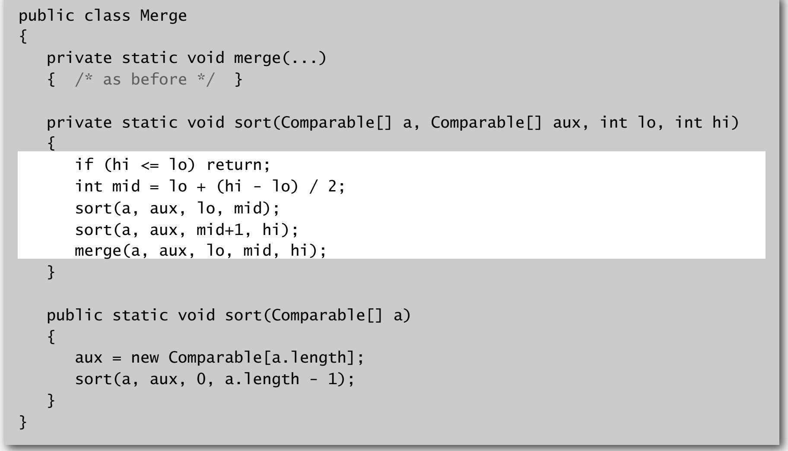


- 递归分析:


复杂度:

- 时间复杂度: nlog(n)
- 空间复杂度: nlog(n)


时间复杂度证明:

- 每次划分都是将数组除以2得到两个子数组，直到子数组长度为1


空间复杂度证明:

- 归并排序并非是希尔排序、选择/插入排序那样的原地排序算法(in-place)，其需要额外空间


归并排序的优化


- 优化一


如果数组较小，则使用之前的排序方式即可


- 优化二

如果两个数组以及排好序了，且两个数组之间接触的元素也是有序的，则该数组已经有序了，不再需要排序


<hr>


## 2. Comparable接口

- 很多时候，针对同一个数据集，我们需要根据不同的key进行排序，所以在需要排序的key上建立一个实现了Comparable的类或者lambda表达式即可

Eg:


- 创建后只需要将该排序规则传入到Arrays.sort方法中的第二参数位置即可

Eg:


<hr>


## 3. 稳定性

迄今为止排序算法的稳定性：

- Insertion sort: 稳定
- Selection sort: 不稳定
- Shell sort: 不稳定
- Merge sort: 稳定(前提是两数相同时始终先添加左边那个数)


判断排序算法是否稳定的依据：

检查其是否有跨多个数字的交换


<hr>


## 4. 作业


### 1) Point


要求:

创建一个Point类，其结构如图，需要你实现compareTo方法(重写Comparable里的方法)、slopTo方法，slopOrder方法，其余方法都有固定实现


- 其中compareTo方法当且仅当当前点的y值小于参数y值，或者当前y值=参数y值且当前x值小于参数x值时才返回负数(表示小于参数点)
- slopTo方法应该返回调用点与参数点连线的斜率，计算公式为: (y1 − y0) / (x1 − x0)，如果是一条水平线，则返回；如果是一条垂直的线，则返回正无穷；如果两点重合则返回负无穷
- slopOrder方法应该返回一个通过斜率比较两个参数点的比较器，其中斜率的计算通过slopTo方法实现


compareTo方法:

```java
@Override
public int compareTo(Point that) {
  return this.y == that.y ? this.x - that.x : this.y - that.y;
}
```


slopTo方法:

```java
public double slopeTo(Point that) {
  if (this.y == that.y && this.x == that.x) {
    return Double.NEGATIVE_INFINITY;
  }

  else if (this.y == that.y) {
    return 0;
  } else if (this.x == that.x) {
    return Double.POSITIVE_INFINITY;
  }

  return (that.y * 1.0 - this.y) / (that.x - this.x);
}
```


slopeOrder方法:

```java
public Comparator<Point> slopeOrder() {
  return new SlopeComparator(this);
}

private static class SlopeComparator implements Comparator<Point> {
  private final Point point;

  SlopeComparator(Point point) {
    this.point = point;
  }

  @Override
  public int compare(Point p1, Point p2) {
    double slope1 = p1.slopeTo(point);
    double slope2 = p2.slopeTo(point);
    return Double.compare(slope1, slope2);
  }
}
```


Full Code:

```java
import edu.princeton.cs.algs4.StdDraw;

import java.util.Comparator;

public class Point implements Comparable<Point> {
  private final int x;
  private final int y;

  public Point(int x, int y) {
    this.x = x;
    this.y = y;
  }

  public void draw() {
    StdDraw.point(this.x, this.y);
  }

  public void drawTo(Point that) {
    StdDraw.line(this.x, this.y, that.x, that.y);
  }

  public String toString() {
    return "(" + x + ", " + y + ")";
  }

  @Override
  public int compareTo(Point that) {
    return this.y == that.y ? this.x - that.x : this.y - that.y;
  }

  public double slopeTo(Point that) {
    if (this.y == that.y && this.x == that.x) {
      return Double.NEGATIVE_INFINITY;
    }

    else if (this.y == that.y) {
      return 0;
    } else if (this.x == that.x) {
      return Double.POSITIVE_INFINITY;
    }

    return (that.y * 1.0 - this.y) / (that.x - this.x);
  }

  public Comparator<Point> slopeOrder() {
    return new SlopeComparator(this);
  }

  private static class SlopeComparator implements Comparator<Point> {
    private final Point point;

    SlopeComparator(Point point) {
      this.point = point;
    }

    @Override
    public int compare(Point p1, Point p2) {
      double slope1 = p1.slopeTo(point);
      double slope2 = p2.slopeTo(point);
      return Double.compare(slope1, slope2);
    }
  }

  /**
     * For test
     *
     * @param args
     */
  public static void main(String[] args) {

  }
}
```

<hr>


### 2) BruteCollinearPoints

给你一个类：LineSegment，其代表平面上的线，该类可作为工具类直接使用


- 我们需要一个BruteCollinearPoints类检查4个点是否在同一条直线上，返回所有这样的直线
- 为了检查p, q, r, s四个点，需要检查它们彼此之间的斜率是否一致
- 你需要实现一个构造方法，其接收的参数为一堆点(上一道题写的类)
- 还需要实现一个numberOfSegements方法以返回输入到构造函数中在同一直线上的四个点的组合数(返回对应的直线数量)
- 最后还需要实现一个segments方法返回所有的直线实例


- 其中segments方法应该返回的数字是不重复的线段数(起始点位置交换算做同一直线)，同时也不应该包含子线段
- 如果构造方法的参数为null，或者该数组中存在元素为null，则抛出非法参数异常


- 构造方法:

首先我们需要检验参数，这里判断参数本身后再遍历参数数组中的元素即可

之后为了不重复计算，我们需要检查参数中是否有重复的点

for循环嵌套获取4个点，如果斜率相同则添加头尾point元素到集合中去

或完所有的组合后，将集合转换为数组

```java
public BruteCollinearPoints(Point[] points) {

  // Check null
  if (points == null) {
    throw new NullPointerException("The array is null.");
  }
  for (Point curPoint : points) {
    if (curPoint == null) {
      throw new NullPointerException("The current point is a null element.");
    }
  }

  Arrays.sort(points);

  // Check duplicate
  for (int i = 0; i < points.length - 1; i++) {
    if (points[i].compareTo(points[i + 1]) == 0) {
      throw new IllegalArgumentException();
    }
  }


  final int length = points.length;
  List<LineSegment> curLineSegment = new LinkedList<>();

  for (int a = 0; a < length - 3; a++) {
    Point ptA = points[a];

    for (int b = a + 1; b < length - 2; b++) {
      Point ptB = points[b];
      double slopeAB = ptA.slopeTo(ptB);

      for (int c = b + 1; c < length - 1; c++) {
        Point ptC = points[c];
        double slopeAC = ptA.slopeTo(ptC);

        if (slopeAB == slopeAC) {
          for (int d = c + 1; d < length; d++) {
            Point ptD = points[d];
            double slopeAD = ptA.slopeTo(ptD);

            if (slopeAB == slopeAD) {
              curLineSegment.add(new LineSegment(ptA, ptD));
            }
          }
        }
      }
    }
  }
  lineSegments = curLineSegment.toArray(new LineSegment[0]);
}
```


- numberOfSegements:

该方法直接返回数组的长度即可

```java
public int numberOfSegments() {
  return lineSegments.length;
}
```


- segments:

该方法直接返回数组即可

```java
public LineSegment[] segments() {
  return lineSegments;
}
```

<hr>


### 3) FastCollinearPoints

和之前一样的问题，但这次我们需要用更好的性能来解决


大部分与上一题一样，不过我们需要在构造方法内对获取点的操作做一些改动

之前的操作为for循环暴力遍历，这里我们则只需要遍历一次原数组，获取每个元素对应的slopOrder规则并以此为基础对原数组排序

之后从不同的起始点开始遍历排序后的数组，如果斜率相同的继续，结束当前循环后，如果点的数量大于等于3，且排序数组中的起点位置在原数组当前点的后面，则将原数组当前点作为起点，最后一个遍历的排序数组中的点作为终点添加到结果集中


Code:

```java
public FastCollinearPoints(Point[] points) {
  // Check null
  if (points == null) {
    throw new NullPointerException("The array is null.");
  }
  for (Point curPoint : points) {
    if (curPoint == null) {
      throw new NullPointerException("The current point is a null element.");
    }
  }
  Arrays.sort(points);

  // Check duplicate
  for (int i = 0; i < points.length - 1; i++) {
    if (points[i].compareTo(points[i + 1]) == 0) {
      throw new IllegalArgumentException();
    }
  }


  final int length = points.length;
  final List<LineSegment> maxLineSegments = new LinkedList<>();

  for (Point p : points) {

    Point[] pointsBySlope = points.clone();
    Arrays.sort(pointsBySlope, p.slopeOrder());

    int idx = 1;
    while (idx < length) {

      LinkedList<Point> candidates = new LinkedList<>();
      final double CUR_SLOPE = p.slopeTo(pointsBySlope[idx]);
      do {
        candidates.add(pointsBySlope[idx]);
        idx++;
      } while (idx < length && p.slopeTo(pointsBySlope[idx]) == CUR_SLOPE);

      if (candidates.size() >= 3 && p.compareTo(candidates.getFirst()) < 0) {
        Point max = candidates.removeLast();
        maxLineSegments.add(new LineSegment(p, max));
      }
    }
  }
  lineSegments = maxLineSegments.toArray(new LineSegment[0]);
}
```

<hr>


# 五、快速排序(quick sort)


## 1. 快速排序


### 1) 理论(basic)

- 打乱数组(shuffle)
- 以一个随机数j进行分组(partition)
    - 保证j的左边没有比它大的数，右边没有比它小的数
    - a[j]的位置固定
- 排序(sort): 对每个分组进行递归排序


图中选择了打乱后数组中的第一个字母


- 分组(partition)
    - 从左到右扫描i，直到等式a[i] < a[lo]不成立
    - 从右到左扫描j，直到等式a[j] > a[lo]不成立
    - 当等式不满足时交换a[i]和a[j]指向的数字


<hr>


### 2) 实现

Partition的实现(针对Comparable实例数组):


- 将partition带入
- 通过递归调用partition即可通过不断的分组使得数组有序
- 注意这里引入了打乱操作使得排序的性能得以保证


- 如果引入额外的数组可以使得分组更加简单且稳定，但会使得性能变差

<hr>


### 3) 分析


- 在最理想的情况下，比较次数为NlgN
- 最坏的情况下，比较次数为 $$\frac{1}{2}$$ N^2^
- 平均情况为1.39NlgN

其比归并排序要多一些比较的操作，但移动操作更少


- 快速排序是一个原地的排序算法，但其递归调用的栈空间为对数logn
- 快速排序是一个不稳定的算法，因为其涉及到长距离的元素交换

<hr>


### 4) 优化

如果数组比较小，那么我们可以使用插入排序来替代它


<hr>


## 2. 选择算法

在一个有序的数组中找出其中第k小的数字，可以用于top k等问题


- 将快速排序的分组思想应用在其中就能够解决选择问题:


示例：

创建一个实现Comparable接口的学生类，在compareTo方法中指定排序为年龄降序


- 同样的，我们可以在Arrays.sort方法中通过lambda表达式指定我们自己的排序方式:


- 这里我们指定排序规则为年龄倒序


- 这种结合partition的选择算法称为快速选择(select sort)

其平均用时是线性的，最坏为$$\frac{1}{2}$$N^2^(同快速排序)


<hr>


## 3. 重复的key

- 如果在待排序的数组中有重复的key，那么常规的快速排序就会得出错误的结果


- 图中以城市名作为排序的依据，因为城市名重复，所以排序后的时间并不对


### 1. 比较

在对含有重复key数组进行排序的时候，不同排序算法的情况:

- 归并排序:

需要进行$$\frac{1}{2}$$NlgN到NlgN次比较


- 快速排序:

除非停止对重复的key分组，否则会进行N^2^次比较


<hr>


### 2. 3-way partition

- 重写partition，将数组划分为三个部分以解决这个问题


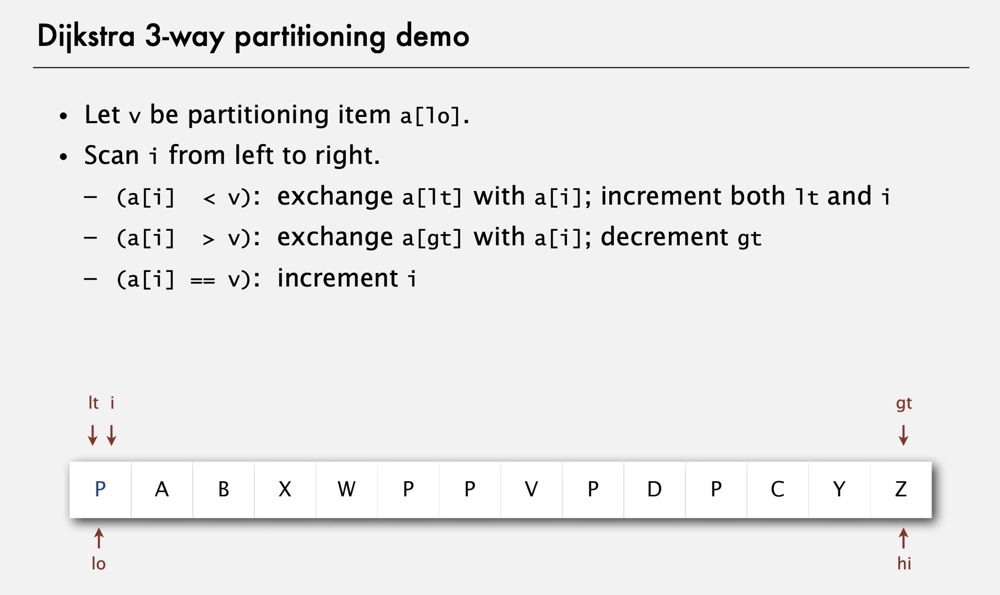


实现:


<hr>


### 3. 用时

- 当所有的key都重复时，用时为NlgN，如果之后常数级别的重复key，则为线性用时

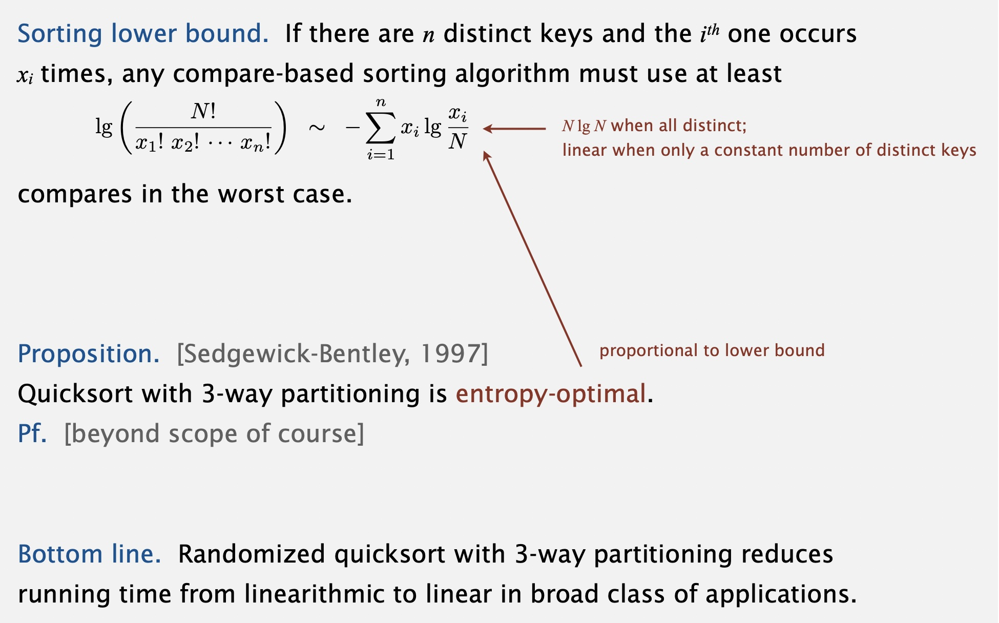


Eg:


<hr>


## 4. 应用


<hr>


### 1) Java实现的排序算法

Arrays.sort():

- 其对每种原始类型(primitive type)都有不同的重载方法
- 对于Comparator示例实现了一种方法
- 对于原始类型使用调整后的快速排序，对于引用类型(object)则使用调整后的归并排序


为什么两种类型要使用不同的算法？

对于原始类型：比较在意性能，所以选择不会创建额外空间的快速排序

对于引用类型：稳定即可

<hr>


# 排序总结

|                         | inplace? | Stable? |       worst       |      average      |       best        |          descrbie          |
| :---------------------: | :------: | :-----: | :---------------: | :---------------: | :---------------: | :------------------------: |
|        selection        |   yes    |         | $$\frac{N^2}{2}$$ | $$\frac{N^2}{2}$$ | $$\frac{N^2}{2}$$ |          N次交换           |
|        insertion        |   yes    |   yes   | $$\frac{N^2}{2}$$ | $$\frac{N^2}{4}$$ |         N         | 用于小数组排列或者部分排列 |
|          shell          |   yes    |         |         ?         |         ?         |         N         |          代码量少          |
|          merge          |          |   yes   |       NlgN        |       NlgN        |       NlgN        |     能够保证NlgN，稳定     |
|          quick          |   yes    |         | $$\frac{N^2}{2}$$ |       2NlgN       |       NlgN        | 原地修改，比较快，但不稳定 |
| 3-way quick(快排改进版) |   yes    |   yes   |       NlgN        |       NlgN        |         N         |          圣杯级别          |

<hr>


# 六、优先队列(Priority Queue)


## 1. API/概念

与其他数据结构的对比:


- 优先队列可以删除最值


- 最大优先队列中的方法和对应的泛型


- 不同的实现和对应的消耗


其中二叉堆的消耗最接近理想情况


- 优先队列可以分为有序和无序的实现方法


- 无序最大优先队列的数组实现


implements:


- 有序和无序优先队列的消耗区别


<hr>


## 2. 二叉堆(Binary heap)

二叉堆的基础结构: 完全二叉树


特性(property):

- 完全二叉树的高度 = lgN (N为节点的数量)
- 只有当节点数N增加到2的幂时，树的高度才会增加(重要性质)


二叉堆的表示(大根堆):

- 二叉堆: 用数组表示一个堆顺序的完全二叉树
- 堆顺序二叉树:
    - 节点上是值
    - 父节点都不会小于子节点
- 实现的数组:
    - 将节点通过层级顺序进行排列
    - 节点之间不需要显式的连接


- 二叉堆的特性(大根堆):
    - 数组中第一个元素的值是最大的，其作为二叉树的根节点
    - 可通过数组的索引遍历整颗树:
        - 如果节点对应的索引为k，其父节点对应的索引为k / 2
        - 一个父节点对应的索引为k，其两个子节点的索引为2k和2k + 1


- 大根堆上浮(swim)


如果子节点大于其父节点，那么需要进行上浮操作

为了消除错误的操作:

1. 交换子节点和父节点的值
2. 重复步骤1直到整个数组恢复堆顺序

swim实现:

```java
private void swim(int k) {
  while (k > 1 && less(k / 2, k) {
    swap(k, k / 2);
    k /= 2;
  }
}
```


- 插入操作:

将一个新的节点插入到数组末尾，并将其上浮

最多进行1 + lgN(树的高度)次比较


insert实现:

```java
public void insert(Key x) {
  pq[++N] = x;
  swim(N);
}
```


- 堆的降级(与上浮相对)

如果一个父节点的值小于其一个子节点/或者两个，此时需要降级/下沉


为了消除错误的操作:

1. 交换父节点和较大的那个子节点的值
2. 重复步骤1直到数组恢复栈顺序


sink实现:

```java
// K represent the parent index which value is smaller then its child node
private void sink(int k) {
  while (2 * k <= N) {
    int j = 2 * K;
    
    // Get the bigger child
    if (j < N && less(j, j + 1)) {
      j++;
    }
    
    // Already restored
    if (!less(k, j)) {
      break;
    }
    
    swap(k, j);
    
    // Judge the new parent
    k = j;
  }
}
```


- 删除最大值
    1. 将数组中的第一个元素与最后一个元素进行交换
    2. 将新的根节点进行下沉
    3. 将最后一个元素删除

最多进行2lgN次比较


delMax实现:

```java
public Key delMax() {
  Key max = pq[0];
  swap(0, N);
  
  sink(0);
  pq[N] = null;
  N--;
  
  return max;
}
```


最大优先队列的实现(大根堆):


- 不同实现的消耗分析


- 其余一些细节
    - 对于下溢: 如果尝试对空的优先队列使用delete方法，则抛出异常
    - 对于溢出: 添加一个空的构造方法，并通过方法重写分配数组的大小
    - 改为最小优先队列(小根堆): 将less改为greater并实现即可


<hr>


完整版:

```java
import part1.utils.SortAPI;

public class MaxPQ <Key extends Comparable<Key>>{
    private Key[] pq;
    private int idx;
    public Key[] quoteArray;

    public MaxPQ(int capacity) {
        pq = (Key[]) new Comparable[capacity];
        quoteArray = pq;
    }

    public boolean isEmpty() {
        return idx == 0;
    }

    public void insert(Key key) {
        pq[idx] = key;

        swim(idx);
        idx++;
    }

    private void swim(int childIdx) {
        while (childIdx >= 0 && less(childIdx / 2, childIdx)) {
            SortAPI.swap(pq, childIdx / 2, childIdx);
            childIdx /= 2;
        }
    }

    public Key delMax() {
        Key max = pq[0];
        SortAPI.swap(pq, 0, idx);

        sink(0);
        pq[idx] = null;
        idx--;

        return max;
    }

    private void sink(int parentIdx) {
         while (2 * parentIdx <= idx) {
             int childIdx = 2 * parentIdx;

             if (childIdx < idx && less(childIdx, childIdx + 1)) {
                 childIdx++;
             }

             if (!less(parentIdx, childIdx)) {
                 break;
             }

             SortAPI.swap(pq, parentIdx, childIdx);
             parentIdx = childIdx;
         }
    }

    private boolean less(int firstIdx, int secondIdx) {
        return pq[firstIdx].compareTo(pq[secondIdx]) < 0;
    }
}
```

<hr>


## 3. 堆排序


### 1) 原地排序的基础步骤

- 将所有的节点值创建为一个最大堆
- 重复移除最大的值

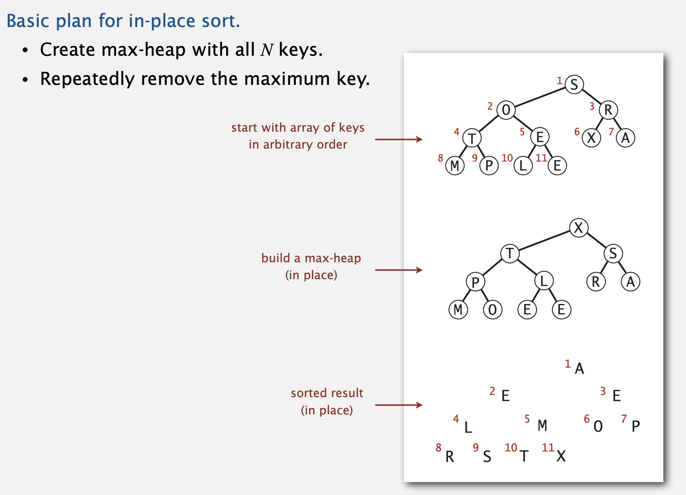

<hr>


### 2) 构建堆(大根堆)


1. 使用自下而上的方法构建堆

Code:

```java
for (int idx = n / 2; idx >= 0; idx--) {
  sink(array, idx, n)
}
```

释义: 

- 这里的idx初始化为n / 2，其中n为整个数组的长度，其除以2即为末尾节点的父节点对应的索引值(堆的特性)
- 因为这里是大根堆，所以根节点一定是最大的才行，因此需要进行下沉操作使得整个数组变为堆顺序


2. 将最大值移动到数组末尾

堆构建完毕后(大根堆)，此时数组中的第一个值(根节点值)是最大的，此时我们将其与数组末尾的值进行交换

此时最大值就完成了排序，我们将数组的长度减一，将最后一个节点踢出堆

对交换的头节点进行下沉操作


Code:

```java
while (n > 0) {
  swap(array, 0, n);
  n--;
  sink(array, 1, n);
}
```


<hr>


### 3) 实现


Full Code:

```java
import java.util.Arrays;

public class MyHeap <Key extends Comparable<Key>>{

    public static void sort(Comparable[] array) {
        int lastIdx = array.length - 1;
        for (int parentIdx = lastIdx / 2; parentIdx >= 0; parentIdx--) {
            sink(array, parentIdx, lastIdx);
        }

        System.out.println(Arrays.toString(array));

        while (lastIdx > 0) {
            swap(array, 0, lastIdx);
            lastIdx--;

            sink(array, 0, lastIdx);
        }
    }

    private static void sink(Comparable[] array, int parentIdx, int lastIdx) {
        while (parentIdx * 2 <= lastIdx) {
            int childIdx = parentIdx * 2;

            if (childIdx <= lastIdx - 1 && less(array, childIdx, childIdx  + 1)) {
                childIdx++;
            }

            if (!less(array, parentIdx, childIdx)) {
                break;
            }

            swap(array, parentIdx, childIdx);
            parentIdx = childIdx;
        }
    }

    private static boolean less(Comparable[] array, int firstIdx, int secondIdx) {
        return array[firstIdx].compareTo(array[secondIdx]) < 0;
    }

    private static void swap(Comparable[] array, int left, int right) {
        Comparable temp = array[left];
        array[left] = array[right];
        array[right] = temp;
    }
}
```

<hr>


### 4) 分析与特性

特性:

- 最多进行2N次比较和交换
- 堆排序最多进行2NlgN次比较和交换
- 相比归并排序: 原地算法，不需要额外空间
- 相比快速排序: 其最坏情况下只需要NlgN


堆排序的缺点:

- 内部循环次数比快速排序要多(因为需要获取两个子节点中较大的那个，之后还需要与根节点比较)，为2NlgN
- 无法应用在缓存中(因为引用的索引值比较分散)
- 不稳定(有长距离的交换)

<hr>


## 作业

### 1) 棋盘类

创建一个Board，实现下面的方法:


- 构造方法:

> 接收一个n * n的二维数组，其中的元素从0到n^2^ - 1，0代表一个空白方块

这里注意不能直接引用，且在复制其中的元素之前，我们还需要对接收的参数进行判空

在遍历参数数组时，如果遍历到了空方块，则记录下它的行/列索引值


- toString:

> 返回n + 1行字符，其中第一行为数组的边长；其余行则为数组内的元素

使用StringBuilder就行，注意处理好每行之间的换行


- hamming(汉明距离):

>汉明距离是指格子中没有处于正确位置的元素个数

遍历所有元素，将当前元素的值与当前位置应该对于的值进行比较即可，但注意对空白方块进行特殊处理


- manhattan(曼哈顿距离):

> 每个不在对应位置的元素与其对应位置之间横纵坐标之差的和

与汉明距离类似，不过需要计算横纵坐标的绝对值之差


- equals:

> 判断参数是否与当前对象相等

首先使用`==`进行地址值的判断，然后进行判空

判断两者对应的Class对象，如果是同一个类，则进行强转后判断每一个元素即可


- neighbor:

> 返回含有所有临近数组的集合

临近数组是指在当前数组的基础上，让空白方格向四周移动后的数组

我们只需要确保移动不越界的情况下交换对应的元素位置后，将新的数组添加到集合中，最后返回即可


- twin:

> 交换了任意一对方格后的数组

虽然是任意交换，但我们在交换中不能有空方格出现，这时在构造方法中记录下的空方格索引就派上用场了！


Full Code:

```java
package part1.four.priorityqueue.work;

import java.util.Arrays;
import java.util.LinkedList;
import java.util.List;

public class Board {
    private final int[][] grid;
    private final int gridSize;

    private int blankRow;
    private int blankCol;


    public Board(int[][] tiles) {
        if (tiles == null) {
            throw new NullPointerException();
        }

        for (int[] tile : tiles) {
            if (tile.length != tiles.length) {
                throw new NullPointerException();
            }
        }

        this.grid = copyArray(tiles);
        this.gridSize = tiles.length;

        for (int row = 0; row < grid.length; row++) {
            for (int col = 0; col < grid[0].length; col++) {
                int curEle = grid[row][col];

                if (curEle == 0) {
                    blankRow = row;
                    blankCol = col;
                    break;
                }
            }
        }
    }

    // string representation of this board
    public String toString() {
        StringBuilder curGrid = new StringBuilder();
        curGrid.append(this.gridSize).append("\n");

        for (int[] curRow : this.grid) {
            for (int curEle : curRow) {
                curGrid.append(curEle).append(" ");
            }
            curGrid.append("\n");
        }

        return curGrid.toString();
    }

    // board dimension n
    public int dimension() {
        return this.gridSize;
    }

    // number of tiles out of place
    public int hamming() {
        int hammingDistance = 0;

        for (int row = 0; row < grid.length; row++) {
            for (int col = 0; col < grid.length; col++) {
                if (row == this.blankRow && col == this.blankCol) {
                    continue;
                }

                int curEle = this.grid[row][col];

                if (curEle != row * grid.length + col + 1) {
                    hammingDistance++;
                }
            }
        }

        return hammingDistance;
    }

    // sum of Manhattan distances between tiles and goal
    public int manhattan() {
        int manhattanDistance = 0;

        for (int row = 0; row < grid.length; row++) {
            for (int col = 0; col < grid[0].length; col++) {
                if (grid[row][col] == 0) {
                    continue;
                }

                manhattanDistance += manhattan(row, col);
            }
        }

        return manhattanDistance;
    }

    // is this board the goal board?
    public boolean isGoal() {
        return this.hamming() == 0;
    }

    // does this board equal y?
    public boolean equals(Object y) {
        if (y == this.grid) {
            return true;
        }

        if (y == null) {
            return false;
        }

        if (this.getClass() != y.getClass()) {
            return false;
        }

        Board other = (Board) y;
        if (this.blankRow != other.blankRow || this.blankCol != other.blankCol || this.gridSize != other.gridSize) {
            return false;
        }


        for (int row = 0; row < grid.length; row++) {
            for (int col = 0; col < grid[0].length; col++) {
                if (other.grid[row][col] != this.grid[row][col]) {
                    return false;
                }
            }
        }

        return true;
    }

    // all neighboring boards
    public Iterable<Board> neighbors() {
        List<Board> neighbors = new LinkedList<>();

        if (blankRow > 0) {
            int[][] north = copyArray(grid);
            swap(north, blankRow, blankCol, blankRow - 1, blankCol);
            neighbors.add(new Board(north));
        }

        if (blankRow < this.dimension() - 1) {
            int[][] south = copyArray(grid);
            swap(south, blankRow, blankCol, blankRow + 1, blankCol);
            neighbors.add(new Board(south));
        }

        if (blankCol > 0) {
            int[][] west = copyArray(grid);
            swap(west, blankRow, blankCol, blankRow, blankCol - 1);
            neighbors.add(new Board(west));
        }

        if (blankCol < this.dimension() - 1) {
            int[][] east = copyArray(grid);
            swap(east, blankRow, blankCol, blankRow, blankCol + 1);
            neighbors.add(new Board(east));
        }

        return neighbors;
    }

    // a board that is obtained by exchanging any pair of tiles
    public Board twin() {
        int[][] newGird = new int[grid.length][grid.length];

        if (blankRow != 0) {
            swap(newGird, 0, 0, 0, 1);
        } else {
            swap(newGird, 1, 0, 1, 1);
        }

        return new Board(newGird);
    }


    private void swap(int[][] array, int row1, int col1, int row2, int col2) {
        int temp = array[row1][col1];
        array[row1][col1] = array[row2][col2];
        array[row2][col2] = temp;
    }

    private int[][] copyArray(int[][] origin) {
        int[][] newArray = new int[origin.length][origin[0].length];

        for (int row = 0; row < this.dimension(); row++) {
            newArray[row] = Arrays.copyOf(origin[row], origin.length);
        }

        return newArray;
    }

    private int manhattan(int row, int col) {
        int value = grid[row][col] - 1;
        int valueRow = value / grid.length;
        int valueCol = value % grid.length;
        return Math.abs(valueRow - row) + Math.abs(valueCol - col);
    }


    /**
     * For test method
     * @param args the arguments
     */
    public static void main(String[] args) {

    }
}

```

<hr>


### 2) A搜索算法


在该问题中，我们需要使用已有的类:`MinPQ`，来尝试获取一个数组的`Solver`，通过它，我们可以获取数组从乱序到所有元素符合条件需要的步数，如果不存在则返回-1，如果有，还需要在`solution`方法中返回从初始状态到目标数组过程中所有`Board`实例的集合

需要注意的是，如果需要的步数超过了其对应的优先级，则视作无解(优先级来自汉明距离或者曼哈顿距离)


其中汉明优先函数的计算:

> 棋盘的汉明距离加上到目前为止为到达搜索节点所做的移动次数


曼哈顿优先函数:

> 棋盘的曼哈顿距离加上到目前为止为到达搜索节点所走的步数


需要实现的类及方法如下:

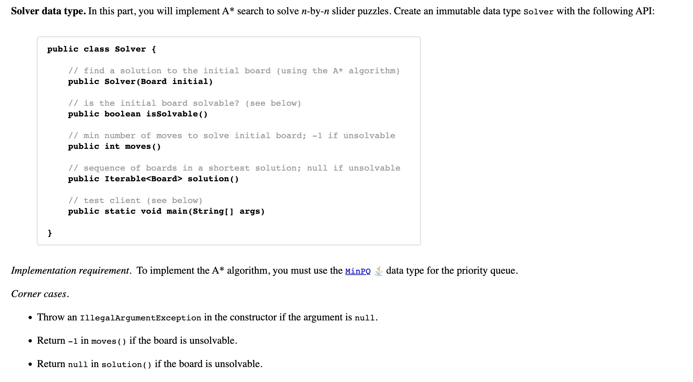


其中搜索的方法如下:

> 1. 将Solver构造方法中的Board实例对应的元素放入一个最小优先队列中
> 2. 每次删除队列中的最小值，然后将该实例对应的neighbor都添加到队列中
> 3. 重复步骤2，直到当前Board实例对应的数组元素都到了正确的位置上


前导:

为了让初始状态的`Board`实例到最终状态的实例都建立联系，我们需要使用一个辅助类来起连接作用:

- 该类有三个字段: `prev`, `board`, `move`
- 分别表示其上一个`Board`实例对应的节点，当前`Board`，移动到当前节点所需的移动次数
- 同时为了判断当前步数是否超过了优先级，我们还需要加入一个优先级函数以获取当前位置的优先级

Code:

```java
private static class SearchNode implements Comparable<SearchNode> {
  private final Board board;
  private final SearchNode prev;
  private final int moves;

  SearchNode(Board board, int moves, SearchNode prev) {
    this.board = board;
    this.moves = moves;
    this.prev = prev;
  }

  @Override
  public int compareTo(SearchNode other) {
    return this.priority() - other.priority();
  }

  public int priority() {
    return board.manhattan() + moves;
  }

  public Board getBoard() {
    return board;
  }

  public int getMoves() {
    return moves;
  }

  public SearchNode prev() {
    return prev;
  }
}
```


构造方法:

> 通过参数进行初始化，并搜索其对应的Solver

首先进行判空，将其对应的`SearchNode`实例插入到我们创建的最小优先队列实例中，之后进入循环

按照题意，删除最小值，并获取最小值对应的Board实例

判断当前示例是否符合条件，步数是否符合优先级限制，如果不符合，且步数在优先级范围内，则将其对应的`neighbor`节点全部添加到队列中去

重复上述过程直到有节点符合，或者超过优先级


isSolvable:

> 判断当前Board是否能够在规则步数内重排为目标数组

根据构造函数的情况，返回`isSolvable`字段即可


moves:

> 返回到达目标数组所需的最小步数，不能则返回-1

根据`isSolvable`字段返回对应的值即可


solution:

> 返回从初始位置到目标数组过程中所有的Board实例

根据最终结果节点的`prev`向后推导，将所有实例添加到一个链表集合中即可，如果`isSolvable`为false，则返回null


Full Code:

```java
import edu.princeton.cs.algs4.MinPQ;

import java.util.LinkedList;


public class Solver {
    private final boolean isSolvable;
    private SearchNode solutionNode;

    public Solver(Board initial) {
        if (initial == null) {
            throw new NullPointerException();
        }

        solutionNode = null;

        MinPQ<SearchNode> minPQ = new MinPQ<>();
        minPQ.insert(new SearchNode(initial, 0, null));

        while (true) {
            // Del the root node and return from the minPQ
            SearchNode currNode = minPQ.delMin();
            Board currBoard = currNode.getBoard();

            // Determine if goal is achieved or unsolvable in every loop.
            if (currBoard.isGoal()) {
                isSolvable = true;
                solutionNode = currNode;
                break;
            }

            // The number of step exceed the priority of manhattan
            if (currBoard.manhattan() == 2 && currBoard.twin().isGoal()) {
                isSolvable = false;
                break;
            }

            // Insert each neighbor except the board of the previous search node
            int moves = currNode.getMoves();
            Board prevBoard = moves > 0 ? currNode.prev().getBoard() : null;

            for (Board nextBoard : currBoard.neighbors()) {
                if (nextBoard.equals(prevBoard)) {
                    continue;
                }
                minPQ.insert(new SearchNode(nextBoard, moves + 1, currNode));
            }
        }
    }

    /**
     * The initial board solvable?
     */
    public boolean isSolvable() {
        return this.isSolvable;
    }

    public int moves() {
        return isSolvable() ? this.solutionNode.getMoves() : -1;
    }

    public Iterable<Board> solution() {
        if (!isSolvable) {
            return null;
        }

        LinkedList<Board> solution = new LinkedList<>();
        SearchNode node = this.solutionNode;
        while (node != null) {
            solution.addFirst(node.getBoard());
            node = node.prev();
        }

        return solution;
    }

    private static class SearchNode implements Comparable<SearchNode> {
        private final Board board;
        private final SearchNode prev;
        private final int moves;

        SearchNode(Board board, int moves, SearchNode prev) {
            this.board = board;
            this.moves = moves;
            this.prev = prev;
        }

        @Override
        public int compareTo(SearchNode other) {
            return this.priority() - other.priority();
        }

        public int priority() {
            return board.manhattan() + moves;
        }

        public Board getBoard() {
            return board;
        }

        public int getMoves() {
            return moves;
        }

        public SearchNode prev() {
            return prev;
        }
    }

    /**
     * For test
     */
    public static void main(String[] arg) {

    }
}
```


# 排序总结


<hr>


# 七、基础符号表


## 1. API

键值对的概念:

- 通过对应的键插入一个值
- 通过一个键，搜索相应的值


例子:

DNS查找

- 通过一个域名插入对应ip地址
- 通过域名搜索对应的ip地址


<hr>


- 符号表的应用:

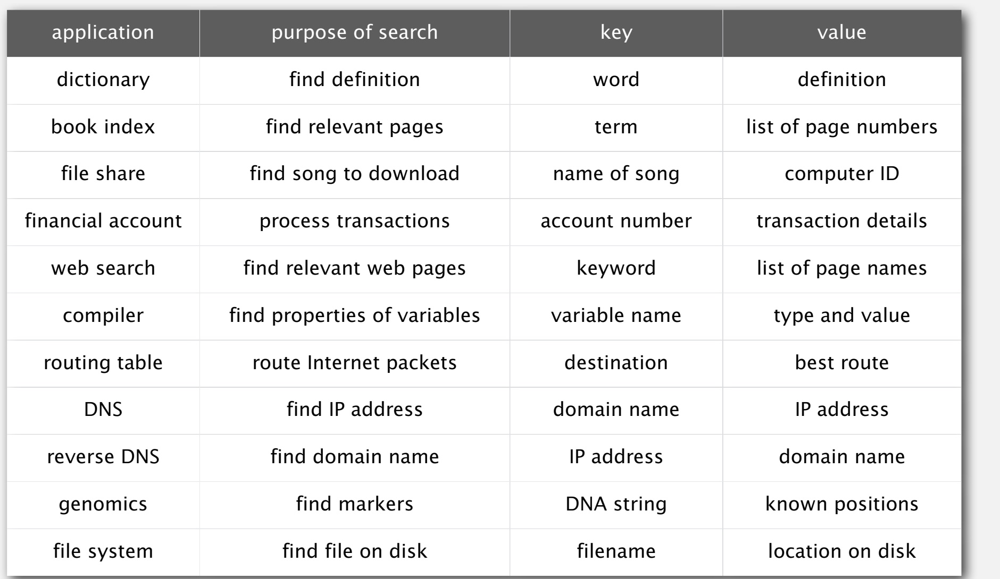

<hr>


符号表API基础

- 通过数组来实现

将一个值和一个键联系起来


<hr>


原则

- 值不能为null
- 当key指定的value不存在时，`get`方法将返回null
- `put`方法会覆盖掉对应key上原来的值


- `contains`方法的实现:

```java
public boolean contains(Key key) {
  return get(key) != null;
}
```


- 实现简易版的`delete`方法:

```java
public void delete(Key key) {
  put(key, null);
}
```

<hr>


键/值

- 值的类型: 任意类型(泛型)


- 键的类型: 
    - 如果为Comparable的实现类，则使用compareTo进行比较
    - 如果为泛型类，则使用equals测试相等性，并辅助使用hashCode


- 最好的方式: 键使用不变量(Integer, Double, String...)


相等性测试:


Java需求：对于任意的引用x, y, z:

- 自反性: x.equals(x)为真
- 对称性: x.euqals(y)的结果与y.equals(x)一致
- 传递性: 如果x.equals(y)为true并且y.equals(z)为true，则x.equals(z)为true
- 非空: x.equals(null)应该返回false


<hr>


自定义类型的equals方法:


<hr>


设计equals方法:

准则:

- 优化引用类型
- 检查null
- 检查两个对象是否为同一类型，并转换
- 检查每个字段:
    - 如果为基础/原始类型则使用`==`
    - 如果为一个对象则调用它的`equals()`方法
    - 如果为一个数组，则可以使用`Arrays.equals()/Arrays.deepEquals()`方法


<hr>


测试客户端:


<hr>


## 2. 基本实现


- 在链表中依次搜索:
    - 数据结构: 维护一个无序的链表，其中每个节点都有一对键-值
    - 搜索: 遍历链表所有节点
    - 插入: 同样进行遍历，如果没有匹配的，则插入新的键值到开头位置


开销:


- 更高效的方法:
    - 数据结构: 维护一个有序的键值对数组(以键为基础进行排序)
    - 搜索和插入都通过二分搜索实现


二分搜索的具体实现:


在插入时，需要移动后面所有的元素:


有序和无序的对比:


<hr>


## 3. 有序符号表的应用


复杂度对比:


<hr>


## 4. BST二叉搜索树


### 1) 定义

二叉搜索树(BST)是一颗对称的有序二叉树


对称有序: 每个节点都有一个键，每个节点的键都具有的特性:

- 大于左子树中所有的键
- 小于右子树中所有的键


- 在Java中:
    1. 二叉搜索树只是一个根节点的引用
    2. 一个节点有四个字段
        - 一对键-值
        - 一个左子树的引用和一个右子树的引用


Class Code:


BST类的大致内容:


<hr>


### 2) BST演示

- 搜索: 如果目标值小于当前key，则往左子树中去，反之去右子树
- 插入: 如果目标值小于当前key，则往左子树中去，反之去右子树，为null则插入，等于则重置该节点的值


- 查询: 根据给定的键返回对应的值，如果为null则说明没有这个key

Code:


### 3) 开销

如果随机插入N个重复的key到二叉搜索树中，搜索/插入的操作用时为2lnN，树的高度为4.311lnN，最坏时为N


<hr>


### 4) 总结


<hr>


### 5) BST各种操作的实现

获取最值:


#### 向上取整和向下取整


- 向下取整的三种情况:

    - case1: k = 当前节点的值

    直接返回即可

    - case2: k < 当前节点的值

    在当前节点的左子树中寻找

    - case3: k > 当前节点的值

    在当前节点的右子树中寻找


Code实现:


<hr>


#### size

在每个节点中添加一个count字段来表示当前节点对应子树的节点总数，该字段由`put`方法维护

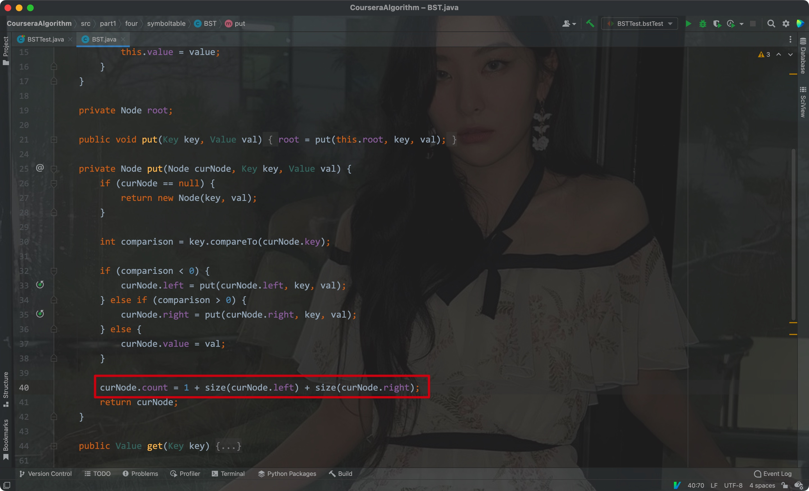


<hr>


#### rank


同样三种情况:

- 等于当前节点

返回当前节点左子树中的节点数

- 小于当前节点的值

递归调用查看右子树中是否还有小于目标值的节点

- 大于

连同当前节点在内，加上左子树所有节点的数量，再加上递归调用后右子树中小于目标值的节点数


Code:


<hr>


#### 中序遍历

- 遍历左子树
- 键入队
- 遍历右子树


Code:


<hr>


#### 三种实现的复杂度比较


<hr>


### 6) 删除节点

删除最小键:

- 向左子树搜索，直到节点的左子树为null
- 将该节点用其右子节点代替
- 更新子树的节点值


#### 1. Hubbard deletion

删除一个值为k的节点

- 情况1(目标节点没有子节点): 通过设置父节点为null来删除节点


- 情况2(目标节点有一个子节点): 用那个唯一的子节点代替删除节点


- 情况3(包含左右子树):

找到目标节点的后驱节点

获取目标节点右子树中的最小节点，将目标节点位置替换为这个最小节点


实现:


<hr>


#### 2. 分析


该种删除方法运行后，该二叉搜索树会变得不平衡


<hr>


# 八、平衡搜索树

之前，我们使用了BST(binary search tree)来实现符号表，但其search/insert/delete操作的用时为N，能不能简化为logN？


## 1. 2-3树


### 1) 2-3的定义

每个节点允许有1或者2个键:

- 2个子节点的键: 一个键，两个子节点
- 3个子节点的键: 两个键，三个子节点


- 如果当前节点有两个键

    - 那么其左子树中所有节点的键值都小于当前节点中两个键的值
    - 中间子树中所有节点的值都大于当前节点中左边的那个节点的值，小于右边那个节点的值
    - 右子树中所有节点的值都大于当前节点中两个键的值

    

    

    

- 如果有一个键

规则和BST一样

<hr>


### 2) 2-3树中插入节点

首先通过搜索找到对应的位置，如果没有对应的节点，则创建新的节点插入

如果插入后当前位置有三个键，则将中间那个键分离出来放到上面一层去

Eg:


<hr>


### 3) 分析

2-3树可以保证完美的平衡，不会像BST那样多次deletion后失衡


### 4) 问题

- 维持多种节点类型非常复杂
- 需要多次比较
- 对于有四个子节点的节点，需要往父节点回溯(分离中间的键到上一层父节点中去)
- 分离操作太多了

<hr>


## 2. 红黑树


特性:

- 相当于用一颗二叉搜索树替代了2-3树
- 使用内部左倾节点代替2-3树中有三个子节点的父节点

Eg:


<hr>


### 1) 定义

相比于一般的二叉搜索树:

- 没有两个红色的节点是直接相连的
- 从根节点到一个null节点的路径长度是一样的(完美平衡)
- 红色节点总是左倾


红黑树的键对应2-3树的键:


<hr>


### 2) 实现

搜索:


搜索大致与BST二叉搜索树差不多，但因为其完美平衡，所以稍微快一些(BST会倾斜)


构建:

- 每个节点都只有一个指向
- 每个节点都拥有颜色(null为黑色)


如果红色节点右倾，则需要进行旋转:


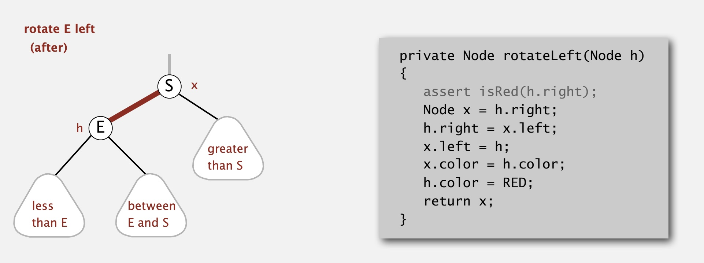

<hr>


右旋操作:


<hr>


- 如果两个子节点都是红色，则需要进行颜色反转


<hr>


插入操作与2-3树的对比:


最初创建时的插入操作:


插入情况1: 插入到底部节点的右节点(对应2-3树中的2-节点)

- 首先同BST一样执行插入, 将新插入的节点设置为红色
- 如果插入到右子节点位置，则左旋


<hr>


情况2: 出现相连节点都为红色

- 首先进行BST插入，将新的节点设置为红色
- 进行必要的旋转(参照情况1)
- 如果两个子节点/相连节点为红色，进行颜色反转/右旋
- 最后再进行必要的旋转


<hr>


- 插入操作的实现

其实就3种情况，分别进行判断即可


<hr>


### 3) 红黑树开销总结


<hr>


## 3. B树

B树一般写作B-Tree，B代表Balance，其为2-3树的泛化版本


特点:

- 根节点至少有两个子节点
- 每个节点最少有M/2个键
- 叶子节点包含完整的键信息(有序的)
- 内节点包含一部分键，但只是用来引导搜索的


### 1) 搜索过程

- 从根节点开始
- 找到一个键对应的搜索区间，并向对应的链接进行迭代搜索
- 搜索到叶子节点为止


<hr>


### 2) 插入操作

- 先进行搜索操作
- 将其插入到叶子节点中
- 如果节点满了，则节点中的键进行分离，并将对应节点中的最小键复制到上层节点中(用于引导搜索)


<hr>


### 3) 特性

- 对于M个值和K个键来说，B树的搜索和插入操作的开销处于log$${_{M-1}}$$N到log$${_{M/2}}$$N之间
- 所有的内节点都有M / 2到 M - 1个子节点

<hr>


### 4) 应用

红黑树: Java集合类中的TreeMap, TreeSet

B-Tree的变体: B+树(InnoDB)，B#树等等


<hr>


# 九、二叉搜索树的应用


## 1) 一维区间搜索


有序符号表的拓展:

- 区间搜索: 找到所有介于k1和k2之间的所有键
- 区间统计: 介于k1和k2之间的所有键的数量


应用:

数据库的查询(MySQL InnoDB存储引擎使用了B+树)


几何释义:

- 键是线上的一个点
- 在一维区间内查找/统计点

Eg:


<hr>


### 1. 初级实现

- 无序列表: 插入迅速，区间搜索慢
- 有序数组: 插入慢，通过二分查找实现区间搜索


<hr>


### 2. BST实现区间统计

- 利用二分搜索树中的rank函数即可

Eg:


- 用时为logN

<hr>


### 3. BST实现区间搜索

- 递归搜寻左子树中的所有键以获取左区间
- 比较当前节点
- 递归搜寻右子树中的所有键以获取右区间


<hr>


## 2) 线段相交

问题:

给你N个水平和垂直的线段，找出所有的交点


暴力方法:

用每个线段去匹配其余所有的线段


<hr>


- 扫描算法

从到右扫描所有的垂直线:

每扫描到一条平行线，将其左端点对应的Y左边放入BST中

当遇到一个垂直线的时候，通过该垂直线段的头尾Y坐标值在BST中进行区间搜索


消耗:

插入Y坐标值到BST中: NlogN

从BST中删除Y坐标值: NlogN

在BST中进行区间搜索: NlogN + R

<hr>


## 3) K维树


### 1. 二维搜索

将有序符号表拓展为二维键(空间中的点):

- 区间搜索: 查找在二维区间范围内的所有键(点)
- 区间统计: 统计在二维区间范围内所有键的数量


应用(游戏图像划分渲染):


构造:


2维图像与BST节点对应:


#### 1) 查找矩形中的点


分析:

- 平均用时: R + logN
- 最坏情况: R + N^1/2^


<hr>


#### 2) 最近点搜索


只需要每到一个点就判断当前距离与记录的距离之间的大小关系即可:


分析:

- 平均用时: logN
- 最坏情况: N


#### 3) K维树

衍生到K维树后，可以对K维空间进行分组


<hr>


# 十、Hash表

- Hash表也是符号表的一种实现，不过它要更常用一些


之前的符号表实现:


Hash的基本实现:

- 将所有的元素都放到一个键与索引对应的表中(索引通过对键做hash运算得到)
- Hash运算: 根据键计算得出数组索引的方法


## 1) Hash函数


### 1. 计算hash值


我们的目标:

> 均匀地将表打乱，从而获取一个表的索引

要求:

- 计算索引的过程要高效
- 不同的索引对应不同的键


例子:

1. 电话号码
    - 前三位因为代表区号，所以不适宜作为键，重复度太高；后三位比较合适

2. 社保账号
    - 理由同电话号码


<hr>


### 2. 实现hashCode方法

Java在三种不同的类型中对hashCode的实现:


字符串:


- 这里使用了霍纳的方法来计算hash值

<hr>


### 3. 为自定义类实现hashCode


- 注意计算时要以一个质数为基准
- 计算时要将每个字段的hash值都囊括在内


设计Hash Code

- 计算时需要结合每个字段
- 如果是原始类型，则其包装类的hashCode方法(Integer)
- 如果字段为null，则返回0
- 如果是引用类型，则直接使用hashCode方法
- 如果是一个数组，计算每个元素的hash值


<hr>


## 2) 分离链

- 碰撞:

有时候，两个键值的hash值可能是一样的，此时他们会被放在同一个地方(因为hash值一样，所以对应的index也一样)


<hr>


### 1. 分离链符号表

在每个index中都建立一个链表，让所有hash值相同的元素放在同一个链表中


### 2. 简单的实现

搜索:


插入:


<hr>


### 3. 开销总结

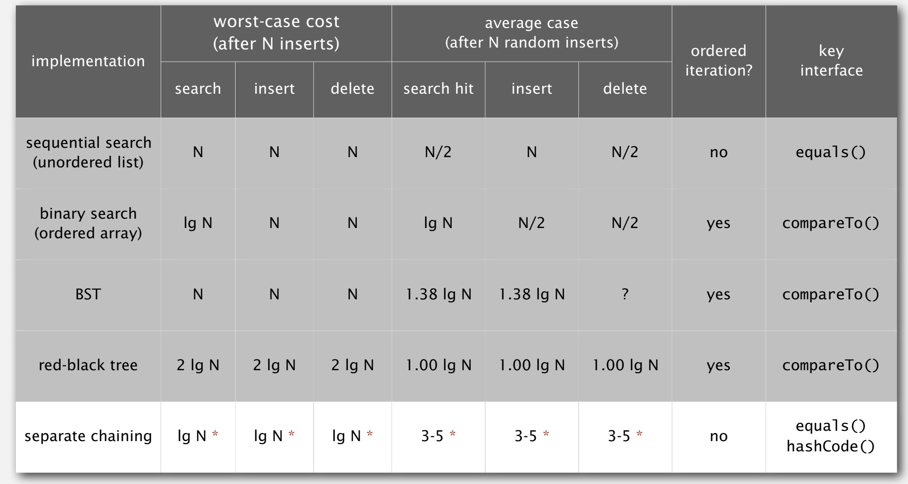

注意，这里个3-5是指一个链表的长度，通常hash数组的长度为元素个数 / 5

<hr>


# 十一、无向图


## 1. Intro

图的定义:

> 由成对的边连接而成的一堆点


<hr>


图中的术语:

- Path(路径): 由边连接而成的有序顶点
- Cycle(环): 首尾顶点连在一起的路径


如果两个顶点中间有一路径，则视为它们相连


<hr>


## 2. API


对图的常规处理: 计算顶点的层级、计算最大层级、计算平均层级、计算环的数量


将顶点的索引与其连接的点对应起来:


Java实现:


<hr>


## 3. DFS(depth-first search)

将迷宫抽象为图:

- 其中的交点即为图中的顶点
- 其中的通道/路径即为图中的边


探索迷宫的基础算法:

- 想象你拿着一根线
- 对每条走过的路和每个交点都进行标记
- 如果没有其他的路径选择，则回退，直到有新的路径为止


DFS算法:

- 目标: 系统性地搜索一个图
- 思路: 模仿上述探索迷宫的方法即可

基本的做法:


常规应用:

- 找到所有与目标顶点相连的顶点
- 找到连接指定两个点的路径


设计模式:

将图处理和图的数据分离开来

- 创建一个图对象
- 将该图对象传递给一个Paths对象，通过这个Paths实例进行处理


实现DFS:

- 通过marked布尔数组来实现对访问过的顶点进行记录
- 通过edgeTo数组表明索引表示的顶点对应的父节点(用来快速回退)


大致实现:


剩余的方法:


现实中的应用:

将灰色的天空改为蓝色

- 将像素点视作图里的顶点
- 将两个紧邻的灰色像素视作边
- 所有连接起来的灰色像素即可视作图，可看作一个blob类型数据(binary large object)


<hr>


## 4. BFS(breadth-first search)

BFS示例:

- 重复以下步骤直到队列为空:
    - 将顶点v出队
    - 将所有与顶点v紧邻的且还未标记过的相连节点全部添加到队列中


<hr>


### 1) 特性

- DFS: 将所有未标记的顶点放到一个栈中
- BFS: 将所有未标记的顶点放到一个队列中


- BFS更适合用来解决查找点到点的最短路径问题

思路:


- 每个与起始节点相连的节点都只经过一次


实现:


<hr>


## 5. 连通分量

- 连接的定义: 两个顶点之间有一条路径
- 目标: 在常数时间内，将两点是和否连通的结果处理成表单

大致框架:


Eg:


处理的思路:

- 同DFS一样，用一个数组来记录每个顶点的访问状态
- 用DFS遍历所有未访问的顶点，并将每个部分的顶点分成不同的连通分量


大致实现:


- count字段: 表示初始化之后图中的连通分量个数
- id数组: 代表每个元素对应的连通分量序号/id

<hr>


- 应用:

检测灰度图里的粒子数量

(灰度图可以将传统3通道简化为单通道，从而简化计算量，提高效率；灰度图在简化像素量的同时还能区分亮度和色度)

- 顶点: 像素
- 边: 相邻两个灰度值大于70的像素
- blob: 多个像素形成的连通分量


<hr>


# 十二、有向图


## 1. intro

有向图:

- 多个由有向边连接而成的成对的顶点


有向图的应用:


常见的问题:


<hr>


## 2. API

- 结构与无向图差不多:

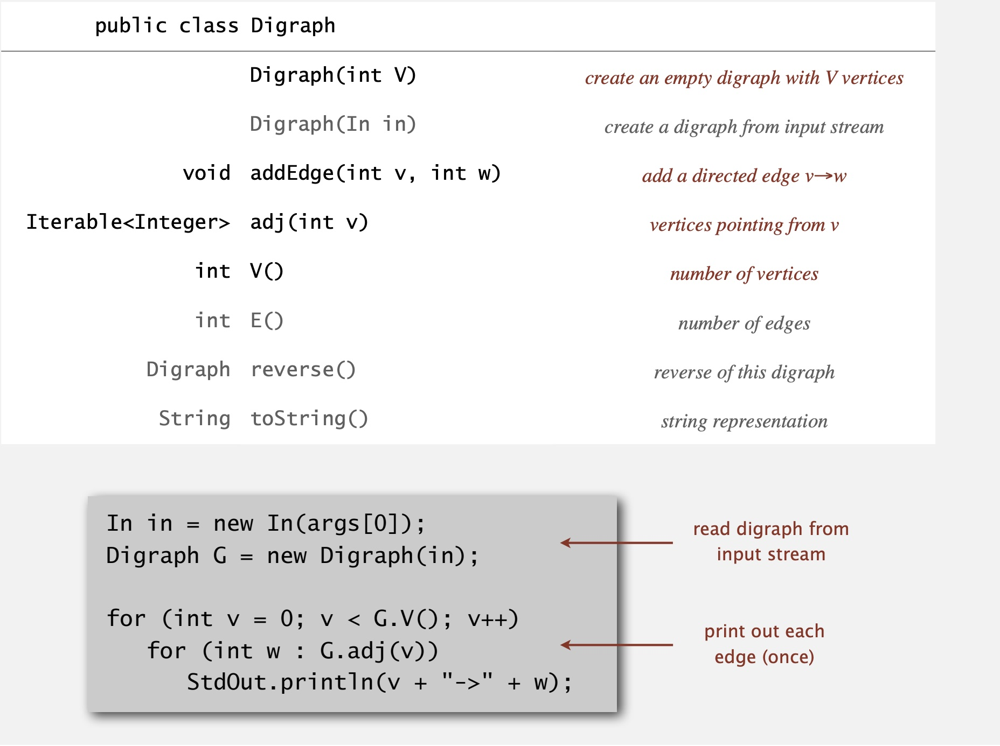


区别:

- 无向图在使用`addEdge`方法设置边的时候会设置双向关系(将两个顶点设置为彼此的相邻点)
- 有向图则会只会在`addEdge`方法中设置单向的关系


无向图


有向图:


<hr>


## 3. 有向图搜索

### 1) DFS


问题:

找出所有从s开始沿着有向边能够到达的所有顶点


Solution: 和有向图一样使用DFS即可

- 无向图可以看作有双向边的有向图
- DFS是一种有向图算法


DFS演示:


实现:

- 复用无向图中的实现即可


- 应用:

标记清除垃圾回收(Java中的JVM自动回收)


- 以一个对象为顶点
- 以一个引用为有向边
- 以程序直接引用的对象作为根(其实节点)，其中与根顶点相连的都是还在使用的对象


标记清除算法的核心:

- 将与root顶点相连的所有对象标记为正在使用的对象
- 没被标记的自然为没有使用的对象，此时用GC进行垃圾回收
- 标记的过程就是对有向图进行DFS，此时因为DFS而额外使用部分栈空间

<hr>


### 2) BFS

问题: 计算一个顶点与其他所有点之间的最短距离


Solution: 借用队列(类似层序遍历)，重复一下步骤直到队列为空

- 从队列头取出一个顶点，根据层级关系记录其对应的距离
- 将取出的顶点对应的相邻顶点全部添加到队列中，并对添加的节点进行标记防止重复添加


同DFS一样:

- 无向图可以看作有双向边的有向图
- BFS也是一种有向图算法


Eg:


- 将该问题衍生为多源最短路径(即计算多个顶点到所有节点的最短路径)


- BFS有向图搜索的应用: 网络爬虫


- 使用BFS实现网络爬虫:


<hr>


## 4. 拓扑排序


### 1) Problem


给你一堆任务，请你安排一个能够合理完成所有任务的顺序(任务之间有先后关系约束)

- 其中任务对应图中的顶点
- 有向边即对应图中的有向边

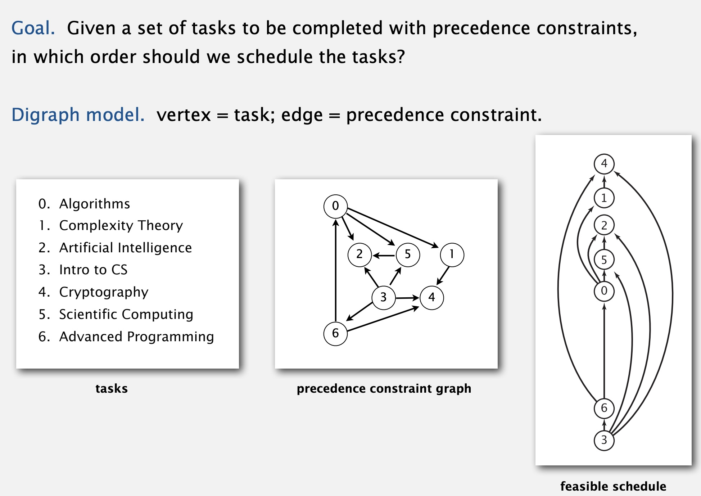


### 2) Solution

解决方法:

- 通过拓扑排序重新编排无环有向图


概念:

- DAG: Directed Acylic Graph


思路:

- 进行DFS
- 按照后续遍历的顺序返回所有的顶点

Eg:


- DFS实现


- 这里利用栈使得所有的顶点得以通过后续遍历倒序的顺序进行返回


- 注意: 只有有向图为DAG(无环有向图)时，才能使用拓扑排序

<hr>


### 3) Application

- Java编译器对类的继承关系进行检测(防止出现环形继承关系)


- Excel中禁止单元格的循环引用:


<hr>


# 十三、最小生成树(MST)


## 1. intro

最小生成树(Mininum Spanning Tree)的定义:

> 在一个加权无向图中(边的权重都是正数)，一个包含了所有顶点，且对应边的权重和最小的子图(subgraph)，且该子图中无环


无向加权图:


得到的最小生成树:


<hr>


## 2. 贪心算法

### 1) 假设

两个前提:

- 边的权重是不重复的(不会出现任何两条权重相同的边)
- 图是连通的


对于满足以上两个条件的无向加权图而言:

- 一定存在一个唯一的最小生成树


Eg:


<hr>


### 2) 裁切分组

先导定义:

- 裁切操作: 将一个图划分为两个非空的顶点集
- 跨界边: 边中两个点分别处于两个不同的顶点集


每次进行裁切之后:

> 所有的跨界边中，权重最小的边必然存在与最小生成树中


Eg:


Eg:


<hr>


### 3) 通过贪心算法计算最小生成树

思路:

- 不断通过裁切分组获取对应的最小边，并将当前裁切后的其中部分树的节点进行记忆/标记
- 重复上述步骤直到所有节点被标记


<hr>


## 3. 加权图API


- 实现加权的边:


- 在上述加权边的基础上，实现加权图无向图:


- 在无向加权图的基础上实现最小生成树:


我们只需要实现`edges`方法即可

<hr>


## 4. Kruskal's Algorithm

- 其是一种从无向加权图中获取最小生成树的算法
- Kruskal算法其实是一种特殊的贪心算法


思路:

- 将所有的边按照权重进行排序
- 依次取每个边作为MST的边，如果取当前边会形成环则跳过当前边


Eg:


Java实现:


- 这里利用了最小有限队列来存储边


- 用时分析:


<hr>


## 5. Prim's Algorithm

- 从第一个顶点开始(顶点0)
- 依次添加与当前边相连的其他边中权重最小的


与Kruskal的不同:

- Prim算法是在当前选取的边作为基础进行延伸，而Kruskal则根据权重依次添加每条边


- Prim算法也是一种特殊的贪心最小生成树算法


- 简易实现:

维护一个最小优先队列，其中存储所有的边，依次获取与当前边相连的其他未标记的边


Code:


- 消耗:


- 另一种实现:

维护一个最小优先队列，其中存储的是顶点


- 使用索引优先队列，让索引与队列中的元素进行对应，需要一个中间数组进行位置转换(数组qp)


- 因为Prim算法需要依赖优先队列，所以最终操作的用时取决于优先队列的实现:


<hr>


# 十四、最短路径

问题: 给你一个加权有向图，找出两点之间的最短路径

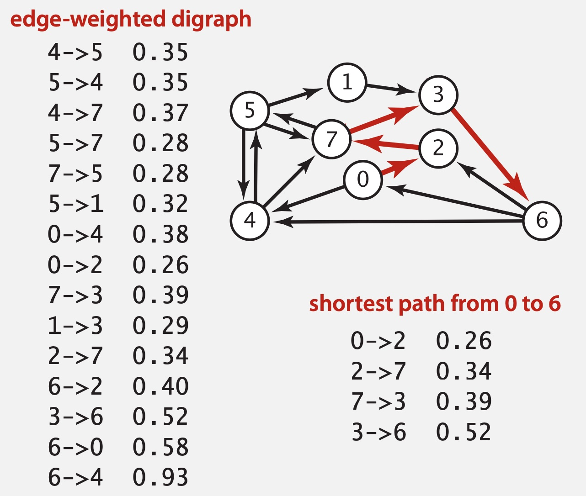


应用:


## 1. API


实现一个有向边类:


实现加权有向边类:


- 加上临近顶点列表:


实现最短路径的框架:


<hr>


## 2. SPT(Shortest Path Tree)


### 1) 单源最短路径数据结构

- 其中`distTo[v]`表示从起点s到终点v的最短距离
- `edgeTo[v]`代表从起点s到终点v最短路径中的最后一条边


<hr>


### 2) 边松弛(Edge relaxation)

- 在搜索过程中，一旦出现更短的路径，则更新`distTo`和`edgeTo`数组中对应的元素


Implement:


<hr>


### 3) 最短路径最佳条件

- 将起点对应的`distTo[s]`设置为0
- 保证从v -> w中，起点到终点w的距离`distTo[w]` ≤ 起点到另一个端点的距离`distTo[v]` + v到w这条边的权重
- 如果出现`distTo[w]` > `distTo[v]` + `e.weight()`的情况，更新`distTo[w]`

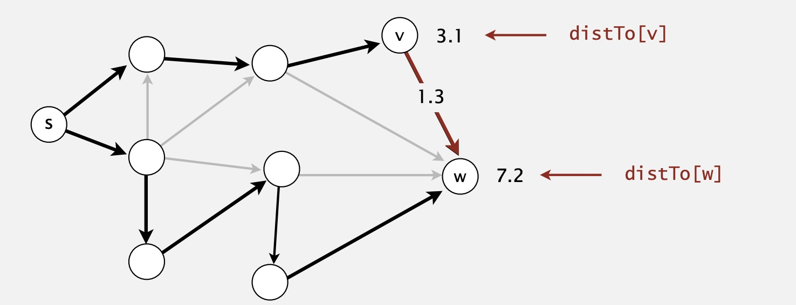

<hr>


### 4) 通用最短路径算法

- 将起点位置的距离初始化为0，将其他位置的距离初始化为+∞
- 重复之前的最佳条件，直到松弛所有的边

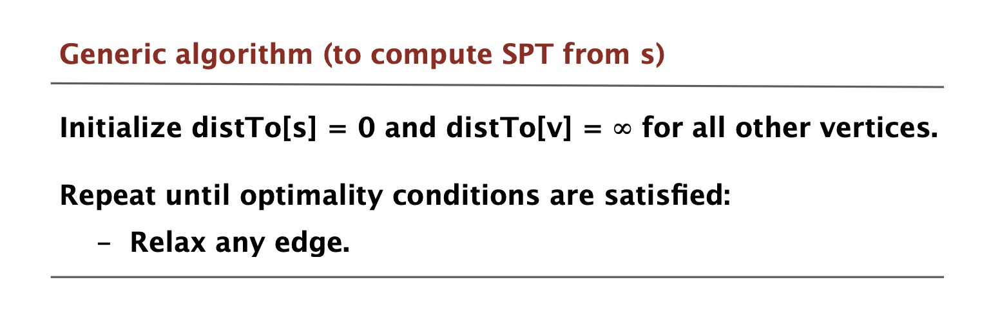

<hr>


## 3. Dijkstra算法

- 从起点开始，按照边的权重遍历与其连接的所有边(类似Prim算法)
- 将对应的边添加到最小生成树中，并松弛所有的边


- 实现:


- Dijkstra和Prim算法相比:
    - 两者本质上是同一个算法
    - 两者都是在图中计算最小生成树
- 不同之处:
    - Prim: 选取最接近MST的边
    - Dijkstra: 选取最接近开头顶点的边


消耗:

- 同样取决于优先队列的实现


<hr>


## 4. 加权无环有向图

- 如果得知加权有向图无环(DAG)，则使用拓扑排序
- 再松弛边以获取最小距离


- 拓扑排序算法在获取最短路径时的特点:
    - 可以从任意边开始计算(甚至是负数权重边)
    - 用时: E(edges) + V(vertices)


Eg:


<hr>


- 寻找加权无环有向图的最长路径

将relax操作反转一下即可


- 寻找最长路径的应用:


并行工作计划表

- 给你一些区间代表工作安排，其中每个区间都有优先级约束(先后顺序)，试求最短用时


问题抽象:

- 用两个顶点代表一个工作安排的起止时间
- 将起止位置看作两个权重为0的边


