# Day91

## Tag: BFS, Map, Queue

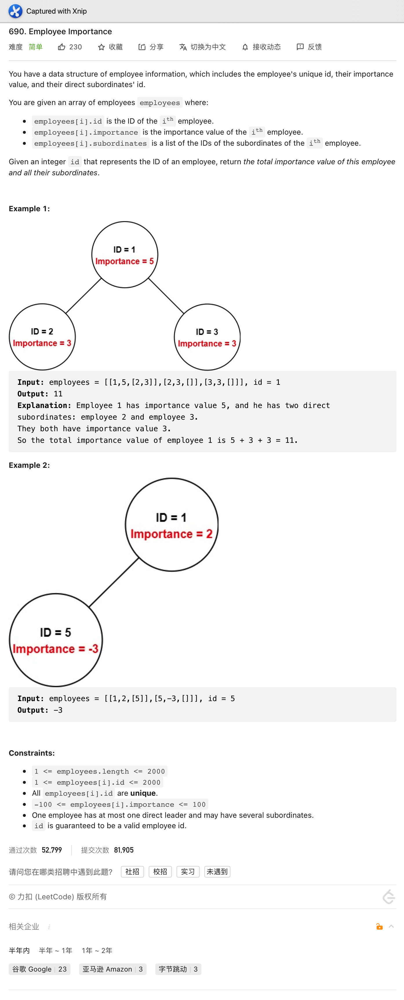

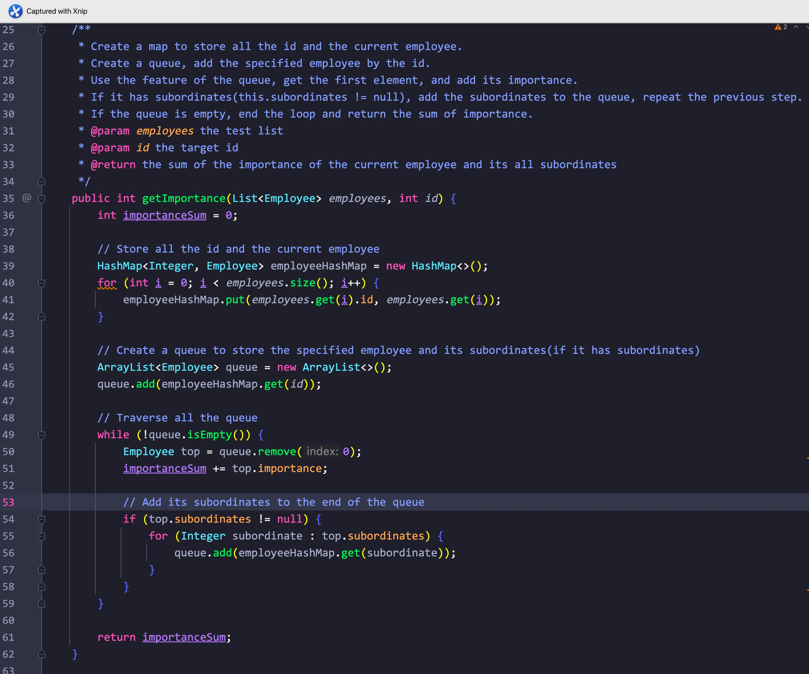

题意:

给你一个员工集合，和一个指定的id，返回该员工和其所有下属员工的重要性之和(下属员工包含其下属的下属)

每个员工拥有三种属性:id, importance, subordinates(前两者为int, 下属字段为一个List<Integer>集合)

思路:

- 创建一个hashmap映射，键值对分别为id，对应的员工对象，将参数集合添加到该映射表中
- 创建一个<Integer>队列，先使用参数id，通过hashmap映射获取对应的员工对象并添加到队列中
- 如果队列不为空，就进行如下循环:
- 取出并移除队列中的第一个对象，将其importance添加到result中，判断其subordinates是否为空，不为空就添加到队列尾
- 队列为空就跳出循环，返回result即可

数据结构:

队列: 存储相关的员工id，利用其先进先出的特性

图: 存储每个员工间的层次关系，进行广度优先遍历(BFS)

****

# Day92

## Tag: SQL Day37

****

# Day93

## Tag: Divide Comquer, Recursion

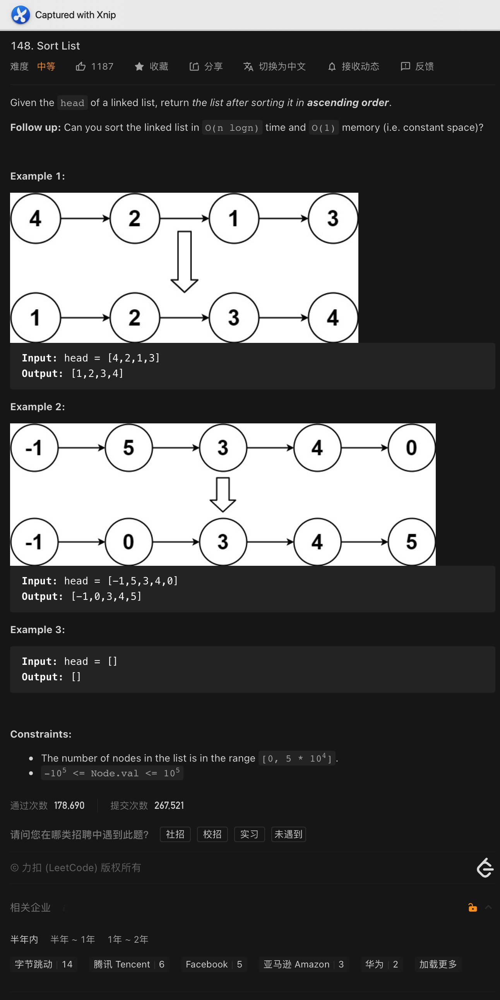

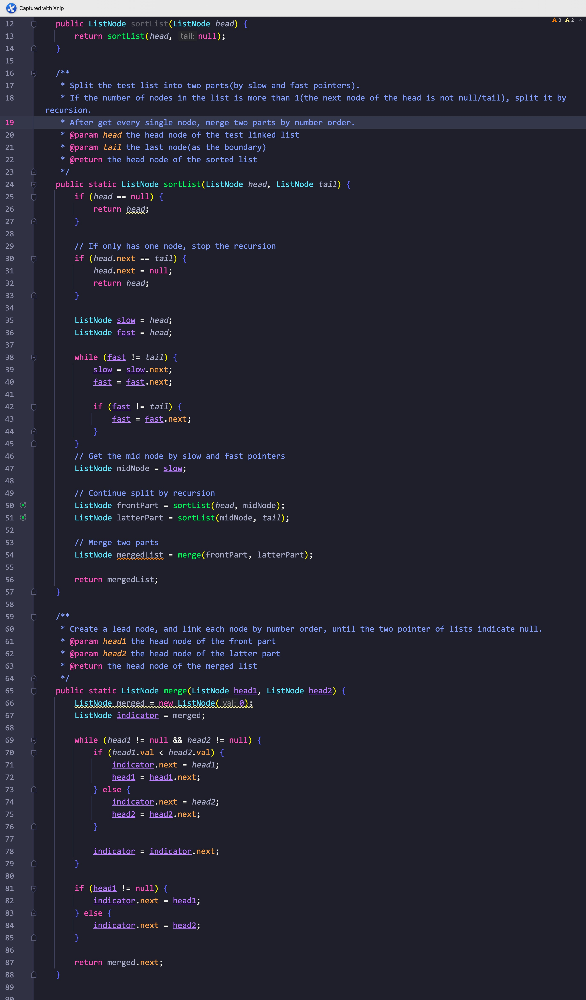

题意:

给你一个无序链表的头节点，请你将其重写排列为有序链表，并返回排序后的头节点

思路:

- 此题目可以暴力解:即遍历一次链表后将值最小的添加到新的链表尾，添加再将其删除并重新整理链表，这样做需要将整个链表都遍历n!次，很低效

- 想象一下: 如果链表中只有一个节点呢？是不是不用排序直接返回就行了？那么具体该怎么做呢？
- 这里可以使用分治的思想: 即将大问题分解为小问题，这道题就可以将长链表分解为一个个只有一个节点的小链表
- 为了保证划分后的两部分能同时得到小链表，我们每次划分需要从中间开始，这里我们使用快慢指针来获取中间节点
- 每次划分后，都将头节点head到中间节点midNode作为前半部分，从midNode到null作为后半部分，直到链表中只有一个节点为止(头节点的下一个节点为null)，这里明显可以使用递归，终止条件为head.next == null
- 获取小链表后，我们将两部分进行排序，从两个只有一个节点的链表开始排序后，每次排序都会是两个有序链表的合并问题(见Algorithm Day35)，只需要将两部分都遍历一次即可合并，最后返回头节点

****

# Day94

## Tag: Two Pointers, Array

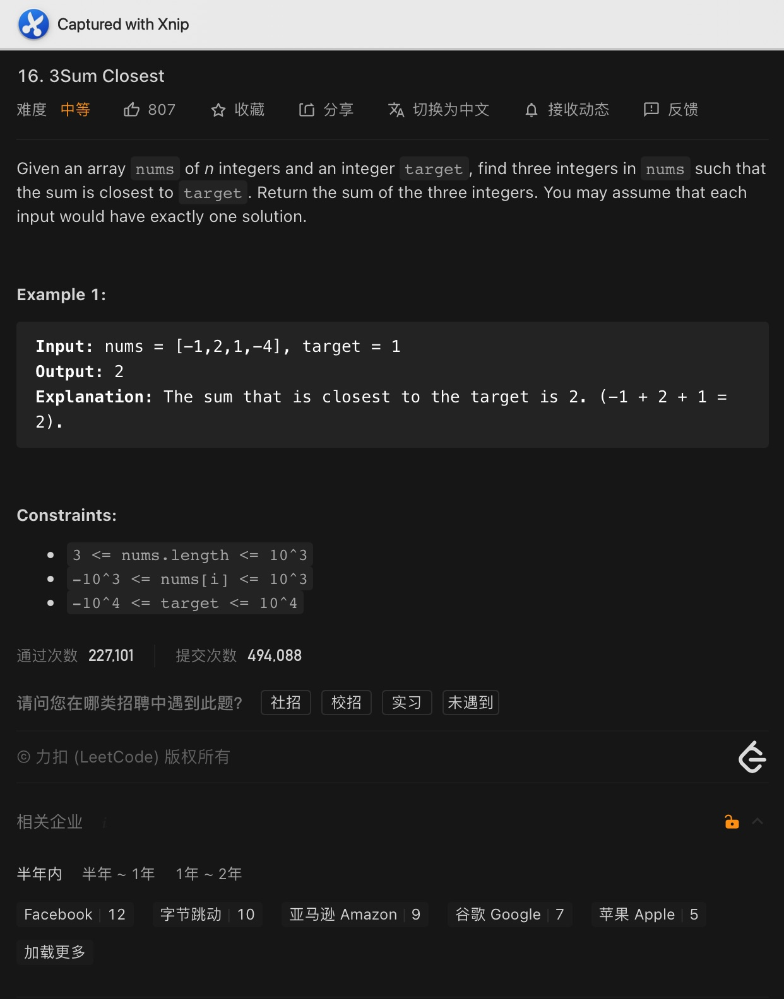

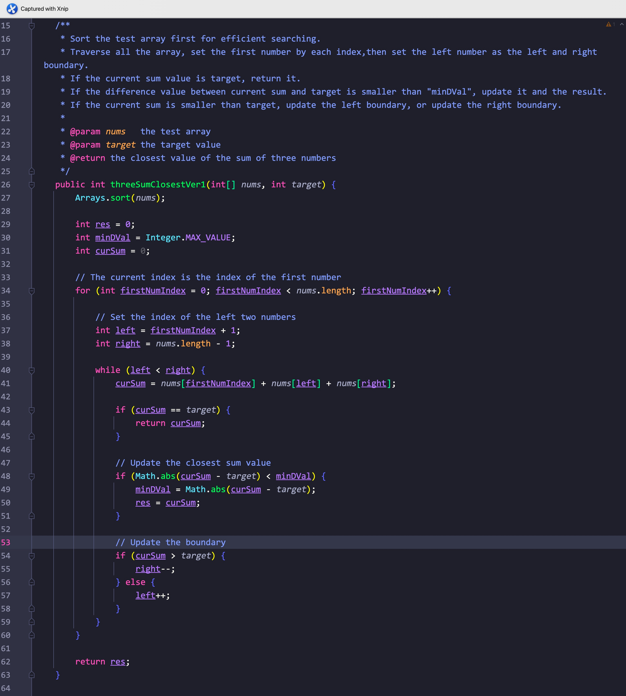

题意:

给你一个数组和一个目标值，返回最接近目标值的三个数的和

思路:

- 思路其实和Algorithm Day73中的差不多，只不过返回的是值罢了
- 同理，为了方便一次遍历就能对比，我们首先对参数数组进行排序
- 将数组进行一次遍历，遍历时使用的索引值作为第一个数字的索引
- 将第二个数字的索引值初始化为第一个数字的后一位，第三个数字的索引值初始化为数组的最后一位
- 接下来将寻找最合适的第二三个数字，将它们的索引作为左右边界，该问题就转换为了二分法！
- 首先如果目前三个数字的和就是目标值，那么直接返回，不是则进行下面的步骤
- 如果目前三个数字的和离目标值的距离(通过差值的绝对值)，比当前的最小距离还小(minDVal)，则更新最小距离，并更新结果值
- 接下来进行二分法的传统做法: 如果当前的和小于目标值，则更新左边界(即第二个数字的值)，否则就更新右边(第三个数字的值)
- 将数组遍历一次后便可返回结果

****

# Day95

## Tag: Queue, Form Drive

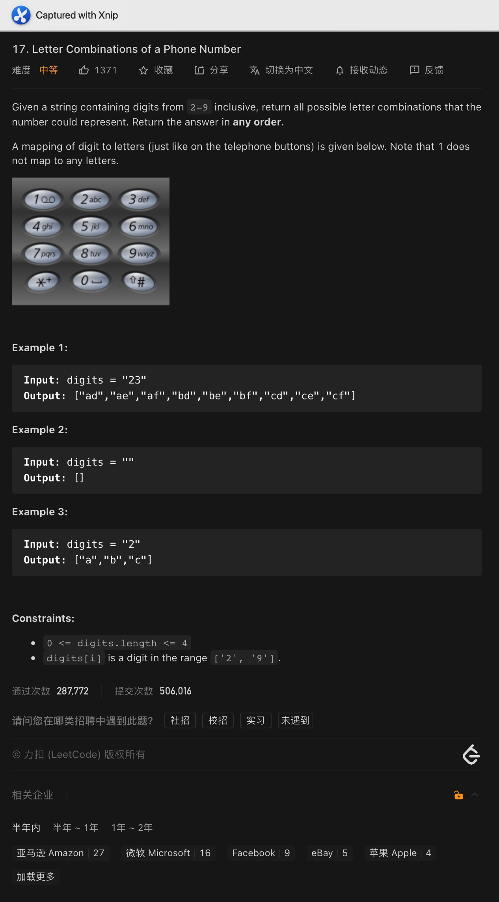

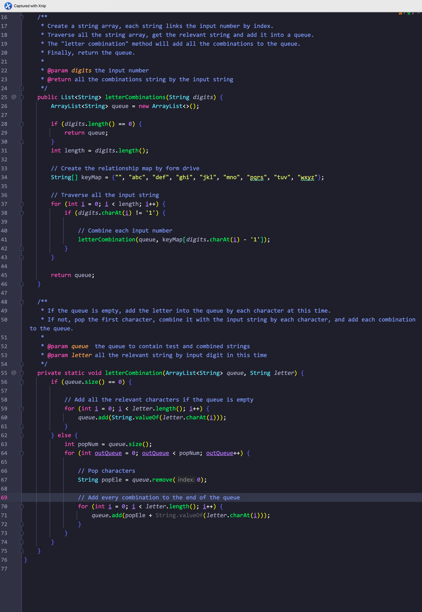

题意:

给你一组数字字符串作为输入，请将其在手机键盘上对应字母的所有组合找出，并返回为一个集合

思路:

- 创建一个队列，将第一个数字对应的字符全部添加到其中
- 将第一次添加后的队列元素依次弹出，与第二个数字对应的字符进行组合，将每次组合后的结果添加到队列中
- 重复上面的步骤，直到遍历完输入的数字字符串

实现:

letterCombinations:

- 创建一个队列(这里用ArrayList这个常用的集合)，如果输入的字符串长度为0，直接返回这个队列(为空)
- 创建一个字符串数组，从下标0开始，每个元素都表示数字对应的字符(获取时将数字 -1即可)
- 将输入字符串遍历一次，每次遍历都添加到方法"letterCombination"中
- 最后返回该队列

letterCombination:

- 参数接收之前创建的队列，以及该次遍历中输入的数字对应的字符
- 如果是第一次调用，则队列为空，直接将第一次输入数字对应的字符全部添加到队列中
- 如果不是第一次，将队列中现存元素从开头弹出，并与本次遍历中输入的数字对应的字符进行组合，并将组合后的元素添加到队列尾即可

****

# Day96

## Tag: String, Math

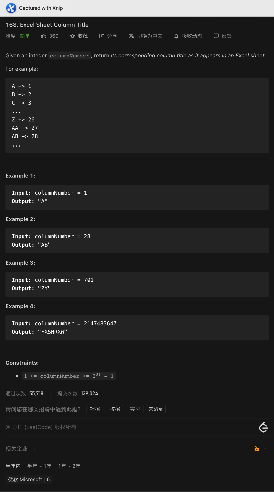

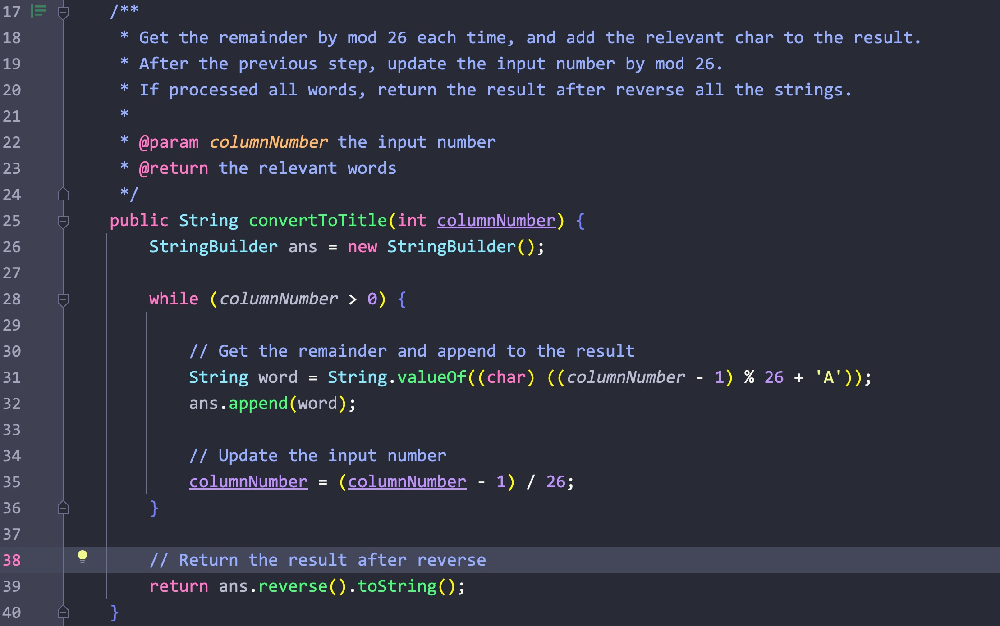

题意:

给你一串数字，请你返回其在Excel表格中对应的行列号，对应关系应如下:

1 —> A

...

27—> AA

...

思路:

- 虽然场景是Excel表格，但其实是26进制转换问题
- 我们将输入的数字作为10进制，将其转换为26进制下对应的字母即可
- 想象我们是如何将10进制处理成2进制的？
- 每次除以进制2，将余数作为结果每一位上的数字
- 最后再反转一下即可(仅针对整数部分)

实现:

- 创建一个StringBuilder对象(最后可以利用其reverse()方法快速反转)，用于收集每一位处理后的结果
- 创建一个循环，将输入数字>0作为循环条件
- 在循环中实现取余数，添加到结果字符串，更新输入数字
- 最后将结果字符串反转后返回即可

****

# Day97

## Tag: Two Pointer, Array

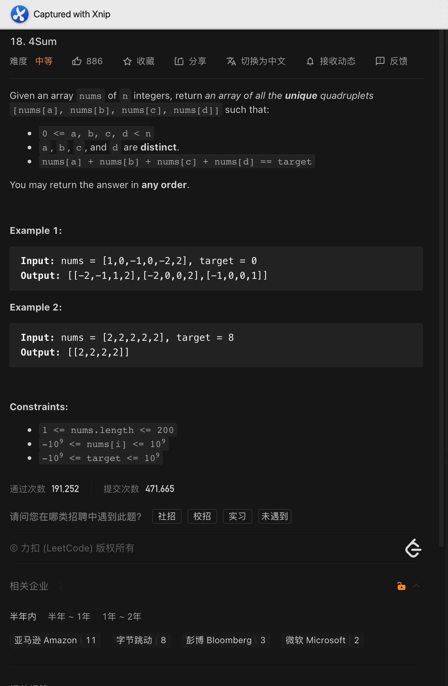

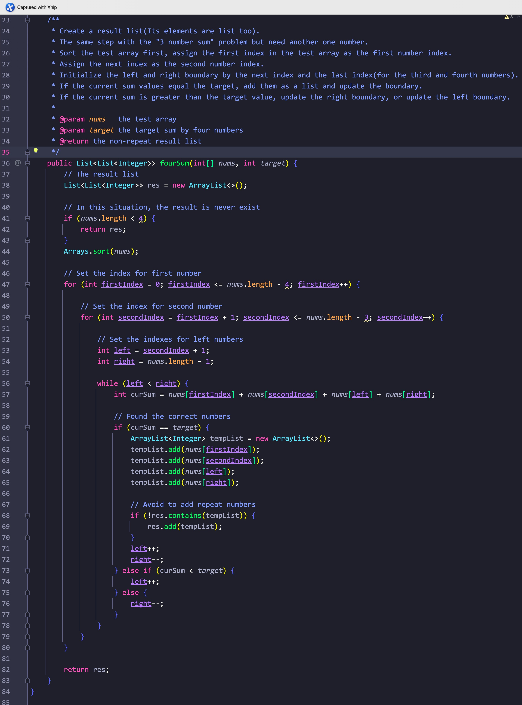

题意:

给你一个数组和一个目标值，请你找出数组中所有4个数之和等于目标值的数组元素组合，结果不能重复

思路:

- 本题其实和之前做的许多题目都有关联，甚至做法都差不多，见:Algorithm Day15, 72, 94，想要了解这类题目可以从leetcode的第一题开始
- 还记得Day94最接近的三数之和还有Day72的三数之和吗？这道四数之和的做法和它们都差不多

- 回顾一下三数之和的做法:
- 首先对数组进行排序，然后固定一个数为索引，通过它将数组遍历一次
- 在遍历中，我们设立一个循环，通过双指针的方法寻找剩下的两个数，当前的和大于或者小于目标值，我们都更新对应的边界(即剩下两个数字的索引)，循环条件则为常规的左边界小于右边界

- 那么四数之和呢？
- 我们先固定一个数字，剩下的不就是三数之和的问题了吗?

实现:

- 创建一个结果集合，对测试数组进行判断，如果其长度小于4，那么就不可能有答案，直接返回结果集合即可
- 对数组进行排序，方便后续查找
- 对数组进行一次遍历，遍历的数字作为第一个数字的索引，此时我们已经固定了一个数字

以下为三数之和的步骤:

- 对数组进行一次遍历，起始的索引数为之前第一个数字索引的后一位，将其作为第二个数字的索引值
- 在遍历中初始化左边界和右边界，其分别为第二个数字索引的后一位和数组的最后位置
- 创建一个循环，条件为lefr<right
- 在循环中，如果四个数的和就是目标值，则将这四个数字组合为一个集合后添加到结果集合中，并更新索引
- 如果不相等，则更新对应的边界索引值即可
- 最后返回结果集合

****

# Day98

## SQL 43

****

# Day99

## Tag: BFS, Array

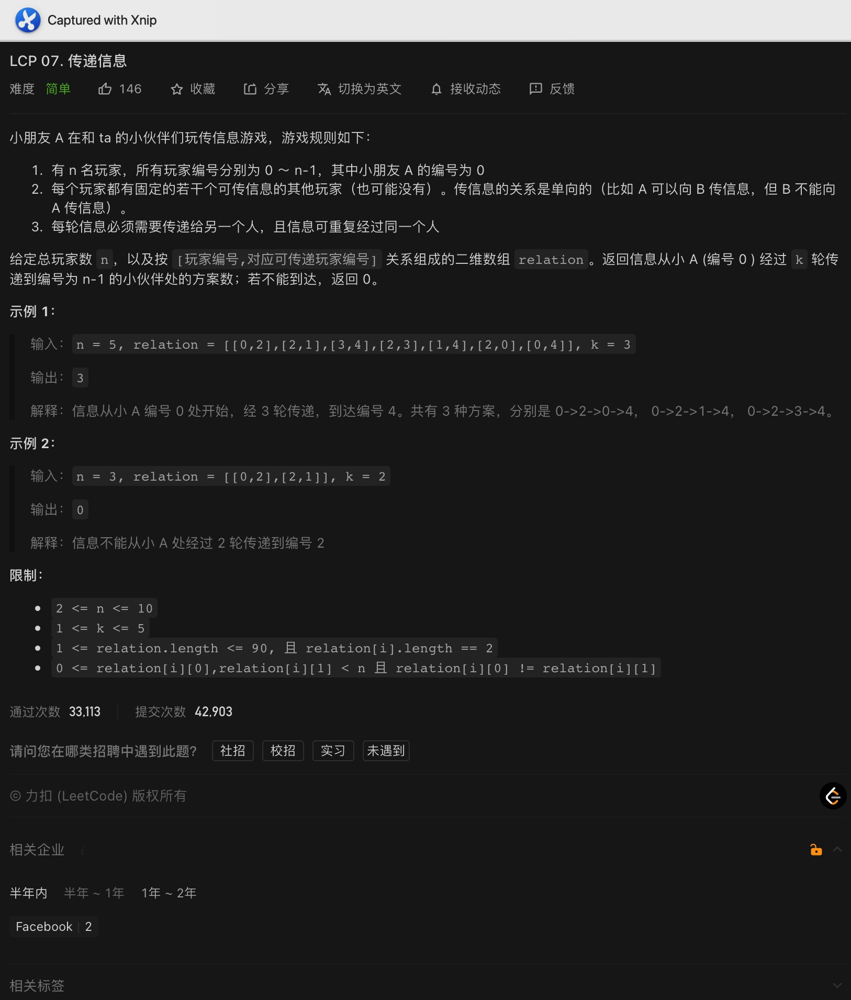

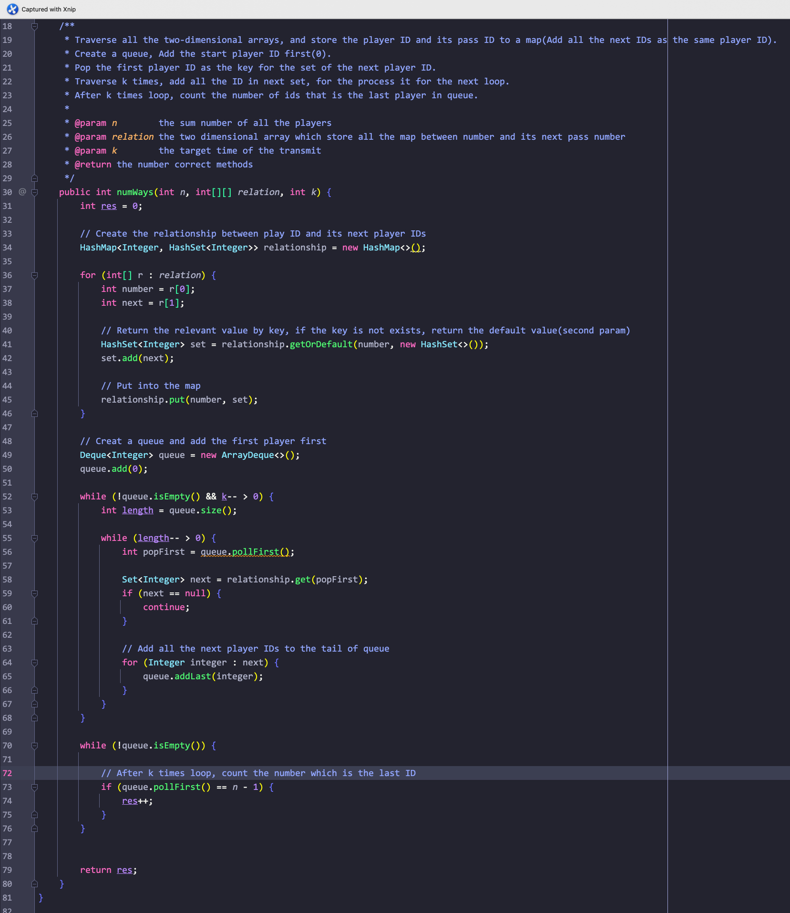

题意:

给你一个二维数组，每个元素都为一个长度为2的数组，其中第一个数字代表该玩家的ID编号，另一个数字代表他所能传递的一下个玩家的编号

现在给你游戏的总人数n，要求你从编号为0的玩家开始，找出在k次传递后能传到最后一个玩家手里(编号n-1)的所有传递方式的总数

思路:

- 这道题目很明显可以使用广度/宽度优先搜索来做，类似Algorithm Day91
- 初始化一个队列存储玩家的ID，先将开始玩家的ID添加到其中(为0)
- 我们将以下的操作施行k次即可
- 弹出队列中现存所以玩家的ID，将其能传递给下一个的所有玩家的ID添加到队列中(如果其对应的下一个玩家ID为空，直接跳过添加的步骤)
- 施行k次后，判断队列中ID为最后一名玩家的数量，即沿着每条路都走k次，看看哪条路走到了对应的点

实现:

- 和Algorithm Day91不同的是，提供的数据中没有将每个玩家对应的下一个玩家ID整合起来，所以需要我们先手动整理一下
- 创建一个映射map，键值分别为玩家ID，和其所有的可传递玩家ID，为了能够将分布的ID对应到的同一个ID上，我们使用getOrDefault()方法重复获取每个ID对应的既存的可传递玩家ID，然后将其对应的既存可传递ID集合更新
- 创建一个队列，先将ID为0的玩家添加到其中，然后创建一个运行k次循环以模拟k次传递
- 在该循环中，再创建一个运行次数为现存队列元素数量的循环，在其中每次都弹出第一个元素，并将其对应的所有可传递ID添加到队列尾
- 最后，计算出队列中ID为最后一个ID的队列元素(n - 1)的数量即为答案

****

# Day100

## Tag: Array, Form Drive

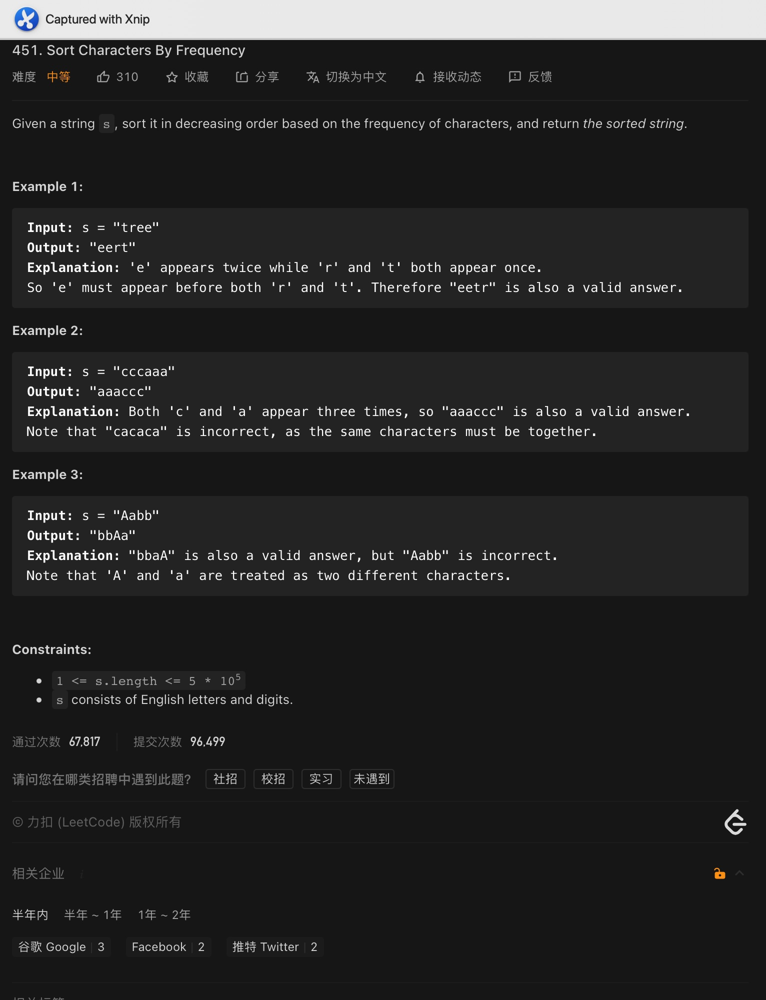

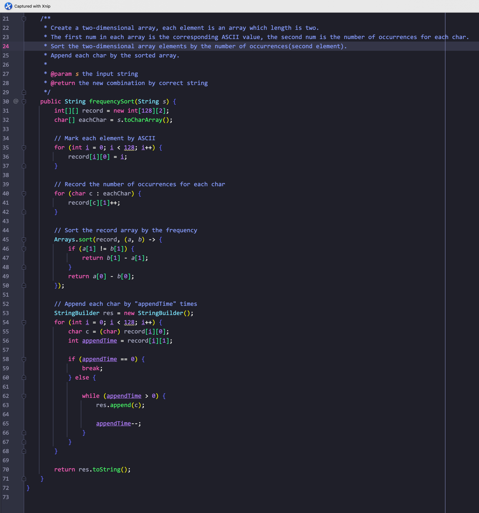

题意:

给你一个字符串，请你将其中的字符按照的出现频率从高到低排序后，再返回该结果字符串

思路:

- 字符的范围为0~128，自然想到可以使用表驱动法来记录每个字符的出现次数
- 这里有一个问题，如果使用表驱动法，在完成记录后，我们需要将字符按照出现次数进行重组
- 这里我们要么每次都找出记录表中的最大值后进行追加，并将其删除；要么将该记录表按照出现次数进行排序，并记住排序后每个元素对应的ASCII码值
- 两种方法都有些复杂，我们需要一张按照出现次数排序后，仍然还保留每个字符的ASCII码值的数组
- 这里我们可以使用二维数组，刚开始时，行数则为对应的ASCII码值，每行都有一个长度为2的数组，该数组一个元素记录字符出现的次数，一个记录该字符对应的ASCII码值
- 这样一来，即使我们对其进行排序，行数改动后，每一行中都有一个元素保留有该行对应的ASCII码值

实现:

- 如上所述，创建一个二维数组record，共128行，每行2列
- 先将每列中数组的第一个元素初始化为对应的ASCII码值，再对参数字符串进行逐个字符的遍历，并将每个字符的出现次数记录到每列数组的第二个元素中
- 对该二维数组进行排序(这里用到了自定义的排序规则和lambda表达式)，按照排序后的数组顺序，添加对应的数量的字符，最后返回结果字符串

****

# Day101

## Tag: Math, Array

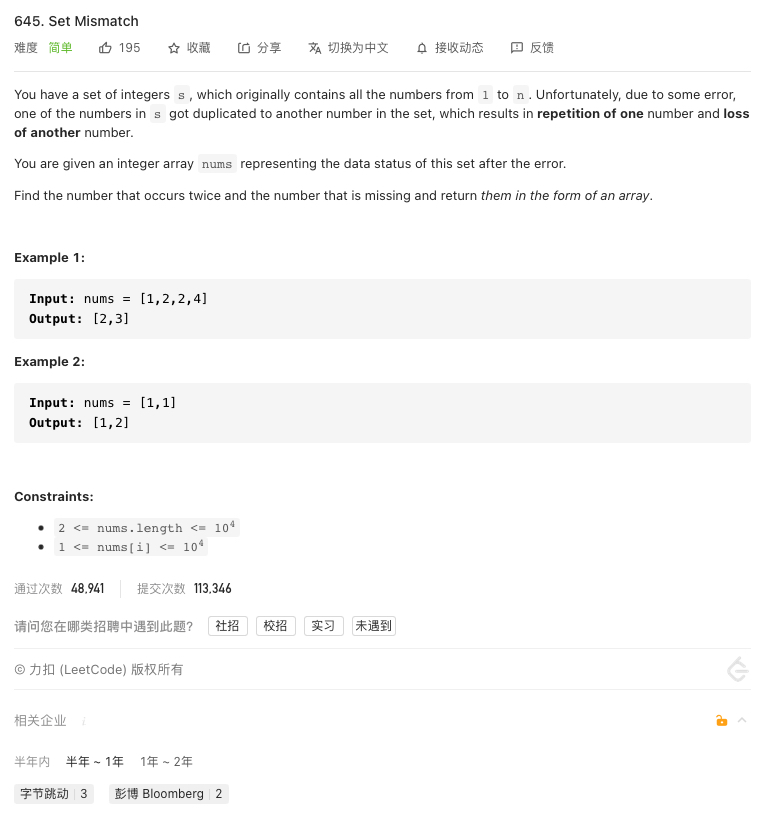

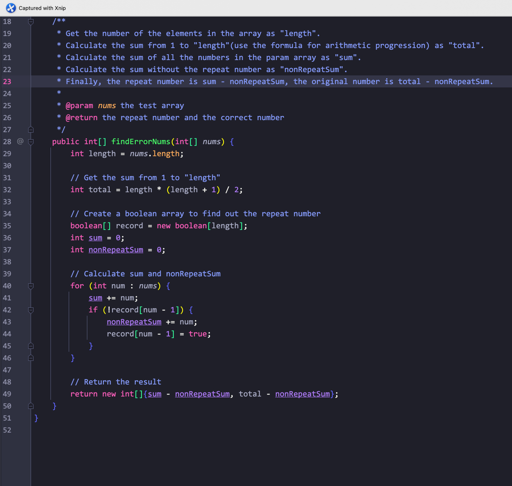

题意:

给你一个数组，其中的数字本来是从1到n没有重复的，但其中有一个数字因为一些错误发生了变化，使得该数组产生了重复的数字，请你找出重复的数字和该位置原本的数字并将两者以数组的形式返回

思路:

- 仔细观察后可以发现数学规律: 不管该参数数组是否有序，其未出错之前的和一定为从1到n(数组元素的个数)的和，我们将其作为"total"
- 对去掉重复元素后的数组求和为"nonRepeatSum"
- 再对当前的数组求和为"sum"
- 则重复的元素为sum - nonRepeatSum, 该位置原本正确的元素为total - nonRepeatSum

实现:

- 首先获取正常情况下从1到n的和(借用等差数列求和公式)
- 创建一个和参数数组大小一致的数组，用于排除重复的元素
- 将参数数组遍历一遍，计算其当前的总和sum和去掉重复数字后的和nonRepeatSum
- 最后返回sum - nonRepeatSum和total - nonRepeatSum即可

****

# Day102

## Tag: Two Pointers, Array

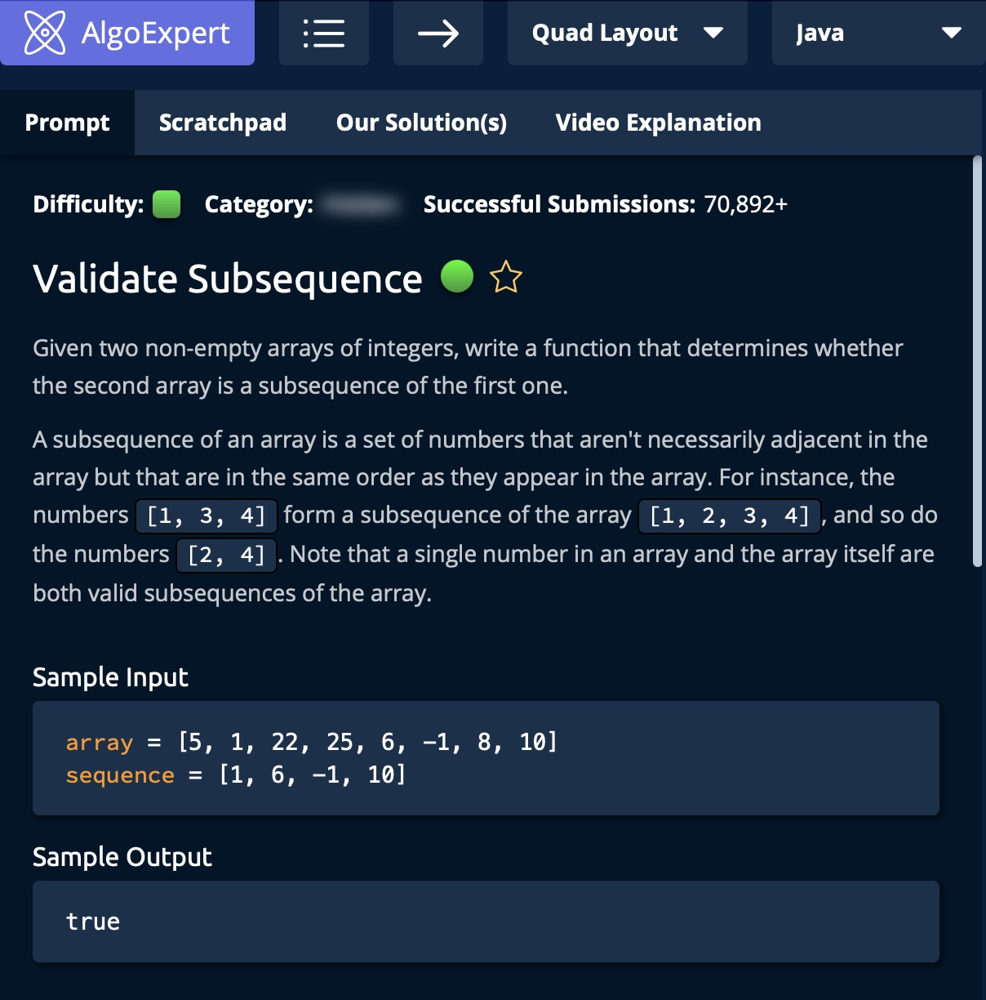

Solution1:

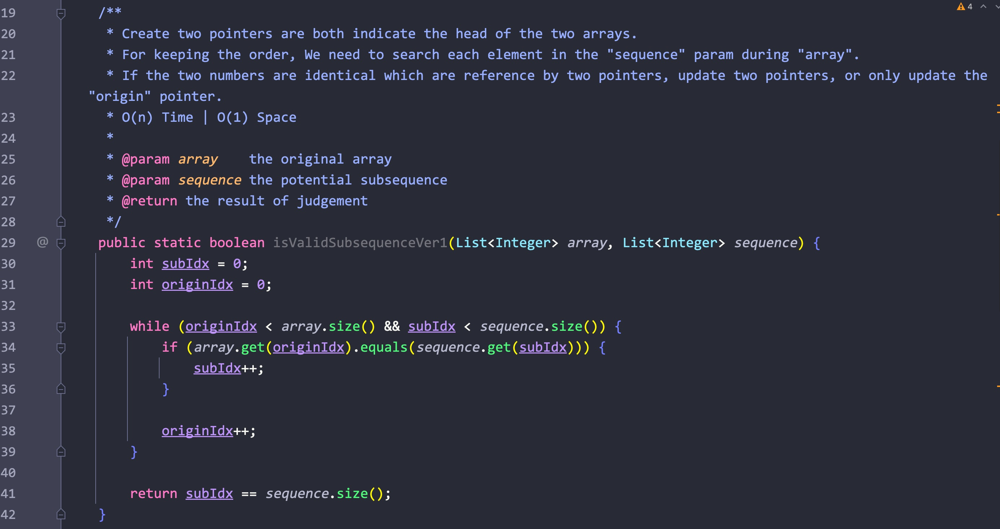

Solution2:

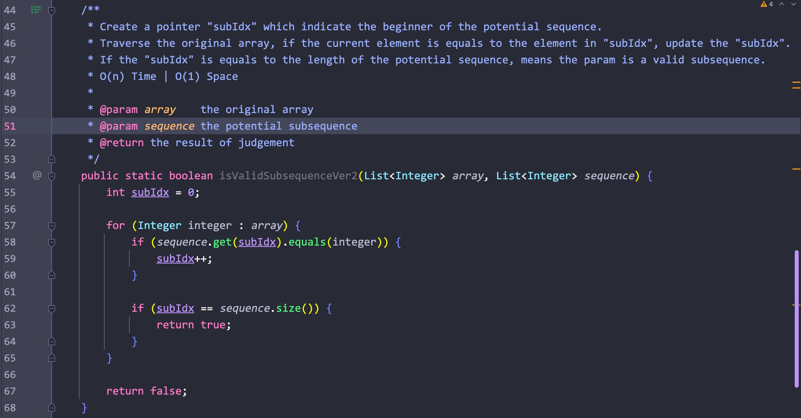

题意:

给你两个数组，请你判断第二个数组是否是第一个数组的子数组

子数组的含义:其中的每个元素都能在源数组中找到，且每个元素的相对位置都和源数组中相同(即大致顺序要相同)

思路1:

- 这道题目需要我们解决两个问题：存在和顺序
- 如果只是单纯证明存在则很简单，我们对参数二数组进行一次遍历，判断每个元素是否存在于参数一数组中即可
- 但问题是怎么保证顺序？
- 这里就需要我们对参数二的元素进行一一验证了，即需要一个个的确认其中的元素存在，且每次的查找范围都必须在上个元素的后面(保持顺序)

实现1:

- 创建并初始化两个指针，它们开始都指向两个参数数组的开头
- 设立一个循环，将指针的边界指向设立为循环条件
- 使用"subIdx"指针对第二个参数数组进行遍历，如果两个指针在两个数组中指向的数值相同，则同时更新它们两个(下一个数值只能在后面，以保证顺序)，否则只更新"originIdx"
- 最后判断"subIdx"是否指到了末尾(subIdx == sequence.size())，指到了则说明所有的数字都被验证成功了，否则就说明验证失败

实现2:

- 在循环中，不管每次是否有对应的数字，我们都会更新在源数组中的指针，所以我们只需要将源数组遍历一次就好，不需要创立指向它的指针
- 将之前的循环条件改为对源数组的遍历，其余不变，在该遍历中加上对"subIdx"的判断
- 如果"subIdx"指向了末尾，则直接返回true即可

****

# Day103

## Tag: Two Pointers, Array

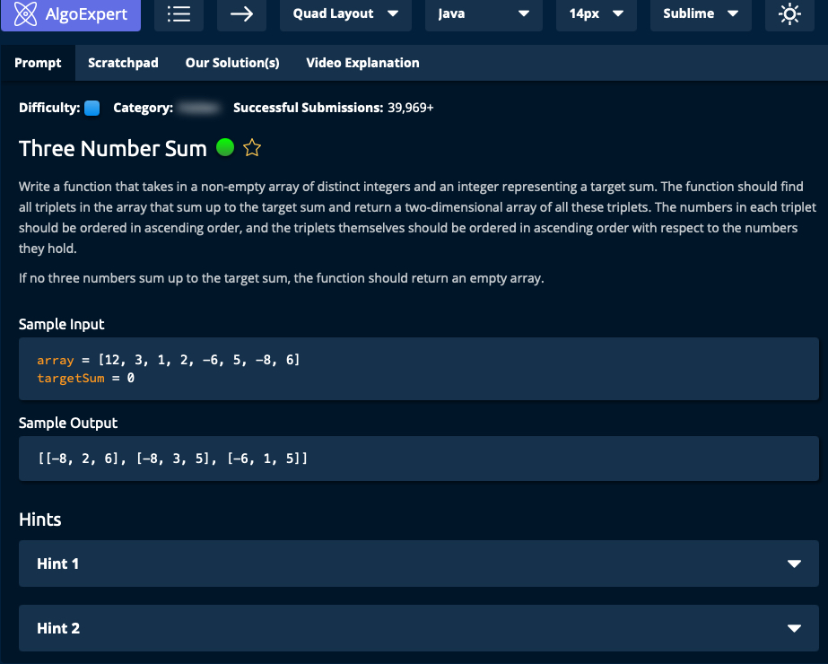

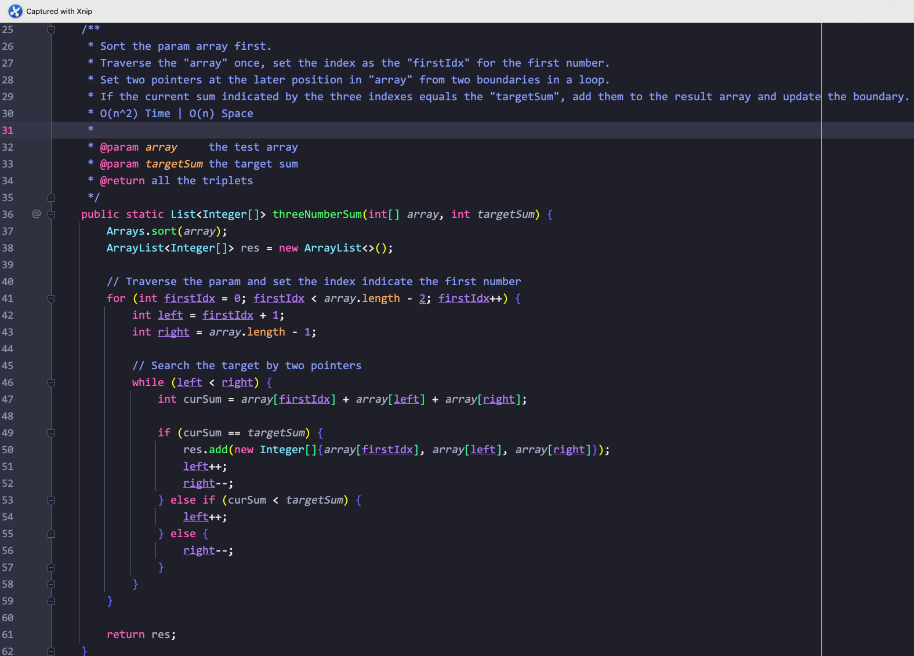

题意:

给你一个数组和一个目标值，请你找出其中三个数之和为目标值的所有集合，并返回

思路:

- 将数组遍历一次，其中的索引作为第一个数字的索引，那么目标值减去第一个数字，就剩下了第一个数字的索引了，问题就转换为了两数之和
- 这里使用两数之和中双指针的方法，所以我们需要先对数组进行排序，然后在第一个数字之后设立左右边界，通过当前的和更新左右边界

实现:

- 首先对数组进行排序
- 创建一个结果集合用于存储所有的结果
- 遍历参数数组，将其索引设立为第一个数字的索引
- 初始化左边界为第一个数字索引的后一位，右边界为数组的最后一个位置
- 如果三个索引指向的三个数的和符合条件，则将它们以数组的形式添加到结果集合中，并更新边界索引以继续搜索
- 如果不同则更新对应的边界

****

# Day104

## Tag: Array, Two Pointers

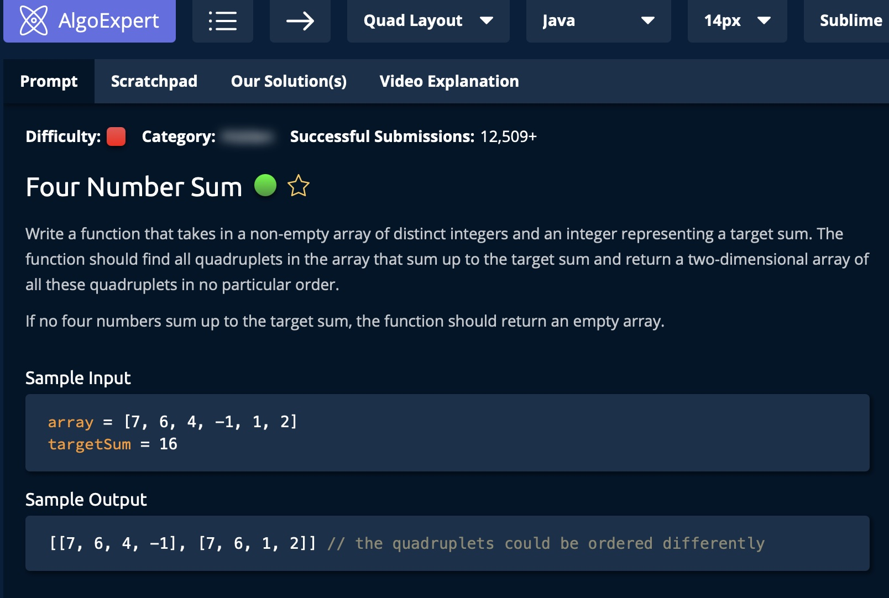

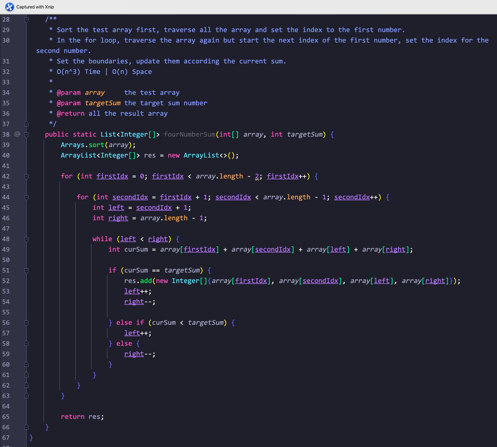

题意:

给你一个数组，请你找出其中所有的四个数字相加为目标值的组合

思路:

- 固定第一个数字，其余与昨天的三数之和相同，只是外面多一层循环而已

****

# Day105

## Tag: Array, Two Pointers, Sort

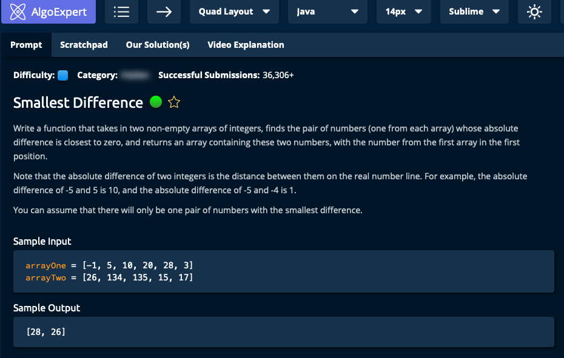

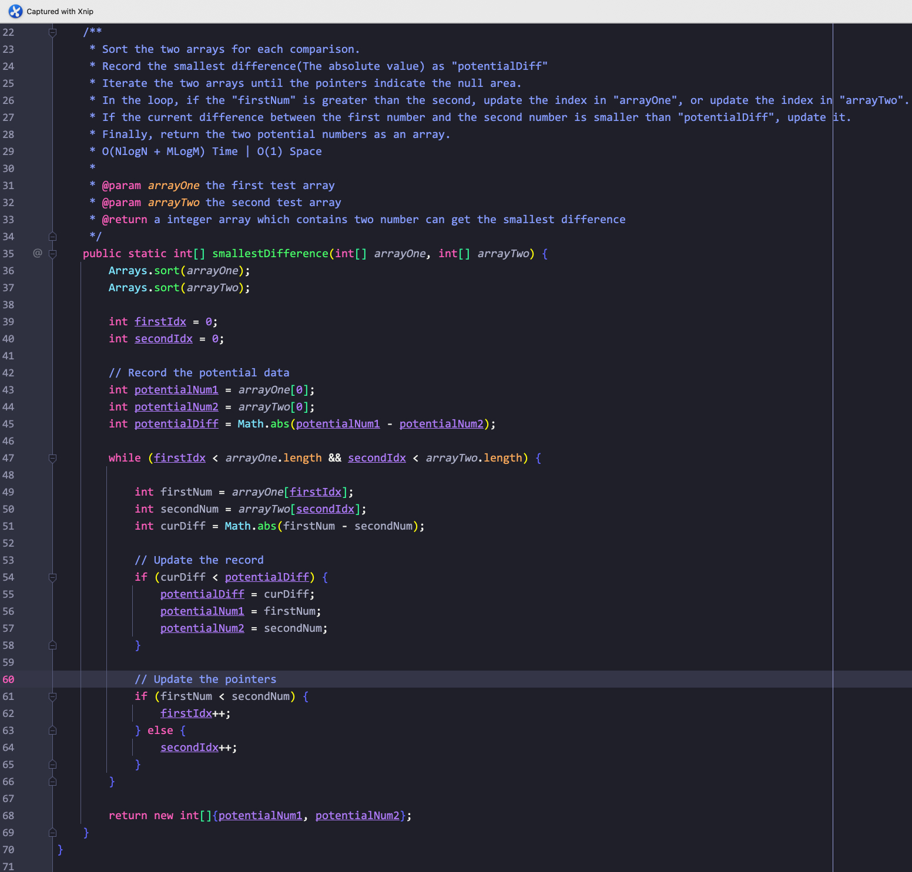

题意:

给你两个数组，请你从中各自找出一个数，使得它们的差值最小(两者最接近)

思路:

- 这里的要求是最小，最值问题就需要我们记录目前的最值，并保持更新
- 为了方便调整，我首先需要两个数组进行排序
- 使用两个索引对这两个数组进行遍历，根据两个数的大小关系更新对应的索引
- 如果当前索引指向的两个数的差值比我们记录的还要小，则更新记录值
- 最后返回记录值对应的两个数字即可

实现:

- 首先进行排序，然后我们创建三个变量用了记录，其中两个用来记录最符合答案的两个数，剩下一个用来记录最小的差值
- 在创建两个索引后，我们创建一个循环，条件为两个索引都在数组内
- 根据索引对应的两个数，我们可以获取当前这一轮循环的差值，将其与我们的记录值比较，小于记录值则覆盖它，并将当前指向的两个数字覆盖记录值
- 如果第一个数字大于第二个数字，则递增第二个数字的索引，反之则更新第一个数字的索引
- 最后返回记录值

****

# Day106

## Tag: Array, Sort, Two Pointers

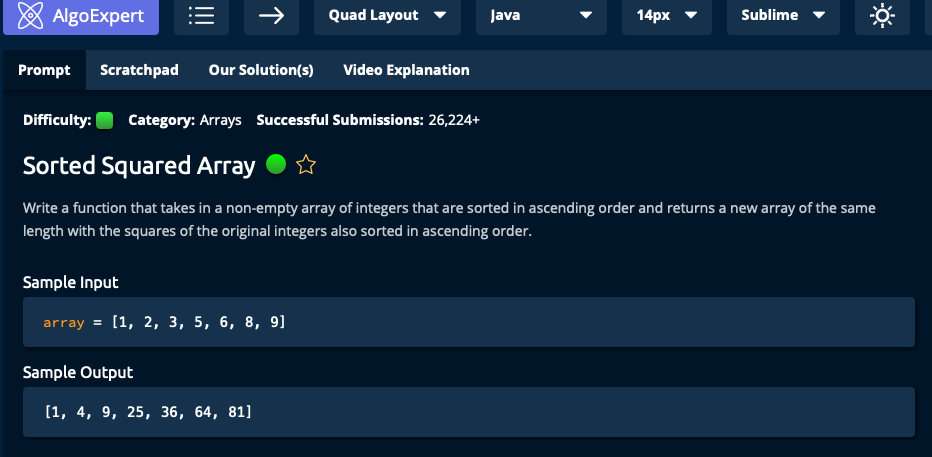

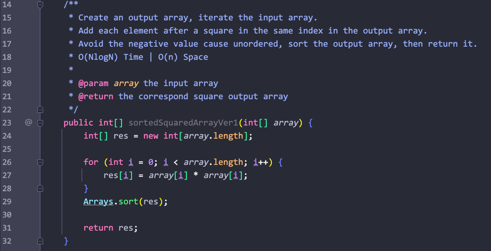

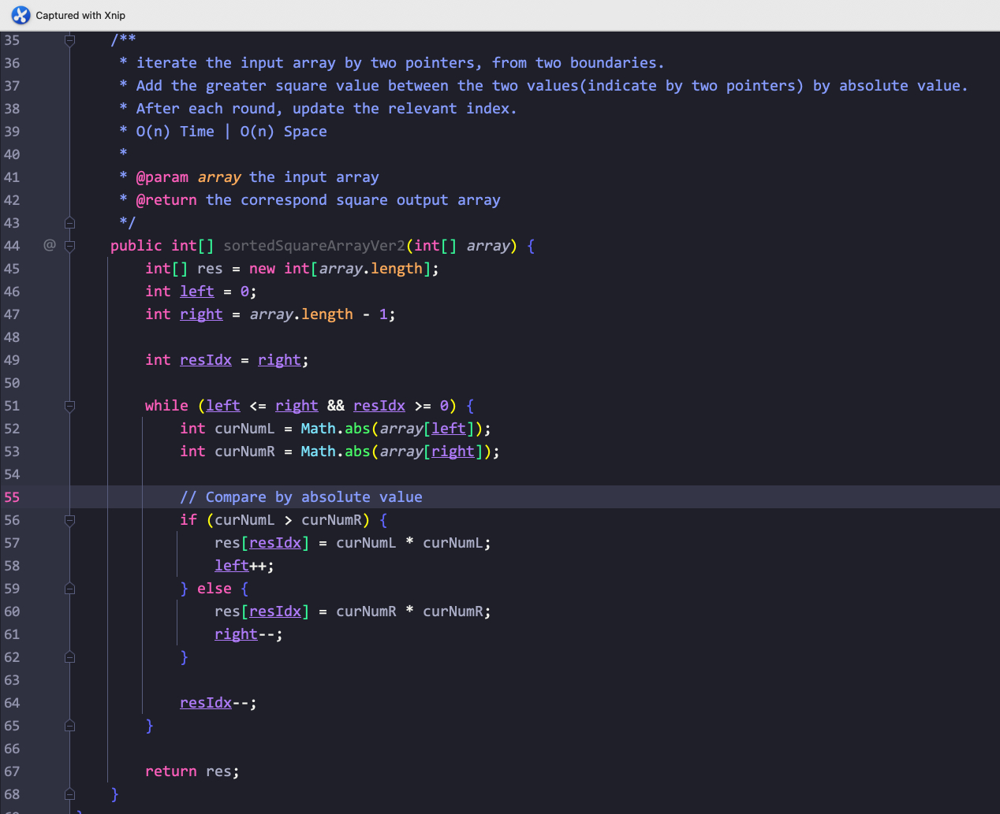

题意:

给你一个有序数组，请你将所有的元素全部平方后，返回一个有序的数组

思路1:

- 看起来很简单，创建一个大小一样的数组，遍历一遍源数组的每个数字，将平方值添加到相同的索引值即可，但这能在源数组全为非负数的情况下才能成立
- 如果源数组中有负数呢，例如：[-4, 1, 3]，本来应该返回为[1, 9, 16]，但按照之前的方法就只会返回[16, 1, 9]，明显不对
- 所以在填充所有的值后，我们还需要对输出数组进行排序才行
- 实现很简单，这里就不写了

复杂度1:

Time:

- 我们将源数组遍历了一次，所以花费了 n 次(n为源数组的长度)，之后又进行了排序，花费了nlogn的时间
- 按照大O的计算规则，这种写法的时间复杂度为nlogn

Space:

- 因为要返回和源数组一样长度的数组，所以我们消耗的空间为n，空间复杂度为O(n)

思路2:

- 能不能将时间优化为O(n)呢？也就是不需要排序
- 这里我们可以换一种方式对源数组进行遍历，即从两边开始
- 不管源数组是否有负数，有一点很明确:
- 第一个或者最后一个数字的平方一定是最大的
- 然而平方后最大的数字，其本来的绝对值也一定是最大的
- 所以我们只需要从边缘开始，比较两边的绝对值以获取最大值，将其添加即可
- 这样子我们就将时间复杂度优化到了O(n)

实现2:

- 和思路1一样创建一个长度和源数组相同的数组用于输出
- 创建三个变量，其中两个指向源数组的两头，剩下一个作为输出数组的索引
- 创立一个循环，将循环条件设置为两边界索引保持大小关系一致，和输出数组索引在范围内
- 在循环中，比较当前两端元素的绝对值，将较大的添加到结果数组中，并更新相关的索引
- 最后返回输出数组即可

复杂度2:

Time:

- 我们只通过两个指针将数组遍历了一次，所以时间复杂度为O(n)

Space:

- 同思路1一样，我们创建了长度为n的输出数组，空间复杂度为O(n)

****

# Day107

## Tag: Array, HashMap

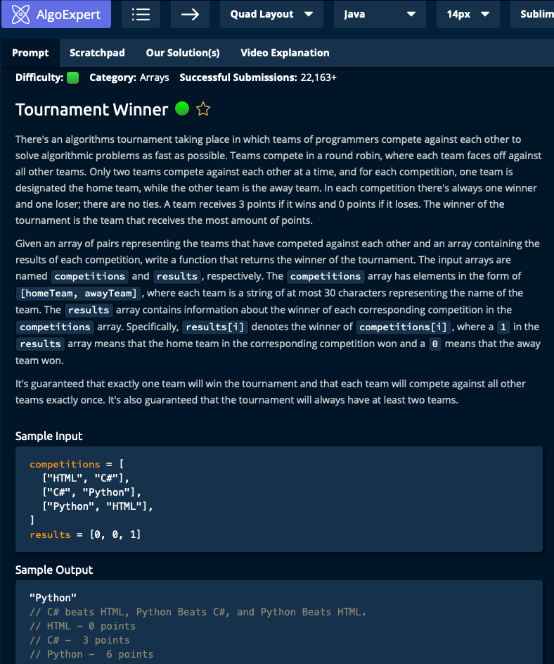

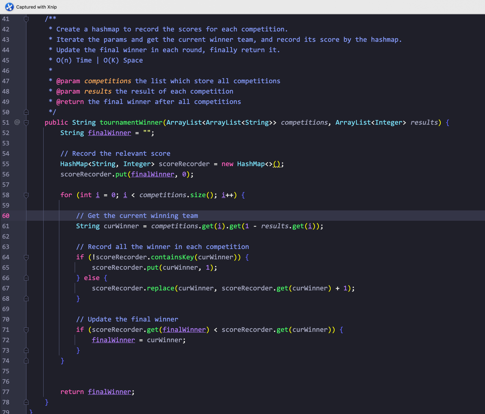

题意:

给你一个二维集合，其中每一行的数组都是一局1v1的比赛，其中第一个元素是主场队伍(homeTeam)，第二个是客场队伍(awayTeam)，再给你一个等长度的集合，其中每个数字都对应二维集合中相同索引位置处的比赛的结果(1为主场赢，0为客场赢)，请你根据这两个参数，返回比赛最终的结果

例子:

二维集合:

{[C++, Java]},

{[Python, C++]},

{[HTML, Python]}

结果集合: {1, 1, 0}

预期结果应该为: "Python"

思路:

- 由于会出现有赢有输的队伍，所以我们可以将二维集合遍历一次，每次都记录获胜队伍的分数/获胜次数，返回分数最高/获胜最多的即可

实现:

- 首先我们需要将队伍和分数关联起来，所以在java里可以用到HashMap映射
- 我们通过遍历参数获取到每局比赛的胜者，如果映射中不存在，则其添加到映射中，并记1分(3分，4分都行，只要保证每次相加的分数相同即可)，存在则增加分数
- 每次修改后都更新分值最高的队伍
- 遍历完成后返回最高分队伍即可

复杂度:

时间

- 我们将该参数遍历了n次，n为该参数集合的长度，所以时间复杂度为O(n)

空间

- 我们创建了一个HashMap来记录获胜的队伍，其长度取决于获胜的队伍数量k，空间复杂度为O(k)

****

# Day108

## Tag: Array

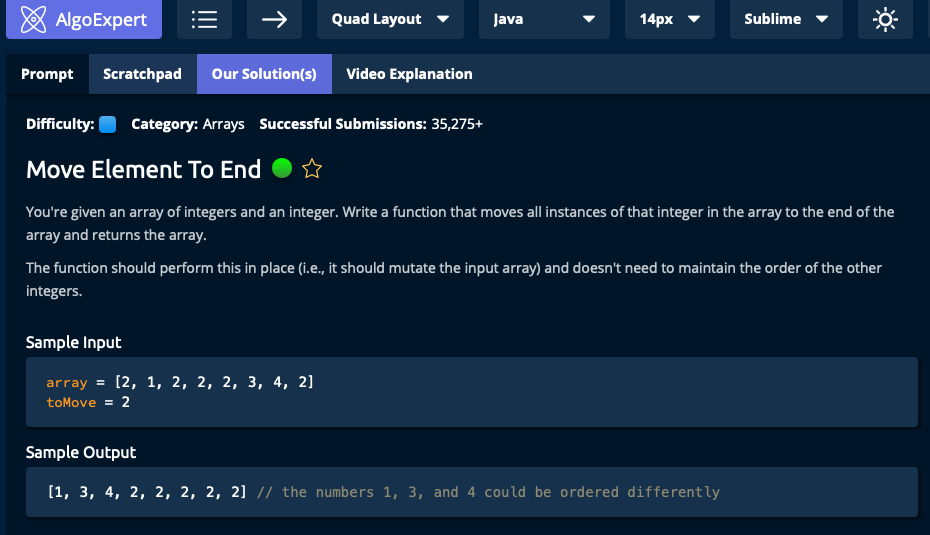

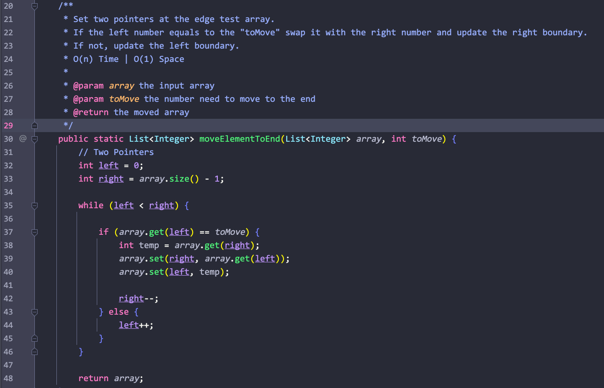

题意:

给你一个数组和一个目标值，请你将数组中所有的目标值都移动到数组的后面

思路:

- 这里很明显就可以用到双指针了，由于是移动到后面，所以我们每次只需要判断左指针的值是否为目标值即可
- 是的话就放到后面，然后更新右指针(此时可以保证该位置为目标值了)
- 不是就更新左指针
- 同理我们也可以通过判断右指针将所有的目标值移动到前边

实现:

- 很简单，就不细说了

复杂度:

时间:

- 我们通过双指针将数组遍历了一遍，所以花费的时间取决于数组的长度n，时间复杂度就为O(n)

空间:

- 创建的变量个数是常数级的，没有与n产生关联，所以空间复杂度为O(1)

****

# Day109

## Tag: Array, Sort

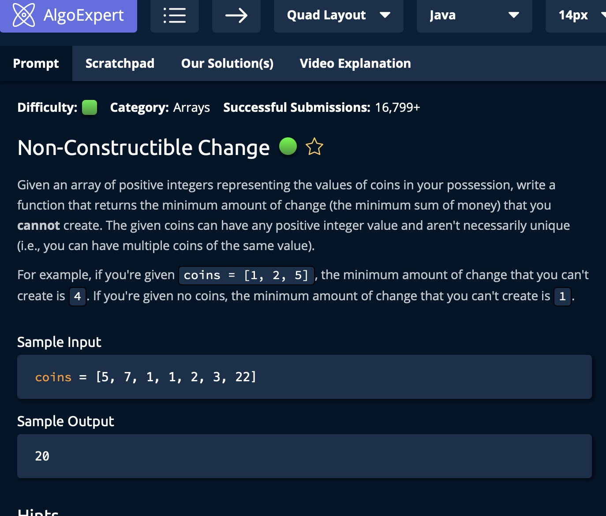

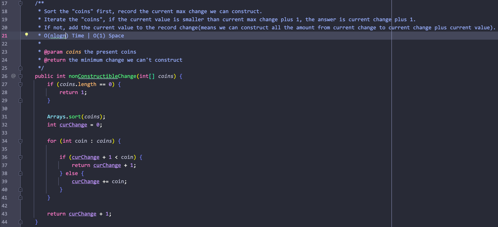

题意:

// 为了便于理解，我这里将题目改编一下

给你一个钱包，里面有很多个硬币，它们的面额可能相同也可能不相同，请你查出通过这个钱包不能凑出的最小金额

例:

钱包: [5, 7, 1, 1, 2, 3, 22]

结果: 20

思路:

- 按照常规的思路，我们会从最小值开始，所以我们可以先对该数组进行排序
- 首先确定基本思路:
- 逐次累加每个元素，如果从当前的和到加上当前的硬币之和这个范围内都可以凑出，我们就累加，不能则返回
- 这里有一个规律: 如果当前的和值+1小于当前的硬币面额，则无法凑出面额为和值+1的零钱，直接返回当前和值+1
- 否则就将当前的硬币累加到当前的和值中

实现:

- 首先进行排序，之后创建一个变量用于记录当前的累加值
- 遍历排序后的coins，如果累加值小于当前的硬币面额，则返回累加值+1，否则就继续累加

复杂度:

时间:

- 我们首先对coins进行了排序，花费为nlogn，n为coins的长度
- 之后又对coins进行了一次遍历，花费为n
- 所以时间复杂度为O(nlogn)

空间:

- 我们创建的变量为常量级，与coins的长度无关，所以空间复杂为O(1)

面试:

- 这道题在面试中需要注意的是：是否允许修改原数组
- 如果允许则可以这样做，如果面试官说不能的话，我们就需要创建一个新的数组来存储原数组，并对这个临时数组进行排序，空间复杂度上升为O(n)

****

# Day110

## Tag: Array

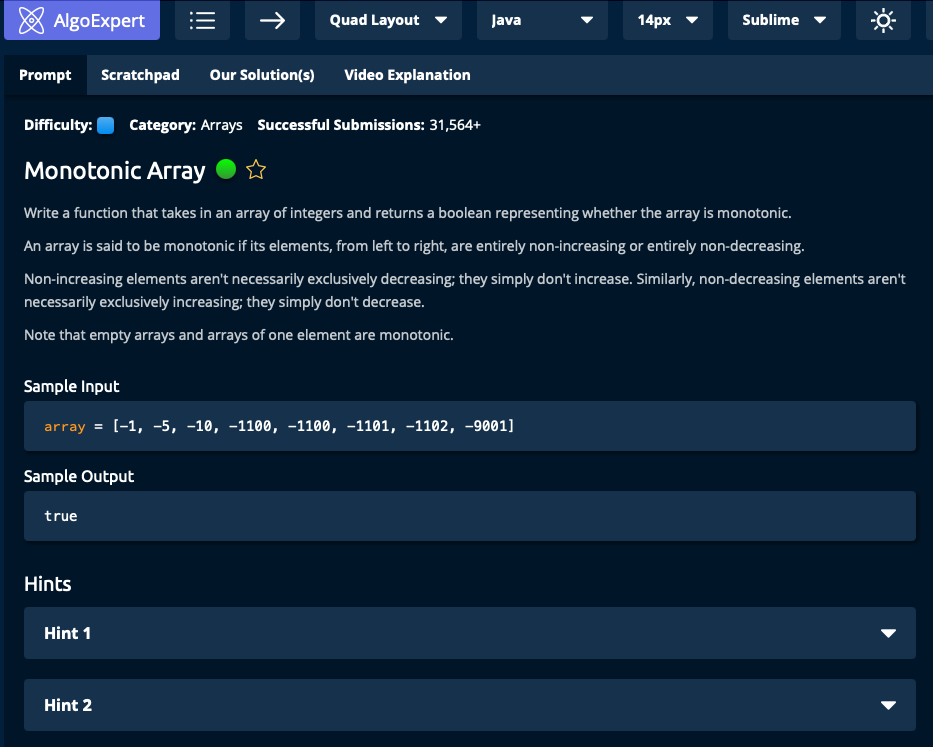

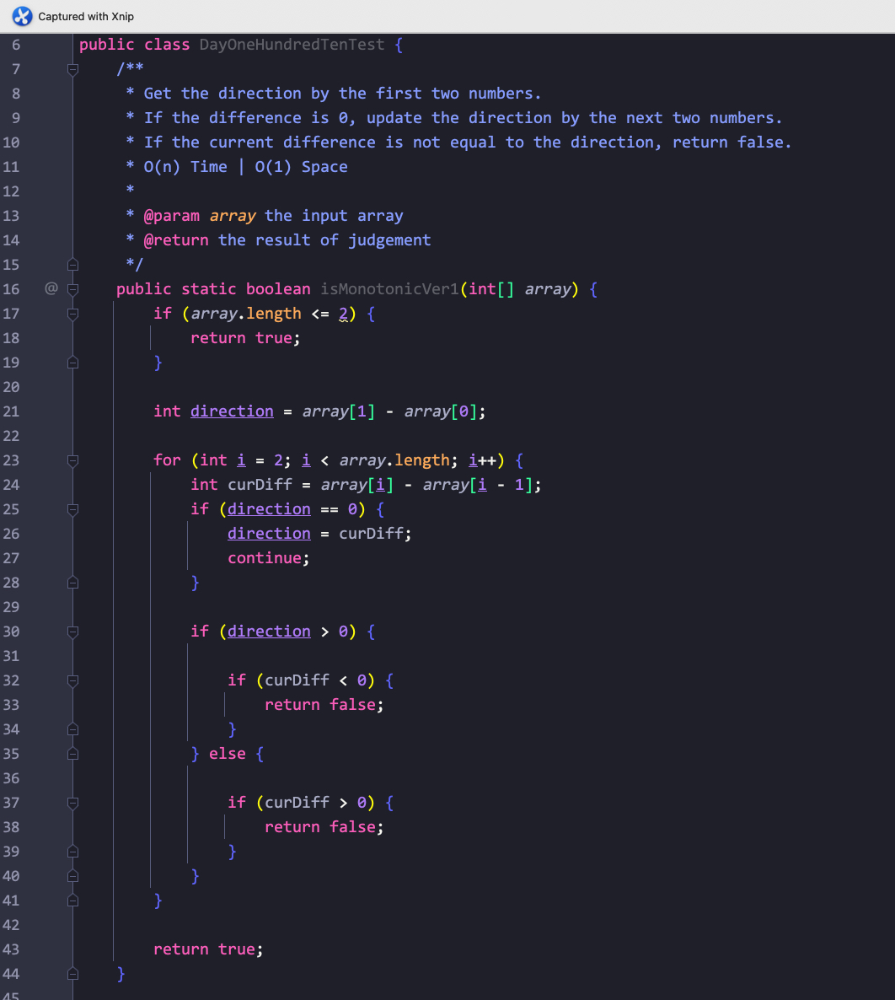

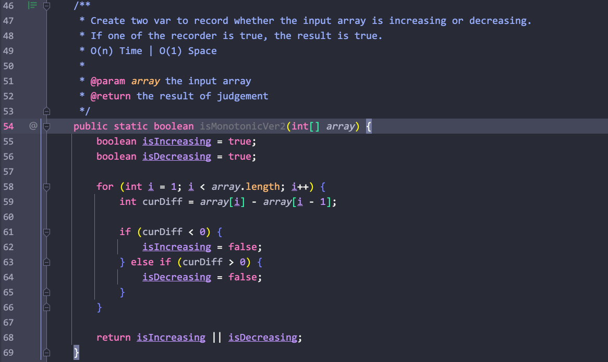

题意:

给你一个数组，请你判断该数组内的数字是否单调递增或递减

思路1:

- 取前两个数的差值作为方向，如果差值为0，那就再继续取后两个数的差值
- 如果方向不为0，对该数组进行遍历，如果在某个位置上，数值差值的正负与方向不符合，则返回false
- 遍历一次后如果一直相同，则放回true

实现1:

- 取索引位置为1减去索引位置为0的数之间的差值，作为方向
- 从索引位置为2开始遍历数组，如果方向值为0，则取当前位置的差值更新方向值
- 如果方向值不为零，则判断当前的差值正负是否与方向值的正负符合，不符合则返回false
- 遍历一次后如果没有返回false，则返回true

思路2:

- 单调无非就是单调递增或者递减，那么我们只需要判断它是否包含其中一个就行了
- 使用两个值记录是否单增和单减
- 对数组进行遍历，如果当前的差值为负，则将记录单增的值更改为false，为正就将单减的值更新为false
- 最后判断这两个值是否都为false，只要有一个为true，那么结果就为true

实现2:

- 创建两个boolean变量用来记录数组是否为单增和单减，并初始化为true
- 遍历数组，根据当前的差值更新对应的boolean变量
- 最后返回两boolean变量的或运算结果

复杂度:

- 两种做法都对数组遍历了一次，所以时间复杂度为O(n)
- 两种做法都只创建了常量个数级的变量，所以空间复杂度为O(1)

