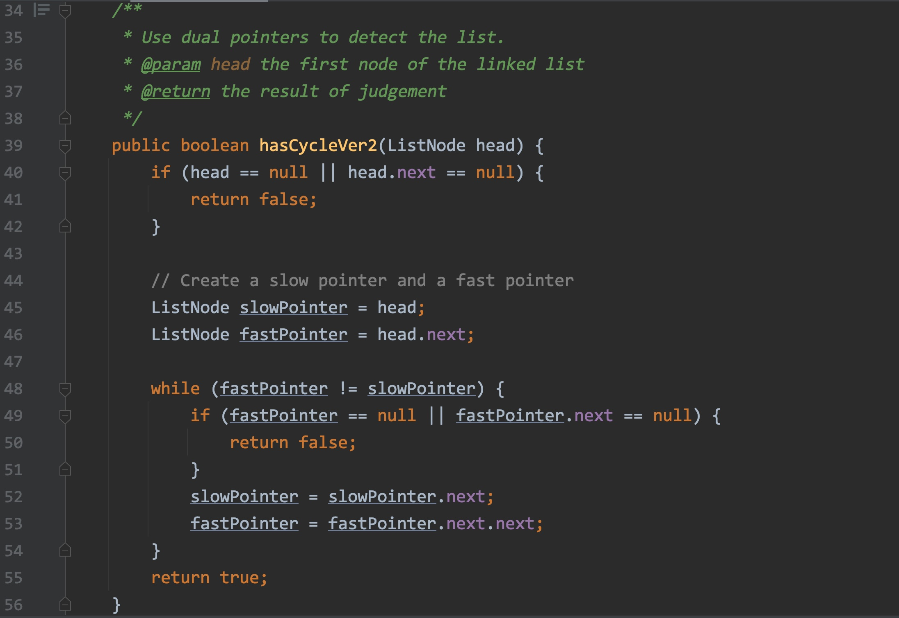
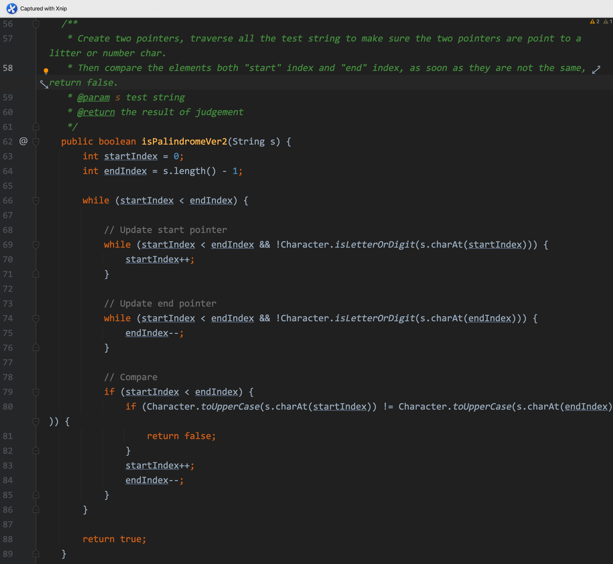
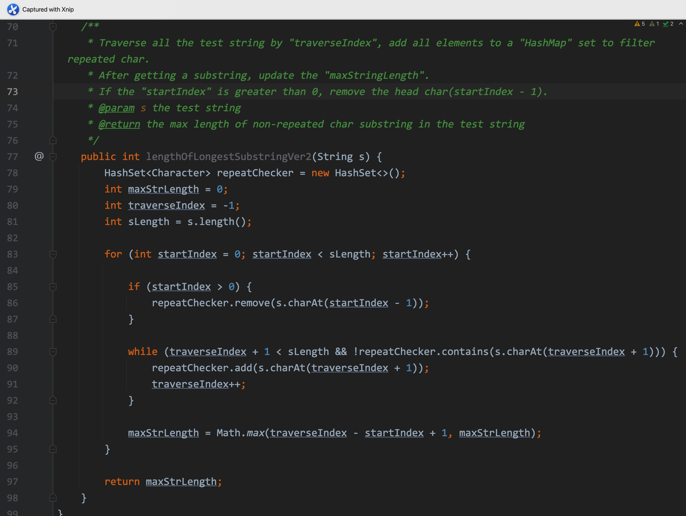

# Day31

****

# Day32

- A quick method to find to min/max/sum of an array: invoke the "stream" method in the "Arrays" class.

Arrays:

| `static IntStream` | `stream(int[] array)` | Returns a sequential [`IntStream`] with the specified array as its source. |
| :----------------- | --------------------- | ------------------------------------------------------------ |
|                    |                       |                                                              |

IntSteam:

| `OptionalInt` | `max()` | Returns an `OptionalInt` describing the maximum element of this stream, or an empty optional if this stream is empty. |
| :------------ | ------- | ------------------------------------------------------------ |
| `OptionalInt` | `min()` | Returns an `OptionalInt` describing the minimum element of this stream, or an empty optional if this stream is empty. |

|                        |                       |                                             |
| :--------------------- | --------------------- | ------------------------------------------- |
| `int`                  | `sum()`               | Returns the sum of elements in this stream. |
| `IntSummaryStatistics` | `summaryStatistics()` |                                             |

****

# Day33

My Method:

Other Method:

Awesome Idea:

****

# Day34

Draw:

****

# Day35

****

# Day36

****

# Day37

****

# Day38

****

# Day39

****

# Day40

## Stack Ver1

## Stack Ver2

****

# Day41

# Day42

Github:https://github.com/13RTK/Alex-Demo/tree/master

****

# Day43

## First

## Second

****

# Day44

****

# Day45

## First

## Second

****

# Day46

****

# Day47

****

# Day48

****

# Day49

## First

## Second

****

# Day50

## CRUD For Linked List

****

# Day51

## Static Linked List

****

# Day52

****

# Day53

****

# Day54

## First

## Second

## Bad:

****

# Day55

Stack

****

# Day56

Queue

Simulate A Stack

****

# Day57

****

# Day58

****

# Day59

My Idea:

Other Idea:

****

