# Day61

## Tag: Array, Dimensional-array

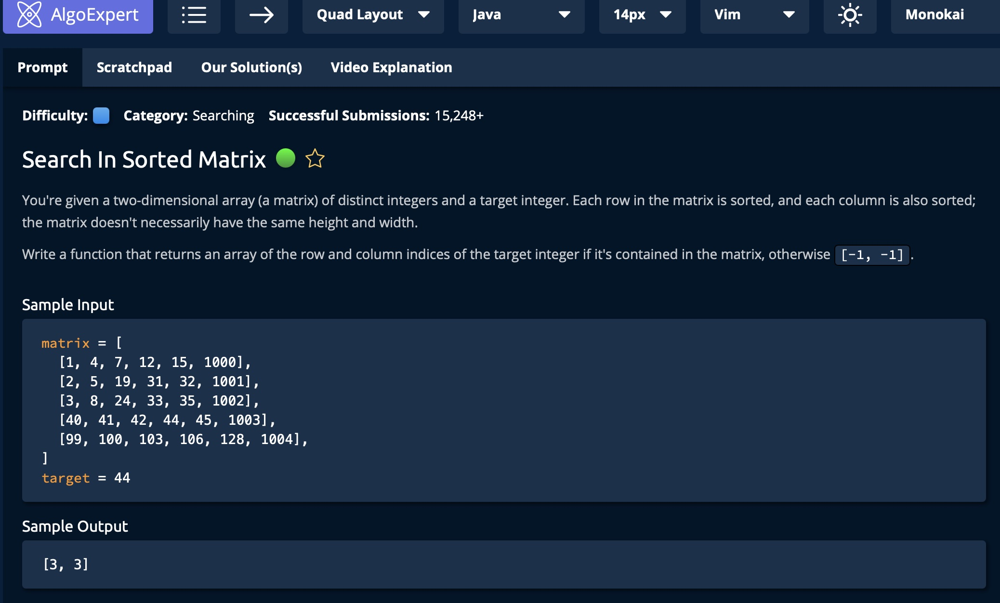

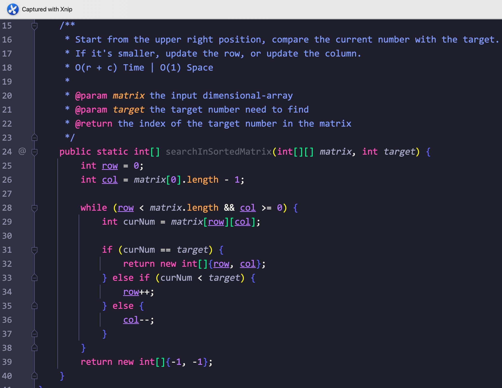

题意:

给你一个二维数组，其每列每行都是排序好的，再给你一个目标值，请你在这个二维数组中找到该目标值，并返回其对应的索引

思路:

- 观察二维数组可得知: 该二维数组从左上到右下，数值依次增大，但如果从左上角开始找的话，同时更新行和列可能会跳过我们的目标
- 所以，为了能单独控制大小，我们需要从右上角开始
- 因为每一个列也是排序过的，所以如果该列的第一个数就大于目标值，则说明该列所有值都大于目标值，所以更新该列
- 如果当前位置值小于目标值，那么在垂直位置上，目标值应该在下方，所以更新行

实现(Java):

- 从右上角开始，初始化对应的行列索引
- 进入循环，条件为索引不越界
- 判断当前值与目标值的大小，相等则直接返回索引
- 小于则更新行值，大于则更新列值

复杂度:

- 最坏的情况下，我们会遍历行和列中所有的数字，所以共消耗r+c，时间复杂度为O(r+c)
- 我们创建的变量为常量级，所以空间复杂度为O(1)

****

# Day62

## Tag: Array, Binary search

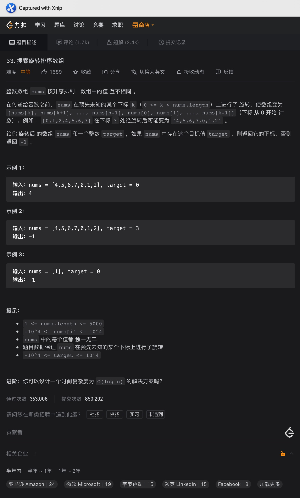

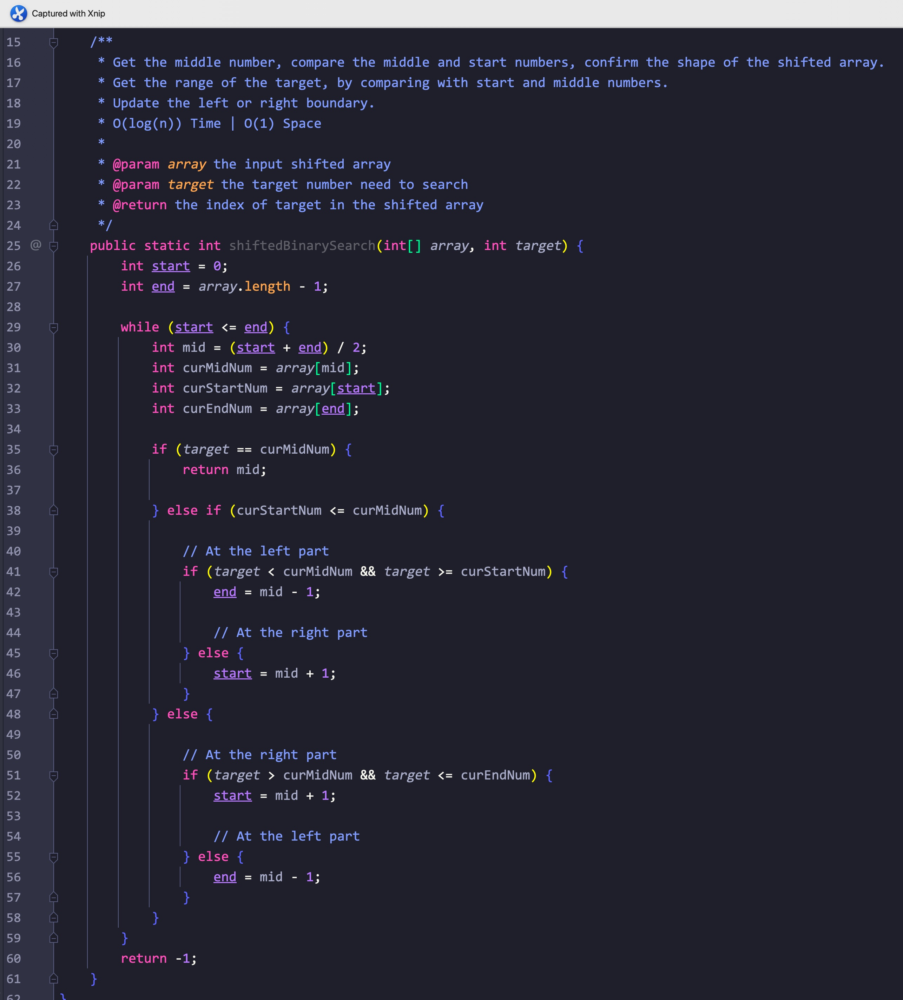

题意:

给你一个旋转过的数组，和一个目标值请你使用二分查找找出其在该数组中对应的索引

思路:

- 虽然该数组在旋转后就不是严格的排序数组了，但从旋转的位置开始，其左右两个部分都是有序的，同样能够使用二分查找
- 所以我们只需要判断该目标数在左边还是右边即可

实现(Java):

- 我们同样对该数组取中位数，比较中位数与边界值，判断中位数所处的位置
- 将目标值与中位数和边界值比较，确定目标值所处的区间，更新边界值到对应的区间中

复杂度:

- 我们通过二分查找的方式找到了目标值，所以时间复杂度为O(log(n))
- 我们创建的变量个数为常量级，所以空间复杂度为O(1)

****

# Day63

## Tag: Binary Search, Array

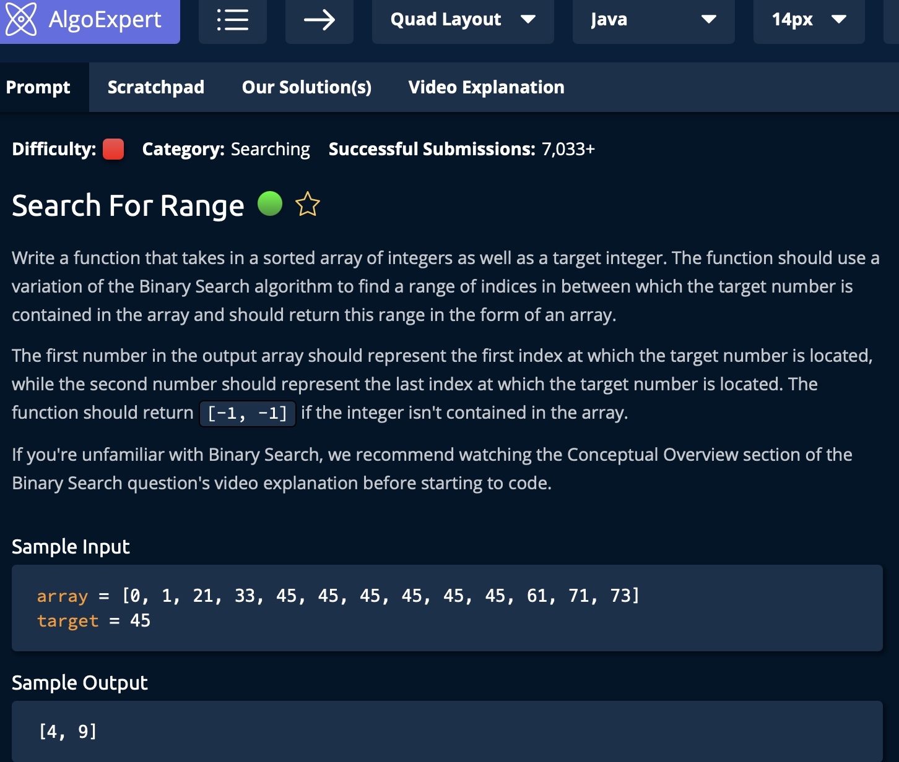

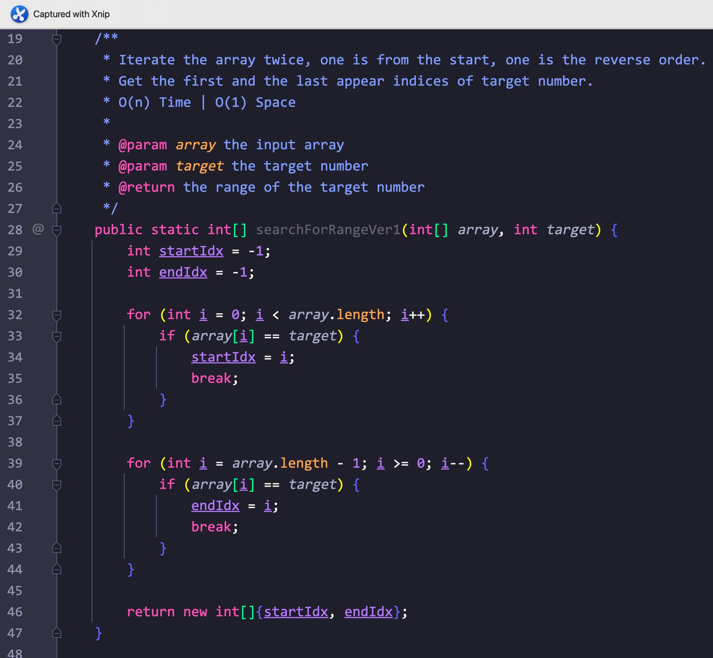

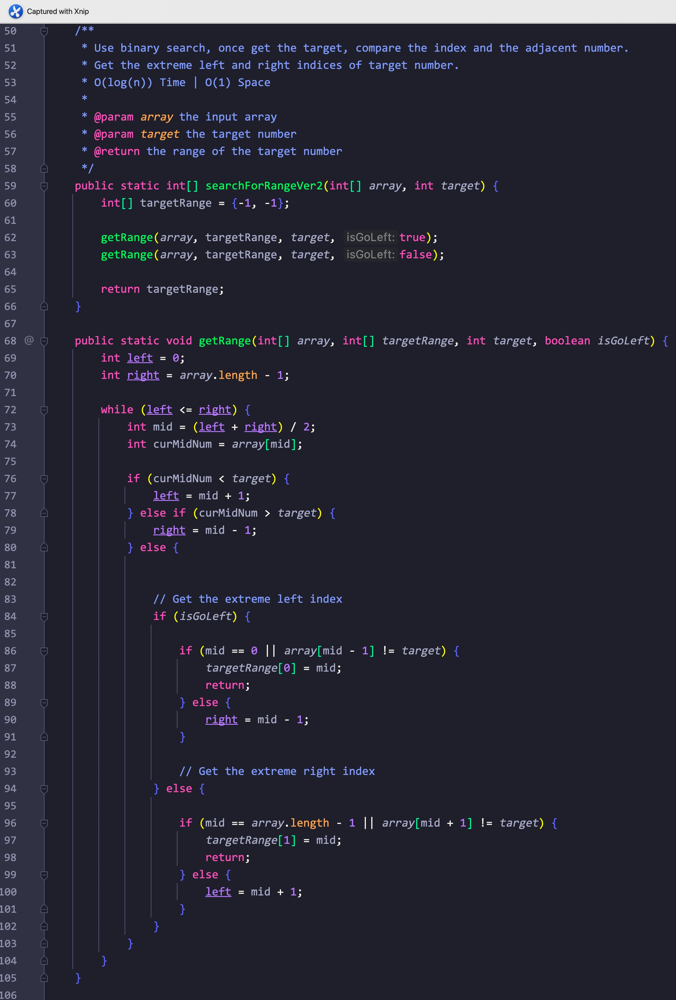

题意:

给你一个排序后的数组，其中有重复的数字，再给你一个目标值，请你找出该目标值在数组中出现范围的起始和结束索引

思路:

- 所谓的起始和结束位置其实就是第一次出现和最后一次出现罢了，所以我们只需要从0开始正向遍历就能找到开始位置的索引
- 从末尾位置开始反向遍历就能找到结束位置的索引，两个循环就能搞定，时间复杂度为O(n)，空间复杂度为O(1)
- 但既然是排序后的数组，能不能用二分法呢？当然可以
- 在这道题目中，比起传统二分法不同的自然是目标数字不止出现一次，所以通过二分法找到目标数组后，我们还需要判断其是否在最左/右的位置上，如果不在，则仍旧需要更新边界

实现(Java):

- 创建一个方法，其接受原方法的参数外，还接受一个boolean类型来判断当前调用是寻找左还是右边界
- 进入传统的二分法步骤，判断中间索引值是否等于目标值
- 如果等于，则进行附加判断:
- 首先判断boolean类型，获取此次调用的目的
- 如果是获取左边界，则判断当前中位数索引是否等于0，或者中位索引前一个位置的数是否为目标值
- 如果当前中位索引为0，或者前一位不为目标值，则说明当前中位索引为左边界，将其记录
- 如果是获取右边界，则仅修改判断为中位索引是否为最后一个索引值(array.length - 1)，其余与左边界相同
- 通过两种boolean值，我们就获取了左右边界索引

复杂度:

- 我们在搜寻时使用了二分法，所以时间复杂度优化到了O(log(n))
- 我们创建的变量个数为常量级，所以空间复杂度为O(1)

****

# Day64

## Tag: 

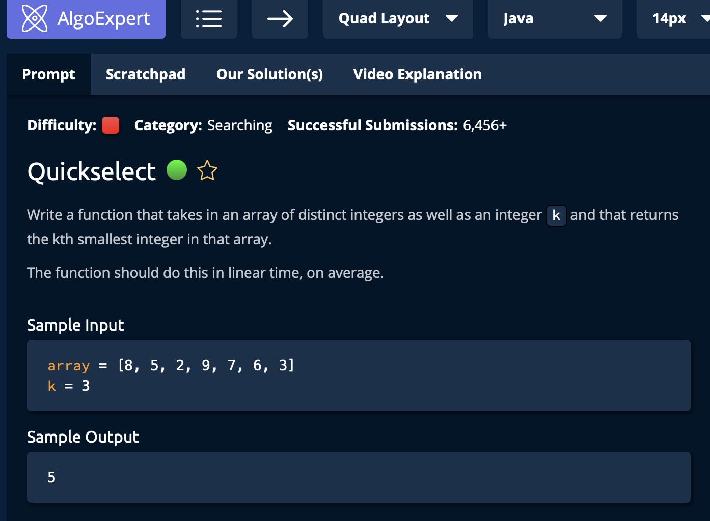

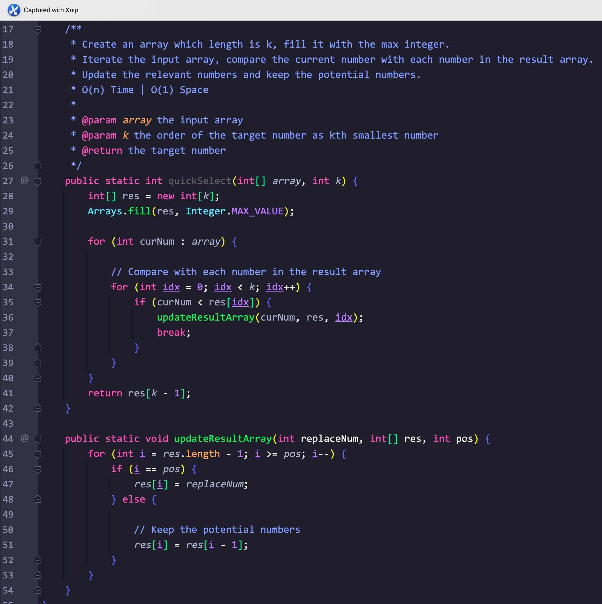

题意:

给你一个没有重复数字的随机数组，再给你一个数字k，请你找出该数组中第k个最小的元素

思路:

- 首先最容易想到的肯定是先排序，之后直接返回对应索引的值即可，但时间复杂度为O(nlog(n))
- 能不能优化至O(n)? 其实这个问题同Algorithm Day60的解决思路是一样一样的，只不过那道题目的k是个常数(3)，且求的是最大值罢了
- 在那道题目中，我们创建一个长度为3的数组，通过动态更新它来获取了最大的三个数
- 在这道题目里，我们只需要将3换做k，将正序更新换成逆序更新即可，其余不变

****

# Day65

## Tag: Array, Binary Search

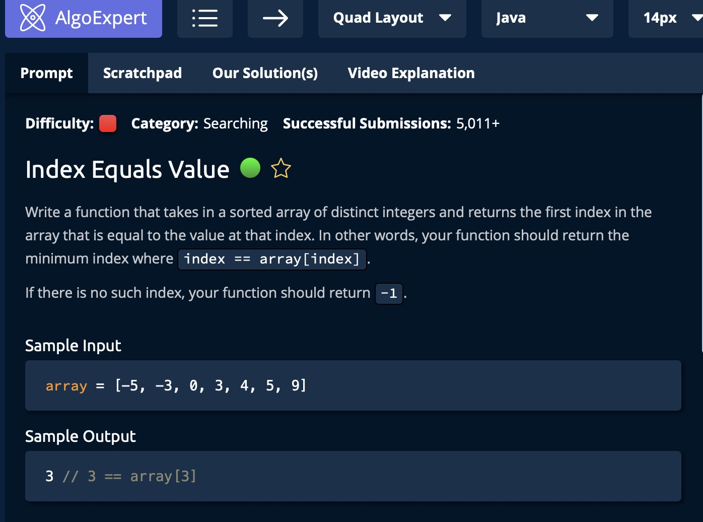

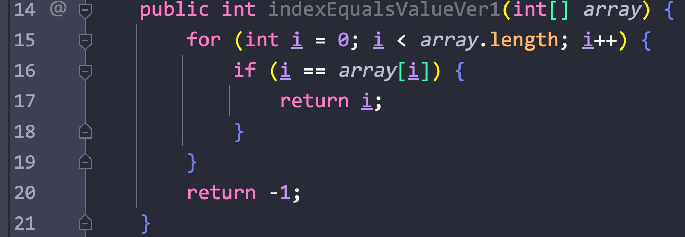

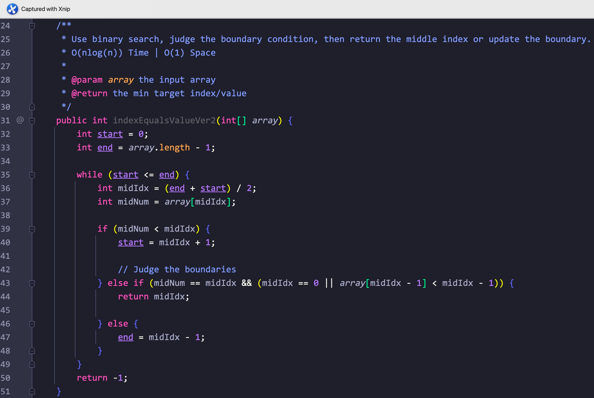

题意:

给你个排序后无重复数字的数组，请你查出其中最小的索引值，其对应位置的元素值与索引值相同

思路:

- 最简单的方法肯定是直接遍历一遍，比较每个值和其索引值即可，这样做的时间复杂度为O(n)，但我们其实能用二分法
- 比起简单的用二分法寻找目标数，这里我们还需要在找到后判断其是否最小，转换一下即判断它是否在最左边或者其前一个位置是否小于索引
- 处于最左边很好理解，因为其如果在最左边，则其毫无疑问是最小的，但后一个条件呢？
- 因为这个数组是排序后的，所以如果在我们找到的索引位置的后一个位置上，该索引大于其对应的值，那么之后的值也会是这种关系
- 这样一来，我们找到的数就是最小的符合条件的值了

实现(Java):

- 创建两个指针，获取中间索引位置
- 判断中间索引和其对应值的大小关系
- 如果不等则更新对应的边界
- 如果相等则判断其是否在最左边或者其前一个位置的索引和对应值的大小关系，满足则返回索引

复杂度:

- 我们使用了二分法，所以时间复杂度比起最简单的方法优化至了O(log(n))
- 我们使用的变量个数为常量级，所以空间复杂度为O(1)

****

# Day66

## Tag: Bubble Sort

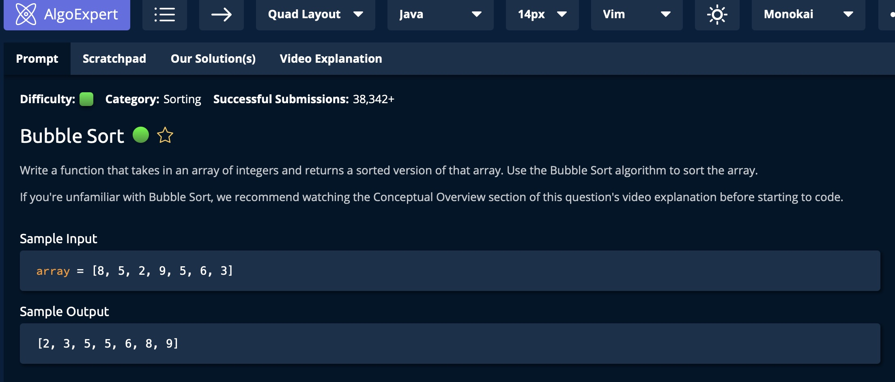

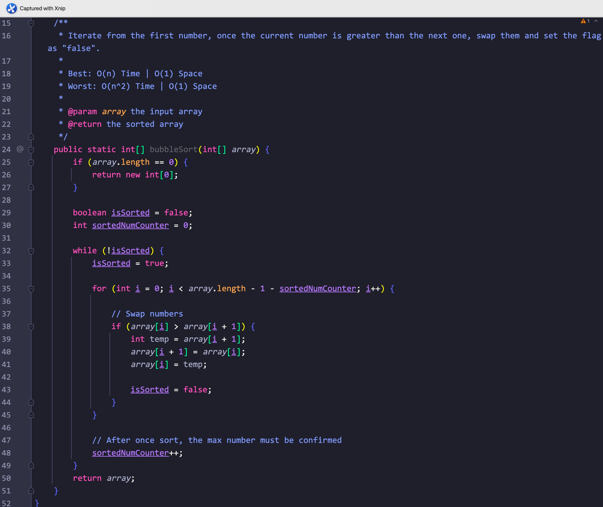

题意:

给你一个数组，请你使用冒泡排序的方式将该数组排序

思路:

- 调用API肯定是最简单的，但这里要求用冒泡，那就老老实实写个呗
- 冒泡其实就是让每个数都和临近的数相比，不符合排序的顺序则交换两个数的位置

实现(Java):

- 设置一个计数器，其计算排序操作的次数，因为每次排序后最大的数会被排在最后，以便之后的排序跳过最后排序过的数字
- 设置一个boolean变量，其作为是否继续排序的依据
- 进入循环，初始化boolean变量为true，判断当前数字和下一个数字的大小关系，如果不同则交换，并将boolean变量设置为false
- 只要boolean变量不为true，则继续循环

复杂度:

- 最坏时我们需要将该数组遍历近n^2，所以时间复杂度为O(n^2)
- 我们创建的变量个数为常量级，所以空间复杂度为O(1)

****

# Day67

## Tag: Insertion Sort

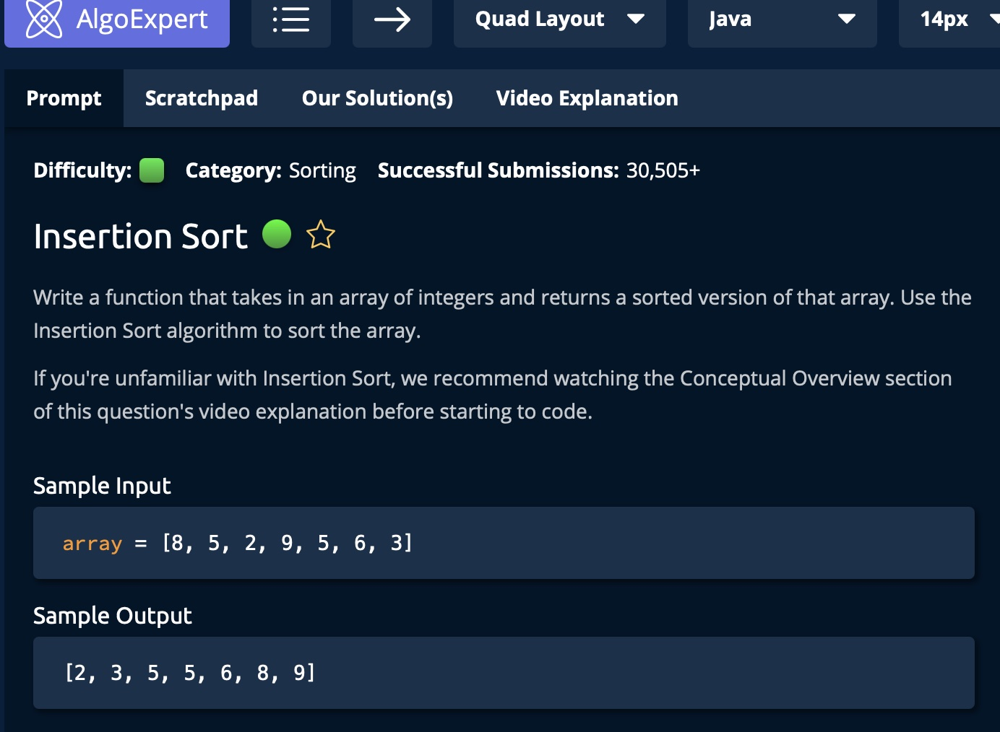

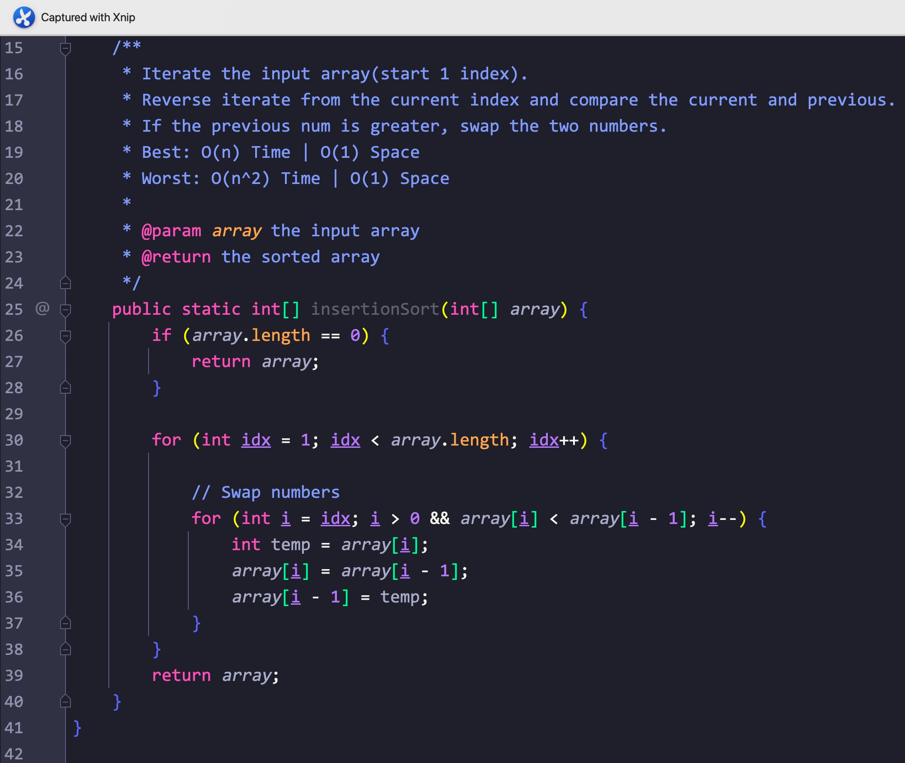

题意:

给你一个数组，请你使用插入排序的方法将其排序

思路:

- 同冒泡排序不同的是，插入排序需要从后往前比较，之后再交换，比较时是当前数与前一个数进行比较

复杂度:

- 在遍历该数组时，我们还会将数组从当前位置往前遍历，最坏需要n^2，所以时间复杂度为O(n^2)
- 我们创建的变量个数为常量级，所以空间复杂度为O(1)

****

# Day68

## Tag: Selection Sort,  Array

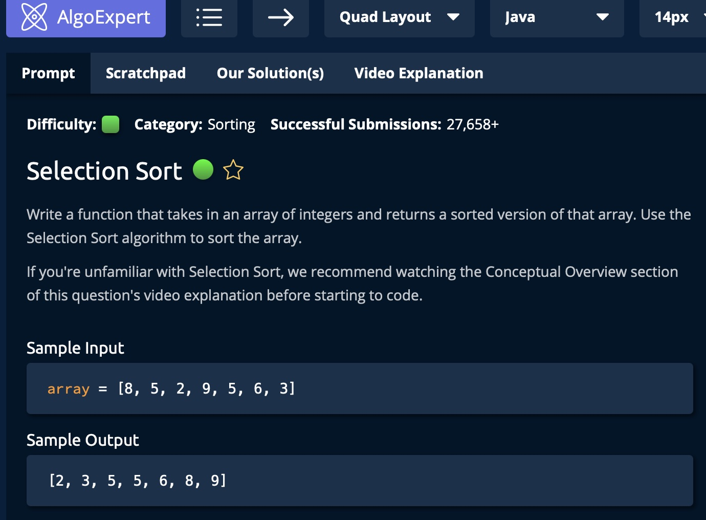

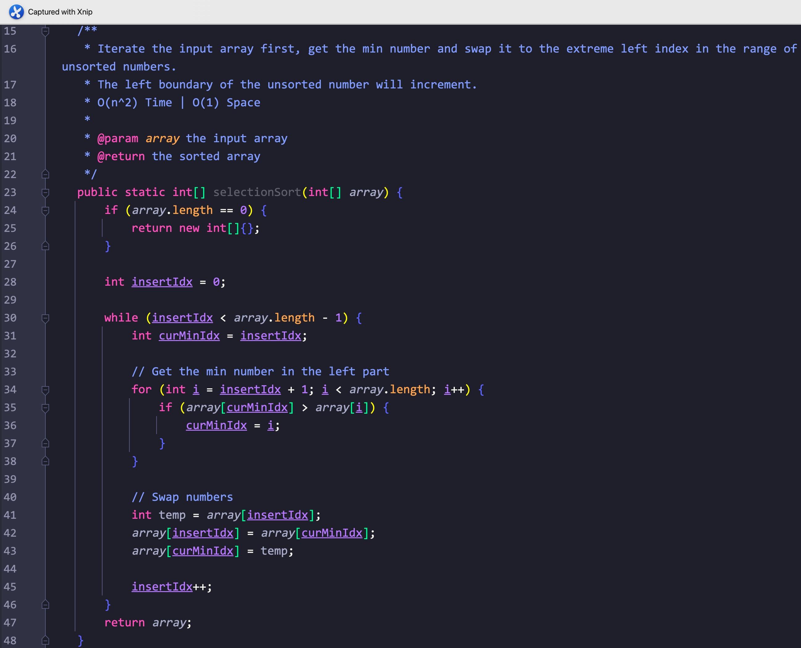

题意:

给你一个数组，请你用选择排序的方法对其进行排序

思路:

- 选择排序即每次都将数组中的最小值交换到最前面来，所以我们需要对数组遍历多次，以寻找最小值，并与左边界值交换

实现(Java):

- 创建一个var用来记录左边界值，进入循环，条件为该var小于最后一个索引
- 创建一个var从左边界值开始，首先遍历一遍数组获取最小值的索引并记录在该var中
- 交换该索引对应数与左边界对应的数，更新左边界

复杂度:

- 我们将数组遍历了n^2次，所以时间复杂度为O(n^2)
- 我们创建的变量个数为常量级，所以空间复杂度为O(1)

****

# Day69

## Tag: Array, Sort

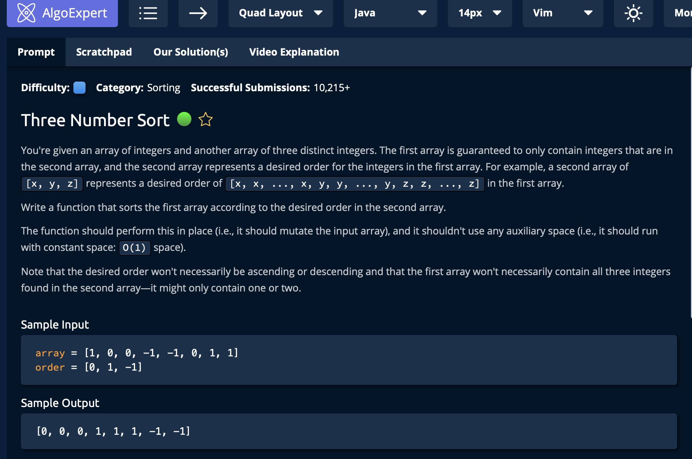

题意:

给你一个有重复数字的数组，共有3种数字，再给你一个排序数组，请你按照排序数组中的顺序，将重复数组中的数字进行排序

思路:

- 因为只有三个数字，所以我们一旦排好其中的两个，那么数组自然就排列好了
- 所以我们需要在三个数字中选两个进行排列，中间那个自然不会选，因为其索引位置不好确定
- 自然，我们先排列排序数组中的第一个数字，再排列最后一个即可

实现(Java):

- 创建两个var作为第一和最后一个数字的插入索引
- 正向遍历一遍数组，将第一个数字移动到第一个数字的插入索引处，同时更新索引
- 此时该数组前半部分已经是排列好的第一个数字了，接下来我们只需要在后面找即可
- 逆序遍历一遍数组，将最后一个数字移动到最后一个数字的插入索引处，同时更新索引
- 此时数组已经排序完成

复杂度:

- 我们遍历了两次数组，所以时间复杂度为O(n)
- 我们创建的变量个数为常量级，所以空间复杂度为O(1)

****

# Day70

## Tag: Quick Sort

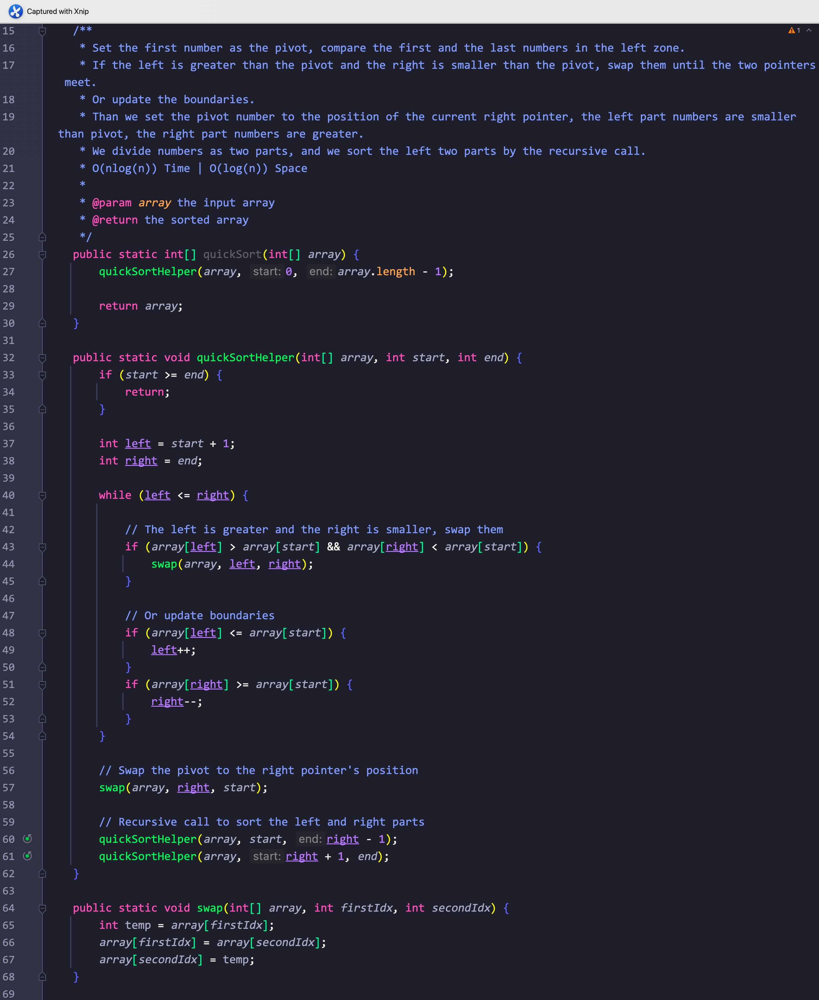

题意:

给你一个数组，请你使用快速排序的方式对该数组进行排序

思路:

- 首先简述快速排序的原理:
- 随机选取一个数字(这里选择第一个数字)，以其为基准，将其余部分的数字进行简单比较
- 利用双指针从开头和结尾位置开始，如果左指针指向的数字大于基准，且右指针指向的数字小于基准，则交换两指针指向的数字
- 如果左指针或者右指针不符合条件，则更新对应的指针，直到两指针交换相对位置(left > right)
- 此时，右指针左边的值都小于基准值，左指针及右边的值都大于基准值，我们将右指针指向的值与基准值交换
- 此时我们的基准值就确定了其在数组中的位置，且将数组分成了两个部分
- 之后我们再次重复上述步骤，对剩余两部分采取相同的方式(递归调用即可)便能对整个数组进行排序

实现(Java):

- 创建一个符合递归调用的方法，传入初始数组的左右边界
- 首先定下基准值，和剩余部分的左右指针(基准值 + 1, length -1)
- 比较左右指针与基准值的大小关系，两者都符合则交换两指针指向的值，不管符不符合都更新对应边界
- 交换基准值和右指针指向的值，再递归调用本方法对剩余两部分进行排序

复杂度:

- 我们选取的基准值可以随机，方法类似二分，但每次比较都需要遍历一次数组，所以时间复杂度平均为O(nlog(n))
- 我们递归调用所需的栈空间也取决于对数组的划分，所以空间复杂度为O(log(n))

****

# Day71

## Tag: Heap Sort, Heap

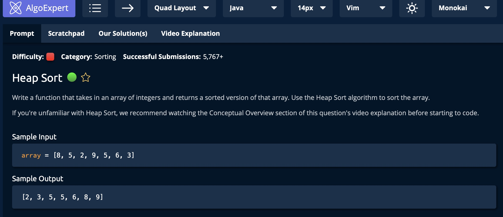

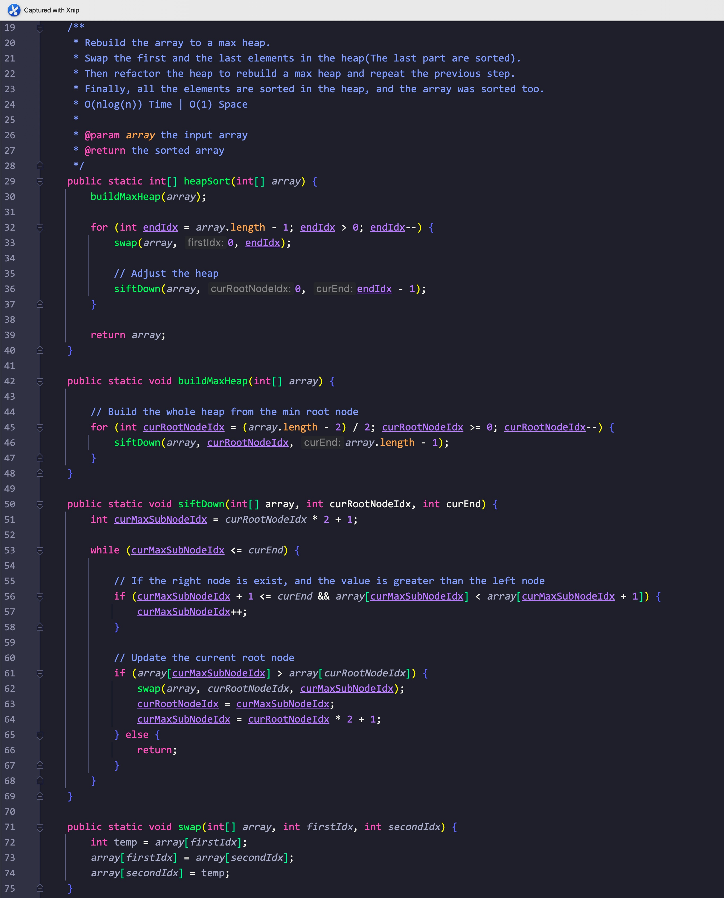

题意:

给你一个数组，请你使用堆排序的方法对其进行排序

思路:

- 进行堆排序之前，我们需要先将该数组构建为堆
- 利用二叉树的性质，我们将数组左半部分的索引位置作为构建后的非叶子结点
- 这里我们构建一个大根堆(即每颗子树的根节点值为最大值)
- 构建后，我们将第一个索引位置的值与最后一个位置的值进行交换，这样我们就将最大的值排在了数组的最后
- 再通过构建的方式重构剩余的元素，使其再次称为大根堆，往复下来，数组后面部分排序的元素就越来越多，堆里的数字越来越少，直到将整个数组排序

实现(java):

- 构建大根堆的过程需要我们从底下最小的子树开始构建，所以我们需要从最小值的子树根节点开始，因此是从数组中间索引的左边位置，开始倒序遍历(这些索引值都对应构建后的根节点)
- 对于每个子树，首先利用二叉树的性质，根节点索引值 * 2 + 1 = 右子树索引值，我们都先找出左右节点中的最大值(如果左右子结点存在的话)，之后将该最大值与当前树的根节点比较，更新最大值到根节点中
- 之后判断被替换节点其下的子树，并更新根节点索引为子树索引
- 完成构建后交换第一个位置与最后一个位置的值，使得最大值排在最后得以排序
- 交换后重复之前的步骤再次重构大根堆，并再次交换
- 最后直到堆中只有一个元素，该数组完成排列

复杂度:

- 我们将该数组构建成大根堆，也就是二叉树的结构，该用时取决于二叉树的结构，根据二叉树的性质，数组被构建成二叉树后有log(n)层，又因为我们交换了n - 1次，所以时间复杂度为O(nlog(n))
- 我们创建的变量个数为常量级，所以空间复杂度为O(1)

****

# Day72

## Tag: Min Heap, Sift Up/Down

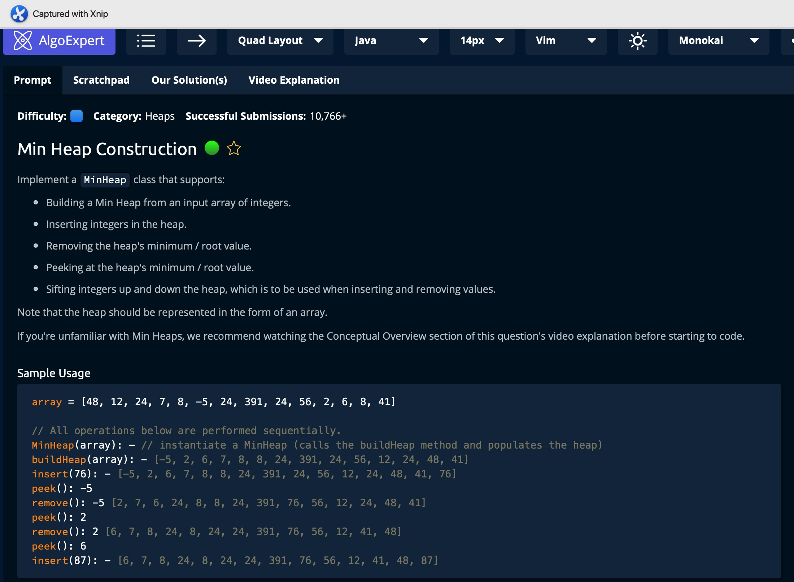

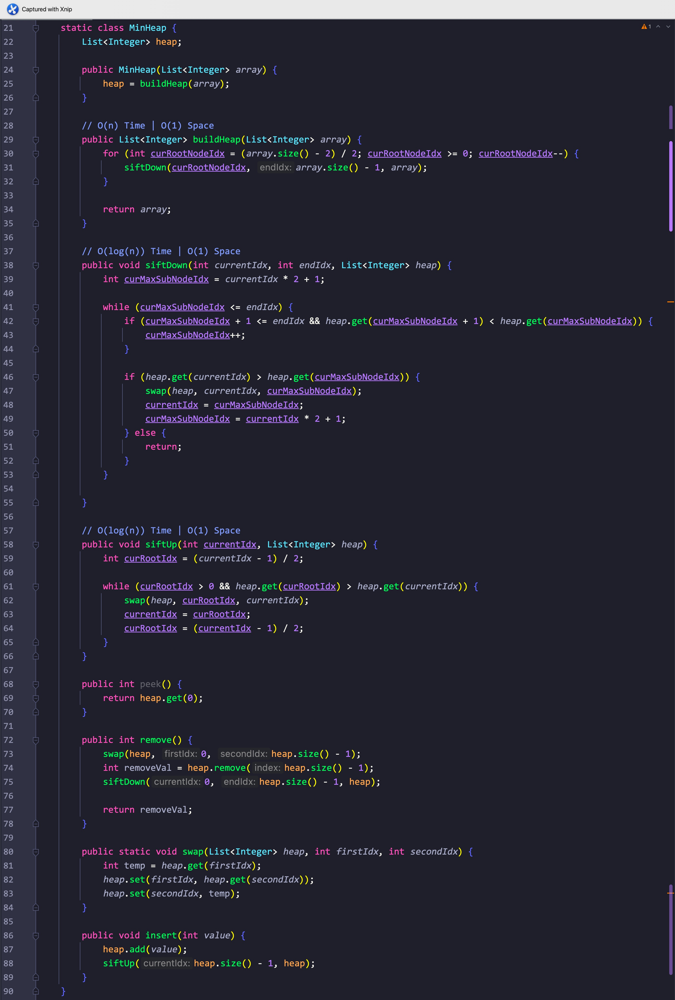

题意:

给你编写一个MinHeap类，实现其中的各种方法

思路:

- 和昨天不同的是，我们这次构建的是小根堆，所以在siftDown中的大小判断要反过来才行，其余一致
- 而siftUp方法则是用同siftDown相反的方式，根据叶子结点的索引值反过来去找其根节点的索引值
- 其余方法则是插入/删除后用siftDown或siftUp方法进行重建即可

****

# Day73

## Tag: Radix Sort, Counting Sort

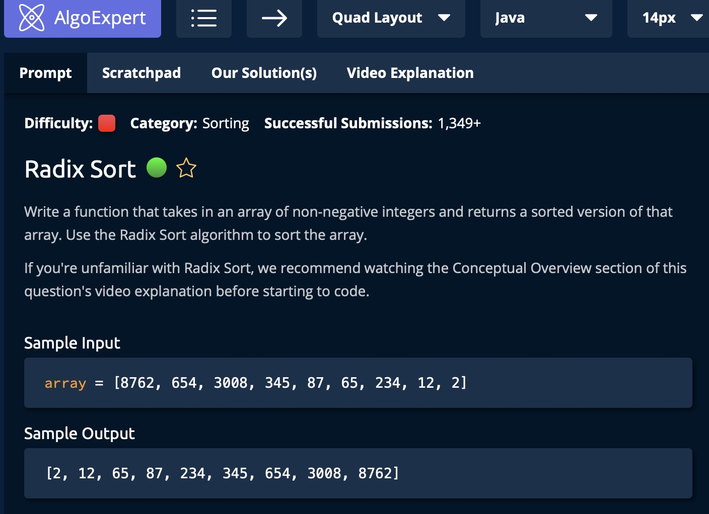

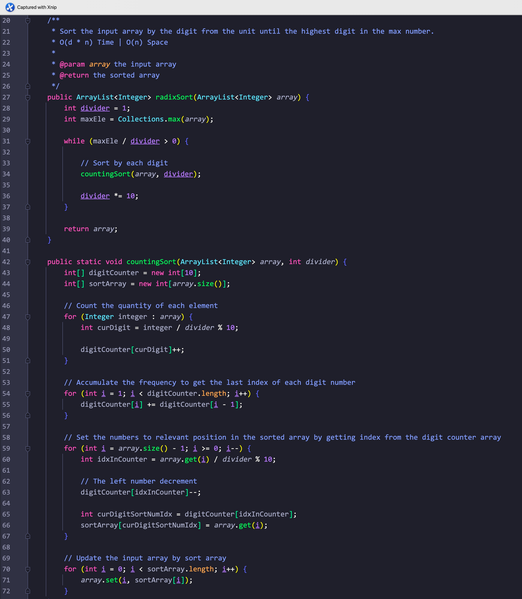

题意:

给你一个数组，请你通过基数排序的方式对其排序

思路:

- 在基数排序之前，我们需要了解一下counting sort(计数排序或统计排序)
- counting sort通过计算数组中所有元素某一位上的数出现的频率，从而获取它们对应的索引位置，从而进行排序，如:
- 数组8762, 654, 3008, 345, 87, 65, 234, 12, 2；使用counting sort对个位数排序的话，首先计算出0～9每个数字出现的频率如:
- 0:0, 1:0, 2:2, 3:0, 4:2, 5:2, 7:1, 8:1, 9:0
- 将对应位置累加，得 0:0, 1:0, 2:2, 3:2, 4:4, 5:6, 7:7, 8:8, 9:8
- 解析一下这个累加后的数组: 2:2说明个位数为2的有两个数字，又因为0，1对应的频率都为0，所以个位数为2的数字被排列在前两个位置，也就是索引为0，1的位置上，而这两个索引刚好对应频率2 - 1，1 - 1
- 所以我们遍历一次原数组，获取对应位数后从该频率数组获取相应的频率，即可获取当前数字排序后的索引值，就能通过某一位数字对所有的数排序

- 上述只演示了个位数，我们还可以依数位排序下去，直到取到最大值的位数后，所有的数就根据大小排序完成了！

实现(Java):

- 根据思路，我们需要先取得待排序数组中的最大值，以确定我们需要统计排序的次数和所取的位数
- 进入循环，调用countingSort，传入当前所取数位和数组
- 在countingSort中，创建一个长度为10的数组，用来记录每个数字的频率，再创建一个与原数组等长的数组用来存储该次排序后的结果
- 遍历一次原数组，通过数组digitCounter记录下当前数位中数字出现的频率
- 再遍历一次digitCounter，累加频率以获取每个数字在排序数组中的最后一个索引位置以便之后获取
- 反向遍历一次原数组，获取每个元素对应数位上的数字，通过它获取digitCounter上对应的索引(之后说明为什么反向遍历)
- 减去digitCounter上对应的数字，意为用掉了一个数，此时更新后的数就是对应的索引，将原数组当前的数放到sortedArr中对应索引位置处
- 完成后将sortedArr中的数复写到原数组中
- 循环调用的次数取决于最大值的位数

- 之所以在countingSort中排序原数组时不正序遍历，是因为一旦出现高位相同但低位不同的数时，这两个数无法被正确排序如:
- 原数组: 67, 68。首先对个位进行排序，结果自然是67，68，因为它们个位不同
- 之后对十位进行排序: digitCounter为:[...6:2...]
- 此时如果对原数组正序遍历，那么67就会先被放到索引1位置上(2 - 1)，之后便是68，最终结果为{68, 67}，显然不对，所以使用倒序遍历就能解决这个问题

复杂度:

- 我们每次调用countingSort都用时n，而调用的次数取决于最大值的位数d，所以时间复杂度为O(d * n)
- 我们每次调用countingSort，我们都需要创建一个sortArray来存储该次排序后的结果，所以空间复杂度为O(d * n)

****

# Day74

## Tag: Sort, Median

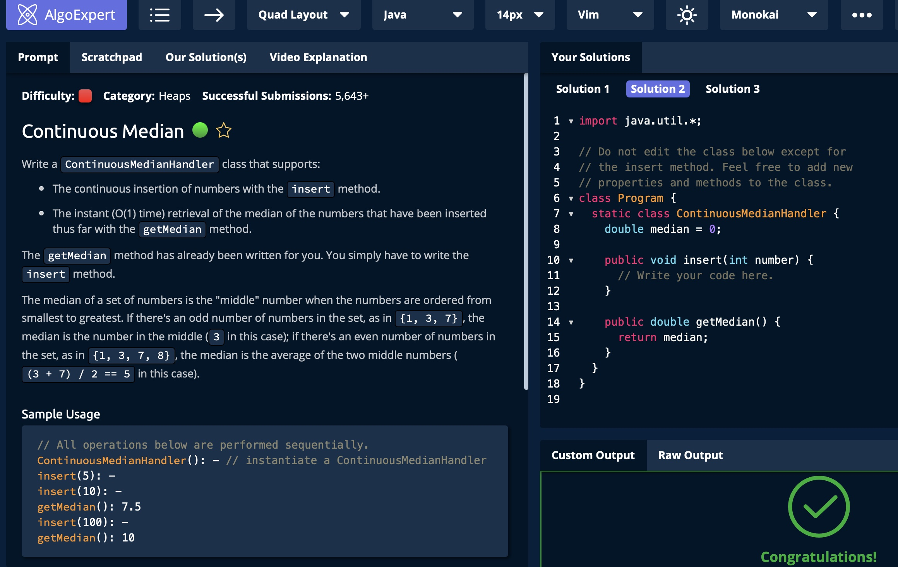

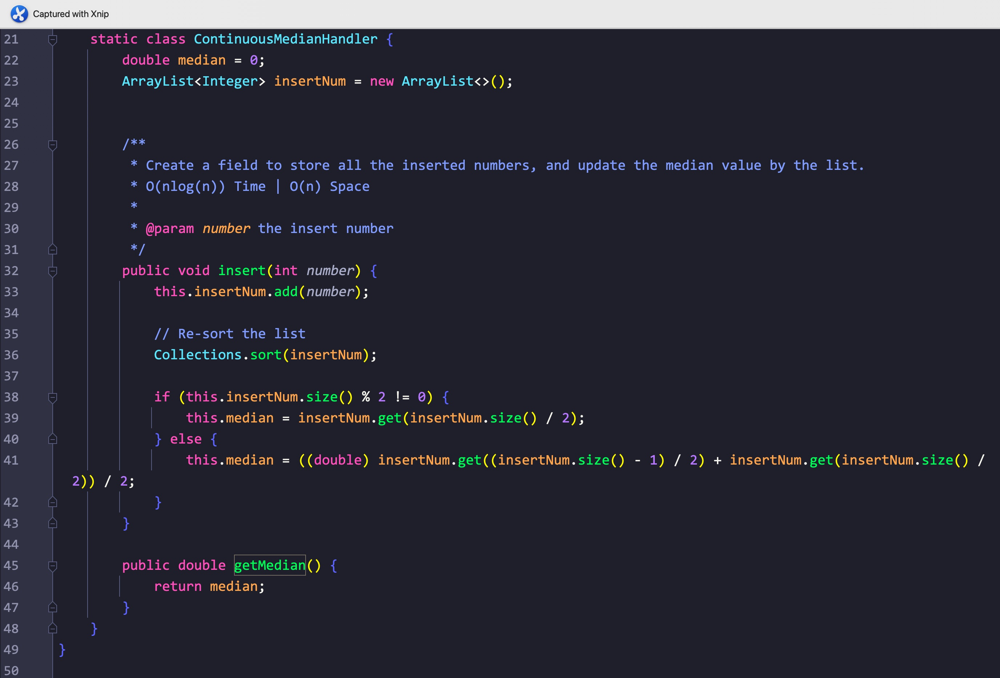

题意:

请你编写ContinuousMedianHandler类中的insert方法，该方法接收一个int数字，并应该根据接收的所有int数字动态地维护更新字段median，以便getMedian能获取到最新的中间值

思路:

- 今天急着下班，直接调用API了，我们直接新增一个字段用来存储所有插入的数字，且每插入一次都将该集合重新排序
- 判断集合中元素的个数，由此判断中位数的取法(直接取中间索引还是取两个中间值的和)
- 最后更新到字段median中即可

复杂度:

- 调用API排序的时间复杂度为O(nlog(n))，当然自己手写一个堆排序或者其他的排序方式也行
- 我们动态维护了一个集合来存储并排序插入的所有元素，所以空间复杂度为O(n)

****

# Day75

## Tag: Merge Sort

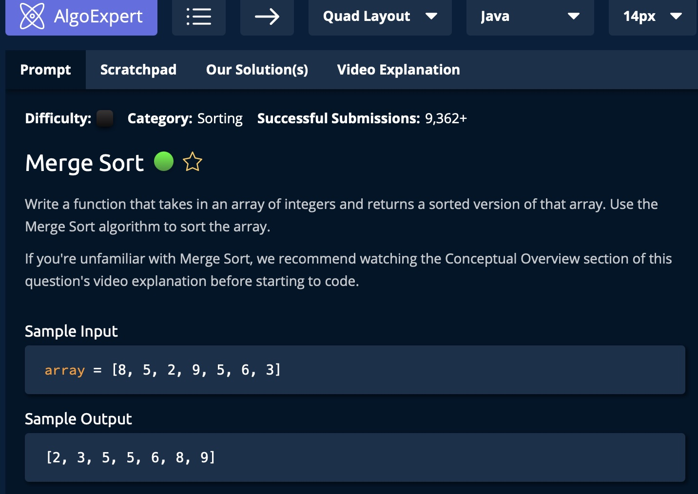

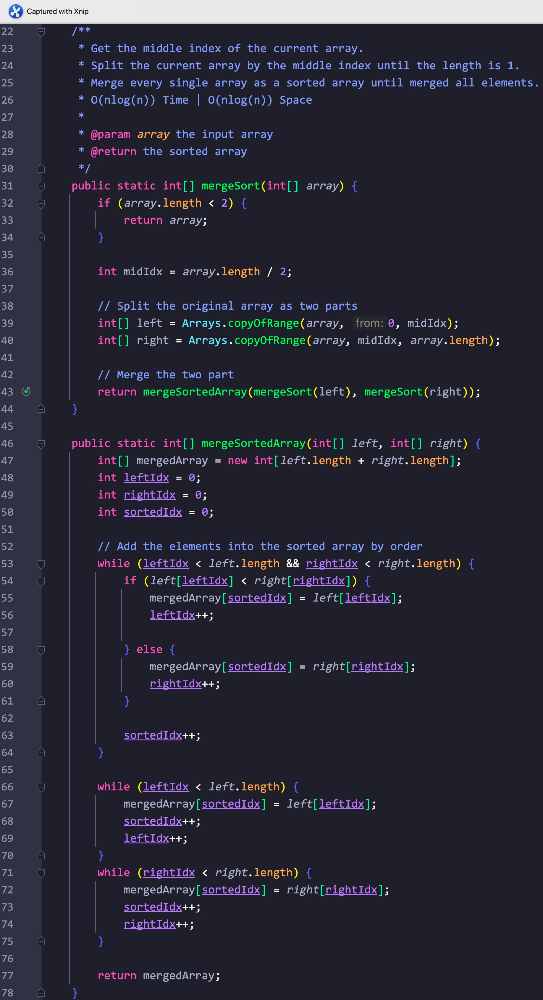

题意:

给你一个数组，请你使用归并排序的方法将其排序(mergeSort)

思路:

- 归并排序的基本思路就是分治，将数组从中间位置分离成两个子数组，直到子数组的长度为1
- 将这些长度为1的数组重新排成有序数组，直到排列完所有的数组即可

实现(Java):

- 将原方法作为递归方法，取当前数组的中位索引，以此为界将数组划分两个两个部分，直到子数组长度为1
- 划分后将所有数组重新有序的归并到一起，该步骤需要利用三个指针，其中结果数组指针要与两个合并数组中的最小值索引同步更新

复杂度:

- 我们每次都将数组分成两部分，之后又合在一起，其实与二分法差不多，二分的部分为log(n)，而合并又与n有关，所以时间复杂度为O(nlog(n))
- 我们递归调用的栈空间同二分法，但我们将所有合并的数组都存储了下来，所以空间复杂度为O(nlog(n))

****

# Day76

## Tag: Array, Two-dimensional Sort

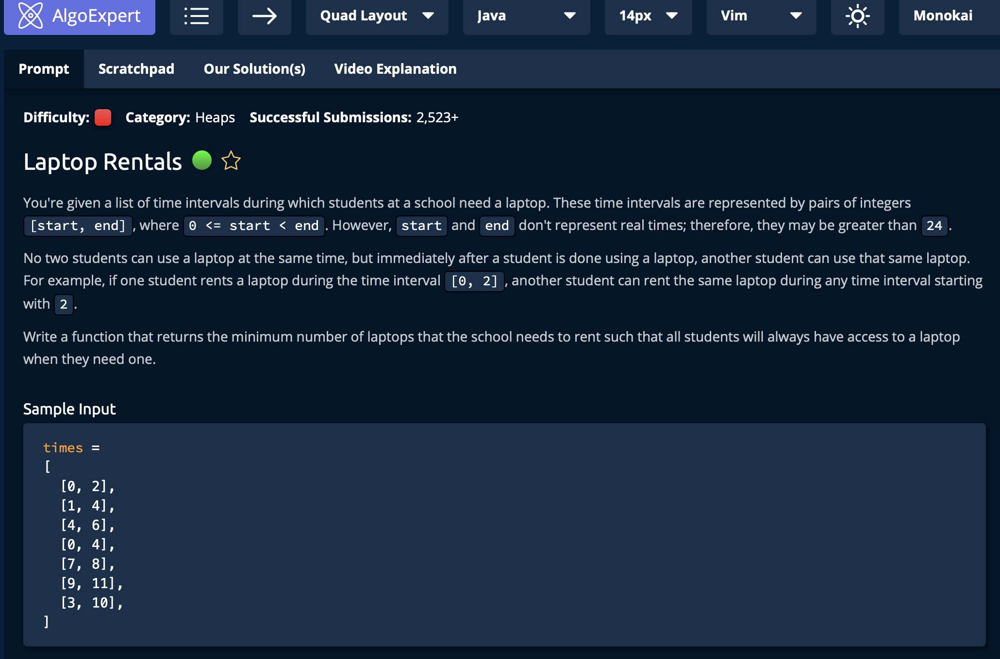

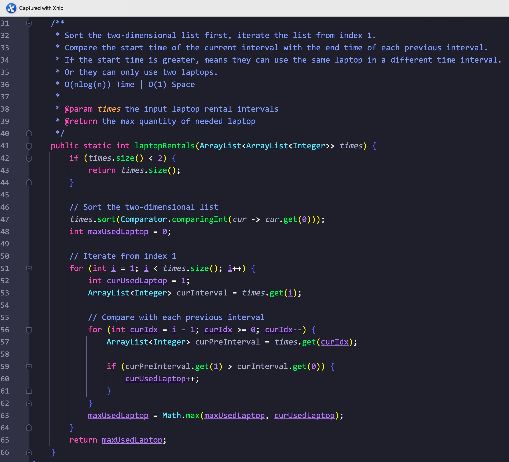

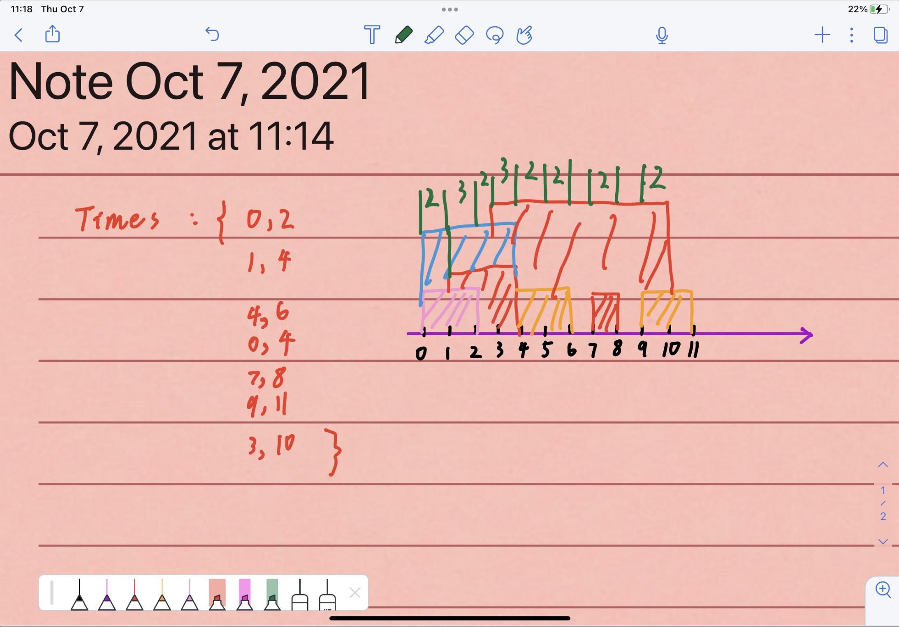

题意:

- 给你一个二维集合，其中每个元素都为的长度为2的小集合，每个小集合的开头元素表示时间的开始，结尾元素表示时间的结束，这个时间段表明一个学生想要借用笔记本电脑的时间段。两个学生不能同时使用一台笔记本，请你根据这些时间段判断至少需要准备的笔记本的数量

思路:

- 将该二维集合中所有的元素映射到一条数轴上(见图)
- 可以得知，我们需要找出最大的重叠数才行
- 又由图可知，重叠部分的时间段的开头总是相邻的，但我们获取的输入是乱序的，为了有条理的找出结果，我们可以对该输入的二维集合针对元素的第一个值进行排序
- 对于每个时间段，如果其开始的时间小于前面时间段的结尾时间，则说明该时间段的学生只能使用另外的笔记本
- 通过这种方式，我们就可以计算出每个时间段使用的笔记本数量，最后取最大值即可

实现(Java):

- 首先对该二维数组进行排序，之后从索引1位置开始遍历
- 每次将当前索引对应时间段的开头时间与之前所有时间段的结尾比较，如果小于则说明需要另外使用笔记本
- 这样将所有的时间段遍历完成后，返回所需笔记本数量的最大值即可

复杂度:

- 我们首先对该集合进行了排序，用时nlog(n)，之后又遍历了集合，所以时间复杂度为O(nlog(n))
- 我们创建的变量个数为常量级，所以空间复杂度为O(1)

****

# Day77

## Tag: String, Reverse

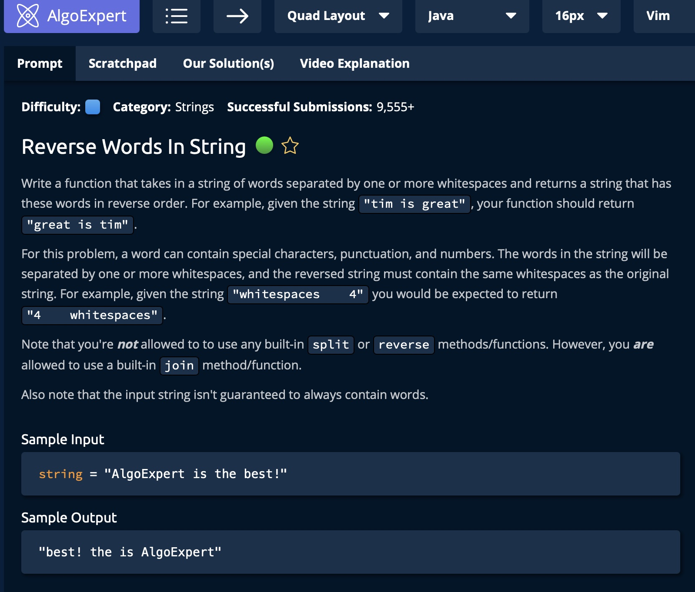

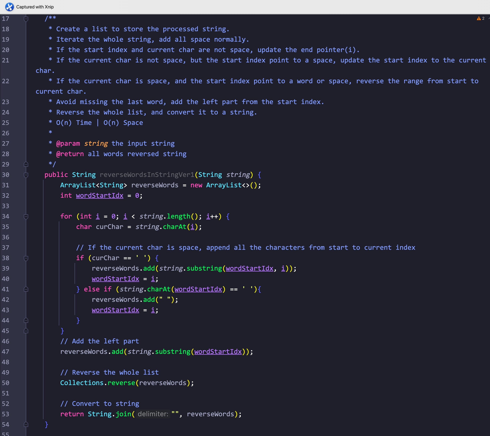

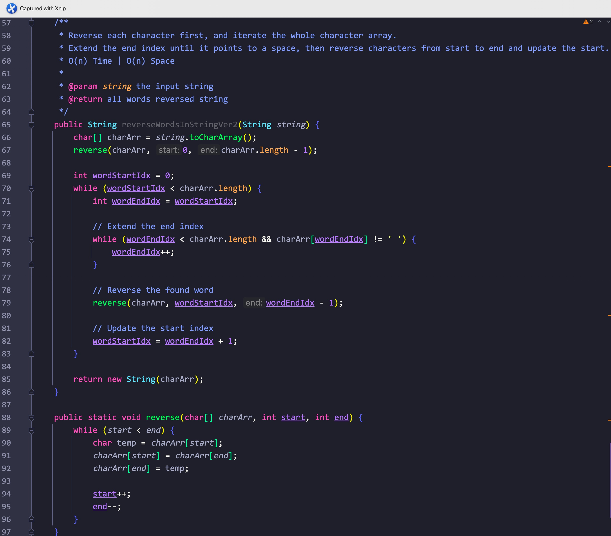

题意:

给你一个字符串，请你将其以单词为单位进行反转

思路1:

- 因为要以单词为单位进行反转，所以要将一个单词视作整体，那么我们可以将字符串中的单词和空格看作同一单位，添加到集合中，最后反转集合并转换为字符串即可
- 所以现在的问题就是判断单词和空格
- 这里运用双指针，让末尾指针从开始指针的位置向后遍历，如果末尾指针为空格，则将开头指针到末尾指针前一位置这一段添加到集合中，并更新开始指针到末尾指针的位置处(此时如果开头指针指向空格，则我们添加了一个空格到集合中，如果不是，我们就添加了一个单词到集合中)
- 如果结尾指针不为空格，但开头指针为空格，则依次更新开头指针指向的空格，并更新开头指针即可

实现1(Java):

- 创建一个集合，用来存储单词和空格
- 创建一个开头指针，再创建一个结尾指针，从0索引开始进行遍历
- 判断结尾指针(i)指向的字符，如果为space则将从开头到i - 1这一段整体添加到集合中，并更新开头指针到i处
- 如果不为space，判断开头指针指向的字符，为space则将该space添加到集合中，并更新开头指针到i处
- 最后为了防止最后一部分没有空格而无法将其添加到集合中，我们将开头指针之后的所有字符添加到集合中
- 之后反转集合中的元素，并作为字符串返回即可

复杂度1:

- 我们将原字符串遍历了一次，所以时间复杂度为O(n)
- 我们创建了一个集合来存储原字符串中所有的元素，所以空间复杂度为O(n)

思路2:

- 不借用集合，我们在开头就直接将其中所有的字符都进行反转，那么之后的任务便是将其中的每个单词都反转回来即可
- 同样借用双指针，正向遍历直到末尾指针指向space后，将开头到末尾 - 1范围内的字符进行反转即可，并随时更新开头指针
- 最后返回该字符串即可

复杂度2:

- 我们将字符数组正向遍历了一次，并反转了多次，所以时间复杂度为O(n)
- Java的字符串不可更改，所以空间复杂度为O(n)

****

# Day78

## Tag: Merge Sort, Array

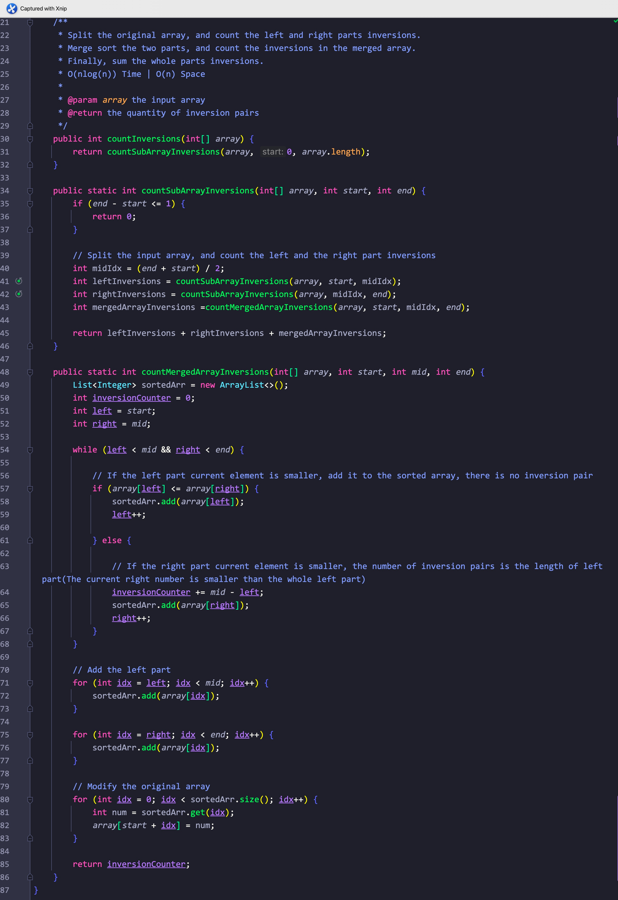

题意:

给你一个数组，请你计算出其中倒置的数量(索引位置小，但对应的值大，满足i < j && array[i] > array[j])

例如数组: {2, 3, 3, 1, 9, 5, 6}

其中倒置的数对有: [0，3]，[1，3]，[2，3]，[4，5]，[4，6]

思路:

- 最简单的方法就是嵌套循环，但时间复杂度为O(n^2)，所以不可取
- 这里我们可以将数组分成两个部分，分别计算每个部分中倒置的数量
- 且最终还需要将两个部分合并起来重新排序，在排序过程中也需要计算倒置对的数量
- 所以问题就变为了划分再合并，这不就是归并排序吗？

实现(Java):

- 首先创建一个递归方法，将原数组分为多个小数组
- 划分完成后再进行归并排序，这里使用双指针的方式，两指针分别指向两个数组中的开头数字
- 比较规则这两个数字，如果右指针指向的数字小于左指针，则说明左边剩余的数字都大于右边的数字，则我们直接获得了(mid - left)个倒置对，并将该数字添加到排序集合中；反之则将左指针的数添加到排序集合，最后更新左右指针
- 由于左右部分长度不一定相同，所以可能会有剩余部分，我们还需要将剩余部分添加进去
- 最后将排序集合中的数字覆盖写入到原数组中即可

复杂度:

- 归并排序的复杂度为nlog(n)，所以时间复杂度由起初的O(n^2)降到了O(nlog(n))
- 我们记录了排序后的数字，所以空间复杂度为O(n)

****

# Day79

## Tag: Math, Dichotomy

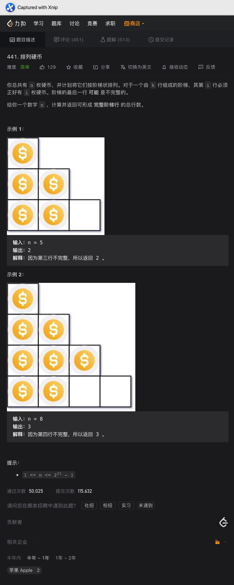

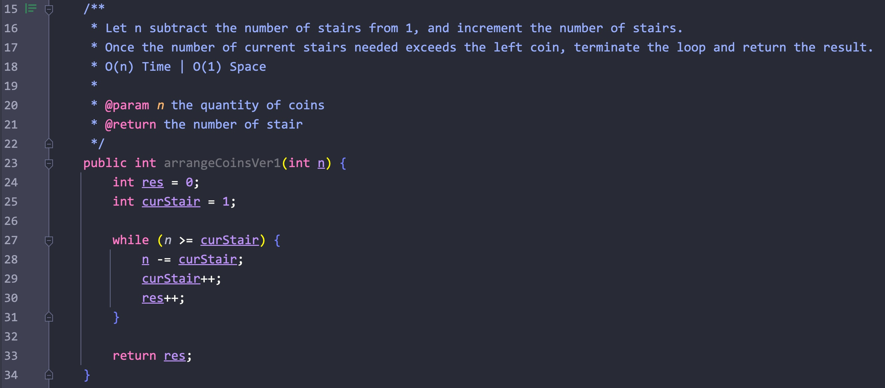

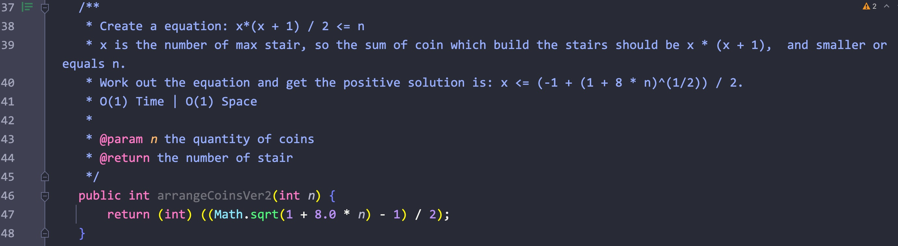

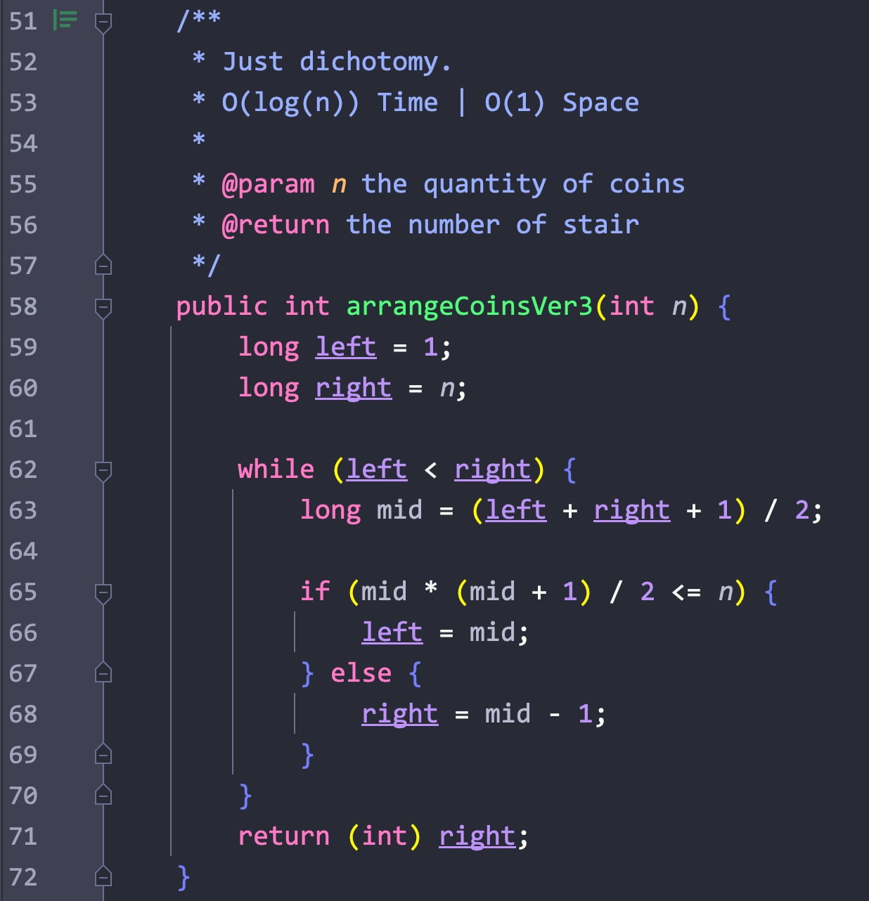

题意:

给你n个硬币，请你计算出能用它们排列出的最大完整台阶的数量

思路1:

- 最简单的方法就是一个台阶一个台阶的减，每下一个台阶就增加台阶所需的硬币数
- 直到剩余硬币数小于台阶所需硬币数为止

复杂度1:

- 我们循环的次数取决于台阶最终的高度，最终用时趋近n，所以时间复杂度为O(n)
- 我们创建的变量个数为常量级，所以空间复杂度为O(1)

思路2:

- 对于该题目可以列一个方程
- 假设x为最终能组成的完整阶梯数，则构建x阶梯所需的硬币数为x * (x + 1) / 2，即等差数列求和
- 那么对于n，则应该满足: x * (x + 1) / 2 <= n
- 最后∆ > 0，有一正一负两个解，保留正解即可

复杂度2:

- 一个算式，所以时间复杂度为O(1)
- 我们创建的变量个数为常量级，所以空间复杂度为O(1)

思路3:

- 既然之前已经有了所需的总硬币数，那么我们从中间值开始计算最靠近n的台阶数x不久行了吗？
- 常规二分

复杂度3:

- 二分法，时间复杂度为O(log(n))
- 我们创建的变量个数为常量级，所以空间复杂度为O(1)

****

# Day80

## Tag: Dynamic Programming, Array

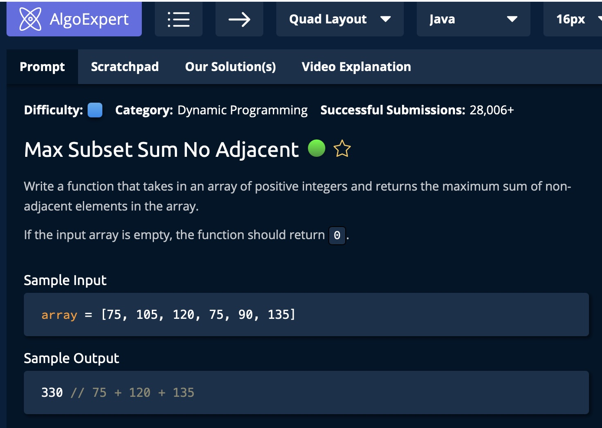

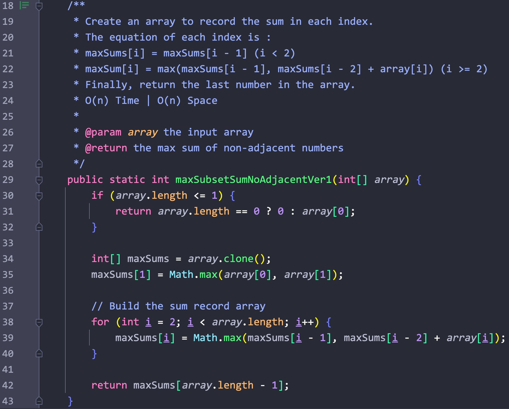

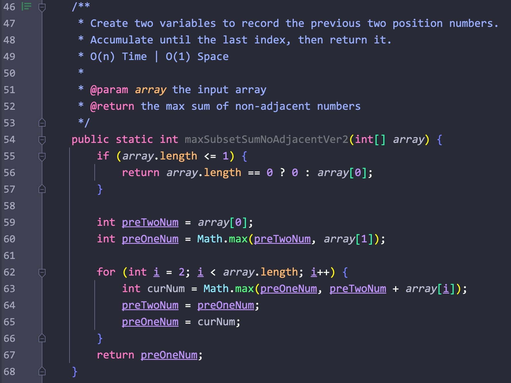

题意:

给你一个数组，请你计算出通过其中不连续元素累加所能得到的最大和值(累加元素之间至少间隔一个索引位置)

思路1:

- 从该数组出发，前1个元素累加所得最大值必然是第一个元素本身，而前两个元素间断累加最大值则取决于索引0和1位置的元素大小
- 如此一来，我们便记录出了前两个位置累加所能获取的最大值，之后的所有位置都可以套入一个方程:
- 设一个数组maxSums，用来记录索引i及之前位置元素间断累加所能获取的最大值
- 如果i > 2，则有maxSums[i] = max(maxSums[i - 1], maxSums[i - 2] + array[i])，因为不能相邻，所以这里用了i - 2位置的元素加上array中i位置的元素
- 最后返回maxSums中最后一个元素即可

实现1(Java):

- 创建一个maxSums数组用来记录索引i及之前所有元素间断求和的最大值
- 初始化该数组前两个索引位置的元素
- 进入循环，从索引2开始，使用转移方程来记录各个范围内的最大间断和值
- 最终返回maxSums最后一个元素即可

复杂度1:

- 我遍历了一次原数组来构建maxSums，所以时间复杂度为O(n)
- 我们创建了一个数组来记录每个索引范围内的最大间断和值，所以空间复杂度为O(n)

思路2:

- 在转移方程中，我们只用到了转移数组中前两个位置的元素，所以我们只需要记录这两个数就好了，而不需要记录整个数组

实现2(Java):

- 创建两个var，初始化为array[0]和max(array[0], array[1])
- 从索引2开始，更新当前索引及之前位置的间断和值，之后通过滑动的方式更新到两个var中
- 最后返回最后一个索引位置的值即可

复杂度2:

- 我们依然遍历了一次原数组，所以时间复杂度为O(n)
- 我们创建的变量个数为常量级，所以空间复杂度为O(1)

****

# Day81

## Tag: Dynamic Programming, Array

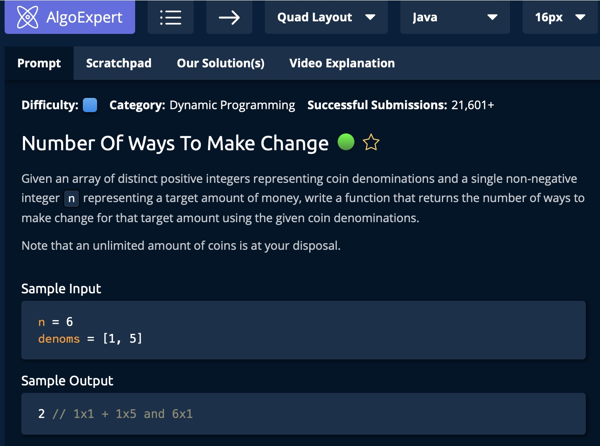

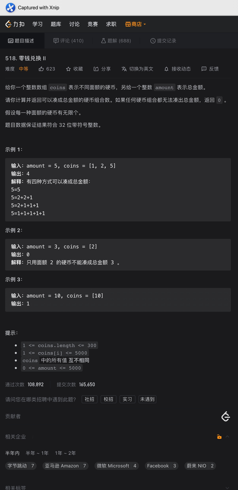

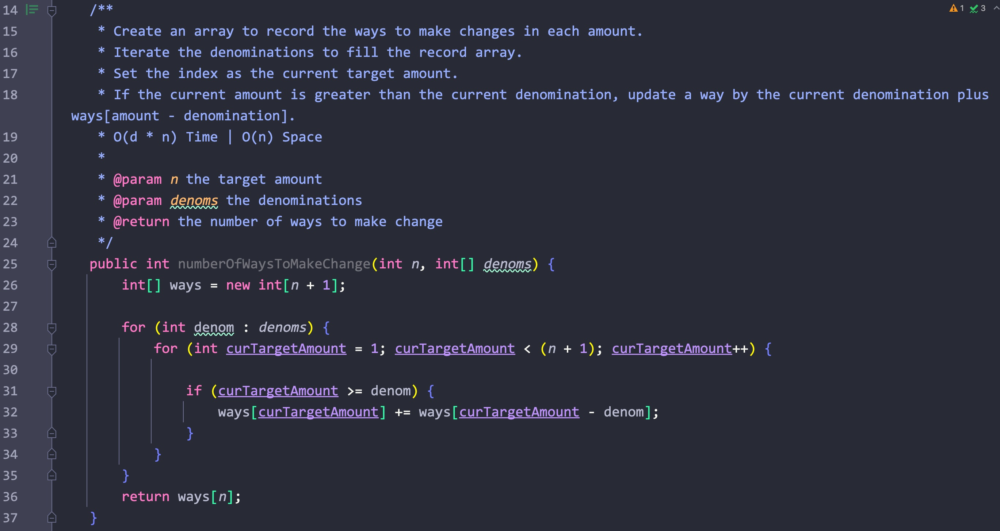

题意:

给你一个由不同金额组成的数组denoms，再给你一个目标金额，请你计算出通过该denoms数组凑成目标金额的总方法数(数组中每种金额可以多次使用)

思路:

- 此题目可以一步步分解，我们创建一个数组，其中每个位置的索引代表目标金额
- 索引0初始化为1，之后每个位置都判断当前denomination是否小于目标金额(索引)，如果符合则凑成该目标金额的方法数为使用之前金额凑成目标金额的方法数 + 凑成(目标金额 - 当前denomination)
- 最后返回数组中索引为目标金额的元素即可

实现(Java):

- 创建一个数组ways，其用了记录凑成每个目标金额的方法，长度为n + 1，将索引值为0的元素初始化为1
- 遍历一次denoms数组，取出其中每个位置的金额，之后遍历一次ways数组
- 将ways数组的索引与denoms数组中的当前元素进行比较，如果索引值较大，则将ways[i]更新为way[i] + way[i - denoms]
- 使用denoms数组中的每个元素将ways通过这种方式更新，最后ways数组中索引为n的即为凑成金额n的所有方法数

复杂度:

- 我们遍历了d次ways数组，ways数组长度为n + 1，所以时间复杂度为O(d * n)，d为demons数组的长度
- 我们创建了一个长度为n + 1的ways数组，所以空间复杂度为O(n)

拓展:

- 该题目同Leetcode 518

****

# Day82

## Tag: Dynamic Programming

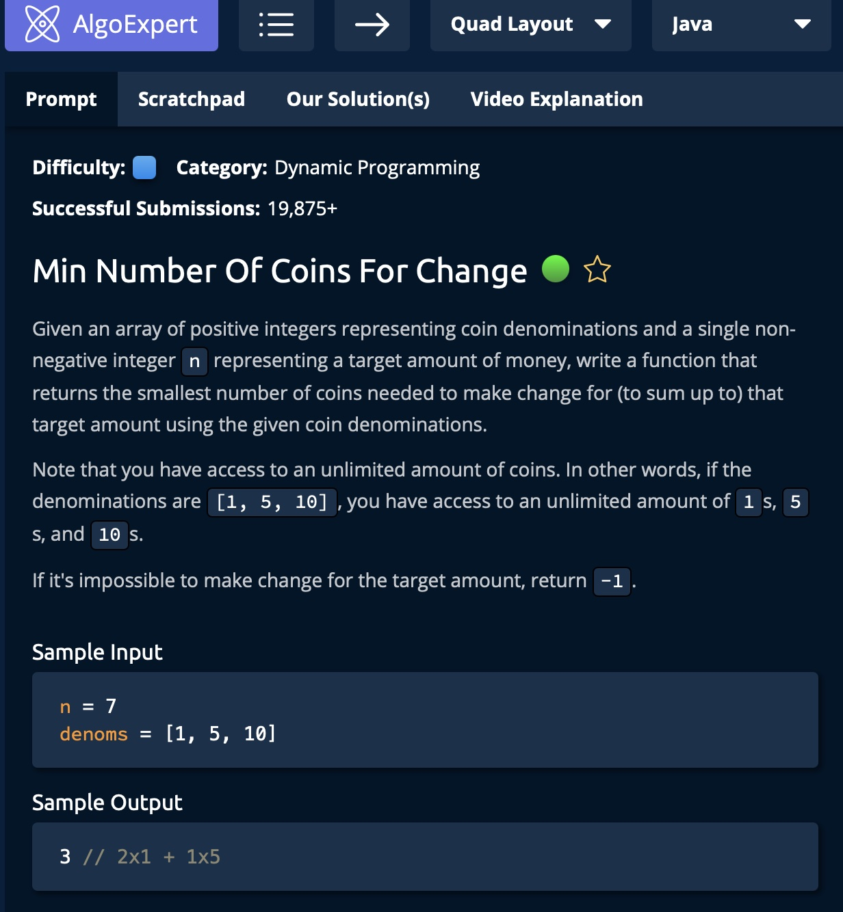

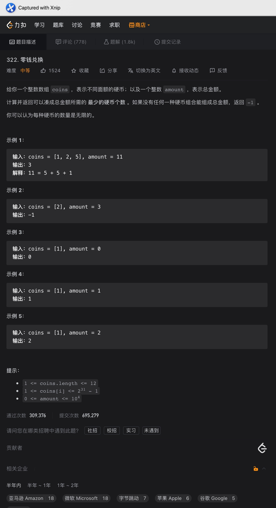

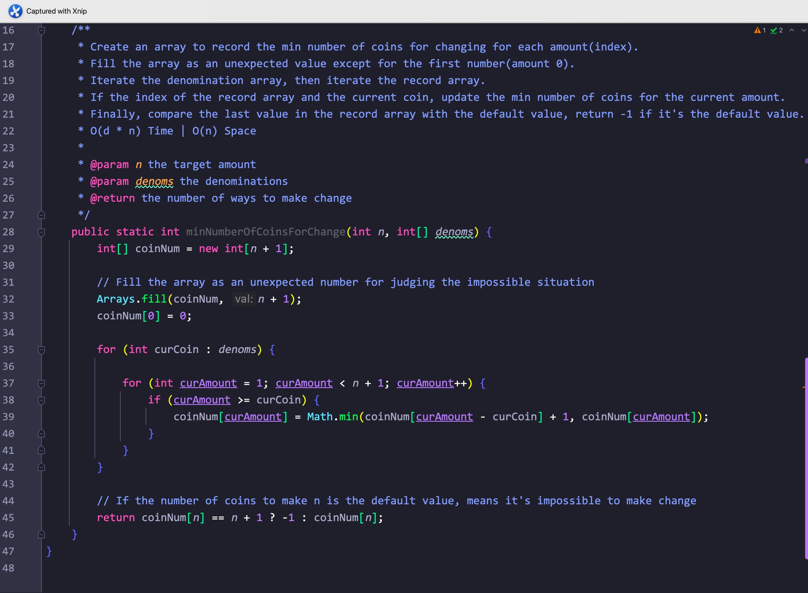

题意:

给你一个数组，其代表你能使用的硬币面额，每种面额可以无限次使用，再给你一个目标金额，请你计算出根据已有硬币凑出目标金额所需的最小硬币数目

思路:

- 同昨天一样，我们依然创建一个长度为目标金额 + 1的数组，索引依然代表目标金额，但索引对应的值为凑成目标金额所对应的最小硬币数量
- 遍历一次硬币数组，判断硬币面额和索引的大小，如果索引 ≥ 面额，则更新索引对应值为min(当前凑成目标金额的最小硬币数, 当前凑成(目标金额 - 面额)的最小硬币数)
- 最后返回索引值为目标金额的元素即可

实现(Java):

- 首先创建一个数组用来记录凑成目标金额所需的最小硬币数，先将所有元素初始化为一个不在0 - 目标金额内的数字(方便之后判断无法凑出的情况)，但第一个元素要初始化为0(凑出金额0使用的最小硬币数为0)
- 遍历一次硬币数组，再从1开始遍历一次记录数组，比较记录数组索引和硬币面额，如果索引 ≥ 面额，则更新记录数组:
- record[index] = min(record[index - coin] + 1, record[index])，其中record[index - coin]指凑出面额为[index - coin]所需的最小硬币数，之后 +1 是指加上当前一个coin
- 最后判断索引为n(目标金额)的记录数组元素是否为初始值，是则说明无法凑出，返回-1，否则返回对应值

复杂度:

- 我们遍历了一次硬币数组，其中又遍历了一次记录数组，所以时间复杂度为O(d * n)，d为硬币数组的长度
- 我们创建了一个长度为n + 1的记录数组，所以空间复杂度为O(n)

拓展:

- 该题目同Leetcode 322

****

# Day83

## Tag: Dynamic Programming

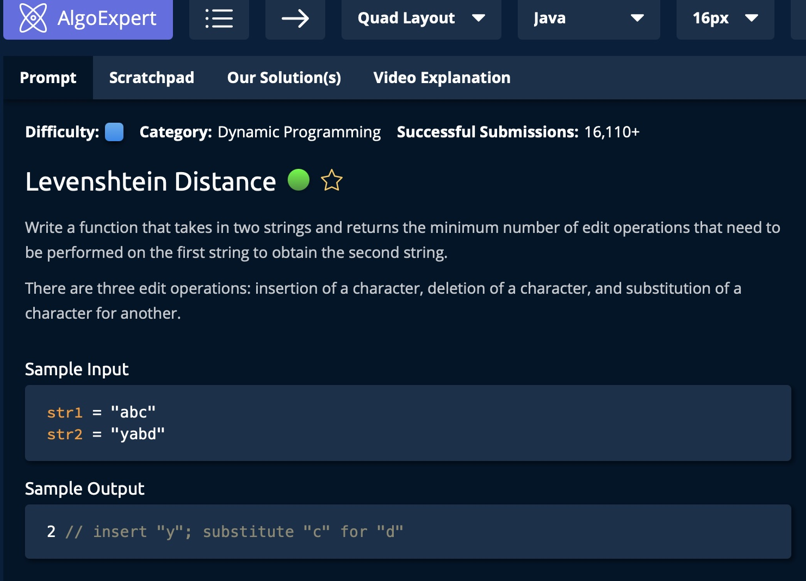

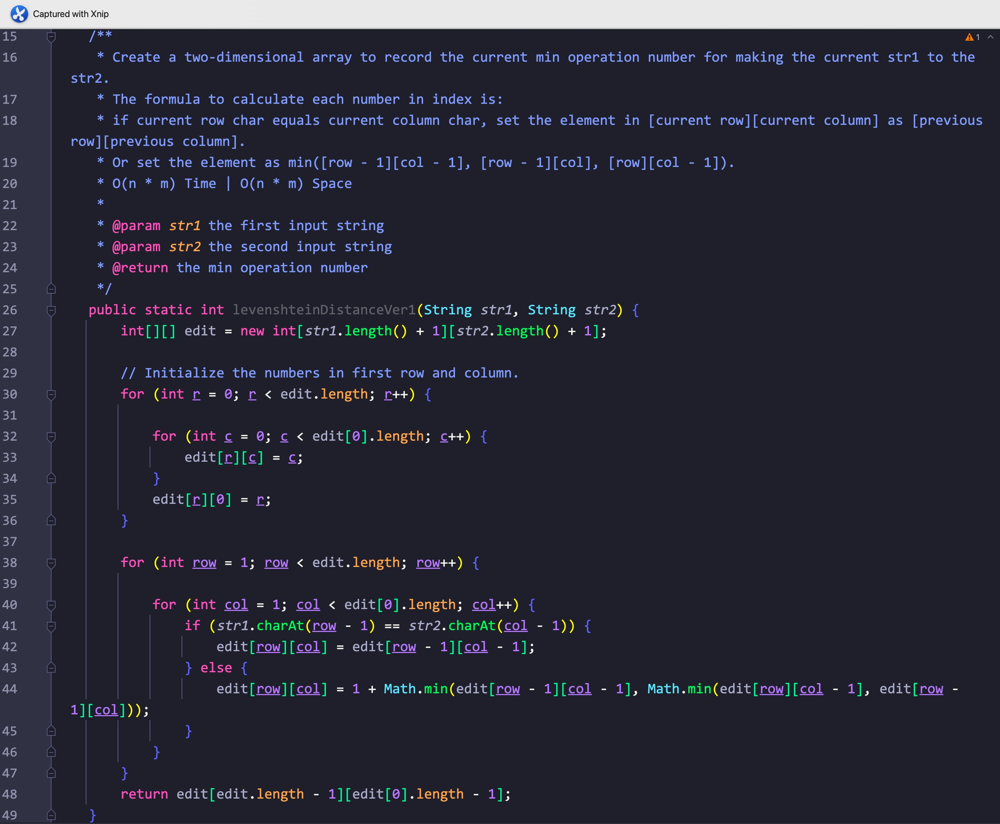

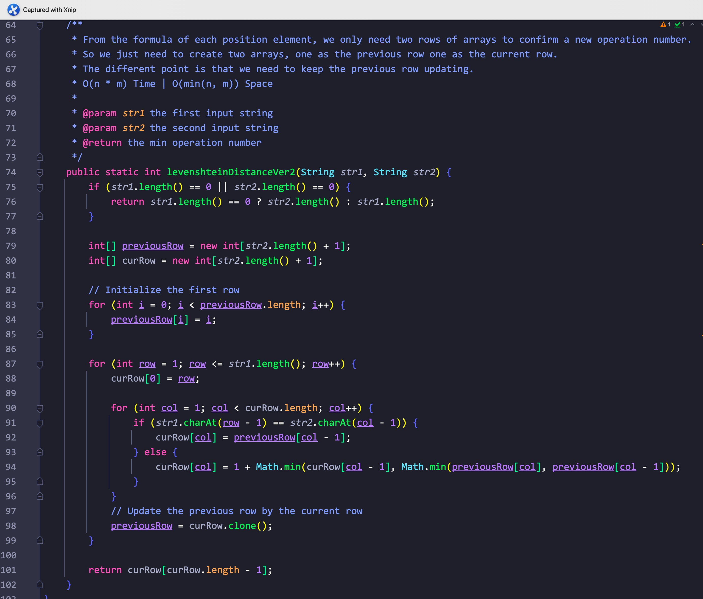

题意:

给你两个不同的字符串str1, str2，请你计算出将str1变为str2的最少操作步骤数

思路1:

- 将问题拆分，在这两个字符串前面都插入一个空白字符，将两个字符串中的每个字符分别作为列和行
- 以列和行为基础创建一个二维数组，每个位置的值都指代对应位置str1变为str2所需的最小操作数
- 以示例str1 = "abc" str2 = "yabd"可得:

|         | **""** | **y** | **a** | **b** | **d** |
| :-----: | :----: | :---: | :---: | :---: | :---: |
| **" "** | **0**  | **1** | **2** | **3** | **4** |
|  **a**  | **1**  | **1** | **1** | **2** | **3** |
|  **b**  | **2**  | **2** | **2** | **1** | **2** |
|  **c**  | **3**  | **3** | **3** | **2** | **2** |

- 二维数组中的最后一个数字即为我们的答案
- 观察其中的规律，如对于row = 1, col = 2的元素，此时str1 = " a"，str2 = " ya"，此时很明显，只需要在str1中插入一个"y"即可
- 但这样的前提是先算出str1 = " "到str2 = " y"的最小操作数，也就是说，如果当前字符相同，则str1变为str2的最小操作数为该二维数组左上角的位置(row - 1, col - 1)
- 而如果当前字符不相等，则从str1到str2必然需要至少一次操作，而想要计算当前的str1到str2的操作数必然需要计算之前的过程
- 例如对于row = 3, col = 1的元素，str1 = " abc"，str2 = " y"，此时我们想要计算操作数可以有三种途径：
- 要么从row = 2到row = 3，col = 1不变，也就是在str1 = " ab"变为str2 = " y"最小操作数的基础上 + 1
- 要么从col = 0到col = 1，row不变，也就是在str1 = " abc"变为str2 = " "最小操作数的基础上 + 1
- 要么从row = 2, col = 0到row = 3, col = 1，也就是在str1 = " ab"变为str2 = " "最小操作数的基础上 + 1
- 总结一下，计算每个位置上值的规律如下:
- 如果str1当前位置字符 = str2当前字符，则当前位置 = 上一行上一列的值
- 否则当前位置的值为min(前一行，前一列，上一行上一列)

实现1(Java):

- 创建一个二维数组，由于第一行没有上一行的概念，所以可以直接初始化，而每一行的第一个值自然等于行号
- 从第二行开始，套入规律，判断上一位置str1和str2的字符，更新相应的值，最后返回二维数组中的最后一个值即可

复杂度1:

- 我们将该二维数组遍历了一次，所以时间复杂度为O(n * m)，n和m为str1和str2的长度
- 我们创建了一个二维数组，所以空间复杂度为O(n * m)

思路2:

- 基于思路1中的规律，可以得知，我们其实只需要其中两行即可运用这个规律了
- 所以我们只需要创建两个数组，其中一个作为另一个数组的上一行即可

实现2(Java):

- 创建两个数组，同样初始化第一个行，与方法一不同的是，需要时刻保持上一行的更新
- 每当更新完当前行后，都要用其更新上一行

复杂度2:

- 我们同样遍历了一个虚拟的二维数组，所以时间复杂度为O(n * m)
- 我们只创建了两个数组，所以空间复杂度为O(min(n ,m))

****

# Day84

## Tag: Recursion, Dynamic Programming, Math

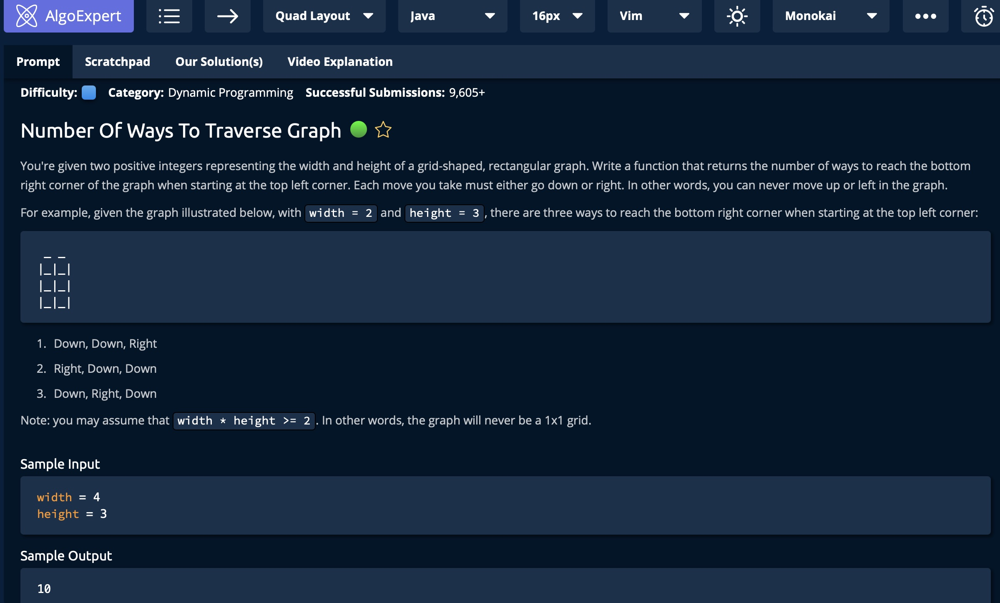

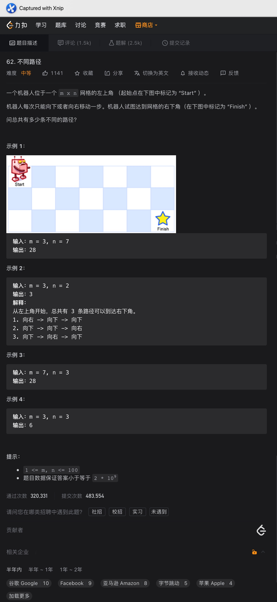

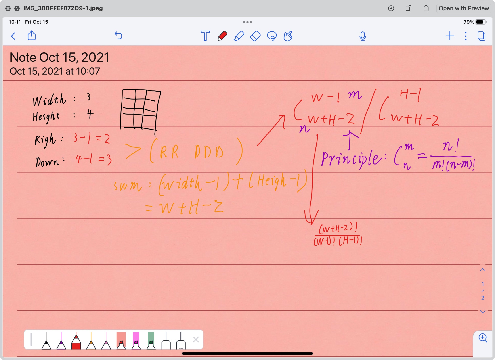

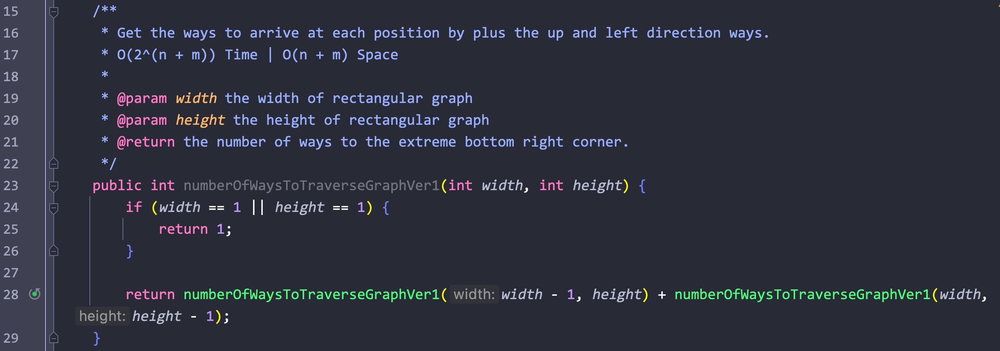

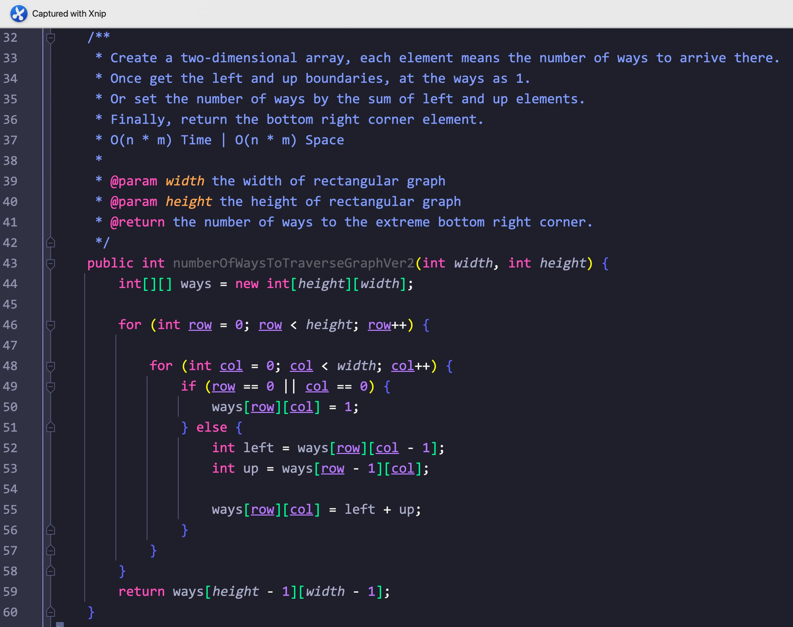

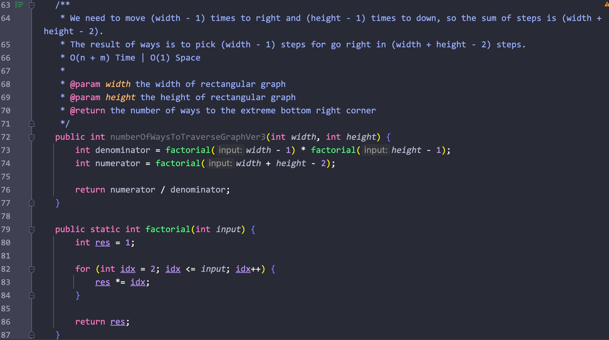

题意:

给你一个矩形的宽和高，从左上角的网格出发，到右下角，一共有多少种方法？(一次只能往下/右方走)

思路1:

- 因为每次只能往两个方向走，所以到达每个地方的方法自然就等于到达其上方和左方两个位置的方法之和
- 而要到达第一行和第一列的方法必然为1，这样我们依次计算直到最后一个即可，其实就是DFS，但如果使用递归，则时间复杂度为O(2^(n + m))，明显不合理
- 方法找到了，我们还可以使用动态规划呀，创建一个二维数组对应每个网格，其中每个元素都对应到达该处位置的方法之和，最后返回右下角的元素即可

实现1(Java):

- 创建一个对应矩形的二维数组
- 遍历该二维数组，如果row或者col为0，则将该位置初始化为1，其余位置则设置为上左方元素之和即可
- 最后返回右下角的元素

复杂度1:

- 我们遍历了一次二维数组，所以时间复杂度为O(n * m)
- 我们创建了一个二维数组，所以空间复杂度为O(n * m)

思路2:

- 简单观察可知: 我们一共需要向右width - 1步，向下height - 1步，所以一共需要(W + H  - 2)步
- 将向右和向下的步数进行组合不就是结果了吗？从(W + H - 2)中取W - 1步向右即可，这不就是排列组合吗？
- 最后可得公式如下: Result = (W + H - 2)! / (W -1)! * (H - 1)!

复杂度2:

- 该方法最大需要计算(W + H  - 2)!的结果，所以时间复杂度为O(n + m)
- 我们创建的变量数为常量级，所以空间复杂度为O(1)

拓展:

- 该题目同Leetcode 62

