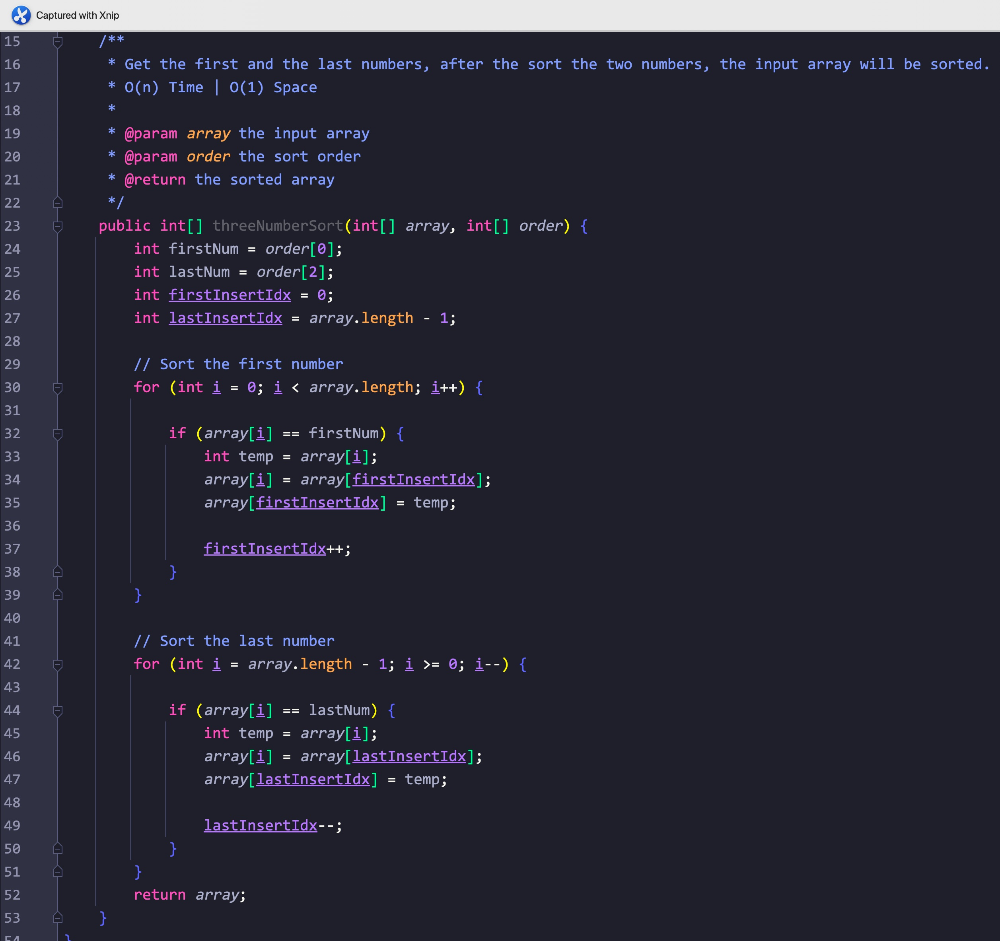

# Day61

## Tag: Array, Dimensional-array

题意:

给你一个二维数组，其每列每行都是排序好的，再给你一个目标值，请你在这个二维数组中找到该目标值，并返回其对应的索引

思路:

- 观察二维数组可得知: 该二维数组从左上到右下，数值依次增大，但如果从左上角开始找的话，同时更新行和列可能会跳过我们的目标
- 所以，为了能单独控制大小，我们需要从右上角开始
- 因为每一个列也是排序过的，所以如果该列的第一个数就大于目标值，则说明该列所有值都大于目标值，所以更新该列
- 如果当前位置值小于目标值，那么在垂直位置上，目标值应该在下方，所以更新行

实现(Java):

- 从右上角开始，初始化对应的行列索引
- 进入循环，条件为索引不越界
- 判断当前值与目标值的大小，相等则直接返回索引
- 小于则更新行值，大于则更新列值

复杂度:

- 最坏的情况下，我们会遍历行和列中所有的数字，所以共消耗r+c，时间复杂度为O(r+c)
- 我们创建的变量为常量级，所以空间复杂度为O(1)

****

# Day62

## Tag: Array, Binary search

题意:

给你一个旋转过的数组，和一个目标值请你使用二分查找找出其在该数组中对应的索引

思路:

- 虽然该数组在旋转后就不是严格的排序数组了，但从旋转的位置开始，其左右两个部分都是有序的，同样能够使用二分查找
- 所以我们只需要判断该目标数在左边还是右边即可

实现(Java):

- 我们同样对该数组取中位数，比较中位数与边界值，判断中位数所处的位置
- 将目标值与中位数和边界值比较，确定目标值所处的区间，更新边界值到对应的区间中

复杂度:

- 我们通过二分查找的方式找到了目标值，所以时间复杂度为O(log(n))
- 我们创建的变量个数为常量级，所以空间复杂度为O(1)

****

# Day63

## Tag: Binary Search, Array

题意:

给你一个排序后的数组，其中有重复的数字，再给你一个目标值，请你找出该目标值在数组中出现范围的起始和结束索引

思路:

- 所谓的起始和结束位置其实就是第一次出现和最后一次出现罢了，所以我们只需要从0开始正向遍历就能找到开始位置的索引
- 从末尾位置开始反向遍历就能找到结束位置的索引，两个循环就能搞定，时间复杂度为O(n)，空间复杂度为O(1)
- 但既然是排序后的数组，能不能用二分法呢？当然可以
- 在这道题目中，比起传统二分法不同的自然是目标数字不止出现一次，所以通过二分法找到目标数组后，我们还需要判断其是否在最左/右的位置上，如果不在，则仍旧需要更新边界

实现(Java):

- 创建一个方法，其接受原方法的参数外，还接受一个boolean类型来判断当前调用是寻找左还是右边界
- 进入传统的二分法步骤，判断中间索引值是否等于目标值
- 如果等于，则进行附加判断:
- 首先判断boolean类型，获取此次调用的目的
- 如果是获取左边界，则判断当前中位数索引是否等于0，或者中位索引前一个位置的数是否为目标值
- 如果当前中位索引为0，或者前一位不为目标值，则说明当前中位索引为左边界，将其记录
- 如果是获取右边界，则仅修改判断为中位索引是否为最后一个索引值(array.length - 1)，其余与左边界相同
- 通过两种boolean值，我们就获取了左右边界索引

复杂度:

- 我们在搜寻时使用了二分法，所以时间复杂度优化到了O(log(n))
- 我们创建的变量个数为常量级，所以空间复杂度为O(1)

****

# Day64

## Tag: 

题意:

给你一个没有重复数字的随机数组，再给你一个数字k，请你找出该数组中第k个最小的元素

思路:

- 首先最容易想到的肯定是先排序，之后直接返回对应索引的值即可，但时间复杂度为O(nlog(n))
- 能不能优化至O(n)? 其实这个问题同Algorithm Day60的解决思路是一样一样的，只不过那道题目的k是个常数(3)，且求的是最大值罢了
- 在那道题目中，我们创建一个长度为3的数组，通过动态更新它来获取了最大的三个数
- 在这道题目里，我们只需要将3换做k，将正序更新换成逆序更新即可，其余不变

****

# Day65

## Tag: Array, Binary Search

题意:

给你个排序后无重复数字的数组，请你查出其中最小的索引值，其对应位置的元素值与索引值相同

思路:

- 最简单的方法肯定是直接遍历一遍，比较每个值和其索引值即可，这样做的时间复杂度为O(n)，但我们其实能用二分法
- 比起简单的用二分法寻找目标数，这里我们还需要在找到后判断其是否最小，转换一下即判断它是否在最左边或者其前一个位置是否小于索引
- 处于最左边很好理解，因为其如果在最左边，则其毫无疑问是最小的，但后一个条件呢？
- 因为这个数组是排序后的，所以如果在我们找到的索引位置的后一个位置上，该索引大于其对应的值，那么之后的值也会是这种关系
- 这样一来，我们找到的数就是最小的符合条件的值了

实现(Java):

- 创建两个指针，获取中间索引位置
- 判断中间索引和其对应值的大小关系
- 如果不等则更新对应的边界
- 如果相等则判断其是否在最左边或者其前一个位置的索引和对应值的大小关系，满足则返回索引

复杂度:

- 我们使用了二分法，所以时间复杂度比起最简单的方法优化至了O(log(n))
- 我们使用的变量个数为常量级，所以空间复杂度为O(1)

****

# Day66

## Tag: Bubble Sort

题意:

给你一个数组，请你使用冒泡排序的方式将该数组排序

思路:

- 调用API肯定是最简单的，但这里要求用冒泡，那就老老实实写个呗
- 冒泡其实就是让每个数都和临近的数相比，不符合排序的顺序则交换两个数的位置

实现(Java):

- 设置一个计数器，其计算排序操作的次数，因为每次排序后最大的数会被排在最后，以便之后的排序跳过最后排序过的数字
- 设置一个boolean变量，其作为是否继续排序的依据
- 进入循环，初始化boolean变量为true，判断当前数字和下一个数字的大小关系，如果不同则交换，并将boolean变量设置为false
- 只要boolean变量不为true，则继续循环

复杂度:

- 最坏时我们需要将该数组遍历近n^2，所以时间复杂度为O(n^2)
- 我们创建的变量个数为常量级，所以空间复杂度为O(1)

****

# Day67

## Tag: Insertion Sort

题意:

给你一个数组，请你使用插入排序的方法将其排序

思路:

- 同冒泡排序不同的是，插入排序需要从后往前比较，之后再交换，比较时是当前数与前一个数进行比较

复杂度:

- 在遍历该数组时，我们还会将数组从当前位置往前遍历，最坏需要n^2，所以时间复杂度为O(n^2)
- 我们创建的变量个数为常量级，所以空间复杂度为O(1)

****

# Day68

## Tag: Selection Sort,  Array

题意:

给你一个数组，请你用选择排序的方法对其进行排序

思路:

- 选择排序即每次都将数组中的最小值交换到最前面来，所以我们需要对数组遍历多次，以寻找最小值，并与左边界值交换

实现(Java):

- 创建一个var用来记录左边界值，进入循环，条件为该var小于最后一个索引
- 创建一个var从左边界值开始，首先遍历一遍数组获取最小值的索引并记录在该var中
- 交换该索引对应数与左边界对应的数，更新左边界

复杂度:

- 我们将数组遍历了n^2次，所以时间复杂度为O(n^2)
- 我们创建的变量个数为常量级，所以空间复杂度为O(1)

****

# Day69

## Tag: Array, Sort

题意:

给你一个有重复数字的数组，共有3种数字，再给你一个排序数组，请你按照排序数组中的顺序，将重复数组中的数字进行排序

思路:

- 因为只有三个数字，所以我们一旦排好其中的两个，那么数组自然就排列好了
- 所以我们需要在三个数字中选两个进行排列，中间那个自然不会选，因为其索引位置不好确定
- 自然，我们先排列排序数组中的第一个数字，再排列最后一个即可

实现(Java):

- 创建两个var作为第一和最后一个数字的插入索引
- 正向遍历一遍数组，将第一个数字移动到第一个数字的插入索引处，同时更新索引
- 此时该数组前半部分已经是排列好的第一个数字了，接下来我们只需要在后面找即可
- 逆序遍历一遍数组，将最后一个数字移动到最后一个数字的插入索引处，同时更新索引
- 此时数组已经排序完成

复杂度:

- 我们遍历了两次数组，所以时间复杂度为O(n)
- 我们创建的变量个数为常量级，所以空间复杂度为O(1)

