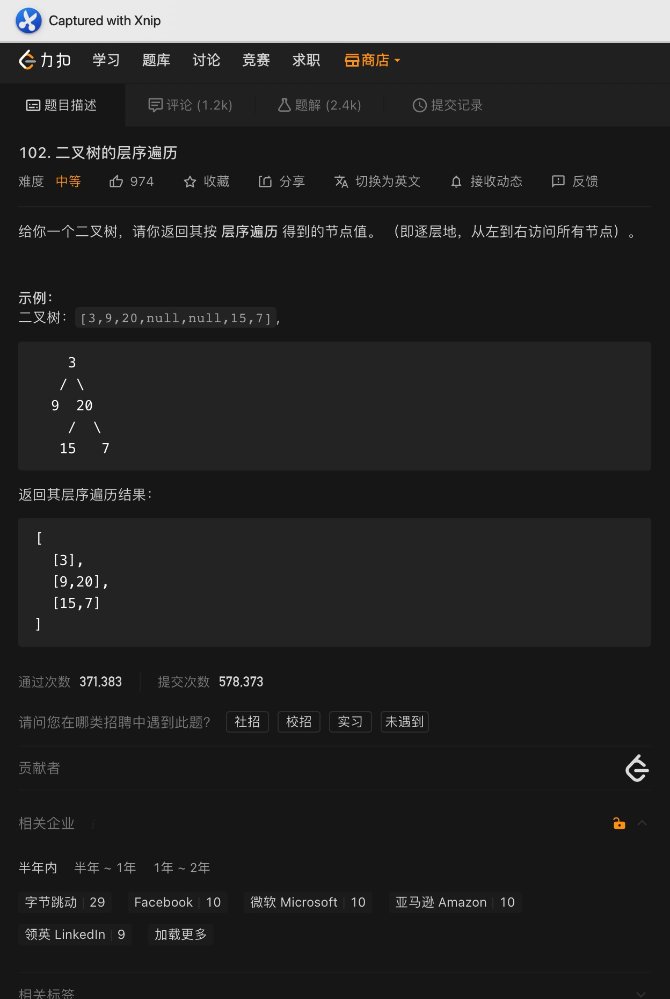
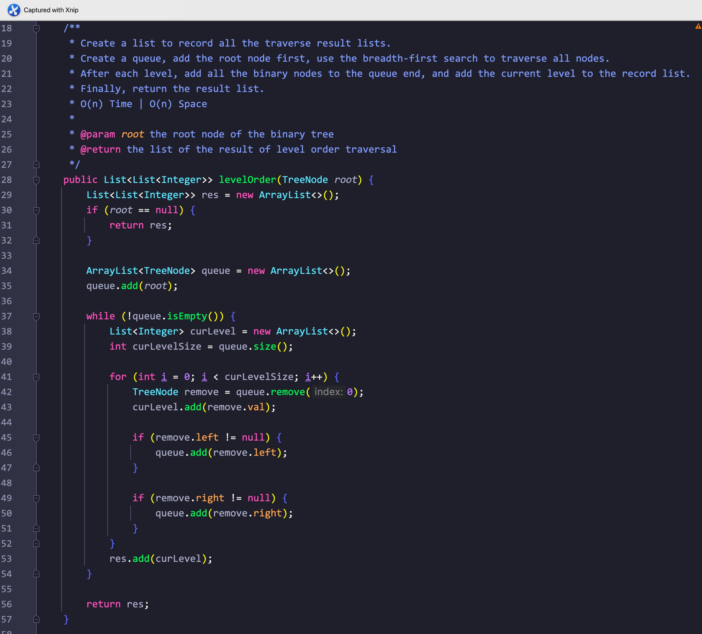
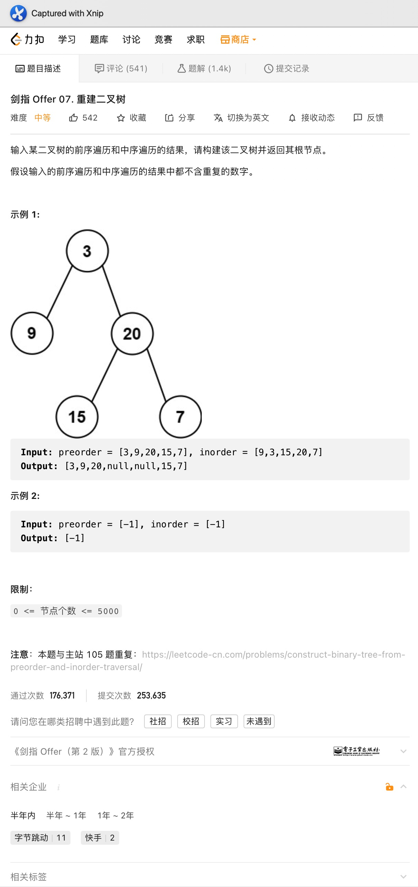
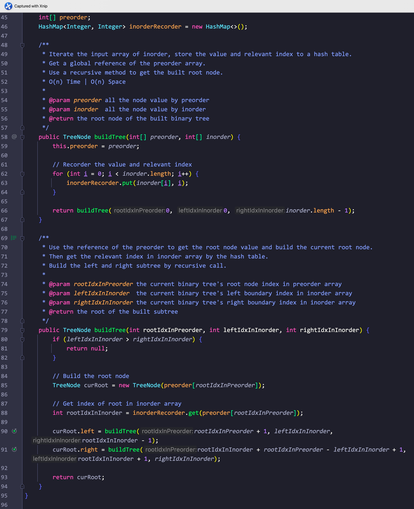
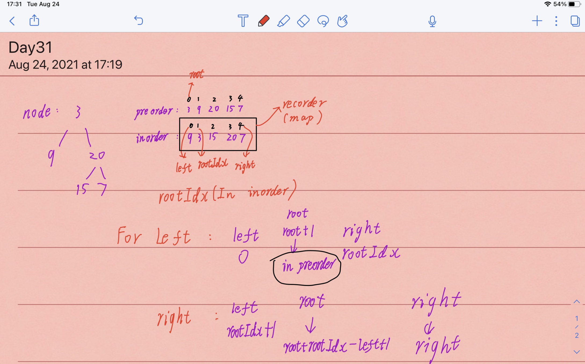

# Day31

## Tag: BFS, Binary Tree

题意:

给你一颗二叉树，请你返回其层序遍历的结果(每层结果都保存为一个集合)

思路:

- 对二叉树层序遍历其实就是对二叉树进行广度优先搜索，所以我们使用广度优先即可
- 创建一个队列，每次都将当前层的节点添加到队列中，以下进入循环，条件为队列不为空
- 遍历当前队列所有元素(到当前为队列尾部为止，即只遍历所有的老元素)，记录在当前层集合中后删除
- 获取队列中每个元素对应的下一层节点，并将它们都添加到队列尾部
- 将记录老元素的当前层集合添加到结果集合中

实现(Java):

- 创建一个结果集合res，如果根结点为null，则直接返回这个空集合
- 创建一个队列用来记录当前层的节点
- 将根节点添加到队列中
- 如果队列不为空，则进行以下循环:
- 创建一个集合用来记录当前层的所有数值
- 获取队列当前的长度curLevelSize用于遍历
- 遍历curLevelSize次，确保只遍历到所有的老元素
- 将老元素从头开始删除，并用当前层集合记录下每个老元素对应的值
- 将每个老元素的左右子结点添加到队列中
- 最后将记录当前层的集合添加到结果集合中
- 循环后返回结果集合res

复杂度:

- 我们将所有的节点都遍历了一次，所以时间复杂度为O(n)
- 我们创建的集合记录了所有的节点，所以空间复杂度为O(n)

****

# Day32

## Tag: Binary Tree, Inorder, Preorder, Build

题意:

两个数组，一个是将通过二叉树前序遍历的顺序记录下的所有节点的值，另一个是将二叉树中序遍历记录下的所有节点的值，请你根据这两个数组将这颗二叉树重建，并返回它的根节点

思路:

- 首先需要明确前序遍历的顺序: 根节点 -> 左子树 -> 右子树
- 所以前序遍历数组preorder的第一个值一定为二叉树的根节点
- 对于中序遍历有: 左子树 -> 根节点 -> 右子树
- 那么，我们完全可以先通过前序遍历数组preorder找到根节点，之后在中序遍历数组inorder中定位根节点的位置
- 那么在中序遍历数组中，位于根节点之前的所有元素即为左子树的元素，后面则全是右子树的元素了
- 至此，我们成功的划分出了根节点、左子树、右子树的范围
- 在构建左右子树的时候又有如下规律:
- 在前序遍历数组中，左子树的根节点一定在根节点的后一位
- 在中序遍历数组中，左子树的左边界一定为0，左子树的右边界一定为根节点的左边一位(参照中序遍历的顺序)
- 在前序遍历数组中，右子树的根节点一定在左子树之后，所以我们需要构造出左子树的长度即:
- 根节点在中序遍历数组中的索引 + 根节点在前序遍历数组中的索引 - 左边界，最后 + 1即为左子树根节点在前序遍历数组中的位置
- 在中序遍历数组中，右子树的左边界在根节点的右边一个位置，右边界则不变
- 将以上步骤归为一个递归方法中，设置终止条件为: 子树左边界 > 子树右边界
- 最后返回构造的节点即可

实现(Java)

- 为了快速获取根节点在中序遍历数组中的索引位置，我们需要创建一个hash表，又因为原方法的方法签名不适合用作递归，为了在两个方法中都能使用，我们需要将该hash表设置为一个全局变量
- 为了在两个方法中都能获取前序遍历相关的元素，我们需要将前序遍历数组也设置为全局变量
- 在参数为两个数组的方法中，将前序遍历数组的引用传递给全局变量preorder，遍历一次中序遍历数组inorder，记录其中的值和对应的索引值于全局变量inorderRecorder中
- 运用方法重载，调用同名方法buildTree，其参数为: 根节点在前序遍历中的索引、根节点对应子树在中序遍历中左边界的索引、根节点对应子树在中序遍历中右边界的索引。这里我们先传入(0, 0, inorder.length - 1)
- 接下来是重载方法buildTree:
- 首先是终止条件: 如果左边界索引 > 右边界索引，则返回null
- 之后根据传入的根节点索引在前序遍历中，获取当前根节点的值，并以此构建一个节点
- 通过根节点的值在hash表"inorderRecorder"中获取根节点在中序遍历中的索引值(用来获取构建左右子树的相关索引)
- 按照上述的思路递归调用本方法，构建左右子树
- 最后返回构建的节点

复杂度:

- 我们遍历了所有的节点，并遍历了一次中序遍历数组用于存储信息到hash表中，所以时间复杂度为O(n)
- 我们创建了一个hash表来记录对应关系，为了构建答案我们也创建了一颗具有n个节点的树，至此我们消耗了2n的空间，最后递归调用的次数取决于树的深度d，所以空间复杂度为O(n)

拓展:

- 该题目同leetcode"105. 从前序与中序遍历序列构造二叉树"

