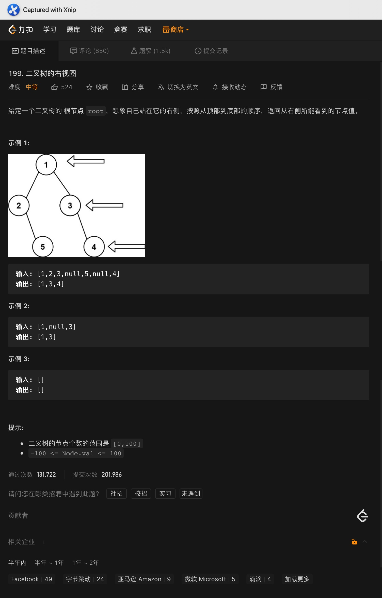
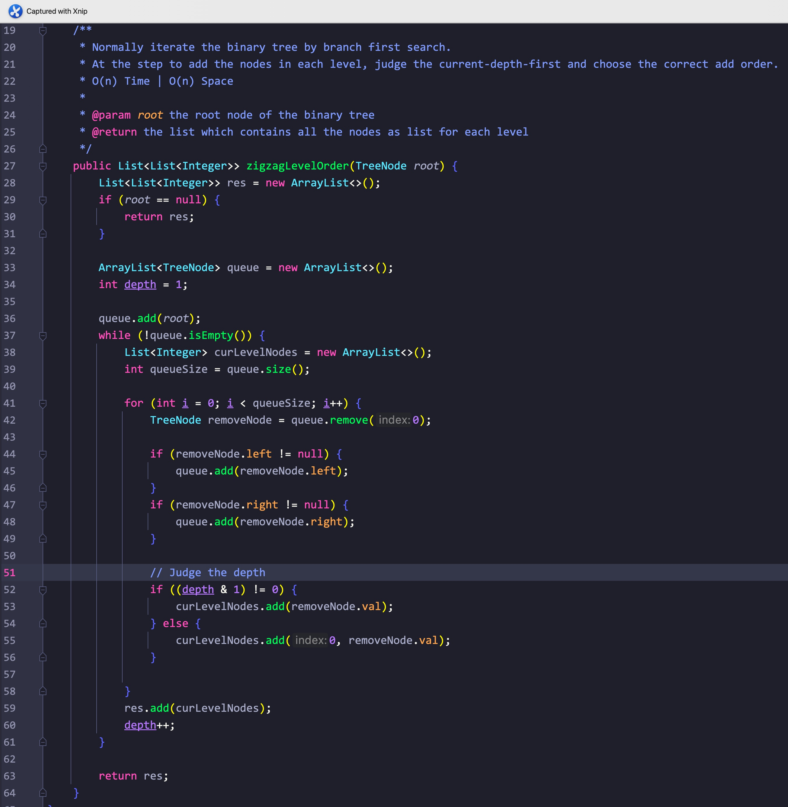
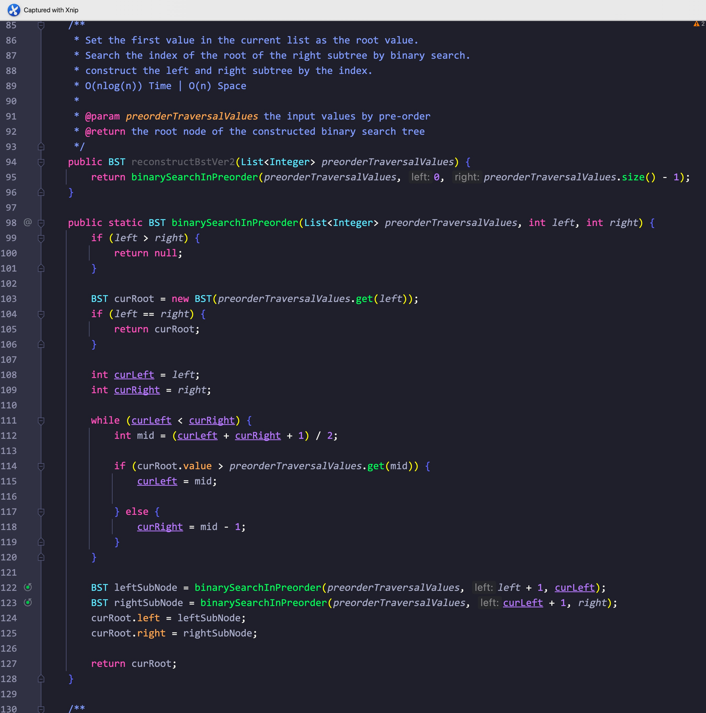

# Day31

## Tag: BFS, Binary Tree

题意:

给你一颗二叉树，请你返回其层序遍历的结果(每层结果都保存为一个集合)

思路:

- 对二叉树层序遍历其实就是对二叉树进行广度优先搜索，所以我们使用广度优先即可
- 创建一个队列，每次都将当前层的节点添加到队列中，以下进入循环，条件为队列不为空
- 遍历当前队列所有元素(到当前为队列尾部为止，即只遍历所有的老元素)，记录在当前层集合中后删除
- 获取队列中每个元素对应的下一层节点，并将它们都添加到队列尾部
- 将记录老元素的当前层集合添加到结果集合中

实现(Java):

- 创建一个结果集合res，如果根结点为null，则直接返回这个空集合
- 创建一个队列用来记录当前层的节点
- 将根节点添加到队列中
- 如果队列不为空，则进行以下循环:
- 创建一个集合用来记录当前层的所有数值
- 获取队列当前的长度curLevelSize用于遍历
- 遍历curLevelSize次，确保只遍历到所有的老元素
- 将老元素从头开始删除，并用当前层集合记录下每个老元素对应的值
- 将每个老元素的左右子结点添加到队列中
- 最后将记录当前层的集合添加到结果集合中
- 循环后返回结果集合res

复杂度:

- 我们将所有的节点都遍历了一次，所以时间复杂度为O(n)
- 我们创建的集合记录了所有的节点，所以空间复杂度为O(n)

****

# Day32

## Tag: Binary Tree, Inorder, Preorder, Build

题意:

两个数组，一个是将通过二叉树前序遍历的顺序记录下的所有节点的值，另一个是将二叉树中序遍历记录下的所有节点的值，请你根据这两个数组将这颗二叉树重建，并返回它的根节点

思路:

- 首先需要明确前序遍历的顺序: 根节点 -> 左子树 -> 右子树
- 所以前序遍历数组preorder的第一个值一定为二叉树的根节点
- 对于中序遍历有: 左子树 -> 根节点 -> 右子树
- 那么，我们完全可以先通过前序遍历数组preorder找到根节点，之后在中序遍历数组inorder中定位根节点的位置
- 那么在中序遍历数组中，位于根节点之前的所有元素即为左子树的元素，后面则全是右子树的元素了
- 至此，我们成功的划分出了根节点、左子树、右子树的范围
- 在构建左右子树的时候又有如下规律:
- 在前序遍历数组中，左子树的根节点一定在根节点的后一位
- 在中序遍历数组中，左子树的左边界一定为0，左子树的右边界一定为根节点的左边一位(参照中序遍历的顺序)
- 在前序遍历数组中，右子树的根节点一定在左子树之后，所以我们需要构造出左子树的长度即:
- 根节点在中序遍历数组中的索引 + 根节点在前序遍历数组中的索引 - 左边界，最后 + 1即为左子树根节点在前序遍历数组中的位置
- 在中序遍历数组中，右子树的左边界在根节点的右边一个位置，右边界则不变
- 将以上步骤归为一个递归方法中，设置终止条件为: 子树左边界 > 子树右边界
- 最后返回构造的节点即可

实现(Java)

- 为了快速获取根节点在中序遍历数组中的索引位置，我们需要创建一个hash表，又因为原方法的方法签名不适合用作递归，为了在两个方法中都能使用，我们需要将该hash表设置为一个全局变量
- 为了在两个方法中都能获取前序遍历相关的元素，我们需要将前序遍历数组也设置为全局变量
- 在参数为两个数组的方法中，将前序遍历数组的引用传递给全局变量preorder，遍历一次中序遍历数组inorder，记录其中的值和对应的索引值于全局变量inorderRecorder中
- 运用方法重载，调用同名方法buildTree，其参数为: 根节点在前序遍历中的索引、根节点对应子树在中序遍历中左边界的索引、根节点对应子树在中序遍历中右边界的索引。这里我们先传入(0, 0, inorder.length - 1)
- 接下来是重载方法buildTree:
- 首先是终止条件: 如果左边界索引 > 右边界索引，则返回null
- 之后根据传入的根节点索引在前序遍历中，获取当前根节点的值，并以此构建一个节点
- 通过根节点的值在hash表"inorderRecorder"中获取根节点在中序遍历中的索引值(用来获取构建左右子树的相关索引)
- 按照上述的思路递归调用本方法，构建左右子树
- 最后返回构建的节点

复杂度:

- 我们遍历了所有的节点，并遍历了一次中序遍历数组用于存储信息到hash表中，所以时间复杂度为O(n)
- 我们创建了一个hash表来记录对应关系，为了构建答案我们也创建了一颗具有n个节点的树，至此我们消耗了2n的空间，最后递归调用的次数取决于树的深度d，所以空间复杂度为O(n)

拓展:

- 该题目同leetcode"105. 从前序与中序遍历序列构造二叉树"

****

# Day33

## Tag: Binary Tree, Right View, Recursive, BFS

题意:

给你一颗二叉树，请你找出其中所有只能从右边"看到"的节点值，并返回包含所有结果的集合

思路1:

- 这里有一个误区，从示例图片上看，好像我们只需要将所有的右节点对应的值都添加到集合中即可
- 如果真是这样的话一个循环就能解决，但事实上没这么简单: 万一一棵树某些层级没有右节点只有左节点呢？
- 那么所谓的能从右边"看到"的节点就变成了左节点了(没有了右节点的遮挡)
- 怎么转换为code呢？其实所谓能从右边"看到"的节点，其实就是每层中处于最右边或者说从左到右的最后一个节点
- 这样就很明确了，我们需要将每一层中的最后一个节点都添加到结果集合中，这样就需要我们按照每层的顺序遍历整颗树
- 按照每层的顺序？这不就是层序遍历吗，参考一下Algorithm Day31不就行了？轻松秒杀～

实现1(Java):

- 创建一个集合来记录所有的"右视角"节点
- 再创建一个队列来记录当前层的所有节点
- 先将根节点添加到队列中，之后便是BFS的过程:
- 进入循环，条件为队列不为空，首先获取队列当前的长度queueSize
- 循环queueSize次，确保删除所有的老元素，添加每个老元素对应的左右子结点
- 最后当索引值等于queueSize - 1时意味着遍历到了当前层的最后一个元素，将其对应的值添加到结果集合中即可
- 结果循环后返回结合集合

复杂度1:

- 我们遍历了一次所有的节点，所以时间复杂度为O(n)
- 最后的结果集合记录了所有的右视角节点，其最长为n(形如链表)，所以空间复杂度为O(n)

思路2:

- 通常我们遍历二叉树都会使用递归的方式来处理左右子结点
- 这里我们同样采用递归
- 在每层递归中都记录下当前层级的深度，将其与结果记录集合的长度相比较
- 由于每一层中只有一个"右视角"节点，所以如果深度与记录的集合长度相同
- 则说明当前层级还没有记录"右视角"节点，那么我们只需要保证第一个记录的节点为"右视角"节点即可
- 为了保证第一个节点为右视角节点，我们在递归左右子树时自然需要从右子结点开始，而每次递归后都需要将深度自增，代表该层级已经记录了右视角节点

实现2:

- 创建一个结果集合来记录所有右视角节点的值
- 通过一个递归方法来获取所有的右视角节点值
- 首先传入根节点，深度0，结果集合res
- 递归方法中，首先判断深度和结果集合长度的关系，如果相等则说明当前节点是当前层级第一个添加的节点，将当前节点对应的值添加到结果集合中
- 递增深度值，对左右子结点递归调用本方法

复杂度2:

- 我们遍历了所有的节点，所以时间复杂度为O(n)
- 结果集合记录了所有的右视角节点，而递归调用占用的栈空间取决于树的层级，所以空间复杂度为O(n)

****

# Day34

## Tag: Binary Tree, BFS, Level Traversal

题意:

给你一颗二叉树，请你按照锯齿形的顺序返回所有节点进行层序遍历的结果(锯齿顺序即奇数层从左到右，偶数层从右到左)

思路:

- 二叉树的层序遍历其实就是BFS，这一点我们再清楚不过，但问题是怎么处理每一层使其达到锯齿层序遍历的顺序呢？
- 因为锯齿的方向与层数相关，所以我们在记录每一层之前，需要先行判断层数的奇偶来确定添加的顺序，是奇数则添加到最后，否则就添加到最前面

实现(Java):

- 整体和层序遍历差不多，参考Algorithm Day31，只是多了一个深度depth而已
- 在添加每个节点前都需要判断深度depth的奇偶，按照奇偶添加元素到开头或者结尾

复杂度:

- 我们遍历了所有的节点，所以时间复杂度为O(n)
- 我们记录了所有的节点，所有空间复杂度为O(n)

拓展:

- 在记录每一层的节点值时，我们最好使用LinkedList即链表，如果使用List的话，每次将元素添加的开头的用时都为O(n)

****

# Day35

## Tag: Binary Tree, Iterate

题意:

给你一个二叉树，请你判断它是否对称

思路1:

- 想要解决该题目，就需要找到比较的方法规律
- 在题目示例中，我们可以发现：对于第二层的两个节点，左节点的右子结点等于右节点的左子结点，反之亦然
- 很明显，每一层都能运用这个规律，那么我们就可以使用递归了
- 终止条件为两节点的值不同，或者两个节点不都存在(只有一个节点存在自然不对称返回false，都不存在说明已经遍历完了整颗树或者root为null，返回true)

实现1(Java):

- 将根节点的左右子结点传入一个递归方法中
- 在该递归方法中，我们首先比较两节点是否都为null，是则返回true
- 之后判断是否有一个为null，有则自然不对称，返回false
- 最后判断两节点的值
- 返回值则递归调用本身，此时参数为leftNode.rigth, rightNode.left和leftNode.left, rightNode.right

复杂度1:

- 我们递归遍历了所有的节点，所以时间复杂度为O(n)
- 我们递归调用占用的栈空间取决于树的高度，所以空间复杂度为O(n)

思路2:

- 参照一中的方法，我们为何不使用BFS迭代呢？每次判断后都按照镜像顺序将子结点添加到队列中
- 每次取出前两个队列进行比较

实现2(Java):

- 创建一个队列，将节点值添加两次到该队列中
- 进入循环，每次取出前两个节点，如果取出的节点都为null，则直接跳过
- 如果其中一个为null或者两节点的值不同，则返回false
- 以上判读通过后按照对称的顺序将两节点的子节点添加到队列中
- 循环后返回true

复杂度2:

- 我们遍历了所有的节点，所以时间复杂度为O(n)
- 我们使用队列存储了所有的节点，所以空间复杂度为O(n)

****

# Day36

## Tag: Common Ancestor

题意:

给你一个二叉树和两个节点值，请你在该二叉树中找出这两个节点值的最近公共祖先节点

思路:

- 首先需要明确什么是祖先，对于一个节点k，如果它的子结点或者它本身等于节点q，则k是q的祖先节点
- 对应的如果q和p都等于或者被包含于k和k的子结点中，则k是q和p的公共祖先节点
- 那么最近公共祖先是什么呢？即在k是q和p公共祖先的前提下，k的左右子结点不为q和p的公共祖先
- 由于每个节点都可能是答案，所以我们需要把整颗树遍历一次
- 然而从定义可以看出，我们需要判断每个节点的左右子树是否存在目标节点，所以需要对一边进行遍历判断
- 这样的顺序便是先序遍历/DFS了
- 最后我们对左右子树的返回值进行判断，两个返回值自然有四种情况:
- 如果返回值都不为null，则说明目标值分属两侧，则返回root即可
- 如果都为null，则说明没有找到目标值，自然返回null
- 如果其中一个为null，则说明两个节点都在不为null的一边，则返回不为null的那边即可

实现(Java):

- 首先对根节点进行判断，如果其为null/或者等于其中一个目标节点，则返回root
- 之后递归调用本方法，判断左右子树是否存在目标节点
- 之后判断两边的返回值，如果都为null，则直接返回null
- 如果有一边为null，则返回另一边
- 否则返回root(目标节点分属两边)

复杂度:

- 我们遍历了所有的节点，所以时间复杂度为O(n)
- 我们递归调用占用的栈空间取决于树的高度，所以空间复杂度为O(n)

****

# Day37

## Tag: Binary Search Tree, Common Ancestor

题意:

给你一颗二叉搜索树，和两个目标节点，请你找出树中两个节点的最近公共祖先

思路1:

- 求最近公共祖先其实就是昨天的题目，所以我们直接照搬就能解决问题，这里不再赘述

思路2:

- 与昨天的题目不同的是，这里给出的是一颗二叉树搜索树，所以我们可以利用二叉搜索树的特性来解决问题
- 二叉搜索树的特性如下:
- 根节点的值大于左子树中所有的节点值，根节点的值小于右子树中所有的节点值
- 借用这个特性，我们从根节点开始，将节点值与两个目标值进行比较，如果大于两个目标值则更新根节点为左子树节点
- 如果小于则更新为右子树节点，直到更新的节点值不满足上述两个条件后，该节点则为我们需要的答案

实现2(Java):

- 从根节点出发，比较当前节点值与两个目标节点的值
- 如果当前节点值大于两个目标节点，则更新当前节点为其左子结点
- 如果小于则更新为当前节点的右子结点
- 如果上述都不满足，则直接返回当前节点

复杂度2:

- 最坏情况下，我们需要遍历所有的节点，所以时间复杂度为O(n)
- 我们没有创建任何变量，所以空间复杂度为O(1)

****

# Day38

## Tag: Binary Search Tree, Recursive Call

题意:

给你一颗二叉搜索树，和一个目标值，请你找出树中最接近该目标值的节点值

思路1:

- 既然是找最接近的，那自然需要我们逐个比较每个节点，又因为这是一棵二叉搜索树，所以我们可以利用它的性质
- 如果当前的节点值小于目标值，则更新节点为其右子结点，大于则更新为左子结点
- 相等则直接返回记录的最近值
- 在此之前需要判断并更新记录的最近值

实现1(Java):

- 我们需要创建一个变量来记录最近值，还需要一个BST来表示当前的节点
- 进入循环，条件为当前的节点不为null
- 如果当前的节点值比我们记录的最近值还要"靠近"目标值的话，则更新最近值
- 之后判断当前节点值与目标值的大小关系，更新为对应的子结点或者直接返回

复杂度1:

- 最坏时我们需要遍历所有的节点，所以时间复杂度为O(n)
- 我们创建的变量个数为常量级，所以空间复杂度为O(1)

思路2:

- 按照前一种方法，我们可以通过递归的方式来比较节点与目标值，并更新最近值
- 同方法1一样，但把更新当前节点的步骤换为返回递归调用左右子结点即可

复杂度2:

- 最坏时我们需要遍历所有的节点，所以时间复杂度为O(n)
- 递归调用的栈空间取决于树的高度，所以空间复杂度为O(1)

****

# Day39

## Tag: Binary Search Tree, Mid-order Traversal

题意:

给你一颗二叉树，请你判断它是否为一颗二叉搜索树

思路1:

- 根据二叉搜索树的定义可以看出:
- 左节点值 < 根节点 < 右节点值
- 这个顺序不刚好是中序遍历的顺序吗？
- 所以我们可以将所有的节点值通过中序遍历一次，并通过这个顺序判断所有的节点值是否严格单增
- 如果是单增则说明该二叉树为二叉搜索树

实现1(Java):

- 创建一个集合来记录中序遍历的节点值
- 将二叉树进行一次中序遍历，将所有的值都记录到该集合中
- 遍历该集合，比较两个相邻的值，如果不是单调递增的话，则直接返回false

复杂度1:

- 我们遍历了一次整颗树，又遍历了一次该集合，所以时间复杂度为O(n)
- 我们创建了一个集合来记录所有的节点值，我们递归调用的栈空间取决于树的高度，所以空间复杂度为O(n)

思路2:

- 再次强调二叉搜索树的特性:
- 每个节点的左节点值小于该节点，右节点则大于该节点
- 只要对每个节点都做出如上判断即可

实现2(Java):

- 将根节点传入一个递归方法中，该方法记录当前的节点和其上一个节点(其为左节点则记录比他大的值，为右则记录比他小的值)
- 其中如果有一个节点的值小于其对应的最小值或者大于其对应的最大值，则说明不符合二叉搜索树的规则，返回flase

复杂度2:

- 我们遍历了一次所有的节点，所以时间复杂度为O(n)
- 我们递归调用的栈空间为二叉树的高度，所以空间复杂度为O(n)

****

# Day40

## Tag: Binary Search Tree, Pre-order, In-order, Post-order

复杂度:

- 我们遍历了所有的节点，所以时间复杂度为O(n)
- 我们存储了遍历的结果，所以空间复杂度为O(n)

面试:

- 这仨都不会写，面二叉树就等着G吧

****

# Day41

## Tag: Binary Search Tree, Recursive Call

题意:

给你一个递增的数组，请你通过这个数组构建一个高度最小的二叉搜索树

思路1:

- 同样的，明确一个二叉搜索树的节点规律: 左节点 < 根节点 < 右节点
- 也就是说根节点为中间值，这不刚好就是这个数组中间位置的值吗？
- 所以我们先获取中间的索引值，再获取中间值，将其作为根节点即可
- 获取中间索引后，我们就可以将整个数组从中间索引位置划分为两个部分
- 前面为左子树，后面为右子树
- 左右范围内的数按照相同的方法可以再次进行划分

实现1(Java):

- 传递该数组和一个空节点，并传递该数组的起始和结束索引到一个递归方法中 
- 判断起始索引和结束索引的大小，越界则直接返回null
- 获取当前范围的中间索引位置，获取当前的中间值
- 判断当前根节点是否为null，不是则判断根节点值与当前中间值的大小关系，添加其到对应的左右子结点，否则直接将其作为根节点的值
- 之后递归调用本方法来构建左右子树
- 最后返回根节点即可

复杂度1:
- 我们通过中间索引遍历了数组中所有的值，所以时间复杂度为O(n)
- 我们递归调用的栈空间取决于构建出的树的深度，其与数组长度n有关，所以空间复杂度为O(n)

思路2:
- 同方法一一样，我们需要先找出中间值作为根节点值
- 不一样的是，既然我们已经分出了左右子树的范围，那为什么还要判断大小呢？直接按顺序构造左右子树不就好了？

实现2:
- 将实现1中的比较步骤去掉，不传入当前的根节点而是直接构造左右子结点即可

复杂度2:
- 我们将所有的值都遍历了一次，所以时间复杂度为O(n)
- 我们递归调用的栈空间与数组的长度相关，所以空间复杂度为O(n)

****

# Day42

## Tag: Binary Search Tree, Inorder Traverse

题意:

给你一颗二叉搜索树和一个数字k，请你返回其中第k大的数

思路1:

- 第k大也就是需要对这颗二叉树进行排序，而排序自然需要遍历这颗树
- 诶！对二叉搜索树中序遍历的结果不就是升序排列吗？
- 我们要找的数字就是结果中倒数第k个数呀！

实现1(Java):

- 创建一个列表inorderTraversalList来记录中序遍历的节点值
- 对二叉树进行中序遍历，并将所有的节点值记录到列表中
- 返回索引值为list.size() - k的值即为结果

复杂度1:

- 我们整颗树遍历了一次，所以时间复杂度为O(n)
- 我们创建了一个列表来存储所有的节点，所以空间复杂度为O(n)

思路2:

- 通过中序遍历，我们得到的是所有节点值升序排列的结果，如果我们将左右节点的递归顺序调换一下，不就能得到降序结果了吗

****

# Day43

## Tag: Binary Search Tree, Stack, 

题意:

给你一颗二叉搜索树前序遍历的结果数组/集合，请你通过它重建起该二叉搜索树

思路1:

- 对于前序遍历，无非分为根节点、左子树、右子树三个部分而已
- 根节点就是前序遍历的第一个数字，而对于二叉搜索树而言，右子树的根节点就是根节点后第一个大于它的数值
- 所以我们只需要从根节点之后遍历一次该前序遍历数组/集合，便能找到右子树的根节点了，继而将前序遍历数组/集合分为左右子树
- 对于左右子树的部分，我们使用同样的步骤可以再次进行划分，每次左右子树的左右边界都是(根节点索引 + 1, 右子树根节点索引 - 1)和(右子树根节点, 前序遍历数组/集合末尾索引)
- 所以子树的构造使用递归即可

实现1:

- 如果参数为数组，我们需要重新构造一个递归方法，传入前序遍历数组和起始结束索引，如果是集合则不用
- 如果左右大小改变则直接返回null，将参数中的数组/集合中的第一个元素作为根节点的值以构建根节点
- 遍历一次当前数组/集合来搜寻右子树的根节点值索引
- 找到后递归调用本方法，如果是数组则传入前序遍历数组和两子树的左右边界
- 如果是集合则直接返回subList的结果，subList的参数为左右子树的边界

复杂度1:

- 我们每次查找当前树的右子树根节点索引的总花费为n，而递归调用的花费也为n，所以时间复杂度为O(n^2)
- 我们递归调用的栈空间与节点数有关，我们重建了每个节点，所以空间复杂度为O(n)

思路2:

- 在方法一中，我们每次都通过顺序遍历的方式来查找右子树的根节点索引，能不能换一种高效的方法呢？
- 这里我们将顺序遍历改为二分法就能大幅缩短时间了

实现2:

- 将实现1中顺序遍历搜寻右子树根节点索引的步骤变为二分法即可，其余不变

复杂度2:

- 我们改为二分后，搜寻的花费变为log(n)，所以时间复杂度变为O(nlog(n))
- 空间复杂度不变，所以为O(n)

思路3:

- 能不能简化为O(n)呢？即只遍历一次？
- 这里我们可以借助栈
- 创建根节点后将其压入一个栈中
- 从根节点的下一个索引位置开始遍历，比较当前节点的值和栈顶元素的值
- 如果当前节点值大于栈顶元素，则将栈顶元素弹出，直到栈顶元素较大，或者栈为空(弹出了根节点)
- 记录下最后一个弹出的元素(最后一个弹出的元素为当前元素的父节点)，比较最后一个元素与当前元素的值，将当前元素添加为对应的左右节点
- 将当前元素入栈，使得它作为新的栈顶元素参与后续的比较

实现3:

- 创建一个栈，通过前序遍历的第一个元素创建根节点，并将其压入栈中
- 从根节点索引的后一个位置开始遍历前序遍历结果
- 比较当前节点值和栈顶元素值，如果大于且栈不为空则弹出栈顶的元素
- 将最后弹出的元素作为当前节点值的父节点，将当前节点设置为对应的左右子结点
- 将当前节点入栈，使其作为新的栈顶元素

复杂度3:

- 我们只遍历了一次该中序遍历数组/集合，所以时间复杂度为O(n)
- 我们创建了栈并创建了每个节点，所以空间复杂度为O(n)

****

# Day44

## Tag: Binary Search Tree, Construct

题意:

给你一个递增的数组，请你根据它创建一个二叉搜索树，且必须是高度平衡二叉树(左右子树的高度差不大于1)

思路:

- 虽然有高度平衡二叉树的限制，但我们其实只需要正常的构建左右子树就行了
- 根据二叉搜索树的性质，在数组居中位置的值刚好就是根节点的值，以此我们可以将数组划分为左右子树
- 将这两个范围内的数字重新作为新的数组范围，来构建左右子树即可

实现(Java):

- 另设一个递归方法，其参数为数组、左边界、右边界
- 将左右边界的中间位置作为当前的根节点索引，递归调用本身，传入新的左右边界来构建左右子树
- 最后连接根节点和左右子树即可

复杂度:

- 我们遍历了数组中所有的数值，所以时间复杂度为O(n)
- 我们递归调用的栈空间取决于构建的树的高度，我们构建时使用了二分的方式，所以空间复杂度为O(log(n))

