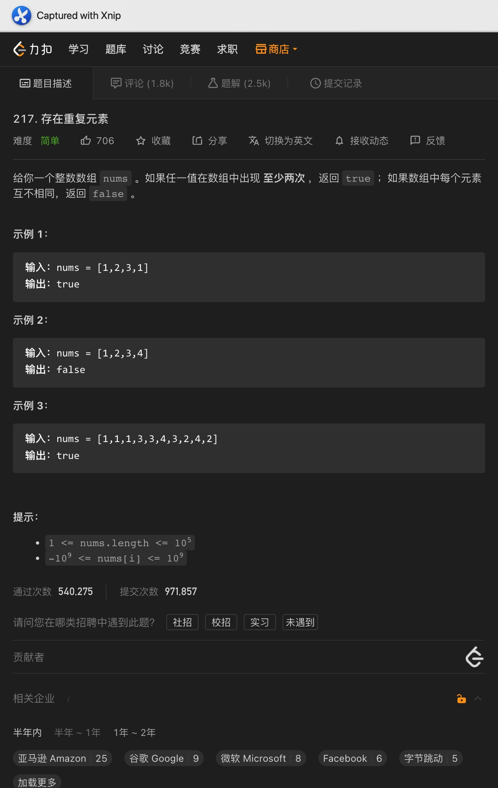
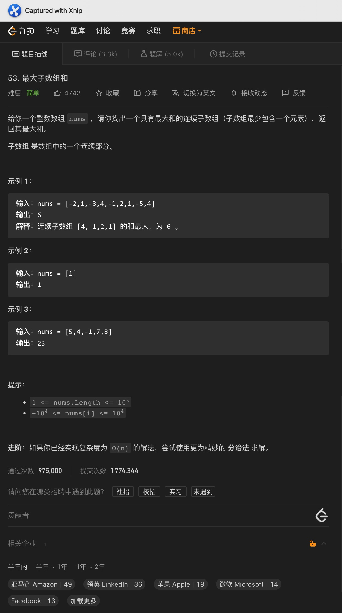
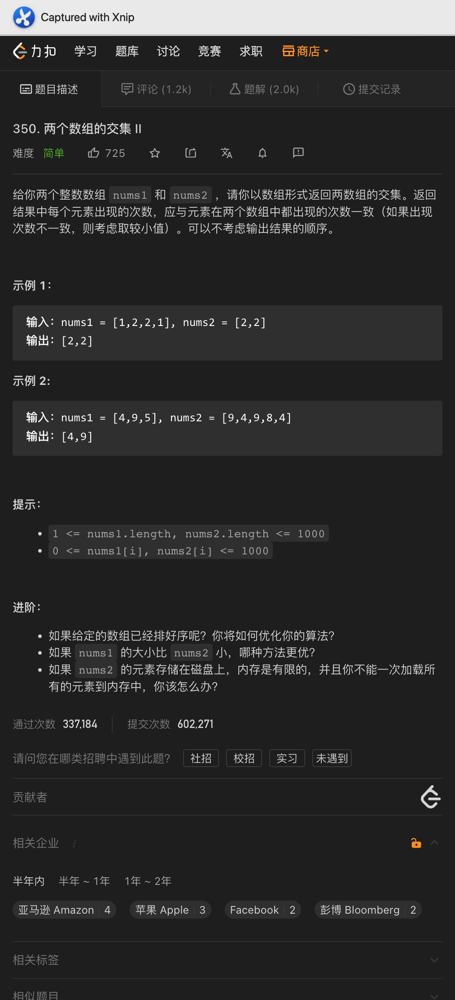
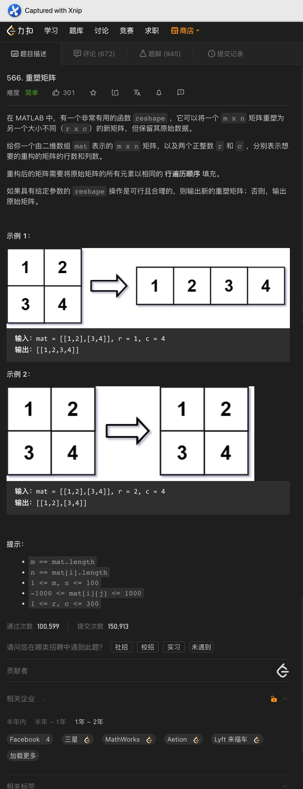
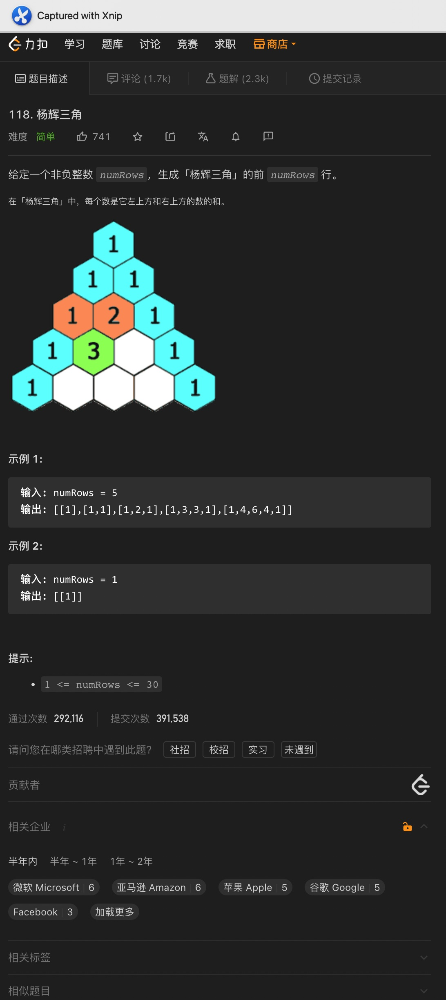

# 一、重复数字




```java
class Solution {
    public boolean containsDuplicate(int[] nums) {
        HashSet<Integer> set = new HashSet<>();
        for (int curNum : nums) {
            if (!set.add(curNum)) {
                return true;
            }
        }

        return false;
    }
}


class Solution {
    public boolean containsDuplicate(int[] nums) {
        Arrays.sort(nums);

        for (int i = 1; i < nums.length; i++) {
            if (nums[i] == nums[i - 1]) {
                return true;
            }
        }

        return false;
    }
}
```

<hr>


# 二、最大子数组和




Code:

```java
class Solution {
    public int maxSubArray(int[] nums) {
        int res = nums[0];
        int curSum = 0;

        for (int i = 0; i < nums.length; i++) {
            curSum += nums[i];

            res = Math.max(curSum, res);
            curSum = Math.max(curSum, 0);
        }

        return res;
    }
}
```

<hr>


# 三、合并有序数组


Code:

```java
public void merge(int[] nums1, int m, int[] nums2, int n) {
  int idx1 = m - 1;
  int idx2 = n - 1;
  int resIdx = m + n - 1;

  while (idx1 >= 0 || idx2 >= 0) {
    if (idx1 == -1) {
      nums1[resIdx--] = nums2[idx2--];
    } else if (idx2 == -1) {
      nums1[resIdx--] = nums1[idx1--];
    } else if (nums1[idx1] > nums2[idx2]) {
      nums1[resIdx--] = nums1[idx1--];
    } else {
      nums1[resIdx--] = nums2[idx2--];
    }
  }
}
```

<hr>


# 四、数组交集2




Code:

```java
class Solution {
    public int[] intersect(int[] nums1, int[] nums2) {
        Arrays.sort(nums1);
        Arrays.sort(nums2);

        int[] res = new int[Math.min(nums1.length, nums2.length)];
        int num1Idx = 0;
        int num2Idx = 0;
        int resIdx = 0;

        while (num1Idx < nums1.length && num2Idx < nums2.length) {
            if (nums1[num1Idx] == nums2[num2Idx]) {
                res[resIdx++] = nums1[num1Idx++];
                num2Idx++;

            } else {
                if (nums1[num1Idx] < nums2[num2Idx]) {
                    num1Idx++;
                } else {
                    num2Idx++;
                }
            }
        }

        return Arrays.copyOf(res, resIdx);
    }
}
```

<hr>


# 五、重塑矩阵




Code:

```java
class Solution {
    public int[][] matrixReshape(int[][] mat, int r, int c) {
        if (mat.length * mat[0].length != r * c) {
            return mat;
        }

        int[][] resShapeArr = new int[r][c];
        int resRow = 0;
        int resCol = 0;

        for (int row = 0; row < mat.length; row++) {
            for (int col = 0; col < mat[0].length; col++) {
                resShapeArr[resRow][resCol++] = mat[row][col];

                if (resCol == c) {
                    resCol = 0;
                    resRow++;
                }
            }
        }

        return resShapeArr;
    }
}
```

<hr>


# 六、杨辉三角




Code:

```java
class Solution {
    public List<List<Integer>> generate(int numRows) {
        List<List<Integer>> res = new ArrayList<>();

        for (int i = 0; i < numRows; ++i) {
            List<Integer> row = new ArrayList<Integer>();
            for (int idx = 0; idx <= i; idx++) {
                if (idx == 0 || idx == i) {
                    row.add(1);
                } else {
                    row.add(res.get(i - 1).get(idx - 1) + res.get(i - 1).get(idx));
                }
            }
            res.add(row);
        }
        return res;
    }
}
```


