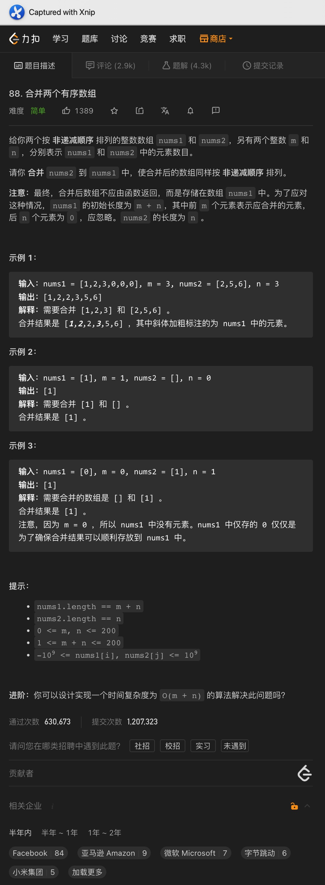

# 一、重复数字


```java
class Solution {
    public boolean containsDuplicate(int[] nums) {
        HashSet<Integer> set = new HashSet<>();
        for (int curNum : nums) {
            if (!set.add(curNum)) {
                return true;
            }
        }

        return false;
    }
}


class Solution {
    public boolean containsDuplicate(int[] nums) {
        Arrays.sort(nums);

        for (int i = 1; i < nums.length; i++) {
            if (nums[i] == nums[i - 1]) {
                return true;
            }
        }

        return false;
    }
}
```

<hr>


# 二、最大子数组和


Code:

```java
class Solution {
    public int maxSubArray(int[] nums) {
        int res = nums[0];
        int curSum = 0;

        for (int i = 0; i < nums.length; i++) {
            curSum += nums[i];

            res = Math.max(curSum, res);
            curSum = Math.max(curSum, 0);
        }

        return res;
    }
}
```

<hr>


# 三、合并有序数组




Code:

```java
public void merge(int[] nums1, int m, int[] nums2, int n) {
  int idx1 = m - 1;
  int idx2 = n - 1;
  int resIdx = m + n - 1;

  while (idx1 >= 0 || idx2 >= 0) {
    if (idx1 == -1) {
      nums1[resIdx--] = nums2[idx2--];
    } else if (idx2 == -1) {
      nums1[resIdx--] = nums1[idx1--];
    } else if (nums1[idx1] > nums2[idx2]) {
      nums1[resIdx--] = nums1[idx1--];
    } else {
      nums1[resIdx--] = nums2[idx2--];
    }
  }
}
```

<hr>


# 四、数组交集2


Code:

```java
class Solution {
    public int[] intersect(int[] nums1, int[] nums2) {
        Arrays.sort(nums1);
        Arrays.sort(nums2);

        int[] res = new int[Math.min(nums1.length, nums2.length)];
        int num1Idx = 0;
        int num2Idx = 0;
        int resIdx = 0;

        while (num1Idx < nums1.length && num2Idx < nums2.length) {
            if (nums1[num1Idx] == nums2[num2Idx]) {
                res[resIdx++] = nums1[num1Idx++];
                num2Idx++;

            } else {
                if (nums1[num1Idx] < nums2[num2Idx]) {
                    num1Idx++;
                } else {
                    num2Idx++;
                }
            }
        }

        return Arrays.copyOf(res, resIdx);
    }
}
```

<hr>


# 五、重塑矩阵


Code:

```java
class Solution {
    public int[][] matrixReshape(int[][] mat, int r, int c) {
        if (mat.length * mat[0].length != r * c) {
            return mat;
        }

        int[][] resShapeArr = new int[r][c];
        int resRow = 0;
        int resCol = 0;

        for (int row = 0; row < mat.length; row++) {
            for (int col = 0; col < mat[0].length; col++) {
                resShapeArr[resRow][resCol++] = mat[row][col];

                if (resCol == c) {
                    resCol = 0;
                    resRow++;
                }
            }
        }

        return resShapeArr;
    }
}
```

<hr>


# 六、杨辉三角


Code:

```java
class Solution {
    public List<List<Integer>> generate(int numRows) {
        List<List<Integer>> res = new ArrayList<>();

        for (int i = 0; i < numRows; ++i) {
            List<Integer> row = new ArrayList<Integer>();
            for (int idx = 0; idx <= i; idx++) {
                if (idx == 0 || idx == i) {
                    row.add(1);
                } else {
                    row.add(res.get(i - 1).get(idx - 1) + res.get(i - 1).get(idx));
                }
            }
            res.add(row);
        }
        return res;
    }
}
```

<hr>


# 七、矩阵置零

 


<hr>


# 八、有效的数独


<hr>


# 九、移除元素


题意:

给你一个数组，一个数字，请你从数组中移除等于这个数字的元素，最后返回处理之后的数组长度


思路:

- 看起来只需要将数组遍历一次后计算不等于目标数的元素个数即可，但其实没这么简单
- 我们还需要将所有的不等于目标数的元素都移动到最后，也就是进行元素的位置交换
- 且为了确保交换后当前位置的元素不为目标数，所以我们还需要在交换后进行判断，直到当前位置的数不等于目标数为止


复杂度:

- 我们遍历了一次输入数组，所以时间复杂度为O(n)
- 我们并未创建额外的空间，所以空间复杂度为O(1)

<hr>


# 十、有序数组的平方


题意:

给你一个有序数组，请你返回由其中所有元素的平方组成的数组


思路:

- 最简单的方法自然是在原数组上将所有元素修改为自身的平方，最后再进行排序即可，但这样做的时间复杂度为O(nlogn)
- 因为数组是有序的，所以在平方后，最大的元素一定在数组的两头，所以我们只需要将两头元素中的较大值作为最大值放到结果数组中的末尾位置即可
- 因此，这里我们需要使用双指针法，从两边向中间推进即可


复杂度:

- 我们遍历了一次输入数组，所以时间复杂度为O(n)
- 我们创建了一个新的数组来记录所有的新元素，所以空间复杂度为O(n)

<hr>


# 十一、螺旋矩阵


题意:

给你一个数字n，请你创建一个n * n的矩阵，其中每个元素从左上角开始顺时针将每个位置的数设置为从1到n ^ 2中的每个数


思路:

- 在遍历的过程中，我们自然需要按照顺时针的顺序来
- 但需要注意的是，我们需要考虑每行/列最后一个位置的元素该由哪个部分负责，为了方便，这里还是将最后一个位置留给下一个部分的起始位置来处理
- 每一圈更新后，我们都需要更新一次其实位置的坐标，以及跳过的边缘元素的数量
- 最后我们还需要判断一下奇数的情况，如果为奇数，则需要单独将中间位置的元素进行更新


复杂度:

- 我们遍历了一次输入数组，所以时间复杂度为O(n ^ 2)
- 我们创建了一个二维数组，所以时间复杂度为O(n ^ 2)


