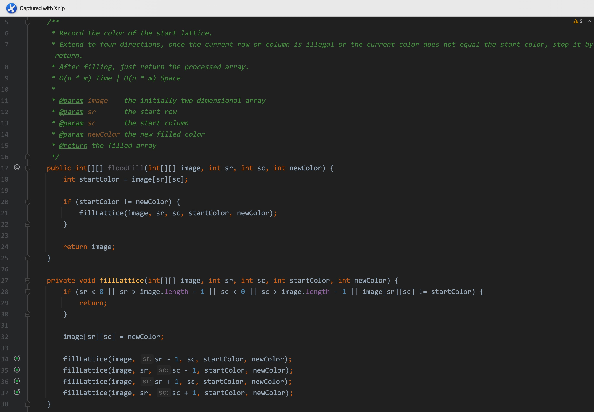
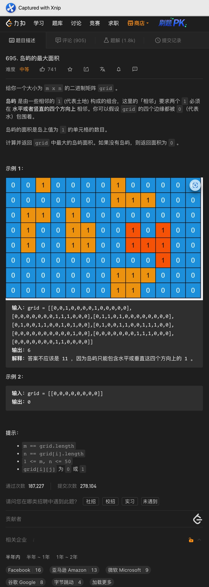
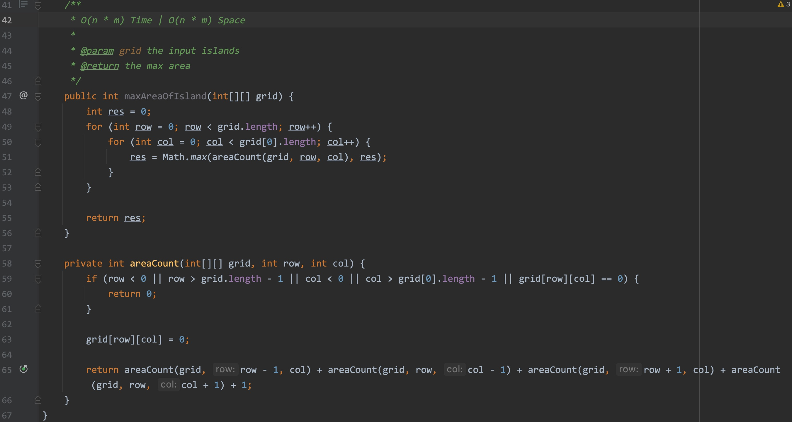
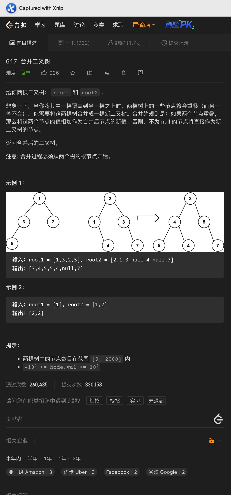
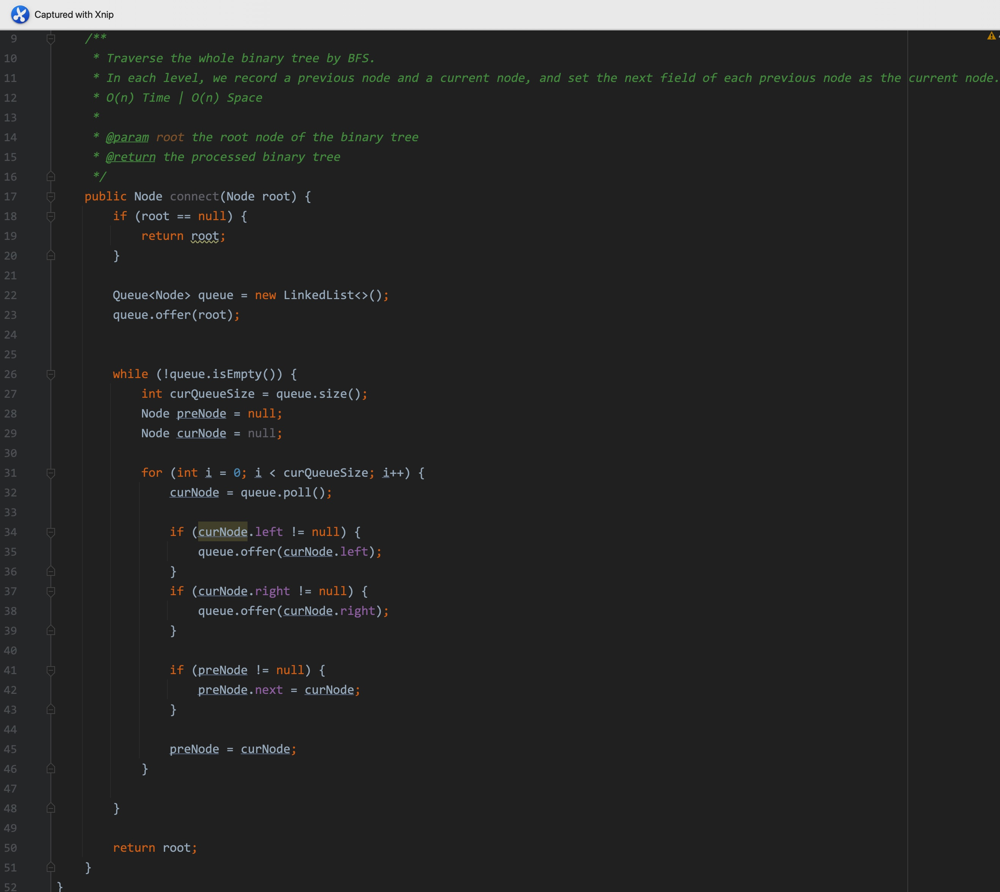

# 一、着色游戏




题意:

给你一个二维数组，再一个二维坐标作为起始坐标，和一个着色的数字，请你将与起始坐标四个方向上颜色相同的网格全部着色为指定的数字


思路:

- 思路其实就是从起始坐标开始向四个方向遍历，如果当前颜色和起始位置相同，则将该位置进行着色
- 在遍历的过程中，如果坐标不合法，或者颜色与起始位置不同，则直接终止


复杂度:

- 我们需要遍历所有的色块，所以时间复杂度为O(n * m)
- 我们遍历的过程中递归调用的栈空间取决于遍历的次数，所以空间复杂度为O(n * m)

<hr>


# 二、岛屿最大面积






<hr>


# 三、合并二叉树




```java
public TreeNode mergeTrees(TreeNode root1, TreeNode root2) {
  if (root1 == null || root2 == null) {
    return root1 == null ? root2 : root1;
  }

  TreeNode curRoot = new TreeNode(root1.val + root2.val);

  TreeNode left = mergeTrees(root1.left, root2.left);
  TreeNode right = mergeTrees(root1.right, root2.right);

  curRoot.left = left;
  curRoot.right = right;

  return curRoot;
}
```

<hr>


# 四、填充右侧节点




题意:

给你一颗完全二叉树，请你将其中每个节点的next指针都指向其下一个右侧节点


思路:

- 很明显，每个next指向的都是其同一层的右侧节点，所以这里可以用BFS
- 只需要维护两个节点变量表示一前一后，将每个prev节点对应的next设置为当前节点即可


复杂度:

- 我们遍历了所有的节点，所以时间复杂度为O(n)
- 我们创建了一个队列来存储所有的节点，所以空间复杂度为O(n)


