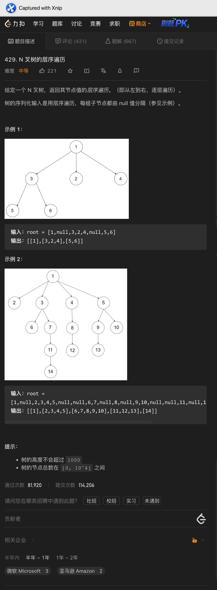
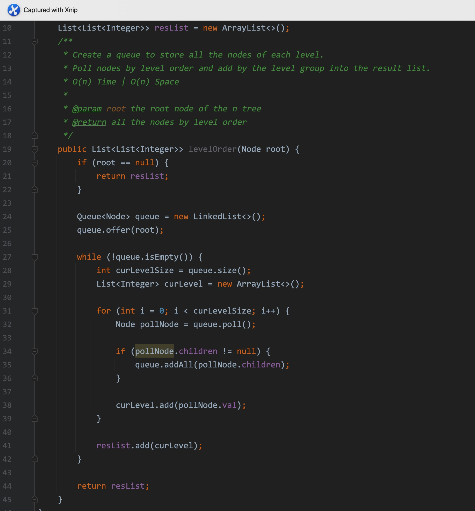
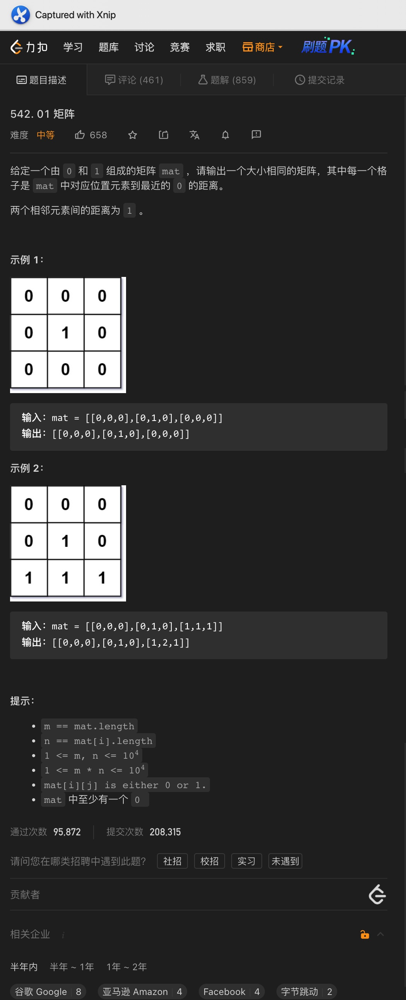
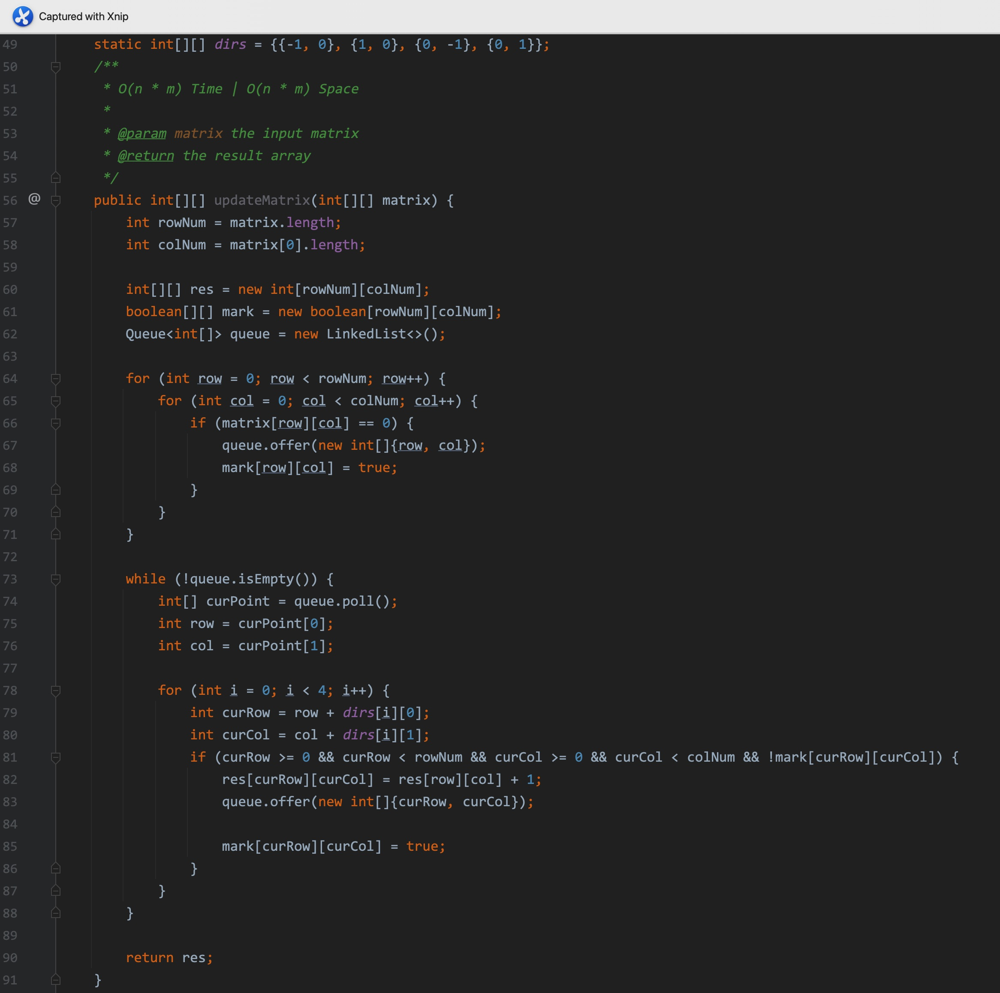
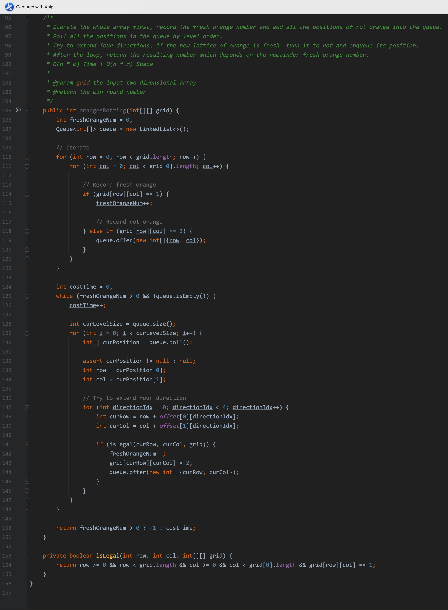

# 一、着色游戏


题意:

给你一个二维数组，再一个二维坐标作为起始坐标，和一个着色的数字，请你将与起始坐标四个方向上颜色相同的网格全部着色为指定的数字


思路:

- 思路其实就是从起始坐标开始向四个方向遍历，如果当前颜色和起始位置相同，则将该位置进行着色
- 在遍历的过程中，如果坐标不合法，或者颜色与起始位置不同，则直接终止


复杂度:

- 我们需要遍历所有的色块，所以时间复杂度为O(n * m)
- 我们遍历的过程中递归调用的栈空间取决于遍历的次数，所以空间复杂度为O(n * m)

<hr>


# 二、岛屿最大面积


<hr>


# 三、合并二叉树


```java
public TreeNode mergeTrees(TreeNode root1, TreeNode root2) {
  if (root1 == null || root2 == null) {
    return root1 == null ? root2 : root1;
  }

  TreeNode curRoot = new TreeNode(root1.val + root2.val);

  TreeNode left = mergeTrees(root1.left, root2.left);
  TreeNode right = mergeTrees(root1.right, root2.right);

  curRoot.left = left;
  curRoot.right = right;

  return curRoot;
}
```

<hr>


# 四、填充右侧节点


题意:

给你一颗完全二叉树，请你将其中每个节点的next指针都指向其下一个右侧节点


思路:

- 很明显，每个next指向的都是其同一层的右侧节点，所以这里可以用BFS
- 只需要维护两个节点变量表示一前一后，将每个prev节点对应的next设置为当前节点即可


复杂度:

- 我们遍历了所有的节点，所以时间复杂度为O(n)
- 我们创建了一个队列来存储所有的节点，所以空间复杂度为O(n)

<hr>


# 五、N叉树层序遍历






题意:

给你一颗N叉树，请你将其中所有的节点以层序遍历的顺序添加到集合中


思路:

- 解决层序遍历最直观的方法就是BFS，即通过遍历每一层的节点将节点按照层级进行分组，最后加入到结果集中即可
- 方法和二叉树的层序遍历一毛一样


复杂度:

- 我们遍历了所有的节点，所以时间复杂度为O(n)
- 我们创建了一个队列来记录所有的节点，所以空间复杂度为O(n)

<hr>


# 六、01矩阵






题意:

给你一个二维数组，其中每个元素只会为1、0两个值中的一个，请你返回一个新的二维数组，其中每个不为0的元素代表对应输入数组中的元素0的最短距离


思路:

- 最基础的思路其实就是从对应的位置开始向四周拓展，这其实就是BFS
- 所以我们需要一个队列来存储对应的起始位置
- 这里我们选择从为0的位置开始，并用一个mark数组来标记已经处理过的以及值为0的元素位置，将所有值为0的元素位置作为一个长度为2的数组放入队列中去
- 将队列中的元素出队，并以出队元素对应的坐标为基准向四周拓展
- 一旦拓展的位置合法且该位置并未处理(值为1，且没有遍历过，通过mark数组即可判断)，则将该位置的值设置为原位置的值+ 1，且将该位置作为新的起点入队，最后标记即可
- 当所有元素出队后，返回该结果数组即可


复杂度:

- 我们遍历了所有的元素，所以时间复杂度为O(n * m)
- 我们用一个队列存储了对应的坐标，所以空间复杂度为O(n * m)


<hr>


# 七、腐烂的橘子




题意:

给你一个二维数组，其中值为0代表空，值为1代表新鲜的橘子，值为2代表腐烂的橘子

每过1分钟后，腐烂的橘子就会使得其四周的橘子腐烂，请你返回所有橘子都腐烂所需的最少时间，如果不能腐烂所有的橘子，则返-1


思路:

- 向四周拓展，没错，又是BFS
- 我们这次依然需要一个队列，不过为了之后便于计算，我们需要统计新鲜橘子的数量，同样的，我们需要在队列中记录腐烂橘子的坐标
- 创建一个变量来记录消耗的分钟数，按照层序遍历的方式遍历每层的坐标
- 在还有新鲜橘子的前提下，将队列中的元素依次出队，从该元素中获取当前腐烂橘子的坐标
- 以该坐标为基准向四周拓展，如果拓展的坐标合法，且当前位置是一个新鲜的橘子，则将其状态变为腐烂、递减当前新鲜橘子的数量并将拓展的坐标作为新的腐烂橘子坐标入队
- 最后，当所有元素出队后或者没有新鲜橘子后，返回结果(根据剩余数量返回对应的值)


复杂度:

- 我们遍历了所有的元素，所以时间复杂度为O(n * m)
- 我们用一个队列存储了对应的坐标，所以空间复杂度为O(n * m)


