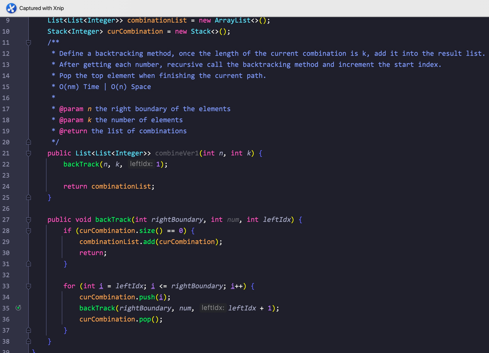
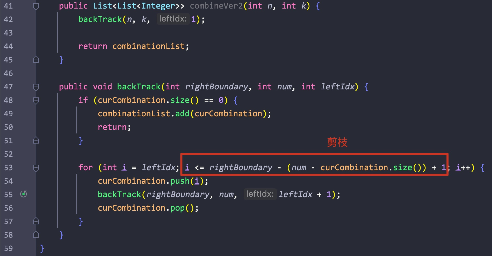

# 一、组合

题意:

给你一个数字n，一个数字k，请你返回从1到n中所有k个数的组合(无序，元素相同的为同一个组合)

思路:

- 回溯第一天，这道题目可以说非常的经典，按照常规思路，可能会想到用多层for嵌套
- 但如果k比较大的话，这种方法就不现实，因此这里可以使用回溯
- 按照图示，其实我们可以将该搜索组合的过程看作是对一颗树进行dfs
- 这里dfs的终止条件为当前组合中元素个数 = k，而每层都需要将之后的每个元素添加到当前组合中进行验证，所以是一个for循环
- 又因为组合是无序的，其中元素相同的组合算做同一个组合，因此元素不能重复使用
- 这里我们可以使用一个idx来标记当前层开始搜索元素的起始位置
- 然而每搜索完一个分支后，我们再转向另一个分支之前必须先删除组合中最后一个添加的元素，这样组合中的元素个数才是正常的

复杂度:

- 我们遍历了整颗树，树的高度为k，每层分支最大为n，所以时间复杂度可以粗略算做O(nm)
- 我们用集合记录了所有的组合，所以空间复杂度为O(n)

剪枝:

- 在每一层的搜索中，如果剩余元素的个数小于我们还需要的元素个数的话，这个分支显然不需要再继续了，可以直接跳过
- 所以在每层的for循环中，我们可以将idx的起始位置改为能成功凑出组合的索引位置即(n - (k - curCombination.size) + 1)，这样我们就完成了剪枝

