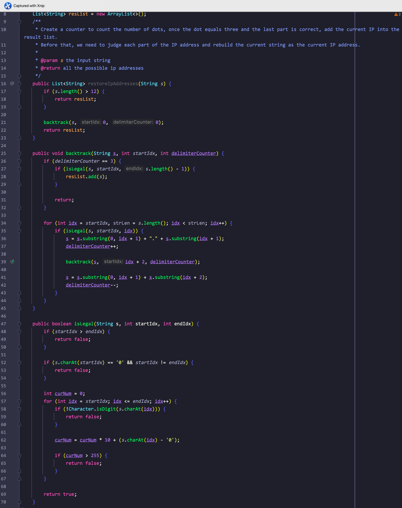
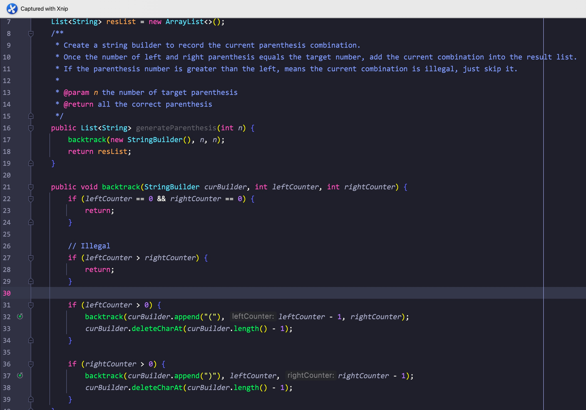

# 一、组合


题意:

给你一个数字n，一个数字k，请你返回从1到n中所有k个数的组合(无序，元素相同的为同一个组合)


思路:

- 回溯第一天，这道题目可以说非常的经典，按照常规思路，可能会想到用多层for嵌套
- 但如果k比较大的话，这种方法就不现实，因此这里可以使用回溯
- 按照图示，其实我们可以将该搜索组合的过程看作是对一颗树进行dfs
- 这里dfs的终止条件为当前组合中元素个数 = k，而每层都需要将之后的每个元素添加到当前组合中进行验证，所以是一个for循环
- 又因为组合是无序的，其中元素相同的组合算做同一个组合，因此元素不能重复使用
- 这里我们可以使用一个idx来标记当前层开始搜索元素的起始位置
- 然而每搜索完一个分支后，我们再转向另一个分支之前必须先删除组合中最后一个添加的元素，这样组合中的元素个数才是正常的


复杂度:

- 我们遍历了整颗树，树的高度为k，每层分支最大为n，所以时间复杂度可以粗略算做O(nm)
- 我们用集合记录了所有的组合，所以空间复杂度为O(n)


剪枝:

- 在每一层的搜索中，如果剩余元素的个数小于我们还需要的元素个数的话，这个分支显然不需要再继续了，可以直接跳过
- 所以在每层的for循环中，我们可以将idx的起始位置改为能成功凑出组合的索引位置即(n - (k - curCombination.size) + 1)，这样我们就完成了剪枝

<hr>


# 二、组合总和3


题意:

给你一个数字n，一个数字k，请你找出所有和为n的k个数字的组合，且组合的数字只能从1到9中取，每个数字只能使用一次


思路:

- 和昨天的题目其实类似，昨天的题目是从1-n，而今天的n就变为了9
- 不同的是这次我们还需要求组合的和，这里我们在回溯方法的参数列表中添加一个int参数表示和即可，其用法类似二叉树求路径和
- 又因为这里多了个和，所以在最后回溯的时候，我们不仅需要将当前组合中的末尾元素去除，还需要将当前和值回退(curSum -= i)


复杂度:

- 参照昨天即可


剪枝:

- 因为同样对组合元素个数有限制，所以这里我们依然可以用同样的方法在for循环的条件上加以限制来进行剪枝
- 该题目因为多了对和值的判断，所以我们还可以在每层开始前就先判断当前和值与目标值的关系，从而进行剪枝

<hr>


# 三、电话号码字母组合


题意:

给你一个从2-9的数字组合，请你返回它能代表的所有字母组合


思路:

- 因为数字和对应的字母之间的对应是参照拨号键盘的，所以我们需要先将它们对应起来，这里我选择使用String数组(Map也可以)
- 同样，我们需要一个回溯方法，每次取其中一个数字，再通过我们创建的String数组获取其对应的字符串
- 再遍历这个字符串，依次添加每个字符到当前组合中直到组合长度符合要求


复杂度:

- 如果对应字符有三个的数字有m个，对应四个字符的有n个，则我们遍历每个组合的用时为3^m^ + 4^n^，所以时间复杂度为O(3^m^ + 4^n^)
- 对应的，空间复杂度为O(m + n)

<hr>


# 四、组合总和


题意:

给你一个数组，一个目标数，请查询出所有和为目标数的组合，数组中的数字可以重复使用


思路:

- 又是排列，所以我们依然需要使用递归的方法列出每种排列，再将符合条件的加入到结果集即可
- 与之前不同的是，这道题目没有限制排列中元素的个数，且元素可以重复使用
- 所以我们设置回溯方法的终止条件变为了curSum == targetSum
- 而元素可以重复使用的话，我们就不再需要限制开始的索引位置了


剪枝:

- 在累加的过程中，一旦当前组合累加后的结果大于目标数，那么这条分支就不会再出现结果了，但前提是这个数组是有序的，这样才能保证后面的数都大于前面的数
- 所以这里我们可以先对数组进行排序，再使用curSum + curNum <= targetSum来剪枝

<hr>


# 五、组合总和2(注意每层起始idx)


题意:

给你一个有重复数字的数组，一个目标数，请你返回其中所有不重复的组合


思路:

- 该题目与昨天的不同之处在于，其中有重复的数字，且索引位置要更新，所以如果直接使用昨天的方法再使用HashSet去重的话，会很浪费时间，所以我们要想办法剪枝
- 这里剪枝的思路是：如果当前候选数是之前分支的子集(即之前已经使用过了)，那么该分支最终的结果一定与之前是重复的，所以应该跳过，在code里体现为

```java
if (idx > startIdx && candidates[idx] == candidates[idx - 1]) {
  continue;
}
```

- 最后再每次递归调用时将startIdx加1即可，其余与昨天的code差不多

<hr>


# 六、分割回文串


题意:

给你一个字符串，请尝试你将其划分为若干个回文子串，最后返回所有的分割组合


思路:

- 该题目可以看作是求所有的子串，只不过要求子串为回文子串而已
- 所以我们可以通过常规的回溯法得出所有的子串，但在添加子串之前判断一下其是否为回文子串即可

<hr>


# 七、IP地址复原




题意:

给你一个由数组组成的字符串，请你尝试将其分割为有效的ip地址，并返回所有可能的分割方案


思路:

- 

- 如果从分割子串的角度来说，这道题目其实就是获取特殊的子串罢了
- 但不同的是，这里我们在判断是否分割完成的条件不能像昨天那样从索引的角度来判断了，而是该从分割的部分来计算
- 这里我们维护了一个变量来计算每个组合中使用的点分割符的数量，如果该数量等于3，则说明已经分割完成，只需要判读一下各个部分是否是正确的ip地址段即可
- 需要注意的是，我们这里是在原字符串的基础上构建ip地址，所以在回溯的时候，因为添加了分割符，所以索引位置应该+2，而不是像往常那样+1

<hr>


# 八、子集


题意:

给你一个数组，请你返回其对应的所有子集


思路:

- 如图所示，该题目其实就是在之前获取组合的基础上进行了简化，之前是添加叶子结点对应的组合，但这里我们需要所有节点上的组合
- 所以我们只需要遍历并添加每个组合即可

<hr>


# 九、子集2


题意:

给你一个有重复数字的数组，请你返回所有不重复的子集


思路:

- 该题目的解法可以由Day216和昨天的子集结合起来得到
- 因为都是子集，所以直接照抄昨天的code，但问题是，今天这个参数数组中有重复数字
- 所以借用Day216的思路，一旦后面的元素是前面元素的子集，且开头数字相同，那么之后获取的子集一定也与之前相同
- 所以出现这种情况的话，说明子集重复了，那么直接跳过即可

<hr>


# 十、递增子序列


题意:

给你一个数组，请你返回其中所有的递增子序列


思路:

- 看起来该题目是一个求子集的问题，只需要排序加回溯就行，但提交几次后就会发现，获取的子序列对应顺序必须和原数组保持一致，所以不能排序
- 那么问题就来了，不能排序？那怎么判断是否递增呢？怎么去重呢？
- 判断递增比较好解决，我们只需要判断当前子序列的最后一个元素是否严格小于当前数组元素即可
- 去重就比较麻烦了，这里可以使用一个Set，但鉴于输入数组中的元素在-100到100之间，所以我们可以创建一个长度为201的数组来标记使用过的元素
- 添加的时间就很简单了，因为题目要求子序列元素最少两个，所以只要当前子序列元素个数大于等于2即可

<hr>


# 十一、全排列


题意:

给你一个数组，请你返回其能组成的所有排列


思路:

- 注意，这里是排列(permutation)不是组合(combination)，所以相同元素不同顺序的子集在排列里算做两个子集
- 因此我们这里不能再使用startIdx作为起始索引了，而是应该去除使用过的元素，这里我们只需要创建一个与输入数组同长度的boolean数组/int数组对每个索引位置进行标记即可
- 回溯的终止条件为当前排列的长度等于输入数组的长度

<hr>


# 十二、全排列2


题意:

给你一个有重复数字的数组，请你返回所有不重复的排列


思路:

- 求排列在昨天就以及解决了，需要的无非就是一个标记元素是否使用的数组
- 但这里我们还需要去重
- 这里我们可以借鉴子集2和组合总和2里的做法: 即先对数组排序，再判断相邻元素是否相同
- 但不同的是，这里我们还需要判断前一个元素是否在同一层中被使用，这里需要理解如下逻辑:
- 在同一个分支中，被使用的元素对应的索引位置都会被标记为true，之后通过回溯再变为false
- 所以我们只需要在限制相邻元素相等的基础上，再判断前一个元素是否为false即可(即前一个分支已经使用过)

<hr>


# 十三、N皇后


题意:

给你一个数组n，其代表一个n*n的棋盘，请你尝试在其中放置n个皇后棋子，使它们不能攻击彼此(不能在同一条直线以及45度线上)


思路:

- 这个问题很出名，乍一看确实挺劝退的，但如果抽象出树形图的话，其实也没什么了
- 如图，我们只需要每次都尝试在当前行的不同列放置棋子，每次放置时检查其上面和45度与135度线上是否有其他棋子即可(下面不用检查，因为我们是一行一行放的)
- 只要当前行为最后一行，那么我们就成功的获取了一种解决方法，将其作为String集合添加进结果集中即可

<hr>


# 十四、生成括号(改进版)




题意:

给你个数字n，请你返回所有有效的括号排列组合


思路:

- 该题目其实在上个月的String专题里做过，只不过当时我们使用的是String类型
- 为了不重复创建新的字符串，这里我们使用StringBuilder(其实Java把创建的字符串都放在字符串常量池里了，再次创建时会直接返回引用，但仅限于使用字面常量赋值而不是构造方法)
- 为了不让之后其他分支使用之前分支的字符串组合，所以每次添加后，我们都需要删除尾部的元素


