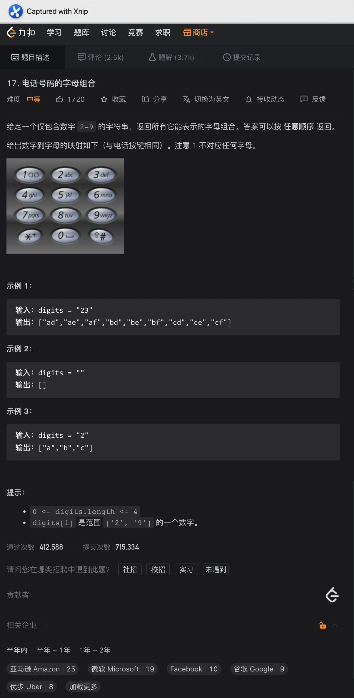

# 一、组合


题意:

给你一个数字n，一个数字k，请你返回从1到n中所有k个数的组合(无序，元素相同的为同一个组合)


思路:

- 回溯第一天，这道题目可以说非常的经典，按照常规思路，可能会想到用多层for嵌套
- 但如果k比较大的话，这种方法就不现实，因此这里可以使用回溯
- 按照图示，其实我们可以将该搜索组合的过程看作是对一颗树进行dfs
- 这里dfs的终止条件为当前组合中元素个数 = k，而每层都需要将之后的每个元素添加到当前组合中进行验证，所以是一个for循环
- 又因为组合是无序的，其中元素相同的组合算做同一个组合，因此元素不能重复使用
- 这里我们可以使用一个idx来标记当前层开始搜索元素的起始位置
- 然而每搜索完一个分支后，我们再转向另一个分支之前必须先删除组合中最后一个添加的元素，这样组合中的元素个数才是正常的


复杂度:

- 我们遍历了整颗树，树的高度为k，每层分支最大为n，所以时间复杂度可以粗略算做O(nm)
- 我们用集合记录了所有的组合，所以空间复杂度为O(n)


剪枝:

- 在每一层的搜索中，如果剩余元素的个数小于我们还需要的元素个数的话，这个分支显然不需要再继续了，可以直接跳过
- 所以在每层的for循环中，我们可以将idx的起始位置改为能成功凑出组合的索引位置即(n - (k - curCombination.size) + 1)，这样我们就完成了剪枝

<hr>


# 二、组合之和


题意:

给你一个数字n，一个数字k，请你找出所有和为n的k个数字的组合，且组合的数字只能从1到9中取，每个数字只能使用一次


思路:

- 和昨天的题目其实类似，昨天的题目是从1-n，而今天的n就变为了9
- 不同的是这次我们还需要求组合的和，这里我们在回溯方法的参数列表中添加一个int参数表示和即可，其用法类似二叉树求路径和
- 又因为这里多了个和，所以在最后回溯的时候，我们不仅需要将当前组合中的末尾元素去除，还需要将当前和值回退(curSum -= i)


复杂度:

- 参照昨天即可


剪枝:

- 因为同样对组合元素个数有限制，所以这里我们依然可以用同样的方法在for循环的条件上加以限制来进行剪枝
- 该题目因为多了对和值的判断，所以我们还可以在每层开始前就先判断当前和值与目标值的关系，从而进行剪枝

<hr>


# 三、电话号码字母组合




题意:

给你一个从2-9的数字组合，请你返回它能代表的所有字母组合


思路:

- 因为数字和对应的字母之间的对应是参照拨号键盘的，所以我们需要先将它们对应起来，这里我选择使用String数组(Map也可以)
- 同样，我们需要一个回溯方法，每次取其中一个数字，再通过我们创建的String数组获取其对应的字符串
- 再遍历这个字符串，依次添加每个字符到当前组合中直到组合长度符合要求


复杂度:

- 如果对应字符有三个的数字有m个，对应四个字符的有n个，则我们遍历每个组合的用时为3^m^ + 4^n^，所以时间复杂度为O(3^m^ + 4^n^)
- 对应的，空间复杂度为O(m + n)

<hr>


# 四、组合总和


题意:

给你一个数组，一个目标数，请查询出所有和为目标数的组合，数组中的数字可以重复使用


思路:

- 又是排列，所以我们依然需要使用递归的方法列出每种排列，再将符合条件的加入到结果集即可
- 与之前不同的是，这道题目没有限制排列中元素的个数，且元素可以重复使用
- 所以我们设置回溯方法的终止条件变为了curSum == targetSum
- 而元素可以重复使用的话，我们就不再需要限制开始的索引位置了


剪枝:

- 在累加的过程中，一旦当前组合累加后的结果大于目标数，那么这条分支就不会再出现结果了，但前提是这个数组是有序的，这样才能保证后面的数都大于前面的数
- 所以这里我们可以先对数组进行排序，再使用curSum + curNum <= targetSum来剪枝

<hr>


# 五、组合总和2


题意:

给你一个有重复数字的数组，一个目标数，请你返回其中所有不重复的组合


思路:

- 该题目与昨天的不同之处在于，其中有重复的数字，且索引位置要更新，所以如果直接使用昨天的方法再使用HashSet去重的话，会很浪费时间，所以我们要想办法剪枝
- 这里剪枝的思路是：如果当前候选数是之前分支的子集(即之前已经使用过了)，那么该分支最终的结果一定与之前是重复的，所以应该跳过，在code里体现为

```java
if (idx > startIdx && candidates[idx] == candidates[idx - 1]) {
  continue;
}
```

- 最后再每次递归调用时将startIdx加1即可，其余与昨天的code差不多

<hr>


# 六、分割回文串


题意:

给你一个字符串，请尝试你将其划分为若干个回文子串，最后返回所有的分割组合


思路:

- 该题目可以看作是求所有的子串，只不过要求子串为回文子串而已
- 所以我们可以通过常规的回溯法得出所有的子串，但在添加子串之前判断一下其是否为回文子串即可

