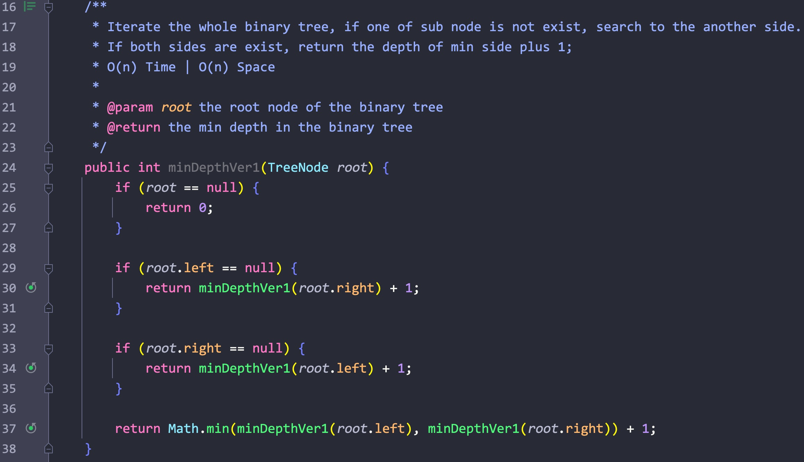

# 1、层序遍历

题意:

给你一颗二叉树，请你按照层序遍历的顺序返回其中每个节点的值

思路1:

- 层序遍历的顺序其实和广度优先遍历一样(BFS)，所以我们使用BFS就行了
- 依次遍历每层的节点，并将每层节点的值保存在一个集合中，每次遍历完一层之后，就将该层集合添加到结果集合中
- 最后返回这个结果集合即可

实现1:

- 创建一个结果集合，其记录每一层的节点值集合，首先判断参数根节点是否为空，为空则直接返回这个空的结果集合
- 创建一个队列，用其记录所有的节点，且以层序遍历的方式向里面添加节点
- 首先向队列中添加根节点
- 进入循环，条件为队列不为空，创建一个集合curLevel用来记录当前层所有节点的值
- 取出当前队列的长度queueSize，只遍历queueSize次，每次取出队列头的节点
- 判断该节点的左右子节点是否为空，不为空则添加到队列中用于之后的遍历
- 注意：我们只遍历了queueSize次，该值是固定的，代表该层节点的数目，这里不能使用queue.size()，因为我们判断取出节点的左右子节点后，向该队列中添加了它的左右子节点，此时队列的长度queue.size()是变化的，无法清晰的表示该层的节点数，这样一来我们就会将所有的节点值都添加到curLevel集合中了
- 添加完左右子节点后，将该节点的值添加到当前层集合中curLevel
- 遍历完当前层所有节点后，将记录该层所有节点值的集合curLeve添加到结果集合中
- 当队列为空后，返回结果集合

复杂度1:

- 我们遍历了所有的节点，所以时间复杂度为O(n)
- 我们记录了所有的节点值，所以空间复杂度为O(n)

注意事项1:

- 在遍历当前层节点时，应该先行取出当前层的节点，而不应该直接使用queue.size()，因为在向队列添加下一层节点时，该队列的长度是变化的，此时不再代表当前层节点的数量

思路2:

- 使用深度优先遍历，根据层级将节点值添加到对应的集合中
- 每当更新到下一层级后，都将层级数 + 1

实现2:

- 创建一个全局集合，创建一个dfs方法，传入节点和层级
- 判断集合中元素的数量和层级是否相等，相等则说明该层没有记录，该节点为该层第一个节点
- 所以我们为该层创建一个集合，将节点值记录到该层集合中
- 之后向下遍历左右子节点，并增加层级数

复杂度2:

- 我们遍历了二叉树中所有的节点，所以时间复杂度为O(n)
- 我们递归调用的栈空间取决于树的高度，但我们同时还创建了一个结果集合来记录所有的节点值，所以空间复杂度为O(n)

****

# 2、层序遍历倒序

题意:

给你一颗二叉树，请你按照层序遍历的倒序顺序获取节点值并输出为一个二维集合

思路1:

- 根据昨天的思路，我们只需要在遍历每层节点后，将该层节点对应的集合添加到结果集合的开头即可

复杂度1:

- 同昨天

思路2:

- 使用深度优先遍历，根据层级将节点值添加到对应的集合中
- 每当更新到下一层级后，都将层级数 + 1

实现2:

- 创建一个结果集合，创建一个dfs方法，传入节点，层级和结果集合
- 判断集合中元素的数量和层级是否相等，相等则说明该层没有记录，该节点为该层第一个节点
- 所以我们为该层创建一个集合并返回到结果集合中的开头，将节点值记录到该层集合中
- 之后向下遍历左右子节点，并增加层级数

复杂度2:

- 我们遍历了所有的节点，所以时间复杂度为O(n)
- 我们创建了一个结果集合，我们递归的调用的栈空间取决于树的高度，所以空间复杂度为O(n)

****

# 3、锯齿状层序遍历

题意:

给你一颗二叉树，请你以锯齿状层序遍历的顺序获取其中所有的节点值，并返回一个二维集合

思路1:

- 所谓的锯齿状其实就是每层的值都根据层数的奇偶进行前后顺序的交替
- 所以我们只需要在原本层序遍历的基础上，判断一下当前的层级，如果为奇数则将当前节点值添加到当前层集合的末尾，否则添加到开头
- 我们只需要更新层数即可，其余不变

复杂度1:

- 同层序遍历，所以时空复杂度都为O(n)

思路2:

- 我们其实还可以在添加下一层元素到队列的时候作出判断
- 如果当前层为奇数，则从队列的末尾位置获取当前层的元素，并将一下层的元素都添加到队列的开头
- 否则从队列的开始位置获取当前层元素，并将下一层元素都添加到队列的末尾

复杂度2:

- 同层序遍历，所以时空复杂度都为O(n)

****

# 4、二叉树最大直径(Stranger)

题意:

给你一颗二叉树，请你计算出该二叉树的最大直径

思路:

- 二叉树的最大直径其实指的是最长的边数和，将该问题拆分，其实最长的边长等于左右子树的最长边长 + 根节点的边
- 又因为部分子树的边长和可能大于根节点，所以我们需要判断子树的最大边长是否大于整个树

实现:

- 传入根节点到dfs方法，该方法计算树的最大深度(子树的深度等于从根节点到叶子节点的边数)
- 将左右子树的最大深度相加即为该树的最大边，将其与当前最大边数对比，更新最大边数
- 返回左右子树中的最大节点数 + 1，作为该棵树的最大深度

复杂度:

- 我们遍历了所有的节点，所以时间复杂度为O(n)
- 我们递归调用的栈空间取决于二叉树的高度，所以空间复杂度为O(h)

****

# 5、二叉树最大路径和

题意:

给你一颗二叉树，请你返回其中最大的路径和

思路:

- 从根节点开始获取该二叉树中最大的路径和其实就是判断左右子树中谁的路径和大
- 这样问题就拆分为了判断子树中最大的路径和
- 我们通过递归的方法，最终会向下遍历到叶子节点
- 以该节点为根的子树的最大路径和值就是其节点值本身
- 向上一层后，最大的路径和值就是当前的根节点值 + 左子树最大和值 + 右子树最大和值
- 每当计算出当前子树的最大路径和值，就将其与当前的最大和值进行比较，从而更新结果值
- 需要注意的是，每棵子树在上一层中都会作为其中的一条边被计算，所以我们需要还需要返回该棵树左节点值 + 根节点值与右节点值 + 根节点值中的最大值

实现(Java):

- 创建一个类的成员变量maxSum作为结果值
- 在maxPathSum方法中调用getMaxEdgeSum方法，传入根节点
- 在getMaxEdgeSum中，如果参数节点为null(树为空或者当前以及遍历到了叶子结点)，则返回值为0(没有节点，值无效)
- 递归调用获取左右子树作为边的最大边值之和
- 将左右子树的最大边值加上当前树的根节点值作为当前树的最大路径和值，用了更新成员变量maxSum
- 最后返回该树作为边的最大边值和(找出左右子树值的最大值 + 当前树的根节点值)

****

# 6、最大深度

题意:

给你一颗二叉树给你返回它的最大深度

思路1:

- 对于每棵二叉树而言，最大的深度为左右子树的中的最大深度值 + 1(根节点算一个)
- 所以我们需要获取左右子树的最大深度值，这样就可以一直将问题分解到叶子节点
- 最后叶子节点的深度只能为1，所以我们使用深度优先遍历，通过递归的方式就能解决了

复杂度1:

- 我们遍历了所有的节点，所以时间复杂度为O(n)
- 我们递归调用的栈空间取决于树的高度，所以空间复杂度为O(h)

思路2:

- 既然深度优先可行，那么广度优先呢？
- 当然可以，我们每遍历完一层后就将层级加一，最后返回层级不就行了吗?

复杂度2:

- 我们遍历了所有的节点，所以时间复杂度为O(n)
- 我们用队列保存了所有的节点，所以空间复杂度为O(n)

# 7、最小深度(解法一不熟悉)

题意:

给你一颗二叉树，请你计算出其最小的深度

思路1:

- 对于一棵树而言，要获取其最小深度一定需要先判断其左右子树的深度，最后返回其中的最小值 + 1即可(加上当前树的根节点)
- 向下一直到根节点则深度为1，通过这种方法，我们就能自下而上的计算出所有子树的深度，从而返回其中的较小值了

复杂度1:

- 我们遍历了所有的节点，所以时间复杂度为O(n)
- 我们递归调用的栈空间取决于树的深度，所以空间复杂度为O(h)

思路2:

- 在方法1中，我们遍历了所有的节点，但其实并不需要
- 如果我们通过遍历左子树获取的深度为2，在遍历右子树时如果还没遍历完深度就以及到了2，则不需要继续遍历了，可以直接打断，这样就避免了很多不必要的计算，也就是所谓的"剪枝"

复杂度2:

- 最坏的情况下我们还是需要遍历所有的节点，所以时间复杂度为O(n)
- 我们递归调用所需的栈空间取决于最小的树深度，所以最坏时空间复杂度为O(h)

****

# 8、翻转二叉树

题意:

给你一颗二叉树，请你将其翻转后返回其根节点

思路1:

- 所谓的翻转其实就是交换每个节点的左右子节点
- 而我们需要对每个节点都进行这样的操作，所以在交换的同时还需要遍历，使用深度优先就行了

实现1:

- 首先交换根节点对应的两个子节点，之后递归调用本方法，以同样的方式处理其左右子树
- 这样一来我们递归完整棵树之后，整棵树都完成了翻转

复杂度1:

- 我们遍历了整棵树，所以时间复杂度为O(n)
- 我们递归调用的栈空间取决于树的高度，最坏时树可能为一个链表，所以空间复杂度为O(n)

思路2:

- 遍历能用深度优先，那能不能用广度优先呢？当然可以，个人也不太喜欢写递归
- 同层序遍历一样，我们创建一个队列，其记录所有的节点
- 每次取出一个节点，就交换其对应的左右子节点，并将其左右子节点添加到队列中直到队列为空

实现2:

- 创建一个队列，将根节点添加到其中
- 进入循环，如果队列不为空，则取出队列头的节点，交换这个节点的左右子节点
- 之后将该节点的左右子节点添加到队列中，重复步骤直到队列为空

复杂度2:

- 我们遍历了整棵树，所以时间复杂度为O(n)
- 我们用队列存储了所有的节点，所以空间复杂度为O(n)

****

# 9、重建二叉树

题意:

给你两个数组，其中一个是先序遍历二叉树所有节点值的结果，另一个是中序遍历二叉树所有节点值的结果，请你重新构建该二叉树，并返回其根节点

思路:

- 想要重建一颗二叉树，那么就要确定其根节点和左右子树
- 根据先序遍历的性质，先序遍历中的第一个元素必然是根节点
- 获取当前树的根节点后，在中序遍历中定位根节点的位置
- 根据先序遍历的性质，根节点左边的节点就都是左子树的节点了，右边则都是右子树的节点
- 我们先构建当前的根节点，之后则需要构建其对应的左右子树了
- 构建左右子树的方式和上述方式一样，但我们需要知道左右子树的先序遍历根节点索引和中序遍历的左右边界索引
- 左子树很简单，在先序遍历中原根节点的后一位就是左子树的根节点，左边边界不变，而右边界其实就是原根节点在中序遍历中的前一个位置(根节点在中序遍历中将所有节点分为两个部分，左边都是左子树的节点)
- 右子树稍微有些棘手，其根节点在先序遍历中的位置其实就是原根节点先序遍历索引 + 左子树的节点数量 + 1，说白了，越过了左子树和原根节点后，第一个节点就是右子树的根节点
- 问题是怎么获取左子树的节点数量呢？其实用原根节点中序遍历的索引位置 - 原中序遍历左边界的索引即可
- 而其左边界就是原根节点中序遍历索引的下一个位置，右边界不变

实现:

- 首先创建一个全局的HashMap用了关联中序遍历中节点的值和索引，方便之后通过根节点的值快速找到其在中序遍历中的索引
- 遍历中序遍历数组，填充我们的HashMap，将当前的根节点在先序遍历中的索引，左右边界在中序遍历中的索引传入递归方法buildHelper中
- 在递归方法中，首先根据根节点的索引获取根节点的值，并构建该根节点
- 根据该根节点的值通过HashMap获取根节点在中序遍历中的索引
- 递归调用本方法，构建左右子树
- 构建左子树时，传入的左子树先序遍历根节点索引为rootIdxInPreorder + 1即当前根节点的后一个位置，而中序遍历左边界索引与之前一致，但右边界索引为rootIdxInInorder - 1即原根节点在中序遍历索引的前一个位置
- 构建右子树时，传入的左子树先序遍历根节点索引为rootIdxInPreorder + nodeNumOfLeftSubTree + 1，也就是原根节点索引 + 左子树节点数 + 1
- 而左边界索引为rootIdxInInorder + 1即原根节点在中序遍历索引的后一个位置，中序遍历右边界索引与之前一致
- 最后返回根节点即可

复杂度:

- 我们遍历了所有的节点，所以时间复杂度为O(n)
- 我们创建了一个hash表，递归调用的栈空间取决于树的高度，所以空间复杂度为O(n)

****

# 10、最近公共祖先

题意:

给你一颗二叉树，和两个其中的节点，请你找出这两个节点在二叉树中的最近公共祖先节点

思路:

- 从结果来看，其实有两种情况:
- 按照常规的dfs进行搜索的话，当前节点的左右子节点/子树中可能各自存在一个目标节点
- 这种情况下我们只需要向下搜索找到最近的即可
- 但如果搜素后发现两个目标节点在同一颗子树中(左或者右)，则说明其中一个目标节点所在层级在另一个的上面且是其父节点
- 这种情况下我们则只需要返回最上层的那个目标节点即可
- 也就是说，我们从根节点开始搜索后，根据左右子树的结果就可以判断了

实现:

- 首先判断当前节点是否为null(到达了叶子节点)或者是否等于目标节点
- 是则返回当前节点，不是则继续搜索左右子树
- 根据左右子树的搜索结果，如果其中一个子树中没有目标节点，则直接返回另一颗子树中的搜索结果(其中的最上层节点)
- 如果两个子树的结果都不为空，则返回当前根节点(说明当前根节点为结果)

复杂度:

- 最坏时，我们会遍历所有的节点，所以时间复杂度为O(n)
- 递归调用的栈空间取决于树的高度，最坏时树为链表状，所以空间复杂度为O(n)

****

# 11、对称二叉树

题意:

给你一颗二叉树，请你判断其是否对称

思路1:

- 要判断是否对称其实就是判断左右子树中每个对应的节点对应的值相同
- 所以每次对比都需要两个节点，在每层遍历中，一旦其中一个子树对应的节点为空而另一个不为空，或者两者之间的值不相等，则返回false
- 如果两个节点都为null，则说明已经遍历到了叶子结点

实现1:

- 编写一个bfs方法，传入根节点作为左右节点
- 判断左右节点是否都为null以判断是否到达叶子结点
- 再判断是否存在其中一个节点为null，或者两节点值不等的情况
- 最后递归调用来判断子树

复杂度1:

- 我们遍历了所有的节点，所以时间复杂度为O(n)
- 递归调用的栈空间取决于树的高度，所以空间复杂度为O(n)

思路2:

- 上一种方法是dfs，同样用bfs也是可以的
- 创建一个队列，传入根节点两次
- 在循环中，每次取出两个节点(保证两个节点都是左右子树对称位置的节点)
- 判断两个节点是否全部为null(是否到达叶子结点)
- 再判断两个节点是否有一个为null或者节点值不同，如有则返回false
- 之后将左右子树对应位置的节点两两一组添加到队列中
- 遍历完整棵树后没有被打断，则说明整棵树对称，返回true

复杂度2:

- 我们遍历了所有的节点，所以时间复杂度为O(n)
- 我们创建了队列来存储所有的节点值，所以空间复杂度为O(n)

****

# 12、重建二叉树(中序/后序)

题意:

给你一颗二叉树中序遍历和后序遍历的结果，请你还原这颗二叉树并返回根节点

思路:

- 后序遍历有一个特点: 最后遍历的节点一定是根节点，而根节点在中序遍历中将所有的节点按照左右子树分为了左右两个部分
- 根据后续遍历，我们能够获取到根节点的值，在中序遍历数组中就能获取到根节点的索引值，从而就能获取到左右子树的边界索引，从而递归调用构建左右子树
- 这样看来其实思路和用前序遍历与中序遍历构建二叉树的方法差不多，只不过获取根节点的方式从前序遍历的开头变成了后序遍历的末尾位置而已

实现:

- 同之前的构建步骤相同，我们同样创建一个hashmap，用了记录中序遍历的值和对应的索引，方便之后直接通过根节点值获取到根节点的索引位置，从而获取左右子树的边界
- 遍历中序遍历数组填充hashmap，将左右子树在中序和后序遍历中的左右边界传入递归方法
- 在递归方法中，首先根据后序遍历的右边界获取到当前树的根节点值，构建该根节点，并通过hashmap获取根节点在中序遍历中的索引位置rootIdxInorder
- 根据根节点在中序遍历中的位置和树的中序遍历左边界获取左子树节点的数量curLeftTreeLen
- 递归调用构建左右子树
- 先说左子树:
    - 其在中序遍历中的左边界不变，右边界就是根节点的前一个位置(rootIdxInorder - 1)
    - 在后续遍历中的左边界不变，右边界其实就是左边界加上左子树节点的数量 - 1
    - 但如何获取左子树节点的数量呢？其实就是根节点在中序遍历中的索引 - 中序遍历中左子树边界(rootIdxInorder - startIdxInorder)
- 右子树:
    - 其在中序遍历中的左边界就是根节点的后一个位置，右边界不变
    - 后续遍历的左边界可以根据后续遍历的性质: 左子树之后就是右子树，而我们上面已经有了左子树的右边界，所以该值 + 1就是右子树的左边界
    - 而右边界就是根节点的前一个位置
- 这样我们就构建了左右子树，最后返回根节点即可

复杂度:

- 我们遍历了所有的节点，所以时间复杂度为O(n)
- 我们创建了一个hash表，递归调用的栈空间取决于树的高度，所以空间复杂度为O(n)

****

# 13、验证二叉搜索树

题意:

给你一颗二叉树，请你判断其是否为一颗二叉树搜索树

思路1:

- 我们可以直接利用中序遍历的性质: 中序遍历的顺序就是中 - 左 - 右
- 而一颗二叉搜索树通过中序遍历后，节点值一定是严格递增的，因此我们只需要对该二叉树进行一次中序遍历
- 每次遍历都比较当前节点值与遍历集合中最后一个值的大小关系，一旦有不符合的情况则说明该二叉树不是二叉搜索树

复杂度1:

- 我们遍历了所有的节点，所以时间复杂度为O(n)
- 我们创建了一个集合来记录中序遍历后的所有节点，所以空间复杂度为O(n)

思路2:

- 在比较时，我们其实只需要集合中的最后一个数，所以我们只需要维护最后一个数即可，不需要创建一个集合来记录所有的节点
- 在判断左右子树时，只要左子树为false则可以直接返回false了，没必要和右子树一起判断了

复杂度2:

- 我们遍历了所有的节点，所以时间复杂度为O(n)
- 递归调用所需的栈空间取决于树的高度，所以最坏时空间复杂度为O(n)

****

# 14、二叉树的右视图

题意:

给你一颗二叉树，请你找出其中所有的右视图节点并将它们的值作为一个集合返回

思路1:

- 所谓的右视图其实就是每层节点中最靠右的那个罢了，因此如果我们使用BFS的话，每层遍历到最后的那个节点就是"右视图节点"
- 所以我们只需要取每层中从左到右的最后一个节点即可

复杂度1:

- 时空复杂度同层序遍历一样，都为O(n)

思路2:

- 之前我们在解决层序遍历的时候，写出了一个dfs的版本，其每次都判断当前层级和结果集合的长度
- 如果相同则说明该节点为当前层第一个访问的节点，所以需要为当前层创建一个集合并添加当前节点值到当前层集合中
- 在现在这个问题中，我们只需要"右视角"节点，所以我们不再需要维护一个当前层集合，只需要保证每次向下层访问时都先访问最右边的节点并添加其值到结果集中即可

复杂度2:

- 时空复杂度同样和层序遍历相同，都为O(n)

****

# 15、打家劫舍3

题意:

如题，小偷想要打劫的房屋以二叉树的形状分布，如果同时打劫相邻节点的房屋会触发警报，在不触发警报的情况下，请你计算出能盗取的最大金额

思路1:

- 对于每个节点都有两个状态: 打劫或者不打劫
- 如果打劫当前节点则其总金额为当前节点值 + "孙子"节点值
- 如果不打劫则为其所有子节点的值之和
- 因此我们只需要判断并返回这两个值之间的最大值即可

实现1:

- 上述过程很简单，只需要计算其中一种情况例如: curNode.val + (curNode.left.left.val + curNode.left.right.val + curNode.right.left.val + curNode.right.right.val)，再与另一种情况比较即可，例如: curNode.left.val + curNode.right.val
- 在递归计算的过程中，其实我们重复计算了很多节点对应的值，所以我们可以记录下每个节点对应的值，从而避免重复计算，使用一个HashMap即可

复杂度1:

- 我们遍历了所有的节点，所以时间复杂度为O(n)
- 我们创建了一个HashMap，递归调用的栈空间取决于树的高度，所以空间复杂度为O(n)

思路2:

- 从思路上看，每个节点值都有两种状态的金额之和，那么我们直接为每个节点记录这两种状态不就行了吗？
- 用一个长度为2的数组记录当前节点的两种状态，为0则说明当前节点不被计算在内，为1则说明该节点被计算在内
- 为0时，当前节点的金额之后应该为子节点的金额之和最值
- 为1时，则说明不计算两个子节点，因此值为curNode.val + leftChild[0] + rightChild[0]
- 最后返回当前节点对应的数组，获取其中最大的元素即可

复杂度2:

- 我们遍历了所有的节点，所以时间复杂度为O(n)
- 递归调用的栈空间取决于树的高度，所以空间复杂度为O(n)

