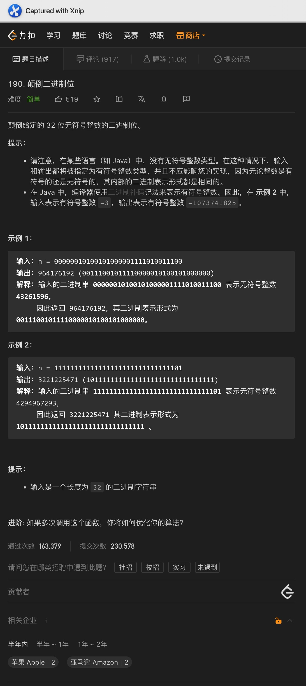
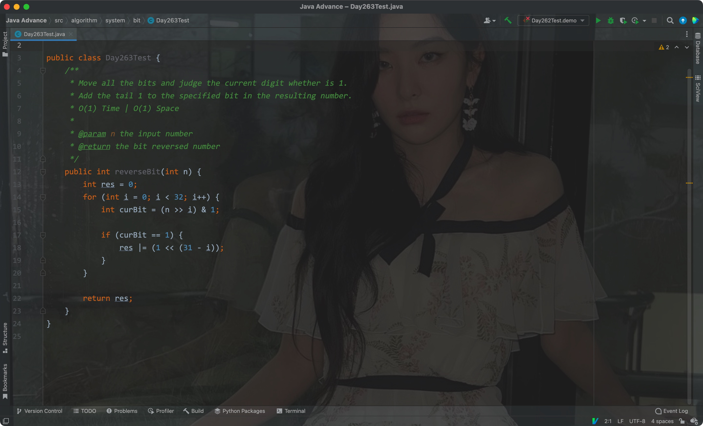

# 一、2的幂

题意:

给你一个数，请你判断其是否为数字2的幂

思路:

- 如果一个数是数字2的幂，那么其二进制中只会有1个位上为1，如16对应的二进制: 10000
- 此时如果将其减去1，则对应的二进制为: 1111，用这两个数做位与运算的话，结果为0
- 所以在数字大于等于1的情况下，其只需要满足上述条件即可

复杂度:

- 我们只做常数次的判断和运算，所以时间复杂度为O(1)
- 我们创建的变量个数为常量级，所以空间复杂度为O(1)

# 二、汉明重量

# 三、反转二进制位

题意:

给你一个数组，请你返回将其各个二进制位反转后的数字

思路:

- 说是反转二进制位，其实就是反转其中的1，所以我们只需要将所有的1添加到对应的位置上即可
- 因此我们需要判断原数字中的每一位是否为1
- 因为输入的是32bit整数，所以我们需要判断32个数位，通过">>"即可移动数位，每次都将移动后的数与1做按位与运算，从而判断当前低位是否为1
- 如果为1则通过<<移动到结果数中对应的数位上去

复杂度:

- 我们遍历了所有的数位，且固定会遍历32次，所以时间复杂度为O(1)
- 我们创建的变量个数为常量级，所以空间复杂度为O(1)

