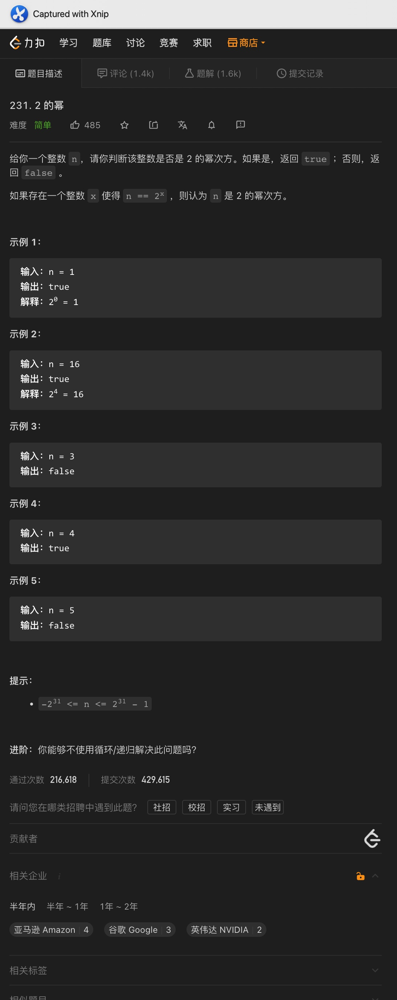
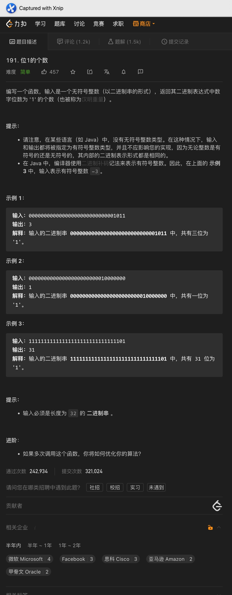

# 一、2的幂

题意:

给你一个数，请你判断其是否为数字2的幂

思路:

- 如果一个数是数字2的幂，那么其二进制中只会有1个位上为1，如16对应的二进制: 10000
- 此时如果将其减去1，则对应的二进制为: 1111，用这两个数做位与运算的话，结果为0
- 所以在数字大于等于1的情况下，其只需要满足上述条件即可

复杂度:

- 我们只做常数次的判断和运算，所以时间复杂度为O(1)
- 我们创建的变量个数为常量级，所以空间复杂度为O(1)

# 二、汉明重量

