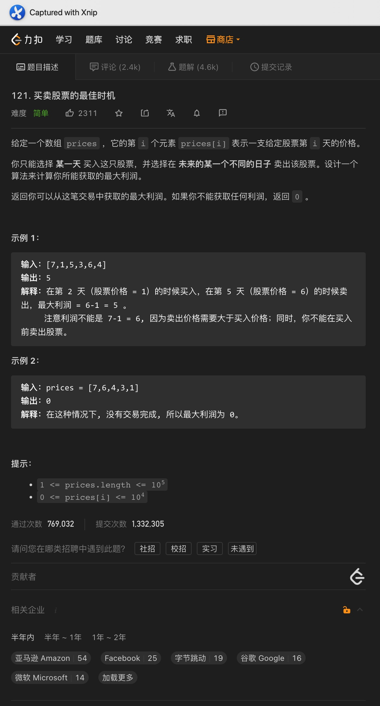

# 一、斐波那契数

题意:

给你一个数字n，请你给出其代表的第n + 1个斐波那契数

思路:

- 动态规划第一天，来点简单的
- 该题目用递归其实很简单，很多老师也是这么教的，但需要使用栈空间，所以复杂度并不理想
- 其实我们只需要维护两个数就行了，每次都只对这两个数进行更新即可，这种保存状态的解法看起来是动态规划，但其实更多的是滑动窗口

复杂度:

- 我们需要更新n - 1次，所以时间复杂度为O(n)
- 我们创建的变量数为常量级，所以空间复杂度为O(1)

# 二、爬楼梯

题意:
要求你爬到第n阶楼梯上，每次可以爬1或2阶，请问有多少种方法

思路:

- 对于除了前两阶的每个楼梯来说：爬到当前阶的方法可以是n - 1阶再爬1阶，也可以是n - 2阶再爬2阶
- 所以爬到n阶的方法 = 爬到n - 1阶 + 爬到n - 2阶
- 乍一看，这不就是斐波那契吗？那递归能解吗？能，但会超时
- 所以这里我们可以改为创建一个数组，每个元素dp[i]都代表爬到第i阶的方法
- 因为第1、2阶是固定的，所以我们应该从i = 3开始初始化，最后只需要返回dp[n]即可
- 其实我们每次只需要到达前两个台阶的方法而已，所以这里我们可以只创建一个长度为2的数组，像昨天一样用滑动窗口的方式来做

复杂度:

- 最坏时，我们遍历了n - 2次，所以时间复杂度为O(n)
- 如果是通过创建数组dp代表每个台阶的方法的话，时间复杂度为O(n)，如果是滑动窗口，则时间复杂度为O(1)

# 三、最小花费爬楼梯

题意:

给你一个数组，其中每个元素代表从当前台阶向上爬所需的费用，可以从0或者1开始且每次可爬1或2阶，请你返回爬到顶部所需的最小费用

思路:

- 这里需要的注意一点: 顶部指的是最后一个台阶的下一步，而不是最后一个台阶，这里和昨天的爬台阶是不同的
- 不过方法其实都一样，爬到某个位置的开销可以是到达其前一个台阶的开销 + 前一个台阶出发的开销，也可以是前两个位置处的开销 + 前两个位置出发的开销
- 因此，我们只需要创建一个数组，初始化前面两个位置的开销即可，之后所有位置的开销均可由它们两个获得
- 最后我们只需要获取到达最后一个台阶或者前两个台阶所需开销的最小值即可

复杂度:

- 我们遍历了一次cost数组，所以时间复杂度为O(n)
- 我们创建了一个新的数组来记录到达每个位置所需的最小开销，所以空间复杂度为O(n)，当然我们，也可以选择创建一个长度为2的数组或者就在cost数组上进行修改，这样空间复杂度就降为了O(1)

# 四、唯一路径

题意:

给你一个m * n的网格，要求从左上角出发到右下角，每次只能向下或者向右，问到最右下角有多少种走法?

思路:

- 经典动规入门题目，我们按照carl的五部曲来:
- 首先是确定dp数组及其下表的含义: 因为题目给我们的是一个二维网格，所以我们需要创建一个二维数组，其中每个元素对应网格中的每个格子，元素的值即为到达该处位置的走法
- 第二步是确定递推公式: 在该题目中，除了第一行和第一列外，到达其余节点的走法必然等于到达上面节点的走法 + 到达左边节点的走法
- 第三步是数组的初始化: 在第二步，我们明确了到达第一行和第一列网格的走法是固定的，即都为1，所以我们只需要将这些网格对应的元素设置为1即可
- 第四步是确定遍历顺序: 因为我们已经初始化了第一行和第一列，所以我们只需要从下标为[1][1]的位置处开始即可
- 最后则是举例推导该数组

复杂度:

- 我们遍历了整个二维数组，所以时间复杂度为O(n * m)
- 我们创建了一个二维数组来记录到达所有节点处时对应的走法，所以空间复杂度为O(n * m)
- 当然，又因为每次迭代其实只需要上面一层的走法而已，所以我们可以改为维护一个一维数组，这样空间复杂度为O(n)

# 五、唯一路径2

题意:

给你一个二维数组，其中有一个点有障碍(元素值为1)，请你返回从左上角到右下角的路径数

思路:

- 要求和昨天一样，但这里加入了一个障碍
- 按照五部曲来：
- 第一步：dp数组的元素依然代表到达每个点的路径数，下标代表每个网格的坐标
- 第二步：递推公式依然为dp[i][j] = dp[i - 1][j] + dp[i][j - 1]
- 第三步：这里我们在初始化的时候就需要注意了，在初始化第一行和第一列的时候，如果当前网格有障碍，那么当前网格以及之后的网格(同行或者列)就无法到达了(值为0)
- 第四步：遍历顺序不变，但在遍历的时候需要判断当前网格是否有障碍，如果有则跳过当前网格(为0)，没有则依然为左边 + 上面
- 最后推导一下，发现没问题

复杂度:

- 我们遍历了一次输入的二维数组，所以时间复杂度为O(n * m)
- 我们创建了一个对应的二维数组，所以空间复杂度为O(n * m)

# 六、整数拆分

题意:

给你一个数字，请你尝试将该数字拆分为几个数字的和，使得这几个数字的乘积最大

思路:

- 很明显，我们并不能简单得直接得出答案(数学方法除外)，因此我们需要从较小的数字开始
- dp五步曲第一步: dp数组代表拆分对应数字获取的最大乘积，索引即为拆分的数字
- 第二步: 之后每个数字对应的乘积都可以由(当前数字 - 拆分数字) * 拆分数字或者dp[当前数 - 拆分数] * 拆分数得到
- 第三步: 因为0和1无意义，所以我们只需要初始化dp[2] = 1即可
- 第四步: 因为2是已知的了，所以我们只需要从3开始即可，而对应的拆分数字则需要从1开始
- 第五步: 进行推导

复杂度:

- 我们从3遍历到了n，其中每次循环又从1开始遍历拆分数字，所以时间复杂度为O(n ^ 2)
- 我们创建了一个新的数组，所以空间复杂度为O(n)

# 七、不同的二叉搜索树

题意:

给你一个整数n，其代表一个二叉搜索树的节点数，请你返回n个节点可组成的互不相同的二叉树的种类

思路:

- 动规题目，我们需要从起始位置看起：
- 如果节点数为0、1，那么自然只有1颗二叉树；如果节点数为2，那么就有2颗；节点数为3就有5颗
- 其实如果只看子树，在节点数为3的情况下，确定一个根节点后，剩下三种情况:
- 左子树节点数为0，右子树为2；左右各为1，左为2，右为0
- 然而这三种又能归纳为：为0的情况 * 为2的情况 + 为1的情况 * 为1的情况 + 为2的情况 * 为0的情况
- 然而这三种情况不是在之前就以及有记录了吗？
- 所以对于1之后的每个节点，我们只需要判断其子树的组合情况即可
- 用一个数组表示n个节点对应的组合数，递推公式为dp[i] += dp[i - j] * dp[j - 1] (j >= 1)
- 这样动规5部曲就完成了两部
- 第三步初始化：我们只需要将第一元素dp[0]设置为1即可
- 第四步遍历: 这里我们从1开始，其代表总的节点数，其中还需要一个内循环，其中每个索引值代表左或者右子树的根节点
- 第五部进行简单的推导即可

复杂度:

- 我们遍历了n次，每次中间又从1开始遍历到当前节点数，所以时间复杂度为O(n ^ 2)
- 我们创建了一个数组来记录之前的二叉树数量，所以空间复杂度为O(n)

# 八、打家劫舍

题意:

给你一个数组，其中每个元素代表每个房屋内的现金金额，如果偷窃连续的两座房屋会触发警报，请你查询出能够盗窃的最大金额

思路:

- 经典动态规划题目，我们依然按照5部曲来分析：
- 首先dp数组中的元素dp[i]代表从0到i可盗窃的最大累计金额
- 其次对于dp[i]，其可以等于dp[i - 2] + nums[i]，也可以等于dp[i- 1]，即当前房屋nums[i]可以选择偷或者不偷，这样递推公式为dp[i] = max(dp[i - 2] + nums[i], dp[i - 1])
- 第三，根据递推公式，我们至少需要dp[0]和dp[1]，所以这里我们需要先初始化dp[0]和d p[1]
- 第四，从递推公式看来，我们的顺序要从i = 2开始向后遍历
- 最后简单推导验证即可

复杂度:

- 我们遍历了一次输入数组，所以时间复杂度为O(n)
- 我们创建了一个dp数组来记录截止每个位置可以获取的最大金额，所以空间复杂度为O(n)

# 九、三角形最小路径和

# 十、分割等和子集

题意:

给你一个数组，请你判断能够将其分割为两个子数组，其中两个子数组的和相等

思路:

- 其实两个子数组的和就是输入数组和的一半
- 但如果数组的和是奇数的话，那自然就不用划分了，必然不可能划分成功
- 之后就是dp的部分了，依然按照5部曲来:
- 我们首先将该为题抽象为01背包问题，nums数组视作物品，其中每个元素的值视作重量，数组和的一半视作背包容量，这里不需要价值，所以我们只需要创建一个一维的数组即可
- 第一步: 创建一个dp数组，其长度为nums数组长度 / 2 + 1，其中每个元素代表对应容量下可得到的数组和
- 第二步: 每个位置上的值 = Max(当前容量对应的值，之前的容量对应的值 + 当前对应nums的输入的元素)
- 第三步: 初始化其实只需要将dp[0]设置为0即可
- 第四步: 因为每个元素的状态是根据之前获取的，可能会下意识从头开始遍历，但这里不行，为了防止重复添加元素值，我们只能从最大容量开始反向遍历
- 最后简单推导即可

复杂度:

- 我们遍历了一次输入数组，所以时间复杂度为O(n)
- 我们创建了一个dp数组，所以空间复杂度为O(n)

# 十一、最后一块石头的重量

题意:

给你一个数组，其中每个元素代表着一块石头的重量，其中任意两个石头之间可以进行相互粉碎，请你判断进行粉碎后剩余石头的最小重量

思路:

- 因为要的是最小重量，所以理想情况肯定是一半对一半，刚好抵消后为0
- 将该问题抽象为01背包，最大容量为总重量的一半，每个石头视作没有价值只有重量的物品
- 按照五部曲来:
- 第一步: dp数组中每个元素dp[i]代表容量i的背包能装下的所有石头的重量
- 第二步: 递推公式依然为dp[i] = dp[i - curStone] + curStone，这里curStone为一块石头的重量
- 第三步: 初始化则只需要全为0即可(Java默认为0，所以不用管)
- 第四步: 遍历顺序依然需要倒序遍历
- 最后简单推导即可
- 最后更新完dp数组后，dp[sum / 2]即代表了接近其中一半的石头重量，那么sum - dp[sum / 2]则为另一半的重量
- 那么粉碎后最小的重量自然是大的一半 - 小的一半，因此结果为sum - dp[sum / 2] - dp[sum / 2]，简写为sum - dp[sum / 2] * 2

复杂度:

- 我们遍历了两次stones数组，第二次中每次都从sum / 2倒序遍历了一次，所以时间复杂度为O(n * m)，其中m是指数组和的一半
- 我们创建了一个dp数组来记录背包里能装的石头重量，所以空间复杂度为O(n)

# 十二、目标和

题意:

给你一个数组，一个数字代表目标和，请你尝试为数组中的每个元素添加+或者-，请你返回和值为目标和的组合数量

思路:

- 首先需要一些转换:
- 目标和可以分为两个部分，一个是所有的正数和，另一个是负数之和，两者之和为target
- 假设其中的正数和为x，那么负数之和为(sum - x)，因此等式关系为: x + (sum - x) = target
- 所以最终为x = (sum + target) / 2，这个x就是我们需要的背包容量，所以我们现在只需要获取sum即可
- 获取sum之后，我们还需要考虑特殊情况：当target > sum或者(sum + target)为奇数时，就不存在任何组合，所以直接返回0即可
- 现在已经抽象为了01背包，接下来是5部曲:
- 第一步: dp[i]，其中i代表对应的容量，每个元素代表容量i对应的组合数，最大为我们需要的正数和(sum + target) / 2
- 第二步: 因为需要的是方法和，所以应该获取元素之和，递推公式: dp[i] += dp[i - num[i]]
- 第三步: 我们只需要将dp[0]初始化为1即可
- 第四步: 这里在遍历的时候依然需要反向遍历
- 最后简单推导即可

复杂度:

- 我们遍历了输入数组，每次都从最大容量向后遍历，所以时间复杂度为O(n * m)
- 我们创建了一个dp数组来记录对应和值的组合数量，所有空间复杂度为O(m)

# 十三、一和零

题意:

给你一个字符串数组(由字符0和1组成)，一个代表数字0个数的数字m，一个代表数字1个数的数字n，请你找出并返回字符串数组中满足m个0和n个1的最大子集的数量

思路:

- 同样的，我们需要抽象为01背包问题
- 其中背包的最大容量就是m和n，所以这里的背包容量是受到0和1的数量同时限制的
- 而每个子集就是物品，其中子集中字符0和1的数量就是子集对应的重量
- 这样一来就清晰了，接下来是5部曲：
- 第一步: dp[i][j]，其中i代表字符0的个数，j代表字符1的个数，这个二维数组中的每个元素代表着拥有i个字符0和j个字符1对应的最大子集数量
- 第二步: 其中每个元素都对应的值都可以由上一个子集的对应01字符数得到，而价值则为子集的数量，所以 + 1即可；因此递推公式为: dp[i][j] = dp[i - zeroNum][j - oneNum]
- 第三步: 初始化什么都不用做，因为dp[0][0]自然为0
- 第四步: 遍历的时候一样是从后往前，所以是从dp[m][n]开始的
- 最后简单推导一下即可

复杂度:

- 我们遍历了所有的字符，之后每次都从尾到头遍历了一次dp数组，所以时间复杂度为O(n * m)
- 我们创建了一个dp数组来记录每对01字符数对应的最大子集数量，所以空间复杂度为O(n * m)

# 十四、零钱兑换2

题意:

给你一个目标金额之和，一个硬币数组，请你计算可以凑出目标金额的硬币组合数(每种硬币可以无限次使用)

思路:

- 该题目很明显是个完全背包问题，不过这里需要的不是最大价值，而是组合数
- 此时背包容量就对应的金额数，接下来是五部曲：
- 第一步: dp[i]代表凑齐金额i对应的组合数，i代表对应的金额
- 第二步: 因为是完全背包，所以是会有重复的，如果暂时不考虑某一种硬币coin，那么装满容量curCapacity - coin的背包有dp[curCapacity - coins]中方法，所以容量计算装满背包的递推公式如下

> dp[curCapacity] = dp[curCapacity - coin]

- 第三步: 从公式来看，我们需要dp[0]的值才行，从第一步的定义看，dp[0]代表凑齐金额为0对应的组合数，所以dp[0]自然为1
- 第四步: 在01背包问题中，我们其实既可以选择先遍历物品，再遍历背包容量，也可以反过来；但在完全背包中，如果我们要求的是组合数，那么只能先遍历物品，如果求的是排列数，只能先遍历背包容量
- 第五步: 简单推导后其实就能看出两种遍历顺序的差异

复杂度:

- 我们遍历了一次硬币数组，每次又遍历了一次背包容量，所以时间复杂度为O(n * m)
- 我们创建了一个dp数组来记录每个金额对应的硬币组合数，所以空间复杂度为O(m)

# 十五、组合总和4

题意:

给你一个数组，一个目标数，请你从数组中计算并返回和值为目标数的排列的数量

思路:

- 先将问题抽象为完全背包：
- 其中不同的和值就是不同容量的背包，物品就是数组中的元素，值就是物品的重量，该问题只求装满背包的方式，而不是最大价值
- 抽象完成，开始五部曲:
- 第一步: dp[i]，其中i代表不同的容量(这里是排列的和值)，dp[i]代表和值为i对应的排列数量
- 第二步: 因为是完全背包，且求的是装满背包的方法，所以每种容量都对应上一个状态，即: dp[i] += dp[i - stuff]，这里的dp[i - stuff]可以有很多个组合，所以累加起来就是dp[i]对应的数量，前两天都是这种做法
- 第三步: 因为我们的递推公式为dp[i] += dp[i - stuff]，所以最终会推导到dp[0]，因此dp[0]初始化为1即可
- 第四步: 昨天我们说过，求组合则先遍历物品，求排列先遍历背包，这道题目说是求组合，但题意中却说不同顺序的视作不同的组合，所以本质其实是求排列，因此先遍历背包再遍历物品
- 第五步: 简单推导即可

复杂度:

- 我们先遍历了背包，再遍历了物品，所以时间复杂度为O(n * m)
- 我们创建了一个对应的背包，所以空间复杂度为O(m)

# 十六、零钱兑换

题意:

给你一个数组，其中每个元素代表一种面额的硬币，再给你一个目标金额，请你计算凑得目标金额所需的最少硬币数量

思路:

- 因为一枚硬币可以使用多次，所以该题目很明显是一道完全背包问题
- 这里我们直接进行5部曲分析：
- 第一步: dp[i]，其中i代表目标金额，dp[i]代表凑出金额i所需的最小硬币数量
- 第二步: 因为dp[i]可以由dp[i - coin[j]] + 1获得，所以dp[i]只需要在每次对比中获取最小值即可，所以递推公式为: dp[i] = min(dp[i], dp[i - coin[j]] + 1)
- 第三步: 因为我们需要的是最小值，而由递推公式可知：每次更新对应的元素时都会用到dp[i]本身，所以dp[i]自然不能用初始值0，因此我们需要将除了第一个元素外的所有元素都初始化为Integer.MAX_VALUE
- 第四步: 因为是完全背包，所以我们先遍历硬币还是先遍历背包其实都一样，但要注意的是，在更新dp中的元素时，dp[i - coin[j]]一定不能为初始值，如果为初始值说明该金额无法由硬币成功凑得
- 最后简单推导即可

复杂度:

- 我们遍历了一次输入数组，且每次都从当前硬币金额出发，遍历了一次背包，所以时间复杂度为O(n * m)
- 我们创建了一个新的dp数组来记录每个位置上对应的最小硬币数量，所以空间复杂度为O(m)

# 十七、完全平方数之和

题意:

给你一个数字n，请你查出最小的能够凑出该数字的完全平方数的数量

思路:

- 其实该题目也是一个完全背包，n就是容量，完全平方数就是一个物品，只不过这里的物品没有限制
- 5部曲:
- 第一步: dp[i]，i代表对应的和，dp[i]代表凑出i所用到的最小的完全平方数的数量
- 第二步: 每个位置的值都可以由上一个位置得到，dp[i] = dp[i - num * num] + 1，其中num * num就代表一个物品对应的容量，+ 1即选取一个完全平方数
- 第三步: 因为我们需要的是最小值，所以我们需要将所有元素初始化为最大值，而第一个元素则保留初始值0
- 第四步: 遍历顺序其实无所谓，我们就参照昨天的做法，先遍历数字，后遍历容量即可，这里同样要跳过无效的位置
- 最后简单推导

复杂度:

- 我们遍历了一次可能的完全平方数，其最大为n的平方根，每次我们又遍历了一次容量，所以时间复杂度为O(n ^ (3/2))
- 我们创建了一个dp数组来记录对应的最小数量，所以空间复杂度为O(n)

# 十八、单词拆分

题意:

给你一个字符串s，一个字符串列表wordDict，请你判断字符串s能够由字符串列表中的字符串拼接而来(字符串列表中的每个字符都可以多次使用)

思路:

- 看到多次使用，其实就该想到完全背包了，不过还需要将问题转换一下：
- 背包容量就是字符串s的长度，物品就是字符串列表中的字符
- 与之前都不同的是，这里我们需要判断当前字符串能否由字符串列表凑出，而不关心组合数和最小组合数
- 因此，原则上说我们只需要取s的字符串后在字符串列表里进行匹配即可
- 直接进行5部曲：
- 第一步: dp[i]，i代表字符串s的子串长度，dp[i]代表该子串能够由字符串列表中的单词组合而成
- 第二步: 对于dp[i]来说，如果其之前的dp[j]为true，且子串s.substring(j, i)也能凑出，则说明dp[i]也能凑出，所以递推公式为if (dp[j] && list.contains(s.substring(j, i))): dp[i] = true;
- 第三步: 因为每一步dp[i]都取决于之前的dp[j]，所以最终会到dp[0]，因此只需要将dp[0]设置为true，其代表长度为0的子串，其必然能够被凑出
- 第四步: 原则上说，该题目既不是求排列，也不是求组合，所以先遍历背包还是物品其实都一样，但为了方便构建子串，我们还是将子串的长度放在外面，起始索引放在里面，所以这里我选择先遍历背包，后遍历物品
- 最后简单推导即可

复杂度:

- 我们遍历了一次背包，又依据长度遍历了所有的子串，加上contains操作的话，时间复杂度为O(n^3)
- 我们创建了一个dp数组来存储每个子串的判断结果，所以空间复杂度为O(n)

# 十九、打家劫舍2

题意:

给你一个数组代表每个房屋内可以盗窃的最大金额，不过这些房屋是围成一圈的，在不能盗窃相邻的两个房屋的前提下，请你计算能够盗窃的最大金额

思路:

- 如果对原版的打家劫舍有印象的话，其实我们可以通过排除掉首尾的两个房屋从而将问题转换为原版打家劫舍，因为这里的头尾房屋是连在一起的
- 这样一来我们其实就只需要考虑两种情况: 排除掉最后一个房屋后的最大金额，排除掉第一个房屋后的最大金额

复杂度:

- 我们通过将问题拆分为两种情况将数组遍历了两次，所以时间复杂度为O(n)
- 因为每次遍历都用原版打家劫舍做了一次，所以创建了两个dp数组，所以空间复杂度为O(n)，当然，dp数组其实可以用三个变量代替，此时空间复杂度为O(1)

# 二十、打家劫舍3

题意：

给你一颗二叉树，其中每个节点都代表一个房屋，如果盗窃两个互为父子节点的房屋就会触发警报，请你计算能够盗窃的最大金额

思路:

- 对于每个节点来说，无非就两种情况：当前节点计算在内，和不计算在内
- 如果是前者，那么就两个子节点就不能偷窃；后者的话，只需要获取子节点的最大和值即可
- 因为从上述情况看，我们需要的值都来源于根节点，所以我们需要先计算根节点才行，所以需要使用后续遍历
- 又因为要记录两种情况，所以每次都需要返回两个数值，这里返回一个长度为2的数组即可
- 最后只需要根据根节点对应的数组获取其中的最值即可

复杂度:

- 我们遍历了所有的节点，所以时间复杂度为O(n)
- 因为我们进行了后续遍历，所以栈调用的空间为树的高度，空间复杂度为O(log(n))

# 二十一、买卖股票的最佳时机

题意:

给你一个数组，其中每个元素代表其中当天股票的价格，在只能买卖一次的情况下，请你计算出能够获取的最大收益

思路:

- 其实这道题目用贪心就能做，无非就是最高价减去最低价罢了，再不济一次遍历也能做的
- 如果我们就是要用动态规划做呢？
- 这里按照5部曲来，注意这里不再是背包问题了
- 第一步：dp[i][0]: 代表i天手上没有股票时身上的最多现金；dp[i][1]: 代表i天手上有股票时身上的最多现金(其实就是花了最少的钱)
- 第二步: 对于dp[i][0]: 没有股票就意味着要么是这次卖出了，要么是和昨天一样持币观望，所以取两者最大值即可；对于dp[i][1]: 我们只需要判断昨天的花费和今天的花费谁更低即可。所以递推公式为: 

> dp[i][1] = Math.max(dp[i - 1][1], -prices[i]);
> dp[i][0] = Math.max(dp[i - 1][0], prices[i] + dp[i - 1][1]);

- 第三步: 由递推公式可知，只需要将第一个数字初始化即可dp[0][1] = -prices[1]
- 第四步: 遍历时只需要顺序执行即可
- 最后简单推导

复杂度:

- 我们遍历了一次输入数组，所以时间复杂度为O(n)
- 我们创建了一个数组来记录对于的金额和收益，所以空间复杂度为O(n)

# 二十二、买卖股票的最佳时机2

题意:

给你一个数组，其中每个元素都代表当天股票的价格，你可以多次进行买卖，请你计算出能够获得的最大收益

思路:

- 我们其实可以用贪心做，而且写起来很简单，但如果要用动规呢？
- 上5部曲：
- 第一步: dp[i][0]: 代表第i天手上没有股票时所具有的最大收益，dp[i][1]: 代表第i天手上有股票时所具有的最大收益
- 第二步: 我们每次都要更新上述两个值，但最后需要的其实是dp[len - 1][0]，但想要获取dp[i][0]，需要两种状态: 要么之前手上也没有股票即dp[i - 1][0]， 要么是之前有股票，但今天卖出去了即dp[i - 1][1] + price[i]；所以想要更新dp[i][0]，我们还需要同步更新dp[i][1]，其情况也差不多，要么之前手上就有股票不变即dp[i - 1][1]，要么是之前没有，今天买进即dp[i - 1][0] - price[i]
- 所以递推公式为:

> dp[i][0] = max(dp[i - 1][0], dp[i - 1][1] + price[i]);
>
> dp[i][1] = max(dp[i - 1][1], dp[i - 1][0] - price[i]);

- 第三步: 我们只需要初始化第一天的值即可，dp[0][0] = 0, dp[0][1] = -price[0]
- 第四步: 我们只需要按顺序遍历即可
- 最后只需要简单的推导

复杂度:

- 我们遍历了一次输入数组，所以时间复杂度为O(n)
- 我们创建了一个dp数组来代表每天的最大收益，所以空间复杂度为O(n)
- 同样的，我们也能用两个变量来代替这个dp数组，这样空间复杂度就降为了O(1)

# 二十三、买卖股票的最佳时机3

题意:

给你一个数组代表每天的股价，限制买卖操作最多两次，且每次只能保有一笔交易，请你计算出能够获取的最大收益

思路:

- 比起之前的股票买卖，这次多了两个限制，买卖操作有了次数上的约束
- 所以对应的状态就不会再像之前那样简单了，此时我们需要记录4种状态: 第一次买入、第一次卖出、第二次买入、第二次卖出
- 上5部曲:
- 第一步: dp[i][0] 代表第i天没有任何操作，dp[i][1]代表第i天第一次买入的最大收益，dp[i][2]代表第i天第一次卖出的最大收益，dp[i][3]代表第i天第二次买入的最大收益，dp[i][4]代表第i天第二次卖出的最大收益
- 第二步: 其中dp[i][0]可以不用理会，其一直为0，第一买入的最大收益其实就是当前最低的股价，所以dp[i][1] = Math.max(dp[i - 1][1], -price[i])；第一次卖出的最大收益则为第一次的买入后的收益加上当天卖出股票的收益，所以dp[i][2] = max(dp[i - 1][2], dp[i - 1][1] + price[i])；同理，我们可以推导出第二次买卖的情况
- 第三步: 初始化的时候只需要考虑两次买入的情况即可
- 第四步: 常规顺序遍历即可，不过需要从第2天开始(第一天已经初始化了)
- 最后简单推导

复杂度:

- 我们遍历了一次输入数组，所以时间复杂度为O(n)
- 我们创建了一个dp数组用来记录最大金额，所以空间复杂度为O(n)

# 二十四、买卖股票的最佳时机4

题意:

给你一个数字k，其代表最多可以进行的交易数(一次买卖操作)，再给你一个数组prices，其中每个元素代表当天的股价，请你计算出能够获取的最大收益

思路:

- 这道题其实就是昨天那道题目的衍生版本，所以基础思路是一样的
- 其实昨天的思路就是: 奇数状态为买入，偶数状态为卖出，这样一抽象后，我们只需要创建一个每个元素长度为2 *k + 1的二维数组即可
- 接下来是5部曲:
- 第一步: dp[i][j]，其中i代表天数，j代表状态，j为奇数则代表买入，为偶数则代表卖出，dp[i][j]则代表第i天时对应状态的最大收益
- 第二步: 对于每天的买入和卖出状态的最大收益，其都可由上一天的同等状态(即这一天不变)，或者上一天的相反状态得到(昨天买入，今天卖出)，所以递推公式为:

>dp[curDay][curStatus] = Math.max(dp[curDay - 1][curStatus], dp[curDay - 1][curStatus - 1] - prices[curDay]);
>dp[curDay][curStatus + 1] = Math.max(dp[curDay - 1][curStatus + 1], dp[curDay - 1][curStatus] + prices[curDay]);

- 第三步: 我们只需要初始化第一天的金额即可，这里我们只需要遍历所有的奇数状态并设置为-price[0]即可
- 第四步: 遍历的时候不仅要遍历天数，还有遍历所有的状态，所以需要两个for循环
- 最后简单推导即可

复杂度:

- 我们遍历了一次我们创建的二维数组，所以时间复杂度为O(n * k)
- 我们创建了一个二维数组，所以空间复杂度为O(n * k)

# 二十五、买卖股票含窗口期

题意:

给你一个代表股价的数组，请你计算出多次交易后能获取的最大收益，不过卖出股票后无法在第二天买入

思路:

- 如果去掉限制，那么这道题目和买卖股票2是一样的，但正因为多了限制，所以我们需要考虑更多的情况

- 这里可以细分为4中情况:

- 第一种：手里有股票；第二种：今天卖出了股票；第三种：之前就卖出了股票，但今天不是窗口期；第四种：昨天卖出了股票，今天是窗口期

- 开始5部曲:

- 第一步: dp[i][j]，i为天数，j为对应的状态，dp[i][j]即为当前天对应状态下的最大金额

- 第二步: 

    - 状态0: 要么前一天也持有股票，要么前一天是窗口期，但今天买进，要么前一天对应早就卖出的情况且今天买进，所以我们要对比三个值中的最值才行，递推公式为:

    - > dp[curDay][0] = Math.max(dp[curDay - 1][0], Math.max(dp[curDay - 1][2], dp[curDay - 1][3]) - prices[curDay]);

    - 状态1: 其前一天必然手持股票然后今天卖出，递推公式为:

    - > dp[curDay][1] = dp[curDay - 1][0] + prices[curDay];

    - 状态2: 其前一天可以依然保持卖出观望的状态，也可以是处于窗口期之中，所以递推公式为:

    - > dp[curDay][2] = Math.max(dp[curDay - 1][2], dp[curDay - 1][3]);

    - 状态3: 其前一天必然刚刚卖出，所以递推公式为:

    - > dp[curDay][3] = dp[curDay - 1][1];

- 如此一来，我们最后只需要判断最后一天中三种卖出的情况谁最大即可

复杂度:

- 我们遍历了一次输入数组，所以时间复杂度为O(n)
- 我们创建了一个dp数组来记录最大收益，所以空间复杂度为O(n)

# 二十六、买卖股票含手续费

题意:

给你一个数组代表每天的股价，再给你一个数字代表手续费，请你计算出能够获取的最大收益

思路:

- 该题目和买卖股票2其实差不多，只不过多了一个手续费而已，所以我们只需要在那道题目的基础上，对卖出股票的状态更新上做一点小修改即可：

    > 即将
    >
    > `dp[curDay][0] = Math.max(dp[curDay - 1][0], dp[curDay - 1][1] + prices[curDay]);`
    >
    > 改为
    >
    > `dp[curDay][0] = Math.max(dp[curDay - 1][0], dp[curDay - 1][1] + prices[curDay] - fee);`

- 也就是说在卖出的时候多减去一个手续费
- 也正是因为多了一个手续费，所以我们无法确定卖出后是否盈利，所以我们需要返回最后一天中两种状态中的最大值

复杂度

- 我们遍历了一次输入数组，所以时间复杂度为O(n)
- 我们创建了一个dp数组来记录每天的最大收益，所以空间复杂度为O(n)

# =============

# 二十七、最长递增子序列

题意:

给你一个数组，请你获取其中最长递增子序列的长度

思路:

- 最简单的方式就是依次计算出每个部分的最长递增子序列的长度，所以我们只需要依次尝试所有的子序列即可，也就是两次`for`循环
- 同样进行5部曲:
- 第一步: dp[i]，其中i代表当前子序列的结尾元素对应的索引，dp[i]则代表从0到索引i能够获取的最长递增子序列的长度
- 第二步: 每当一个元素符合递增条件，dp[i]自然可以根据之前的子序列长度 + 1来获取，所以递推公式为:

> if (nums[subIdx] < nums[idx]) {
> 	dp[idx] = Math.max(dp[idx], dp[subIdx] + 1);
> }

- 第三步: 不管子序列长度为多少，每个部分对应的最长递增子序列至少为1(末尾字符本身)，所以我们需要将dp数组所有元素初始化为1
- 第四步: 因为每个部分都依据其前面的子序列，所以自然顺序遍历即可
- 最后简单推导

复杂度:

- 我们遍历了所有的子序列，所以时间复杂度为O(n ^ 2)
- 我们创建了一个dp数组来记录对应范围内的最长子序列长度，所以空间复杂度为O(n)

# 二十八、最长连续递增子序列

题意:

给你一个数组，请你查询出其中最长的连续递增子序列的长度

思路:

- 比起昨天的题目，今天这道题目要求子序列是递增的，所以我们只能依次对比相邻的元素才行
- 比起昨天的题目，今天只需要一次`for`循环，并将递推公式改为:

>if (nums[idx - 1] < nums[idx]) {
>	dp[idx] = dp[idx - 1] + 1;
>}

- 其余基本不变

复杂度:

- 我们遍历了一次输入数组，所以时间复杂度为O(n)
- 我们创建了一个dp数组来代表每个范围内可得到的最长连续子序列的长度，所以空间复杂度为O(n)
- 其实我们可以利用贪心的思想，用一个额外的变量来记录当前的最长子序列长度即可，这样就将空间复杂度降为了O(1)

# 二十九、最长公共子数组长度

题意:

给你两个整数数组，请你找出这两个数组中最长的公共子数组的长度

思路:

- 求公共部分要么用滑动窗口，要么用dp，所以这里我们可以使用动态规划
- 5部曲:
- 第一步: dp[i][j]: 其中每个元素代表以索引i - 1结尾的数组nums1和以索引j - 1结尾的数组nums2之间的最长公共子数组的长度，这里和往常不太一样，其实是为了实现时更加方便
- 第二步: 对于dp[i][j]，其如果想要自增，则必然需要在之前状态的基础上进行，如果末尾的元素相同，则dp[i][j] = dp[i - 1][j - 1]，所以递推公式为:

> if (nums1[s1Idx - 1] == nums2[s2Idx - 1]) {
> 		dp[s1Idx][s2Idx] = dp[s1Idx - 1][s2Idx - 1] + 1;
>
> }

- 第三步: 因为最终会需要dp[0][j]和dp[i][0]所以，我们需要将其初始化为0，这里因为Java会自动进行初始化，所以不再显式的进行
- 第四步: 因为每次更新需要的是之前的状态，所以按照正常顺序进行即可
- 第五步: 简单推导即可

复杂度:

- 我们遍历了两个数组中的每个元素，所以时间复杂度为O(n * m)
- 我们创建了一个dp数组来记录每个位置处的最大公共子数组的长度，所以空间复杂度为O(n * m)

# 三十、最长公共子序列长度

题意:

给你两个字符串，请你计算出两个字符串的最长公共子序列的长度

思路:

- 其实该题目和昨天的最长公共子数组有一些相似的地方，不过昨天的题目中，公共子数组必须是连续的
- 直接开始5部曲:
- 第一步: dp[i][j]，同昨天一样，dp[i][j]依然代表text1从0到i - 1的部分与text2从0到j - 1的部分中最长公共子序列的长度
- 第二步: 同样的，如果对于位置的字符相同，则在之前的状态上 + 1即可，但如果不相等的话，我们还需要将当前位置距离的最大长度设置为之前的状态中最大的那个
- 因为昨天的题目要求子数组必须连续，所以一旦不相等就中断了，然而这道题目不要求子序列连续，因此要保留之前的状态，说起来很抽象，其实看图就明白了，所以递推公式为:

>if (text1.charAt(idx1 - 1) == text2.charAt(idx2 - 1)) {
>		dp[idx1][idx2] = dp[idx1 - 1][idx2 - 1] + 1;
>} else {
>		dp[idx1][idx2] = Math.max(dp[idx1 - 1][idx2], dp[idx1][idx2 - 1]);
>}

- 第三步: 同昨天一样，我们依然将起始位置的值初始化为0即可
- 第四步: 遍历顺序也同昨天一样
- 最后简单推导即可

复杂度:

- 我们遍历了两个字符串中的每个字符，所以时间复杂度为O(n * m)
- 我们创建了一个二维数组来记录每个位置对应的最长子序列长度，所以空间复杂度为O(n * m)
- 其实我们在递推的过程中只用到了两个数组(当前数组和上一行数组)，所以我们可以将dp数组简化为两个一维数组，这样就将空间复杂度降为了O(m)

# 三十一、不相交的线

题意:

给你两个数组，尝试画一些连接nums1[i]和nums2[j]的线，这些线不能相交，请你计算出能画出的符合条件的线的最大数量

思路:

- 该问题其实和昨天的最长公共子序列是一样的，甚至只是将输入字符串变成了整数数组而已
- 所以我们只需要简单改动一下昨天的code即可

复杂度:

- 我们遍历了两个数组，所以时间复杂度为O(n * m)
- 我们创建了一个dp数组来记录每个位置对应的线的最大数量(最长子序列长度)，所以空间复杂度为O(n * m)
- 同样，我们可以进一步优化为O(m)

# 三十二、最大子数组和

题意:

给你一个数组，请你计算出能够获取的最大子数组之和

思路:

- 之前在贪心专题其实做过这道题目，但是方法有些费解
- 用动态规划的话，其实就是不断的在之前的状态 + 当前元素和当前元素中找出最值，并记录最值即可
- 所以用动态规划的话，这道题目在解法上要更好理解一些

# 三十三、判断子序列

题意:

给你两个字符串，请你判断第一个字符串是否为第二个字符串的子序列

思路:

- 其实这道题就是之前的最长公共子序列长度
- 只不过，在求出最长公共子序列长度后，我们还需要将其与第一个字符串的长度进行对比，如果相等则自然为其子序列

# 三十四、子序列的个数

题意:

给你一个源字符串，一个目标字符串，请你计算出源字符串中有多少个不同的子序列与目标字符串匹配

思路:

- 直接上5部曲：
- 第一步: dp[i][j]代表源字符串从0到i - 1中能够与目标字符串从0到j - 1范围内匹配的子序列的数量
- 第二步: 在匹配的过程中，自然有相等和不相等两种条件，如果相等，按照子序列匹配的做法自然是等于之前的位置对应的元素，即:

>dp[srcIdx][targetIdx] = dp[srcIdx - 1][targetIdx - 1]

- 但这里还不太一样，其实还应该源字符串前一个范围与当前目标字符串进行匹配时的子序列数量，这样才算完整
- 然而又因为子序列可以是不连续的，所以在不相等的时候，我们也需要使用源字符串前一个范围与当前目标字符串进行匹配时的子序列数量进行更新，所以最终的递推公式为:

>if (s.charAt(srcIdx - 1) == t.charAt(targetIdx - 1)) {
>
>​		dp[srcIdx][targetIdx] = dp[srcIdx - 1][targetIdx - 1] + dp[srcIdx - 1][targetIdx];
>
>} else {
>
>​		dp[srcIdx][targetIdx] = dp[srcIdx - 1][targetIdx];
>
>}

- 第三步: 因为一旦目标字符串为0，则无论源字符串中的内容是什么，都能够进行匹配，所以我们需要将目标字符串长度为0的情况对应的元素初始化为1
- 第四步: 其实就是一个子序列匹配的过程，所以遍历过程依然是从开始顺序进行
- 最后简单推导即可

复杂度:

- 我们遍历了两个字符串，所以时间复杂度为O(n * m)
- 我们创建了一个dp数组来记录每个位置对应的子序列数量，所以空间复杂度为O(n * m)

# 三十五、两个字符串删除操作

题意:

给你两个字符串，请你返回使得这两个字符串相等所需的最小步数，每步可以删除其中任意一个字符串中的任意字符

思路:

- 最简单的方法即：我们只需要先找出最长公共子序列的长度，这样一来我们只需要将两个字符串中多余的部分删除即可
- 所以问题就转换为了求最长公共子序列的长度，最后计算差值即可
- 所以我们直接复用之前求最长公共子序列的做法即可，时空复杂度为O(n * m)
- 当然，我们也可以直接计算最小步数，进入5部曲:
- 第一步: dp[i][j]代表第一个字符串从0到i - 1的范围内与第二个字符串从0到j - 1的范围内的字符串匹配时需要进行的最小操作步数
- 第二步: 对于dp[i][j]，如果两个字符串中当前范围内的末尾字符相同，则当前元素的值自然与前一个范围内的步数相同(即在之前的基础上不再需要额外步数)，但如果不相等，则需要在同时操作两个字符串，和操作其中一个字符串这三种操作中选取步数最小的，所以递推公式为:

>if (word1.charAt(idx1 - 1) == word2.charAt(idx2 - 1)) {
>		dp[idx1][idx2] = dp[idx1 - 1][idx2 - 1];
>} else {
>		dp[idx1][idx2] = Math.min(dp[idx1 - 1][idx2 - 1] + 2, Math.min(dp[idx1 - 1][idx2], dp[idx1][idx2 - 1]) + 1);
>}

- 第三步: 因为当其中一个字符串为0的时候，则匹配的步数自然为另一个字符串的长度(删除另一个不为0的字符串)，所以我们需要将其中一个字符串长度为0的情况进行初始化
- 第四步: 遍历顺序就是简单的顺序遍历
- 最后简单推导即可

复杂度:

- 我们遍历了一次输入数组，所以时间复杂度为O(n * m)
- 我们创建了一个dp数组，所以空间复杂度为O(n * m)

# 三十六、最小编辑距离

题意:

给你两个字符串，请你计算出将word1转换为word2所需的最少操作数(每次可以进行字符的替换、增加、删除)

思路:

- 看起来有三种操作，但其实只有两种，即删除和替换，因为word1添加也等价于word2删除
- 该题目其实和昨天差不多，只不过需要一点点修改
- 5部曲:
- 第一步: dp[i][j]: 代表word1从0到i - 1范围内的字符串修改为word2从0到j -1的范围内所需的最小操作数
- 第二步: 这里依然有末尾字符相等和不相等的情况，相等则复用之前的操作数即可，不相等则需要从其他三种状态中找出最小状态，这里与昨天不同的是，昨天的操作是同时修改两个字符，但今天这里可以进行替换，所以最多也只需要再添加一次操作，因此递推公式为:

>if (word1.charAt(idx1 - 1) == word2.charAt(idx2 - 1)) {
>		dp[idx1][idx2] = dp[idx1 - 1][idx2 - 1];
>} else {
>		dp[idx1][idx2] = Math.min(dp[idx1 - 1][idx2 - 1], Math.min(dp[idx1 - 1][idx2], dp[idx1][idx2 - 1])) + 1;
>}

- 第三步: 初始化和昨天一样，依旧将第一行和列初始化为对应的字符串长度
- 第四步: 遍历顺序依然是顺序遍历
- 最后简单推导即可

复杂度:

- 我们遍历了两个字符串，所以时间复杂度为O(n * m)
- 我们创建了一个dp数组，所以空间复杂度为O(n * m)

# 三十七、回文子串

题意:

给你一个字符串，请你计算出其中所具有的回文子串的数量

思路:

- 这题目其中很早就做过了，不过当时是用中心拓展法做的，这里我们改用动态规划
- 5部曲
- 第一步: 创建一个boolean类型数组dp，其中每个元素dp[i][j]代表从索引i到索引j位置对应的字符串是否为回文字符串
- 第二步: 因为两个索引代表两个边界，所以我们将其作为双指针进行遍历即可，如果两个指针指向的字符串相同，此时有3种情况:
- 1.两个指针指向同一个位置，此时对应的子串自然为回文子串，所以结果自增
- 2.两个指针相差1，此时也是回文子串，结果自增
- 3.两个指针相差大于1，此时当前这个子串为回文的条件为除去当前两个相等的边缘字符串外，内部的字符串要为回文子串才行
- 结合上述3种情况，得到递推公式如下:

>if (s.charAt(row) == s.charAt(col)) {
>              if (col - row <= 1 || dp[row + 1][col - 1]) {
>                  dp[row][col] = true;
>                  res++;
>              }
>          }

- 第三步: 初始化自然是将所有的子串结果设置为false
- 第四步: 结合之前的递推公式，其实可以看出，我们需要根据左下角的状态获取当前状态，所以对于行索引，我们需要进行倒序遍历，列索引则顺序进行即可
- 最后简单推导

复杂度:

- 我们遍历了由s字符串组成的二维矩阵，所以时间复杂度为O(n ^ 2)
- 我们创建了一个二维矩阵来记录每个子字符串对应的回文判断结果，所以空间复杂度为O(n ^ 2)
- 当然，如果改为中心拓展法的话，空间复杂度就降为了O(1)

