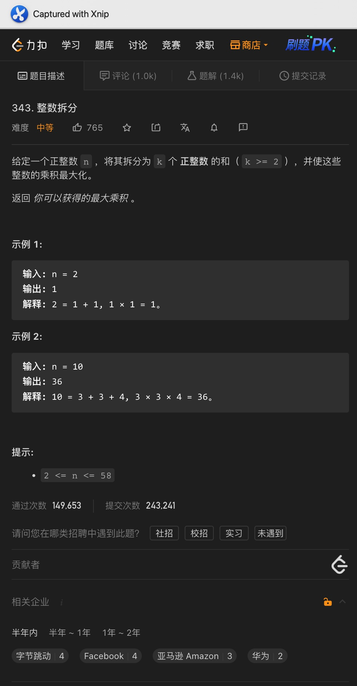

# 一、斐波那契数

题意:

给你一个数字n，请你给出其代表的第n + 1个斐波那契数

思路:

- 动态规划第一天，来点简单的
- 该题目用递归其实很简单，很多老师也是这么教的，但需要使用栈空间，所以复杂度并不理想
- 其实我们只需要维护两个数就行了，每次都只对这两个数进行更新即可，这种保存状态的解法看起来是动态规划，但其实更多的是滑动窗口

复杂度:

- 我们需要更新n - 1次，所以时间复杂度为O(n)
- 我们创建的变量数为常量级，所以空间复杂度为O(1)

# 二、爬楼梯

题意:
要求你爬到第n阶楼梯上，每次可以爬1或2阶，请问有多少种方法

思路:

- 对于除了前两阶的每个楼梯来说：爬到当前阶的方法可以是n - 1阶再爬1阶，也可以是n - 2阶再爬2阶
- 所以爬到n阶的方法 = 爬到n - 1阶 + 爬到n - 2阶
- 乍一看，这不就是斐波那契吗？那递归能解吗？能，但会超时
- 所以这里我们可以改为创建一个数组，每个元素dp[i]都代表爬到第i阶的方法
- 因为第1、2阶是固定的，所以我们应该从i = 3开始初始化，最后只需要返回dp[n]即可
- 其实我们每次只需要到达前两个台阶的方法而已，所以这里我们可以只创建一个长度为2的数组，像昨天一样用滑动窗口的方式来做

复杂度:

- 最坏时，我们遍历了n - 2次，所以时间复杂度为O(n)
- 如果是通过创建数组dp代表每个台阶的方法的话，时间复杂度为O(n)，如果是滑动窗口，则时间复杂度为O(1)

# 三、最小花费爬楼梯

题意:

给你一个数组，其中每个元素代表从当前台阶向上爬所需的费用，可以从0或者1开始且每次可爬1或2阶，请你返回爬到顶部所需的最小费用

思路:

- 这里需要的注意一点: 顶部指的是最后一个台阶的下一步，而不是最后一个台阶，这里和昨天的爬台阶是不同的
- 不过方法其实都一样，爬到某个位置的开销可以是到达其前一个台阶的开销 + 前一个台阶出发的开销，也可以是前两个位置处的开销 + 前两个位置出发的开销
- 因此，我们只需要创建一个数组，初始化前面两个位置的开销即可，之后所有位置的开销均可由它们两个获得
- 最后我们只需要获取到达最后一个台阶或者前两个台阶所需开销的最小值即可

复杂度:

- 我们遍历了一次cost数组，所以时间复杂度为O(n)
- 我们创建了一个新的数组来记录到达每个位置所需的最小开销，所以空间复杂度为O(n)，当然我们，也可以选择创建一个长度为2的数组或者就在cost数组上进行修改，这样空间复杂度就降为了O(1)

# 四、唯一路径

题意:

给你一个m * n的网格，要求从左上角出发到右下角，每次只能向下或者向右，问到最右下角有多少种走法?

思路:

- 经典动规入门题目，我们按照carl的五部曲来:
- 首先是确定dp数组及其下表的含义: 因为题目给我们的是一个二维网格，所以我们需要创建一个二维数组，其中每个元素对应网格中的每个格子，元素的值即为到达该处位置的走法
- 第二步是确定递推公式: 在该题目中，除了第一行和第一列外，到达其余节点的走法必然等于到达上面节点的走法 + 到达左边节点的走法
- 第三步是数组的初始化: 在第二步，我们明确了到达第一行和第一列网格的走法是固定的，即都为1，所以我们只需要将这些网格对应的元素设置为1即可
- 第四步是确定遍历顺序: 因为我们已经初始化了第一行和第一列，所以我们只需要从下标为[1][1]的位置处开始即可
- 最后则是举例推导该数组

复杂度:

- 我们遍历了整个二维数组，所以时间复杂度为O(n * m)
- 我们创建了一个二维数组来记录到达所有节点处时对应的走法，所以空间复杂度为O(n * m)
- 当然，又因为每次迭代其实只需要上面一层的走法而已，所以我们可以改为维护一个一维数组，这样空间复杂度为O(n)

# 五、唯一路径2

题意:

给你一个二维数组，其中有一个点有障碍(元素值为1)，请你返回从左上角到右下角的路径数

思路:

- 要求和昨天一样，但这里加入了一个障碍
- 按照五部曲来：
- 第一步：dp数组的元素依然代表到达每个点的路径数，下标代表每个网格的坐标
- 第二步：递推公式依然为dp[i][j] = dp[i - 1][j] + dp[i][j - 1]
- 第三步：这里我们在初始化的时候就需要注意了，在初始化第一行和第一列的时候，如果当前网格有障碍，那么当前网格以及之后的网格(同行或者列)就无法到达了(值为0)
- 第四步：遍历顺序不变，但在遍历的时候需要判断当前网格是否有障碍，如果有则跳过当前网格(为0)，没有则依然为左边 + 上面
- 最后推导一下，发现没问题

复杂度:

- 我们遍历了一次输入的二维数组，所以时间复杂度为O(n * m)
- 我们创建了一个对应的二维数组，所以空间复杂度为O(n * m)

# 六、整数拆分

题意:

给你一个数字，请你尝试将该数字拆分为几个数字的和，使得这几个数字的乘积最大

思路:

- 很明显，我们并不能简单得直接得出答案(数学方法除外)，因此我们需要从较小的数字开始
- dp五步曲第一步: dp数组代表拆分对应数字获取的最大乘积，索引即为拆分的数字
- 第二步: 之后每个数字对应的乘积都可以由(当前数字 - 拆分数字) * 拆分数字或者dp[当前数 - 拆分数] * 拆分数得到
- 第三步: 因为0和1无意义，所以我们只需要初始化dp[2] = 1即可
- 第四步: 因为2是已知的了，所以我们只需要从3开始即可，而对应的拆分数字则需要从1开始
- 第五步: 进行推导

复杂度:

- 我们从3遍历到了n，其中每次循环又从1开始遍历拆分数字，所以时间复杂度为O(n ^ 2)
- 我们创建了一个新的数组，所以空间复杂度为O(n)

# 七、不同的二叉搜索树

题意:

给你一个整数n，其代表一个二叉搜索树的节点数，请你返回n个节点可组成的互不相同的二叉树的种类

思路:

- 动规题目，我们需要从起始位置看起：
- 如果节点数为0、1，那么自然只有1颗二叉树；如果节点数为2，那么就有2颗；节点数为3就有5颗
- 其实如果只看子树，在节点数为3的情况下，确定一个根节点后，剩下三种情况:
- 左子树节点数为0，右子树为2；左右各为1，左为2，右为0
- 然而这三种又能归纳为：为0的情况 * 为2的情况 + 为1的情况 * 为1的情况 + 为2的情况 * 为0的情况
- 然而这三种情况不是在之前就以及有记录了吗？
- 所以对于1之后的每个节点，我们只需要判断其子树的组合情况即可
- 用一个数组表示n个节点对应的组合数，递推公式为dp[i] += dp[i - j] * dp[j - 1] (j >= 1)
- 这样动规5部曲就完成了两部
- 第三步初始化：我们只需要将第一元素dp[0]设置为1即可
- 第四步遍历: 这里我们从1开始，其代表总的节点数，其中还需要一个内循环，其中每个索引值代表左或者右子树的根节点
- 第五部进行简单的推导即可

复杂度:

- 我们遍历了n次，每次中间又从1开始遍历到当前节点数，所以时间复杂度为O(n ^ 2)
- 我们创建了一个数组来记录之前的二叉树数量，所以空间复杂度为O(n)

# 八、打家劫舍

题意:

给你一个数组，其中每个元素代表每个房屋内的现金金额，如果偷窃连续的两座房屋会触发警报，请你查询出能够盗窃的最大金额

思路:

- 经典动态规划题目，我们依然按照5部曲来分析：
- 首先dp数组中的元素dp[i]代表从0到i可盗窃的最大累计金额
- 其次对于dp[i]，其可以等于dp[i - 2] + nums[i]，也可以等于dp[i- 1]，即当前房屋nums[i]可以选择偷或者不偷，这样递推公式为dp[i] = max(dp[i - 2] + nums[i], dp[i - 1])
- 第三，根据递推公式，我们至少需要dp[0]和dp[1]，所以这里我们需要先初始化dp[0]和d p[1]
- 第四，从递推公式看来，我们的顺序要从i = 2开始向后遍历
- 最后简单推导验证即可

复杂度:

- 我们遍历了一次输入数组，所以时间复杂度为O(n)
- 我们创建了一个dp数组来记录截止每个位置可以获取的最大金额，所以空间复杂度为O(n)

# 九、三角形最小路径和

# 十、分割等和子集

题意:

给你一个数组，请你判断能够将其分割为两个子数组，其中两个子数组的和相等

思路:

- 其实两个子数组的和就是输入数组和的一半
- 但如果数组的和是奇数的话，那自然就不用划分了，必然不可能划分成功
- 之后就是dp的部分了，依然按照5部曲来:
- 我们首先将该为题抽象为01背包问题，nums数组视作物品，其中每个元素的值视作重量，数组和的一半视作背包容量，这里不需要价值，所以我们只需要创建一个一维的数组即可
- 第一步: 创建一个dp数组，其长度为nums数组长度 / 2 + 1，其中每个元素代表对应容量下可得到的数组和
- 第二步: 每个位置上的值 = Max(当前容量对应的值，之前的容量对应的值 + 当前对应nums的输入的元素)
- 第三步: 初始化其实只需要将dp[0]设置为0即可
- 第四步: 因为每个元素的状态是根据之前获取的，可能会下意识从头开始遍历，但这里不行，为了防止重复添加元素值，我们只能从最大容量开始反向遍历
- 最后简单推导即可

复杂度:

- 我们遍历了一次输入数组，所以时间复杂度为O(n)
- 我们创建了一个dp数组，所以空间复杂度为O(n)

# 十一、最后一块石头的重量

题意:

给你一个数组，其中每个元素代表着一块石头的重量，其中任意两个石头之间可以进行相互粉碎，请你判断进行粉碎后剩余石头的最小重量

思路:

- 因为要的是最小重量，所以理想情况肯定是一半对一半，刚好抵消后为0
- 将该问题抽象为01背包，最大容量为总重量的一半，每个石头视作没有价值只有重量的物品
- 按照五部曲来:
- 第一步: dp数组中每个元素dp[i]代表容量i的背包能装下的所有石头的重量
- 第二步: 递推公式依然为dp[i] = dp[i - curStone] + curStone，这里curStone为一块石头的重量
- 第三步: 初始化则只需要全为0即可(Java默认为0，所以不用管)
- 第四步: 遍历顺序依然需要倒序遍历
- 最后简单推导即可
- 最后更新完dp数组后，dp[sum / 2]即代表了接近其中一半的石头重量，那么sum - dp[sum / 2]则为另一半的重量
- 那么粉碎后最小的重量自然是大的一半 - 小的一半，因此结果为sum - dp[sum / 2] - dp[sum / 2]，简写为sum - dp[sum / 2] * 2

复杂度:

- 我们遍历了两次stones数组，第二次中每次都从sum / 2倒序遍历了一次，所以时间复杂度为O(n * m)，其中m是指数组和的一半
- 我们创建了一个dp数组来记录背包里能装的石头重量，所以空间复杂度为O(n)

