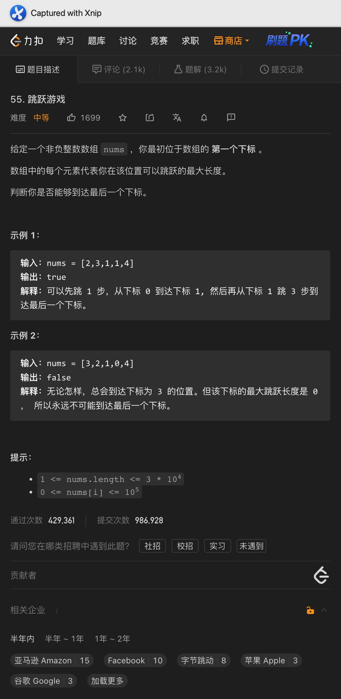

# 一、分发饼干

题意:

给你两个数组，其中一个数组中每个元素代表能满足一个孩子需要的饼干数量，另一个数组中的每个元素代表每个饼干的大小，请你尽可能多的喂饱孩子并返回满足的孩子数量

思路:

- 首先需要认识到，我们需要的是该题目的全局最优解，而贪心的思路就是将求全局最优解分解为局部最优解
- 贪心的问题就是怎样才能证明求局部最优解最终能解决全局最优解，其实贪心和动态规划一样没有固定套路，证明其有效的方法就是尝试举反例
- 在这里，我们局部最优解为先将大饼干分配给胃口大的孩子，尝试举反例后发现可行，所以能够得到全局最优

复杂度:

- 我们对两个数组进行了排序，所以时间复杂度为O(nlog(n) + mlog(m))
- 为了两个排序，我们需要一定的空间，所以空间复杂度为O(log(n) + log(m))

# 二、摆动序列

题意:

给你一个数组，请你计算出其中最长的摆动序列的长度

思路:

- 首先，摆动序列的条件为中间值在"山顶"或者"山谷"，在山脊部分的节点则不能统计在内
- 所以我们要做的就是判断当前节点前后的差值是否符合一个山顶或者山谷的条件，在code里体现在这一语句:if (curDiff > 0 && preDiff <= 0 || curDiff < 0 && preDiff >= 0)
- 有了方法后，我们只需要遍历该数组即可

复杂度:

- 我们遍历了一个输入数组，所以时间复杂度为O(n)
- 我们创建的变量个数为常量级，所以空间复杂度为O(1)

# 三、最大子数组和

题意:

给你一个数组，请你返回其中最大的子数组之和

思路:

- 该题目可以动规，也可以贪心，但贪心比较难想到
- 在尝试得到一个子数组的时候，如果当前子数组的和为负数了，那么之后就算有其他的正数元素加入，该子数组也不会是和最大的子数组了
- 所以我们的局部最优解为: 忽略掉和为负数的子数组，只保留非数组的子数组和

复杂度:

- 我们遍历了一次原数组，所以时间复杂度为O(n)
- 我们创建的变量个数为常量级，所以空间复杂度为O(1)

# 四、买卖股票最佳时机2

题意:

给你一个代表股票价格数组，请你计算出能够获取的最大收益

思路:

- 因为需要的是最大收益，所以我们应该保证每次都底价买入，之后高价卖出，所以我们需要的是股价上升的数字
- 分解一下，如果每次股价上升我们都计算在内，那么加起来就是总的最大收益了
- 将收益拆解为每天的话，我们只需要以两天为单位，收集正收益即可

复杂度:

- 我们遍历了一个参数数组，所以时间复杂度为O(n)
- 我们创建的变量个数为常量级，所以空间复杂度为O(1)

# 五、跳跃游戏

题意:

给你一个数组，其中每个元素代表可以跳跃的最大距离，从第一个元素位置开始，请你判断能否跳到最后一个位置处

思路:

- 

- 因为每个位置可选的跳跃距离有很多，所以乍一看很迷惑
- 但用上贪心的话就容易想到: 我们只需要取能够跳跃的最远距离即可，只要最远距离能够触及最后一个索引位置的话，我们就能到达最后一个位置

复杂度:

- 我们遍历了一次输入数组，所以时间复杂度为O(n)
- 我们创建的变量个数为常量级，所以空间复杂度为O(1)

# 六、跳跃游戏2

题意:

给你一个数组，其中每个元素代表该位置可以跳跃的最大距离，假设每个元素都能跳到最后一个位置处，请你得出跳到最后一个索引位置所需的最小跳跃次数

思路:

- 同昨天一样，基础的思路还是贪心，但这里我们需要考虑步数了
- 为了判断是否还需要再走一步，我们需要维护两个变量表示当前能够到达的最大距离，并在该范围内持续维护下一步能够到达的最大距离
- 如果下一步的最大距离已经可以到达终点了，那么就不再需要再走了
- 但如果已经到了当前能够到达的最大距离处，但下一步的最大距离还是无法到达最后，则需要再走下一步
- 从逻辑上看，这种方法其实需要考虑很多条件，比较麻烦
- 但其实我们可以简化一下，因为题目指明一定是能够到达终点的，反之，倒数第二个位置也一定能到达终点
- 所以我们只需要判断当前是先走过倒数第二个位置还是先到达当前的最大距离即可，如果是前者则不需要再做判断了，如果是后者则需要再走一步

复杂度:

- 我们遍历了一次输入数组，所以时间复杂度为O(n)
- 我们创建的变量个数为常量级，所以空间复杂度为O(1)

# 七、K次取反最大和

题意:

给你一个数组，一个数字k，尝试获取将该数组中的任意个数字共取反k次后(改变符号)的最大和值

思路:

- 如果数组中有负数的话，那么很明显，需要优先将数组中的负数变为正数
- 为了让数组和最大，我们应该优先转变最小的负数，这里我们通过排序就能获取负数的大小次序，每次转换都递减k
- 之后，如果转换所有的负数后，k还是奇数的话，我们只需要改变最小元素的符号即可

复杂度:

- 最坏时我们需要进行两次排序，所以时间复杂度为O(nlogn)
- 我们创建的变量个数为常量级，所以空间复杂度为O(1)

# 八、加油站

题意:

给你一个数组gas，其中每个元素代表在每个加油站可以获取的汽油数量，再给你一个数组cost，其中每个元素代表从该位置到下一个位置所需要的汽油数

请你返回一个数字，如果有能够绕完一圈回到终点的起始位置，那么就返回该位置对应的索引，没有则返回-1

思路:

- 从返回结果来看，该题目有两种结果，那么怎么区分是那种结果呢？其实很简单:
- 只需要判断一下绕完一圈后剩余的汽油是否小于0即可
- 如果大于等于0，那么就需要我们进一步处理了：
- 首先起始位置要成立的话，从该位置出发后的任何位置处都不应该出现剩余油量为负的情况
- 所以我们只需要维护一个变量来表示剩余油量，一旦该变量的值小于零，则说明当前起始位置不成立，我们需要更新到下一个位置处，并重置油量
- 综上，看起来我们需要遍历数组两次，其实计算总的剩余油量和当前剩余油量可以同步进行，所以一次遍历就够了，最后根据总剩余油量更新返回的数值即可

复杂度:

- 我们遍历了一次输入数组，所以时间复杂度为O(n)
- 我们创建的变量数为常量级，所以空间复杂度为O(1)

# 九、发糖

题意:

给你一个数组，其中每个元素代表每个孩子的评分，请你为每个孩子分发糖果，其中每个孩子至少应该有一个糖果，如果相邻两个孩子中有一个评分较高，则他将获取更多的糖果，请你返回满足条件时需要的最少的糖果数量

思路:

- 评分高的获取更多糖果，这个条件可以具体化为：评分高的比相邻的至少多一个糖果
- 但问题就在于，这里相邻既可能是左边，也可能是右边，所以想一次搞定肯定不现实，很容易顾此失彼
- 所以我们可以将问题拆分为两边解决：先满足右边比左边大的情况，再满足左边比右边大的情况
- 所以，我们可以创建一个数组代表给每个孩子分配糖果的数量，并初始化每个元素为1
- 先从左到右遍历，比较右边孩子的评分是否大于左边，如果是则更新右边孩子的糖果为其左边的人 + 1
- 之后再处理左边比右边大的情况，这里需要从右往左了: 因为如果还是从左往右的话，原本比左边小的元素可能在之后的判断中再次进行了更改，并又比左边大了，这样之前的操作就失效了
- 两次遍历后，得到的数组就是答案了

复杂度:

- 我们遍历了两次rating数组，所以时间复杂度为O(n)
- 我们创建了一个新的数组用来记录每个孩子分得的糖果数量，所以空间复杂度为O(n)

# 十、找零

题意:

给你一个数组，其中每个元素都只能为5、10或者20，其代表每个来买柠檬水的顾客所支付的现金面额，请你判断是否能够为所有的顾客找零，每杯5元

思路:

- 因为现金面额只有三种，所以我们只需要针对这三种情况做判断即可
- 只有当现金为10或者20时才需要找零，而为10元找零需要5元的现金，为20元找零则需要10元 + 5元或者3张5元的现金
- 因此，我们需要记录收到的5元和10元的现金数
- 如果遇到5元的现金则直接记录，如果遇到10元的现金则判断5元现金是否有储备，没有则直接返回false
- 如果遇到20元则判断是否有10元 + 5元或者3张5元的现金，都没有则返回false
- 注意，因为5元可以给10元和20元找零，所以应该尽可能保留才行

复杂度:

- 我们遍历了一次输入数组，所以时间复杂度为O(n)
- 我们创建的变量数为常量级，所以空间复杂度为O(1)

# 十一、身高队列重建

题意:

给你一个二维数组，其中每个元素都是一个长度为二的数组，其中第一个元素代表当前这个人的身高，第二个元素代表其前面应该有多少人比他高或者一样高

请你根据这两个元素将该数组进行重建，使得元素所在的位置符合其值

思路:

- 因为题目给的是一个二维数组，所以我们需要同时考虑两个方面：身高和前面的人数
- 很明显，和发糖问题一样，我们无法同时考虑两个维度，所以是能同时考虑其中一个
- 首先，肯定不能首先考虑前面的人数，这样排序后，身高不一定符合条件，后续一旦改动就会出问题，所以我们需要根据身高排序
- 那么问题又来了，如果身高相同的话，又该怎么排序呢？
- 其实也很明显，第二个元素对应数字小的排前面呀，因为越靠左，左边的人数就越少，搞好符合第二个元素指代的意思
- 排好序后，我们只需要遍历数组，将每个元素的第二个元素作为索引添加到结果队列/集合中，最后返回对应的数组即可

复杂度:

- 我们进行了一次排序，所以时间复杂度为O(nlog(n))
- 我们创建了一个结果集合，所以空间复杂度为O(n)

# 十二、引爆气球所需最少的箭

题意:
和昨天一样，给你一个每个元素都是长度为2的数组的二维数组，其中每个元素都代表一个气球做处的范围(左右边界)，这些气球有可能彼此重叠

你可以从任意位置处向上射箭，请问想要引爆所有气球的话，最少需要多少支箭

题意:

- 想要箭最少，那么就需要每次射出时都尽可能多的引爆气球，所以这里需要找到这些气球的重叠部分
- 为了方便统计重叠部分，我们需要排序才能将气球放在一起
- 之后我们遍历该数组，每次都比较相邻的两个数组，如图，每当遇到重叠部分时则更新右边界(两个气球中右边界的最小值)，没有重叠部分则需要多加一支箭

复杂度:

- 我们对输入数组进行了排序，所以时间复杂度为O(nlog(n))
- 我们并未创建额外的空间，所以空间复杂度为O(1)

# 十三、无重叠区间(注意边界更新)

题意:

给你一个二维数组，每个元素都代表一个区间的范围，请你删除一些区间使得这些区间之间不会重复，并返回所需删除区间的最少数量

思路:

- 首先肯定是需要排序后再比较的，又因为遍历的时候是从左往右的，所以这里我们按照右边界排序(每次比较后都会更新右边界用来和下一个区间进行比较)
- 之后我们怎么做？统计重叠的部分？这样其实不好做的，重叠的部分该删除多少区间呢？
- 这里我们反其道行之，统计彼此不重复的部分即可，最后用区间总数减去不重复的部分不就是需要删除的重复区间数了吗？

复杂度:

- 我们对数组进行了排序，所以时间复杂度为O(nlog(n))
- 我们创建的空间为常量级，所以空间复杂度为O(1)

# 十四、字母区间

题意:

给你一个字符串，请你尝试将其划分为尽可能多的多个区间，其中每个字符只能出现在一个区间中，最后返回每个区间对应的长度

思路:

- 乍一看：分割区间？上回溯！
- 其实不用，因为每个字符只能出现在一个区间中
- 那么不管这个字符重复了多少次，它最后一次出现的索引位置一定小于等于其所处这个区间的右边界索引位置处
- 但问题是：如何确定区间的分界呢？
- 其实答案就在上一步分析中：因为区间内所有字符对应的最大索引一定在区间范围内，而的区间边界其实就是该区间中所有字符对应的最大的索引
- 所以只要当前的索引位置到了该区间中字符对应的最大索引位置处的话，就意味着到了边界了，此时利用左右边界之差即可获取当前边界的长度

复杂度:

- 我们遍历了两次输入字符串，所以时间复杂度为O(n)
- 除去结果集合，我们创建的变量为常量级，所以空间复杂度为O(n)

