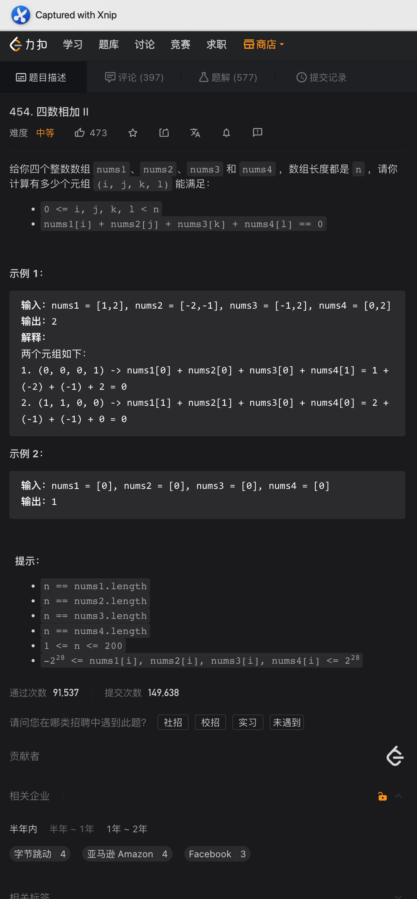

# 1、存在重复元素

题意:
给你一个数组，请你判断其中是否有两个重复的数字

思路1:

- 因为是数字数组，我们可以记录下每个数字，如果有重复则返回true，因为Set是一个好的工具

复杂度1:

- 我们遍历了数字，所以时间复杂度为O(n)
- 我们用Set记录了所有的数字，所以空间复杂度为O(1)

思路2:

- 如果有重复数字的话，那么对该数组排序后，重复的数字一定是相邻的，所以我们只需要判断相邻数字是否重复即可

复杂度2:

- 我们对数字进行了一次排序，时间复杂度为O(nlog(n))
- 我们并未使用额外的空间，所以空间复杂度为O(1)

# 2、字母异位词

题意:
给你两个字符串，请你判断第二个字符串是否为第一个字符串的异位词

思路:

- 因为输入的字符全为小写字母，所以我们可以用一个长度为26的数组记录下每个字母出现的次数
- 首先遍历第一个字符串获取其中每个字母出现的次数，之后遍历第二个，将对应字母次数-1即可
- 最后遍历一次该记录数组，如果其中有一个字母对应的次数大于0，则说明两者不是异位词，返回false即可

复杂度:

- 我们遍历了两个字符串，所以时间复杂度为O(n)
- 我们创建的数组长度是固定的，所以空间复杂度为O(1)

# 3、异位词分组

题意:

给你一个字符串数组，请你将其中的异位词划分到一起后，返回该划分后的结果

思路:

- 因为异位词的字母组合是相同的，所以如果我们将其进行排序的话，结果应该是相同的，所以我们通过排序的方式就能判断异位词了
- 因为所有的异位词都是根据排序后的结果来分组的，所以我们需要将排序后的结果和实际字符对应起来，这不就是Map吗？
- 所以我们只需要遍历字符串数组，每次都将其中的字符串作为数组排序，将排序后的字符串作为key即可，之后将所有对应为一个key的放入map中的value即可
- 最后只需要返回map的values即可

复杂度:

- 我们遍历了一次字符串数组，每次循环中都将当前字符串进行了排序，所以时间复杂度为O(nlog(k))，k为最大的字符串长度
- 我们创建了一个map来记录每个key对应的字符，所以空间复杂度为O(nk)

# 4、字符串中的异位词

题意:

给你两个字符串，请你找出第一个字符串中所有为第二个字符串异位词的子字符串的开始索引位置

思路:

- 因为是找异位词，所以我们可以参照昨天的方法：即对当前子字符串排序后比较，方法可行，但遍历的同时再排序的话，时间复杂度为O(nlog(n))，有没有更好的？
- 这里我们可以用空间换时间: 创建两个数组，一个用来记录目标字符串的词频，另一个用来记录当前遍历字符的词频，比较即可

复杂度:

- 我们只是遍历了两个字符串，所以时间复杂度为O(n + m)
- 我们创建了两个常数数组，所以空间复杂度为O(1)

# 5、共用字符

题意:

给你一个字符串数组，请你展出在其中每个字符串都出现过的字符，并添加到结果集中返回

思路:

- 因为是字母字符，所以我们可以创建一个长度为26的数组来记录每个字母出现出的频率
- 而在所有字符串中重复出现的字符则保留下来，没有则舍去，因此我们只需要对比不同字符串中字母出现的频率即可，保留其中最小的(其中一个字符串中没有该字符则为0，因此被舍弃)
- 最后只需要判断其中不为0的即可，依照出现的频率添加就是了

复杂度:

- 我们遍历了所有的元素，所以时间复杂度为O(n)
- 我们为每个字符串都创建了一个长度为26的数组，所以空间复杂度为O(n)

# 6、最大数索引

题意:

给你一个数组，请你找出其中最大的数字，并判断其中的最大数字是否小于其他数字的两倍，如果小于则返回-1，否则返回该最大数字在数组中的索引

思路:

- 按照题目的要求可以分为两步: 找到最大数，判断最大数是否大于其他数字的两倍
- 所以我们需要先找出其中的最大数，这倒是很简单，一次遍历就可以了，但第二步呢？再遍历一次？当然可以，但其实不用
- 所谓的大于其他数字的两倍其实等效于: 大于第二大数字的两倍，这样就不需要与剩余数字比较了
- 所以，我们只需要获取最大和第二大数字即可
- 所以我这里创建了一个长度为2的数组，用来记录最大和第二大的数字，最后判断一下即可，这样我们就只需要遍历一次数字了

复杂度:

- 我们遍历了一次数字，所以时间复杂度为O(n)
- 我们创建了一个长度为2的数组，所以空间复杂度为O(1)

# 7、数组交集

题意:

给你两个数组，请你找出两者中所有的交集，并以数组的形式返回，其中重复的也要返回

思路:

- 

- 因为需要将重复的也返回，所以这里不能用交集1中的Set了，首先最常用的肯定是HashMap，即统计数字出现的次数，但我们这里不用Map
- 因为是数字，所以如果我们对数组进行排序的话，同时遍历两个数组时，相同的数组在两个数组中的相对位置是一致的，所以我们可以使用双指针

复杂度:

- 我们对两个数组进行了排序，所以时间复杂度为O(nlog(n))
- 我们创建了一个临时数组来记录对应的数字，所以空间复杂度为O(n)

# 8、判断快乐数

题意:

给你一个数字，请你判断其是否为快乐数(将其一直替换为所有数位上的数字的平方和后最终为1)

思路:

- 因为不为快乐数的话，其会一直重复，所以我们只需要判断其是否重复即可，如果重复则判断重复出现的数是否为1即可
- 因此我们可以使用set或者其他集合

复杂度:

- 我们需要遍历多次，所以时间复杂度为O(n)
- 我们记录了所有迭代的数字，所以空间复杂度为O(n)

# 9、四数相加2

题意:

给你四个数组，请你计算出有多少个元组，即:

0 <= i, j, k, l < n
nums1[i] + nums2[j] + nums3[k] + nums4[l] == 0

思路:

- 因为我们需要获取的是和为0的组合，所以该问题可以被拆分为两个部分:
- 即前两个数组之和与后两个数组之和为0
- 那么我们只需要先记录前两个数组之和，再判断剩余两个数组之和的相反数是否存在与之前两个数组之和即可
- 所以我们需要做的就是记录下前两个数组每个和值对应频率

复杂度:

- 我们将前两个数组和后两个数组中的每个中和值组合过了一遍，所以时间复杂度为O(n^2)
- 我们用一个HashMap保存了前两个数组的每个和值组合，所以空间复杂度为O(n^2)

# 10、三数之和

题意:

给你一个数组，请你找出其中所有的三元组，满足a + b + c = 0

思路:

- 其实如果我们固定住其中一个数字，剩下的不就是两数之和问题吗？
- 但需要注意的是，我们获取的三元组不能重复，所以我们要想办法去重，这样一来HashMap就不太好做了
- 其实我们可以对该数组进行排序，排序后，重复的数字就挨在一起了，这样我们就能通过判断临近的数字来去重了，而获取剩余两个数字的方法则可以利用双指针从两边向中间来搜寻

复杂度:

- 我们遍历了所有的数字，每次遍历又对该子范围内的数字通过双指针进行了搜寻，因此时间复杂度为O(n^2)
- 我们用一个List记录了结果，所以空间复杂度为O(n)

# 11、四数之和

题意:

给你一个数组和一个目标数，请你找出对应的四元组，使得它们的和为目标数

思路:

- 

- 其实做法和三数之和没什么不同，只不过需要再多一层循环而已，也就是说，我们需要固定前面两个数，再用双指针的方式寻找剩下两个数字即可

复杂度:

- 我们遍历四元组的时间复杂度为O(n^3)，所以时间复杂度为O(n^3)
- 我们临时存储使用的空间与n有关，所以空间复杂度为O(n)

# 12、缺失的第一个正数

题意:

给你一个数组，请你返回没有在该数组中出现的最小正整数

思路:

- 因为我们需要寻找的只是正整数，所以输入数组中的数分为两种: 负数和0、正整数
- 因此，我们只需要判断其中的正整数而已，那么我只需要标记一下出现过的正整数，之后只需要返回第一个没有标记的正整数即可
- 但问题是，如果负数和0不做标记，那么在对出现的正整数进行标记时怎么做？
- 而且在做标记时，其实是标记数字对应的索引位置，因此我们获取的数字对应索引应该>=0，此时不能在数组中保留负数
- 因此，我们可以将数组中的非正数更新为array.length，而将<nums.length的正整数进行标记时再将对应位置的数标记为负数
- 最后遍历该数组，其中最小的没有标记的小于nums.length的数字就是我们的答案了

复杂度:

- 我们遍历了三次数组，所以时间复杂度为O(n)
- 我们并未创建额外的空间，所以空间复杂度为O(1)

# 13、和为K的子数组

题意:

给你一个数组和一个目标数，请你计算出数组中和值为该目标数的子数组的数量

思路:

- 因为是子数组和，所以我们可以直接遍历所有的子数组，获取所有的子数组和后获取对应的数量即可
- 但这种暴力方式的时间复杂度为O(n^2)，面试的时候用来速通一面还行(bushi)
- 其实我们可以记录下对应数组范围的前缀和，即记录下从第一个元素到最后一个元素范围内对应的数组和
- 再通过前缀和之差来匹配目标数，并将对应前缀和的出现次数添加到结果即可

复杂度:

- 我们遍历了该数组，所以时间复杂度为O(n)
- 我们创建了一个HashMap，所以空间复杂度为O(n)

# 14、重复数

题意:

给你一个字符串，请你判断其中的字符是否重复

思路:

- 该题目其实就是判断重复，所以我们需要记录下字符的"频率"才行
- 这里我们最容易想到Set，但这样用到了额外的数据结构
- 其实我们可以用一个数组来代替，即一个长度为26的数组来记录，甚至可以使用bitmap来做(本菜鸡还不会)

复杂度:

- 我们遍历了所有的字符，所以时间复杂度为O(n)
- 我们创建的数组长度是固定的，所以空间复杂度为O(1)

# 15、重复DNA序列

题意:

给你一个代表DNA序列的字符串，请你找出其中出现次数超过1次的长度为10的DNA序列

思路:

- 因为我们需要获取的是重复出现的DNA序列，所以我们需要记录下所有DNA序列的次数
- 所以要将DNA序列和其出现次数对应起来，这里我们可以使用HashMap
- 所以只要某个DNA序列的出现次数超过1次，那么就将其添加到结果集中即可

复杂度:

- 我们遍历了一次字符串，所以时间复杂度为O(n)
- 我们创建了一个HashMap来记录每个DNA序列的频数，所以空间复杂度为O(n)

# 16、最长连续序列

题意:

给你一个数组，请你找出数字连续的最长序列的长度

思路:

- 因为是数字连续，所以我们每个数字都要尝试一次，但最高效的方式自然是从最值开始
- 所以我们首先应该找到数组中的最值，因为需要对每个数字都进行判断，用数组的话很麻烦，所以我们可以将数字放到一个set中，这样既能快速寻找，还能去重
- 找到最值后，我们向一个方向延伸(最小值则自增，最大值则自减)，如果出现断层，则将当前的连续长度与结果比较获取其中的最大值，直到遍历所有元素

复杂度:

- 我们遍历了一个数组，遍历了一次set，所以时间复杂度为O(n)
- 我们创建了一个Set来记录所有的数字，所以空间复杂度为O(n)

