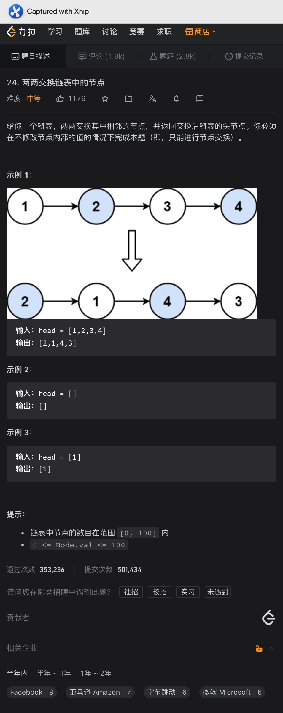

# 1、两数之和

题意:

给你两个链表的头节点，将每个节点作为一个数位，请你计算出从头节点开始求和后的新链表

思路:

- 获取新链表的方式很明显就是将两个链表同步遍历，获取的值添加到一个新的链表中即可
- 但如果这两个链表长度不一样呢？这样一来其中一个链表还没遍历完，另一个链表对应的指针就已经指向null了
- 所以对应指向null的指针，我们将其判断为0并停止遍历该链表即可
- 在获取节点值的过程中，如果节点值之和大于10，那么我们还需要为下一位获取进位，并将个位作为新的节点值
- 最后，我们的进位有可能依然为1，所以我们还需要再创建一个节点来构建这个进位

复杂度:

- 我们遍历的次数取决于两链表中最长的那个，所以时间复杂度为O(max(n, m))
- 我们创建了一个新的链表，其长度取决于两链表中最长的那个，所以空间复杂度为O(max(n, m))

# 2、重排链表

题意:
给你一个链表，请你将其重排

思路:

- 最简单的方法就是将所有节点存储在一个数组/集合中，使用双指针从头尾开始交替连接节点即可，但这样需要使用额外的空间
- 上述方法的核心是其中一部分要从左往右，另一部分要从右往左，所以我们需要获取左右两边的头
- 又因为左右交替的节点数应该从中间划分，所以我们需要将链表从中间位置划分，也就是找中间节点
- 找中间节点使用快慢指针即可
- 划分后右边链表应该从右往左，所以应该反转右部分链表的节点才行，也就是简单的反转链表
- 最后根据这两个节点交替重排即可

复杂度:

- 我们遍历了2次链表，所以时间复杂度为O(n)
- 我们没有创建额外的空间，所以空间复杂度为O(1)

# 3、k个一组翻转链表

题意:
给你一个链表和一个数字k，请你将链表以每k个一组的方式进行翻转

思路:

- 最简单的方法就是每遍历一次就将对应范围的链表截断，并翻转后保存
- 最后将这些链表连接起来，但我们需要空间来保存这些翻转的链表，其实可以直接原地翻转从而省去空间
- 简单来说，我们只需要将每次翻转后的链表与其余的部分重新连接起来即可
- 为了能够重新连接，我们除了需要得到翻转后链表的头尾节点之外，我们还需要知道它前后位置其他部分与它衔接的链表节点
- 所以在翻转之前我们需要获取到它整个部分的前一个节点，以及其后面部分的开头节点
- 其实我们只需要创建两个节点后，遍历其中一个节点k次，此时该节点指向需要翻转部分的末尾节点，为了能够翻转后连接，我们还需要记录下它的下一个节点，作为下一个部分的开头节点
- 另一个节点作为先导节点(在head之前)，它的后一个节点作为翻转节点的头节点即可
- 这样翻转之后我们既知道了翻转后链表的头尾节点，也知道了其余部分与它相连的节点了，因此我们只需要在循环中维护一个先导节点和末尾节点即可

复杂度:

- 我们遍历了所有的节点，所以时间复杂度为O(n)
- 我们没有创建额外的空间，所以空间复杂度为O(1)

# 4、合并有序链表

题意:

给你两个有序链表，请将它们合并为一个有序的链表

思路:

- 首先最容易想到的就是同时遍历两个链表，比较当前节点的大小，将小节点添加到前面即可
- 最后如果两链表长度不同的话，剩余部分直接链接到末尾即可
- 但其实还可以使用递归
- 因为节点值的小的要放在前面，所以我们只需要判断第一个节点值谁小，那么结果返回的就是谁
- 剩余的部分则该头节点的剩余部分与另一个节点之间进行判断即可

复杂度:

- 两种方法中我们都遍历了所有的节点，所以时间复杂度为O(n + m)
- 第一个方法中，我们没有创建额外的空间，所以空间复杂度为O(1)
- 第二个方法中，我们递归调用的栈空间取决于节点数，所以空间复杂度为O(n + m)

# 5、翻转链表2

题意:

给你一个链表，两个数字，请你将两个数字所指代范围内的链表节点翻转后返回链表

思路:

- 对于链表部分翻转的思路为: 找到翻转部分链表的头尾节点，找到头节点的前一个节点，找到尾节点的后一个节点
- 翻转该部分节点后，将初始头节点的前一个节点链接到翻转后的头节点，将翻转后的尾节点链接到初始尾节点的后一个节点
- 所以我们要做的就是找出这四个节点
- 说是要找四个节点，其实只需要找两个节点即可: 翻转部分链表头节点的前一个节点和翻转部分链表尾节点的后一个节点
- 因为这两个节点再往后迭代就是我们所需要的另外两个节点了
- 找到这两个节点的方式就是通过参数中的left和right，分别迭代对应的次数即可

复杂度

- 我们最坏时需要翻转所有的节点，所以时间复杂度为O(n)
- 我们没有创建额外的空间，所以空间复杂度为O(1)

# 6、删除倒数第n个节点

题意:

给你一个链表和一个数字n，请你产出其中倒数第n个节点

思路:

- 很明显我们需要先定位到那个需要删除节点的上一个节点，让上一个节点的next引用指向删除节点的下一个节点即可
- 想要找到上一个节点其实使用快慢指针就可以，只需要先将快指针迭代n次即可，之后再一起快慢指针迭代
- 最后快指针到达最后一个节点后，我们慢指针就指向了删除节点的上一个节点

复杂度:

- 我们遍历了所有的节点，所以时间复杂度为O(n)
- 我们创建的空间为常量级，所以空间复杂度为O(1)

# 7、合并k个有序链表

题意:

给你一个链表集合，其中有多个有序链表，请你将其中所有的链表合并为一个有序链表

思路:

- 借鉴一下合并有序链表的方法:
- 我们可以每次都只合并两个链表并返回结果，再将结果与下一个链表进行合并即可
- 这样写固然简单，但很多部分的节点被多次重复访问了，所以耗时比较夸张
- 如果将这个链表数组中的所有链表看作是二叉树的节点，每次都以两个链表为一组
- 两两合并之后再与其他组合并的结果再次合并，这样就能避免很多重复了(类似归并排序)
- 所以我们要做的只是两两分组而已，使用双指针取中间值即可

复杂度:

- 递归调用的次数为log(k)，k为链表数组的长度，而每轮合并都需要2n的时间，n为最长链表的长度，所以时间复杂度为O(kn * log(k))
- 我们递归调用的栈空间为log(k)，所以时间复杂度为O(log(k))，合并的部分可以用不占用额外空间的方式

# 8、回文链表

题意:

给你一个链表，请你判断其是否为回文链表

思路:

- 简单的解题其实很简单，我们只需要将所有节点存储到集合中再用双指针就行了
- 但这种方法需要O(n)的空间复杂度，我们想要O(1)怎么办？
- 最容易想到的就是翻转后半部分，然后同步迭代开头节点和末尾节点即可
- 需要实现这种方法需要两步:
- 首先要找到中间节点，然后再翻转后半部分即可
- 找中间节点使用快慢指针即可，而翻转链表就很常规了！

复杂度:

- 我们遍历的时间复杂度为O(n)
- 我们没有创建额外的空间，所以空间复杂度为O(1)

# 9、删除重复节点

题意:
给你一个链表，请你删除重复的节点并保留一个

思路:

- 因为链表是有序的，所以如果有重复值的话，重复节点应该是紧邻的，所以我们只需要判断一个节点和它的下一个节点即可
- 如果重复则将该节点的next引用设置为下一个节点的next(跳过了下一个节点)

复杂度:

- 我们遍历了所有的节点，所以时间复杂度为O(n)
- 我们没有创建额外的空间，所以空间复杂度为O(1)

# 10、删除重复节点2

题意:

给你一个有序链表，请你删除其中所有的重复节点，只保留其中没有重复的节点

思路:

- 同删除重复节点1一样，我们同样可以通过遍历的方式判断当前节点值与下一个节点值从而判断是否有重复节点
- 但这里需要将所有的重复节点都删除，所以不能简单的更新next引用，而且由于头节点也可能被删除，所以我们需要创建一个虚拟头节点
- 但通过迭代，我们可以将指针指向每个重复部分的最后一个节点处
- 此时我们通过一个前驱节点判断是否有重复部分：
- 遍历指针最开始在前驱节点"pre"的后面，如果有重复部分，那么遍历指针会向后迭代
- 此时我们再判断pre.next和遍历指针是否相等即可，不相等说明中间有重复节点，此时将pre.next设置为遍历指针的next即可(因为遍历指针此时指向了最后一个重复节点)
- 如果相等说明中间没有重复节点，此时正常迭代pre即可
- 不管结果如何，遍历指针后向后正常迭代
- 最后我们只需要返回虚拟头节点的下一个节点即可

复杂度:

- 

- 我们遍历了所有的节点，所以时间复杂度为O(n)
- 我们没有创建额外的空间，所以空间复杂度为O(1)

# 11、环形链表2

题意:

给你一个链表，如果其中没有环的话返回null，如果有的话请你返回其中环的入口节点

思路:

- 最简单的方法还是使用Set，第一个重复的节点必然是入口节点，但此时空间复杂度为O(n)
- 利用环形链表1中的结论，如果我们同时迭代一个慢指针和一个快指针，在有环的情况下，两个指针最终一定会相遇，此时说明链表有环
- 此时有另一个结论(论证过程看图)：即再从head节点开始遍历一个节点的话，最终该节点会与slow节点在环的入口处相遇
- 因此此时我们再重置fast指针，使其重新指向head，之后同步更新slow和fast指针，直到它们相遇后，返回其中的一个即可(都到达了入口)

复杂度:

- 我们遍历了所有的节点，所以时间复杂度为O(n)
- 我们没有创建额外的空间，所以空间复杂度为O(1)

# 12、实现LinkedList

# 13、实现LRU(HashMap版)

# 14、又 LRU

# 15、排序链表

题意:

给你一个乱序的链表，请你将其处理为一个有序链表

思路:

- 这里要我们的做的其实就是链表排序，最直观的方法就是将所以的链表写到数组/集合中，然后对数组/集合进行排序后再转换为链表即可
- 但这样做的话除了最终结果外还需要另外的空间
- 其实我们可以使用归并排序的方式来做
- 在数组中，要做归并排序的话就需要在每次递归时将数组分为两部分
- 在链表中怎么分为两部分？很明显用双指针就行
- 在数组中，当递归调用后数组被划分为只有1个数时，则开始合并
- 在链表中怎么合并？其实就是合并两个有序链表的问题罢了，不过最好使用O(1) Space的方式来做
- 综上，我们通过双指针获取链表的左右部分后，再合并两个部分即可

复杂度:

- 我们每次递归调用的次数为log(n)，而共有n个节点，所以时间复杂度为O(nlog(n))
- 我们递归调用的栈空间为log(n)，而结果链表所用空间取决于原链表的长度，所以空间复杂度为O(n)

# 16、随机链表深拷贝

题意:

给你一个链表，其中每个节点都有有一个random节点指向随机的节点，请你返回该链表的一个深拷贝对象

思路:

- 首先简单讲述一下深浅拷贝的区别：
- 在Java中浅拷贝的定义：对于基础类型直接复制其值，对于引用类型，会复制其对象在stack中的地址(该引用类型应该继承Cloneable接口，并重写clone方法)
- 所以对于引用类型来说，浅拷贝只是复制了地址值而已，通过浅拷贝的对象操作数据时，也会影响原对象中的数据，因为它们指向的是heap中的同一片区域

- 而深拷贝则会将所有的引用类型对象的所有属性都复制一份并放在不同的heap空间中，这样深拷贝的对象和浅拷贝的对象指向的就是不同的heap区域了，彼此互不影响

- 回到题目中，题目要求我们获取一份深拷贝对象，所以我们要手动复制该链表对象中的所有属性
- 该链表中的属性无非有三个：val，next，random
- val和next都很简单，我们只需要在原链表中每个节点的后面都创建一个新的节点，交替连接原节点和其后面的复制节点即可
- 到这里，如果没有random属性的话，我们只需要断开还原两个链表即可，但我们现在还需要处理random
- 这里我们处理random的formula为: randomGuide.next.random = randomGuide.random.next;
- 这样我们就设置好了拷贝链表中节点的random属性了
- 之后只需要断开两个链表即可

复杂度:

- 我们三次遍历了所有的节点，所以时间复杂度为O(n)
- 除开返回的结果，我们并未使用额外的空间，所以空间复杂度为O(1)

# 17、链表相交

题意:

给你两个链表，请你判断它们是否相交，如果相交则返回第一个相交的节点，如果不相交则返回null

思路1:

- 先说最直观的方法
- 因为两个链表的长度有可能不一致，所以在判断的时候我们需要让两个指针对应两个链表中相同的位置才行
- 因此我们需要先遍历两个链表以获取两个链表的长度，之后获取长度差"diff"
- 重置两个指针到头节点位置，将长度较长的那个链表对应的指针迭代"diff"次，此时两个指针就处于同一位置了
- 同步迭代两个指针，一但两指针相同(地址值相同)，说明两链表相交，返回节点即可，否则最后返回null

思路2:

- 其实如果我们将两个链表彼此头尾相连，此时就形成了两个环形链表，问题就变成了求环形链表的入口节点
- 因此我们只需要将两个链表相互首尾连接即可

复杂度:

- 两种方法都对两个链表进行了遍历，所以时间复杂度为O(n + m)
- 我们并未创建与n相同的额外空间，所以空间复杂度为O(1)

# 18、删除链表节点

题意:

给你一个链表，一个数字，请你删除该链表中节点值等于给定数字的节点

思路:

- 题目不难，主要是通过这个题目引出虚拟头节点的概念
- 如果我们直接创建一个head节点的引用，此时对其进行迭代时会有问题:
- 如果第一个节点的值就为val呢？此时该怎么删除？或者说删除后我们怎么返回新的头节点？
- 当然，我们可以对头节点等于val的情况进行特殊处理，但有没有普适性的方法？
- 这里用虚拟头节点的话就很轻松了
- 我们创建一个虚拟头节点，其next指向head，再创建一个新的引用指向该虚拟头节点
- 之后遍历该引用，如果其next对应节点值为val，则跳过next节点，将next.next节点设置为next
- 如果不为val则正常遍历

复杂度:

- 我们遍历了一次链表，所以时间复杂度为O(n)
- 我们并未创建与n相同的额外空间，所以空间复杂度为O(1)

# 19、奇偶链表

题意:

给你一个链表，请你将其中奇偶位置的节点放在一起重组

思路:

- 很明显，我们需要将节点区分为奇和偶两种，所以对应的链表也应该有两个
- 将两种链表区分之后连接起来即可
- 问题是如何区分呢？
- 我们创建一个operator指向head.next.next
- 此时其指向一个奇数节点，将其连接到奇数节点后，向后迭代一位，此时operator指向一个偶数节点，在将其连接到偶数链表即可

复杂度:

- 我们遍历了一次链表，所以时间复杂度为O(n)
- 我们并未创建与n相同的额外空间，所以空间复杂度为O(1)

# 20、指定重排链表

题意:

给你一个链表，一个数字k，请你将该链表进行重排: 节点值小于k的节点放在左边，等于k的放在中间，大于的放在右边，且处于同一侧的节点彼此之间的相对位置与原链表应该一致

思路:

- 很明显，链表节点被分为了三种，所以我们也需要构建三个链表，最后连接起来即可
- 遍历链表，根据当前节点值与k的大小关系将当前节点添加到对应的链表中
- 最后连接三个链表的时候需要注意：middle链表有可能为null，所以要进行一次判断

复杂度:

- 我们遍历了一次原链表，所以时间复杂度为O(n)
- 我们并未创建与n相同的额外空间，所以空间复杂度为O(1)

# 21、节点两两交换

题意:

给你一个链表，请你将其中相邻的节点两两交换

思路1:

- 每次交换两个节点后，其中的第二个节点变为了"头节点"，而第一个节点的next要指向第二个节点的next
- 所以我们每次将第一个节点的next设置为第二个节点的next，再将第二个节点的next设置为第一个节点即可
- 通过递归的方式，我们可以重复上述步骤，只需要将剩余部分链接至第一个节点的next即可

思路2:

- 其实方法一中的递归可以转换为迭代
- 我们只需要创建一个先导节点，其next和next.next即为我们需要交换的节点
- 处理方式与方法一一致，不过每次循环后都需要重置先导节点

复杂度:

- 两种方法都遍历了所有的节点，所以时间复杂度为O(n)
- 方法一中，递归调用的栈空间取决于链表的长度，所以空间复杂度为O(n)
- 我们并未创建与n相同的额外空间，所以空间复杂度为O(1)

# 22、Zip Linked List

同Algorithm Day136，只是多了一个返回值

# 23、分组链表

题意:

给你一个链表，一个目标数，请你将该链表中所有值小于目标数的节点放在剩余节点的前面

思路:

- 很明显，我们需要将链表节点分为两类，那么想要将这两类节点重排则只有分为两个链表了
- 因此，我们遍历所有的节点后，将所有的节点添加到两个链表中
- 最后再根据题目要求连接两个链表即可

复杂度:

- 我们遍历了所有的节点，所以时间复杂度为O(n)
- 我们并未创建与n相同的额外空间，所以空间复杂度为O(1)

# 24、删除和值为0的连续节点

题意:

给你一个链表，请你将其中和值为0的连续子节点都删除

思路:

- 如果有一段连续的子节点的和值为0，那么这一段之前的所有节点值之和与去除这些子节点别无二致，所以一旦发现所谓的"前缀和"与之前相同，则说明这一段的节点值之和为0
- 因此，我们需要先记录下每段节点值之和及其对应的最后一个节点
- 再次遍历后，我们只需要判断是否有之前记录过的节点和值，有则跳过中间节点即可，具体过程见大佬的图解

复杂度:

- 我们遍历了两次该链表，所以时间复杂度为O(n)
- 我们需要空间存储节点和值和对应的最后一个节点，所以空间复杂度为O(n)

# 25、倒序链表和

题意:

给你两个链表，请你获取它们从尾到头相加的结果

思路:

- 

- 其实我们只需要将两个链表翻转一下，那么问题就变成了链表两数之和了，最后再将结果链表翻转一下即可
- 当然，不用反转的话用栈也是可以的，但空间复杂度不为O(1)

复杂度:

- 我们翻转了三次链表，又遍历了一次，所以时间复杂度为O(n)
- 我们并未创建与n相同的额外空间，所以空间复杂度为O(1)

# 26、二叉树每层链表

题意:

给你一颗二叉树，请你将其中每层的节点都重组为一个链表，最后返回所以节点组成的链表数组

思路:

- 因为需要我们将每层的节点放在一起，所以自然需要我们按照每层的顺序去遍历节点，这不就是BFS吗？经典的队列 + 二叉树罢了，其实和层序遍历差不多
- 所以我们只需要按照BFS的顺序遍历所有的节点，并将每层的节点都添加到同一个链表中即可

复杂度:

- 我们遍历了所有的节点，所以时间复杂度为O(n)
- 我们用链表和队列存储了所有的节点，所以空间复杂度为O(n)

