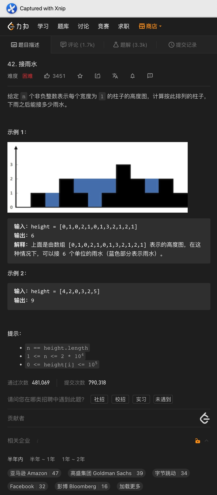

# 一、每日温度

题意:

给你一个数组，其代表每天的温度，请你返回一个数组，其中每个元素代表从该天开始，经历多少天后才有更高的温度，如果没有则设置为0

思路:

- 最容易想到的方法就是为每个位置的元素遍历一次原数组，这样做的时间复杂度为O(n ^ 2)
- 想要将用时变为线性复杂度，则需要使用单调栈
- 所谓单调栈即栈中的元素是单调的，要么单调递增，要么单调递减，而顺序则可以是从栈顶到栈底，也可以反过来
- 单调栈恰恰就是用来解决这种求元素左边或者右边第一个比它大或者小的元素的问题
- 在该题目中，如果之后没有出现温度上升，则将当前元素设置为0，也就是说，如果之后的温度都没有变高，则不用做处理，而体现在单调栈中则是入栈
- 然而一旦之后有温度升高，则需要记录下这个升高的温度对应的日期和之前比他低的基准日期的差值，体现在栈中则是从栈顶弹出所有比它小的元素，并将栈顶元素对应的结果数设置为两天的日期差值，重复该步骤直到栈顶元素不比当前元素小为止
- 但问题是，如果我们在栈中直接存放的是对应的温度的话，我们怎么知道这个元素对应哪一个天呢，毕竟有出栈操作，所以不可能一一对应
- 其实我们只需要存放对应气温在原数组中的索引值即可，这样就能根据索引值知道对应的日期了，而日期差值也可以通过当前日期值对应索引 - 栈顶索引获取

复杂度:

- 我们只遍历了一次输入数组，所以时间复杂度为O(n)
- 我们创建了一个栈来存储单调的气温索引，所以空间复杂度为O(n)

# 二、下一个更大元素1

题意:
给你两个数组，请你在第二个数组中找出与第一个数组相等的元素，并记录这些相等元素在第二个数组中所处位置的右边遇到的第一个比它大的元素

题意:

- 有了昨天的经验，很明显这道题目也需要使用单调栈解决
- 因为是获取右边第一个更大元素，所以和昨天一样，我们仍然需要维护一个从栈顶到栈底递增的栈，且依然记录的是索引(遇到一个更大元素时进行处理)
- 但这里和昨天不同的是，我们需要找的元素在第二个数组中，而基准元素在第一个数组中，所以我们需要进行转换
- 即在栈中存放第二个数组的索引，并遍历第二数组
- 如果出现当前元素大于栈顶索引对应元素的情况，则查看栈顶索引对应元素是否也存在于第一个数组中，如果有则记录当前这个大于栈顶的元素
- 每轮遍历后都将当前索引压入栈
- 所以我们现在需要快速通过第二数组元素查询其是否存在于第一个数组中，并且为了更新结果数组，我们还得能够快速获取该元素在第一个数组中对应的索引，所以这里我们可以使用一个Map，将一个数组中的元素和索引对应起来即可

复杂度:

- 我们遍历了两个数组中的元素，所以时间复杂度为O(n + m)
- 我们创建了一个Map来记录第一个数组中的元素和索引的关系，所以空间复杂度为O(n)

# 三、下一个更大元素2

题意:

给你一个数组，请你按照数组顺序找出每个数后面第一个比它更大的数，该数组是一个循环数组

思路:

- 如果该数组不是循环数组的话，其实很容易就能解决，即使用单调栈进行遍历即可
- 既然是循环数组的话，我们其实可以将原数组重复两次构成一个新的数组，也就是将原数组遍历两次，然后套用单调栈的做法即可，最后只需要取结果数组前面一半的元素即可
- 有了这样的思路后，我们其实可以模拟这种做法而并不真的创建一个新的更大的数组：
- 即通过对索引取余即可，但遍历的次数依然是两次，这样就模拟了将原数组遍历两次的过程，还避免了创建额外的空间

复杂度:

- 我们遍历了两次输入数组，所以时间复杂度为O(n)
- 我们创建了一个栈和一个结果数组，所以空间复杂度为O(n)

# 四、接雨水

题意:

给你一个数组，每个元素代表柱子的高度，请你计算出下雨后这些柱子能够接到的雨水的体积

思路:

- 最简单的方法自然是获取每个柱子的左右最高边界，然后累加每个柱子能够容纳的雨水体积，即遍历这个数组，然后向两边遍历取查找最高的边界，但这样做的时间复杂度为O(n ^ 2)
- 在这个思路的基础上，我们其实可以直接先遍历两次输入数组，从而获取每个位置对应的左右边界，并用两个数组记录下来，这样最后只需要遍历一次计算每个柱子对应的高度即可
- 这种方式是通过O(n)的空间将时间复杂度降为了O(n)
- 最后，我们依然可以使用单调栈，大体上和前几天的差不多，不过在出栈的时候需要注意:
- 当前柱子高度大于栈顶时，将栈顶元素弹出，其对应的索引位置的柱子高度就是当前这个部分中的"底座"，而当前遍历到的元素就是右边界，所以为了计算体积，我们还需要获取栈顶中的元素作为左边界
- 有了左右边界后，我们计算出高度和宽度，从而就能得到当前这个部分对应的体积了

复杂度:

- 单调栈解法中，我们依然遍历了一次输入数组，所以时间复杂度为O(n)
- 我们创建了一个栈来记录对应位置的索引，所以空间复杂度为O(n)

# 五、柱状图最大矩阵

题意:

给你一个数组，其中的元素代表每个柱子的高度，请你计算出能够画出的最大的矩形面积

思路:

- 这道题其实和昨天的题目差不多，所以我们依然可以先获取每个柱子对应的左右最值
- 在这里我们需要获取每个柱子对应的左右位置最近一个比它矮的柱子的位置，因为计算矩形面积时，自然是根据当前这个柱子作为高来计算，所以要用左右的矮柱子对应的索引来获取当前矩形的宽
- 所以我们只需要通过两次遍历就能获取每个元素的左右最近的更矮柱子，用两个数组来记录即可
- 最后只需要遍历一次获取每个位置对应的面积，并记录最大面积即可

复杂度:

- 我们遍历了常数次输入数组，所以时间复杂度为O(n)
- 我们创建了两个数组来记录每个元素对应左右最近的更矮柱子索引

