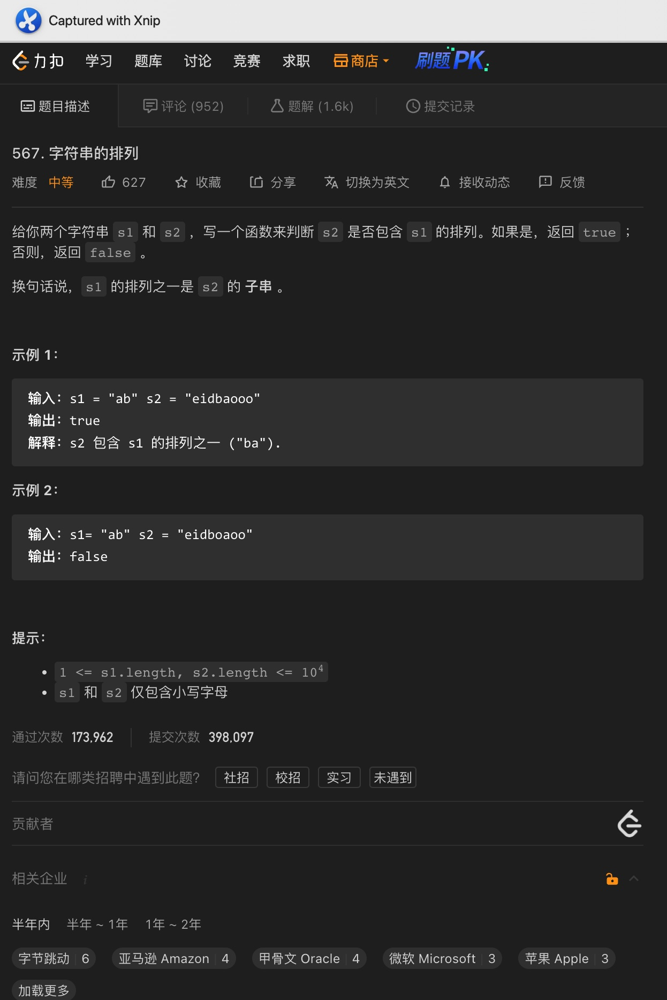
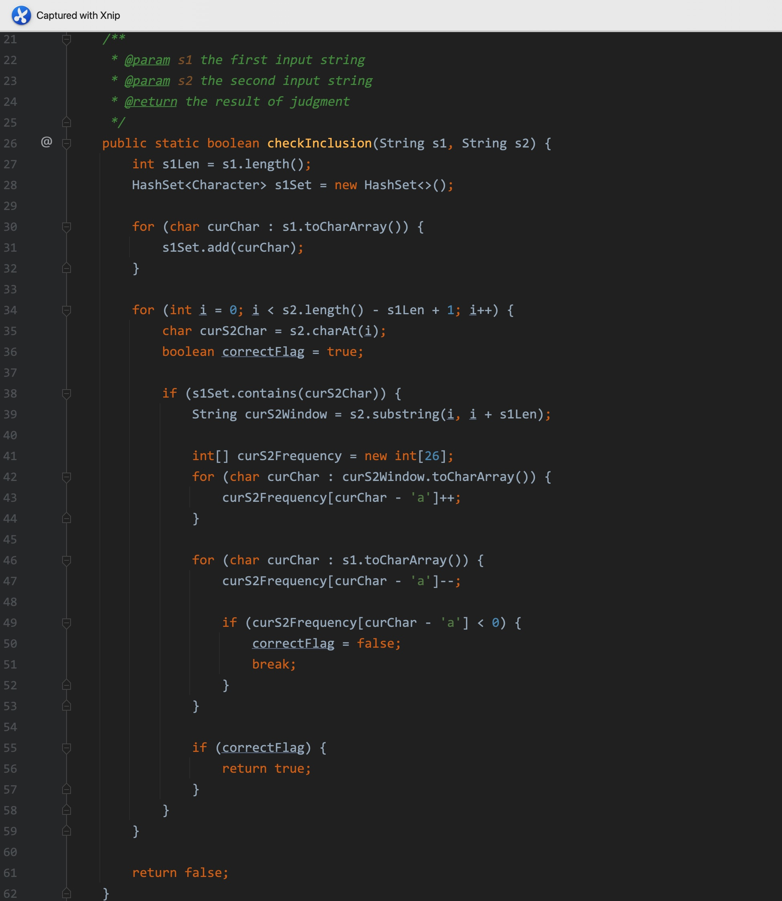
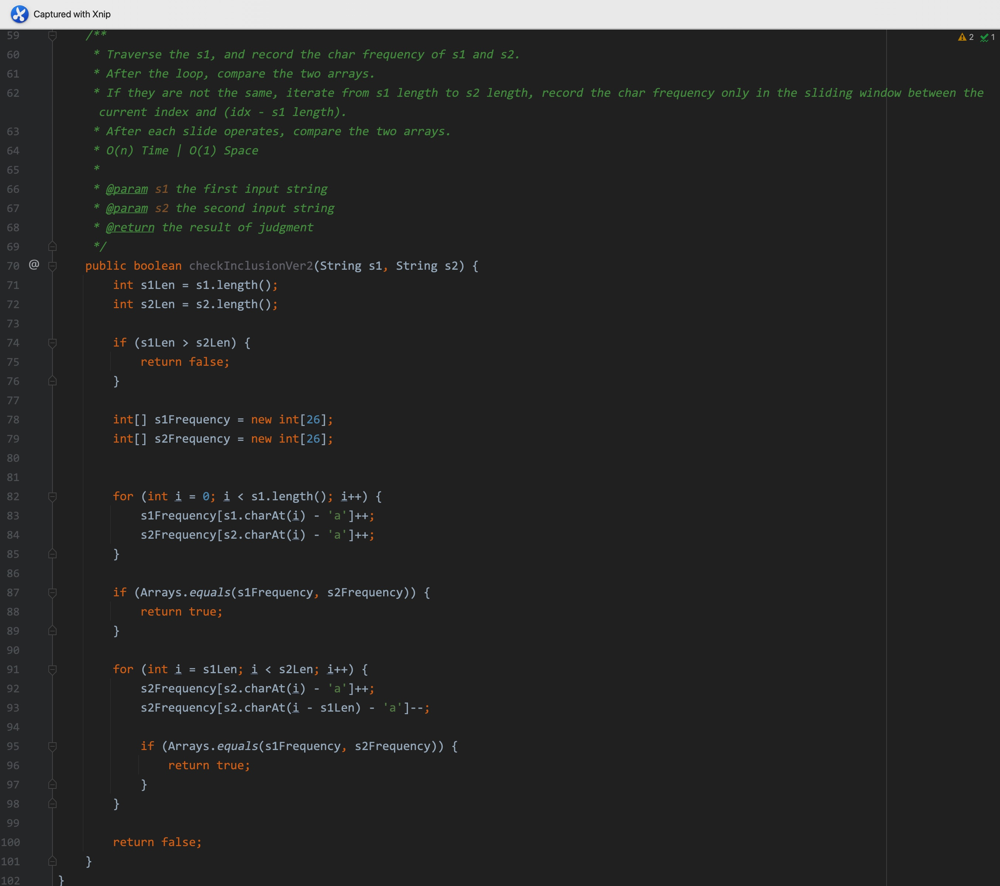
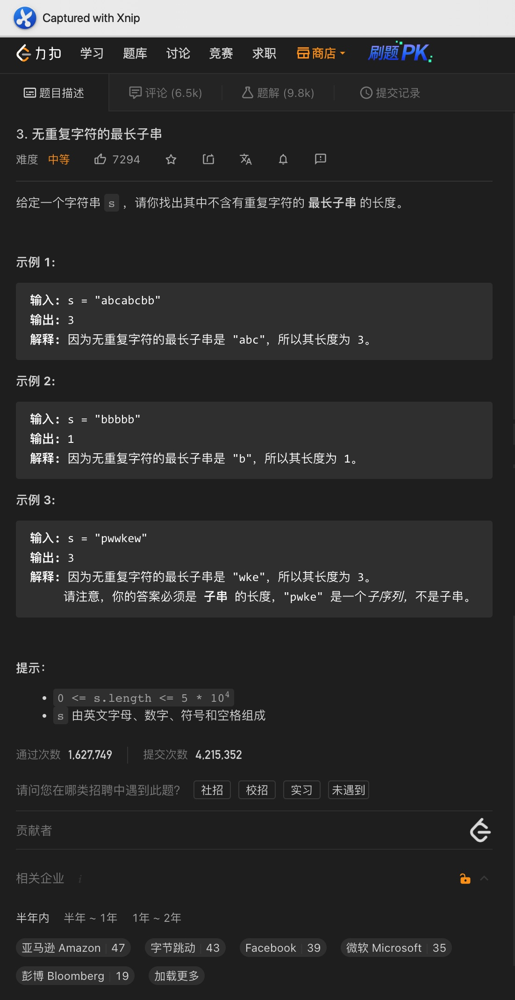
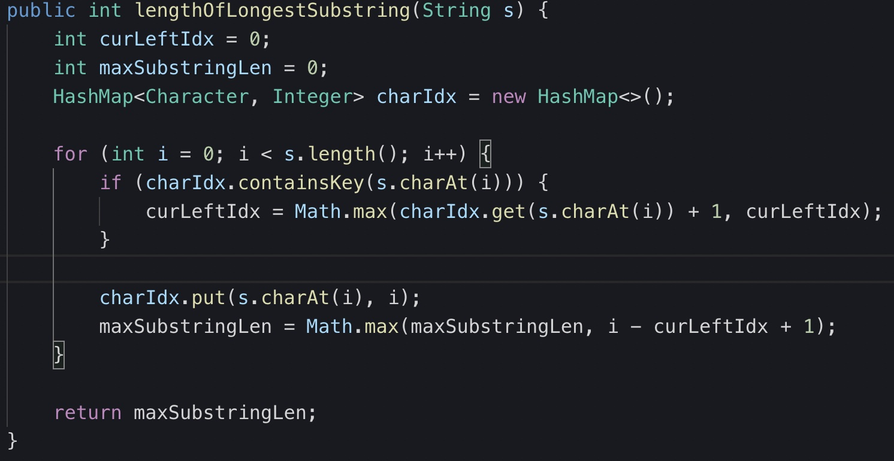
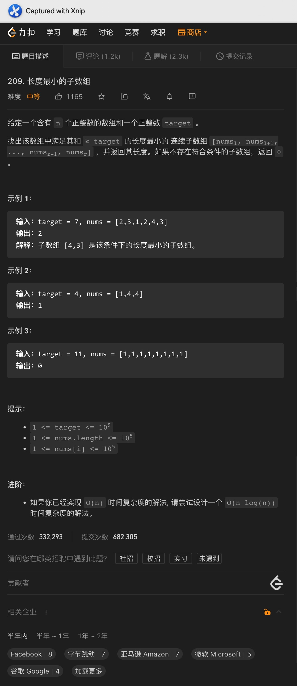
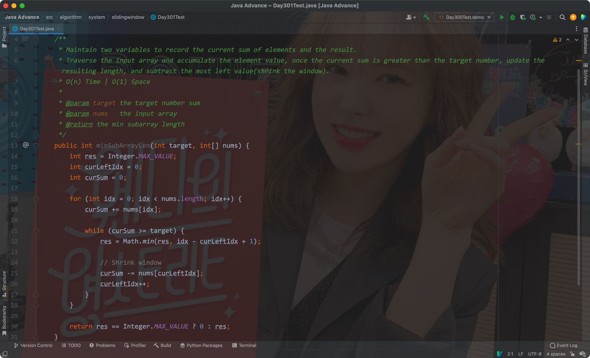

# 一、字符串排列

Bad Ver:

题意:

给你两个字符串，请你判断s2中是否包含s1的排列

思路:

- 基本的思路其实就是滑动窗口，只需要使用从s2中获取和s1字符串等长的字符串与s1进行词频比较即可
- 所以我们只需要先统计出s1的词频，再遍历s2字符串并限制一个长度为s1.length的窗口即可，每次比较该窗口内的词频和s1的词频便可

# 二、无重复字符最长子串

每次都记录重复字符最靠右的索引位置值

# 三、长度最小的子数组

题意:

给你一个数组，一个目标数，请你找出元素之和小于等于目标数的长度最小的连续子数组，如果不存在就返回0

思路:

- 因为题目需要的是连续的子数组，所以我们可以在遍历的过程中一边累加元素的值，一边判断当前和值与目标数的关系
- 如果当前和值较大，那么我们就需要缩减当前这个范围，即去除最左边的元素，即将窗口向右滑动一格，并更新结果长度
- 最后如果结果数和初始值一样的话，说明没有满足条件的子数组，所以返回0

复杂度:

- 我们遍历了一次输入数组，所以时间复杂度为O(n)
- 我们并未创建额外的空间，所以空间复杂度为O(1)

