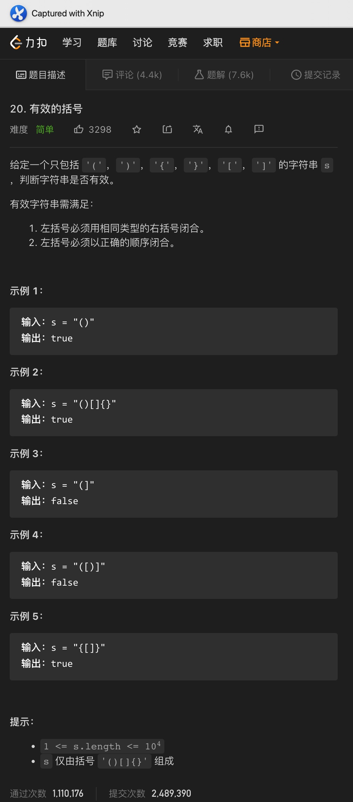
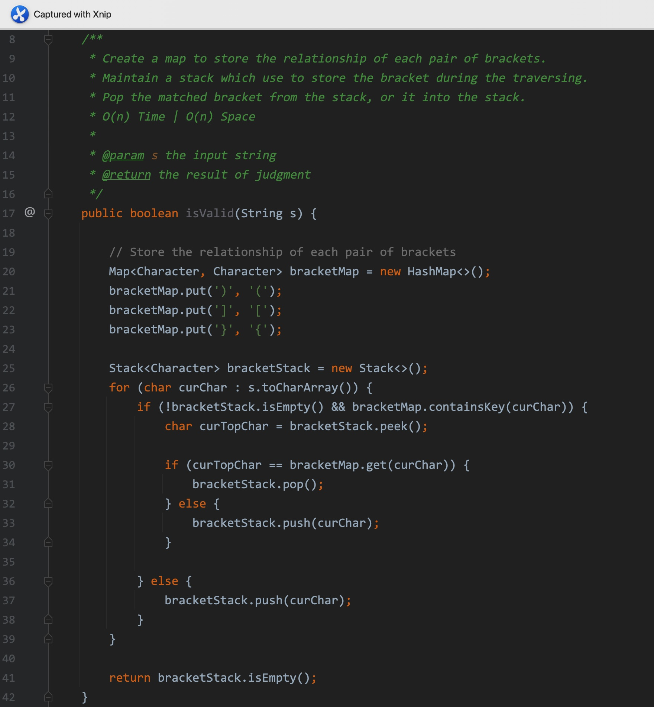
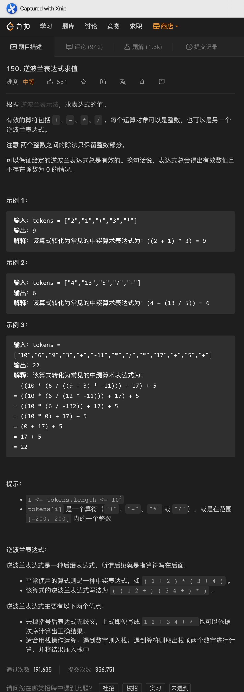
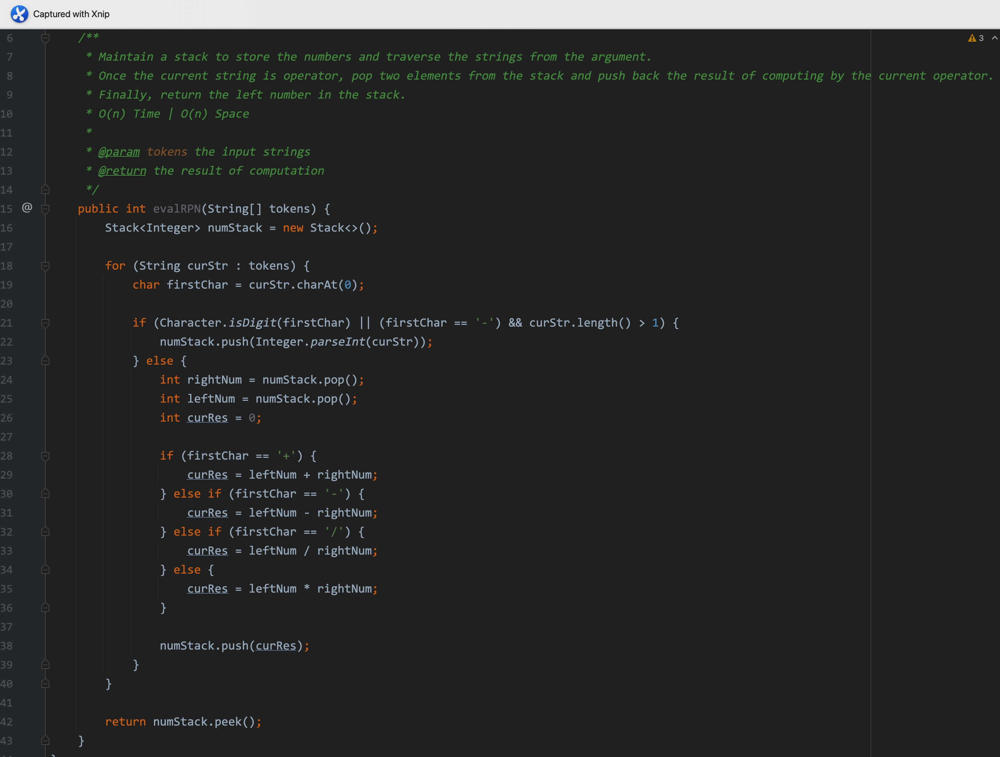
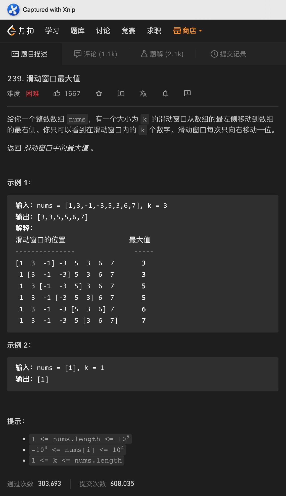
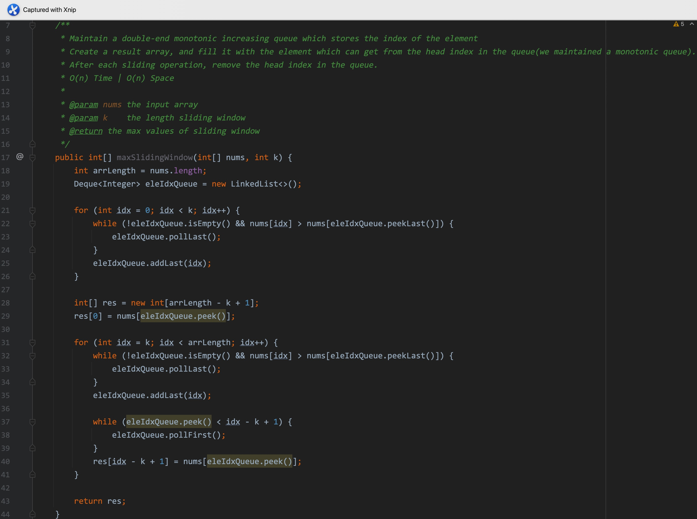
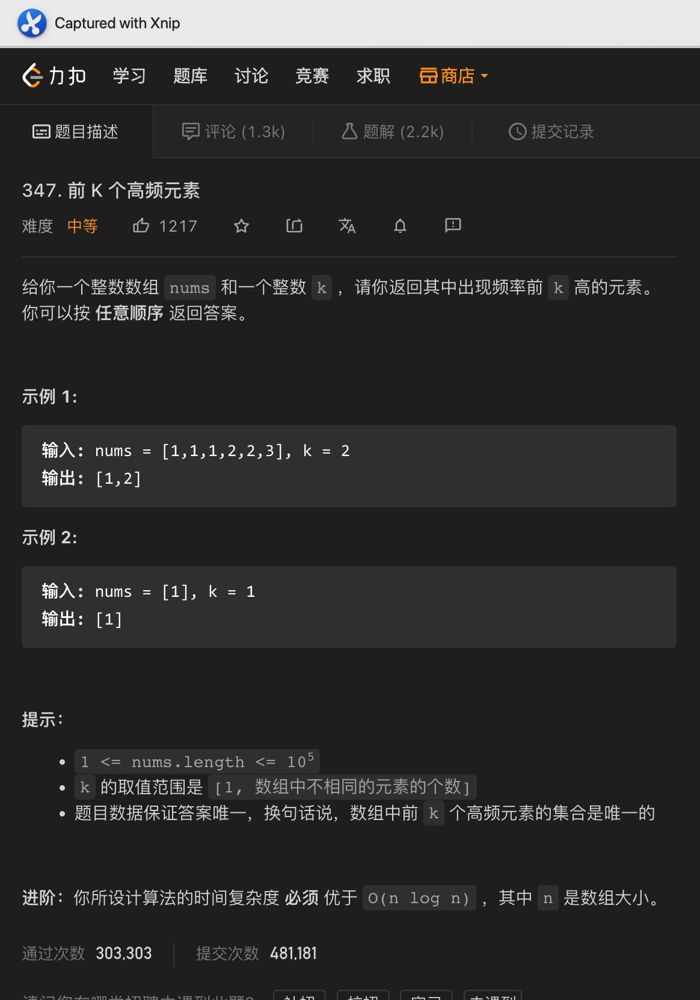
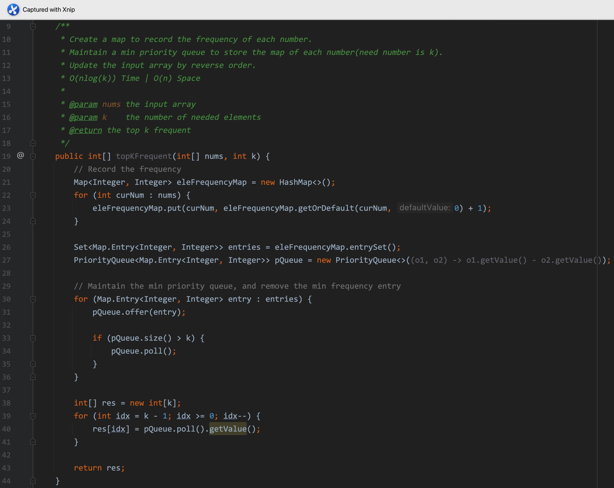

# 一、两个栈实现队列


Code:

```java
class MyQueue {
    private final Stack<Integer> inStack;
    private final Stack<Integer> outStack;

    public MyQueue() {
        this.inStack = new Stack<>();
        this.outStack = new Stack<>();
    }
    
    public void push(int x) {
        inStack.push(x);
    }
    
    public int pop() {
        if (outStack.isEmpty()) {
            moveToOutStack();
        }

        return outStack.pop();
    }
    
    public int peek() {
        if (outStack.isEmpty()) {
            moveToOutStack();
        }

        return outStack.peek();
    }
    
    public boolean empty() {
        return inStack.isEmpty() && outStack.isEmpty();
    }

    private void moveToOutStack() {
        while (!inStack.isEmpty()) {
            outStack.push(inStack.pop());
        }
    }
}
```

<hr>


# 二、两个队列实现栈


Code:

```java
class MyStack {
    Queue<Integer> mainQueue;
    Queue<Integer> auxiliaryQueue;

    public MyStack() {
        mainQueue = new LinkedList<>();
        auxiliaryQueue = new LinkedList<>();
    }

    public void push(int x) {
        auxiliaryQueue.add(x);

        while (!mainQueue.isEmpty()) {
            auxiliaryQueue.add(mainQueue.remove());
        }

        Queue<Integer> temp = auxiliaryQueue;
        auxiliaryQueue = mainQueue;
        mainQueue = temp;
    }

    public int pop() {
        return mainQueue.remove();
    }

    public int top() {
        return mainQueue.element();
    }

    public boolean empty() {
        return mainQueue.isEmpty();
    }
}
```

<hr>


# 三、有效的括号(经典题目)






题意:

给你一个字符串，其由多种括号组成，请你判断该字符串中的括号是否有效(一一匹配)


思路:

- 该题目是栈相关的经典题目，思路就是用栈来存放每个括号，一旦栈顶括号与当前括号匹配(栈顶是其匹配的左括号)，则弹出栈顶元素，不匹配则将其入栈
- 最后，如果栈中没有元素，说明所有的括号都成对匹配完成，此时括号有效


复杂度:

- 我们遍历了一次输入字符串，所以时间复杂度为O(n)
- 我们创建了一个栈来记录每个括号，所以空间复杂度为O(n)

<hr>


# 四、逆波兰表达式






题意:

给你一个字符串数组，其表示一个逆波兰表达式，请你计算其值


思路:

- 该题目也是栈的经典应用之一，基本思路就是遇到符号就从栈中弹出两个元素进行运算，并将结果压回到栈中
- 遍历完成后，留在栈中的唯一一个数字就是结果了


复杂度:

- 我们遍历了一次输入数组，所以时间复杂度为O(n)
- 我们创建了一个栈来存储中间过程的数字，所以空间复杂度为O(n)

<hr>


# 五、滑动窗口最大值






题意:

给你一个数组，和一个数字k，其中k代表滑动窗口的长度，该滑动窗口从左一直向右滑动，请你获取每个滑动范围内的最大值，并以数组的形式返回


思路:

- 最简单的方法自然是每次更新滑动窗口都更新其中的最值，但因为前一个窗口的最值可能在滑动的过程中被移除，所以我们不能使用动态规划，每个窗口的最值都要单独计算
- 为了不进行多次的嵌套循环，我们可以通过维护一个单调队列来记录最值，为了好排除掉窗口外的元素，该队列只存储对应元素的索引，且索引对应的元素单调递增
- 在通过索引排除掉被移除的元素后，队列头存储的索引对应的元素就是当前这个窗口的最大值了
- 注意结果数组的长度为array_length - k + 1


复杂度:

- 我们遍历了一次输入数组，所以时间复杂度为O(n)
- 我们维护了一个单调队列，所以空间复杂度为O(k)

<hr>


# 六、前k个高频元素






题意:

给你一个数组，一个数字k，请你返回其中k个最高频的元素


思路:

- 最容易想到的自然是使用Map来记录下每个元素的频率后，再通过排序获取对应k个范围的元素即可
- 但这样做的时间复杂度达不到题目的进阶要求，其实我们可以利用最小堆/最小优先队列，然后在遍历的同时丢弃掉其中的最小Map即可
- 因此我们只需要将Map中的记录存放在一个最小优先队列中，再遍历后保留k个entry即可
- 最后倒序遍历结果数组，并将每个元素进行顺序遍历即可


复杂度:

- 我们遍历了一次输入数组，同时还维护了一个长度为k的优先队列，所以时间复杂度为O(nlogk)
- 我们创建了一个map和一个优先队列，所以空间复杂度为O(n)


