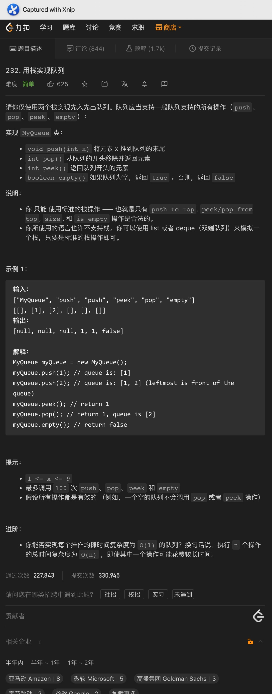
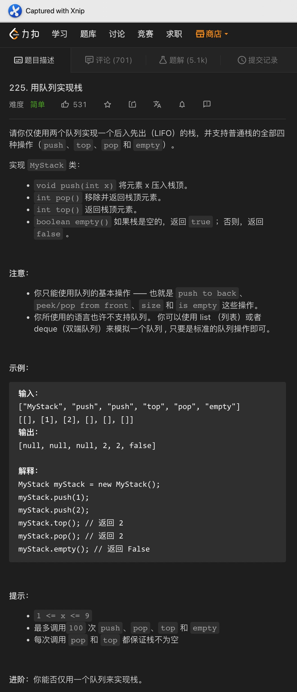

# 一、两个栈实现队列




Code:

```java
class MyQueue {
    private final Stack<Integer> inStack;
    private final Stack<Integer> outStack;

    public MyQueue() {
        this.inStack = new Stack<>();
        this.outStack = new Stack<>();
    }
    
    public void push(int x) {
        inStack.push(x);
    }
    
    public int pop() {
        if (outStack.isEmpty()) {
            moveToOutStack();
        }

        return outStack.pop();
    }
    
    public int peek() {
        if (outStack.isEmpty()) {
            moveToOutStack();
        }

        return outStack.peek();
    }
    
    public boolean empty() {
        return inStack.isEmpty() && outStack.isEmpty();
    }

    private void moveToOutStack() {
        while (!inStack.isEmpty()) {
            outStack.push(inStack.pop());
        }
    }
}
```

<hr>


# 二、两个队列实现栈




Code:

```java
class MyStack {
    Queue<Integer> mainQueue;
    Queue<Integer> auxiliaryQueue;

    public MyStack() {
        mainQueue = new LinkedList<>();
        auxiliaryQueue = new LinkedList<>();
    }

    public void push(int x) {
        auxiliaryQueue.add(x);

        while (!mainQueue.isEmpty()) {
            auxiliaryQueue.add(mainQueue.remove());
        }

        Queue<Integer> temp = auxiliaryQueue;
        auxiliaryQueue = mainQueue;
        mainQueue = temp;
    }

    public int pop() {
        return mainQueue.remove();
    }

    public int top() {
        return mainQueue.element();
    }

    public boolean empty() {
        return mainQueue.isEmpty();
    }
}
```


