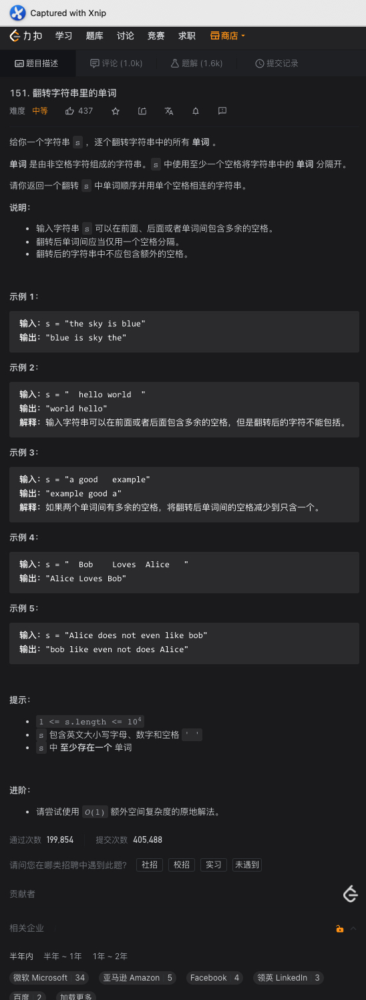

# 1、反转字符串2

题意:

给你一个字符串和一个数字k，请你将每2k个字符中的前k的字符进行反转

思路:

- 按照常规思路，我们要做的其实就是两步：按照2k个字符划分每个组，反转每个组中的前k个字符
- 反转很简单，双指针就能解决，但划分组的时候需要注意: 如果最后一部分的长度不足2k，那么需要重新处理一下最后一个组对应的右索引，如果最后一组的长度都小于k了，那么此时右索引应该为char.length - 1，而不再是i + k - 1了

复杂度:

- 我们遍历了所有字符，所以时间复杂度为O(n)
- 因为Java的缘故，处理后的字符串是一个新的常量，所以空间复杂度为O(n)

# 2、替换空格

题意:

给你一个字符串，请你将其中的空格替换为"%20"

思路:

- 我们其实可以重组字符串，遇到空格则添加"%20"，否则添加原字符即可，这里只需要遍历一次原字符串即可，当然，其实replace方法就能解决

复杂度:

- 我们遍历了一次该字符串，所以时间复杂度为O(n)
- 我们创建了一个新的字符串，所以空间复杂度为O(n)

# 3、反转单词

题意:

给你一个字符串，请你将其中每个单词的每个字符都进行反转，单词整体所在的位置不变(字符串前后的空格需要去除，单词之间重复的空格只保留一个)

思路:

- 因为只需要反转对应单词内的字符，所以我们只需要找到对应的单词，然后倒序添加其中的字符即可
- 但寻找单词前必须要去除先后多余的空格，因此，我们需要两个指针分别从左右往中间遍历，跳过前后的空格
- 之后，创建一个活动的指针，从右边开始，直到活动指针指向的字符为空格(活动指针到右边界即为我们的单词)，将该范围内的字符倒序添加到结果字符中
- 再次使用活动指针遍历，将其中的重复空格以一个空格代替，并将活动指针移动到下一个单词的开头，并重置右边界

复杂度:

- 我们遍历了整个字符串，所以时间复杂度为O(n)
- 我们创建了一个新的结果字符串，所以空间复杂度为O(n)

# 4、左旋转字符串

题意:

给你一个字符串，一个数字n，请你将前面的n的字符移动到后面

思路:

- 最简单的方式莫过于创建一个新的字符数组，将原字符串中的字符重组
- 但我们其实可以通过原地反转的方式:
- 先反转前n个字符，再反转后面的字符，最后反转所有的字符即可

复杂度:

- 我们遍历了所有的字符，所以时间复杂度为O(n)
- 我们创建了一个新的字符数组，所以空间复杂度为O(n)

# 5、凯撒密码加密

题意:

给你一个字符串，和一个数字key，请你将其中的所有字母都移动key个位置

思路:

- 因为每个char都通过ASCII(unicode)与数字对应，所以我们可以通过判断移动后的字符与'z'的大小关系，从而分情况更新当前字符

复杂度:

- 我们遍历了所有的字符，所以时间复杂度为O(n)
- 我们创建了一个新的字符串数组，所以空间复杂度为O(n)

# 6、字符编码

题意:

给你一个字符串，请你按照对应的规则进行编码

思路:

- 因为我们最后返回的是字符和对应长度的数字，所以我们需要统计每个字符对应的长度，但又因为不能产生歧义，所以每9个就要独立截断编码
- 那么我们只需要比较相邻的字符，如果相同则增加长度，不同或者长度为9则截断
- 需要注意的是，如果最后一部分也是连续的，最后一部分最后不会被添加到结果中，所有我们最后还要单独添加最后一个字符

复杂度:

- 我们遍历了所有的字符，所以时间复杂度为O(n)
- 我们创建了一个新的字符串，所以空间复杂度为O(n)

# 7、两个句子中不常见的单词

题意:

给你两个字符串，其中每个字符串都由一些以空格为间隔的单词组成，请你找出其中只在两个字符串中出现一次的单词

思路:

- 其实重点就一句话：只出现一次的单词
- 那么我们只需要统计每个单词出现的频率，再将频率为1的单词添加到结果集中再返回即可

复杂度:

- 我们遍历了两个句子中的所有单词，所以时间复杂度为O(n + m)
- 我们创建了一个HashMap来记录所有单词的频次，所以空间复杂度为O(n + m)

# 8、无重复最长子串长度

题意:

给你一个字符串，请你找出其中最长无重复字符子串的长度

思路:

- 因为子串的字符不能重复，所以需要我们对子串进行判断
- 最容易想到的就是遍历所有的子串，用HashSet来临时存储，这样当然，可以，但遍历所有子串的时间复杂度为O(n^2)，面试的时候估计一说思路就直接速通了QAQ
- 其实我们可以不去重，只需要使用滑动窗口就行:
- 如果如果有重复字符，则更新边界到不重复的范围，且不管有没有都更新下每个字符对应的索引位置，并更新最长子串的长度
- 这样我们只需要一个HashMap，再将输入字符串遍历一次即可

复杂度:

- 我们遍历了所有的字符，所以时间复杂度为O(n)
- 我们创建了一个HashMap，其存储的字符数量取决于输入的字符串，所以时间复杂度为(n)，其实是个常数，毕竟ASCII是有限的

# 9、回文子串

题意:

给你一个字符串，请你找出该字符串中回文子串的数量

思路:

- 最简单的肯定是遍历所有子串再判断其是否为回文字符串即可，但这样做的时间复杂度为O(n^3)
- 其实我们可以通过中心拓展法，从每个子串的中心出发(有奇有偶)，判断对应子串即可
- 其中中心序号和左右边界的对应关系参照官方题解的表表格即可

复杂度:

- 我们遍历了所有的中心点，每个中心点对应的字符串都是用双指针法进行判断，所以时间复杂度为O(n^2)
- 我们并未使用额外的空间，所有空间复杂度为O(1)

