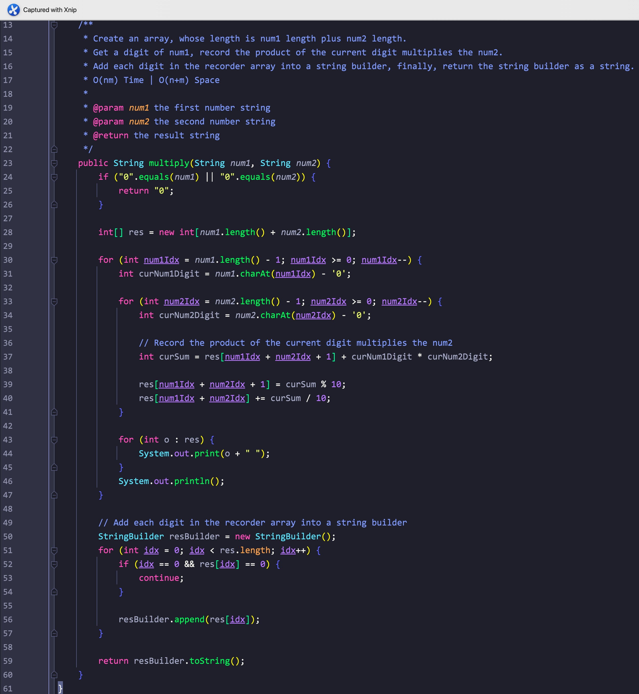
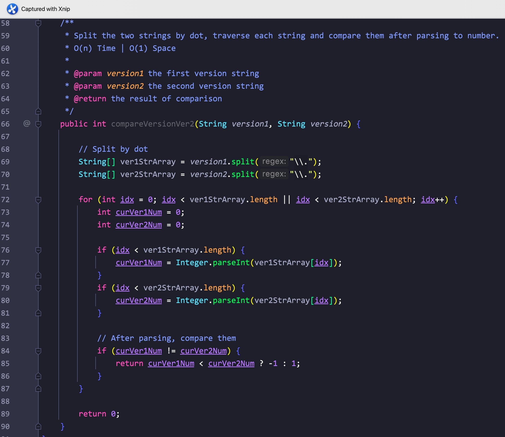

# 1、反转字符串2

题意:

给你一个字符串和一个数字k，请你将每2k个字符中的前k的字符进行反转

思路:

- 按照常规思路，我们要做的其实就是两步：按照2k个字符划分每个组，反转每个组中的前k个字符
- 反转很简单，双指针就能解决，但划分组的时候需要注意: 如果最后一部分的长度不足2k，那么需要重新处理一下最后一个组对应的右索引，如果最后一组的长度都小于k了，那么此时右索引应该为char.length - 1，而不再是i + k - 1了

复杂度:

- 我们遍历了所有字符，所以时间复杂度为O(n)
- 因为Java的缘故，处理后的字符串是一个新的常量，所以空间复杂度为O(n)

# 2、替换空格

题意:

给你一个字符串，请你将其中的空格替换为"%20"

思路:

- 我们其实可以重组字符串，遇到空格则添加"%20"，否则添加原字符即可，这里只需要遍历一次原字符串即可，当然，其实replace方法就能解决

复杂度:

- 我们遍历了一次该字符串，所以时间复杂度为O(n)
- 我们创建了一个新的字符串，所以空间复杂度为O(n)

# 3、反转单词

题意:

给你一个字符串，请你将其中每个单词的每个字符都进行反转，单词整体所在的位置不变(字符串前后的空格需要去除，单词之间重复的空格只保留一个)

思路:

- 因为只需要反转对应单词内的字符，所以我们只需要找到对应的单词，然后倒序添加其中的字符即可
- 但寻找单词前必须要去除先后多余的空格，因此，我们需要两个指针分别从左右往中间遍历，跳过前后的空格
- 之后，创建一个活动的指针，从右边开始，直到活动指针指向的字符为空格(活动指针到右边界即为我们的单词)，将该范围内的字符倒序添加到结果字符中
- 再次使用活动指针遍历，将其中的重复空格以一个空格代替，并将活动指针移动到下一个单词的开头，并重置右边界

复杂度:

- 我们遍历了整个字符串，所以时间复杂度为O(n)
- 我们创建了一个新的结果字符串，所以空间复杂度为O(n)

# 4、左旋转字符串

题意:

给你一个字符串，一个数字n，请你将前面的n的字符移动到后面

思路:

- 最简单的方式莫过于创建一个新的字符数组，将原字符串中的字符重组
- 但我们其实可以通过原地反转的方式:
- 先反转前n个字符，再反转后面的字符，最后反转所有的字符即可

复杂度:

- 我们遍历了所有的字符，所以时间复杂度为O(n)
- 我们创建了一个新的字符数组，所以空间复杂度为O(n)

# 5、凯撒密码加密

题意:

给你一个字符串，和一个数字key，请你将其中的所有字母都移动key个位置

思路:

- 因为每个char都通过ASCII(unicode)与数字对应，所以我们可以通过判断移动后的字符与'z'的大小关系，从而分情况更新当前字符

复杂度:

- 我们遍历了所有的字符，所以时间复杂度为O(n)
- 我们创建了一个新的字符串数组，所以空间复杂度为O(n)

# 6、字符编码

题意:

给你一个字符串，请你按照对应的规则进行编码

思路:

- 因为我们最后返回的是字符和对应长度的数字，所以我们需要统计每个字符对应的长度，但又因为不能产生歧义，所以每9个就要独立截断编码
- 那么我们只需要比较相邻的字符，如果相同则增加长度，不同或者长度为9则截断
- 需要注意的是，如果最后一部分也是连续的，最后一部分最后不会被添加到结果中，所有我们最后还要单独添加最后一个字符

复杂度:

- 我们遍历了所有的字符，所以时间复杂度为O(n)
- 我们创建了一个新的字符串，所以空间复杂度为O(n)

# 7、两个句子中不常见的单词

题意:

给你两个字符串，其中每个字符串都由一些以空格为间隔的单词组成，请你找出其中只在两个字符串中出现一次的单词

思路:

- 其实重点就一句话：只出现一次的单词
- 那么我们只需要统计每个单词出现的频率，再将频率为1的单词添加到结果集中再返回即可

复杂度:

- 我们遍历了两个句子中的所有单词，所以时间复杂度为O(n + m)
- 我们创建了一个HashMap来记录所有单词的频次，所以空间复杂度为O(n + m)

# 8、无重复最长子串长度

题意:

给你一个字符串，请你找出其中最长无重复字符子串的长度

思路:

- 因为子串的字符不能重复，所以需要我们对子串进行判断
- 最容易想到的就是遍历所有的子串，用HashSet来临时存储，这样当然，可以，但遍历所有子串的时间复杂度为O(n^2)，面试的时候估计一说思路就直接速通了QAQ
- 其实我们可以不去重，只需要使用滑动窗口就行:
- 如果如果有重复字符，则更新边界到不重复的范围，且不管有没有都更新下每个字符对应的索引位置，并更新最长子串的长度
- 这样我们只需要一个HashMap，再将输入字符串遍历一次即可

复杂度:

- 我们遍历了所有的字符，所以时间复杂度为O(n)
- 我们创建了一个HashMap，其存储的字符数量取决于输入的字符串，所以时间复杂度为(n)，其实是个常数，毕竟ASCII是有限的

# 9、回文子串

题意:

给你一个字符串，请你找出该字符串中回文子串的数量

思路:

- 最简单的肯定是遍历所有子串再判断其是否为回文字符串即可，但这样做的时间复杂度为O(n^3)
- 其实我们可以通过中心拓展法，从每个子串的中心出发(有奇有偶)，判断对应子串即可
- 其中中心序号和左右边界的对应关系参照官方题解的表表格即可

复杂度:

- 我们遍历了所有的中心点，每个中心点对应的字符串都是用双指针法进行判断，所以时间复杂度为O(n^2)
- 我们并未使用额外的空间，所有空间复杂度为O(1)

# 10、反转前缀

题意:

给你一个字符串，一个目标字符，请你尝试找出该目标字符在字符串中第一次出现的位置，并反转之前的所有字符后返回处理后的字符串

思路:

- 因为需要反转的字符范围取决于第一次出现目标字符的位置，所以我们应该先找到目标字符，这里只需要一次遍历即可，且找到后就停止循环
- 获取索引后只需要用双指针进行反转即可

复杂度:

- 我们遍历了字符串，又通过双指针对指定区域的字符进行了遍历，所以时间复杂度为O(n)
- 我们创建了一个新的字符串，所以空间复杂度为O(n)

# 11、最长公共前缀

题意:

给你一个字符串数组，请你找出其中最长的公共前缀字符串

思路:

- 

- 因为是公共前缀，那么就应该存在于每个字符串中，所以我们只需要将所有的字符串都拿来和第一个字符串进行比较即可，每次比较后都更新结果即可

复杂度:

- 我们遍历了所有的字符串和对应的前缀，所以时间复杂度为O(nm)，m为平均遍历的字符数
- 我们创建了多个临时的字符串，所以空间复杂度为O(n)

# 12、括号生成

题意:

给你一个数字n，请你生成所有可能的带有n对括号的字符串，且每对都必需有效(每对都是闭合的)

思路:

- 

- 因为需要的是有效的括号，所以就有一个规律: 在生成时，左括号的数量不能小于右括号
- 这样一来我们就能进行条件分支了，即如果左右括号的数量都为n，则添加到结果集
- 如果右括号数量大于左括号，则说明当前括号无效，直接中断即可
- 在上一个条件满足的前提下，如果左括号数量不足则优先添加左括号，反之则添加右括号

复杂度:

- 我们需要用dfs的方式遍历一颗满二叉树，其节点与n有关，这里粗略算做O(n)
- 我们需要递归调用的栈空间则取决于树的高度，大致为O(log(n))

# 13、正则匹配

题意:

给你一个目标字符串，一个正则字符串，请你实现正则中'*'和'.'的作用，返回匹配的结果

思路:

- 

- 创建一个二维(公式)数组，记录长度为 "行 "的目标字符串和长度为 "列 "的模式字符串之间的判断。

- 先遍历正则表达式字符串，一旦当前字符串等于'*'，则更新判断结果至之前的位置(formula[0][preIdx])

-  遍历目标字符串并通过正则表达式进行匹配，一旦当前的目标字符等于当前的模式字符，则按之前的位置更新当前的结果(formula[targetIdx - 1][patternIdx - 1])

- 如果当前模式字符是星号，则将当前目标字符与前一个模式字符进行比较

- 如果前一个模式字符等于目标字符，则通过前一个位置或前一个目标字符更新当前结果(formula[targetIdx][patternIdx - 2] || formula[targetIdx - 1][patternIdx])

- 如果没有，则通过前一个位置（formula[targetIdx][patternIdx - 2]）更新当前结果。

- 最后，通过二维数组中正确的长度获得结果

    

    

    

复杂度:

- 我们遍历了该二维数组，所以时间复杂度为O(n*m)
- 我们创建了一个二维数组，所以时间复杂度为O(n*m)

# 14、罗马数字转整数

题意:

给你一个代表罗马数字的字符串，请你将其转换为整数

思路:

- 如果只是简单的字符转数字其实很简单，但需要注意的是，如果前一个字符代表的数字小于后一个，则应该减去这个小的数字
- 所以我们需要对相邻的数字进行判断，所以需要用到两个数字，类似双指针
- 如果前一个数字小，则从结果中减去前一个数字，如果大则加上即可
- 遍历之后还需要加上忽略的最后一个数字

复杂度:

- 我们遍历了所有的字符，所以时间复杂度为O(n)
- 我们创建的变量为常数级，所以空间复杂度为O(1)

# 15、字符串乘积

题意:

给你两个代表数字的字符串，请你返回以字符串的形式返回它们相乘的结果

思路:

- 最容易想到的就是通过API将字符转换为数字，这样做理论上可以，但题目并不允许，不然就太简单了
- 那么我们自己写一个将字符串转换为数字的不就行了？只需要取每一位累加即可
- 很可惜也不行，因为题目给出的字符串长度最长为200，这样的两个数字的乘积超过了int和long的范围，只有API能处理
- 那咋办？其实我们可以将结果作为多个单独的数字进行存储，将对应的结果位数用数组表示就行了
- 因为直接相乘的结果会超出int的范围，这里我们可以用其中一个数的某一位与另一个数相乘，记录下每次相乘的结果再相加即可，只不过这里的"相加"结果是用一个数组来记录的
- 累加的结果可以看图中测试用例的输出
- 最后我们只需要将数组中的每个元素添加到StringBuilder中作为字符串返回即可

复杂度:

- 我们在遍历第一个字符串中的每个数字时，都将第二个字符串的每个数字遍历了一次，所以时间复杂度为O(nm)
- 我们创建的记录数组长度和两个输入字符串的长度相关，所以空间复杂度为O(n+m)

# 16、字符是否唯一

题意:

给你一个字符串，请你判断其中的每个字符是否唯一

思路:

- 

- 解体本身很简单，用Hash、Set、字符串API等等都可以，但这样做的空间复杂度都不为O(1)
- 这里我们可以利用二进制的每个bit进行记录，如果遍历字符时，该字符对应的bit位已经被标记了(对应位为1)，那么说明该字符不唯一，直接返回false
- 因为二进制并不直观，所以这里添加了两条输出语句并配合测试用例，详情看图

复杂度:

- 我们遍历了该字符串中的所有字符，所以时间复杂度为O(n)
- 我们创建的变量数与字符串长度无关，所以空间复杂度为O(1)

# 17、Z字形变换

题意:

给你一个字符串，和一个代表行数的数字，请你将该字符串按照给定的数组重新排列为对应行的Z形字符串，最后将重新排列的字符按照从左到右从上到下的顺序组合为一个新的字符串并返回

思路:

- 这里我们需要重排的Z字形对应的行数是一个变量，所以我们需要按照行数进行记录
- 即为每一行都创建一个对应的"记录器"，在Java里可以是StringBuilder，遍历原字符串中的字符时，将字符添加到对应行的"记录器"中即可
- 在添加到记录器的过程中，需要注意一旦到达边界则需要向反方向递增，这里我们用一个+1/-1或者一个boolean数都可以
- 最后将每一行的"记录器"都重新组合即可

复杂度:

- 我们遍历了原字符串中的每个字符，所以时间复杂度为O(n)
- 我们创建了多个记录器，记录器中字符的数量取决于原字符串，所以空间复杂度为O(n)

# 18、版本号比较

题意:

给你两个表示版本的字符串，请你判断version1是否比version2更新，是则返回1，不是则-1，版本相同则返回0，忽略先导零

思路1:

- 因为需要比较的是每个点分隔开的数字部分，所以我们要做的就是分隔，再比较数字
- 这里我们直接使用split进行分隔即可，再将分隔后的字符串通过Integer.parseInt转换为进行比较数字即可

复杂度1:

- 我们遍历了两个分隔后的字符串数组，所以时间复杂度为O(n)
- 我们用两个字符串数组记录了分隔后的字符串，所以空间复杂度为O(n)

思路2:

- 因为忽略了先导零，那么我们可以看作版本号的"数字"比较，我们只需要将版本号对应位置的非"."字符转换为数字，再累加到对应位置即可
- 这里我们可以让每个数字字符都减去'0'，这样结果就是其对应的数字了(不能单纯的累加该字符对应的ASCII码值，否则就没有忽略先导零)
- 最后再比较每个部分对应的累加值即可

复杂度2:

- 我们分别遍历了两个字符串，所以时间复杂度为O(n + m)
- 我们创建的变量个数为常量级，所以空间复杂度为O(1)

# 19、字符串之和

题意:

给你两个代表数字的字符串，请你返回它们相加的结果字符串

思路:

- 因为是相加，我们可以用链表相加的思路进行处理，即每次获取当前位置两个数字的和
- 对10取余后作为结果和当前位置的数，且每次都更新对应的进位
- 但这里我们需要将每个进位都添加到一个StringBuilder中方便作为字符串返回，所以最后需要反转其中的数字

复杂度:

- 我们遍历的次数取决于其中最长的字符串，所以时间复杂度为O(Max(m, n))
- 我们创建了一个StringBuilder来存放结果数字字符，所以空间复杂度为O(n)

