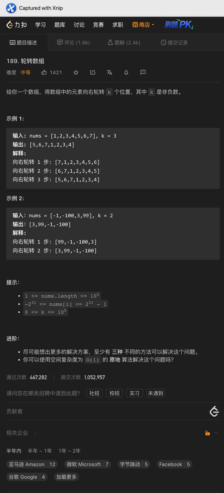
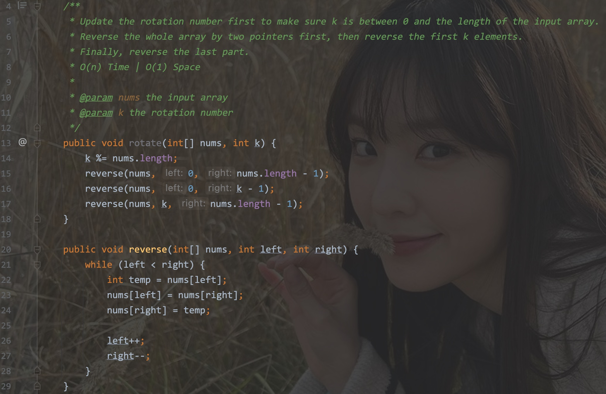

# 一、轮转数组

题意:

给你一个数组，一个数字k，请你将该数组向右轮转k次(即所有元素向右移动k次)

思路:

- 首先需要注意一点：k有可能大于输入数组的长度，此时k次旋转和旋转k对num.length取余得到的次数是相同的(例如: 数组长度为2，右移3次和右移1次是等效的)
- 最简单的方法就是创建一个新的数组，将对应范围内的元素重写写入到新数组即可
- 但这样做需要额外的空间
- 其实我们可以使用反转来解决：
- 首先反转整个数组，然后反转前k个元素，这样移动的k个元素就解决了，之后再反转剩下的元素即可

复杂度:

- 我们将该数组遍历了两次，所以时间复杂度为O(n)
- 我们在原数组上进行了修改，所以空间复杂度为O(1)

