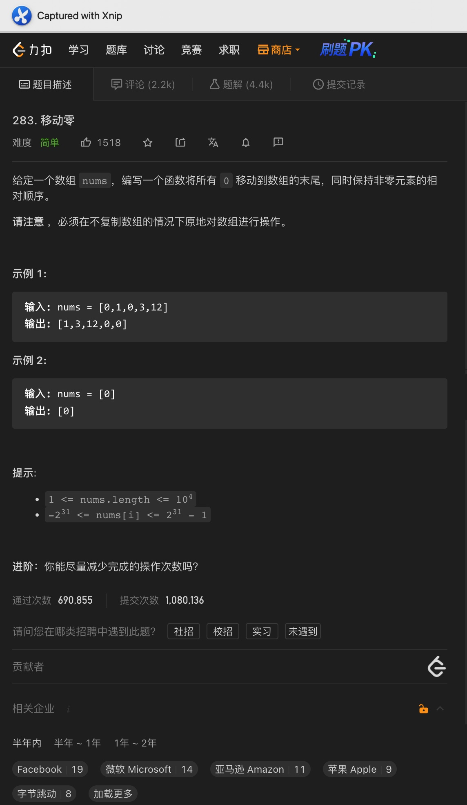
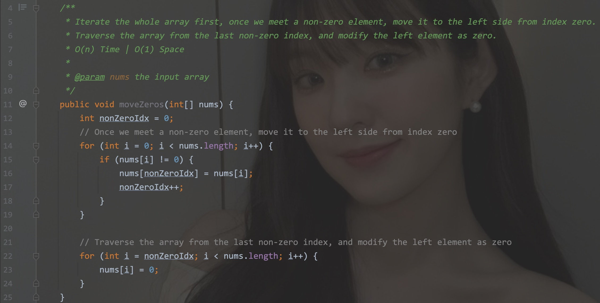
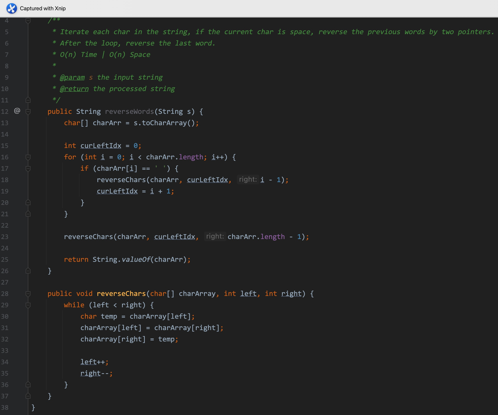

# 一、轮转数组

题意:

给你一个数组，一个数字k，请你将该数组向右轮转k次(即所有元素向右移动k次)

思路:

- 首先需要注意一点：k有可能大于输入数组的长度，此时k次旋转和旋转k对num.length取余得到的次数是相同的(例如: 数组长度为2，右移3次和右移1次是等效的)
- 最简单的方法就是创建一个新的数组，将对应范围内的元素重写写入到新数组即可
- 但这样做需要额外的空间
- 其实我们可以使用反转来解决：
- 首先反转整个数组，然后反转前k个元素，这样移动的k个元素就解决了，之后再反转剩下的元素即可

复杂度:

- 我们将该数组遍历了两次，所以时间复杂度为O(n)
- 我们在原数组上进行了修改，所以空间复杂度为O(1)

# 二、移动零

题意:

给你一个数组，请你将其中的零全部移动到后面

思路:

- 最简单的方法肯定是新建一个数组来做，但这样就没难度了
- 其实我们可以先记录下非零的数字，并将它们全部移动到前面，最后将剩余部分的元素都设置为0即可

复杂度:

- 我们遍历了两次数组，所以时间复杂度为O(n)
- 我们创建的变量个数为常量级，所以空间复杂度为O(1)

题意:

给你一个数组，一个目标数字，请你返回其中和为目标数的两个元素对应的索引值(从1开始)

思路:

- 乍一看和经典的两数之和差不多，但这里的数字其实是排好序的
- 既然如此，用二分法？可以，但时间复杂度为O(nlog(n))
- 其实这里用简单的双指针就行了

复杂度:

- 我们遍历了一次输入数组，所以时间复杂度为O(n)
- 我们创建的变量个数为常量级，所以空间复杂度为O(1)

# 三、反转字符串里的单词

题意:

给你一个字符串，请你反转其中每个单词里的字符

思路:

- 在Java里，最简单的方法就是将每个单词存入一个StringBuilder中直接调用reverse方法后再拼接即可
- 如果不用reverse方法呢？
- 其实我们只需要自己写一个reverse方法就行了，只不过在处理单词与单词之间的空格时需要注意一下即可

复杂度:

- 我们遍历了字符串中所有的字符，所以时间复杂度为O(n)
- 我们创建了一个新的字符串，所以空间复杂度为O(n)

