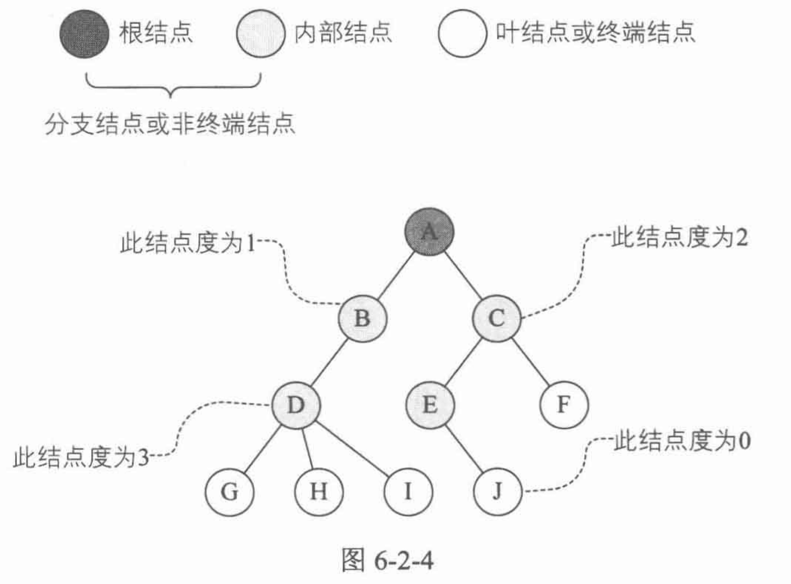
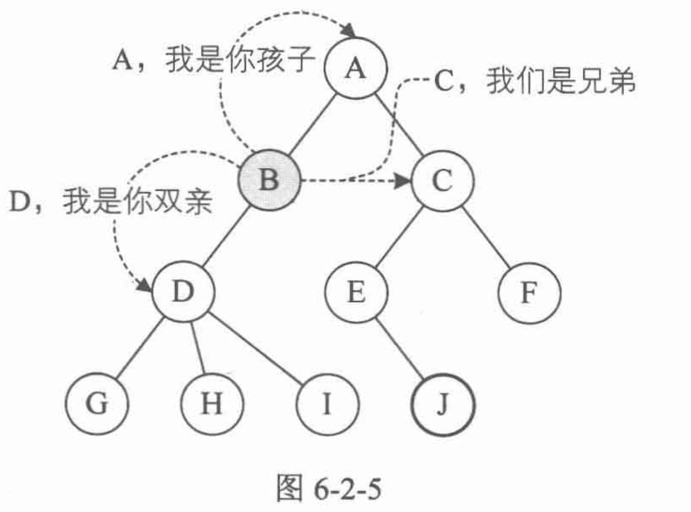
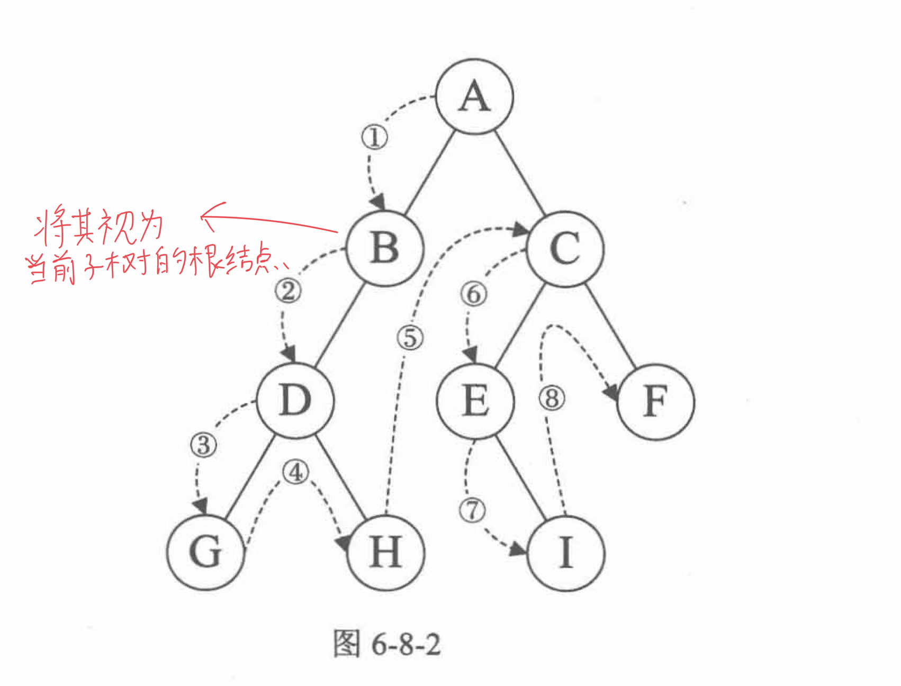
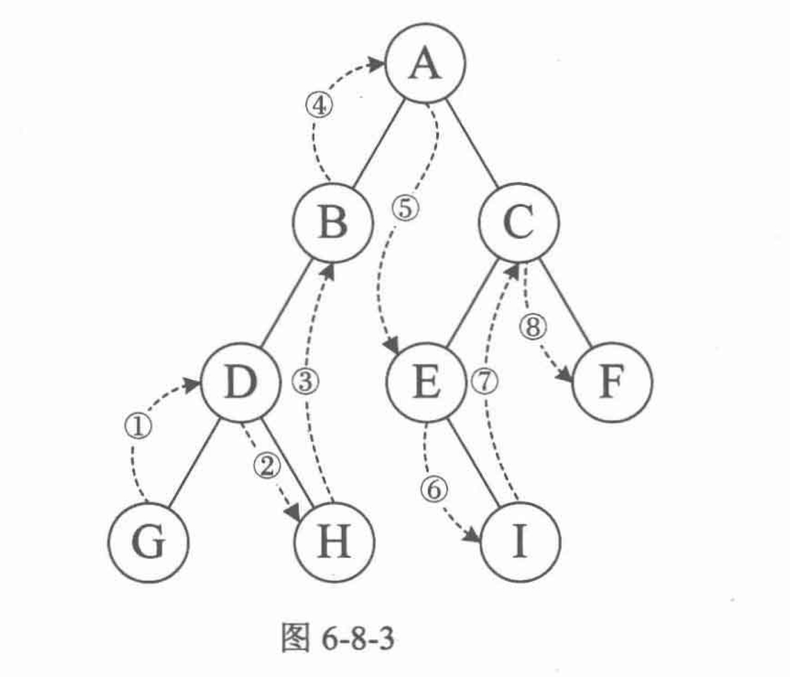
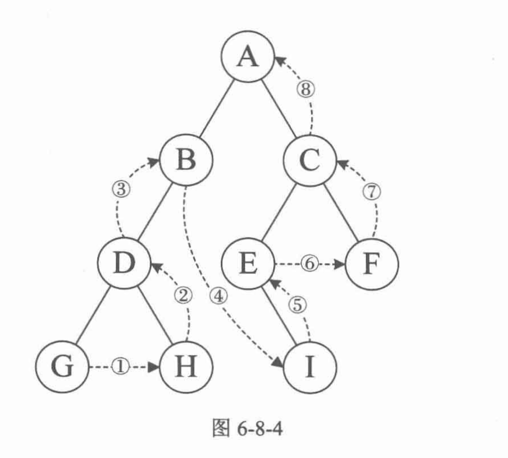
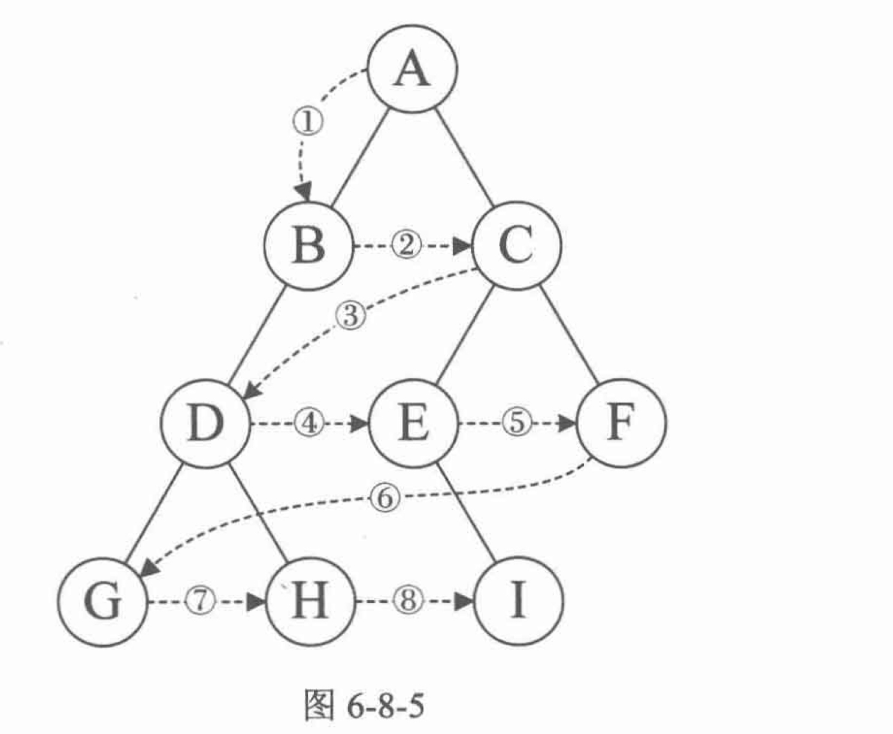

# 一、线性表


## 1. 定义

> 线性表: 0个或多个数据元素的优先序列


- 序列，说明元素之间有顺序，如果元素有多个，则第一个元素无前驱，最后一个无后继；其余元素都是有且只有一个前驱和后继
- 线性表是有限的
- 线性表中元素的个数n，就是线性表的长度，n=0时，线性表称为空表

<hr>


## 2. 线性表的抽象数据类型

线性表的操作:

- 重置为空
- 根据位序得到元素
- 在某位置加入元素、删除元素


其余复杂操作均可由上述这些基本操作组合而来

<hr>


## 3. 顺序存储结构


### 1) 定义

> 用一段地址连续/物理连续的存储单元依次存储线性表的元素

<hr>


### 2) 存储方式

- 通过一维数组即可实现顺序存储结构


描述顺序存储结构的三个属性:

- 起始存储位置: 数组data
- 线性表的最大存储容量: 数组长度MaxSize
- 当前长度: length

<hr>


### 3) 数据长度与线性表长度区别

- 线性表的长度: 表中元素的个数
- 数组长度: 存储空间的长度

线性表的长度应该小于等于数组的长度

<hr>


### 4) 地址计算方法

> 存储器中的每个存储单元都有自己的编号，该编号为地址


对于第i个数据元素ai的存储位置可以由a1推算出来:

```
location(ai) = location(a1) + (i - 1) * cellar
```


在任何位置存入/取出数据对计算机来说都是相等的时间，是一个常数

> 它的存取时间性能为O(1)
>
> 具有这个特点的存储结构称为随机存取结构

<hr>


## 4. 顺序存储结构的插入和删除


### 1) 获取元素操作

- 将线性表中第i个位置处的元素返回:
    - 只要对应的数值i合法(在范围内)，将数组下标为i - 1下标的值返回即可


Code:

```java
public int getElement(int order) {
  if (this.length == 0 || order < 1 || order > this.length) {
    return -1;
  }

  return this.linearArray[order - 1];
}
```

<hr>


### 2) 插入操作

- 插入位置不合理，则抛出异常
- 如果线性表长度大于等于数组长度，则抛出异常或动态增加容量
- 将插入位置之后的元素都向后移动一个位置
- 将元素插入位置i处
- 表长 + 1


Code:

```java
public void insertElement(int index, int value) throws ArrayIndexOutOfBoundsException {
  if (this.length >= ARRAY_LENGTH || index < 1) {
    throw new ArrayIndexOutOfBoundsException();
  }

  for (int idx = this.length - 1; idx >= index - 1; idx--) {
    this.linearArray[idx + 1] = this.linearArray[idx];
  }

  this.linearArray[index - 1] = value;
  this.length++;
}
```

<hr>


### 3) 删除

- 删除位置不合法，抛出异常
- 取出删除元素
- 将之后的元素都向前移一位
- 表长减一

Code:

```java
public void deleteElement(int index) throws ArrayIndexOutOfBoundsException {
  if (this.length == 0 || index < 1 || index > this.length) {
    throw new ArrayIndexOutOfBoundsException();
  }

  for (int idx = index; idx <= this.length; idx++) {
    this.linearArray[idx - 1] = this.linearArray[idx];
  }

  this.length--;
}
```

<hr>


### 4) 顺序存储结构的优缺点

优点: 

- 物理存储空间直接表示逻辑关系
- 可以快速存取表中任意一个位置的元素


缺点:

- 插入和删除操作需要移动大量元素
- 长度变化较大，难以确定具体分配的存储空间
- 容易造成存储"碎片"

<hr>


## 5. 链式存储结构


### 1) 定义

- 一组存储单元可以存在内存中未被占用的任何位置
- 每个数据元素处理存储数据元素信息外，还要存储它的后继元素的**存储地址**


> 存储数据元素信息的域称为数据域，把存储后继位置的域称为指针域
>
> 指针域中存储的信息称为指针或链

- 这两部分信息组成每个数据元素，结合起来称为结点(node)
- n个结点链结成一个链表，即为线性表的链式存储结构


> 因为每个链表的每个结点中包含一个指针域，所以称为单链表


- 链表中的**第一个结点的存储位置叫做头指针**，线性链表中的最后一个结点指针为"空"
- 单链表的**第一个结点前附设的结点称为头结点**

<hr>


### 2) 头指针/头结点的异同

头指针: 

- **链表指向第一个结点的指针**，如果链表有头结点，则是指向头结点的指针
- 无论链表是否为空，头指针是链表的必要元素


头结点:

- 头结点放在第一个元素的结点之前，数据域无意义
- 头结点不一定是链表必须的要素

<hr>


### 3) 线性表链式存储Code

- 结点(Node)由存放数据元素的数据域和存放后继结点地址的指针域组成


Code:

```java
public class Node {
    int val;
    Node next;

    public Node(int val) {
        this.val = val;
    }

    public Node(int val, Node next) {
        this.val = val;
        this.next = next;
    }   
}
```

<hr>


## 6. 单链表的读取

获取链表第i个数据的思路:

1. 声明一个结点p指向第一个结点，初始化j从1开始
2. 当j < i，遍历链表，让p的指针向后移动，不断指向下一个结点，j累加1
3. 如果链表末尾p为空，说明i个元素不存在
4. 查找成功会直接返回p的数据


Code:

```java
public static int getElement(int index, Node head) throws ArrayIndexOutOfBoundsException {
  Node curNode = head;

  int curOrder = 1;
  while (curNode != null && curOrder < index) {
    curNode = curNode.next;
    curOrder++;
  }

  if (curNode == null || curOrder > index) {
    throw new ArrayIndexOutOfBoundsException();
  }

  return curNode.val;
}
```

<hr>


## 7. 单链表的插入与删除


### 1) 单链表的插入


思路:

1. 声明一个指向链表一个结点的结点p，初始化计数器从1开始
2. 当计数器 < 目标次序，就让结点p的指针向后移动一位，计数器累加1
3. 如果链表末尾p为空，则说明第index个元素不存在
4. 如果查找成功则生成一个空结点newNode
5. 给newNode赋值
6. 将结点插入newNode.next = p.next, p.next = newNode


Code:

```java
public static void insertElement(int index, int value, Node head) throws ArrayIndexOutOfBoundsException {
  Node curNode = head;
  int orderCount = 1;

  while (curNode != null && orderCount < index - 1) {
    curNode = curNode.next;
    orderCount++;
  }

  if (curNode == null || orderCount > index) {
    throw new ArrayIndexOutOfBoundsException();
  }

  Node insertNode = new Node(value);
  insertNode.next = curNode.next;
  curNode.next = insertNode;
}
```

<hr>


### 2) 单链表的删除


思路:

1. 声明一个指向链表一个结点的结点p，初始化计数器从1开始
2. 当计数器小于目标索引时，更新结点p，让其向后移动，计数器累加1
3. 如果p指向空，说明索引错误
4. 如果查找成功，将p指向结点的next赋给q
5. 让p结点的next指向q结点的next
6. 将q中的结点数据记录下来，并释放该结点即可


Code:

```java
public static void deleteElement(int index, Node head) throws ArrayIndexOutOfBoundsException{
  Node curNode = head;
  int orderCount = 1;

  while (curNode != null && orderCount < index) {
    curNode = curNode.next;
    orderCount++;
  }

  if (curNode.next == null || orderCount > index) {
    throw new ArrayIndexOutOfBoundsException();
  }

  curNode.next = curNode.next.next;
}
```


> 单链表适用于频繁插入和删除数据的情况

<hr>


## 8. 链式结构和顺序存储结构的优缺点

- 顺序存储结构:
    - 需要频繁查找
- 链式存储结构:
    - 需要频繁插入和删除

<hr>


## 9. 静态链表

> 使用数组描述的链表就是静态链表(游标实现法)

<hr>


# 二、栈/队列


## 1. 栈的定义


### 1) 栈的定义

> 栈是限定仅在表尾进行插入和删除操作的线性表


- 允许插入/删除的一端为栈顶(top)，另一端称为栈底(bottom)
- 栈称为后进先出的线性表，简称LIFO结构


栈的插入操作: 进栈、压栈、入栈

栈的删除操作: 出栈、弹栈

<hr>


## 2. 顺序存储结构/实现


定义和入栈/出栈:

```java
import java.util.Scanner;
import java.util.Arrays;

public class MyStack {
    public static void main(String[] args) {
        Scanner scanner = new Scanner(System.in);
        int inputTime = Integer.parseInt(scanner.nextLine());
        TheStack stack = new TheStack(inputTime);
        
        for (int i = 0; i < inputTime; i++) {
            String[] inputStr = scanner.nextLine().split(" ");
            
            if (inputStr[0].equals("push")) {
                stack.push(Integer.parseInt(inputStr[1]));
            } else if (inputStr[0].equals("pop")) {
                stack.pop();
            } else {
                stack.top();
            }
            
//             System.out.println(Arrays.toString(stack.myStack));
        }
    }
}

class TheStack {
    int[] myStack;
    int curIdx;
    
    public TheStack(int capacity) {
        this.myStack = new int[capacity];
        curIdx = 0;
    }
    
    public void push(int ele) {
        this.myStack[curIdx++] = ele;
    }
    
    public void top() {
        if (curIdx == 0) {
            System.out.println("error");
        } else {
            System.out.println(this.myStack[curIdx - 1]);
        }
    }
    
    public void pop() {
        if (curIdx == 0) {
            System.out.println("error");
        } else {
            System.out.println(this.myStack[--curIdx]);
        }
    }
}
```

<hr>


## 3. 链式存储结构/实现


Code:

```java
class LinkedStack {
    class ListNode {
        int val;
        ListNode next;
        
        public ListNode() {
            
        }
        
        public ListNode(int val) {
            this.val = val;
        }
    }
    
    ListNode preHead;
    public LinkedStack() {
        this.preHead = new ListNode();
    }
    
    public void push(int ele) {
        ListNode newNode = new ListNode(ele);
        
        newNode.next = this.preHead.next;
        this.preHead.next = newNode;
    }
    
    public void top() {
        if (this.preHead.next == null) {
            System.out.println("error");
        } else {
            System.out.println(this.preHead.next.val);
        }
    }
    
    public void pop() {
        if (this.preHead.next == null) {
            System.out.println("error");
        } else {
            int res = preHead.next.val;
            this.preHead.next = this.preHead.next.next;

            System.out.println(res);
        }
    }
}
```

<hr>


## 4. 队列的定义

> 队列只允许在一端进行插入，在另一端进行删除

- 队列是一种FIFO的线性表，简称FIFO，允许插入的一端称为队尾，允许删除的一端称为队头


### 1) 队列顺序存储的不足

- 会出现假溢出现象

<hr>


### 2) 循环队列定义

- 循环队列可以解决假溢出问题

> 队列头尾相连的顺序存储结构称为循环队列


Code:

```java
public class MyArrayQueue {
    public static void main(String[] args) {
        ArrayQueue queue = new ArrayQueue(4);

        queue.push(29);
        queue.pop();
    } 
}

class ArrayQueue {
    int[] queueArray;
    int rear;
    int front;
    int capacity;

    public ArrayQueue(int capacity) {
        this.queueArray = new int[capacity];
        this.capacity = capacity;
        this.front = 0;
        this.rear = 0;
    }

    public void push(int ele) {
        if ((this.rear + 1) % this.capacity == this.front) {
            return;
        }

        this.queueArray[rear] = ele;
        this.rear = (this.rear + 1) % this.capacity;
    }

    public void pop() {
        if (this.front == this.rear) {
            System.out.println("error");
            return;
        }

        int removeEle = this.queueArray[front];
        this.front = (this.front + 1) % this.capacity;

        System.out.println(removeEle);
    }
    
    public void front() {
        if (this.front == this.rear) {
            System.out.println("error");
            return;
        }
        
        System.out.println(this.queueArray[front]);
    }
}
```

<hr>


### 3) 队列链式的存储结构


Code:

```java
public class MyLinkedQueue {
    public static void main(String[] args) {
        LinkedQueue queue = new LinkedQueue();
        queue.enqueue(20);
        queue.enqueue(30);
        queue.dequeue();
        queue.dequeue();
    }
}

class LinkedQueue {
    
    class ListNode {
        int val;
        ListNode next;

        public ListNode(int val) {
            this.val = val;
        }

        public ListNode() {
        }
    }

    ListNode front;
    ListNode rear;

    public LinkedQueue() {
        this.front = new ListNode();
        this.rear = this.front;
    }

    public void enqueue(int ele) {
        ListNode newNode = new ListNode(ele); 
    
        this.rear.next = newNode;
        this.rear = newNode;
    }

    public void dequeue() {
        if (this.front == this.rear) {
            return;
        }

        ListNode removeNode = this.front.next;
        this.front.next = this.front.next.next;

        System.out.println(removeNode.val);
    }
}
```

<hr>


# 三、串


## 1. 定义

> 串(String)是由零个或者多个字符组成的有限序列，又叫字符串

<hr>


## 2. 串的比较

- 字符串的大小取决于每个字符的先后顺序
- 字符串的比较是通过组成字符串的字符之间的编码来进行的(ASCII, Unicode)

<hr>


## 3. 朴素的模式匹配算法

> 子串的定位操作称为串的模式匹配


Code:

```java
public class IndexMatch {
    public static void main(String[] args) {
        int res = index("goodgoogle", "google");
        System.out.println(res);
    }

    public static int index(String targetStr, String patternStr) {
        char[] targetChars = targetStr.toCharArray();
        char[] patternChars = patternStr.toCharArray();
        int patternIdx = 0;

        for (int targetIdx = 0; targetIdx < targetChars.length; targetIdx++) {
            for (; patternIdx < patternChars.length; patternIdx++) {
                if (targetChars[targetIdx] != patternChars[patternIdx]) {
                    break;
                }

            }

            if (patternIdx == patternChars.length) {
                return targetIdx;
            }
        }

        return -1;
    }
}
```

<hr>


# 四、树


## 1. 树的定义

> n个结点的有限集。n=0时称为空树
>
> 在非空树中:
>
> 1. 有且仅有一个特定的结点被称为根结点(root)
> 2. 当n > 1时，其余结点可以分为多个`互不相交`的有限集，每个集合本身又是一颗树，且被称为根结点的子树


重点:

1. 数据结构中的树只能有一个根结点
2. 子树的个数没有限制，但它们一定是`互不相交`的

<hr>


### 1) 结点分类

- 结点的度:

一个结点拥有的子树的数量称为结点的度(Degree)，度为0的结点称为叶结点(leaf ndoe)；

度不为0的结点称为分支结点/非终端结点，除了根结点之外，分支结点也称为内结点

> 树的度是树内各结点度的最大值(最大的子结点数)

Eg:



<hr>


### 2) 结点间关系

> 一个结点的子树的根结点称为该结点的孩子，其为孩子的`双亲`
>
> 双亲相同的孩子互称`兄弟`
>
> 结点的祖先: 从根到结点`所经过分支上的所有结点`
>
> 子孙: 以某结点为根的子树中任一结点，都为该结点的子孙


Eg:



<hr>


### 3) 树的其他概念

> 结点的层次(Level): 从根开始定义，根为第一层
>
> 树的深度: 树中结点的最大层次


森林: 多棵互不相交的树的集合

<hr>


## 2. 二叉树的定义

> 二叉树: n个结点的有限集合，该集合为空集(空二叉树)，或者由一个根结点和两棵互不相交的、分别称为根结点的左子树和右子树的二叉树组成


### 1) 二叉树的特点

- 每个结点`最多`两颗子树，二叉树中不存在度大于2的结点
- 左右子树有顺序
- 即使只有一个子树，也要区分它是左还是右

<hr>


### 2) 特殊二叉树


1. 斜树

> 所有的结点都只有左子树的二叉树称为左斜树
>
> 所有的结点都只有右子树的二叉树称为右斜树


2. 满二叉树

> 所有的结点都有左右子树，且所有叶子结点都在同一层，这样的二叉树称为满二叉树


3. 完全二叉树

> 按层序给所有的结点编号，如果所有的结点对应的编号和对应的满二叉树中的结点位置相同，那么这颗树就是完全二叉树


完全二叉树的特点:

- 叶子结点只出现在最底下两层
- 最下层的叶子结点一定集中在左下部分
- 倒数第二层的结点一定都在右下部分连续位置
- 如果结点的度为1，那么其只有左子树
- 节点数相同的二叉树中，完全二叉树的深度最小

<hr>


## 3. 二叉树的性质


### 1) 性质1

> 二叉树第i层上最多有2^i-1^个结点(i ≥ 1)


### 2) 性质2

> 深度为k的二叉树最多有2^k^ - 1个结点


### 3) 性质3

> 对于任意二叉树:
>
> 如果终端结点数(叶子结点)为n0，度为2的结点数为n2，那么n0 = n2 + 1


### 4) 性质4

> 具有n个结点的完全二叉树的深度为: floor($$\log_2n$$) + 1(取$$\log_2n$$的向下取整数)


### 5) 性质5

对于一个有n个结点的完全二叉树，将所有的结点i进行层序编号:

1. 如果i = 1，则结点i是二叉树的根
2. 如果i > 1，则结点i的双亲是i / 2
3. 如果2i > n，则结点i没有左孩子，否则其左孩子为2i
4. 如果2i + 1 > n，则结点i没有右孩子，否则右孩子为2i + 1

<hr>


## 4. 遍历二叉树


### 1) 遍历方法


1. 前序遍历

> 先访问根结点，然后前序遍历左子树，再前序遍历右子树

Eg:




2. 中序遍历

> 从根结点开始，中序遍历根结点的左子树，然后访问根结点，最后中序遍历右子树

Eg:




3. 后序遍历

> 从左到右先叶子后结点的方式遍历访问左右子树，最后访问根结点

Eg:




4. 层序遍历

> 从根结点开始访问，从上而下逐层遍历，同一层中从左到右对结点逐个访问

Eg:



<hr>


### 2) 前序遍历算法


