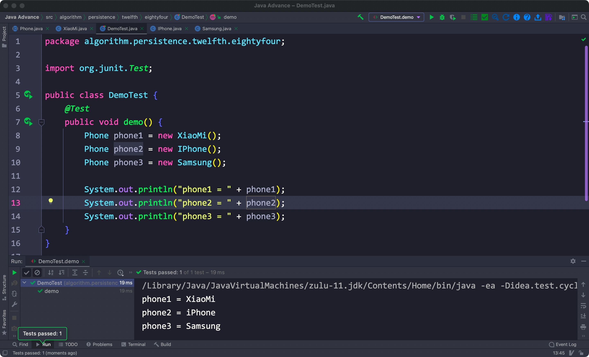
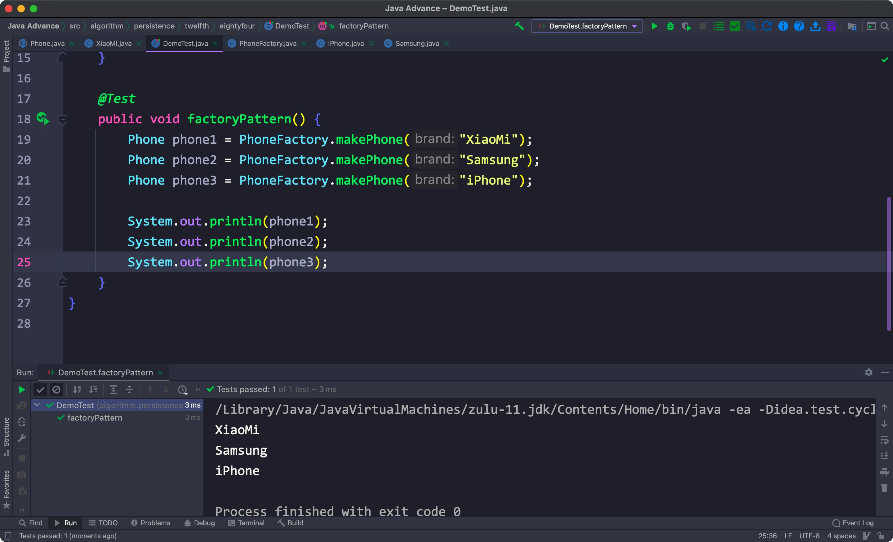
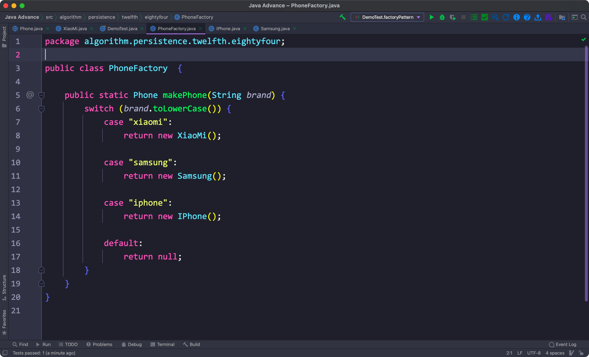
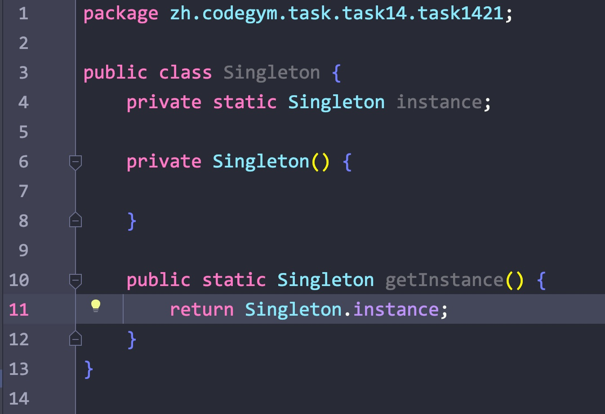

# 一、工厂设计模式

## 1. 简单工厂模式

- 封装多个继承同一个类的子类，替代传统的创建对象的方法

实例:

有三个手机类: Samsung, XiaoMi, IPhone, 它们都继承自一个"Phone"抽象类。

没有使用工厂模式前，想要创建这三个类的实例对象就得分别调用它们对应的构造方法:

这里重写了toString()方法

有了工厂模式后:

简单工厂模式设计:

****

# 二、单例设计模式

- 将一个类的构造方法设置为private，不让外部通过其创建对象
- 设置一个static修饰的该类对象
- 创建一个获取单例的public方法，其始终返回该static实例对象

