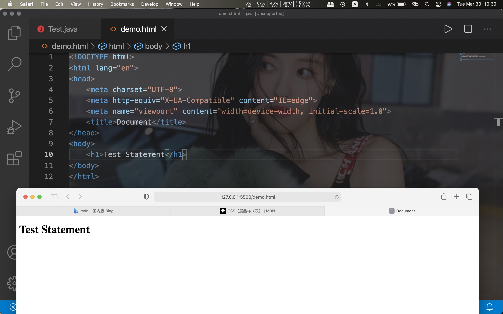
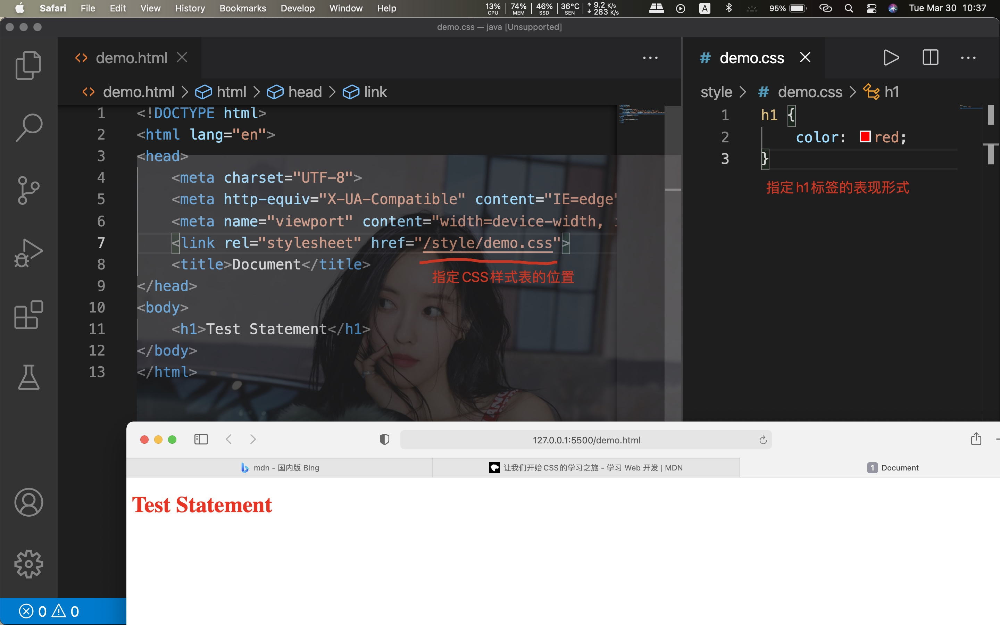
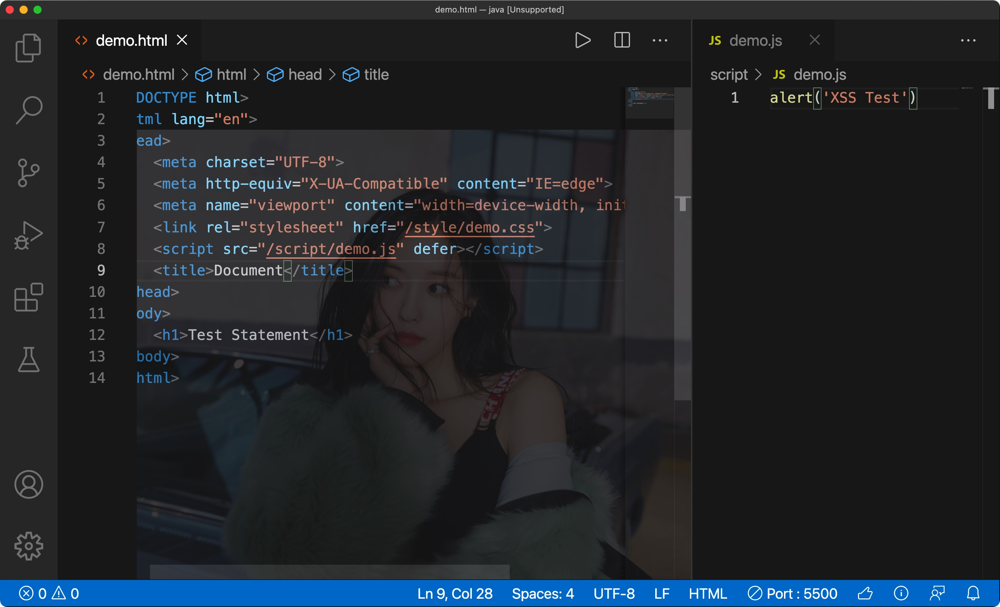
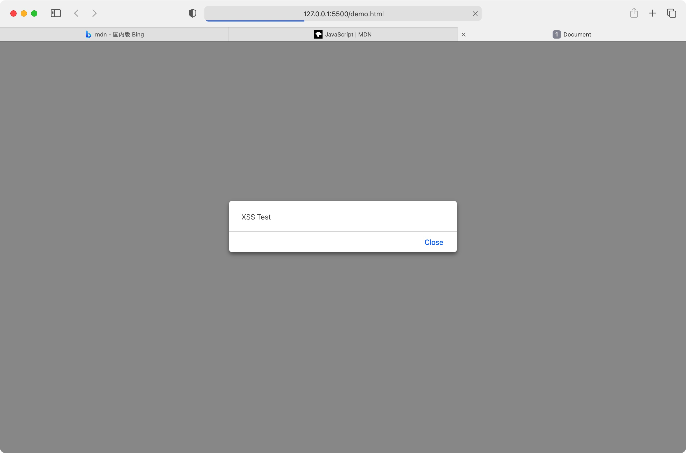
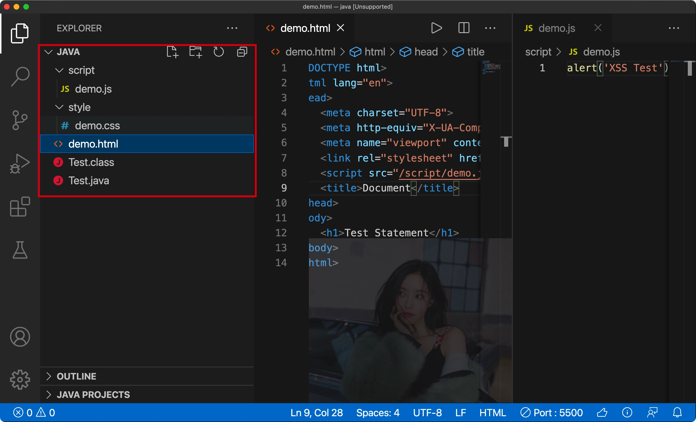

# 1.B/S已成主流

- B/S架构软件: 基于浏览器，不需要安装，且已经成为了行业主流(Office Online，云游戏等等)
- B/S开发所需的岗位:

前端

后端

测试

运维

产品经理

CTO(小公司可能没有)

架构师

****


# 2.前端


## 1) 准备环境

- VS code代码编辑器
- Google Chrome浏览器
- Node.js
- Yarn


### VS code

微软出品的代码编辑器

**相关插件**: 

1. Chinese: 将Vs code的显示语言切换为中文
2. HTML CSS Support: 提供html和css编写和语法提示
3. Live Server: 提供html文件在浏览器中的实时刷新功能，能够同步看到效果


### Google Chrome

谷歌出品的浏览器，目前是市场份额最大的浏览器，日后还可能会用到Firefox


### Node.js

一个开源跨平台后端的JS运行环境，可以在浏览器之外运行js代码，可以设置国内镜像源


### Yarn

FaceBook出品的js包管理工具，和npm作用相同，安装前必须安装node.js，可以设置国内镜像源

****


## 2) HTML

html: Hyper Text Markup Language(超文本标记语言)，用于定义网站内容的**含义和结构**，通常会学习各种标签

截止2021.3.29，最新的HTML为HTML5


推荐的学习网站: MDN(https://developer.mozilla.org/zh-CN/)


exam:



- VS code快捷创建结构: 输入!即可


## 3) CSS

CSS: Cascading Style Sheets(层叠样式表)，**指定网页元素的呈现方式**(颜色，位置，大小等等)

截止2021.3.30，最新的CSS标准为CSS3


exam:



- 需要在<head></head>中指定CSS的位置


## 4) JavaScript

用于**实现网页的功能/行为**(点按按钮，图片弹出/切换等等)


 有函数优先级的轻量级，解释型或即时编译型的编程语言


exam:



- 需要在<head></head>中指定js脚本的位置





**注意文件的分类管理：**




## 5) 相应的框架


CSS:

Element UI, bootstrap


JavaScript:

Vue, React, jQuery

****


# 3.Git

- Git: 一款用于**管理代码的软件**(由C语言编写)
- Github: 一个可以托管由**Git提交的代码平台**


Git的作用：

1. 控制版本(可以记录历史版本，并在需要的时候回复到老版本)
2. 协作开发(需要网络和托管平台)
3. 使服务器(Linux)通过Git将协作开发好的代码下载并部署


相似的软件:

Svn: 由Apache 基金会开发的软件

****


# 4.Linux


常用于服务器


## 1) SSH

一种连接协议，可以通过终端连接服务器


安装

```shell
sudo apt-get install openssh-server
```


连接格式

```shell
ssh user@ip_address
```


**注：**公司中常用公钥和私钥，不会暴露IP


## 2) 基本操作


清屏:

```shell
ctrl + L

clear
```


清除一行命令(输入错误后)

```shell
ctrl + U
```


快速显示上/下一次命令

```shell
Arrow Up/Down
```


显示当前位置

```shell
pwd
```


修改密码

```shell
sudo passwd root
```


