# HTML笔记

## 一、骨架解析

```html
<!DOCTYPE html>
<html lang="en">
<head>
    <meta charset="UTF-8">
    <meta name="viewport" content="width=device-width, initial-scale=1.0">
    <title>Document</title>
</head>
<body>
    
</body>
</html>
```

**快速输入：! 或 html:5**

### 1.语言

```html
<html lang="en"/>
```

页面语言为英语

### 2.字符集


字符集（character set）

```html
<meta charset="UTF-8">
```

（一）GB2312 简中（guo biao国标）
（二）BIG5 繁中 港澳台
（三）GBK （guo biao kuo国标扩展）含简中和繁中。
（四）UTF-8全世界所有国家所需的基本字符。

### 3. 页面名称

页面显示在浏览器标签页上的内容

```html
<title>Document</title>
```


## 二、常用标签

### 1.排版标签

#### （一）h标签(head) 标题标签

```html
  <h1></h1>

  <h2></h2>

  <h3></h3>

  <h4></h4>

  <h5></h5>

  <h6></h6>
```


###### 源码

```html
<body>

  <h1>head</h1>

  <h2>head</h2>

  <h3>head</h3>

  <h4>head</h4>

  <h5>head</h5>

  <h6>head</h6>

</body>

</html>
```


###### 效果


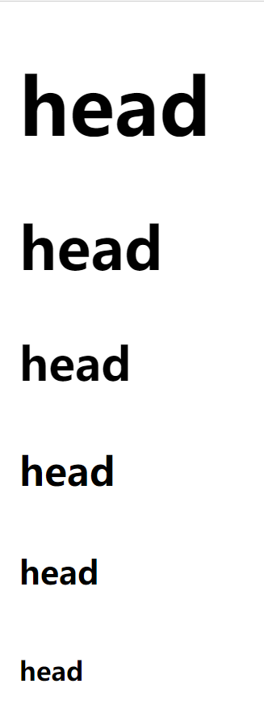


#### （二）p标签(paragraph) 段落标签

**行距较br标签要宽**

```html
<p></p>
<p>
    
</p>
```


###### 源码

```html
<body>
   <p> jdowahdhawdhhwdawd</p>
   <p>hdiuahwdhadhahdad</p>
</body>
</html>
```


###### 效果

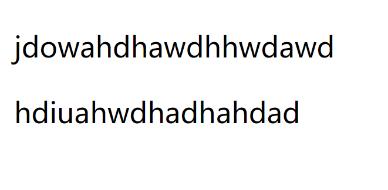


#### （三）hr标签(horizontal) 水平线标签 （单标签）

```html
<hr />
```


###### 源码

```html
<body>
    <p>djowijdajdawijdawd</p>
    <hr />
    <p>hdwhdhadhahdw</p>
</body>
```


###### 效果

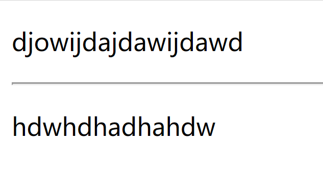


#### （四）br标签(break) 强制换行标签 （单标签）

**行距较p标签要窄**

```html
<br>
```


###### 源码

```html
<body>
    jdwoiajdoahwdohawodhowhd <br>
    hdwiuahdhawhdihad
</body>
```


###### 效果


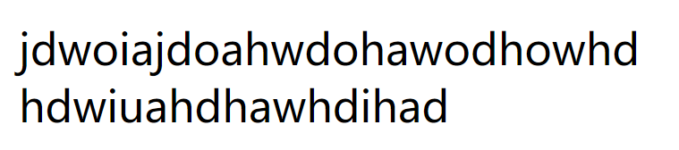


#### （五）div标签(division) 分区分割

****每行只会显示一个div标签***

```html
<div></div>
```


###### 源码

```html
<body>
    <div>hduwihadiha</div> <div>hdiuwhida</div>
</body>
```


###### 效果

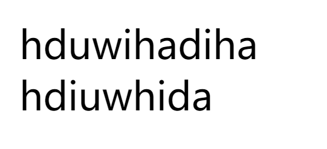


#### （六）span标签    跨度，跨越

**一行能显示多个**

```html
<span></span>
```


###### 源码

```html
<body>
    <span>djwaodjiwad</span>
    <span>hdiahwidh</span>
</body>
```


###### 效果


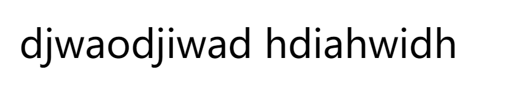


### 2.格式化标签

#### （一）b(bold) 和strong标签 

作用：字体加粗

```html
<b></b>
```


##### b

###### 源码

```html
<body>
    This is a <b>sample</b>
</body>
```


###### 效果

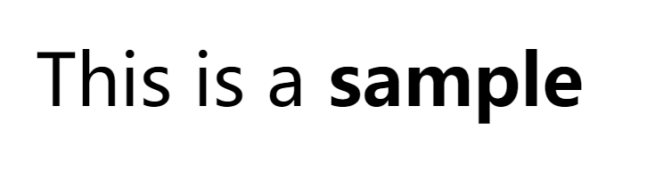


##### strong（推荐）

**strong语义较b标签要更为强烈**

```html
<strong></strong>
```


###### 源码

```html
<body>
    This is a <strong>sample</strong>
</body>
```


###### 效果


#### （二）i（incline）和em（emphasize）标签 倾斜标签

```html
<i></i>
```


##### i

###### 源码

```html
<body>
    This is a <i>sample</i>
</body>
```


###### 效果

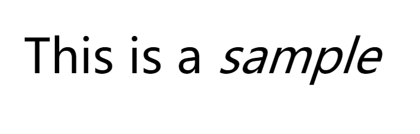


##### em（推荐）

```html
<em></em>
```


###### 源码

```html
<body>
    This is a <em>sample</em>
</body>
```


###### 效果


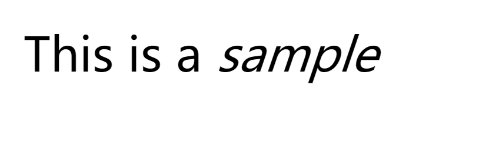


#### （三）s(strikethought)和del(delete) 标签 删除线标签

##### s

```html
<s></s>
```


###### 源码

```html
<body>
    This is a <s>sample</s>
</body>
```


###### 效果


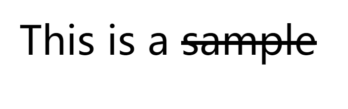


##### del（推荐）

```html
<del></del>
```


###### 源码


```html
<body>
    This is a <del>sample</del>
</body>
```


###### 效果


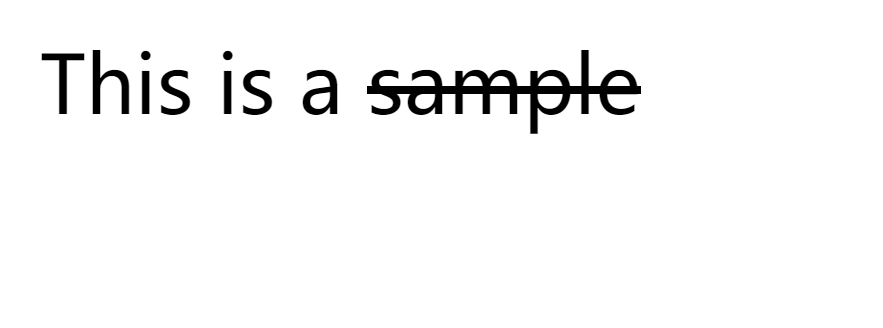


#### （四）u(underline)和ins(insert)标签


##### u

```html
<u></u>
```


###### 源码

```html
<body>
    This is a <u>sample</u>
</body>
```


###### 效果


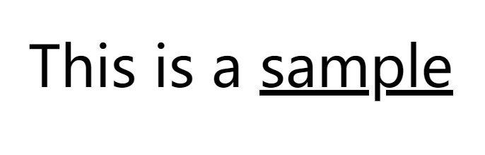


##### ins（推荐）

```html
<ins></ins>
```


###### 源码

```html
<body>
    This is a <ins>sample</ins>
</body>
```


###### 效果


### 3.标签属性

```html
<标签名 属性1="属性值1" 属性2="属性值2" ...>内容</标签名>
<手机 颜色="红色" 大小="5寸" ...>  </手机>
```

**标签可以有多个属性，属性都必须在标签之中，属性之间用空格隔开。**


### 4.img图像标签（image）单标签

```html

```


| 属性                | 属性值  |           作用           |
| ------------------- | :-----: | :----------------------: |
| src(source)         | URL链接 |        图像的路径        |
| alt(alter)          |  文本   | 图像不能显示时的替换文本 |
| title               |  文本   |   鼠标悬停时显示的内容   |
| width               |  像素   |      设置图像的宽度      |
| height              |  像素   |      设置图像的高度      |
| border（用css代替） |  数字   |       设置图片边框       |

###### 源码

```html
<body>
    
</body>

```

###### 效果


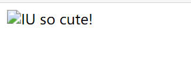


### 5.a标签(anchor)锚点链接标签


```html
<body>
    <a href="" target=""></a>
</body>
```

|                    属性                    |         作用         |
| :----------------------------------------: | :------------------: |
| href <br /><br />hypertext reference(必带) |     指定目标链接     |
|                   target                   | 指定链接页的打开方式 |

###### 外部链接（源码）

**外部链接需带http://**

```html
<body>
    <a href="http://www.bing.com" target="">Bing Search</a>
</body>
```

###### 效果

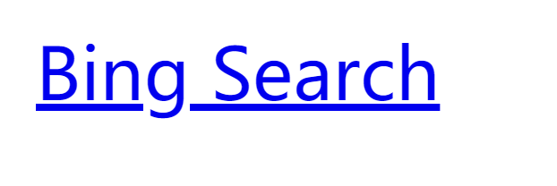


###### 内部链接（源码）

**需在同一文件夹下**

```html
<p>
        <a href="test.html">Jump to another</a>
    </p>
```

###### 效果

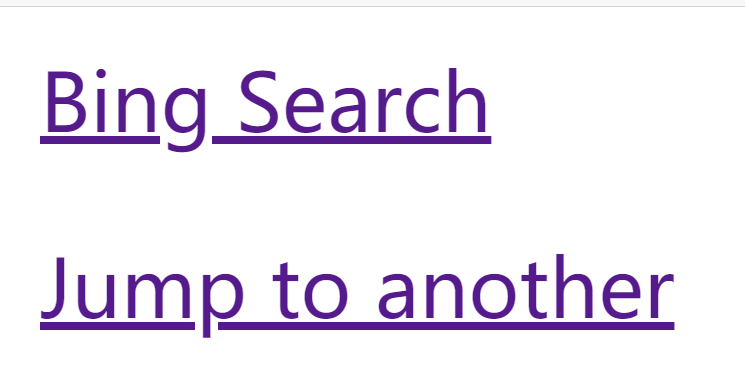

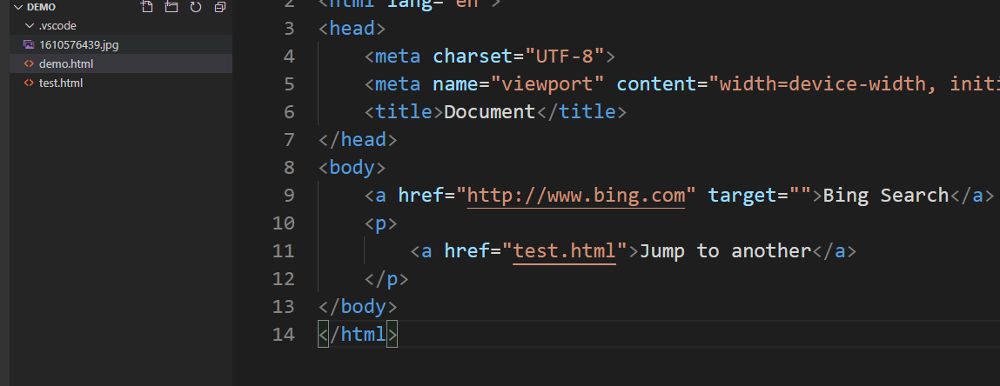


###### 空链接（源码）

```html
<p>
        <a href="#">Jump to another</a>
    </p>
```


###### 效果

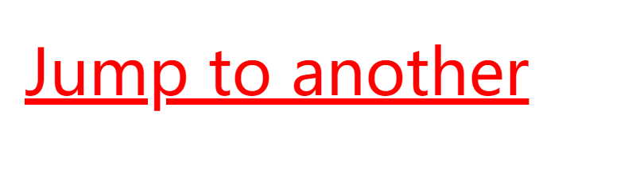


###### target(切换打开方式)

源码

默认为**_self**在当前页面打开（会覆盖当前页面）

属性为**_blank**则在新的空白页打开跳转链接

```html
<a href="http://www.bing.com" target="_blank">Bing Search</a>
```


### 6.注释

与所需说明对象的上方添加注释

##### 写法

```html
<!-- xxx -->
```

##### 快捷键：ctrl + / 或ctrl + shift + /


## 三、路径

### 1.同一级路径（位于同一文件夹下）

引用时直接输入引用对象的文件名

### 2.下一级路径（位于同级文件夹下）

引用时标明具体位置即可

#### 源码

```html

```


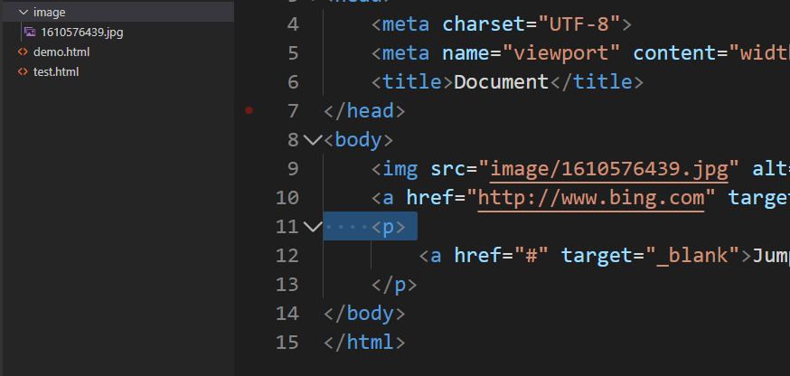


### 3.上一级路径（引用对象位于被包含的文件夹外）

**需用 ../ 返回上一级路径**(两者位于不同的文件夹内)


#### 源码

```html

```


 


## 四、拓展

### 1.锚点定位（快速跳转）

#### 源码

```html
<a href="#head"> <div>jump to achievement</div> </a>

<h3 id="head">achievement</h3>
```

**步骤一**：给相应位置写好id

**步骤二**：在添加的跳转按钮处添加a标签，并用"#id"的形式指明位置


#### 效果

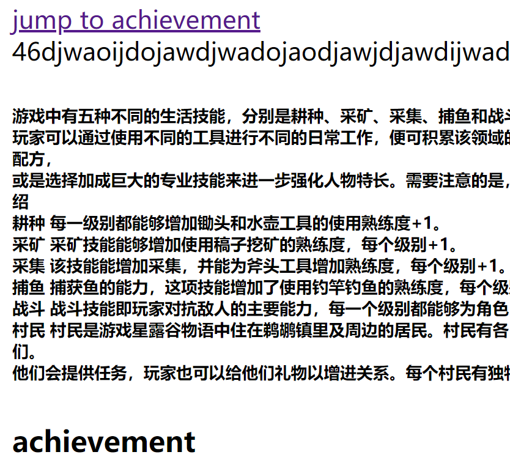


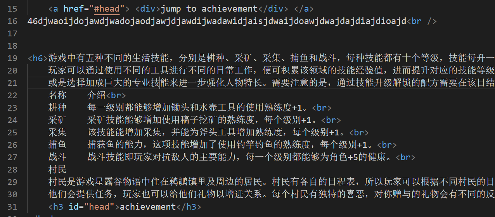


### 2.base标签

**可设置所有链接的默认打开方式**

**需写在<body>标签内**

#### 源码

```html
<head>
    <meta charset="UTF-8">
    <meta name="viewport" content="width=device-width, initial-scale=1.0">
    <title>Document</title>
    <base href="_blank">
</head>
```


#### 效果

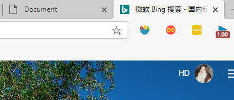


### 3.pre预处理标签(Preformatted)


**保留文本内容原本的格式**（不推荐使用，不好控制格式）

#### 源码

```html
<pre>
    村民是游戏星露谷物语中住在鹈鹕镇里及周边的居民。村民有各自的日程表，所以玩家可以根据不同村民的日常安排在不同的地点、时间、日期找到他们。
    他们会提供任务，玩家也可以给他们礼物以增进关系。每个村民有独特的喜恶，对你赠与的礼物会有不同的反应。</pre>
```


#### 效果

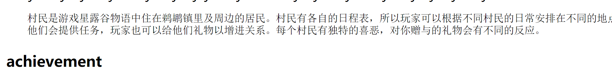


### 4.特殊字符

**类似C语言里的转义字符**

| 字符 |   描述   |           代码            |
| :--: | :------: | :-----------------------: |
| ' '  |   空格   | &nbsp(Non-Breaking-space) |
|  <   |   小于   |      &lt(less than)       |
|  >   |   大于   |     &gt(greater than)     |
|  &   |    和    |           &amp            |
|  ￥  |  人民币  |           &yen            |
|      |   版权   |           &copy           |
|      | 注册商标 |           &reg            |
|      |  摄氏度  |           &deg            |
|      |  正负号  |          &plusmn          |
|      |   乘号   |          &times           |
|      |   除号   |          &divide          |
|      |   平方   |           &sup2           |
|      |   立方   |           &sup3           |


## 五、table表格


### 1.table标签(表示表格外框)

```html
<table>
    
</table>
```


### 2.tr(table row)标签(表示表格的一行)

```html
<tr>
    
</tr>
```


### 3.td(table data cell)标签(表示表格的单个单元行)

```html
<td></td>
```


### 源码范例

```html
<table>
         <tr>
             <td>第一列</td>
             <td>第二列</td>
         </tr>
     </table>
```


### 效果

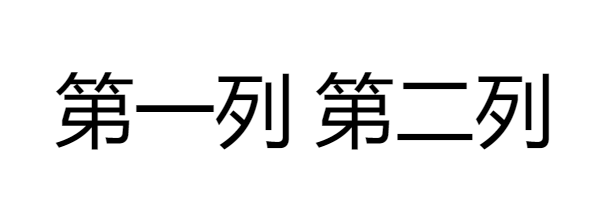


### 4.表格属性(同img)

**需写在table标签内**

|       属性       |               作用               |     常用属性值      |
| :--------------: | :------------------------------: | :-----------------: |
|      border      | 设置边框(默认border="0"为无边框) |        像素         |
|   cellspacing    |       设置单元格之间的距离       |        像素         |
|   cellspadding   | 设置单元格内容与单元格边框的距离 |        像素         |
|      width       |     设置表格宽度(所有单元格)     |        像素         |
|      heigth      |     设置表格高度(所有单元格)     |        像素         |
| align(alignment) |        设置表格的对齐方式        | left、center、right |

#### 代码范例

```html
<table border="1" width="10" align="right"
     cellspadding="20" cellspacing="20">
```


#### 效果


### 5.th(table header cell)表头单元格

**用法于td相同，但内容会居中加粗显示**


#### 源码

```html
<tr>
             <th>第一列</th>
             <th>第二列</th>
         </tr>
```


#### 效果

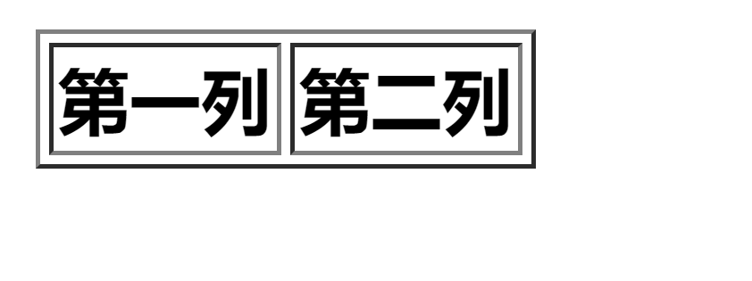


### 6.caption表格标题标签

**位于<table></table>内**


#### 源码

```html
<table border="1"> 
         <caption>Title</caption>
         <tr>
             <th>第一列</th>
             <th>第二列</th>
         </tr>
     </table>
```


#### 效果

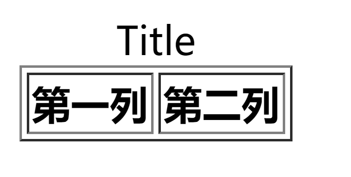


### 7.单元格合并

1.**先上后下，先左后右**

2.**从目标单元格开始，写上合并方式和合并数量**

3.**删除多余的单元格**

#### 1）rowspan跨行合并

```html
<tr>
             <th rowspan="2">第一列</th>
             <th>第二列</th>
         </tr>
         <tr>
            
            <td>2</td>
        </tr>
```

#####  效果

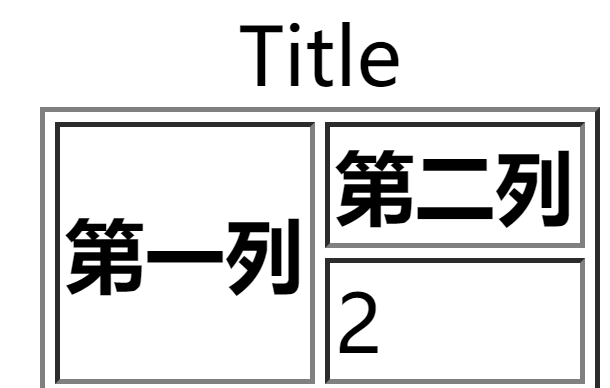


#### 2）colspan跨列合并

```html
<tr>
            <td colspan="2">2</td>
            
        </tr>
```


##### 效果


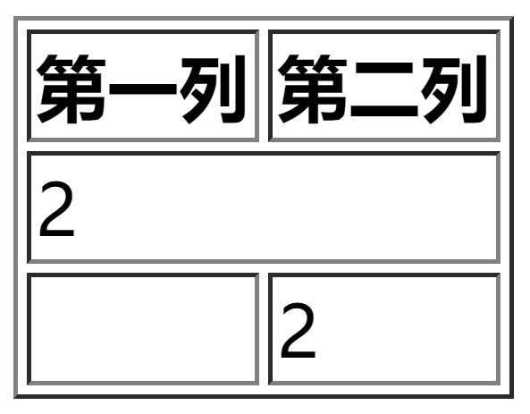


### 8.表格结构划分

#### 1）thead表格题头

**其内部必须有行标签(<tr>)**

##### 源码

```html
<thead>
            <tr>
                <th>第一列</th>
                <th>第二列</th>
            </tr>
         </thead>
```


##### 效果(效果不明显)

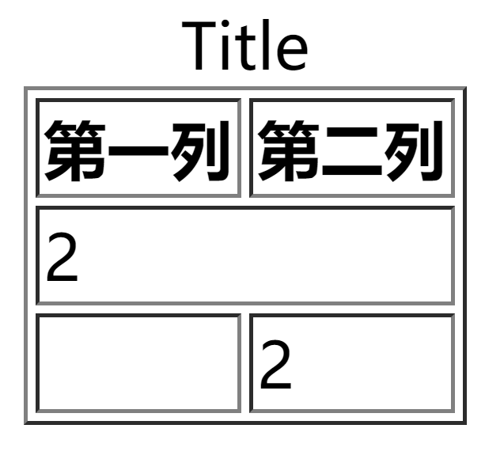


#### 2）tbody表格主体

##### 源码

```html
<tbody>
            <tr>
                <td colspan="2">2</td>
                
            </tr>
            <tr>
                <td></td>
                <td>2</td>
            </tr>
         </tbody>
```


##### 效果

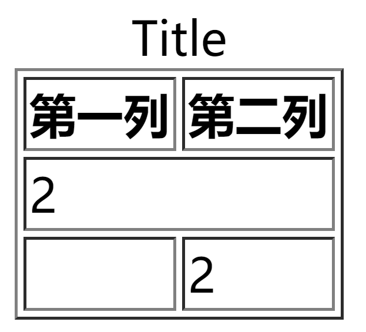


## 六、列表标签

**相比表格去掉了列表的概念，自由度更高**


### 1.ul(Unordered List)无序列表(常用）

**ul里只含li(List Item)**

**li里可以放任意标签**

#### 源码

```html
<ul>
         <li>First</li>
         <li>Second</li>
         <li>Three</li>
     </ul>
```


#### 效果


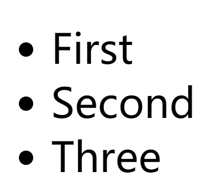


### 2.ol(Ordered List)有序列表

#### 源码

```html
<ol>
         <li>First</li>
         <li>Second</li>
         <li>Three</li>
     </ol>
```


#### 效果

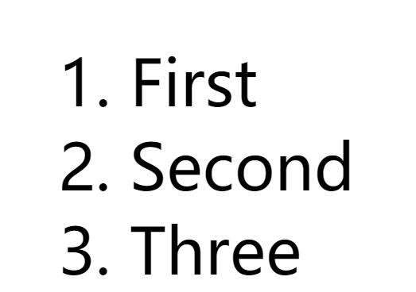


### 3.dl(Definition List)自定义列表

#### dt(Definition Term)自定义列表标题

#### dd(Definition Description)自定义列表元素

**dt和dd是并列关系**


#### 源码

```html
<dl>
        <dt>number</dt>
        <dd>First</dd>
        <dd>Second</dd>
        <dd>Three</dd>
     </dl>
```


#### 效果

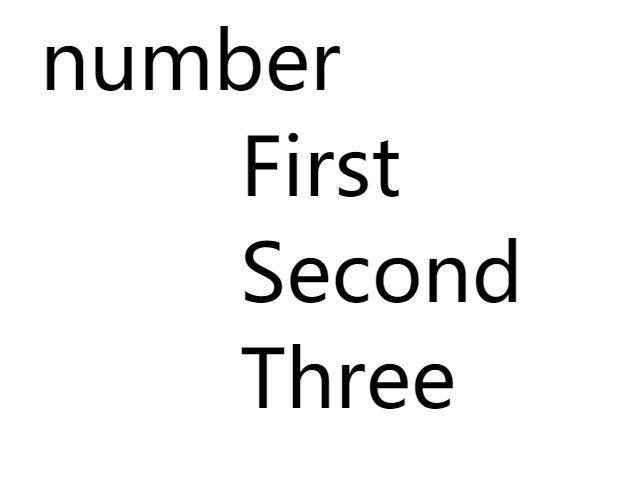


## 七、表单标签

### 1.input(单标签)控件

**语法**:

```html
<input type="属性值" value="">
```


**type可设置为不同属性值来指定不同控件类型**

**value为显示在文本框内的内容**


| 属性  |  属性值  |         功能          |
| :---: | :------: | :-------------------: |
| type  |   text   |    单行文本输入框     |
| type  | password |      密码输入框       |
| type  |  radio   |        单选框         |
| type  | checkbox |        复选框         |
| type  |  button  |       普通按钮        |
| type  |  submit  |       提交按钮        |
| type  |  reset   |       重置按钮        |
| type  |  image   |  图像形式的提交按钮   |
| type  |   file   |        文件域         |
| name  |  自定义  |       控件名称        |
| value |  自定义  |    input的默认文本    |
| size  |  正整数  | input在页面的显示宽度 |


#### (一)value属性

#### 源码

```html
<body>
     account: <input type="text" value="username"> <br>
     passward: <input type="password">
</body>
```


#### 效果

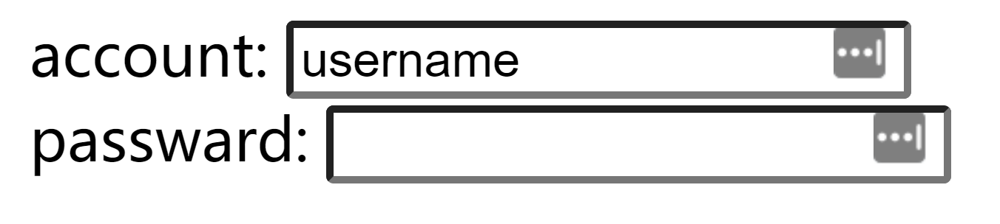


#### (二)name属性

作用：让后台人员区别不同的表单

#### 源码

```html
account: <input type="text" value="username" name="username"> <br>
     passward: <input type="password" name="password">
```

效果不体现在页面上


#### (三)type中的radio

设置为单选按钮

注：可通过将name值设为相同来使得只能选择一个按钮

#### 源码

```html
性别：男 <input type="radio" name="sex"> 女 <input type="radio" name="sex">
```


#### 效果

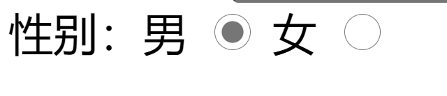


#### (四)type中的checkbox

设置复选框

#### 源码

```html
爱好：
     睡觉 <input type="checkbox" name="hobby"> 
     跑步 <input type="checkbox" name="hobby">
     骑车 <input type="checkbox" name="hobby">
```


#### 效果

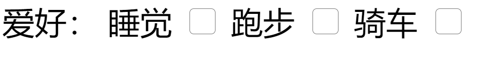