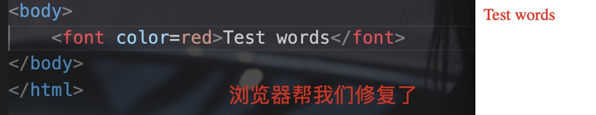

# 一、作用

- HTML: 表示内容
- CSS: 表示样式


# 二、开发流程


# 三、组成

网页分为三个部分:

- 内容(结构): 可以看到的数据(由HTML组成)
- 表现: 内容的呈现方式，比如颜色、字体、布局等等(由CSS实现)
- 行为: 网页元素与设备/用户的交互(由JavaScript实现)


# 四、HTML简介

- Hyper Text Markup Language(超文本标记语言)
- HTML通过标签来标记要显示的网页中的部分，所以网页本身是一种文本文件
- 通过在文本文件中添加标记符，也可以指定一部分样式


# 五、HTML的书写规范


```html
<html>											<!--表示整个页面的开始-->
  <head>										<!--头信息-->
    <title></title>					<!--标题-->
  </head>
  <body>										<!--body是页面的主体内容-->
    
  </body>
</html>											<!--表示整个html页面的结束-->
```


```html
html的注释:
<!-- -->
```


# 六、html标签简介

## 1) 标签的格式:

```html
<标签名></标签名>		<!--针对双标签-->
<标签名/>					<!--针对单标签-->
```


## 2) 标签大小写不敏感

Eg:


## 3) 标签有自己的属性

- 基本属性:

Eg:


bgcolor属性表示背景颜色


- 事件属性:

Eg:


button标签表示按钮

onclick表示点击

alert是JavaScript中的一个警告框函数，其可以接受任何参数，并将参数作为警告的内容


## 4) 单标签/双标签

- 格式:

```html
<标签名></标签名>		<!--针对双标签-->
<标签名/>					<!--针对单标签-->
```


- 单标签:

```html
<br/>		换行
<hr/>		水平线
```


Eg:


# 七、HTML标签语法


## 1) 不能交叉嵌套


## 2) 标签必须正确关闭


## 3) 标签的属性应该有值/值应该加上引号

- 没有指明值，浏览器则使用默认的

Eg:




## 4) 注释不能嵌套


# 八、font标签

font标签用来修改文本的颜色、大小和字体


三个属性:

- color: 用来修改颜色
- size: 用来修改字体大小(1-7，7最大)
- face: 用来修改字体

Eg:


