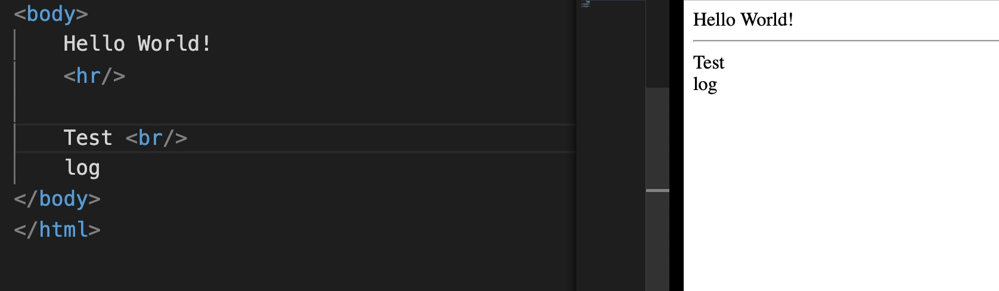
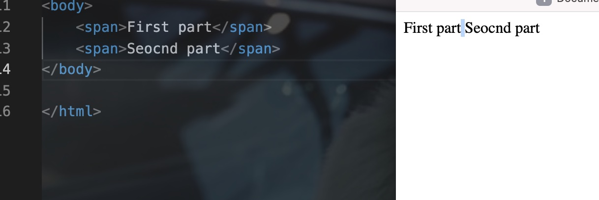
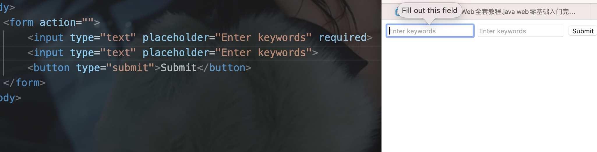
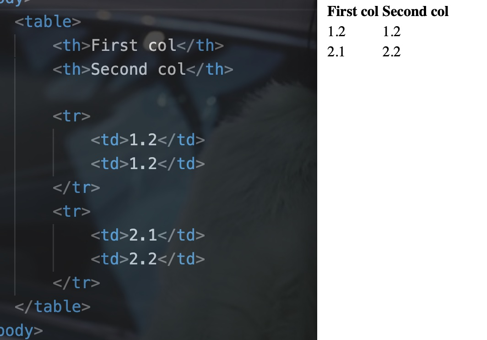
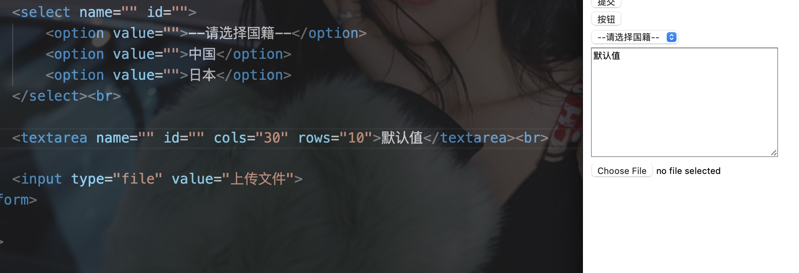

# 一、作用

- HTML: 表示内容
- CSS: 表示样式


# 二、开发流程


# 三、组成

网页分为三个部分:

- 内容(结构): 可以看到的数据(由HTML组成)
- 表现: 内容的呈现方式，比如颜色、字体、布局等等(由CSS实现)
- 行为: 网页元素与设备/用户的交互(由JavaScript实现)


# 四、HTML简介

- Hyper Text Markup Language(超文本标记语言)
- HTML通过标签来标记要显示的网页中的部分，所以网页本身是一种文本文件
- 通过在文本文件中添加标记符，也可以指定一部分样式


# 五、HTML的书写规范


```html
<html>											<!--表示整个页面的开始-->
  <head>										<!--头信息-->
    <title></title>					<!--标题-->
  </head>
  <body>										<!--body是页面的主体内容-->
    
  </body>
</html>											<!--表示整个html页面的结束-->
```


```html
html的注释:
<!-- -->
```


# 六、html标签简介

## 1) 标签的格式

```html
<标签名></标签名>		<!--针对双标签-->
<标签名/>					<!--针对单标签-->
```


## 2) 标签大小写不敏感

Eg:


## 3) 标签有自己的属性

- 基本属性:

Eg:


bgcolor属性表示背景颜色


- 事件属性:

Eg:


button标签表示按钮

onclick表示点击

alert是JavaScript中的一个警告框函数，其可以接受任何参数，并将参数作为警告的内容


## 4) 单标签/双标签

- 格式:

```html
<标签名></标签名>		<!--针对双标签-->
<标签名/>					<!--针对单标签-->
```


- 单标签:

```html
<br/>		换行
<hr/>		水平线
<imag/> 图片
```


Eg:




# 七、HTML标签语法


## 1) 不能交叉嵌套


## 2) 标签必须正确关闭


## 3) 标签的属性应该有值/值应该加上引号

- 没有指明值，浏览器则使用默认的

Eg:


## 4) 注释不能嵌套


# 八、font标签(h5中已经废弃)

font标签用来修改文本的颜色、大小和字体


三个属性:

- color: 用来修改颜色
- size: 用来修改字体大小(1-7，7最大)
- face: 用来修改字体

Eg:


****


# 九、显示特殊字符

- 形如"<", ">"之类的字符会被浏览器解析而无法显示，需要使用特殊的转义

Eg:


- 浏览器解析html时，连续的多个空白字符都会被解析为一个字符

Eg:


"<"的字符实体: 

```html
&lt;
```

(即less than)

">"的字符实体:

```html
&gt;
```


(即greater than)

Eg:


表示空格:

```html
&nbsp;
```

Eg:


# 十、标题标签

- 共有h1到h6
- h1最大，h6最小

Eg:


- 对齐的属性: align(h5中已经废弃了)


值:

- left(默认值)
- right
- center

***


# 十一、超链接(重点)

- 需要变为超链接的文本必须放在a标签内
- a标签内的href属性用来指定跳转的位置
- target属性用来指定跳转的方式

Eg:


<hr>

- target
    - _seft: 在原本的页面进行跳转
    - _blank: 在新的页面打开链接页面


内部跳转:

- 可以在a标签的href属性内写上对应的跳转属性值
- 跳转的目标位置可以是任何标签，只要id属性和href中相同即可

```html
<a href="#Jump Attribution">text</a>

<h1 id="Jump Attribution"></h1>
```


Eg:


# 十二、列表标签


## 1) 有序列表

Syntax:

```html
<ol>				<!--order list-->
  <li></li> <!--list item-->
</ol>
```


Eg:


属性:

- type(指定列表的开头格式)

    - a: 小写数字

    - A: 大写数字

    - i: 小写罗马数字

    - I: 大写罗马数字

    - l: 数字(默认)


## 2) 无序列表

Syntax:

```html
<ul>
  <li></li>
</ul>
```


Eg:


<hr>


# 十三、图片标签

- img标签中需要使用src属性定位图片的位置

Syntax:

```html

```


Eg:


属性:

- src: 指定源文件的路径
- width: 指定图片的宽
- height: 指定图片的高
- alt(alternative text): 当图片无法正常显示时，显示的文字
- border(已废弃): 设置边框的宽度


# 十四、p/span/div标签


## 1) p标签

表示段落(paragraph): 将其中的文本单独显示一段(与其他部分默认上下隔开一行)

Eg:


## 2) span标签

以文本的长度显示，多个span之间默认间隔一个空格

Eg:




## 3) div标签

将其中的文本显示在一行中

Eg:


****


# 十五、input输入框

- type属性指明输入的文本类型

Eg:


属性

- placeholder：设置默认的占位字符
- required: 设置当前输入框为**必填字段**


Eg:




- 

****


# 十六、table表格

- th(table head): 表示表格中每列的开头
- tr(table row): 表示当前行的数据
- td(table data): 表示表格中的数据

Eg:




- table标签的属性
    - border: 表示表格的边框，0为无边框
    - width: 表示表格的宽度
    - height: 表示表格的高度
    - align: 对齐方式
    - cellspacing: 设置单元格的间距


- b是加粗标签

Eg:


<hr>


# 十七、表格跨行跨列(重点)

- 跨列:

在对应单元格(td)中添加属性为colspan(column span)，属性值为跨越的行数

```html
<td colspan="colspan_number"></td>
```


Eg:


Fix:


- 跨行:

在td中添加属性"rowspan"，值为跨过的行数

Syntax:

```html
<td rowspan="span_number"></td>
```


Eg:


Fix:


- 同时跨行与列与上述相同

<hr>


# 十八、iframe标签

- 能在当前页面中显示一个小的页面
- 使用name属性定义名称后，可以让a标签点开后的链接跳转到对应值中
- src属性指明了显示的页面
- 使用width和height指定宽和高

Syntax:

```html
<iframe src="resource.html" width="" height="" name="">
  
</iframe>
```


- 设置iframe标签的name属性定义名称后，在target中定义相同属性值的a标签就会将对应的文件在iframe中打开

Eg:


****


# 十九、input输入文本框


## 1) type属性

- text: 文本
- password: 密码(输入时会隐藏)

Syntax:

```html
<input type="">
```


- radio: 单选框
- checkbox: 复选框
- reset: 重置按钮
- submit: 提交按钮
- button: 普通按钮
- file: 文件上传(点击后可以选择本地文件)
- hidden: 隐藏域，不对用户显示

Eg:


- 通过value属性可以设置按钮/文本框中的默认值
- 在选择框中(单选框/复选框)，使用checked属性可以将该选项设为默认值
- 通过将name属性设置为同一个值，可以将多个单选框设置为同一组，从而限制单选


Eg:


- reset只有放在form里才有用


Eg:


- select: 下拉列表栏
    - option: 下拉列表中的选项，设置selected属性为"selected"可以设置为默认选项
- textarea: 多行文本输入，row为行数，cols为每行的字符数

Eg:



****


# 二十、form


## 1) 属性

- action: 指定发送的服务器URL
- method: 发送的方法(get/post)


Eg:


- GET请求的特点
    - 浏览器地址栏的地址为action属性[+?+参数]，参数格式为：name=value&name=value
    - 不安全(显示参数在地址栏)
    - 有数据的长度限制
- POST请求的特点
    - 浏览器地址栏中只有action属性值
    - 相对GET要安全


