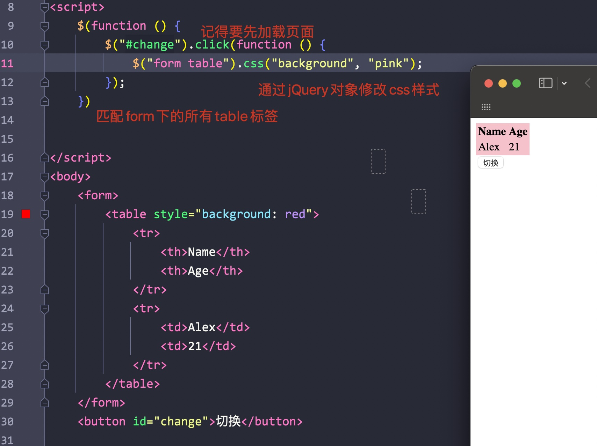
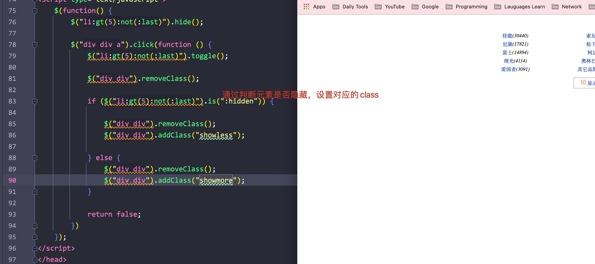

# 一、jQuery介绍

- jQuery: JavaScript和Query，是辅助JavaScript开发的js类库
- 核心思想: write less, do more(写得更少，做得更多)，可以解决很多浏览器的兼容问题
- jQuery开源免费，语法简单

****


# 二、Hello jQuery

- jQuery对象都默认以"$"开头
- 使用jQuery之前需要独立写一个script标签导入jQuery才行

Eg:


- 其中$("")就相当于通过id获取标签对象，但jQuery对象要以"$"开头


注意：

- 使用jQuery时一定要先引入jQuery库
- jQuery中的"$"其实是一个函数

jQuery src Eg:


压缩版本和不压缩版本的区别:


- 在实际部署中一般都使用压缩的版本，可以加快加载的速度


- 为按钮标签添加响应函数的过程：
    - 使用jQuery查询到标签对象$("#id")
    - 通过该标签对象调用click方法，在其中定义函数：对象.click(function() {});


## 1. jQuery的核心函数

$是jQuery的核心函数，通过传入不同的参数，会有不同的作用


- 当传入的参数为函数时

表示页面加载完成之后，相当于window.onload = function() {}


- 参数为HTML格式的字符串时

会创建这个字符串，可以再使用apendTo()传入到body标签中

Eg:


- 参数为选择器字符串时
    - $("#id"): 根据id查询标签对象
    - $("标签名"): 根据知道的标签名查询标签对象
    - $(".class属性"): 类选择器，根据class属性查询标签对象


- 参数为DOM对象时

会将该DOM对象转换为jQuery对象

Eg:


## 2. 区分jQuery对象和DOM对象


DOM对象

- 通过getElementById/getElementsByName/getElementsByTagName/createElement方法创建的都是DOM对象

通过alter输出的形式为: [object HTMLXXX]


jQuery对象

- 通过API创建/包装DOM对象/API查询的对象都是jQuery对象

通过alter输出的形式: [object Object]


## 3. jQuery对象的本质

- jQuery对象是一个DOM对象数组(数组中的元素都是DOM对象) + jQuery提供的一系列功能函数


## 4. jQuery对象和DOM对象的区别

- jQuery不能使用DOM对象的属性的方法
- DOM不能使用JQuery对象的属性和方法


## 5. jQuery和DOM对象转换(重点)

- 通过核心函数可以将DOM对象转换为jQuery对象
- jQuery对象通过下标可以转换为DOM对象


# 三、选择器(重点)


## 1. 基础选择器

- id选择器: 根据id查找标签对象

$(#id_val)

- .class选择器: 根据class查找标签对象

$(.class)

- element选择器: 根据标签名查找标签对象

$(table_name)

- *选择器: 匹配所有的元素
- selector1, selector2组合选择器: 合并多个选择器的结果并返回


## 2. 层级选择器

- ancestor descendant(后代选择器): 会查找出所有ancestor下的所有能够匹配上的后代元素(子/孙子)

Eg:




- parent > child(子元素选择器): 与后代选择器不同的是，其只能够选择其对应父元素下的第一层子节点，无法选择孙子节点

Eg:


- prev + next(相邻元素选择器): 匹配所有位于prev元素之后的next标签元素

Eg:


- prev ~ sibling(兄弟选择器): 与相邻元素选择器不同，其会匹配prev元素之后的所有同级元素

Eg:


## 3. 过滤选择器


### 1) 基本过滤选择器

- first: 选择获取的一个标签对象
- last: 选择获取的最后一个标签对象
- not: 不选择匹配的标签对象
- even: 选择索引为偶数的标签对象
- odd: 选择索引为奇数的标签对象
- eq: 选择索引等于给定值的标签对象
- gt(greater than): 选择索引大于给定值的标签对象
- lt(less than): 选择索引小于给定值的标签对象
- header: 选择所有的标题标签对象
- animated: 选择所有执行动画的标签对象


Eg:


### 2) 内容过滤选择器

- contains(text): 匹配包含指定文本的标签元素
- empty: 匹配为空的标签元素(没有子标签/文本内容)
- parent: 与empty相反
- has(selector): 匹配含有选择器匹配规则的元素(含有对应标签的标签元素)

Eg:


### 3) 属性过滤选择器

- [atrribute] 包含给定属性的元素
- [atrribute=value] 包含给定的属性值为指定值的元素
- [atrribute!=value] 包含给定的属性值不为指定值的元素/或者不包含该属性
- [atrribute^=value] 给定的属性是以某些值开始的元素
- [atrribute$=value] 给定的属性是以某些值结尾的元素
- [atrribute*=value] 给定的属性包含特定值开始的元素

```javascript
[attrSel1][attrSel2]...
```

复合属性选择器，包含多个条件

Eg:


### 4) 表单过滤选择器

- :input: type属性为input
- :text: type属性为text
- :password: type属性为password
- :radio： 针对单选框
- :checkbox: 针对多选框
- :submit: type属性为submit
- :mage: type属性为image
- :reset: type属性为reset
- :button: type属性为button
- :file: type属性为file
- :hidden: type属性为hidden

Eg:


## 4. 元素筛选

```
eq()　　  筛选指定索引号的元素
first()　　筛选出第一个匹配的元素
last()　　 筛选出最后一个匹配的元素
hasClass()　　检查匹配的元素是否含有指定的类
filter()　　筛选出与指定表达式匹配的元素集合
is()　　　 检查元素是否参数里能匹配上的
map()
has()　　筛选出包含指定子元素的元素
not()　　排除能够被参数中匹配的元素
slice()　　　　从指定索引开始，截取指定个数的元素
children()　　筛选获取指定元素的资源
closest()　　 从当前元素开始，返回最先匹配到的符合条件的父元素
find()　　　　从指定元素中查找子元素
next()　　　  获取指定元素的下一个兄弟元素
nextAll()　　 获取其后的所有兄弟元素
nextUntil()　 获取其后的元素，直到参数能匹配上的为止,不包括结束条件那个
offsetPosition()　　返回第一个用于定位的祖先元素，即查找祖先元素中position为relative或absolute的元素。
parent()　　　获取指定元素的直接父元素
parents()　　 获取指定元素的所有祖先元素，一直到<body></body>
parentsUntil()　　获取指定元素的祖先元素，知道参数里能匹配到的为止
prev()　　　　获取指定元素的前一个兄弟元素
prevAll()　　　获取指定元素前面的所有兄弟元素
prevUntil()　  获取指定元素前面的所有兄弟元素，直到参数里的条件能够匹配到的。 注意参数条件本身不会被匹配
siblings()　　 获取指定元素的兄弟元素，不分前后
add()　　　　将选中的元素添加到jQuery对象集合中
andSelf()　　将自身加到选中的jQuery集合中,以方便一次性操作
end()　　 　 将改变当前选择器选中的操作回退为上一个状态。
```

- 通过过滤选择器也可以达到相同的结果


# 四、属性操作


方法：

- html(): 获取/设置对应对象的html标签内容，同DOM对象中的innerHTML属性
- val(): 获取/设置表单项中的value值，同DOM对象中的value属性
- text(): 获取/设置对象中的文本内容，同DOM对象中的innerText属性

**注意：**当没有参数的时候，这些方法会返回对应对象的属性值；如果有参数，则将参数设置为对应对象属性的值


Eg:


- attr(): 设置/获取属性的值，不推荐操作checked/readOnly/selected/disabled等等

其可以用来操作非标准属性(自定义属性)

- prop(): 可以设置/获取属性的值，推荐操作checked/readOnly/selected/disabled等等

**注意：**当其中只有一个参数时，会返回对应属性的值，当有两个值时才会更新该值


Eg:


# 五、对DOM的CRUD

- 内部插入
    - appendTo(): 将调用对象插入到b的子元素中的末尾位置
    - prependTo(): 将调用对象插入到b的子元素中的开头位置
- 外部插入
    - insertAfter(): 将调用对象插入到参数的后面
    - insertBefor(): 将调用对象插入到参数的前面
- 替换
    - replaceWith(): 用参数替换掉调用对象
    - replaceAll(): 反之
- 删除
    - remove(): 删除调用对象中的标签
    - empty(): 清空a标签中的内容


Eg:


Eg:


通过传递this对象到核心函数中，转换为一个jQuery对象


# 六、对CSS的操作

- addClass(): 向被选元素添加一个/多个类(class)
- removeClass(): 从被选元素中删除一个/多个类
- toggleClass(): 对被选元素的class进行添加/删除操作
- offset(): 返回第一个匹配元素相对于整个文档的位置


# 七、动画


## 1. 基本动画

- show(): 显示
- hide(): 隐藏


## 2. 淡入淡出

- fadeIn(): 淡入
- fadeOut(): 淡出
- fadeTo(): 修改透明度
- fadeToggle(): 切换淡入淡出状态


css修改demo



<hr>


# 八、事件


## 1. 原生js和jQuery的区别

- jQuery会在浏览器内核解析完页面标签，创建好DOM对象之后，会马上执行
- 原生JS还需要加载标签的内容，所以会比jQuery要慢


- jQuery会比原生js要先被触发


- 原生js在页面加载完成后，只会执行一次赋值函数(之前的会被覆盖)
- jQuery页面加载完成后，会将所有注册的func依次执行


## 2. 事件的处理方法

- click(): 绑定/触发单击事件
- mouseover(): 鼠标移入事件
- mouseout(): 鼠标移出事件
- bind(): 可以给元素一次绑定一个/多个事件
- one(): 和bind一样，但只能绑定一个事件
- unbind(): 接触事件的绑定
- live(): 绑定事件，可以绑定选择器匹配的事件，哪怕该元素是后面动态创建出来的(不再需要手动注册绑定)

Eg:


## 3. 事件的冒泡

- 定义: 事件的冒泡是指，当父子元素监听同一个事件。当子元素事件触发时，该事件也被传递到了父元素的事件中去响应


- 如何组织事件冒泡？

在子元素事件函数体内，return false可以阻止事件的冒泡传递

Eg:


## 4. 事件对象

- 定义: 事件对象是封装有触发事件信息的一个js对象


如何获取该js事件对象？

- 在给元素绑定事件时，在事件的function(event)参数列表中添加一个参数，该参数一般名为event
- 该event就是js传递事件处理函数的事件对象


Eg:


练习:


