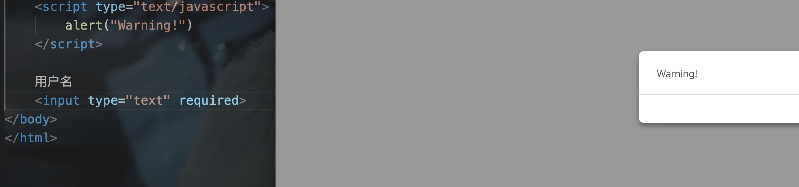
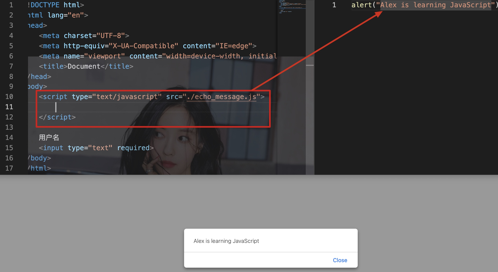
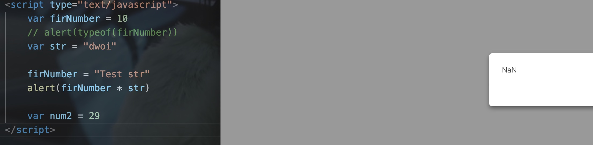
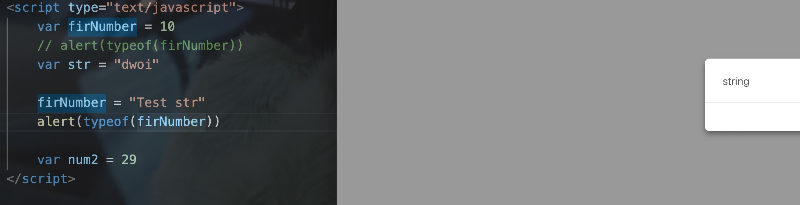
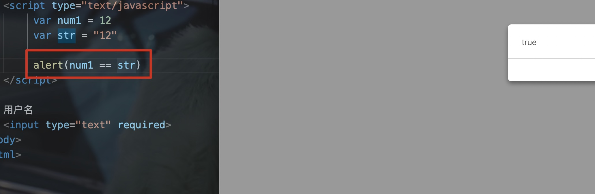
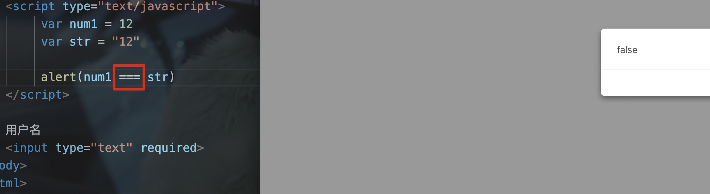
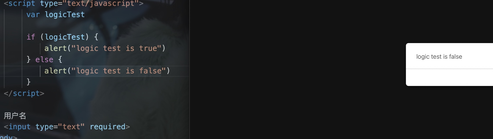
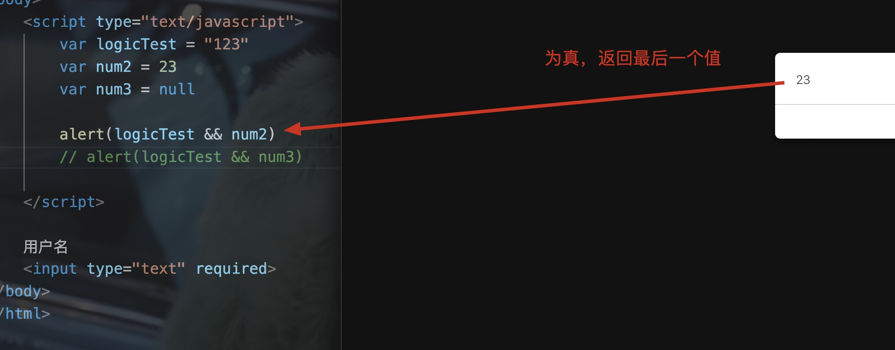
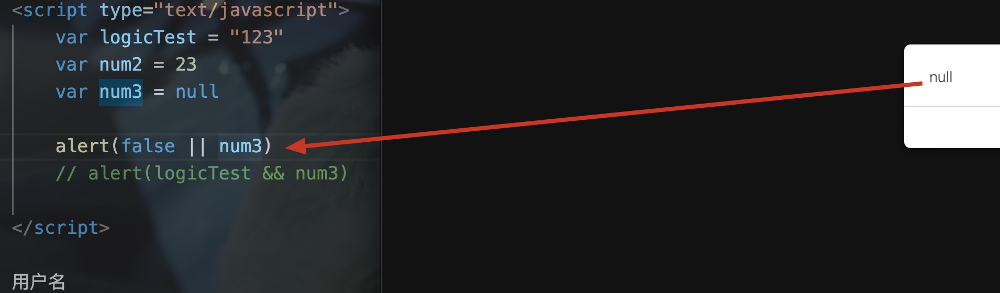

# 一、JavaScript简介

- 其最初诞生是为了完成页面的验证，其运行在客户端，需要浏览器来解析执行JavaScript代码

JavaScript是弱类型语言(不需要显式地定义类型)

特点:

- 交互性(与用户进行交互)
- 安全性(不允许直接访问本地的硬盘
- 跨平台性(只要是可以解释js的浏览器都可以执行)

# 二、JavaScript与HTML交互的方式

## 1. 第一种

- 通过script标签中内嵌JavaScript代码

Eg:

## 2. 第二种

- 通过script标签中的src属性引入js代码即可

Eg:

- 注意src和内嵌的方式之间只能选择一种

# 三、JavaScript的变量/数据类型

变量类型:

- number: 数值类型
- string: 字符串类型
- object: 对象类型
- boolean: 布尔类型
- function: 函数类型

JavaScript里的特殊值:

- undefined: 未定义(所有变量未赋予初始值时，默认值都为undefined)
- null: 空值
- NAN: 非数字/非数值(not a number)

JavaScript中定义变量的格式:

- var 变量名
- var 变量名 = 初始值

typeof: 可以显示变量的类型

Eg:

# 四、关系运算

## 1. 等于

- 仅仅比较两个变量的字面值

Eg:

## 2. 全等于

- 比较字面值，比较类型

Eg:

# 五、逻辑运算

- 在JavaScript中，所有的变量都能够作为boolean值进行判断
- 0，null，undefined，""(空串)都为false

Eg:

## 1. 且运算

- 当表达式全为真时，返回最后一个表达式的值
- 当其中有一个为假时，返回第一个为假的表达式的值

Eg:

## 2. 或运算

- 当表达式全为假时，返回最后一个表达式的值
- 当有一个为真时，返回第一个为真的表达式的值

Eg:

