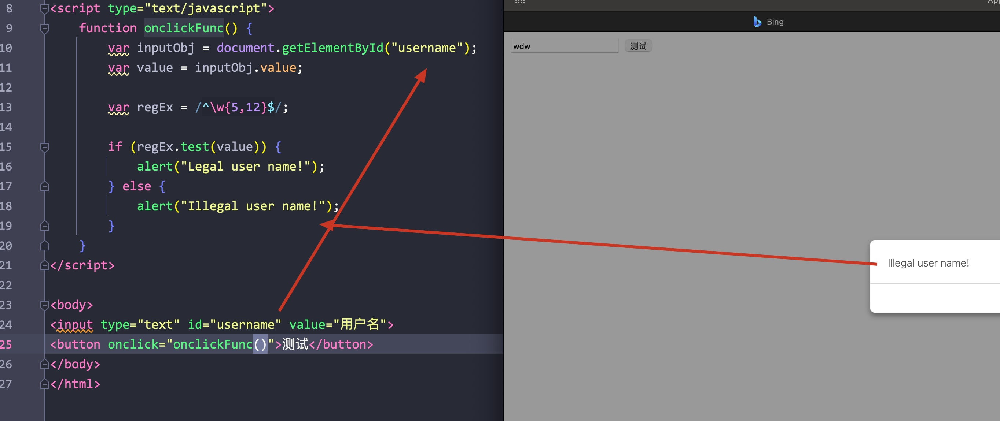
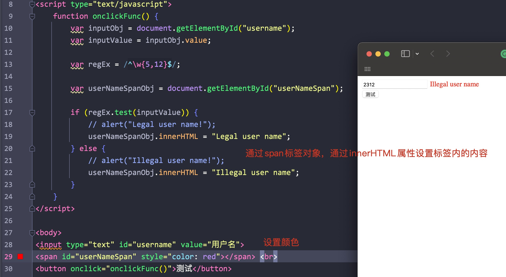
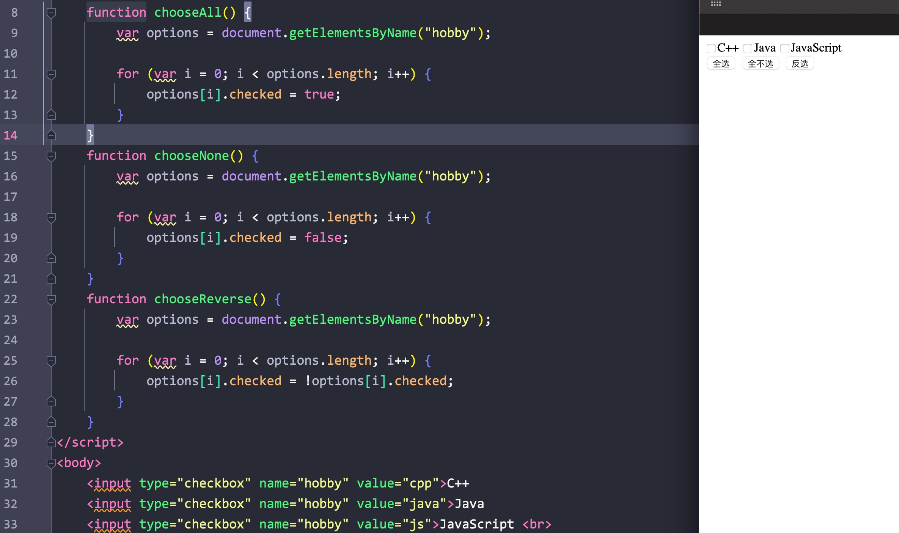
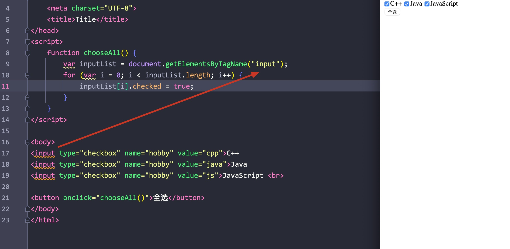
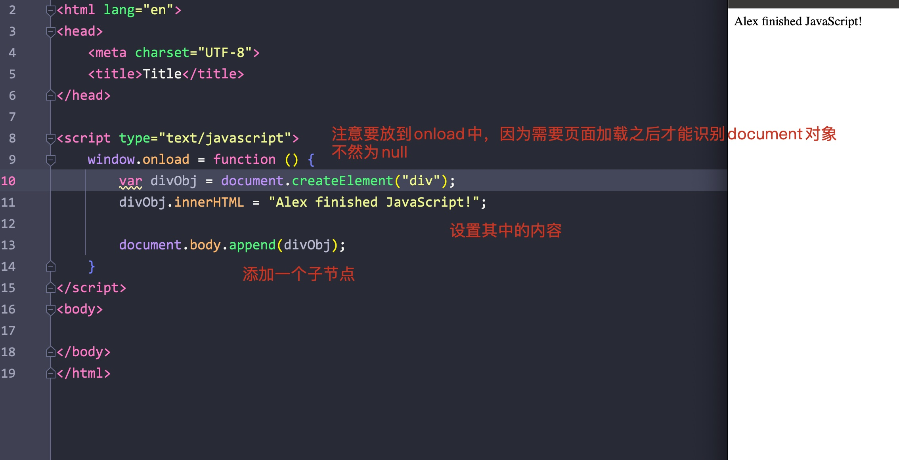

# 一、JavaScript简介

- 其最初诞生是为了完成页面的验证，其运行在客户端，需要浏览器来解析执行JavaScript代码

JavaScript是弱类型语言(不需要显式地定义类型)

特点:

- 交互性(与用户进行交互)
- 安全性(不允许直接访问本地的硬盘
- 跨平台性(只要是可以解释js的浏览器都可以执行)

# 二、JavaScript与HTML交互的方式

## 1. 第一种

- 通过script标签中内嵌JavaScript代码

Eg:


## 2. 第二种

- 通过script标签中的src属性引入js代码即可

Eg:


- 注意src和内嵌的方式之间只能选择一种

# 三、JavaScript的变量/数据类型

变量类型:

- number: 数值类型
- string: 字符串类型
- object: 对象类型
- boolean: 布尔类型
- function: 函数类型

JavaScript里的特殊值:

- undefined: 未定义(所有变量未赋予初始值时，默认值都为undefined)
- null: 空值
- NAN: 非数字/非数值(not a number)

JavaScript中定义变量的格式:

- var 变量名
- var 变量名 = 初始值

typeof: 可以显示变量的类型

Eg:


# 四、关系运算

## 1. 等于

- 仅仅比较两个变量的字面值

Eg:


## 2. 全等于

- 比较字面值，比较类型

Eg:


<hr>

# 五、逻辑运算

- 在JavaScript中，所有的变量都能够作为boolean值进行判断
- 0，null，undefined，""(空串)都为false

Eg:


## 1. 且运算

- 当表达式全为真时，返回最后一个表达式的值
- 当其中有一个为假时，返回第一个为假的表达式的值

Eg:


## 2. 或运算

- 当表达式全为假时，返回最后一个表达式的值
- 当有一个为真时，返回第一个为真的表达式的值

Eg:


# 六、数组

## 1. 数组的定义

Syntax:

```javascript
var arrName = []
var arrName = [ele1, ele2, ..]
```

**数组在赋值时**，会根据最后一个元素的下标自动扩容，没有赋值而直接使用下标访问则会显示undefined

Eg:


## 2. 数组的遍历

- 与java不同，其中的索引定义为var

Eg:


# 七、函数


## 1.第一种定义

Syntax:

```javascript
function funcName(argument1, argument2) {

}
```

Eg:


- 函数中的参数不需要指定类型，连var都不需要写

Eg:


- 函数的返回值不需要在函数体中指定，直接返回即可


## 2.第二种定义

Syntax:

```javascript
var funName=function() {

}
```


## 3.覆盖重载

- js中的重复函数会被覆盖，以最后一次覆盖为准

Eg:


## 4. 隐形参数

- 不管给函数传递多少个参数，都可以通过arguments数组进行访问(和普通数组一样通过下标)

Eg:


拓展:

- JavaScript和Java一样，一旦遇到字符串，则自动将前面的变量变为字符串进行拼接

Eg:


# 八、对象


## 1.Object形式的对象

Syntax:

```javascript
var varName = new Object();
varName.attribution = value;
varName.func = function() {
    
}
```


Eg:


## 2.{}定义对象

Syntax:

```javascript
var objName = {
    attribution1 : value,
    attribution2 : value,
    funcName : function() {
    
    }
}
```

- 注意除了最后一个属性/函数，其余的都要在末尾加上逗号

Eg:


# 九、js中的事件

- 指的是用户与页面间的交互


## 1. 常用的事件

- onload: 页面加载完成后，常用于js代码初始化
- onclick: 用于按钮的点击响应操作
- onblur: 失去焦点，常用于输入框失去焦点后**验证其输入是否合法**
- onchange: 内容发生变化事件，常用于下拉列表和输入框内容发生改变后操作
- onsubmit: 表单提交事件，在表单提交前，验证表单项是否合法


### 1) 事件的注册/绑定

将事件与js绑定，使得事件响应后，执行对应的js代码


- 静态注册: 通过html标签属性直接赋予事件响应后的代码，这种方式称为静态注册
- 动态注册: 通过js获取标签的DOM对象，通过DOM对象.对象名 = function() {}的形式赋予事件响应后的代码


动态注册:

1. 获取标签对象
2. 标签对象.事件名 = function() {}


### 2) onload事件


静态注册:

- 在body标签中使用即可

Eg:


或者:


动态绑定(格式固定):


### 3) onclick事件


静态:


- 在button中使用onclick属性，指明响应时间的函数


动态:


- 首先需要加载onload方法，在其中通过document对象获取对应的元素对象
- 其中document对象指的是整个页面
- 通过元素对象调用onclick方法进行定义


### 4) onblur事件


- 静态:


- 动态:


### 5) onchange事件

- 静态绑定

Eg:


- 动态绑定

Eg:


### 6) onsubmit


Eg:


# 十、DOM模型

- DOM：Document Object Model

将文档中的标签、属性、文本**转换为对象来管理**

Eg:


Document对象的理解

- Document管理所有的HTML文档内容
- Document是一种树结构的文档，有层级关系
- 它让我们把所有的标签都对象化
- 我们可以 通过document对象访问所有的标签对象


## 1. 验证用户输入测试

- 通过document对象获取对应的标签对象
- 通过标签对象获取对应的value值

Eg:



- 这里通过一个正则表达式对象，调用test方法进行判断匹配

<hr>


# 拓展: 正则表达式

- 在js中，正则表达式可以通过/pattern/的方式写出来


# 十一、用户验证的两种方式


## 1. 后面提示文字




## 2. 提示图片

直接将img标签赋值给innerHTML字段即可


# 十二、getElementsByName

- 通过标签的name属性获取标签对象，获取的对象是一个集合(操作同数组)


练习：

写出三个多选框，实现全选，全不选，反选三个按钮的功能


Eg:



通过三个button标签，设置onclick事件即可

****


# 十三、getElementsByTagName

- 可以直接通过标签名来查询(input，button等等)，而不需要指定name或者id属性

Eg:




# 十四、三个DOM对象查询方法注意事项

- 如果有id属性，优先使用getElementById
- 如果有name属性，优先使用getElementByName
- 如果上述两个属性都没有，则使用getElementByTagName，需要过滤


- 以上三个方法需要在页面执行完成后才能执行(要么动态绑定写在onload里，要么通过静态绑定写在函数里)


# 十五、其余DOM对象属性

每个标签对象都是一个节点


- childNodes:

获取当前节点的所有子节点

- firstChild:

获取当前节点的第一个子节点

- lastChild:

最后一个子节点

- parentNode:

获取父节点

- nextSibling:


获取当前节点同级的下一个节点

- previousSibling:

获取当前节点同级的上一个节点

- className:

获取/设置标签的class属性

- innerHTML:

获取/设置标签中的内容(含标签)

- innerText:

获取/设置标签中的文本(不含标签)


# 十六、其余document方法

- createElement(): 创建一个节点(标签)，返回一个标签对象，可以通过innerHTML属性设置其中的值
- appendChild()/append(): 添加一个子节点


- 通过document.body属性调用appendChild()函数即可将创建的标签添加到body中




