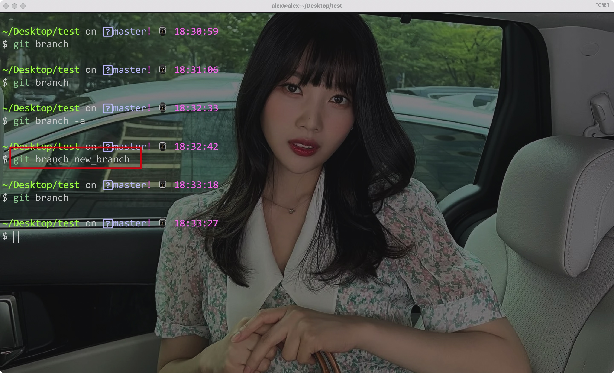
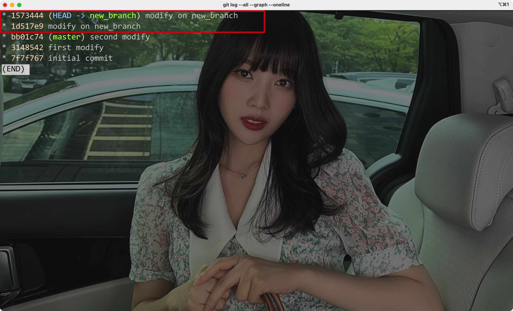
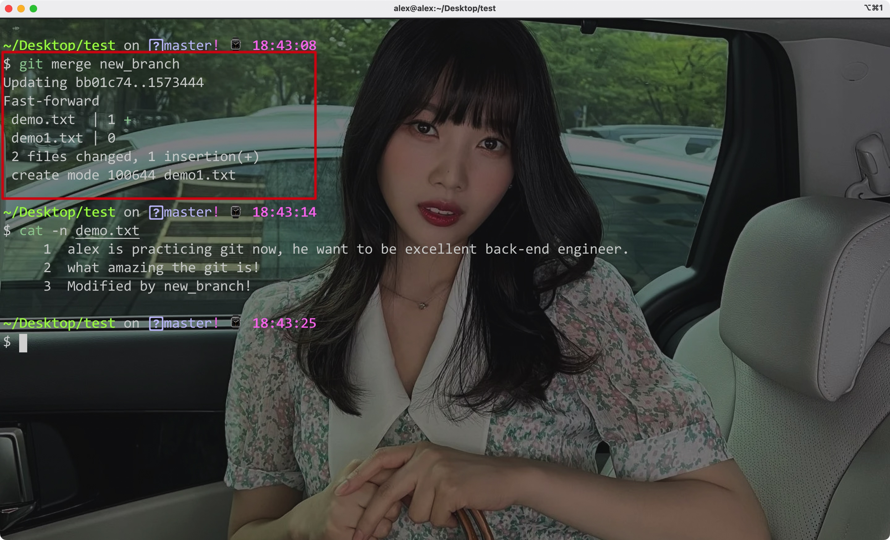
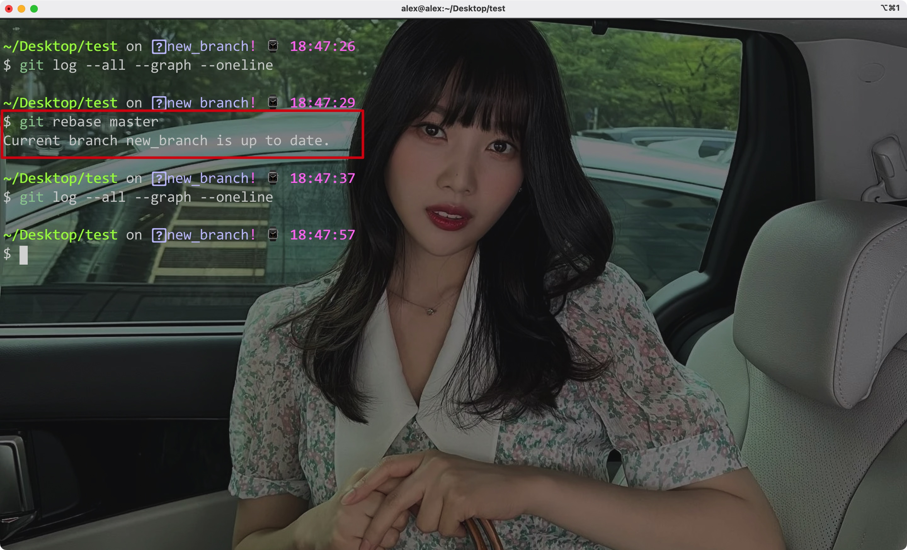

# 一、配置

安装完成后，需要设置对应的用户名和邮箱:

- `--globle`表示全局设置

```shell
git config --globle user.name "username"
git config --globle user.email "user email"
```


设置完成后，可以通过命令查询全局设置:

```shell
git config --globle -l
```


Eg:


<hr>


# 二、添加、提交和回滚

Git的仓库组成:


## 1. 初始化

首先需要将当前目录初始化为git目录:

```shell
git init
```


Eg:


通过status命令可以查看仓库的状态:

```shell
git status
```

Eg:


<hr>


## 2. 添加

新创建的文件不会被跟踪，需要手动添加到暂存区(stage)中才行:

```shell
git add directory
```

Eg:


最后只需要使用`commit -m`即可将暂存区中的文件提交到本地仓库(local repo):

```shell
git commit -m 'comment content'
```


Eg:


通过`log`命令可以查看提交的记录:

```shell
git log
```

Eg:


还可以添加`--oneline`选项使得提交记录只展示在一行中，通过`--all`选项还可以展示所有分支的提交情况:

```shell
git log --oneline --all
```

通过`--graph`选项还可以展示提交的逻辑关系

Eg:


如果修改了既存的文件，那么只需要使用`commit -a`即可提交所有修改的文件(新创建的文件还是需要先使用`add`添加到暂存区才行)

```shell
git commit -a -m 'comment content'
```


Eg:


<hr>


## 3. 忽略目录

通过在当前仓库下创建一个`.gitignore`文件，可以指定git的文件管理规则:

Eg:


- 在其中直接输入对应的文件名可以让git忽略对应的文件
- 通过`*.类型`可以匹配所有该类型的文件
- 通过`!`可以取反(即在排除对应类型文件的同时，又加入部分文件)
- 指定目录:`directory/`
- 指定目录中所有对应类型的文件: `directory/*.type`(不含子目录)
- 指定目录中对应类型的文件，包含子目录: 

```shell
directory/**/*.type
```

<hr>


## 4. 回滚

通过`show`命令可以查看指定id对应修改的详细信息:

```shell
git show id
```

- 如果没有指定id，则默认查看当前状态的修改

Eg:


通过`reset`命令并添加`--hard`参数即可回滚到对应提交id的版本

syntax:

```shell
git reset --hard commitId
```

Eg:


回滚的同时，git的log记录也清除了


如果想要撤销回滚操作(此时无法通过git log获取对应的提交id)，可以使用`git reflog`命令获取所有的版本对应的id(该记录一直保存):

```shell
git reflog
```


Eg:


此时再使用reset回滚即可:


<hr>


# 三、分支创建与合并


## 1. 创建与查看


查看当前分支:

```shell
git branch
```

Eg:


查看所有分支:

```shell
git branch -a
```


创建分支:

```shell
git branch branch_name
```

Eg:




<hr>


## 2. 切换与合并

切换分支:

```shell
git checkout branch_name
```


Eg:


合并分支:

```shell
git merge target_branch
```

- 会将目标分支合并到当前分支中

Eg:






<hr>


# 四、变基与优选


## 1. 变基

变基即改变某个分支的根结点，通过`rebase`命令可以重新指定当前分支的根结点为目标分支的根结点:

```shell
git rebase new_root_branch
```


Eg:



<hr>


## 2. 优选

之前的操作都是修改整个分支间的操作，如果只需要其中的一个结点呢?

优选操作可以只选择其中的一个结点作为下一个新位置:

```shell
git cherry-pick (id)
```


Eg:


