# 1.概念


JDBC: Java Database Connectivity

由使用java在jdk中具有的相关的接口，可以用来连接数据库，但**仅限于关系型数据库**(MySQL, Oracle, SQL server)，其余类似Redis, mongdb则不行

****


# 2.使用


## 1) 导入相应jar包

**注：这里以MySQL为例**


- 在Maven库中搜索"jdbc MySQL"，找到相应的jar包并下载

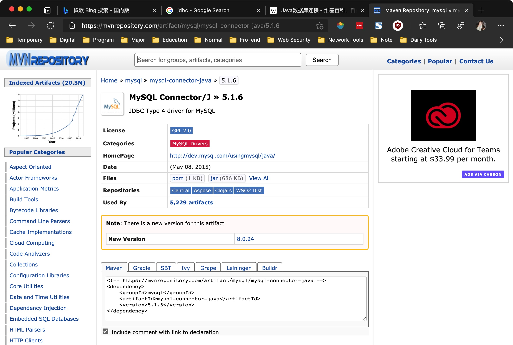


- 将jar包导入项目中，并以library的方式添加，步骤同Apache.Commons.IO

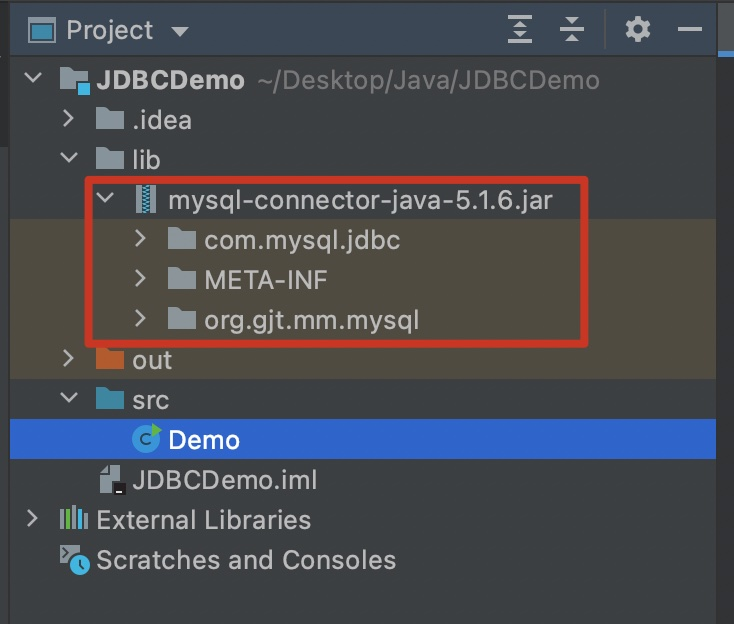


## 2) 基本结构

抽象类比: java这边就是原料厂，数据库就是产品公司。


- 加载驱动程序(产品公司打电话向原料厂要材料，并指明自己是MySQL公司)

```java
Class.forName("com.mysql.jdbc.Driver");
```


- 获取一个与数据库的连接(告诉原料厂该怎么走，走到哪？)

```java
Connection connection = DriverManger.getConnection(URL, USER, PASSWORD);
```

这里需要指定相关参数:(**最好定义为public static final 字段**)

URL: 数据库的位置，如果在本地则为: "jdbc:mysql://localhost:3306/database_name"(要在最后指定库名)

USER: 用户名，本地可为: "root"

PASSWORD: 用户名对应的密码


- 获取数据库操作对象(货送到了，需要找人卸货)

```java
Statement statement = connection.createStatement();
```


- 使用创建的对象进行操作(卸货中)

```
ResultSet resultSet = statement.execute_operator("SQL statement");
```

1. "operator"可以是增删改查中的任何操作
2. 执行结果会放回一个ResultSet集合
3. 如需要显示执行结果(如果是查询操作)，则需要使用ResultSet获取字段信息
4. 获取字段可使用"get_type()"方法，返回相应的字段值(**需要和表中的字段顺序相对应**)
5. "SQL statement"需要指定库中的表


- 输出(通过ResultSet对象获取字段信息)

```java
while (resultSet.next()) {
  type info1 = resultSet.get_type();
  ...
  System.out.println(info1 + " " + ...)
}
```


exam:

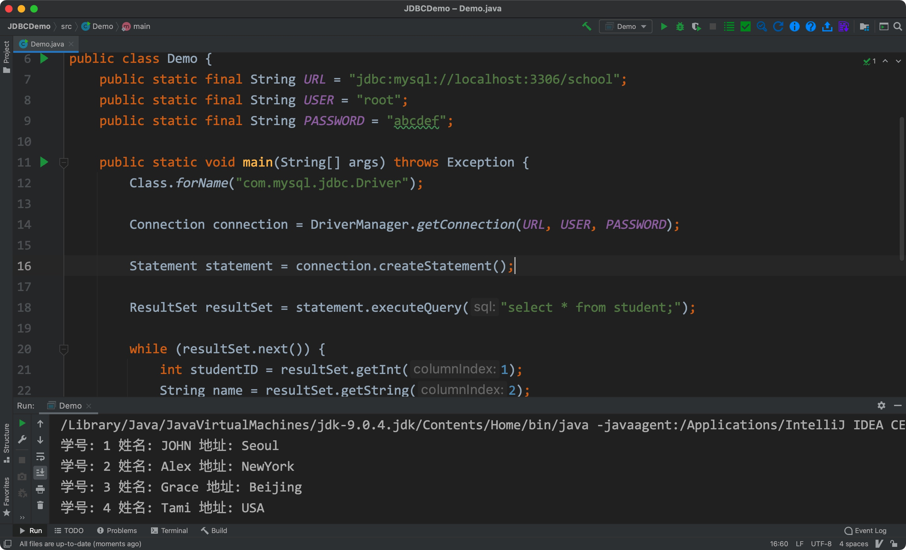


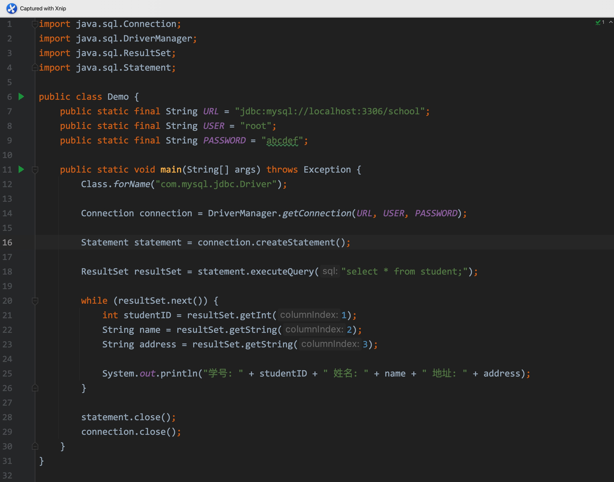

- 注意使用后需要关闭操作对象和连接(**按照栈的顺序**)

****


# 3.规范

- 在输出后，需要另写一个finally {}将所有的close()包裹起来
- 返回的ResultSet对象也需要关闭，可以使用try catch，**也可以直接抛出异常**
- URL, USER, PASSWORD, DRIVER(com.mysql.jdbc.drive)等字段要设置为static final
- connection, statement, resultSet等对象也需要**在main之外提前创建**


exam:

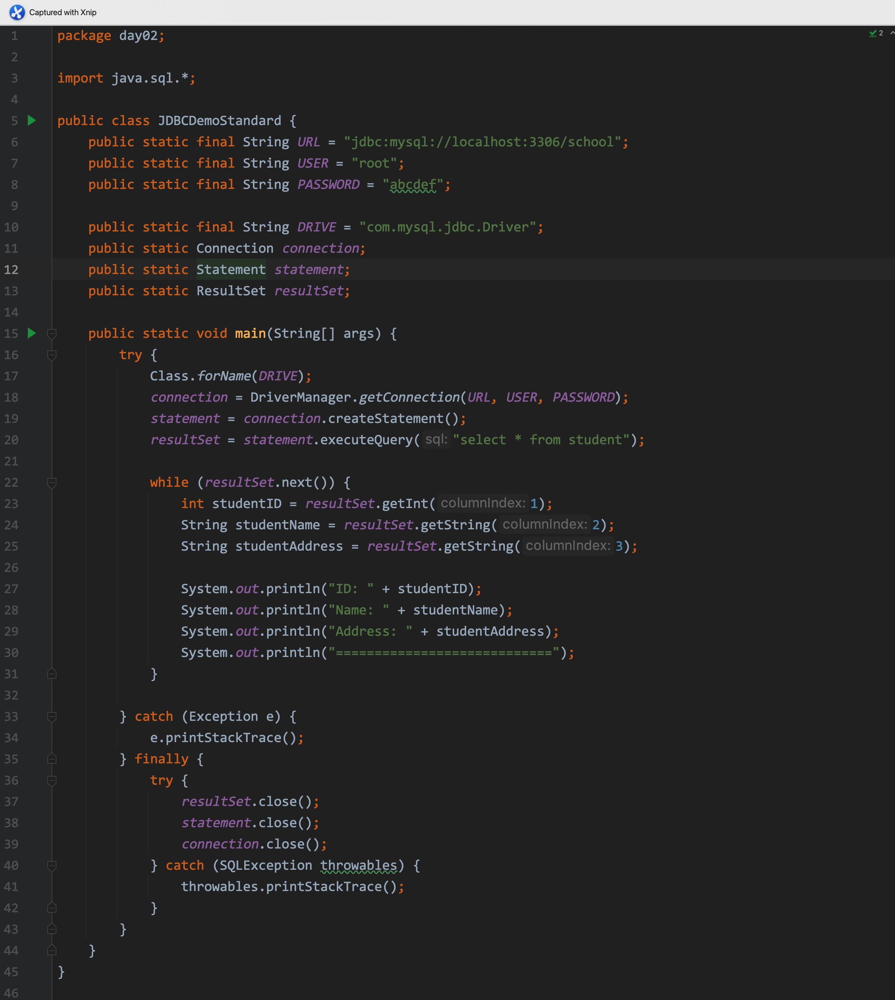


# 4.通用模式


**通过工具类的方式**

## 1. 阶段一

- 在"src"同级目录下创建一个名为"db.properties"的数据文件，将"driver", "user", "password", "url"字段预先写入

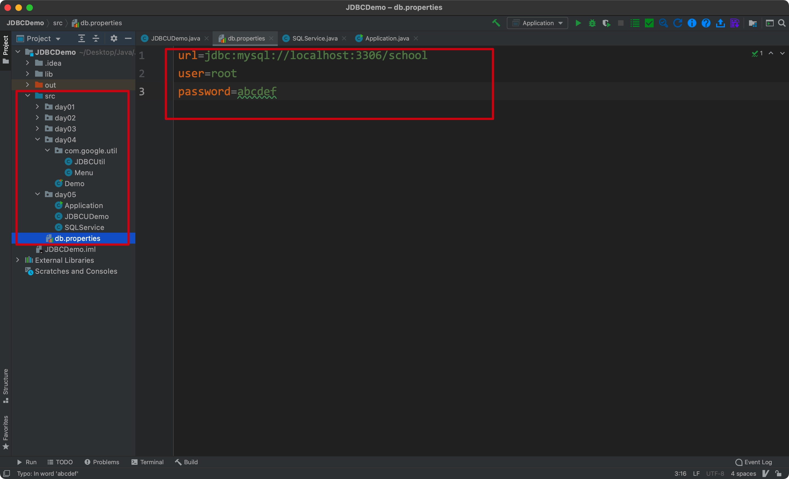


- 使用静态代码块读取并加载资源文件中的字段

新方法:

1. static InputStream getSystemResourceAsStream(String name): (属于java.lang包下)读取一个字符串对象，加载其相应的文件，并返回一个输入流对象
2. public synchronized void load(InputStream inStream) throws IOException: (属于java.util包下)接收一个输入流对象，以map键值对的形式加载其中的信息到调用对象中
3. public String getProperty(String key): (属于java.util包下)接收一个字符串作为"键"，返回对应的"值"


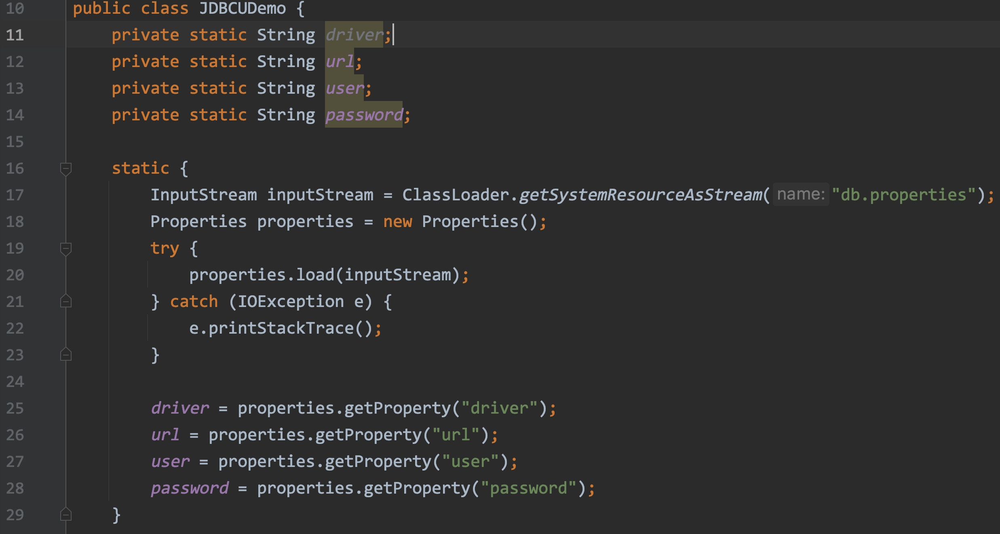


- 添加创建connection和statement对象的方法

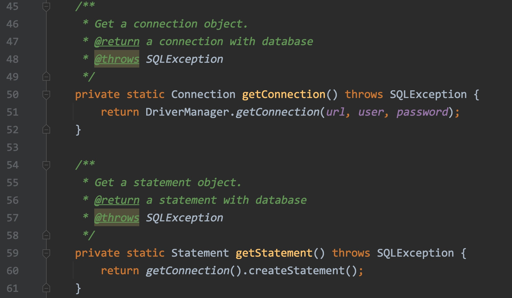


- 编写CRUD方法

  **注：**除了查询需要"executeQuery()"方法，其余都使用"executeUpdate()"方法


相关方法:

1. ResultSet executeQuery(String sql) throws SQLException :(ResultSet接口中的一个抽象方法)接收一个字符串作为SQL语句，将结果返回到一个ResultSet对象中
2. int executeUpdate(String sql) throws SQLException: (同上)同样将参数字符串作为SQL语句，结果为更新后影响的行数。


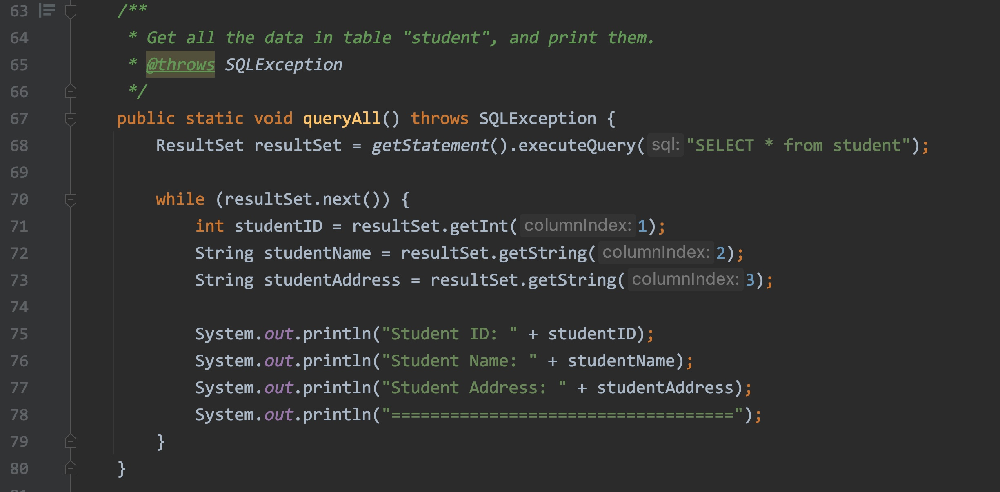

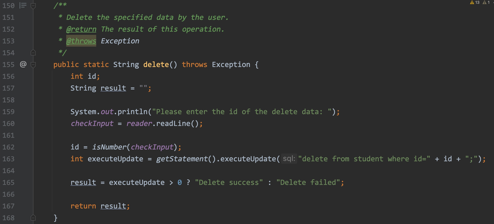


## 2. 阶段二

- 在阶段一的基础上，舍弃Statement对象，使用PreparedStatement对象
- 放弃原有拼接字符串的方式，在sql字符串对象中**将用户输入的数据用?代替**
- 修改后的好处: preparedStatement对象**可以预先加载SQL语句，防止SQL注入**；用"?"代替后，SQL语句字符串可以写得简洁


相关方法:

void setType(int parameterIndex, Type x) throws SQLException: (PreparedStatement接口下的一个方法，属于java.sql包下)**设置对应的?处的值，含有所有的基本数据类型**


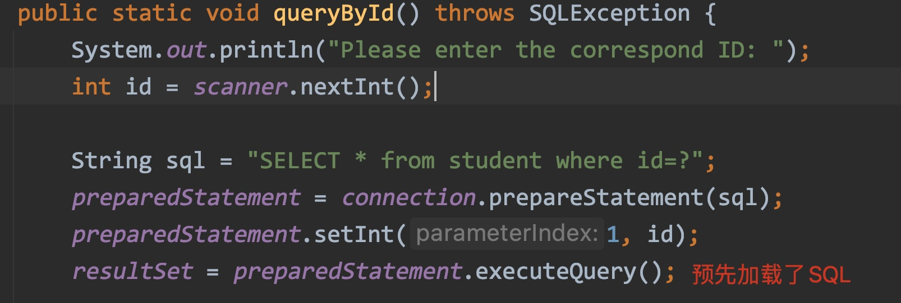


