# 1.编译的文件

- java编译后的文件为.class文件，不同于Windows上的.exe，其不能直接双击运行
- .class文件又叫字节码文件
- 编译后的.class文件需要借助jvm虚拟机运行，与系统无关


javac: 编译.java文件，并生成一个.class文件

```shell
javac Test.java
```


java: 运行一个.class文件，或者不创建.class的情况下运行.java文件(不能加上.class后缀)

```
java Test/Test.java
```


exam01:

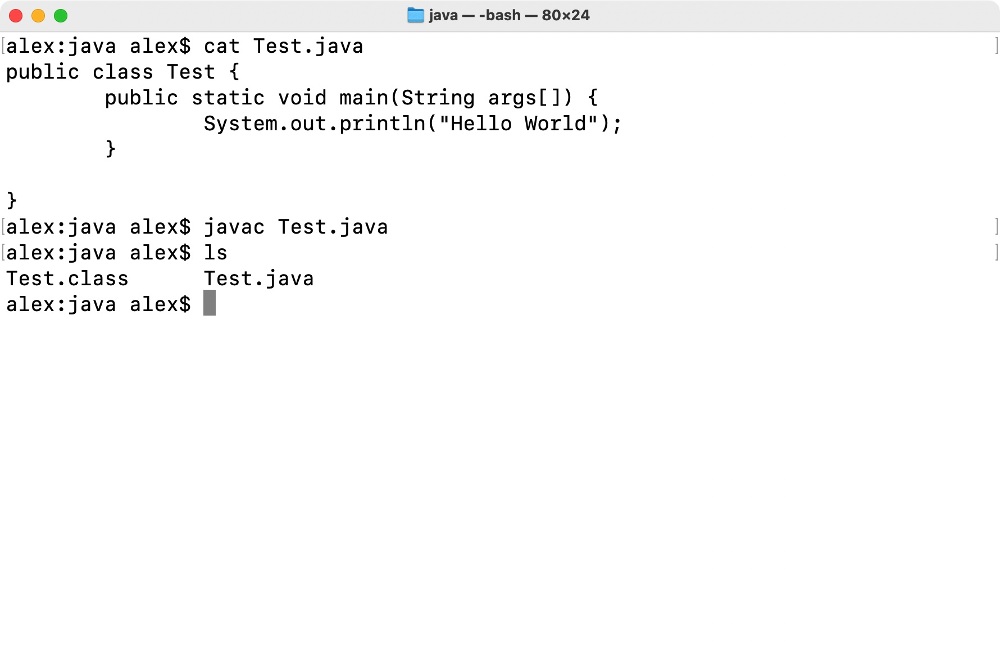

****


# 2.包的概念


- 在intellJ IDEA中，一个java文件开头会出现一个定位语句，其中含有包名
- 在java中，存放项目的文件夹被称作包
- 包名的格式: com.company.projectName
- 包名中的每一个点都分别划分了一个文件夹


exam:

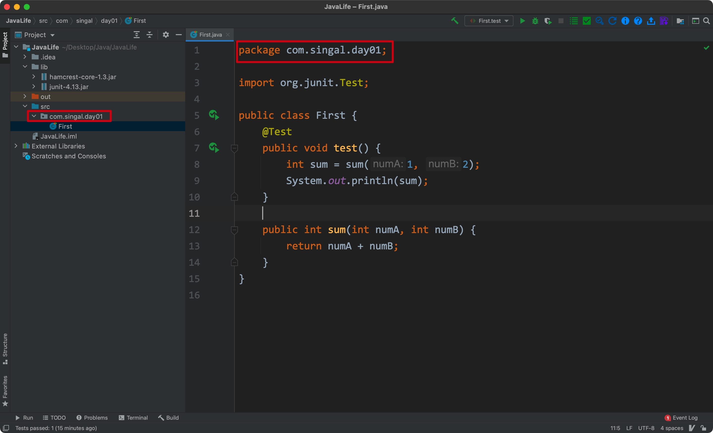

****


# 3.Hello World


源码:

```java
public class Test {
  public static void main(String args[]) {
    System.out.println("Hello World");
  }
}
```


运行:

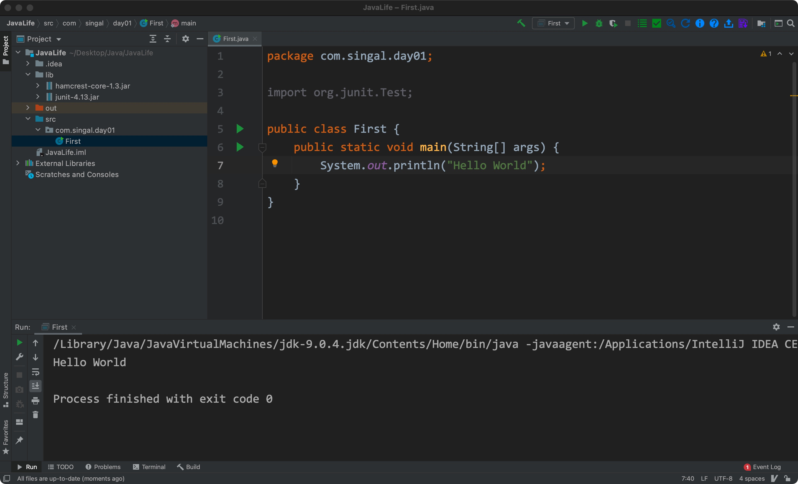

****


# 4.注释


- 行注释: 以//开头，注意"//"和注释内容之间有空格

```java
// comment content
```


- 段落注释: 

```java
/*
content

*/
```


- 类/方法注释:

```java
/**
 *
 *
 */
```

生成文档:

```shell
javadoc class_name
```


exam01:

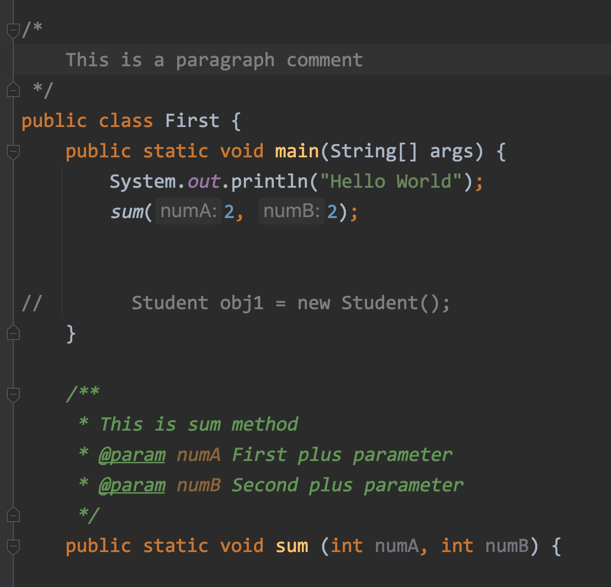


exam02:

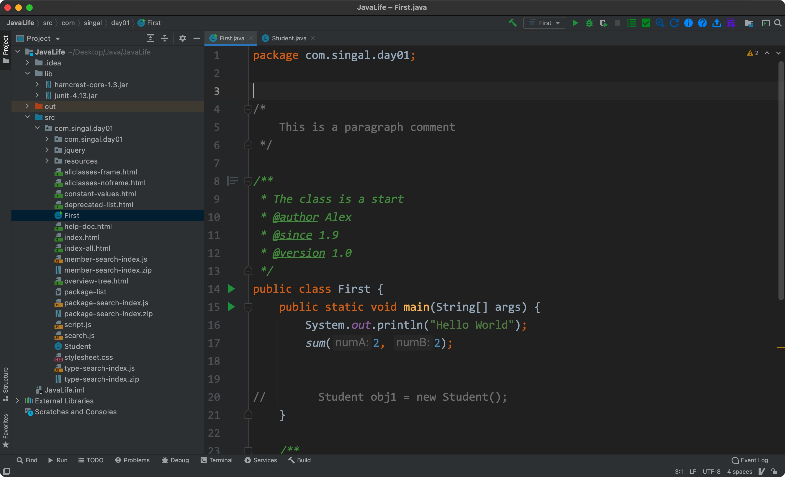


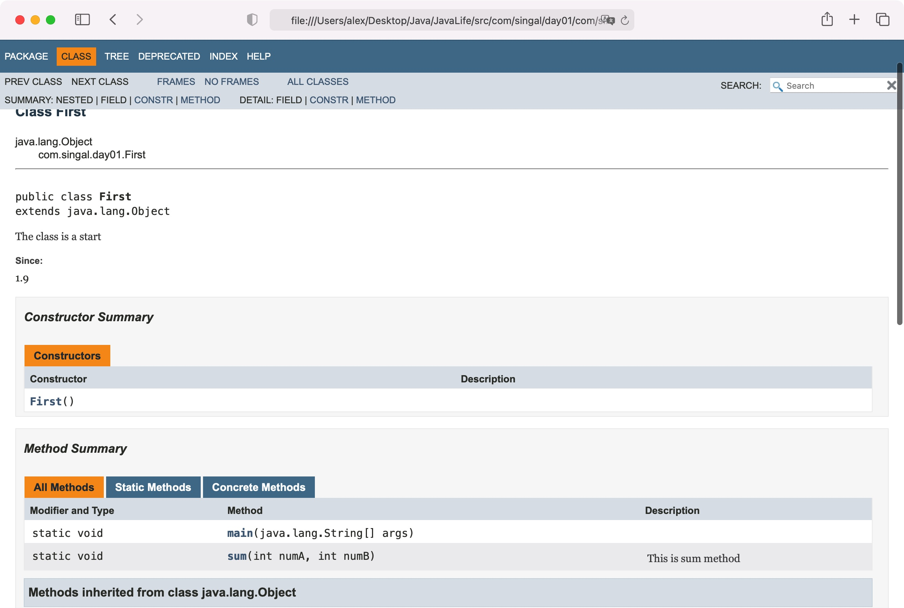

@author: 作者

@since: 引用的jdk版本

@version: 该程序的版本

****


# 5.String

属于java.lang下，用于创造字符串对象，并对字符串进行相关操作

- 其属于引用类型，本身只存储地址值
- 其底层是通过字符数组实现的


## 1) 创建格式

```java
String object_name = "content";
String object_name = new String();
```


## 2) 相关方法/字段


构造方法:

- String(byte[] byte): 接收一个字节数组，并将其转化为一个字符串对象
- String(char[] char): 接收一个字符数组，并将其转化为一个字符串对象
- String(StringBuilder builder): 接收一个StringBuilder对象，并将其转化为一个字符串对象
- String(StringBuffer buffer): 接收一个StringBuffer对象，并将其转化为一个字符串对象


exam:

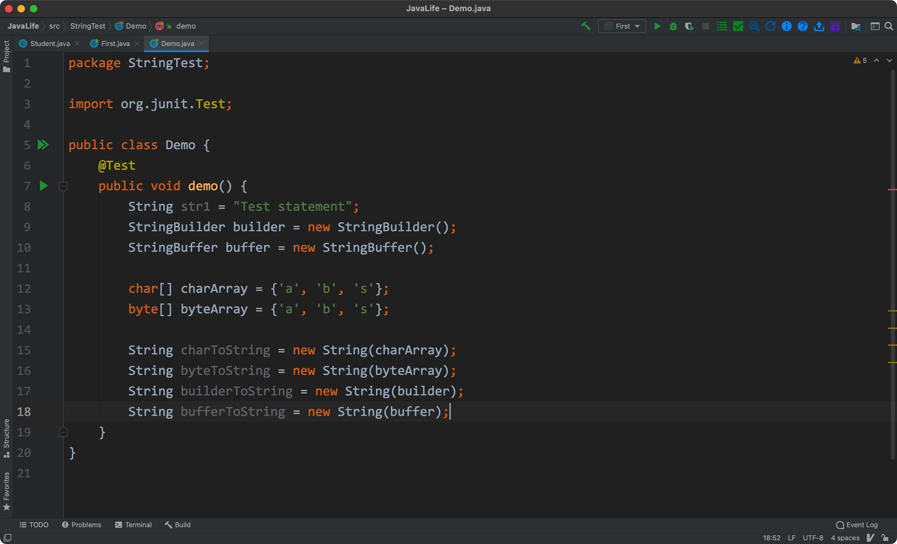


实例方法:

- char charAt(int index): 接收一个int类型的数值作为索引值，**返回该索引值对应的字符**      // 再次说明其底层为字符数组
- boolean equals(Object anObject): 接收一个对象，并与其对比，**结果以boolean值返回**
- byte[] getBytes(): 将该字符串对象转换为一个**byte类型的数组**
- char[] toCharArray(): 将字符串返回为一个char类型数组

- int indexOf(String str): 接收一个字符串，并将其作为查找目标；如果有匹配的字符串，则**返回第一次出现的索引值，否则返回-1**
- int indexOf(int ch): 接收一个int类型的数字，在字符串中**寻找该数字对应的字符**，**有则返回索引值，无则返回-1**
- boolean contain(CharSequence s): 接收一个CharSequence对象，将其作为查找目标，有则返回true，无则返回false                                             // CharSequence类是抽象类，String/StringBuilder/StringBuffer都是它的实现类
- boolean isEmpty(): **仅当字符串的长度为0时**，返回true
- int length(): 返回字符串的长度
- String replace(char oldChar, char newChar): 指定一个需要被替换的字符，并**更新为新的字符**
- String replace(CharSequence target, CharSequence replacement): **指定被替换的内容，更新为参数二**
- String substring(int beginIndex): 从指定的位置开始，**将剩余的字符**返回为一个新的子字符串
- String substring(int beginIndex, int endIndex): 同上，但**可以指定结束位置**


- String toLowerCase(): 将字符串的内容转化为全小写
- String toUpperCase(): 将字符串的内容转化为全大写


exam:

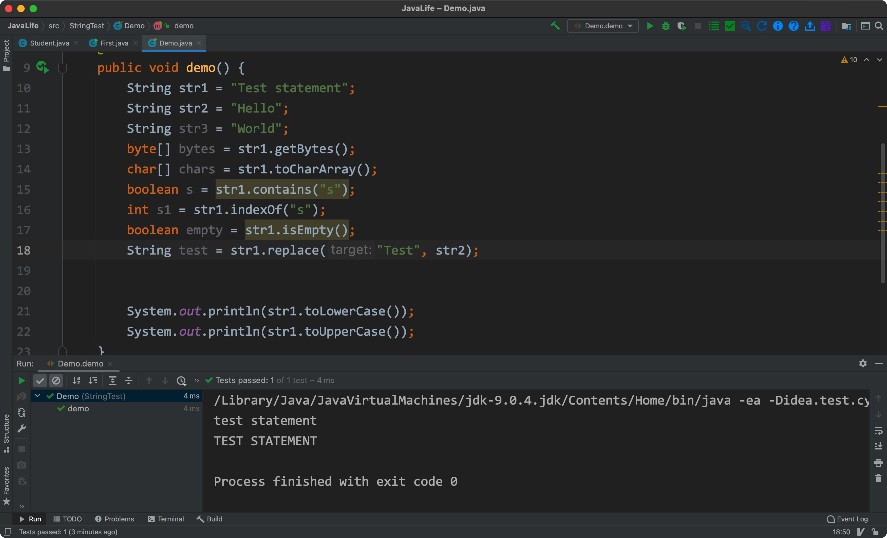


静态方法:

**静态方法不需要通过对象即可调用**


- static String valueOf(boolean b): 将参数转化为String

该方法含有多种重载形式，可接收char/char[]/double/float/int/long/Object类型的参数(无byte)


exam:

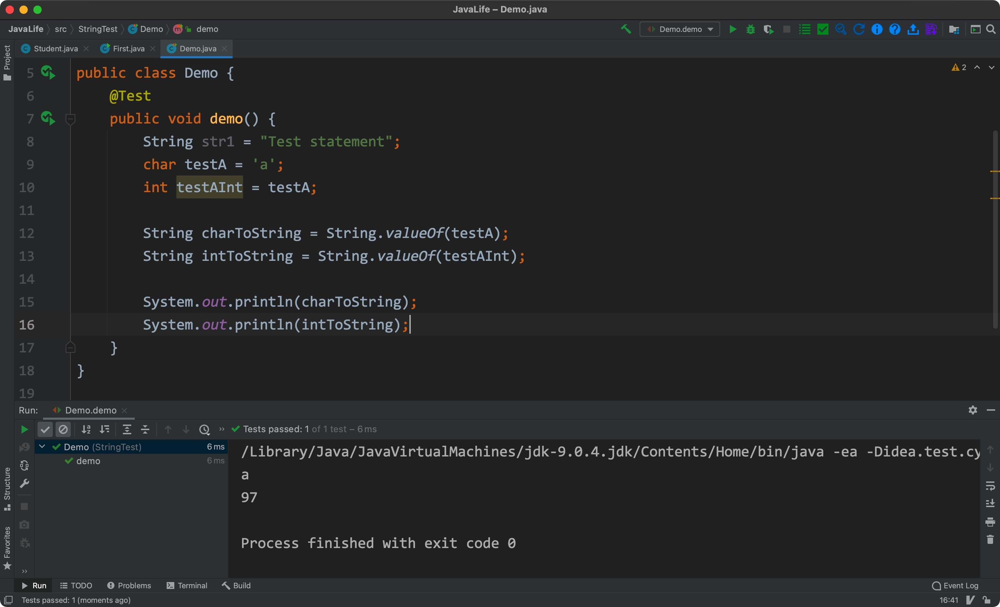


## 3) 字符串结束符

- 对于C语言的字符串来说，创建字符串后**总是在末尾有一个\0结束符号**

- java字符串没有\0结束符号


exam:

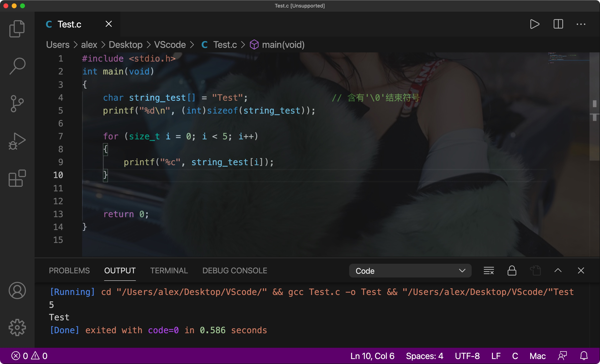

****


# 6.类型转换


自动类型转换:

byte,short,char—> int —> long—> float —> double


强制类型转换：

****


# 7.导包和API文档

- 如果想用的文件不在同一个包中，则需要导入
- API是jdk的使用说明，里面记录了jdk中各种方法/接口的用法和关系
- 属于java.jang下的所以类/方法，都不需要导入
- 部分情况下，可能需要导入外部的包使用，这些包可能是由企业/个人编写的


不同包需要导入：

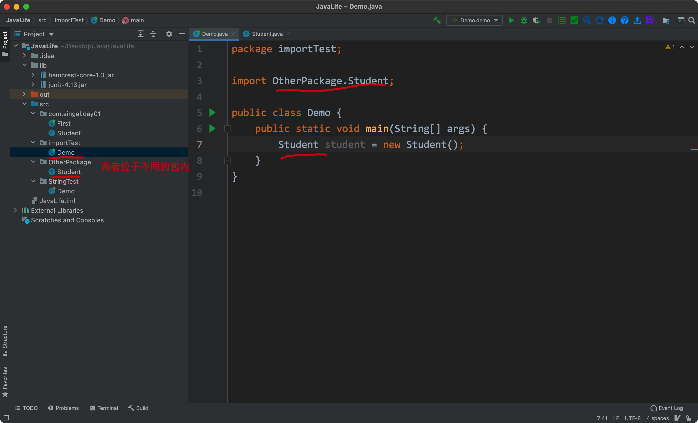


非java.lang的类/方法 需要导入:

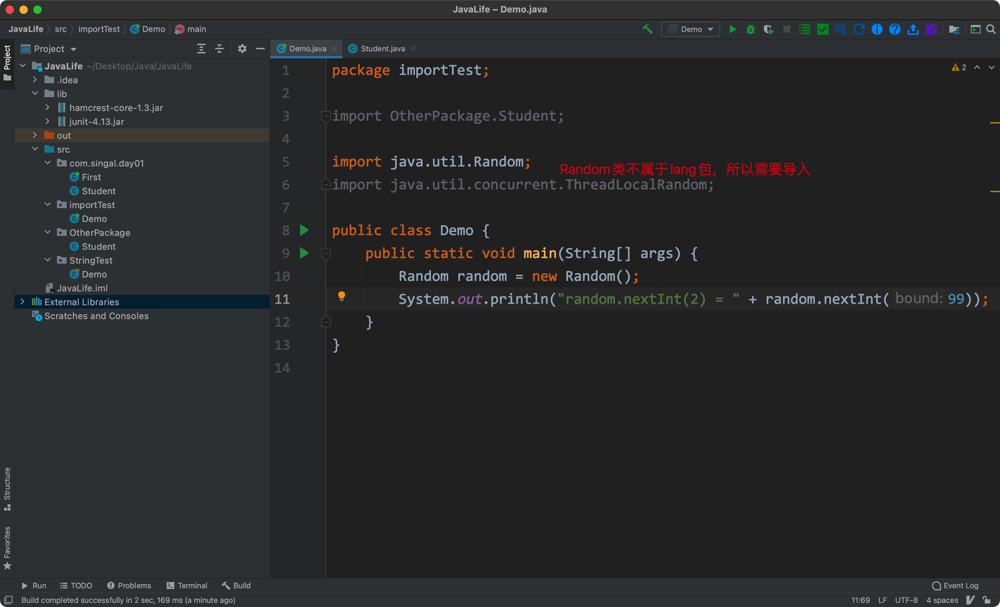

****


# 8.数组


java中的数组声明风格:

```java
type[] arr = {};
```


"[]"可以和C/C++一样写在变量后，但不推荐(其仅仅是为了让C++开发者快速上手)


创建方式:

- 初始化

```java
type[] arr = {element1, ...};
```


- 分配空间

```java
type[] arr = new type[arrLength]
```


java中的特有:


- 快速获取数组长度

```java
int arrLength = array.length
```

注：length是一个变量，而字符串中的length()是一个方法


- 增强for循环

```java
for (type ele : array) {
  System.out.println(ele);
}
```

可以遍历打印数组中的所有元素

****


# 9.Arrays

属于jang.lang下，提供了各种静态方法，用于处理数组


常用方法:


- void sort(type array_name): 可以**按照升序**直接排好各种类型的数组
- type[] copyOf(type[] originArray, int length): 将原数组中**指定长度的元素**复制为**一个新数组并返回**
- void fill(type[] array_name, type value): 将参数二与数组中的**每个元素相加**
- int binarySearch(type array_name, int key): 在数组中通过二分搜索法**寻找需要的"key"**，如果有则返回该元素在数组中的位置，没有则会返回其他结果:

1.不是数组元素但在数组范围内，则**从1开始**，返回"-insert index"

2.大于数组中所有元素，返回"- (length + 1)"

3.小于数组中所有元素，返回"- 1"


**注意：**使用二分查找binarySearch之前，**一定要对数组进行排序**


exam01:

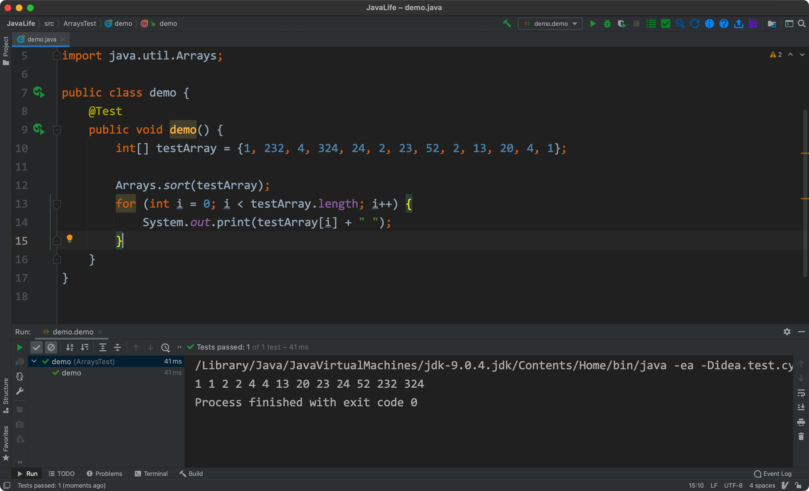


exam02:

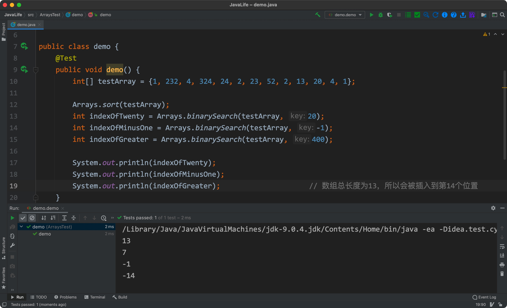


exam:

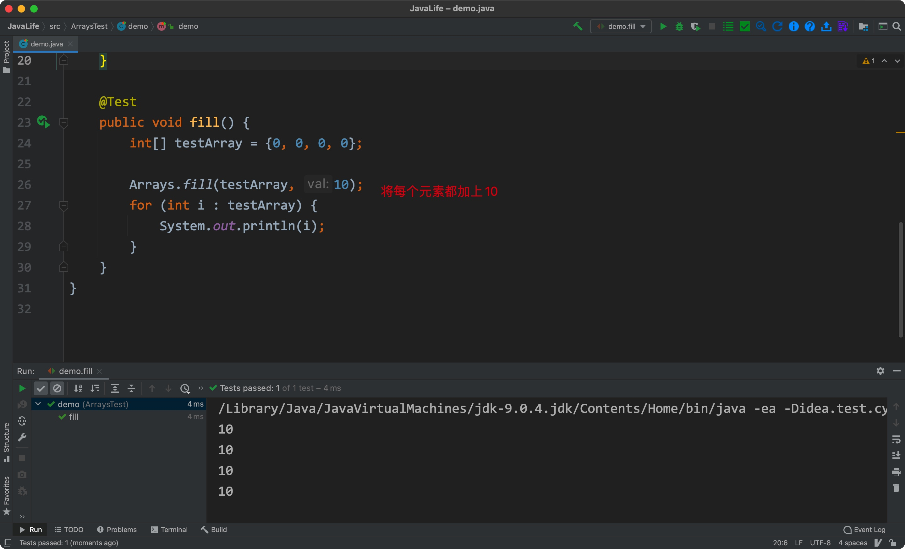

****


# 10.Function?


在java里，所谓的"函数"都称为方法(method)

****


# 11.Overload


重载: 对于功能相同，但参数和返回值不同的方法，可以通过重载的形式编写(方法名相同，参数和返回值类型不同)


exam:

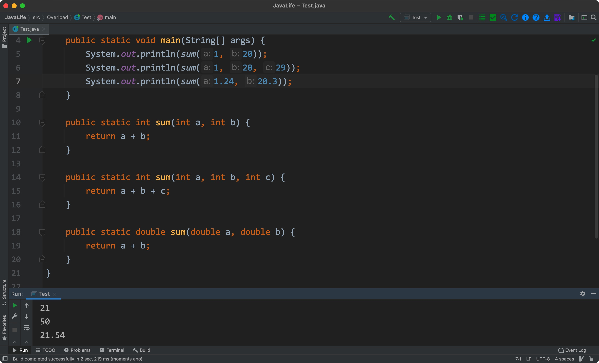

****


# 12.代码规范


## 1) 命名规范

- 命名不能以"_"和"$"开头
- 命名不能中英文混用，不得使用拼音
- 类名使用大驼峰命名方式(每个单词的首字母大写)
- 方法名，参数，变量均使用小驼峰命名方式(第一个单词小写，之后所有单词都要大写开头)
- 常量名要全大写，单词之间用"_"隔开
- 抽象类的名称要以Abstract/Base开头；异常类要以Exception结尾；测试类要以测试的对象类开始，以Test结尾
- 包名统一小写，且不能用复数；每个"."之间**只能有一个自然语义单词**
- 缩写应该避免误解，缩写后不得产生歧义


## 2) 代码格式

- 一个Tab必须为四个空格
- 单行注释和注释内容之间有且仅有一个空格
- 强制类型转换的右空格和转换值之间不能有空格
- 单行字符数不超过120个
- 文件编码格式必须为UTF-8，换行符必须为Unix格式


## 3) 控制语句

- 在switch中，要么每个case都用continue/break/return终止，要么就注释说明**执行到哪个case为止**，必须在最后包含一个default语句，就算它没有内容
- 使用if/else/for/while/do语句时，必须使用大括号，就算只有一行
- 避免使用反逻辑运算符"!"


## 4) 注释规范

- 类/类属性/类方法必须使用文档注释(/**)
- 所有的类必须添加创建者和创建日期
- **方法内部**使用行注释，注释写在被注释语句的上方(不得写在右边)
- 特殊标记注释:

1.TODO(标记人，标记时间，预计处理时间)

2.FIXME(标记人，标记时间，预计处理时间)

****


# 13.OOP

OOP: Object Oriented Programming

POP: Procedure Oriented Programming


- 明确目标(需要做什么)
- 不关心过程(不关心实现的途径和方式)
- 大众化(大家都能用，不需要单独设计)


