# 1.Scanner

属于java.long.util下，**用于接收输入**


## 1) 字符串输入


### 1. next()

- 获取输入的字符
- 遇到空格即停止


exam:

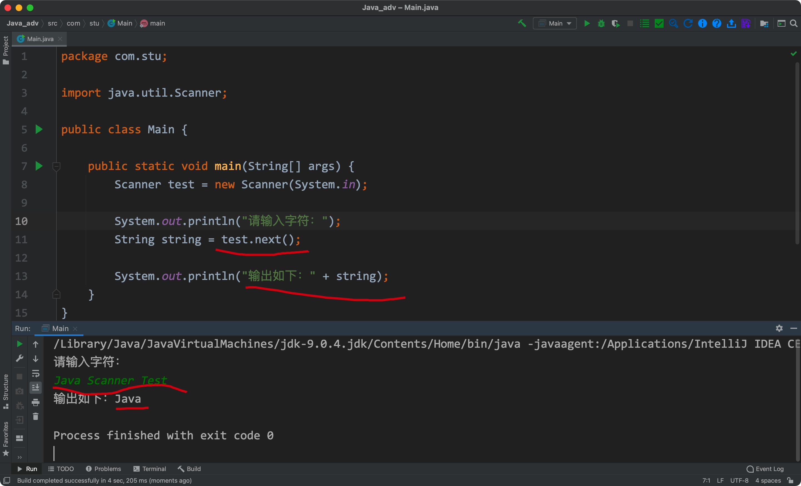


### 2. nextLine()

- 获取输入的字符串
- 可以读取一行


exam:

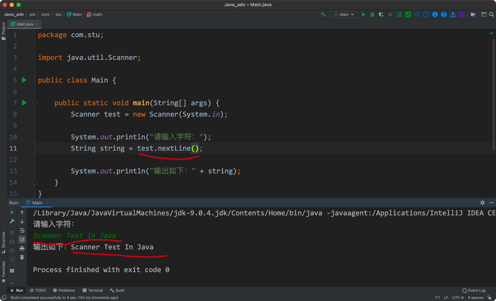


## 2) 数值和其他


- nextInt(): 输入int类型整数
- nextLong(): 输入long类型整数
- nextFloat(): 输入float类型浮点数
- nextDouble: 输入double双精度浮点数

**boolean, byte, short, BigDecimal, BigInteger以此类推**


带参数的使用：

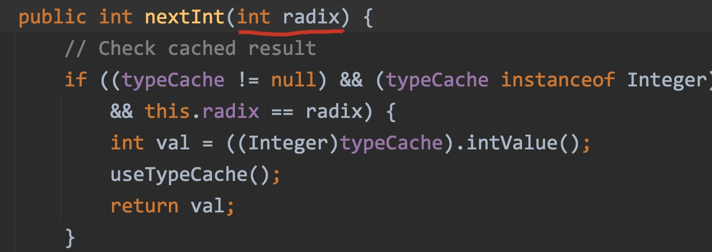

- 其中的"radix"代表进制


exam:

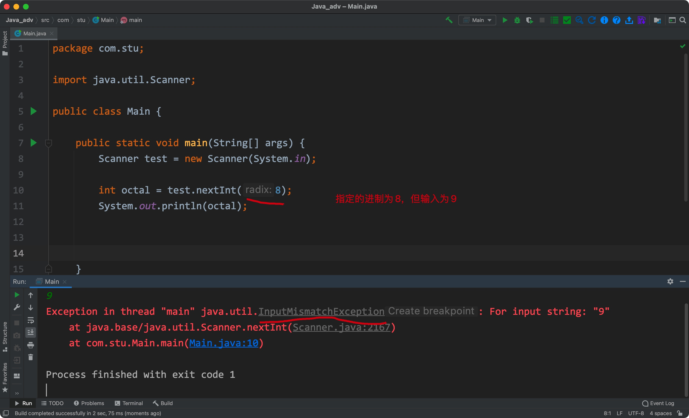


## 3) 构造方法

- Scanner(File source): 接收一个File类型的对象，并从该文件中进行读取
- Scanner(File source, String charsetName): 同上，但可以指定读取的字符编码
- Scanner(InputStream source): 接收一个InputStream的子类对象(**接收字节流**)

**注意：**在Junit框架下，Scanner读取有bug，只能在main方法中运行


exam1:

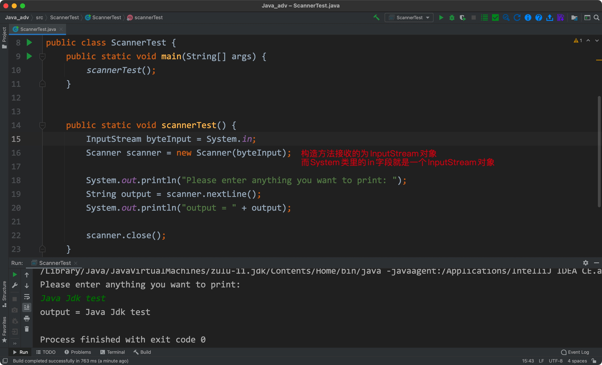


exam2:

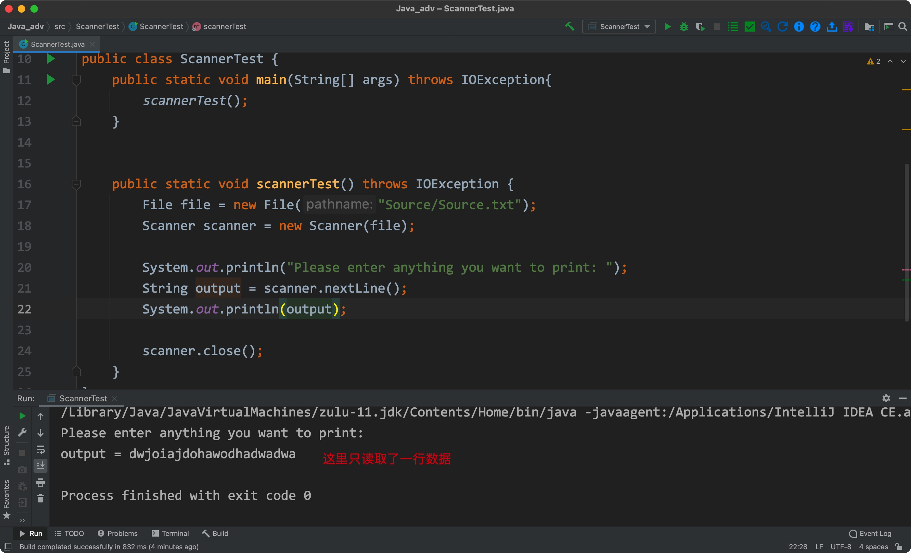

****


# 2.Number

属于java.long下，作为一个包装类，**将数值以对象的形式进行存储**


- Number是一个抽象类，其实现类中对应了各种基本数值类型
- 使用Number的各种实现类时，本质是创建了一个对象，但使用时和基本数据类型无异


exam:

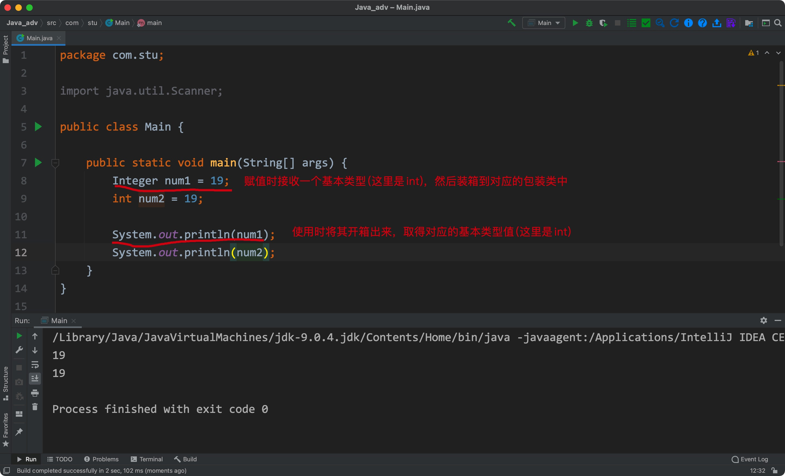

- 赋值时将其基本类型包装为对应的包装类
- 使用时将其拆箱

****


# 3.Math

属于java.long下，**提供各种数学工具**


- Math类属于工具类，其中的方法都属于static，可以直接通过类名称进行调用，而不需要创建对象


## 1) 比较方法


### 1. max()和min


比较两个数值之间的大小，并返回最大值/最小值


exam:

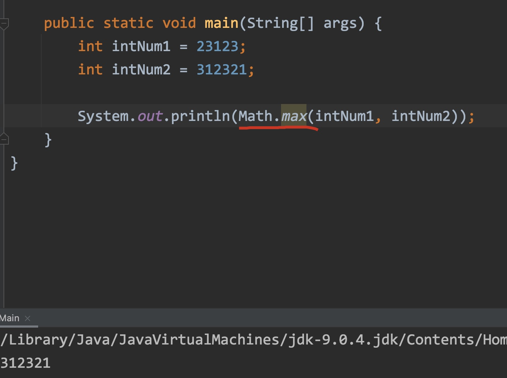

**注意：max/min比较两个数值时，这两个数值必须为同一种类型**


## 2) 取整和绝对值方法


### 1. 取整


- round(): 对参数进行"四舍五入"运算，并**返回int/long类型数据(对应参数为float和double)**
- ceil(): 对参数进行向上取整运算，返回类型为**double**
- floor(): 对参数进行向下取整运算，返回类型为**double**


exam:

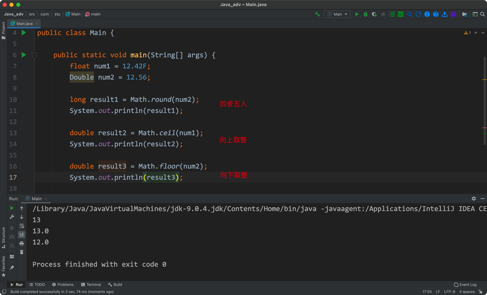


### 2. 取绝对值


- abs(absolute)，返回参数的绝对值(返回值类型因参数而异)


exam:

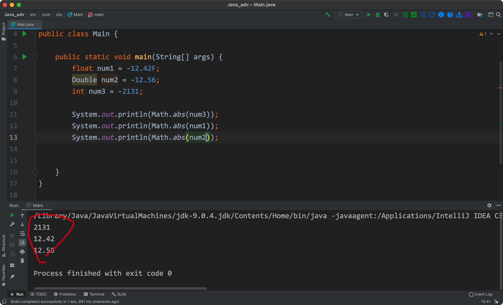


### 3. 其他方法


- pow(para1, para2): 返回参数1的"para2"次方
- sqrt(): 返回参数的平方根(square root)
- random(): 返回一个(0~1)的随机数，范围左闭右开(其调用了Random类)
- xxxvalue(): 返回一个包装类中的原始基本数据值(可以直接使用包装类对象进行调用)
- 。。。。。。


value:

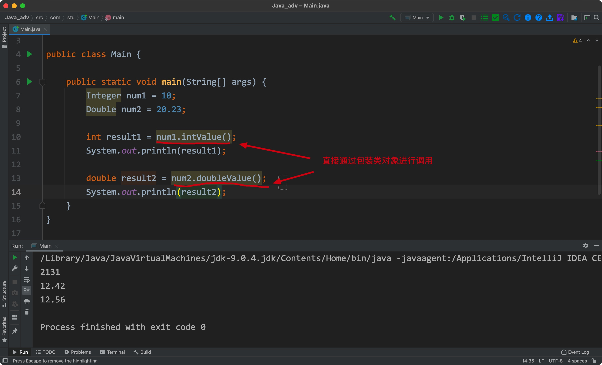

****


# 4.Random

属于java.long.util下

用于**生成随机数**


## 1) 格式用法


```java
Random randomNum = new Random();

randomNum.method();
```


## 2) 相关方法


- nextInt(): 生成一个int类型的整数，范围在int数据范围内
- nextInt(int bound): 生成一个int类型的整数，**范围在0~bound之间**
- nextDouble(): 生成一个double类型的浮点数，**范围在0~1之间**           // (在Random类中，没有指定nextDouble返回值范围的重载方法)

**注意**：想要生成指定范围的随机的double数值，需要使用Random的子类: ThreadLocalRandom

- nextLong(): 生成一个long类型的整数，范围在long类型数据范围之内

其余类型同理


exam:

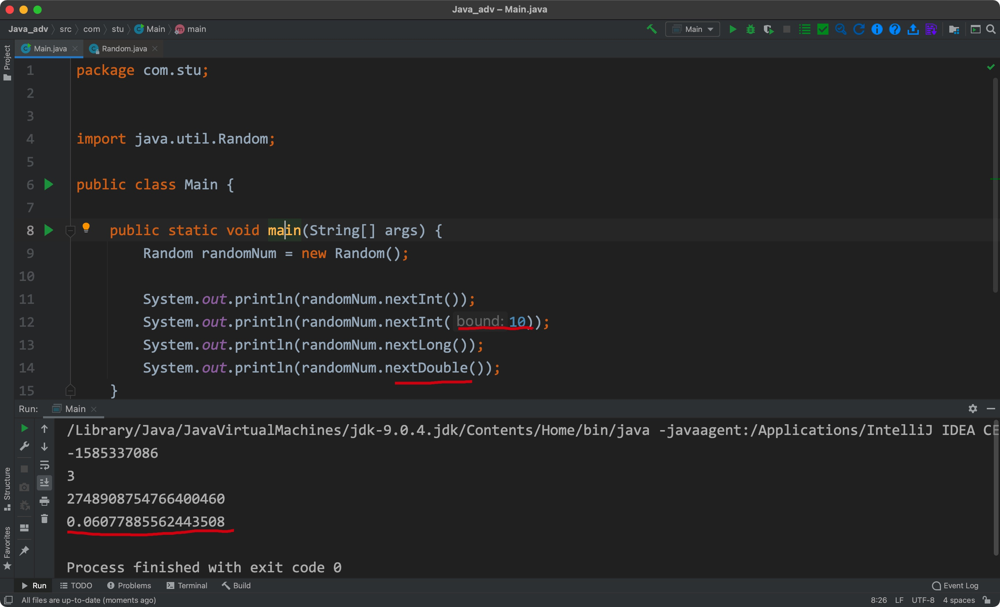


## 3) 构造方法特殊说明


- 默认的构造方法: 没有参数，使用本机的时间戳生成随机数

```java
Random()
```


- 带有参数的构造方法: 带有参数，使用指定的种子生产随机数

```java
Random(long seed)
```

****


# 5.ThreadLocalRandom

属于java.util.concurrent.ThreadLocalRandom下，用来**弥补Random类的不足**，生成**可控范围内的**随机数


## 1) 格式用法


使用方法: 

```java
double receiver = ThreadLocalRandom.current().nextDouble();
```

- "ThreadLocalRandom()"构造方法为private，**不能直接调用**
- 该类中的"current()"方法可以**返回一个ThreadLocalRandom对象**，可以**用来调用方法**
- 使用时无需创建对象


## 2) 相关方法


- 同Random大致相同，但可以指定范围：

1. nextInt(int origin, int bound): 生成并返回一个介于"origin~bound"之间的int数值
2. nextDouble(int origin, int bound): 生成并返回一个介于"origin~bound"之间的double数值


exam:

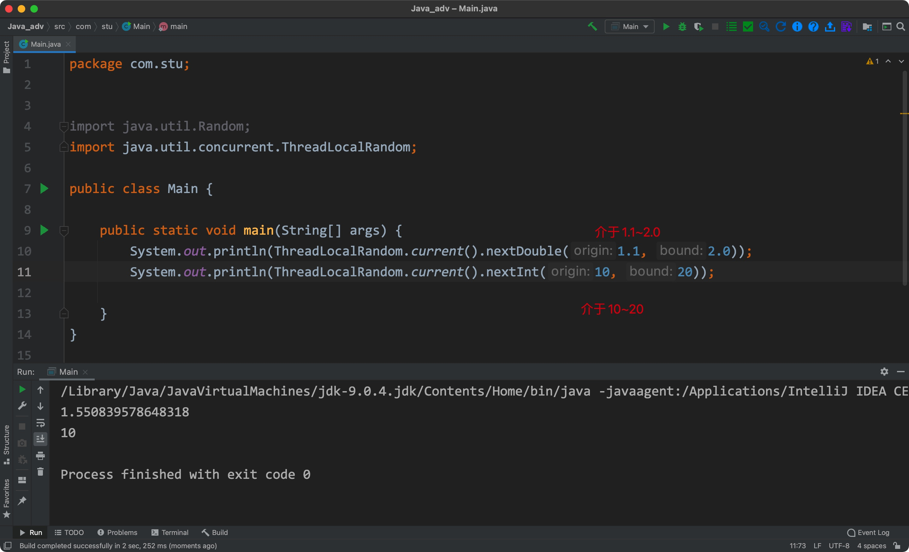

****


# 6.Date

属于java.util下，**用于设置和输出时间**


## 1) 格式用法

```java
System.out.println(new Date());

Date date = new Date();
```

使用构造方法或输出一个date对象时，会调用其中的toString方法(会打印输出当前的时间)


## 2) 相关方法

- Date(): 创建一个Date对象                            // 如果打印输出Date对象，则会调用其toString方法(打印输出当前的时间)


- Date(long date): 以输入的时间戳生成的时间(long类型)，创建一个Date对象          // **使用时需要乘以1000**，因为其表示方法为毫秒

- after(Date when): 比较与参数时间的先后关系，在后则返回true，在前则返回false
- before(Date when): 比较与参数时间的先后关系，在后则返回false，在前则返回true
- compareTo(Date anotherDate): 比较两个时间的先后关系，相等则返回0，比参数大则返回1，比参数小则返回-1


exam:

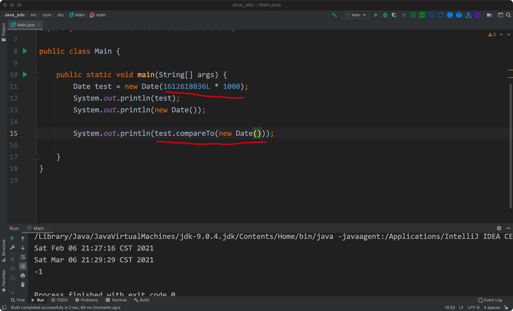


- getTime(): 获取Date对象的时间戳，返回一个long值
- setTime(): 设置Date对象的时间戳


exam:

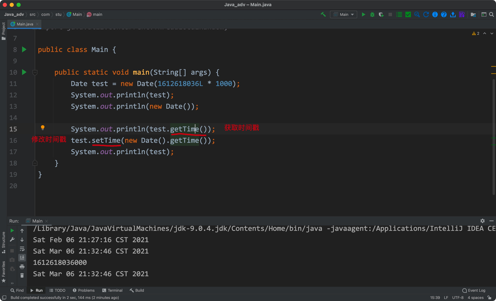

****


# 7.DateFormat

属于java.text下，用于**指定Date对象的格式**


## 1) 格式用法

- DateFormat为一个抽象类，不能直接使用
- 可以**通过其子类"SimpleDateFormat"进行调用**(多态)


```java
DateFormat format = new SimpleDateFormat();
```


## 2) 相关方法

- SimpleDateFormat(): 构造一个对象，**并设置为默认时间格式**
- SimpleDateFormat(String pattern): 以指定格式构造一个对象
- format(Date date, StringBuilder toAppendTo, FieldPosition pos): 接受一个Date对象，**以其存储的格式输出时间**，返回一个StringBuffer对象
- parse(String text, ParsePosition pos): 接受一个字符串，并**以其格式返回给一个Date对象**           // 重写了DateFormat的抽象方法


exam1:

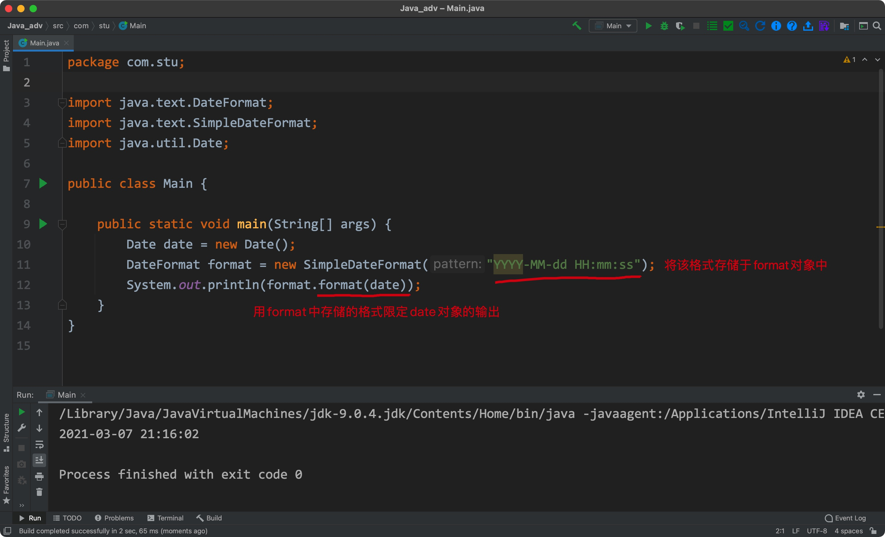


exam2:

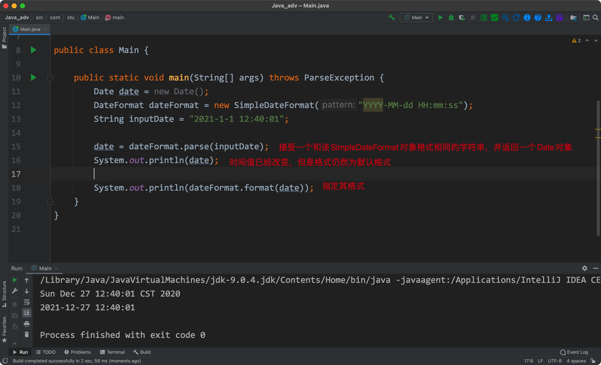

**注意：**"parse"方法本身还有第二个参数，这里并未使用，所以需要使用"throw"抛出异常

****


# 8.Calendar

属于java.util下，用于输出/设置日期


## 1) 格式用法

- Calendar是一个抽象类，不能直接使用"new"创建对象
- 可以使用"getInstance()"方法直接创建日期


exam:

```java
Calendar object = Calendar.getInstance();
```


## 2) 相关方法/变量


方法：

- get(int field): **接收给定的calendar字段**(年，月，日等等)，并返回一个对应的int值
- add(int field, int amount): 接收给定的calendar字段和一个加数，**将给定的calendar字段加上接收的加数**，并返回结果
- set(int year, int month, int date ....): 接收相应的时间值，**并设置给该calendar对象**，返回类型为void
- setTime(Date date): **接收一个Date对象**，**将其日期值存储到Calendar对象中**，返回值为void     **(用于将Date转换到Calendar)**
- getTime(): **获取Calendar对象的时间，并返回一个Date对象**                          **(用于Calendar转换到Date)**

常用：setTime()和getTime()         // 用于转换


成员变量/字段：(注意：Calendar中**大部分字段都为static，调用时要用类名称**)

- DATE: 一个月中的一天
- DAY_OF_MONTH: 一个月中的天数
- DAY_OF_WEEK: 一周中的天数                         // **西方从周日开始算起**
- DAY_OF_YEAR: 一年中的天数
- MONTH: 一年中的月份                                     // 西方从0开始算起
- YEAR: 年份
- HOUR: 小时。Field number for `get` and `set` indicating the hour of the morning or afternoon.
- HOUR_OF_DAY: 一天中的小时数
- MINUTE: 一小时中的分钟数
- SECOND: 一分钟内的秒数


exam1:

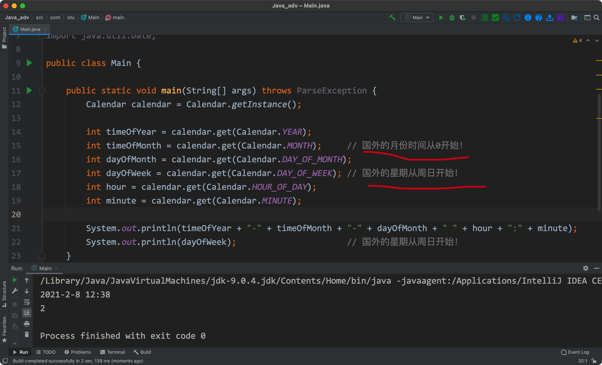


exam2:

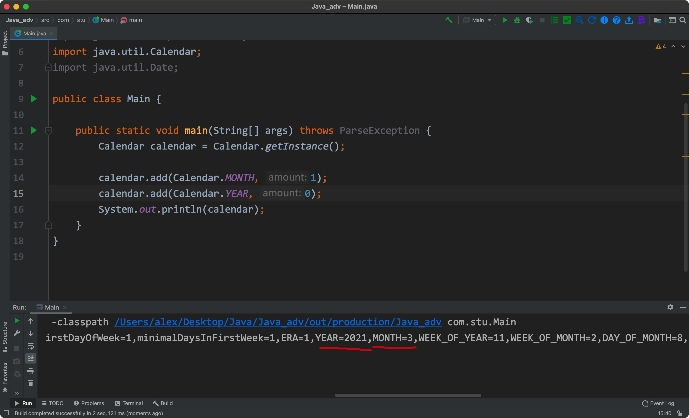

**注意**：这里输出对象时，调用了其toString方法


exam3:

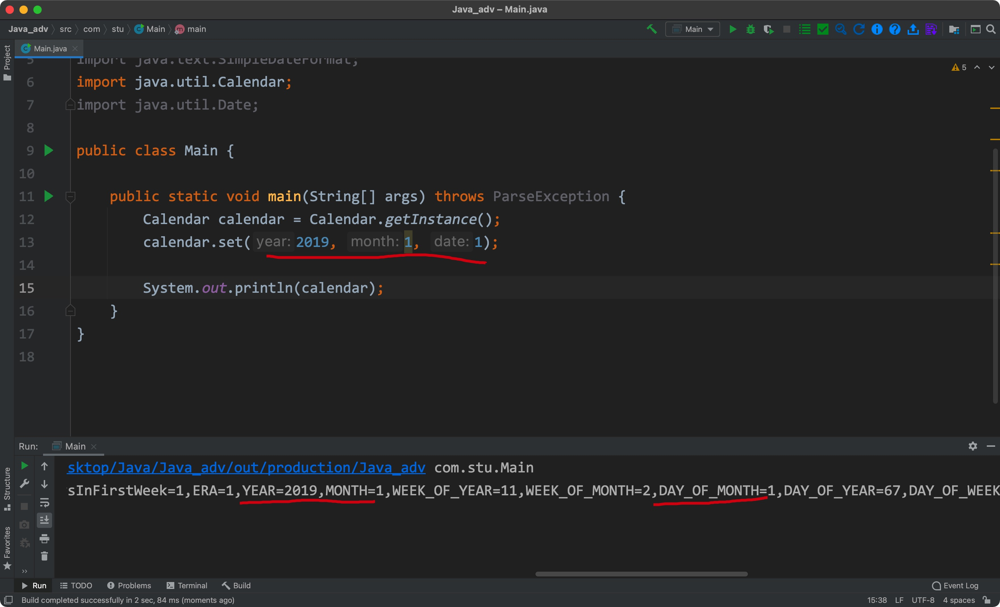


exam4:

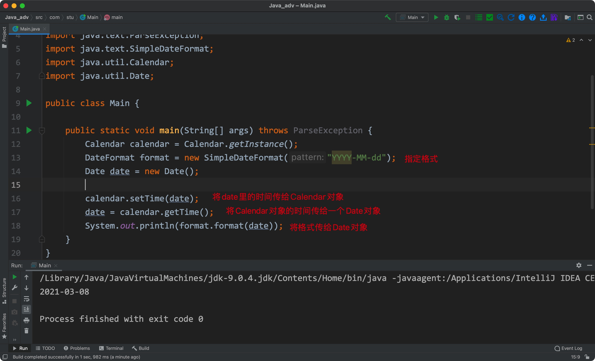


# 9.时间使用小结

- 通过Calendar类**指定时间**，或者直接将时间戳传入Date()中
- 通过DateFormat和其子类SimpleDateFormat**指定Date对象的格式**
- 最后输出Date对象即可
- 直接输出Calendar对象的结果并不直观


exam:

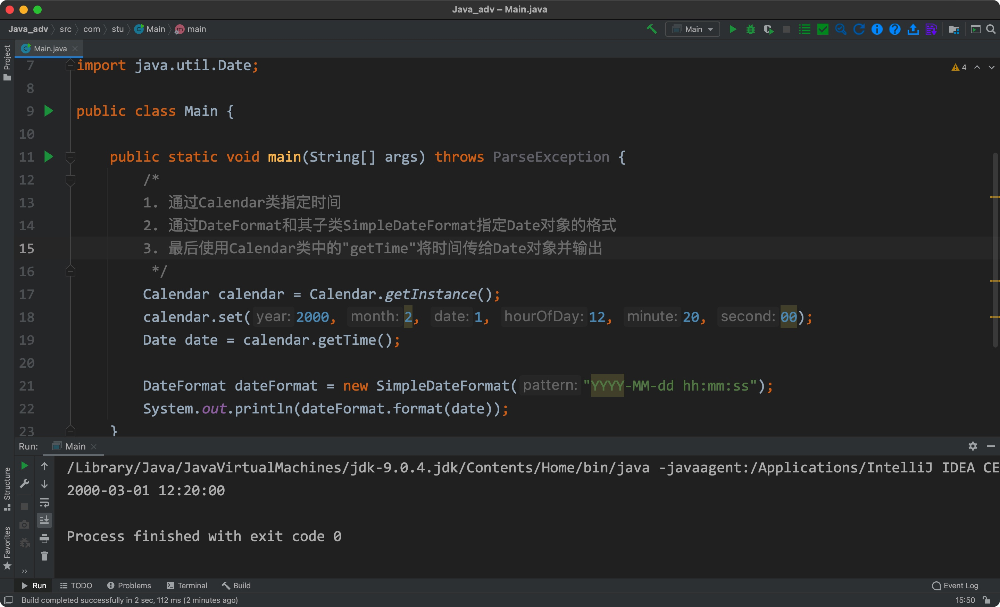

****


# 10.System

属于java.lang下，其为一个工具类，方法都为静态，可直接使用


## 1) 格式用法


```java
System.method()/field
```


## 2) 相关方法/字段/变量


静态方法

- currentTimeMillis(): **以毫秒为单位**输出当前的系统时间           		// 多用于**计算运行时间**


静态字段

- (Static InputStream) in: 一个标准的字节输入流对象
- (Static PrintStream) out:


exam:

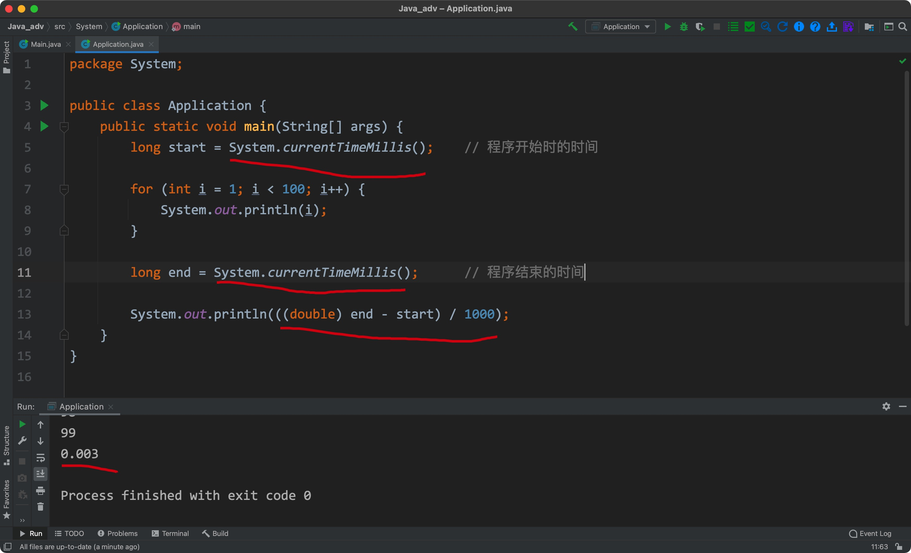


- arraycopy(Object src, int scrPos, Object dest, int destPos, int length): 复制一个数组的**指定数值**到另一个数组的**指定位置**上

**arraycopy详解**：

src: 被复制的数组(源数组)

srcPos: 被复制数组的开始位置

dest: 复制的目标数组

destPos: 复制的目标数组的起始位置

length: 复制的数组元素数量


exam:

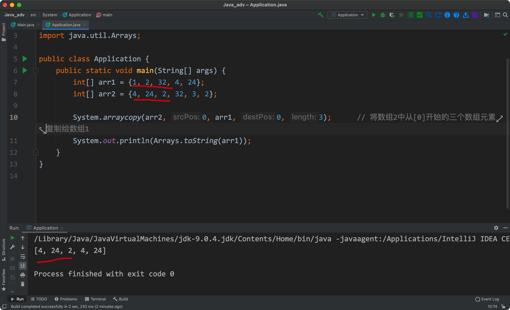

**注意：**这里使用了"Array"类里的"toString"方法输出数组

****


# 11.正确的测试方法


## 1) main方法

- main应该是程序的入口
- main方法不应该出现功能判断语句
- **不应该在main方法里进行测试**


main方法内应该尽可能简单


exam:

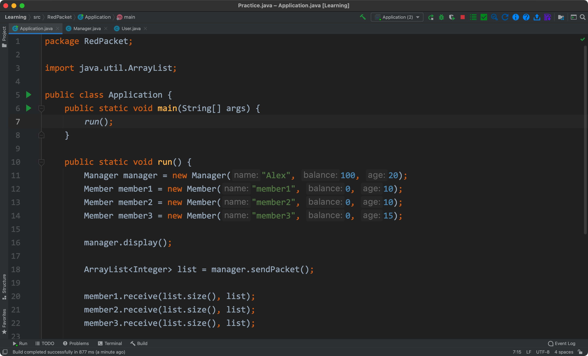


## 2) Junit测试框架


- Junit可以用来测试项目模块
- 使用Junit框架可以不需要main方法


用法：

1. 从maven respositry下载相对应的jar包
2. 为项目创建一个"lib"文件夹，并将jar包放入
3. 将jar包以"library"的方式导入

**注：**日后可以使用maven, gradle等工具直接加载到项目中

exam:

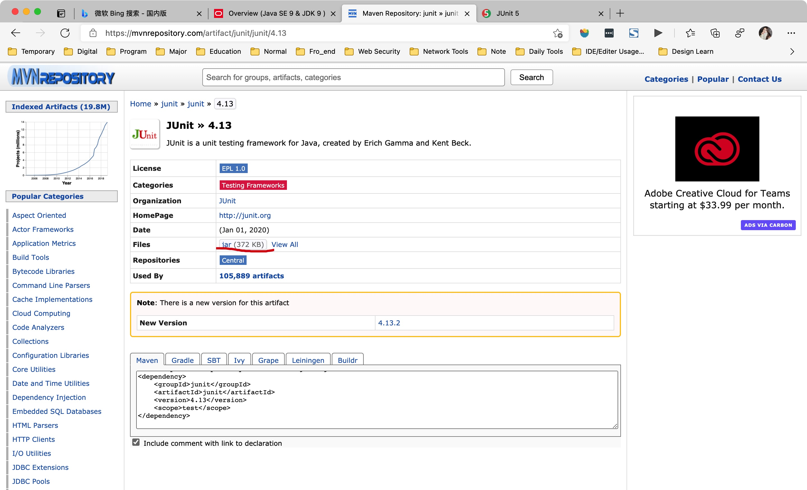


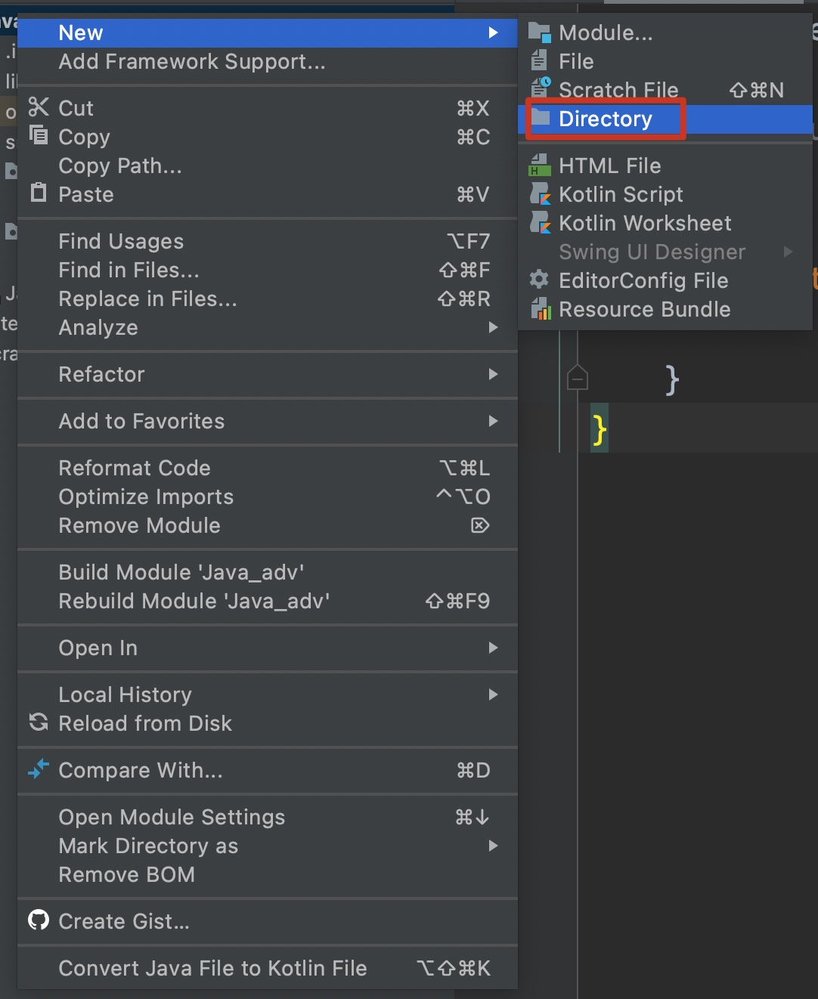


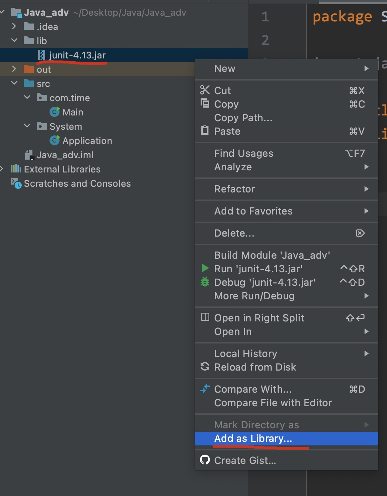


**注：**示例中的"junit"jar包需要添加依赖jar包


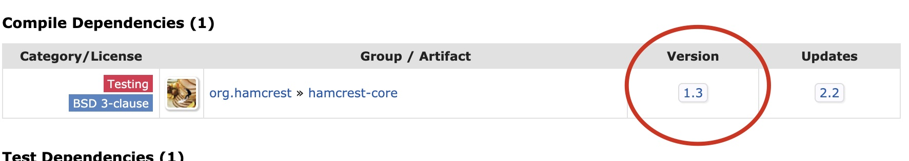


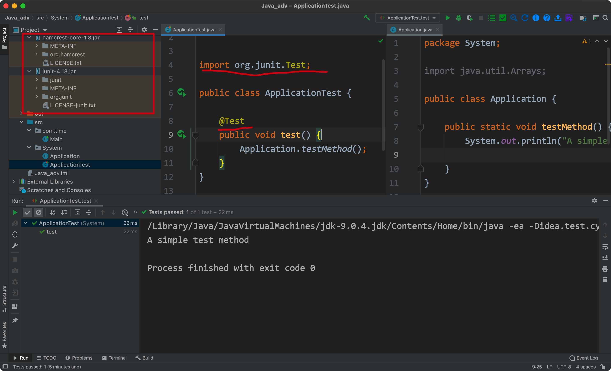

注：使用注解的方式，可以在不依赖main方法的情况下进行项目的功能模块测试


## 3) 取代通过输出的测试


- 以前的测试方法：给出测试数据，自己计算出正确值之后，再与程序的结果进行对照
- 老一套的测试方法仍旧需要人工计算，不够高效
- 如果前面的步骤中有错误，则会停止运行，**无法得知其后模块的正误**


- 新的测试方法: 通过Assert类中的"assertEquals"方法进行验证
- assertEquals(type expect, type actual): 参数一为期望值，参数二为实际的运行结果          // 该方法有多种重载形式，可适用于多种对象
- 各个模块分开运行。测试时，如果某个模块发生错误，并不会影响其他模块的测试，彼此之间不会干扰(类似"高内聚，低耦合")


exam1:

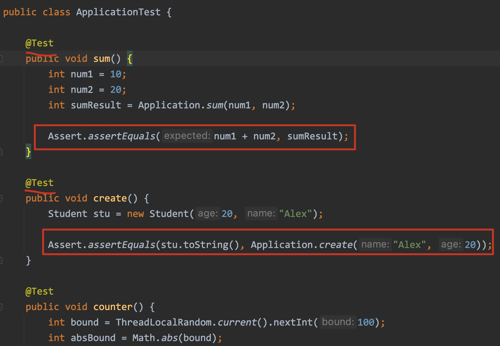


exam2:

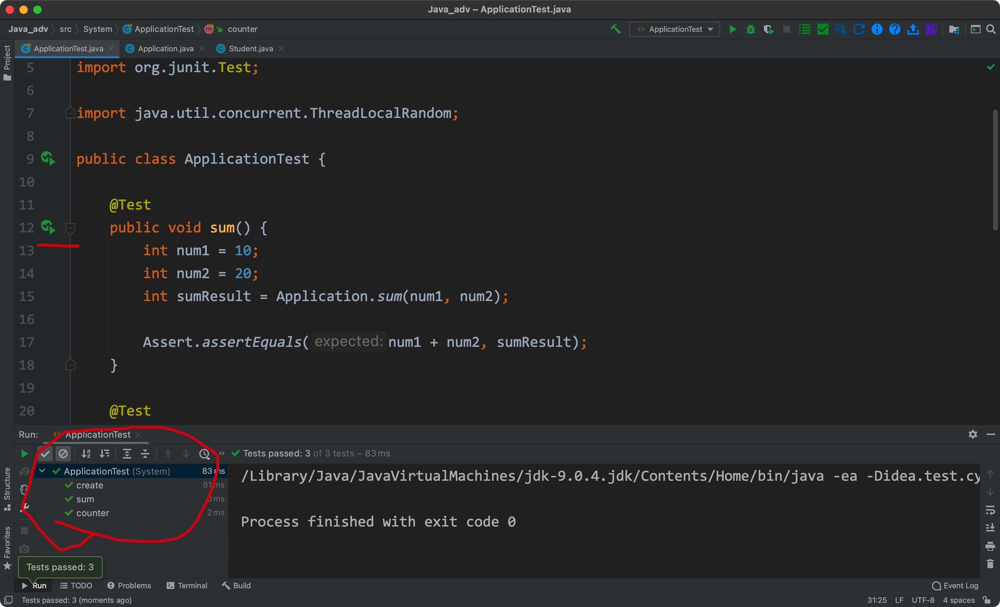

可以直接运行整个测试类，也可以运行单个测试模块，单个模块的结果**不会对其他测试产生影响**


exam3:

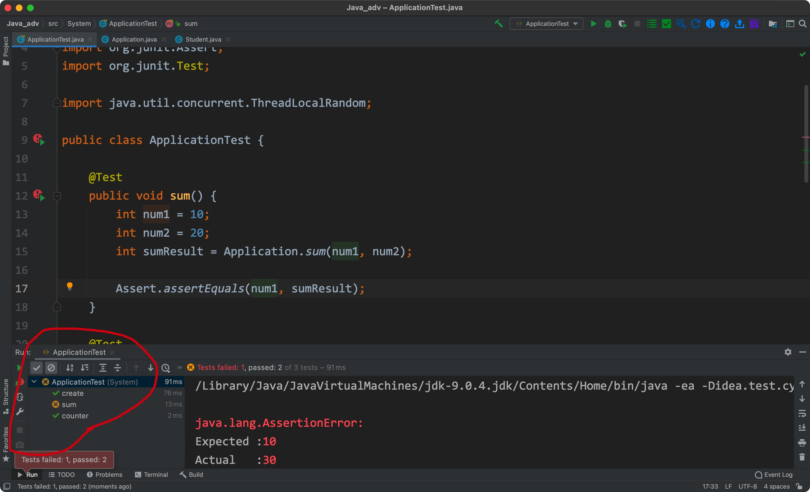

模块一出错，但**其余模块并未受到影响**

****


# 12.String类的补充

- 使用String创建出的对象不能修改，如果想要进行修改操作，则**只能再次开辟一块新的内存空间**，**效率不高**
- 对于需要**经常更改**的字符串对象，可以使用StringBuilder或者StringBuffer类创建字符串
- 需要CRUD时，需要**将字符串变量当作对象处理**，不能当作"String"对象使用简单的符号进行处理
- StringBuffer比起StringBuilder**是线程安全的**，但**StringBuilder的速度更快**


## 1) StringBuilder

属于java.lang包下，用于创建和操作**经常需要*CRUD的字符串对象**


***CRUD: create retrieve update delete**


### 1. 格式用法

```java
StringBuilder object = new StringBuilder();
object.method();
```


### 2. 相关方法


实例方法：

- append(type para): 追加字符串，并将其添加到StingBuilder对象中                        // 该方法含有多种重载形式，可以接收多种参数
- capacity(): 返回对象的**字符容量**(包含空格)                                                               // 注意：StringBuilder对象在创建时，默认含有16个字符的容量，**未超出的话则会一直占用16个字符空间**，容量不足时，则会默认以16的倍数增加容量
- trimToSize(): 清理**多余的字符空间**                                                                             // 对于存储小于16个字符的对象时很管用
- delete(int start, int end): 删除StringBuilder对象**指定范围**中的字符，并**返回一个StringBuilder对象**
- deleteCharAt(int index): 删除指定位置的字符，并返回修改后的对象
- indexOf(String str): 返回参数字符串**在对象中的索引位置**
- indexOf(String str, int fromIndex): 返回参数字符串在对象中的索引位置，并**指定查找的开始范围**
- insert(int offset, type para): **从指定的位置开始**，插入**所需类型的值**，并**返回该对象**       // 含有多种重载形式
- length(): 返回**对象的字符数量**(与字符容量无关)
- reverse(): **反转字符串的顺序**，并返回该对象
- replace(int start, int end, String str): 在**指定范围内**，用**参数字符串替代**源对象中的字符
- substring(int start): 从指定的位置开始，**将之后的字符串截取**，并**以其为String值返**回一个新的String对象
- substring(int start, int end): 将**指定范围内的字符**作为参数，并**返回一个新的String对象**


构造方法:

- StringBuilder(): 构造一个StringBuilder对象，并将其容量初始化未16个字符
- StringBuilder(int capacity): 构造一个StringBuilder对象，并指定其初始容量
- StrngBuilder(String str): 构造一个StringBuilder对象，并将参数作为其初始化内容


**注意：**当对一个StringBuilder追加字符串时，如果对象的字符容量不够，则会**直接添加16的整数倍的容量**


exam1:

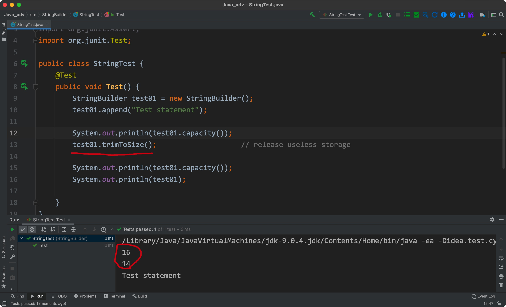


exam2:

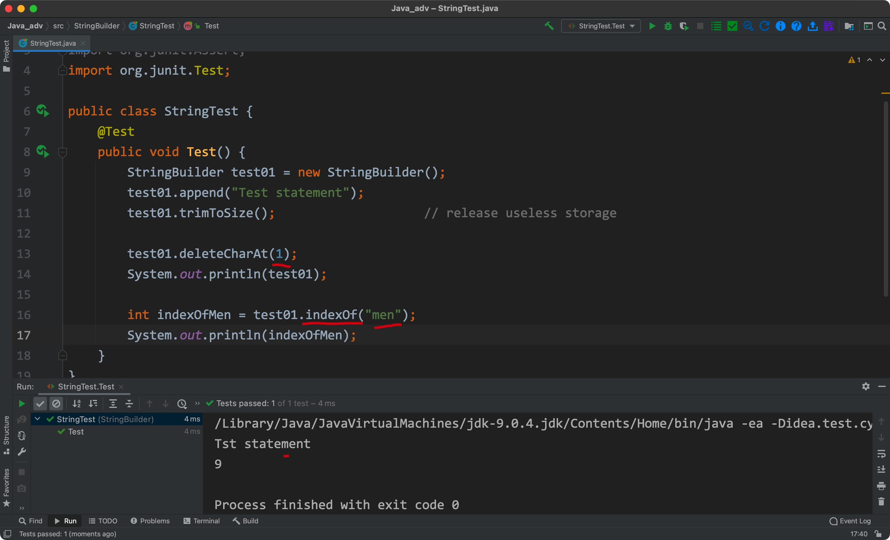


exam3:

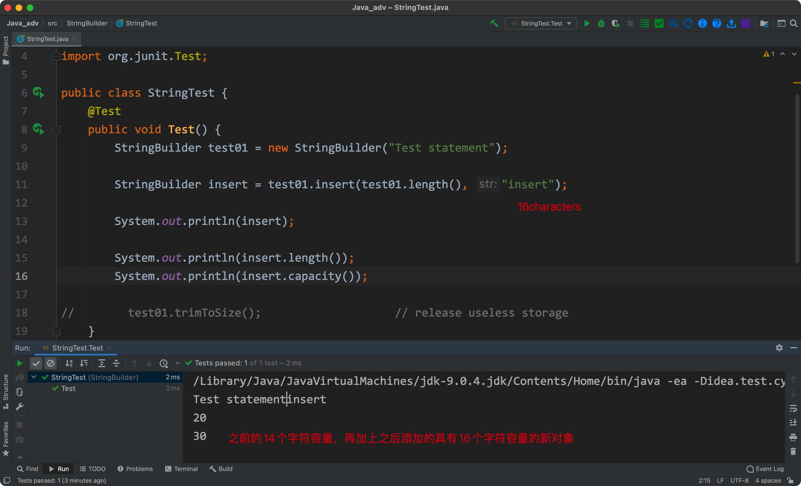


exam4:


exam5:

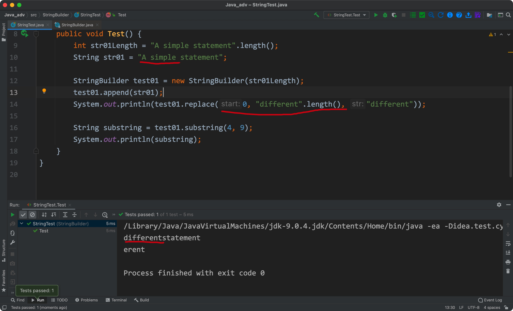


### 3. 链式调用

- 可以用多个"."调用符号同时使用多次方法


exam:

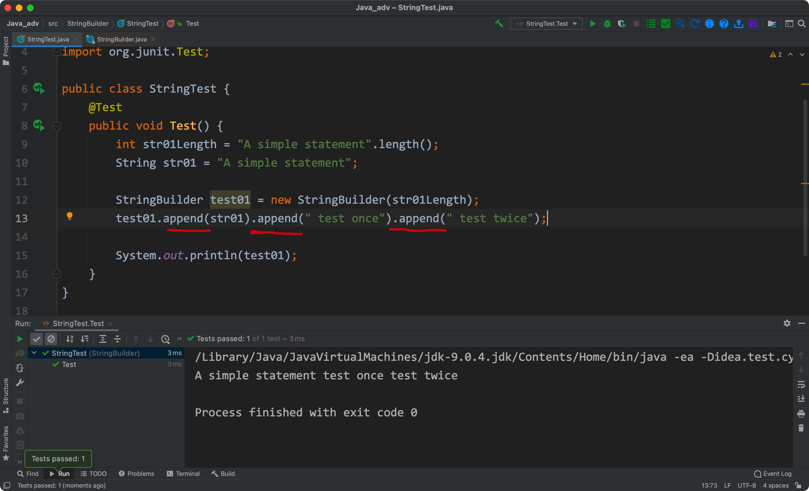

****


# 13.Throwable与异常

属于java.lang包下，用于获取程序的错误与异常并将其显示


- Throwable含有两个子类: Error, Exception
- 其中Exception最常用


exam:

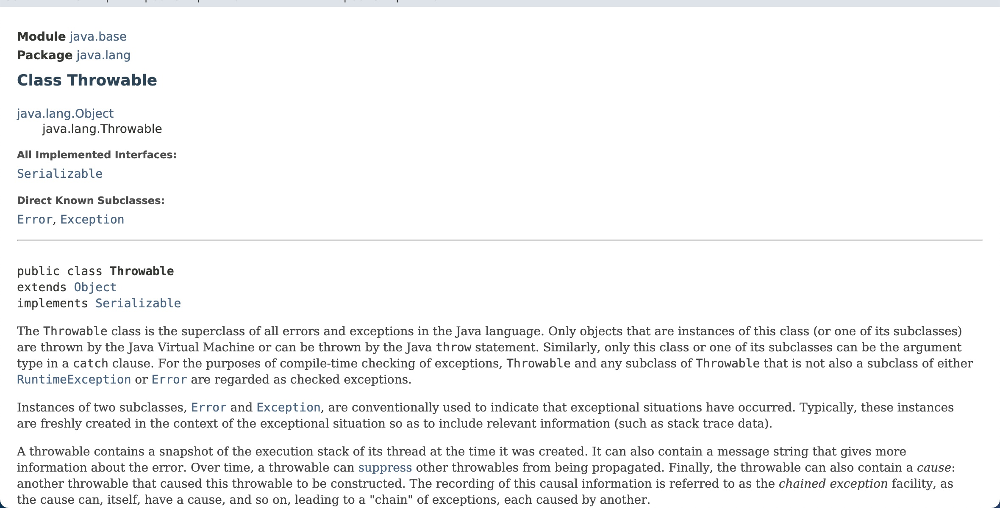


## 1) Exception

继承自java.lang.Throwable类，用于获取并显示程序中的各种异常


exam:

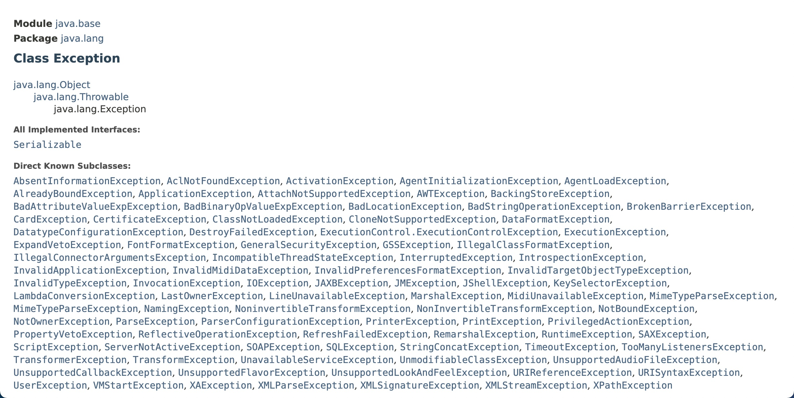


**异常的解决思路：**

1. 查看异常信息，并定位到报错的位置进行修改
2. 搜索异常信息，查找异常描述


exam:

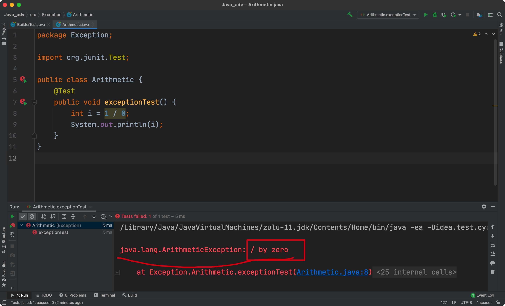


示例：

### 1. RunTimeException

继承自java.lang.Exception，用于显示程序在运行时的错误(可以正常编译，非语法问题)


exam:

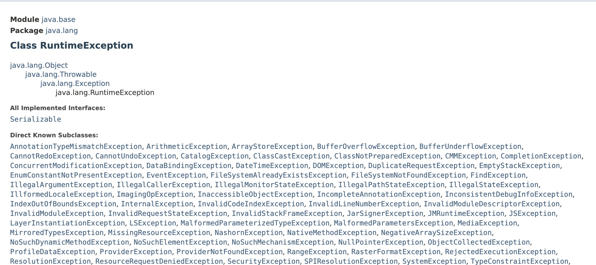


### 2. ClassNotFoundException

继承自java.lang.ReflectiveOperationException，用于应用加载类时的异常


exam:

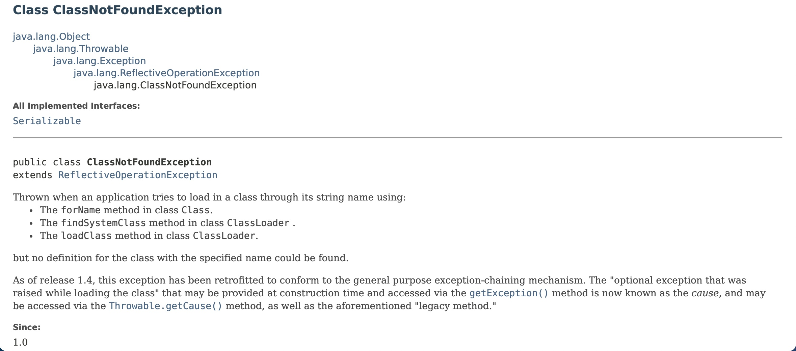


### 3. NullPointerException

属于java.lang.NullPointerException下，用于表示引用对象时导致的空指针异常


避免方法: 

利用Objects类中的方法进行检验


Objects:

属于java.util包下，含有多种检查对象的静态方法


源码:

```java
public static <T> T requireNonNull(T obj) {
        if (obj == null)
            throw new NullPointerException();
        return obj;
    }
```


exam:

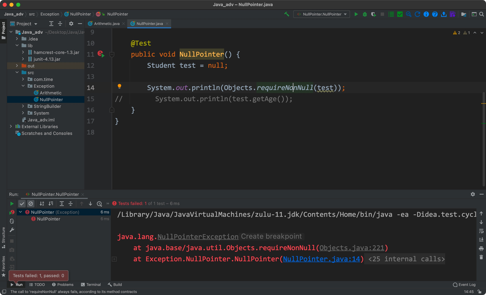

其会**返回一个异常对象**，**而不是布尔值**


### 4. ArithmeticException


## 2) try catch

用于检测异常


IDEA快捷键: 

Mac: Command + Option + T

Win10: Ctrl + Alt + T


格式:

```java
try {
  可能出现异常的语句
} catch (Exception object) {
  object.printStackTrace;
}
```

- "catch"中的语句可以不写，但会导致没有报错信息，开发时必须写上
- catch中必须有一个Exception对象


exam:

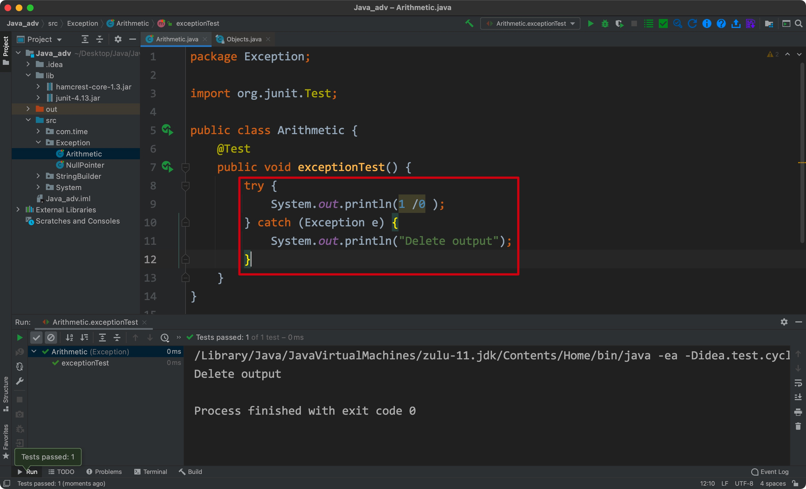


## 3) 为开发者抛出异常

使用throw关键字可以直接抛出异常，提醒开发者处理问题，**而不是简单的输出语句进行提示**


格式:

```java
method throws Exception Type() {
  throw new Exception_type;
}
```


exam:

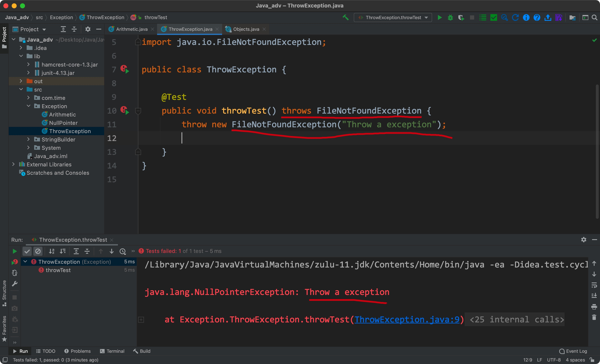


## 4) 简单的编写自定义的异常

创建一个新的类，用自定义的类名创建自己想要的异常


- 完整编写自定义异常文件是**架构师**考虑的工作


### 1. 格式


exam:

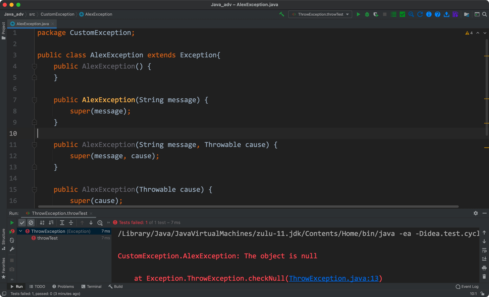

- 自建一个类，继承Exception类(也可以选择继承RunTimeException等其他类)，'继承Exception类可以在编译时给出提示，而不是像RunTimeException一样在运行时才给出异常'


- 为继承的字段，快速创建constractor


### 2. 使用

可以使用**throw**或者**try catch**的方式抛出或者捕获方法中的异常


exam:

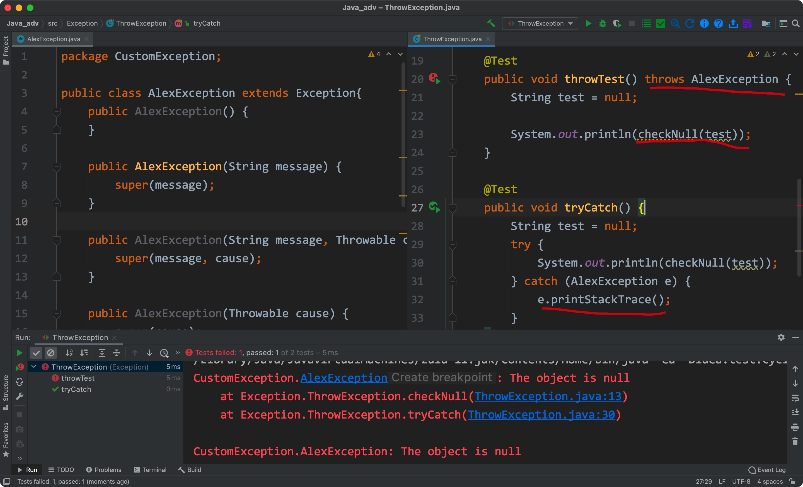

****


# 14.File

属于java.io下，用于处理文件和文件夹相关的内容


## 1) 格式用法


```java
File object = new File(String pathname);
```

**注意：**File类的构造方法中没有空参构造，必须给定一个参数


## 2) 相关方法/字段


构造方法

- File(String pathname): 创建一个File对象，接收一个路径字符串，并将其存储到一个File对象中
- File(String parent, String chid): 创建一个File对象，接收一个父类路径和一个子类路径，并将其合并后存储到一个File对象中


实例方法


Boolean

- isFile(): 检测对象所存储的**是否为文件**，并返回一个布尔值
- isDirectory(): 检测对象所存储的**是否为文件夹/路径**，并返回一个布尔值
- isAbosulte(): 检测对象所存储的**是否为绝对路径**，并返回一个布尔值
- exists(): 检测对象所指的文件**是否存在**，并返回一个布尔值
- isHidden(): 检测对象所指的文件**是否被隐藏**
- canRead(): 检测文件是否可以读取
- canWrite(): 检测文件是否可以写入
- canExecute(): 检测文件是否可以运行


Info.

- lastModified(): 获取对象**最后一次修改的时间**，返回一个**long类型**的**时间戳**
- length(): 显示**文件**的字节数
- getAbsolutePath(): 获取对象的**绝对路径**
- getPath(): 获取文件的**绝对路径**，并以**字符串的形式**输出
- getParent(): 获取**上一级文件的路径**，**以字符串的形式**返回其路径，如果没有上一级则返回null
- getParentFile(): 获取上一级文件的路径，**返回一个File对象**
- getName(): 获取文件/文件夹的名称，**以字符串的形式**返回


CRUD

- mkdir(): 根据对象存储的绝对路径，**在指定的路径下**，创建一个**指定名称的文件夹**
- mkdirs(): 根据对象存储的绝对路径，创建一个**指定名称的文件夹**，如果指定的路径不存在，则会**自行创建多级路径以匹配**
- createNewFile(): 根据对象存储的路径，创建一个指定名称的文件，如果**已经存在同名文件**，则创建失败
- renameTo(File dest): 重命名文件
- delete(): 删除文件
- setExecutable(boolean executable): 设置文件是否可以运行
- setExecutable(boolean executable, boolean ownerOnly): 设置文件运行权限的同时，指定是否只对用户生效            // 其余set方法均有此种重载形式，之后不在赘述
- setReadable(boolean readable): 设置文件是否可读
- setWritable(boolean writable): 设置文件是否可以写入
- setReadOnly(): **设置文件为只读**
- setLastModified(long time): 设置文件最后一次修改的时间，**参数为时间戳**


exam for boolean:

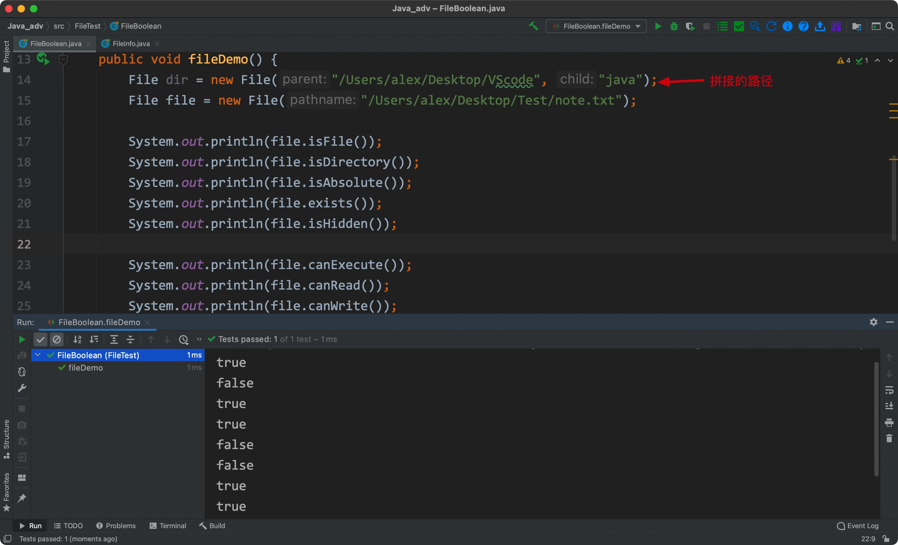


exam for info.

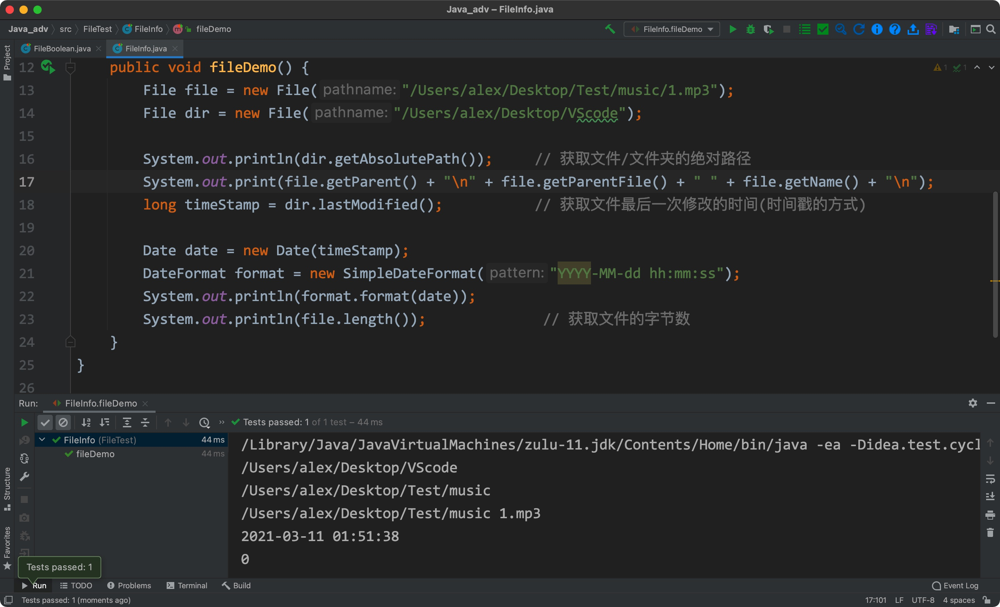


exam for CRUD:

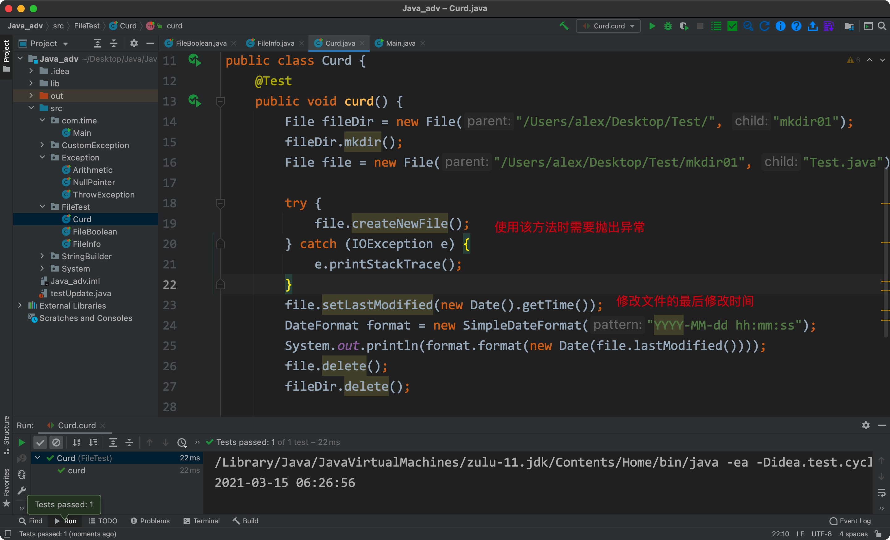

****


