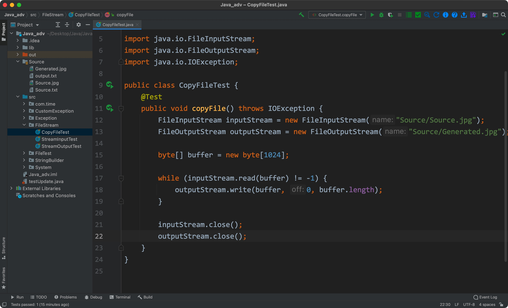
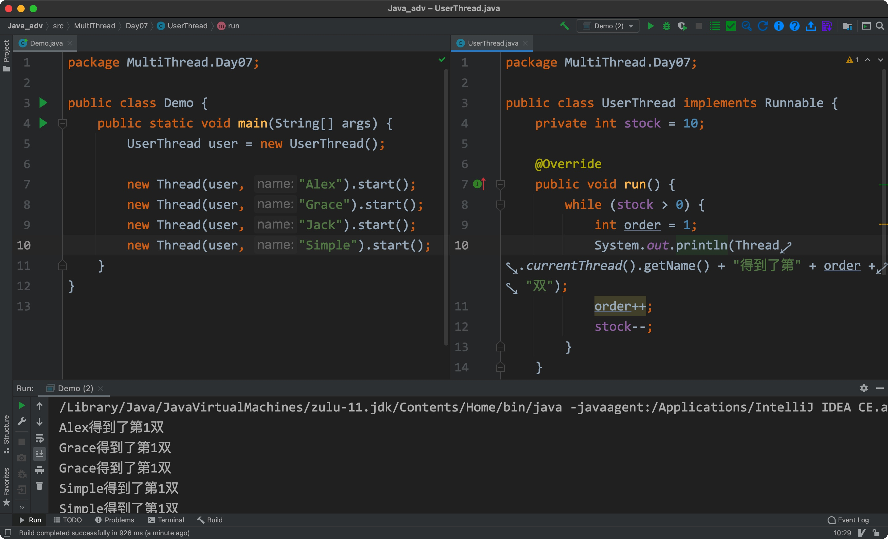

# 1.FileInputStream

属于java.io下，用于**建立外部输入流到本程序中**，继承自java.io.InputStream


*输入是**指相对本程序而言的**


## 1) 格式用法

```java
FileInputStream fileInput = new FileInputStream(path/file_obj...)
```

**注意：**其没有空参构造方法，**必须给定一个字符串路径或者File对象**


## 2) 相关方法/字段


构造方法

- FileInputStream(File file): 接收一个File对象，与其**存储的文件**建立一个字节输入流连接
- FileInputStream(String name): 接收一个文件路径字符串，并与该文件建立一个字节流输入连接


实例方法

- int read(): 从建立输入流的文件中，**以字节的方式**读取其中的数据，并返回**相应的int类型数据**，如果到达了**文件末尾**，则会**返回-1**         // 输出时建议转化为char
- int read(byte[] b): 从建立连接的文件中，读取与字节数组"b"长度相同的字节数据，并**保存到数组"b"中**，然后**返回数组"b"的length**
- void close(): 关闭所建立的字节流(节省资源)，必须写上
- int available(): 返回剩余的文件字节数


exam:


此种方式读取文件时，是**通过一个个的搬运字节进行的，效率较低**

****


# 2.FileOutputStream

属于java.io下，用于建立与外部文件的字节输入流，继承自java.io.OutputStream


## 1) 格式用法

```java
FileOutputStream fileOutputStream = new FileOutputStream(target_file_path/File_obj...);
```


## 2) 相关方法/字段


构造方法

- FileOutputStream(String name): 接收一个文件路径字符串，并与该文件建立字节输出流          // 如果该文件不存在，则会创建该文件
- FileOutputStream(String name, boolean append): 与上一个相同，但**如果第二个参数为true，则会从文件末尾开始写入**
- FileOutputStream(File file): 接收一个File类型的对象，与其对应的文件建立字节输出流
- FileOutputStream(File file, boolean append): 参数二用于指定写入的位置为开头还是结尾


实例方法

- write(int b): 接收一个int类型参数b，并将其以字节的方式写入建立字节流输出流的文件
- write(byte[] b): 接收一个byte类型的字节数组，并**将数组中的内容写入文件中**
- wirte(byte[] b, int off, int len): 接收一个字节数组，从**指定的"off"位置**开始，每次写入**指定"len"数量**的字节数到输出流文件
- close(): 关闭字节输出流


exam1:


与读取一样，该种写入的方式也是通过一个个的搬运字节的方式


exam2:


****


# 3.字节缓冲区的使用


## 1) 思路

- 创建一个字节数组当作缓冲区
- 使用read()方法将读取到的文件数据保存到字节数组中
- 使用write(byte[] b, int off, int len): 方法每次写入"len"个字节到指定文件中


## 2) 实践


源文件:


复制后的文件:


exam:



与之前的方式不同，我们创建了缓冲区用来暂时存储字节，可以一次性搬运多个字节

**java API 中提供了相关的工具，不需要我们自己创建缓冲区**


例如ByteArrayOutputStream


****


# 4.BufferedInputStream

属于java.io下，继承自FilterInputStream，用于**在字节输入流的基础上**，建立缓冲输入数据流，提高读写的效率


## 1) 格式用法

```java
BufferedInputStream object = new BufferedInputStream(InputStream object);
```

没有空参构造方法，必须传入一个InputStream的子类对象(比如一个FileInputStream对象，InputStream和OutputStream都为抽象类)


## 2) 相关方法/字段


构造方法

- BufferedInputStream(InputStream in): 接收一个InputStream的子类对象，与其对应的文件建立一个缓冲输入流
- BufferedInputStream(InputStream in, int size): 同上，但可以指定字节缓冲区的长度


实例方法

- read(): **以字节的方式**读取出文件数据
- read(byte[] b, int off, int len): 同FileInputStream
- close(): 同FileInputStream


exam:


****


# 5.BufferedOutputStream

属于java.io下，继承自java.io.FilterOutputStream，**在字节输出流的基础上**，建立缓冲输出流


## 1) 格式用法


```java
BufferedOutputStream object = new BufferedOutpurStream(OutputStream object)
```

没有空参构造方法，需要传入一个OutputStream的子类


## 2) 相关字段/方法


构造方法

- BufferedOutputStream(OutputStream out): 接收一个OutputStream的子类，与其指定的文件建立一个缓冲输出流
- BufferedOutputStream(OutputStream out, int size): 同上，参数二指定缓冲字节数组的大小


实例方法

- write(int b): 写入**一个指定的字节**"b"到目标文件中
- write(byte[] b, int off, int len): 接收一个字节数组，从指定的位置开始，将**给定长度的字节**其写入到输出文件中
- flush(): 刷新缓存的输出流


exam:


****


# 6.字节流小结

- InputStream和OutputStream是**所有字节输入输出流**的超类/父类
- FileInputStream和FileOutputStream是最底层的，建立字节输入输出流的类
- BufferedInputStream和BufferedOutputStream在前者的基础上，为我们**自动创建了字节缓冲数组**，使字节流的读写更加便捷

**注**：在一个类的基础上，再次拓展功能的设计模式，称为**装饰设计模式**

- 字节流可以处理任何文件，但是效率并不高

****


# 7.FileReader

属于java.io下，继承自InputStreamReader，属于**字符流**，以**字符的方式**而不是字节的方式**读取输入文件**

**注：**以**字节流的方式**可以**处理任何种类**的文件


## 1) 格式用法


```java
FileReader object = new FileReader(filename/File_obj)
```

没有空参构造方法，必须传入一个File对象，或者一个字符串文件名


## 2) 相关方法/字段


构造方法

- FileReader(String fileName): 接收一个文件名字符串(含路径)，并与其建立字符输入流
- FileReader(File file): 接收一个File对象，与其建立字符输入流


实例方法

- close(): 关闭字符输入流
- read(): 读取输入文件的**单个字符**，并返回**相应的int类型数据**
- read(char[] cbuf, int offset, int length): 从指定的位置开始，将读取的字符存入一个**char类型数组**中，并指定写入的最大字符数
- getEncoding(): 获取该输入文件的字符编码


exam:


****


# 8.FileWriter

属于java.io下，继承自java.io.OutputStreamWriter，用于**以字符的方式**，输出数据到建立字符流的文件中


## 1) 格式用法


```java
FileWriter object = new FileWriter(File_obj/filename);
```

没有空参构造方法，需要传入一个File类型对像，或者文件名


## 2) 相关方法/字段


构造方法

- FileWriter(File file): 接收一个File对象，并与其建立字符输出流
- FileWriter(String filename): 接收一个String类型的文件名，与其建立字符输出流

**注：**以上两种构造方法均有含两个参数(boolean append)的重载形式，boolean值的**作用同FileOutputStream类相同**


实例方法

- close(): 关闭字符输出流

- write(int c): 接收单个int类型的数据，并转换为char类型到输出文件中

- write(String str): 接收一个字符串，直接将其写入到输出文件中

- write(char[] cbuf): 接收一个char类型数组，将其写入到输出文件中

  **注：write(String str)和write(char[] cbuf)均有可指定写入起始位置，和写入长度的重载形式**(参照FileOutputStream中的Write方法)


exam:


****


# 9.BufferedReader

属于java.io下，继承自java.io.Reader，用于创建一个**字符缓冲输入流**


## 1) 格式用法


```java
BufferedReader object = new BufferedReader(Reader_obj)
```

没有空参构造方法，需要传入一个Reader的子类对象(如FileReader)


## 2) 相关方法/字段


构造方法

- BufferedReader(Reader in): 接收一个Reader的子类对象，与其建立**字符缓冲输出流**
- BufferedReader(Reader in, int sz): 同上，并同时指定缓冲字符数组的length


实例方法

- close(): 关闭字符缓冲输入流
- read(): 读取一个输入文件的单个字符，返回类型为int
- read(char[] cbuf, int off, int len): 参照FileReader中的同名方
- readLine(): 读取一行文本数据，**返回类型为String**


exam:


****


# 10.BufferedWriter


## 1) 格式用法


```java
BufferedWriter object = new BufferedWriter(Writer out);
```

没有空参构造方法，需要传入一个Writer类的子类(如FileWriter)


## 2) 相关方法/字段


构造方法

- BufferedWriter(Writer out): 传入一个Writer类的子类，与其建立字符缓冲输入流
- BufferedWriter(Writer out, int sz): 同上，可指定缓冲字符数组的length


实例方法

- close(): 关闭字符缓冲输入流

- newLine(): 写入一个空行

- write(int c): 接收一个int数据，将其转换为char写入(FileWriter中的同名方法)

- write(String)

  ......(其余均可参照FileWriter类)


exam:


****


# 11.字符流小结

- Reader和Writer是字符流的最终父类/超类
- FileReader和FileWriter是用于与文件建立输入输出字符流的类
- BufferedReader和BufferedWriter建立与前两者上，**类似字节缓冲流之于字节流**


# 12.InputStreamReader

属于java.io下，继承自Reader(字符流的最终超类)，其构造方法**可以将字节流转换为字符流**


## 1) 格式用法


```java
BufferedReader object = new BufferedReader(new InputStreamReader(System.in))
```

**注：**System.in 是"System"类里的一个"InputStream"对象


## 2) 相关方法/字段


构造方法

- InputStreamReader(InputStream in): 接收一个InputStream对象，以此创建字符输入流(以默认的字符编码)
- InputStreamReader(InputStream in, String charsetName): 同上，但可自定义字符编码形式


实例方法

注：并不常用，多将其转化为BufferedReader对象进行操作

- InputStreamReader也**只能一个个的传递数据**，不如BufferedReader高效
- InputStreamReader**没有类似BufferedReader中能读取一行的"readLine()"方法**，并不便捷


exam:


****


# 13.Apache Commons IO


- 在Maven Repository找到Apache commons io，下载jar包并导入到项目中(方法同Junit)
- 可在Apache官网找到其对应版本的使用文档


## 1) FileUtils

属于org.apache.commons.io下，提供了各种对文件/文件夹CRUD的便捷方法，且不需要创建对象(全为静态方法)


### 1. 格式用法

```java
FileUtils.method(para1 para2......);
```


### 2. 方法


Create

- forceMkdir(File directory): 以参数指定的目录信息创建目录
- forceMkdirParent(File file): 以参数指定的文件信息创建文件
- touch(File file): 以和Unix"touch"命令相同的方式，创建文件


Read

- readFileToByteArray(File file): 将文件内容读取到**一个字节数组**中，并返回该数组
- readFileToString(File file, string charsetName): 以**指定的字符编码**形式将文件内容读取到**一个字符串**中，并返回
- readLine(File file, String charset): 以指定的字符编码形式读取文件内容到一个List<String>对象中，并返回该List对象


Update

- writeByteArrayToFile(File file, byte[] data): 将一个**字节数组**写入到目标文件中

- writeByteArrayToFile(File file, byte[] data, boolean append): 同上，参数三指定写入方式(防止覆盖)

  另有带参数(int off, int len)的重载形式，用法同jdk	

- writeLines(File file, collection<?> lines): 将一个**collection对象**写入文件中

  另有带参数(boolean append, String lineEnding, String charset)的重载形式

- writeStringToFile(File file, String date, String charset): 将字符串**以指定的字符编码**写入到文件中

  另有带参数(boolean append)的形式


Delete

- deleteDirectory(File directory): 以递归的方式删除文件夹
- deleteQuietly(File file): 静默删除文件
- forceDelete(File file): 删除文件
- cleanDiretory(File diretory): 清空目录


Move

- moveDirectory(File srcDir, File destDir): 将文件夹从参数一移动至参数二(同时路径名可以更改)
- moveDirectoryToDirectory(File src, File destDir, boolean createDestDir): 将文件夹移动至**指定的文件路径内**
- moveFile(File src, File destFile): 将文件移动至新的路径
- moveFileToDirectory(File srcFile, File destDir, boolean createDestDir): 将文件移动到指定目录下
- moveToDirectory(File srcFile, File destDir, boolean createDestDir): 将文件/文件夹移动到指定目录下

**注：**copy同理


info.

- isFileNewer(File file, Date date): 将File参数与Date参数对比，如果更早，则返回true，反之则false
- isFileNewer(File file, long timeMillis): 将File参数与时间戳对比
- isFileOlder(File file, Date date): 同Newer
- isFileOlder(File file, long timeMillis): 同Newer
- sizeOf(File file): 返回参数文件的size(long)
- sizeOfDiretory(File directory): 返回目录的size(递归的方式)


example:


****


# 14.Charset

- 字符编码可以理解为数字与字符之间的对应关系
- 最常用的为UTF-8
- 编写文件和读取/查看文件时，如果文件的字符编码不一致，有可能会产生乱码


## 1) 乱码的原因


编码和解码格式不一致，导致乱码:


网页显示不正常:


## 2) 批量转码

- 有多种方式以实现，不必局限于一种方式


example:


源:


resolution:


result:


****


# 15.Multithreading


## 1) process and thread

- 线程属于进程，一个进程至少有一个线程，一个程序至少有一个进程
- 一个线程死掉，一个进程也会死掉，所以多进程的程序更加健壮
- 在进程之间切换时消耗资源大 
- 并发(Concurent): CPU资源有限，运行多个线程的时候，将当前未运行的线程变为挂起状态(suspend)             // 即来回切换应用
- 并行(Parallel): CPU资源充足，可以给每个线程都分配独立的CPU
- 多线程: 同时进行，多个部分可同时执行，但系统不会将其看作多个应用。且共享变量(共享内存)的程序只能使用多线程(同时抢购一件商品 )


## 2) Thread


### 1. Basic

属于java.lang下，用于创建线程类


- 使用前需要新建一个类继承它，并重写run()方法
- 使用时需要使用start()方法，其会多开启一个新的线程，并调用run()方法
- 这种继承的方式并不好，因为**java是单继承的**，一个类继承Thread类后，没法再继承其他的类


exam:


### 2. 执行过程

- 主线程一直在运行，但一碰到其他的线程就从中会分出一个子线程
- 子线程会调用run()方法，并继续运行
- 分出子线程的同时，主线程还会继续向下运行


## 3) Runnable

属于java.lang下，是一个接口，可以解决java只能单继承的问题


### 1.Basic

- 需要一个实现类，并在实现类中重写run()方法
- 该实现类不能直接调用start()方法
- 创建一个实现类对象后，需要将其转换为一个Thread对象


### 2.Usage


exam:


### 3.简化写法/线程名


利用Thread的构造方法:

- Thread(Runnable target, String name): 接收一个Runnable对象，和一个字符串，以该字符串作为该线程的名字，创建一个线程


静态方法:

- static Thread currentThread(): 获取该线程对象
- String getName(): 获取该线程的名字


exam:


## 4) 多用户简单案例


- 创建一个Runnable的实现类，重写run()方法
- 创建该实现类对象
- 在main中以该实现类对象为参数，使用Thread的构造方法，创建多个Thread对象
- 通过Thread对象调用start()方法，开启新的线程


exam:


这里使用了join()方式，使得主线程必须等待alexToThread线程运行完成后再运行


## 5) 守护/后台线程

可用于更新后台数据

使用时需要用到**Thread类中的实例方法:"setDaemon()"**，且守护线程需要放到最前面

步骤:

-  创建一个类继承Runnable类，并重写其中的run()方法
- 在main中创建该类的对象，并将其传入到一个Thread对象的构造方法中
- 通过该Thread对象调用setDaemon()方法，并将参数设置为true
- 可以通过isDaemon()方法判断该线程对象是否为守护线程


exam:


## 6) 匿名内部类创建线程

- 不推荐


exam:


## 7) 线程同步问题


问题：

之前的写法中，后台数据并不能及时更新，


exam:




需要创建一个锁用于同步线程:


## 8) 同步方法


使用synchronized关键字将不安全且不同步的线程方法封装起来，作为一个同步方法，使其能够被单独调用


exam:


## 9) 同步锁


通过Lock类中的方法锁住线程，**比起synchronized更加直观**


Lock:

- 属于java.util.concurrent.locks下，**是一个抽象类**
- 使用时需要借用它的实现类: ReentrantLock


方法:

- lock(): 获取一个锁(锁定的开始)
- unlock(): 释放锁(锁定的结束)


exam:


## 10) synchronized和Lock类的区别

- synchronized: 是java中的**关键字**，可用于修饰方法或者代码块

其在线程异常时会自动释放锁，但无法控制线程获取锁的顺序

- Lock: 是一个**接口**，**通过使用其实现类下的方法来获取和释放锁，更加灵活**

其线程异常时不会自动释放锁，可以选择控制线程获取锁的顺序，所以最好将同步代码块用 try catch 包起来，**finally 中写入 unlock，避免死锁的发生。**


## 11) 线程优先级(抢占CPU资源)

利用Thread类里的方法和字段，可以设置一个线程的名字，优先级等等


相关方法:


构造方法:

- Thread(): 分配一个新的线程对象
- Thread(Runnable target): 接收一个Runnable对象，分配一个新的线程对象
- Thread(Runnable target, String name): 接收一个Runnable对象，分配一个新的线程对象，并指定它的线程名

......


实例方法:

- Strin getName(): 获取线程名
- void setName(): 设置线程名
- void setPriority(int newPriority): 设置线程优先级
- void start(): 使线程开始运行
- void setDaemon(boolean on): 将线程设置为守护线程(后台线程)

......


静态方法：

- static void sleep(long miliis): 将线程休眠指定的时间
- static Thread currentThread(): 返回一个当前线程的引用(对象名)

......


字段:

- static int MAX_PRIORITY: 线程能拥有的最大优先级
- static int MIN_PRIORITY: 线程能拥有的最小优先级
- static int NORM_PRIORITY: 线程被分配的默认优先级


exam:


- Windows具有线程优先级
- Linux等类Unix系统的线程优先级都相同


## 以下全为线程调度:


## 12) 线程插队(join)

通过join方法可以在一个线程中插入另一个线程，并运行，**其余线程此时只能等待该线程结束或者其他调度**

**注：**使用时需要抛出异常，获取try/catch


相关方法:

- void join(): 将该线程加入
- void join(long mills): 等待指定时间后再将线程加入


exam:


## 13) 线程休眠(sleep)

使线程在执行前暂停指定的时间


相关方法:

- static void sleep(long millis): 接收一个毫秒值，将线程休眠对应的时间

使用时需要抛出异常或者try/catch


exam:


## 14) 线程让步(yield)

使用yield方法可以使一个线程让步给另一个线程


相关方法

- static void yield(): 当前线程放弃对当前CPU的使用


exam:


## 15) 线程状态


### 新建

仅创建，未开始运行(只是new，没有使用start()方法)


### 可运行

已经启用start()


### 阻塞

已经执行到该线程，其余线程均处于等待状态(锁在你这里，你不动，其他人都只能等待)


### 等待

等待阻塞状态的线程执行完成后，得到通知才能变为可执行状态


### 计时等待

等待阻塞的线程执行**或者超时的通知**


### 终止

整个程序执行完成


良好的比喻:


一局斗地主中:

1. 大家都准备好了(可运行)，你没准备好(新建)
2. 该你出牌了(阻塞)，大家都在等你(等待/计时等待)所以不能出牌
3. 有人赢了(终止)


## 16) 线程的通信

- wait():
- notify():


