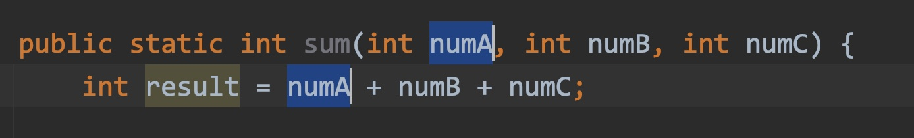
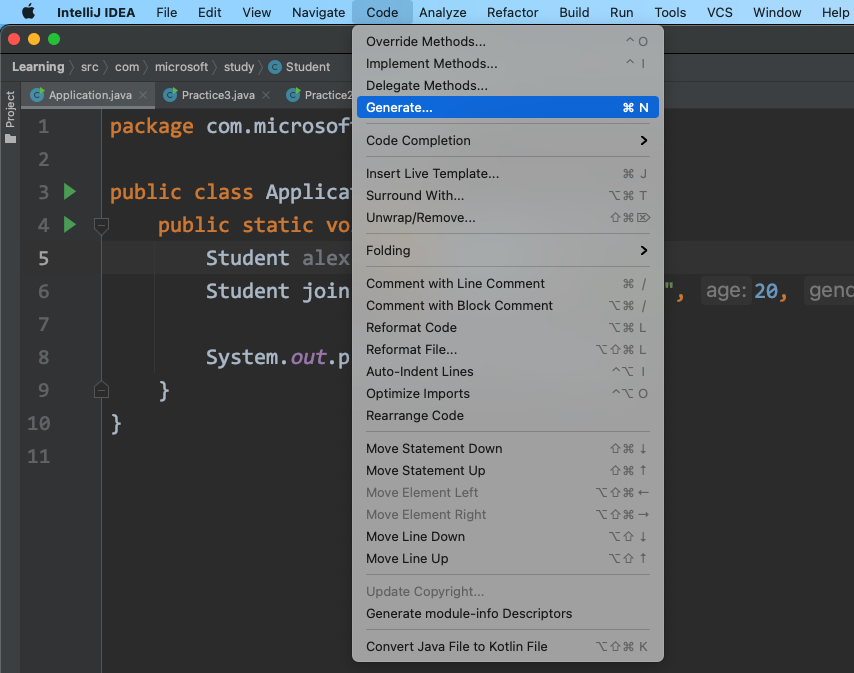
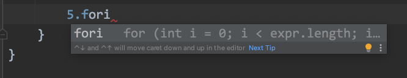
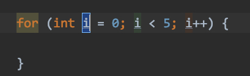
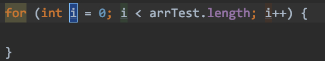
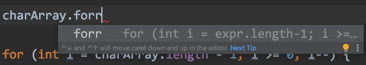

# 1.Directory Structure


projects -> module -> packages -> .class/interface/...


# 2.Shortcuts in code


## 1) change same name of variable


Win: shift + 6

Mac: ctrl + g


exam:




## 2) make a blank


insert a blank row below:

```
Shift + enter
```


Insert a blank row above

```
option + command + enter
```


## 3) move a row of code


```
option + shift + up/down
```


## 4) auto make constructor and getter&setter


exam:




shortcut:


mac ver.

```
command + N
```


Win10 ver.

```
alt + insert
```


## 5) copy a row of code 


shortcut:

```
crtl + D
```


## 6) auto implement abstract method


shortcut:

```
shift + option + enter
```


## 7) generate receiver var. auto


Mac:

shortcut:

```
option + command + v
```


## 8) check method/class comment doc. quickly


Mac:

shortcut:

```
control + j
```


# 3.Cycle shortcut


## 1) constant for cycle


Just type "value.fori" then tab


exam:







## 2) array in cycle


Just type "array'name.fori" then tab


exam:




If you want to reverse order, just type "forr" than tab


exam:

