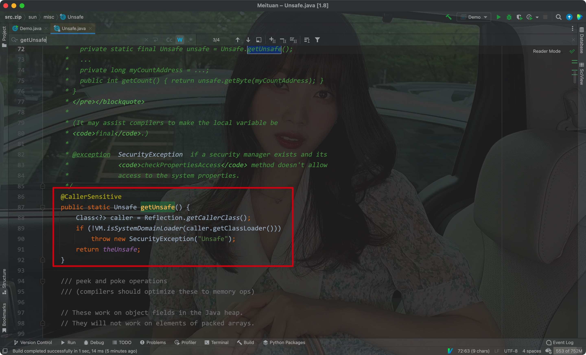
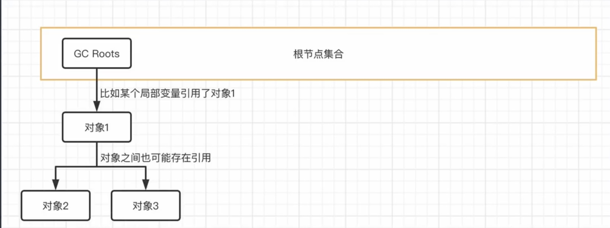
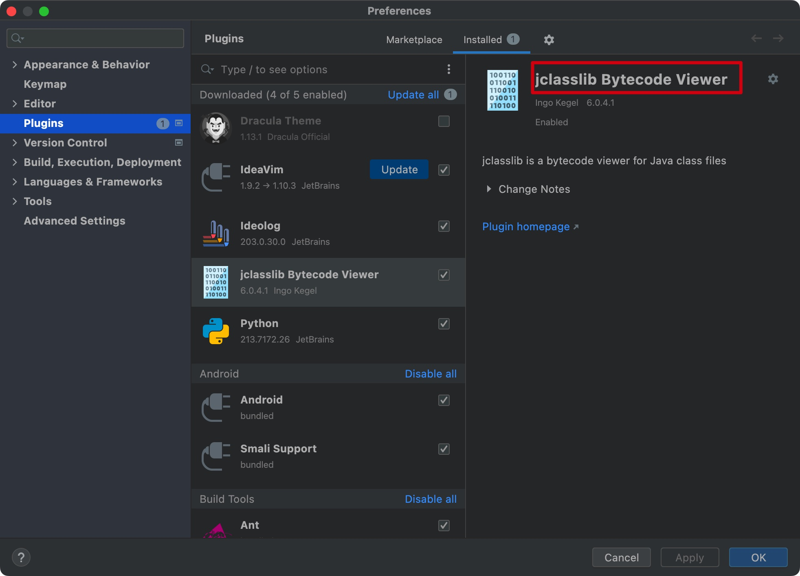
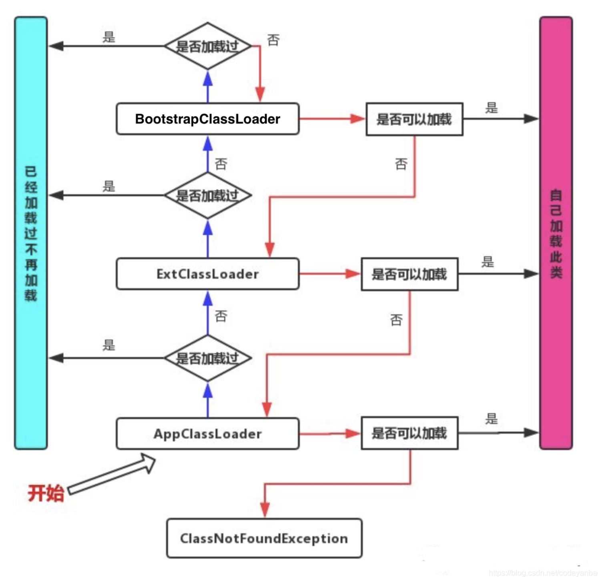

# JVM内存区域划分:


# 一、内存管理


## 1. 程序计数器

- 程序计数器: Program Counter Register

用于记录当前线程执行字节码的`行号`

字节码的解释器在执行字节码文件中的指令时，会修改字节码的行号，修改后的值就指向下一条即将执行的指令


Java执行多线程程序是基于轮转算法的，CPU的一个核心在某一时刻时只会执行一个线程，线程的时间片消耗完后，就会自动切换到其他的线程，而当前线程目前执行到位置会以行号的形式存放在**线程独有的程序计数器中**

> 下次再运行当前线程时，则从程序计数器中得知继续运行的位置
>
> 程序计数器所占空间较小

<hr>


## 2. 虚拟机栈/本地方法栈

- 虚拟机栈(VM Stack):

> 作为一个栈结构，存储每个方法对应的栈帧(局部变量表、操作数栈、动态连接、方法出口)

其中动态链接是指当前方法中调用的其他方法，通过该类的常量池可以找到对应方法的符号引用，然后将该符号引用转换为对方法的直接引用

最后方法出口规定了方法该如何结束


Eg:


每个方法调用的时候，其对应的信息封装为栈帧放入栈中，方法运行结束后再出栈:


- 本地方法栈:

> 作用同虚拟机栈相同，但其存放的是本地方法对应的栈帧

<hr>


## 3. 堆/方法区

- 堆:

> 对象的存储和管理区域，垃圾回收的主要作用区域，是JVM中最大的内存空间


- 方法区:

> (在JDK7之前)：由类信息表和运行时常量池组成

类信息表:

用于存储每个类对应的版本、字段、方法、接口等信息，同时会将编译时生成的类常量池数据存储在运行时常量池中

>类常量池也称作静态常量池


结构:


测试1:

- 使用new关键字创建的对象会放在`堆`中，所以两个对象对应的地址值不同，调用`==`比较的结果自然为false
- 而字符`abc`存放在方法区中的运行时常量池中，所以调用`equals`方法比较内容时，结果相同


- 使用""对应的字符串字面量时，会直接引用方法区中的字符串:


- 通过String实例调用`intern`方法会直接返回该实例引用的字符串常量在方法区中的地址:


intern方法的机制:

- 检查当前String实例对应的字符串是否存在于方法区内的运行时常量池中，存在则返回其中的地址，不存在则将该字符串放入运行时常量池中再返回对应的地址

Eg:


变化:

- 从JDK7开始，调用intern方法后，如果运行时常量池中没有对应的字符，则运行时常量池中会直接存储该字符串在堆中的引用:


Eg:


注意:

> JDK7之后，字符串常量池移动到了堆中

<hr>


## 4. 总结

- 程序计数器(线程独有): 记录当前线程执行的位置
- 虚拟机栈(线程独有): 存储栈帧来维持方法的调用顺序，控制程序有序运行
- 本地方法栈(线程独有): 作用同虚拟机栈，作用于本地方法
- 堆: 存储和管理所有的对象(包括数组)，JDK7之后其中还含有字符串常量池
- 方法区: 存储类信息、代码缓存、运行时常量池

<hr>


## 5. 爆内存/爆栈

- 在IDEA中设置对应程序的可用堆空间:


注意新版本中需要手动添加VM options选项


配置选项:

- -Xms: 最小堆内存
- -Xmx: 最大堆内存
- -XX: +HeapDumpOnOutOfMemoryError: 爆内存时，将信息输出


设置:


```shell
-Xms1m -Xmx1m -XX:+HeapDumpOnOutOfMemoryError
```


成功设置后，运行出现OutOfMemoryError时，项目目录中会出现一个hprof结尾的快照文件:


该文件可以借助IDEA的`Profiler`分析器来读取:


打开刚才生成的快照文件后，就可以查看哪些对象占用了大量空间，从而分析出导致爆内存的原因:


通过-Xss可以设定栈的容量:


<hr>


## 6. 直接内存

通过`Unsafe`实例对象，可以调用堆外内存(不受JVM控制)

> 通过Unsafe开辟堆外内存其实就是通过调用C/C++标准库里的malloc函数来分配内存空间


Eg:


该类的构造函数是private修饰的，只提供了一个theUnsafe对象，且只允许JDK自带的类调用它




这里我们使用反射的方式获取该字段即可:


<hr>


## 7. 元空间

- JDK8中，方法区转由元空间实现了，永久代被抛弃了
- 物理内存有多大，元空间就可以有多大

> 元空间由堆外内存(直接内存)存储，而不是和永久代一样在堆中


永久代实现方法区的缺点:

- 永久代的调优很困难，很难确定一个合适的大小


内存结构的发展历程:


当前(JDK8)的内存结构:


<hr>


# 二、垃圾回收


## 1. 对象存活判定算法

以下算法均针对堆中的对象


### 1) 引用计数法

> 每个对象都包含一个`引用计数器`，用于存放引用的计数值(存放引用的次数)
> 每当一个地方引用了该对象时，计数器的值都会递增1
>
> 当引用失效时，则会递减1
>
> 计数器的值为0的时候，该对象则不会再被使用了，此时便会进行回收


- 引用计数法的缺点:

当两个对象彼此之间相互引用，但两者的直接引用变量已经无法找回了，此时通过引用计数法就无法回收它们(因为计数器的值还不为0)


Eg:

```java
public static void main(String[] args) {
  Test test1 = new Test();
  Test test2 = new Test();

  test1.another = test2;
  test2.another = test1;

  test1 = null;
  test2 = null;
}

static class Test {
  Test another;
}
```

- 此时test1和test2被彼此的变量域所引用，因此计数器的值不为0
- 但其直接引用的变量被设置为了null，因此无法手动断开它们彼此之间的引用

<hr>


### 2) 可达性分析算法

> 选择一个对象的引用作为树的根结点，其余引用作为其他的结点
>
> 如果其他的结点无法连接到根结点，那么不管其引用计数为多少，都会被回收


可被选为根结点的对象引用:

- 虚拟机栈中本地变量表引用的对象(方法中的局部变量)
- 类的静态域引用的对象
- 方法区中常量池引用的对象(String类型)
- 被添加了锁的对象
- 虚拟机内部用到的对象


例子:

假设一个方法的局部变量作为了根结点(GC Root)




方法结束后，运行的范围超出了局部变量的作用域，此时根结点被回收，其对应的引用则无法到达根结点了，所以一并回收


循环引用:


总结:

如果对象无法到达GC Roots，那么说明其不会再被使用，此时其会被回收

<hr>


### 3) 最终判定

- 在对象通过可达性分析算法判断可以回收后，会调用从`Object`继承来的`finalize`方法，如果该对象`finalize`没有重写该方法，则才会真正将其回收
- 执行`finalize`方法的线程不是主线程(Finalizer线程)，其优先级较低
- 通过`System.gc()`方法可以向垃圾回收器申请一次回收(垃圾回收器会对通过调用`finalize`方法来判断对象是否可以被回收)


注:

>System.gc()是Runtime.getRuntime().gc()的简写方式，两者作用相同


> 当可达性分析算法判定可以回收时，对象只进行了`一次标记`
>
> 之后如果对象没有重写`finalize`方法或者其重新的方法中没有重写建立与GC Roots的连接，那么就会真正的回收(`二次标记`)
>
> 如果该对象已经调用过了一次`finalize`方法(一次标记)，此时则不会再执行一次finalize方法，而是直接进行回收


当一个对象执行过一次`finalize`方法后，则会直接进行回收(finalize方法只执行一次)

Eg:


关系图:


<hr>


## 2. 垃圾回收算法

问题:

每次都通过检测所有的对象来进行垃圾回收很费时，所以需要根据对象的引用频次来区分它们，经常使用的对象则减少回收的次数


### 1) 分代管理机制

> 堆内存中，分为三部分区域:
>
> 新生代: 存放的对象不是经常被使用，回收频率高
>
> 老年代: 存放的对象经常被使用，回收频率低
>
> 永久代(Hotspot虚拟机的特有概念，JDK8之前其作为方法区的实现，JDK8之后方法区由元空间实现): 存放类信息


其中新生代又分为三部分: Eden, From, To(后两者都在Survior空间中)

三部分的比例为8 : 1 : 1


Eg:


运行流程:

1. 新创建的对象都会放在Eden区(大对象会被直接丢到老年代)
2. 对新生代的垃圾回收时，会扫描其中所有的对象并回收(可达性分析算法)
3. 一次回收后，Eden区中剩余的对象(没有被回收的对象)都会被放进Survivor中的From区，然后将这些对象交换到To区，`并且年龄 + 1:`


之后再进行一次GC回收的时候:

- Eden中经过垃圾回收后没有剩下的对象依然会放在From区中，To中`没有大于15`岁的对象再次进入From区并重复上述步骤


垃圾回收的分类:

- Minor GC - 次要垃圾回收，`主要进行新生代的回收`

    - 触发条件: 新生代的Eden区容量已满

- Majoy GC - 主要垃圾回收，`主要进行老年代的回收`

- Full GC - 完全垃圾回收，对整个Java堆内存进行垃圾回收

    触发条件:

    1. 每次加入到老年代对象的平均大小 > 老年代的剩余空间
    2. Minor GC后，存活的对象大小 > 老年代的剩余空间
    3. 永久代内存不足(JDK8之前)
    4. 手动调用System.gc()方法(或者Runtime.getRunTime().gc())


通过添加VM option选项可以打印JVM日志:

```shell
-XX:PrintGCDetails
```


Eg:


<hr>


### 2) 空间分配担保

当Eden区进行一次GC后依然存在大量对象，且它们的总大小已经`超过了Survivor区能够容纳的大小`，此时会`放进老年代中`


> 当新生代无法存放更多对象时，可以将新生代中的对象移动到老年代中，让老年代进行`空间分配担保`


- 如果老年代也没有足够的空间时:

首先判断一下之前的垃圾回收进入老年代的平均大小是否 < 当前老年代的剩余空间，如果小于则会进行一次尝试，否则会进行一次Full GC完全垃圾回收后在进行尝试，还不行才会OutOfMemoryError

整个Minor GC的过程:


<hr>


### 3) 标记 - 清除算法

- 该垃圾回收算法最古老

通过可达性分析算法标记出堆中所有可以被回收的对象，然后进行回收


Eg:


缺点:

> 会产生较多的内存碎片，导致空间利用率降低
>
> 如果内存中存在大量对象，则会进行大量的标记和清除操作

<hr>


### 4) 标记 - 复制算法

> 将内存空间分成两个大小一致的区域
>
> 将所有清除的对象都进行标记后，将未标记的对象复制到另一边，标记的对象留在当前位置
>
> 最后清除当前位置所有的对象，且将另一半区域中的对象排列整齐


Eg:


优点: 解决了`标记 - 清除`算法中产生碎片空间的问题

缺点:

- 复制时消耗了大量时间
- 会浪费大量的内存空间


应用:

> 通常会用在回收率高的场景中，例如新生代中
>
> survivor区(From和To)就采用这种算法

<hr>


### 5) 标记 - 整理算法

> 将所有需要回收的对象都排列在后半部分
>
> 然后直接清除后半部分的对象即可


Eg:


优点: 能够节省空间


缺点:

- 需要修改对象在内存中的位置，此时需要暂停对应的线程，甚至整个程序
- 效率不如前面两种算法


如果内存空间还不太凌乱，则可以使用`标记 - 清除`算法，凌乱到一定程度后再使用`标记 - 整理`算法

<hr>


## 3. 垃圾收集器实现


### 1) Serial

最古老的垃圾收集器，在JDK1.3.1之前作为新生代区域的唯一选择

> 该垃圾收集器是单线程的，所以开始垃圾回收的时候需要暂停所有的用户线程，直到回收工作完成

- 新生代中其采用`标记 - 复制算法`
- 老年代中其采用`标记 - 整理算法`


过程:


缺点:

可能会频繁地暂停用户线程


优点:

- 简单高效

> 在内存占用较小的应用中，用时较少，只要不频繁发生，该垃圾收集器就是可以接受的


在客户端模式下，新生代中依然模式使用该垃圾收集器

<hr>


### 2) ParNew

- Serial垃圾收集器的并行版本，其支持多线程垃圾收集:


目前作为部分虚拟机的新生代默认垃圾收集器

<hr>


### 3) Parallel Scavenge/Parallel Old

> JDK8采用的垃圾收集器组合

- Parallel Scavenge: 新生代的垃圾收集器，采用`标记 - 复制算法`
- Parallel Old: 老年代的垃圾收集器，采用`标记 - 整理算法`


特点:

- 会自动衡量回收的吞吐量，根据吞吐量来决定每次回收的耗时
- 该机制可以很好的权衡机器的性能，根据性能来选择最优的方案


过程:


JDK8中的JVM日志:


图中的PSYoungGen就是`Parallel Scavenge` + 新生代

ParOldGen就是`Parallel Old` + 老年代

<hr>


### 4) CMS

CMS收集器: Concurrent Mark Swap，在JDK1.5中推出

> 是Hotspot虚拟机中第一款真正意义上的并发垃圾收集器
>
> 其第一次实现了垃圾收集线程和用户线程一起并发运行
>
> 其主要采用`标记 - 清除算法`


运行过程:


步骤:

- 初始标记: `暂停用户线程`，标记出GC Roots能够关联到的对象，速度比较快
- 并发标记: 从GC Roots的直接管理对象开始遍历所有的对象，耗时较长，但垃圾收集器线程`可以和用户线程一起并发运行`
- 重新标记: `暂停用户线程`，使用多个垃圾收集器线程进行并发标记，`比初始标记的时间长一点点`
- 并发清除: 删除标记好的无用对象，`可以和用户线程一起并发运行`


缺点:

- `标记 - 清除算法`会产生较多的内存碎片，会有更大几率触发Full GC
- 和用户线程并发执行时，会占用一定的资源，从而`影响用户线程`


优点:

- CG导致的停顿时间几乎是最少的(标记和回收的部分都和用户线程一起运行)

<hr>


### 5) Garbage First(G1)

> 在JDK9成为了新的默认垃圾处理器
>
> 是一款划时代的垃圾处理器


其将原本连续的分代区域(新生代、老年代和永久代/方法区)全部分为了2048个`region`块，每个块的大小一致

> 每个`region`块都可以根据需要变成不同的角色(Eden, Survivor或者老年代)
>
> 其专有的`Humongous`区域用来存法大对象(大于region块一半大小的对象)

- 该垃圾处理器就将不同的代区域分为了不连续的多个`region`块了


Eg:


过程:


初始标记:

-  `暂停用户线程`，标记和GC Roots直接关联的对象
- 修改TAMS指针的值，让下一个阶段用户线程在并发运行时能够正确地在可用的`region`块中分配对象
- 该阶段耗时很短，且会借用Minor GC时同步进行，所以G1收集器`在该阶段没有额外停顿`


并发标记:

- 从GC Roots堆中堆对象进行可达性分析，扫描出要回收的对象，耗时较长，`可以和用户线程一起并发运行`


最终标记:

- `暂停用户线程`，使用多个垃圾收集器线程进行并发标记，`处理之前漏标的部分对象`，只对用户线程做短暂的暂停


筛选回收:

- `暂停用户线程`，更新`region`的统计数据，根据`region`块的回收价值和成本进行排序，根据用户期望的停顿时间来制定回收计划
- 将回收部分的`region`中存活的对象复制到空的`region`中，然后清理掉这些`region`的空间

<hr>


## 4. 引用


强引用:

> 即平时写的: Class 引用变量 = new Class()

- 就算堆内存空间不够，JVM也不会去回收`还有引用连接的`强引用对象


软引用:

> 只有当内存不足时，JVM才会在GC中回收软引用

- 内存足够的时候不会回收有连接的软引用对象


Eg:

```java
package com.example.JVMtest;

import java.lang.ref.SoftReference;

public class Demo {
    public static void main(String[] args) {
        SoftReference<int[]> softReference = new SoftReference<>(new int[20]);

        System.out.println(softReference.get());
    }
}
```


- SoftReference的另一个构造方法中可以传入一个队列，当空间不够时，软引用对象就会被回收到该队列中去

Eg:


弱引用:

> 只要进行GC回收，就会被回收


Eg:


WeakHashMap中的键一旦没有引用连接，则会被回收

Eg:


- 虚引用(鬼引用)

> 相当于没有引用，随时可能被回收


### 总结

> Java中引用的级别: 强引用 > 软引用 > 弱引用 > 虚引用

<hr>


# 三、字节码文件结构


## 1. 类文件信息


- 其中class字节码文件中的前两个字节(8个16进制位)称为魔数(CAFEBABE)
- 通过这两个字节来识别是否为`.class`文件
- 第5、6位表示JDK的小版本，第7、8位字节表示JDK的主要版本:


- 第9、10位字节表示常量池中常量的个数:


0x19 -> 25


其中有两种数据结构:

- 无符号数: 基础数据类型，u1, u2, u4, u8，表示1～8个字节无符号数。代表数字，索引引用，数量值或者以UTF-8编码格式的字符串
- 表包含多个无符号数: 以"_info"结尾


第一个常量池引用了第3个常量池(索引为2):


第3个常量池(索引为2)引用了第24个常量池(索引为23):


常量池之后就是访问标志了:


其16进制数为21，十进制为33


参照表:


计算过程: public和super做按位或运算:

ACC_PUBLIC | ACC_SUPER = 0x0001 | 0x0020 = 0x0021 = 33


方法表:

- 其中<init>()V是指`Object`的空参构造方法，V代表返回值为void


对照表:


借用IDEA的第三方插件查看字节码文件:




选中文件后在视图中通过该插件打开即可


<hr>


## 2. 字节码指令

通过插件打开后，在方法表中查看code即可查看对应的字节码指令:


<hr>


## 3. ASM字节码框架


// TODO

<hr>


# 四、类加载


## 1. 类加载流程


类加载的触发条件:

- 使用`new`关键字创建对象时
- 使用某个类的静态成员变量，使用反射获取类信息
- 加载一个类的子类
- 加载接口的实现类


特殊情况:

- `final`类型的静态字段在编译时会放在类的常量池中，这种情况下是不会触发自动加载的

Eg:


- 由JVM命令可知，这里直接使用`ldc`从类的常量池中加载了该静态变量，所以没有加载对应的类


类的详细加载流程:


1. 加载:

获取该类的二进制数据流


2. 检验:

验证魔数，主次版本，各部分完整性等等


3. 准备:

为类变量分配内存，为字段设置初始值


4. 解析:

将常量池中的符号引用替换为直接引用


5. 初始化:

通过`<clinit>`方法对静态成员变量或者静态代码块进行赋值和执行操作

<hr>


## 2. 类加载器


双亲委派机制:

- 当程序调用一个类的时候，会先经过`AppClassLoader`，判断该类是否被它加载过，如果`没有则发给它的父加载器尝试加载`
- `ExtClassLoader`通过相同的方式检测接收到的类，如果也没有加载过则发送给`BootstrapClassLoader`加载器
- `BootstrapClassLoader`加载器是由C++编写的，其用来加载JDK中的类，所以其可以用来避免用户加载与JDK同名的类
- 最后倒过来，没给加载器都会判断其是否能够加载该类，如果都不能加载则说明该类不存在，抛出`ClassNotFoundException`





> 同一个类通过不同的类加载器加载后的得到的`Class`实例是不同的


<hr>


